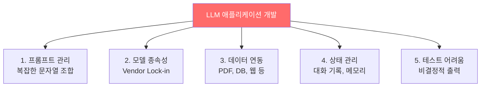
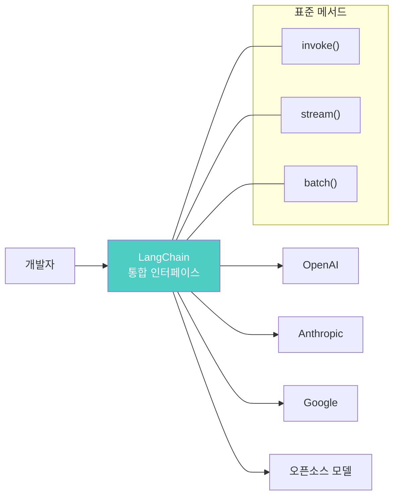
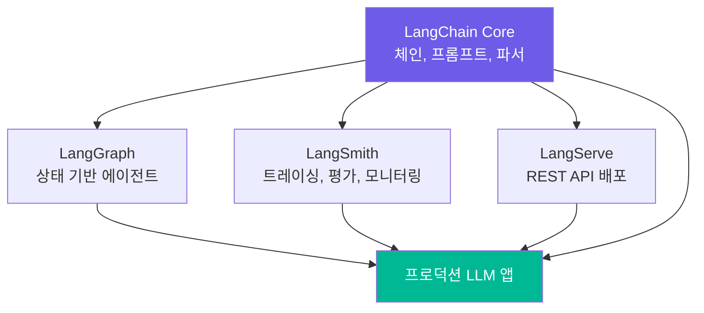
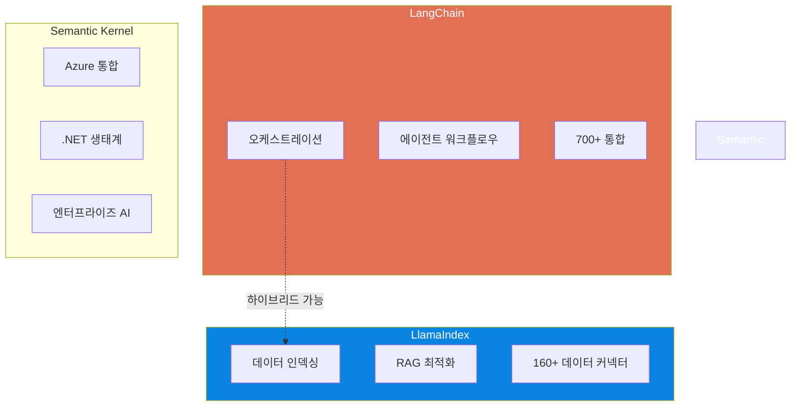

# LLM 애플리케이션의 진화와 LangChain

> LLM 시대의 개발 패러다임이 바뀌었습니다. LangChain이 그 변화의 중심에 있는 이유를 알아봅니다.

## 개요

이 섹션에서는 LLM(Large Language Model) 기반 애플리케이션 개발이 왜 어려운지, 그 도전 과제를 살펴보고, LangChain이 이를 어떻게 해결하는지 이해합니다. 또한 LangChain, LlamaIndex, Semantic Kernel 등 주요 프레임워크를 비교하여 각각의 강점과 적합한 사용 사례를 파악합니다.

**선수 지식**: Python 기본 문법, API 호출 경험(requests 라이브러리 등), LLM에 대한 기초적 이해
**학습 목표**:
- LLM 애플리케이션 개발의 주요 도전 과제 5가지를 설명할 수 있다
- LangChain이 해결하는 핵심 문제와 설계 철학을 이해한다
- LangChain, LlamaIndex, Semantic Kernel의 차이점과 적합한 사용 사례를 비교할 수 있다

## 왜 알아야 할까?

2022년 말 ChatGPT가 등장한 이후, "우리 서비스에도 AI를 붙여보자"는 이야기가 모든 개발 조직에서 나오기 시작했습니다. 하지만 실제로 OpenAI API 하나를 호출하는 것과, 프로덕션에서 안정적으로 동작하는 LLM 애플리케이션을 만드는 것 사이에는 거대한 간극이 있거든요.

프롬프트 관리, 모델 교체, 외부 데이터 연동, 대화 기록 관리, 에이전트 구축... 이 모든 것을 처음부터 직접 만들면 어떨까요? 가능은 하지만, 마치 웹 프레임워크 없이 소켓 프로그래밍부터 시작하는 것과 비슷합니다. LangChain은 이런 반복적인 문제를 해결하는 **LLM 애플리케이션의 Django**와 같은 존재입니다.

이 첫 번째 세션에서 전체 그림을 이해해두면, 앞으로 20개 챕터에 걸쳐 배울 내용이 왜 필요하고 어디에 위치하는지 명확한 지도를 갖게 됩니다.

## 핵심 개념

### 개념 1: LLM 애플리케이션 개발의 도전 과제

> 💡 **비유**: 레고 블록 없이 나무를 깎아서 성을 만든다고 상상해보세요. 나무를 깎는 기술이 아무리 뛰어나도, 표준화된 블록이 없으면 매번 처음부터 시작해야 합니다. LLM API를 직접 다루는 것은 이 "나무 깎기"와 같습니다.

LLM API를 직접 호출하여 애플리케이션을 만들 때, 개발자들이 공통적으로 부딪히는 도전 과제가 있습니다.

> 📊 **그림 1**: LLM 애플리케이션 개발의 5가지 도전 과제




**1. 프롬프트 관리의 복잡성**

프롬프트는 단순한 문자열이 아닙니다. 시스템 메시지, 사용자 입력, 맥락 정보, 출력 형식 지정 등이 뒤섞이면 금세 관리가 어려워지죠.

```python
# ❌ 프롬프트를 직접 문자열로 관리하면 이렇게 됩니다
def generate_response(user_input: str, context: str, language: str) -> str:
    prompt = f"""당신은 {language} 전문가입니다.
다음 맥락을 참고하여 질문에 답변하세요.

맥락: {context}

질문: {user_input}

답변 형식:
- 핵심 답변을 먼저
- 그 다음 상세 설명
- 마지막에 관련 예제"""
    # 프롬프트가 길어질수록, 변수가 많아질수록 관리가 힘들어집니다
    response = openai.chat.completions.create(
        model="gpt-4o",
        messages=[{"role": "user", "content": prompt}]
    )
    return response.choices[0].message.content
```

**2. 모델 종속성(Vendor Lock-in)**

OpenAI에서 Anthropic으로, 또는 오픈소스 모델로 바꾸고 싶을 때 어떻게 될까요? API 형식, 파라미터 이름, 응답 구조가 모두 달라서 코드 전체를 수정해야 합니다.

**3. 데이터 연동의 어려움**

LLM은 학습 데이터에 포함되지 않은 최신 정보나 조직 내부 데이터를 알지 못합니다. PDF, 데이터베이스, 웹 페이지 등 다양한 소스에서 데이터를 가져와 LLM에 전달하는 파이프라인을 구축해야 하는데, 이것 자체가 하나의 프로젝트 규모가 되기도 합니다.

**4. 상태 관리와 메모리**

"방금 내가 뭐라고 했는지 기억해?"라는 간단한 요구사항도 LLM API만으로는 구현이 까다롭습니다. 대화 기록을 저장하고, 적절히 요약하고, 토큰 제한 내에서 관리하는 로직이 필요합니다.

**5. 테스트와 품질 보증**

LLM은 비결정적(non-deterministic)입니다. 같은 입력에 대해 매번 다른 출력이 나올 수 있어서, 전통적인 단위 테스트 방식으로는 품질을 보장하기 어렵습니다.

```python
# 같은 질문인데 매번 답이 다릅니다
assert ask_llm("1+1은?") == "2"  # 어떤 때는 "2입니다", "답은 2예요" ...
```

> ⚠️ **흔한 오해**: "LLM API를 호출할 줄 알면 LLM 애플리케이션을 만들 수 있다"고 생각하기 쉽습니다. 하지만 API 호출은 전체 개발의 약 10%에 불과합니다. 나머지 90%는 프롬프트 관리, 에러 처리, 데이터 파이프라인, 상태 관리, 모니터링 등 **주변 인프라**입니다.

### 개념 2: LangChain이 해결하는 문제

> 💡 **비유**: LangChain은 LLM 애플리케이션의 **레고 시스템**입니다. 표준화된 블록(컴포넌트)을 제공하고, 블록끼리 끼워 맞추는 규칙(인터페이스)을 정의하며, 완성된 작품의 설명서(문서)까지 갖추고 있죠. 블록을 바꿔 끼우면(모델 교체) 나머지는 그대로 동작합니다.

LangChain은 위에서 언급한 도전 과제들을 **추상화 계층(Abstraction Layer)**으로 해결합니다. 핵심 설계 철학은 다음과 같습니다.

> 📊 **그림 2**: LangChain 추상화 계층 — 개발자와 LLM 사이의 다리




**통합 인터페이스(Unified Interface)**

모든 LLM — OpenAI, Anthropic, Google, 오픈소스 모델 — 을 동일한 인터페이스로 다룹니다. `invoke()`, `stream()`, `batch()` 같은 메서드가 모델에 관계없이 동일하게 동작하거든요.

```python
from langchain_openai import ChatOpenAI
from langchain_anthropic import ChatAnthropic

# 모델만 바꾸면 나머지 코드는 그대로!
# model = ChatOpenAI(model="gpt-4o")
model = ChatAnthropic(model="claude-sonnet-4-20250514")

# 동일한 인터페이스로 호출
response = model.invoke("LangChain이 뭔가요?")
print(response.content)
```

**모듈식 구성(Modular Composition)**

프롬프트 템플릿, LLM, 출력 파서, 검색기 등을 독립적인 모듈로 분리하고, LCEL(LangChain Expression Language)의 파이프 연산자(`|`)로 자유롭게 조합합니다.

```python
from langchain_core.prompts import ChatPromptTemplate
from langchain_core.output_parsers import StrOutputParser
from langchain_openai import ChatOpenAI

# 각 컴포넌트를 레고 블록처럼 조립
prompt = ChatPromptTemplate.from_template("{topic}에 대해 간단히 설명해주세요.")
model = ChatOpenAI(model="gpt-4o")
parser = StrOutputParser()

# 파이프 연산자로 체인 구성
chain = prompt | model | parser

# 실행
result = chain.invoke({"topic": "인공지능"})
print(result)
```

**풍부한 생태계**

LangChain은 단독 라이브러리가 아니라 하나의 생태계입니다.

> 📊 **그림 3**: LangChain 생태계 구성 요소




| 구성 요소 | 역할 | 비유 |
|-----------|------|------|
| **LangChain** | 핵심 프레임워크 — 체인, 프롬프트, 파서 등 | 레고 블록 |
| **LangGraph** | 상태 기반 에이전트 워크플로우 구축 | 레고 테크닉(복잡한 기계) |
| **LangSmith** | 트레이싱, 평가, 모니터링 플랫폼 | 품질 검사 장비 |
| **LangServe** | 체인을 REST API로 배포 | 완성품 전시대 |

### 개념 3: 프레임워크 비교 — LangChain vs LlamaIndex vs Semantic Kernel

> 💡 **비유**: 요리에 비유하면, **LangChain**은 만능 주방(모든 요리를 할 수 있는 풀 키친), **LlamaIndex**는 최고의 냉장고 정리 시스템(데이터를 찾고 가져오는 데 특화), **Semantic Kernel**은 Microsoft 호텔 주방(MS 생태계와 완벽 통합)입니다.

세 프레임워크는 LLM 애플리케이션 개발이라는 같은 문제를 풀지만, 접근 방식과 강점이 다릅니다.

> 📊 **그림 4**: 프레임워크별 핵심 영역 비교




**LangChain — 만능 오케스트레이터**

- **강점**: 가장 넓은 통합 범위(700+ 통합), 유연한 체인 구성, 활발한 커뮤니티
- **철학**: "모든 LLM 워크플로우를 조합 가능한 컴포넌트로"
- **적합한 경우**: 복잡한 에이전트 시스템, 다양한 도구 연동, 프로토타입부터 프로덕션까지
- **언어**: Python, JavaScript/TypeScript

**LlamaIndex — 데이터 전문가**

- **강점**: 160+ 데이터 커넥터, 정교한 인덱싱 전략, 최적화된 검색 엔진
- **철학**: "데이터를 LLM에 연결하는 최고의 방법"
- **적합한 경우**: RAG 시스템, 문서 QA, 데이터 중심 애플리케이션
- **언어**: Python, JavaScript/TypeScript

**Semantic Kernel — Microsoft 생태계 특화**

- **강점**: Azure/Microsoft 서비스 긴밀 통합, 엔터프라이즈 지원, .NET 생태계 최적화
- **철학**: "기존 엔터프라이즈 앱에 AI를 자연스럽게 통합"
- **적합한 경우**: .NET 기반 프로젝트, Azure 환경, Microsoft 365 연동
- **언어**: C#/.NET (주력), Python, Java

```python
# 세 프레임워크의 "Hello World" 비교

# === LangChain ===
from langchain_openai import ChatOpenAI
from langchain_core.prompts import ChatPromptTemplate

prompt = ChatPromptTemplate.from_template("{question}에 대해 답변해주세요.")
model = ChatOpenAI(model="gpt-4o")
chain = prompt | model
result = chain.invoke({"question": "파이썬이란?"})

# === LlamaIndex ===
# from llama_index.llms.openai import OpenAI
# llm = OpenAI(model="gpt-4o")
# response = llm.complete("파이썬이란 무엇인가요?")

# === Semantic Kernel (Python) ===
# import semantic_kernel as sk
# kernel = sk.Kernel()
# kernel.add_service(OpenAIChatCompletion(service_id="chat", ai_model_id="gpt-4o"))
```

> 🔥 **실무 팁**: 실무에서는 프레임워크를 하나만 고집할 필요가 없습니다. 많은 프로덕션 환경에서 **LlamaIndex로 데이터 파이프라인**을 구축하고, **LangChain/LangGraph로 에이전트를 오케스트레이션**하는 하이브리드 구조를 사용합니다. 도구는 목적에 맞게 선택하세요.

| 비교 항목 | LangChain | LlamaIndex | Semantic Kernel |
|-----------|-----------|------------|-----------------|
| 핵심 강점 | 오케스트레이션, 에이전트 | 데이터 검색, RAG | MS 생태계 통합 |
| 통합 수 | 700+ | 160+ 데이터 커넥터 | Azure 중심 |
| 주력 언어 | Python, JS/TS | Python, JS/TS | C#, Python, Java |
| 학습 곡선 | 중간 | 낮음(RAG 한정) | 낮음(.NET 개발자) |
| 커뮤니티 | ⭐⭐⭐⭐⭐ | ⭐⭐⭐⭐ | ⭐⭐⭐ |
| 에이전트 지원 | LangGraph (강력) | 기본 제공 | 기본 제공 |
| 적합한 프로젝트 | 범용 LLM 앱 | 데이터 중심 앱 | 엔터프라이즈/MS |

## 실습: 직접 해보기

LLM API를 직접 호출하는 방식과 LangChain을 사용하는 방식을 비교해봅시다. 아직 환경 설정은 다음 세션에서 다루므로, 여기서는 코드 구조의 차이를 이해하는 데 집중합니다.

```python
"""
LLM API 직접 호출 vs LangChain 사용 비교
- 환경 설정은 다음 세션(1.2)에서 상세히 다룹니다
- 여기서는 코드 구조의 차이를 이해하는 데 집중하세요
"""

# ============================================
# 방법 1: OpenAI API 직접 호출 (프레임워크 없이)
# ============================================
import os
from openai import OpenAI

# API 키 설정 (실제로는 .env 파일에서 로드)
# os.environ["OPENAI_API_KEY"] = "your-api-key"

client = OpenAI()

def translate_direct(text: str, target_lang: str) -> str:
    """OpenAI API를 직접 호출하는 번역 함수"""
    # 프롬프트를 직접 문자열로 구성해야 합니다
    response = client.chat.completions.create(
        model="gpt-4o",
        messages=[
            {
                "role": "system",
                "content": f"당신은 전문 번역가입니다. {target_lang}로 번역해주세요."
            },
            {
                "role": "user",
                "content": text
            }
        ],
        temperature=0.3
    )
    # 응답에서 텍스트를 직접 추출해야 합니다
    return response.choices[0].message.content


# ============================================
# 방법 2: LangChain 사용
# ============================================
from langchain_openai import ChatOpenAI
from langchain_core.prompts import ChatPromptTemplate
from langchain_core.output_parsers import StrOutputParser

def translate_langchain(text: str, target_lang: str) -> str:
    """LangChain을 사용한 번역 함수"""
    # 프롬프트 템플릿 — 재사용 가능하고 관리하기 쉽습니다
    prompt = ChatPromptTemplate.from_messages([
        ("system", "당신은 전문 번역가입니다. {target_lang}로 번역해주세요."),
        ("human", "{text}")
    ])

    # 모델 — 이 한 줄만 바꾸면 다른 LLM으로 교체 가능
    model = ChatOpenAI(model="gpt-4o", temperature=0.3)

    # 출력 파서 — 응답에서 텍스트를 자동 추출
    parser = StrOutputParser()

    # 체인 구성 — 파이프 연산자로 조립
    chain = prompt | model | parser

    # 실행 — 딕셔너리로 변수 전달
    return chain.invoke({"text": text, "target_lang": target_lang})


# ============================================
# 실행 비교
# ============================================
if __name__ == "__main__":
    sample_text = "인공지능은 인류의 미래를 바꿀 기술입니다."

    # 방법 1: 직접 호출
    # result1 = translate_direct(sample_text, "English")
    # print(f"직접 호출 결과: {result1}")

    # 방법 2: LangChain
    # result2 = translate_langchain(sample_text, "English")
    # print(f"LangChain 결과: {result2}")

    # 💡 LangChain의 진짜 장점: 모델을 교체해도 나머지 코드가 변하지 않습니다
    # model = ChatAnthropic(model="claude-sonnet-4-20250514")  # 이 한 줄만 바꾸면 OK!

    print("✅ 코드 구조를 비교해보세요:")
    print("  - 직접 호출: 모델별 API 형식에 종속")
    print("  - LangChain: 표준화된 인터페이스, 모듈 교체 가능")
    print("  - 다음 세션에서 환경을 설정한 후 직접 실행해봅니다!")
```

```
# 예상 출력:
# ✅ 코드 구조를 비교해보세요:
#   - 직접 호출: 모델별 API 형식에 종속
#   - LangChain: 표준화된 인터페이스, 모듈 교체 가능
#   - 다음 세션에서 환경을 설정한 후 직접 실행해봅니다!
```

## 더 깊이 알아보기

### LangChain의 탄생 — 해커톤에서 시작된 혁명

LangChain의 탄생 이야기는 놀라울 정도로 소박합니다. 2022년, Harrison Chase는 ML 모델 검증 회사 Robust Intelligence에서 일하고 있었습니다. 어느 날 회사 해커톤에서 그는 회사 내부 Notion과 Slack 데이터를 활용해 질문에 답하는 챗봇을 만들었는데요 — 지금 우리가 **RAG(Retrieval-Augmented Generation)**라고 부르는 바로 그 패턴이었습니다.

당시 Stable Diffusion의 등장으로 생성형 AI 밋업이 활발해지면서, Chase는 사람들이 텍스트 LLM으로 비슷한 것들을 반복해서 만들고 있다는 것을 깨달았습니다. "공통 추상화가 필요하다"는 확신을 가진 그는 2022년 10월 16일부터 25일까지, 단 열흘 만에 LLM Math, Self-Ask With Search, NatBot 등 핵심 구현체를 만들어 공개합니다.

재미있는 점은, LangChain의 최초 커밋은 Python의 `formatter.format`을 감싼 **프롬프트 템플릿**이었다는 것입니다. 지금은 수백 개의 통합을 가진 거대한 프레임워크가 되었지만, 시작은 문자열 포매팅 유틸리티 하나였죠.

2023년 1월에 회사를 설립한 후, Ankush Gola와 공동 창업하여 그해 4월에 Benchmark의 $10M 시드 투자와 Sequoia의 약 $20~25M 시리즈 A 투자를 연달아 유치합니다. 오픈소스 프로젝트가 6개월 만에 이런 속도로 성장한 것은 LLM 애플리케이션 프레임워크에 대한 시장의 갈증이 그만큼 컸다는 증거이기도 합니다.

> 💡 **알고 계셨나요?**: "LangChain"이라는 이름은 **Language + Chain**의 합성어입니다. 언어 모델을 체인처럼 엮는다는 의미죠. Harrison Chase가 Harvard 재학 시절에는 스포츠 분석 동아리(Sports Analytics Collective)에서 활동했는데, 데이터 분석에 대한 관심이 결국 ML 엔지니어, 그리고 LangChain 창시자로 이어진 셈입니다.

### LLM 프레임워크 전쟁의 연대기

| 시기 | 사건 |
|------|------|
| 2022.06 | OpenAI text-davinci-002 공개 |
| 2022.10 | Harrison Chase, LangChain 최초 커밋 |
| 2022.11 | LangChain 공개, ChatGPT 출시 |
| 2023.01 | LangChain 회사 설립 |
| 2023.04 | LangChain 시드 + 시리즈 A 투자 유치 |
| 2023.07 | LangSmith 베타 출시 |
| 2024.01 | LangChain v0.1.0 — 모듈 분리(core, community, 통합 패키지) |
| 2024.01 | LangGraph 출시 — 상태 기반 에이전트 구축 |
| 2024 초 | LangSmith GA(일반 사용 가능) |
| 2025.12 | LangChain MCP Adapters 0.2.0 출시 |
| 2026.02 | langchain-core 1.2.16 릴리스 |

## 흔한 오해와 팁

> ⚠️ **흔한 오해**: "LangChain을 쓰면 무조건 좋다"고 생각하기 쉽지만, 간단한 API 호출 한두 개로 끝나는 프로젝트에 LangChain을 도입하면 오히려 **과도한 추상화(Over-engineering)**가 됩니다. 프레임워크는 복잡성을 관리하기 위한 도구이지, 복잡성을 추가하기 위한 도구가 아닙니다. "이 프로젝트에 정말 프레임워크가 필요한가?"를 먼저 자문하세요.

> 💡 **알고 계셨나요?**: LangChain의 GitHub 스타 수는 공개 후 불과 몇 달 만에 수만 개를 돌파했습니다. 이는 오픈소스 역사상 가장 빠른 성장 속도 중 하나입니다. 그만큼 LLM 애플리케이션 프레임워크에 대한 개발자 커뮤니티의 수요가 폭발적이었다는 의미입니다.

> 🔥 **실무 팁**: 프레임워크를 선택할 때는 **"지금 만들려는 것이 무엇인가"**를 기준으로 판단하세요. RAG 중심이라면 LlamaIndex부터 살펴보고, 복잡한 에이전트 워크플로우라면 LangChain + LangGraph, Microsoft 생태계라면 Semantic Kernel이 좋은 출발점입니다. 그리고 프로젝트가 성장하면서 필요에 따라 조합하면 됩니다.

## 핵심 정리

| 개념 | 설명 |
|------|------|
| LLM 앱 개발 과제 | 프롬프트 관리, 모델 종속성, 데이터 연동, 상태 관리, 테스트 어려움 |
| LangChain 핵심 철학 | 통합 인터페이스 + 모듈식 구성 + 풍부한 생태계 |
| Runnable 인터페이스 | invoke/stream/batch 등 모든 컴포넌트의 통합 실행 인터페이스 |
| LCEL | 파이프 연산자(`\|`)로 컴포넌트를 조합하는 선언적 체인 구성 언어 |
| LangChain 생태계 | LangChain(핵심) + LangGraph(에이전트) + LangSmith(관찰) + LangServe(배포) |
| LlamaIndex | 데이터 검색과 RAG에 특화된 프레임워크 |
| Semantic Kernel | Microsoft/.NET 생태계에 최적화된 AI 프레임워크 |
| 프레임워크 선택 기준 | 프로젝트 요구사항(범용 vs 데이터 중심 vs 엔터프라이즈)에 따라 선택 |

## 다음 섹션 미리보기

이번 세션에서 LangChain의 존재 이유와 전체 그림을 살펴봤습니다. 다음 세션 **"LangChain 아키텍처 톺아보기"**에서는 LangChain의 내부 구조를 파고듭니다. `langchain-core`, `langchain-community`, 통합 패키지가 어떻게 분리되어 있고, Runnable 프로토콜이 모든 컴포넌트를 어떻게 하나로 묶는지 상세히 알아볼 예정입니다. LangChain의 "레고 블록"이 실제로 어떤 모양인지 확인하게 될 거예요.

## 참고 자료

- [LangChain 공식 문서](https://docs.langchain.com) — LangChain 시작부터 고급 기능까지 모든 것을 다루는 공식 가이드
- [LangChain GitHub 저장소](https://github.com/langchain-ai/langchain) — 소스 코드와 최신 릴리스 확인
- [Founder Story: Harrison Chase of LangChain](https://www.frederick.ai/blog/harrison-chase-langchain) — LangChain 창시자 Harrison Chase의 창업 스토리
- [The Point of LangChain — Latent Space Podcast](https://www.latent.space/p/langchain) — Harrison Chase가 직접 설명하는 LangChain의 설계 철학
- [LangChain Business Breakdown & Founding Story — Contrary Research](https://research.contrary.com/company/langchain) — LangChain의 비즈니스 분석과 성장 과정
- [LlamaIndex vs LangChain: What's the difference? — IBM](https://www.ibm.com/think/topics/llamaindex-vs-langchain) — IBM이 정리한 두 프레임워크의 객관적 비교
- [Use-Case Based Comparison: LangChain vs LlamaIndex — Kanerika](https://kanerika.com/blogs/langchain-vs-llamaindex/) — 사용 사례별 프레임워크 비교 가이드
- [A Detailed Comparison of Top 6 AI Agent Frameworks — Turing](https://www.turing.com/resources/ai-agent-frameworks) — 2026년 주요 AI 에이전트 프레임워크 비교

---