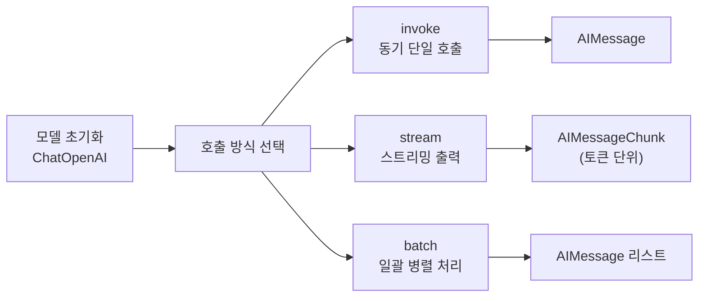
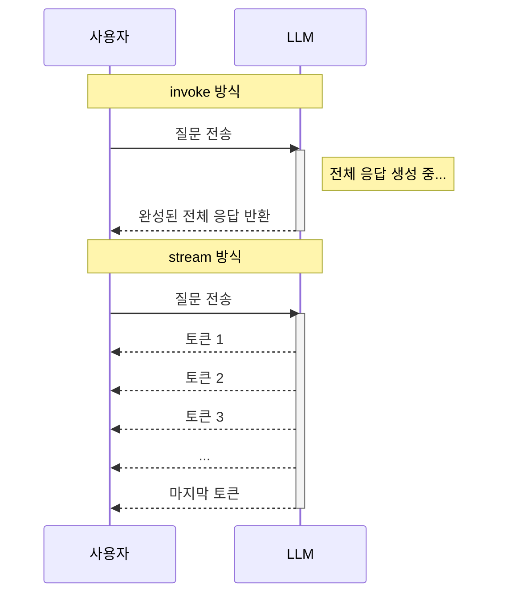
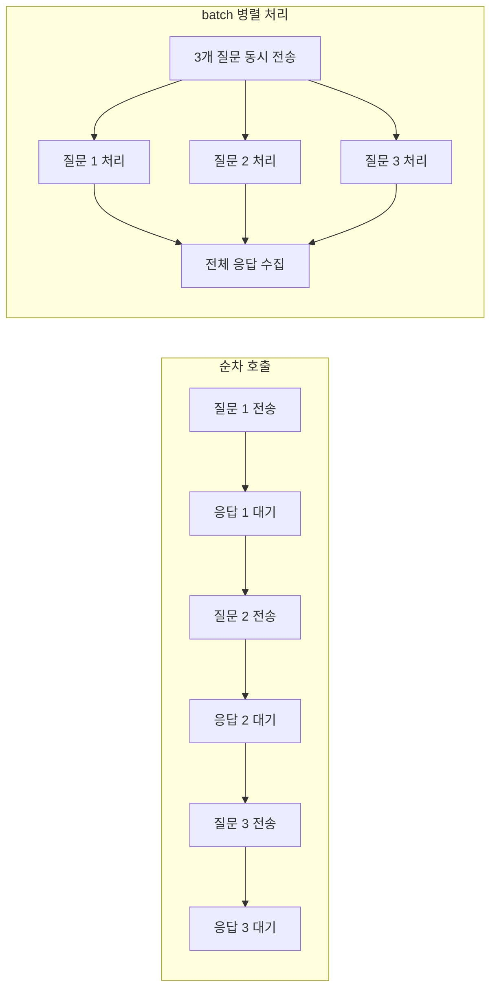
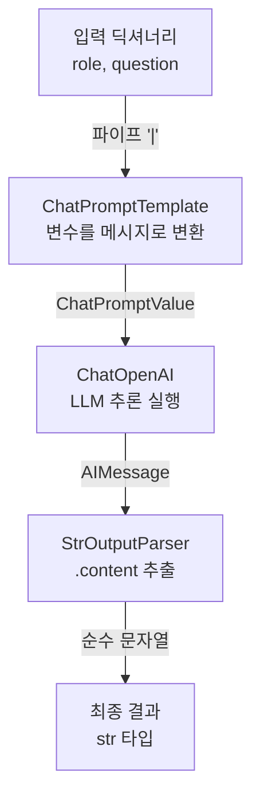
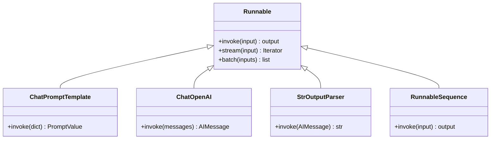

# 첫 번째 LangChain 애플리케이션

> ChatOpenAI 모델을 초기화하고, 프롬프트를 실행하고, 응답을 파싱하고, 스트리밍까지 — LangChain의 핵심 워크플로우를 직접 체험합니다.

## 개요

이 섹션에서는 LangChain을 사용해 실제로 LLM과 대화하는 첫 번째 애플리케이션을 만들어 봅니다. 환경 설정을 마쳤으니, 이제 코드를 작성하고 실행할 차례입니다.

**선수 지식**: [1.1 LLM 애플리케이션의 진화와 LangChain](ch01/session_1_1.md)에서 배운 LCEL 파이프 연산자(`|`)와 Runnable 개념, [1.3 개발 환경 설정](ch01/session_1_3.md)에서 구축한 가상환경과 API 키 설정

**학습 목표**:
- ChatOpenAI 모델을 다양한 파라미터로 초기화할 수 있다
- `invoke`, `stream`, `batch` 메서드로 LLM을 호출할 수 있다
- ChatPromptTemplate과 StrOutputParser를 조합하여 완전한 LCEL 체인을 구성할 수 있다
- 스트리밍 출력을 구현하여 사용자 경험을 개선할 수 있다

## 왜 알아야 할까?

> 📊 **그림 1**: LangChain 애플리케이션의 기본 구성 요소




여러분이 카페에서 커피를 주문한다고 생각해 보세요. "아메리카노 한 잔 주세요"라고 말하면, 바리스타가 원두를 갈고, 에스프레소를 추출하고, 뜨거운 물을 붓고, 컵에 담아 건네줍니다. 이 과정에서 여러분은 바리스타에게 **무엇을 원하는지**(프롬프트)만 전달하면 되고, 바리스타(모델)가 나머지를 처리하죠.

LangChain에서 ChatOpenAI를 다루는 것이 바로 이런 과정입니다. 모델을 초기화하는 건 바리스타에게 "오늘은 진한 원두로 부탁해요"라고 취향을 알려주는 것이고, `invoke`는 주문을 넣는 것이며, `stream`은 커피가 한 모금씩 나오는 걸 실시간으로 받아보는 것입니다.

이 세 가지 — **모델 초기화, 프롬프트 실행, 응답 처리** — 는 LangChain으로 만드는 모든 애플리케이션의 기본 뼈대입니다. RAG든, 에이전트든, 챗봇이든 결국 이 패턴 위에 세워지거든요.

## 핵심 개념

### 개념 1: ChatOpenAI 모델 초기화

> 💡 **비유**: ChatOpenAI를 초기화하는 것은 오디오 믹서의 노브를 조절하는 것과 같습니다. 볼륨(temperature)을 높이면 더 창의적인 출력이 나오고, 낮추면 일관된 출력이 나옵니다. 최대 길이(max_tokens)는 녹음 시간을 정하는 것과 같죠.

ChatOpenAI는 `langchain-openai` 패키지에서 제공하는 OpenAI 채팅 모델 래퍼입니다. [1.1 LLM 애플리케이션의 진화와 LangChain](ch01/session_1_1.md)에서 배운 Runnable 인터페이스를 구현하고 있어서, `invoke`, `stream`, `batch` 등 통합된 메서드를 사용할 수 있습니다.

```python
import os
from dotenv import load_dotenv
from langchain_openai import ChatOpenAI

# .env 파일에서 OPENAI_API_KEY 로드
load_dotenv()

# 기본 초기화 — 가장 간단한 형태
llm = ChatOpenAI(model="gpt-4o-mini")

# 상세 파라미터 지정
llm = ChatOpenAI(
    model="gpt-4o-mini",       # 사용할 모델 이름
    temperature=0.7,            # 창의성 조절 (0.0~2.0, 기본값 0.7)
    max_tokens=1000,            # 최대 응답 토큰 수
    timeout=30,                 # API 호출 타임아웃 (초)
    max_retries=2,              # 실패 시 재시도 횟수
)

print(type(llm))
# 출력: <class 'langchain_openai.chat_models.base.ChatOpenAI'>
```

주요 파라미터를 정리하면:

| 파라미터 | 설명 | 기본값 |
|----------|------|--------|
| `model` | OpenAI 모델 이름 | `"gpt-4o-mini"` |
| `temperature` | 출력의 무작위성 (0=결정적, 2=매우 창의적) | `0.7` |
| `max_tokens` | 응답의 최대 토큰 수 | `None` (모델 기본값) |
| `timeout` | API 호출 타임아웃 (초) | `None` |
| `max_retries` | 실패 시 재시도 횟수 | `2` |

### 개념 2: invoke — 동기 호출

> 💡 **비유**: `invoke`는 식당에서 주문하고 음식이 나올 때까지 자리에서 기다리는 것과 같습니다. 요청을 보내고, 전체 응답이 완성될 때까지 기다린 뒤, 한 번에 결과를 받습니다.

`invoke`는 가장 기본적인 호출 방식입니다. 입력을 넣으면 완성된 응답을 반환합니다.

```python
from langchain_openai import ChatOpenAI
from langchain_core.messages import HumanMessage, SystemMessage

llm = ChatOpenAI(model="gpt-4o-mini", temperature=0.7)

# 방법 1: 문자열로 직접 호출
response = llm.invoke("LangChain을 한 문장으로 설명해줘")
print(response.content)
# 출력: LangChain은 LLM 기반 애플리케이션 개발을 위한 오픈소스 프레임워크입니다.

# 방법 2: 메시지 객체로 호출 (역할 지정 가능)
messages = [
    SystemMessage(content="당신은 Python 전문가입니다. 간결하게 답변하세요."),
    HumanMessage(content="리스트 컴프리헨션이 뭔가요?"),
]
response = llm.invoke(messages)
print(response.content)
# 출력: 리스트 컴프리헨션은 기존 리스트를 기반으로 새 리스트를 간결하게 생성하는
#       Python 문법입니다. 예: [x**2 for x in range(10)]
```

`invoke`의 반환값은 `AIMessage` 객체인데요, `.content` 속성으로 텍스트를 꺼내고, `.response_metadata`로 토큰 사용량 같은 메타데이터를 확인할 수 있습니다.

```python
response = llm.invoke("안녕하세요!")

print(response.content)              # 응답 텍스트
print(response.response_metadata)    # 토큰 사용량, 모델 정보 등
# 출력 예: {'token_usage': {'prompt_tokens': 9, 'completion_tokens': 25, ...},
#           'model_name': 'gpt-4o-mini', ...}
```

### 개념 3: stream — 스트리밍 출력

> 💡 **비유**: `stream`은 넷플릭스 스트리밍과 같습니다. 영화 전체가 다운로드될 때까지 기다리지 않고, 데이터가 도착하는 대로 바로 재생하죠. LLM의 응답도 토큰 단위로 생성되는 즉시 화면에 표시할 수 있습니다.

사용자 경험에서 가장 큰 차이를 만드는 기능이 바로 스트리밍입니다. 긴 응답을 기다리는 동안 빈 화면을 보는 것과, 글자가 하나씩 타이핑되는 것을 보는 것 — 체감 속도가 완전히 다릅니다.

> 📊 **그림 4**: invoke vs stream — 응답 수신 방식 비교




```python
from langchain_openai import ChatOpenAI

llm = ChatOpenAI(model="gpt-4o-mini", temperature=0.7)

# stream()은 AIMessageChunk 객체를 하나씩 yield하는 제너레이터
for chunk in llm.stream("Python의 장점 3가지를 알려줘"):
    print(chunk.content, end="", flush=True)  # 토큰 단위로 출력
# 출력: (한 글자씩 실시간으로 나타남)
# Python의 장점 3가지를 소개하겠습니다...
```

`stream()`이 반환하는 각 `AIMessageChunk`는 전체 응답의 조각입니다. `end=""`로 줄바꿈 없이 이어 붙이고, `flush=True`로 버퍼를 즉시 비워서 실시간 효과를 만드는 것이 핵심이에요.

### 개념 4: batch — 일괄 처리

> 💡 **비유**: `batch`는 세탁기에 빨래를 한꺼번에 넣는 것과 같습니다. 양말, 셔츠, 바지를 하나씩 돌리는 것보다 한 번에 돌리는 게 훨씬 효율적이죠.

여러 입력을 동시에 처리해야 할 때 `batch`를 사용합니다. 내부적으로 비동기 병렬 처리를 하므로 순차 호출보다 훨씬 빠릅니다.

> 📊 **그림 5**: batch 병렬 처리 vs 순차 호출




```python
from langchain_openai import ChatOpenAI

llm = ChatOpenAI(model="gpt-4o-mini", temperature=0.7)

# 여러 질문을 한 번에 처리
questions = [
    "Python이 뭔가요?",
    "JavaScript가 뭔가요?",
    "Rust가 뭔가요?",
]
responses = llm.batch(questions, config={"max_concurrency": 3})

for q, r in zip(questions, responses):
    print(f"Q: {q}")
    print(f"A: {r.content[:80]}...")  # 앞 80자만 출력
    print()
```

`max_concurrency`로 동시 실행 수를 조절할 수 있어서, API 속도 제한(Rate Limit)에 걸리지 않도록 관리할 수 있습니다.

### 개념 5: LCEL 체인 — 프롬프트 + 모델 + 파서 조합

> 💡 **비유**: LCEL 체인은 공장의 컨베이어 벨트와 같습니다. 원재료(사용자 입력)가 첫 번째 기계(프롬프트 템플릿)를 거쳐 가공되고, 두 번째 기계(LLM)에서 처리되고, 마지막 기계(파서)에서 포장되어 완제품(깔끔한 문자열)이 나옵니다. 파이프 연산자 `|`가 이 컨베이어 벨트의 역할을 합니다.

[1.1 LLM 애플리케이션의 진화와 LangChain](ch01/session_1_1.md)에서 파이프 연산자(`|`)를 잠깐 살펴봤는데, 이제 실제로 동작하는 완전한 체인을 만들어 보겠습니다.

```python
from langchain_openai import ChatOpenAI
from langchain_core.prompts import ChatPromptTemplate
from langchain_core.output_parsers import StrOutputParser

# 1단계: 프롬프트 템플릿 — 변수를 포함한 재사용 가능한 프롬프트
prompt = ChatPromptTemplate.from_messages([
    ("system", "당신은 {role} 전문가입니다. 초보자도 이해할 수 있게 설명하세요."),
    ("human", "{question}"),
])

# 2단계: 모델
llm = ChatOpenAI(model="gpt-4o-mini", temperature=0.7)

# 3단계: 출력 파서 — AIMessage에서 순수 문자열만 추출
parser = StrOutputParser()

# LCEL 체인 조합: 프롬프트 | 모델 | 파서
chain = prompt | llm | parser

# 체인 실행 — 변수를 딕셔너리로 전달
result = chain.invoke({
    "role": "Python",
    "question": "데코레이터가 뭔가요?"
})

print(result)  # 이제 AIMessage가 아닌 깔끔한 문자열이 반환됩니다
print(type(result))
# 출력: <class 'str'>
```

체인의 데이터 흐름을 정리하면:

> 📊 **그림 3**: LCEL 체인의 데이터 변환 흐름




```
{"role": "Python", "question": "데코레이터가 뭔가요?"}
    ↓ ChatPromptTemplate
ChatPromptValue(messages=[SystemMessage(...), HumanMessage(...)])
    ↓ ChatOpenAI
AIMessage(content="데코레이터는 함수를 감싸서...")
    ↓ StrOutputParser
"데코레이터는 함수를 감싸서..."  ← 순수 문자열
```

이 체인도 Runnable이므로 `invoke`, `stream`, `batch` 모두 동일하게 사용할 수 있습니다.

```python
# 체인도 스트리밍 가능!
for chunk in chain.stream({"role": "요리", "question": "카르보나라 만드는 법"}):
    print(chunk, end="", flush=True)
```

## 실습: 직접 해보기

아래는 지금까지 배운 모든 개념을 통합한 완전한 예제입니다. 복사해서 바로 실행할 수 있습니다.

```python
"""
Session 1.4 실습: 첫 번째 LangChain 애플리케이션
- ChatOpenAI 초기화
- invoke / stream / batch 호출
- LCEL 체인 구성
"""

import os
import time
from dotenv import load_dotenv
from langchain_openai import ChatOpenAI
from langchain_core.prompts import ChatPromptTemplate
from langchain_core.output_parsers import StrOutputParser
from langchain_core.messages import HumanMessage, SystemMessage

# 환경 변수 로드
load_dotenv()

# ──────────────────────────────────────────────
# 1. 모델 초기화
# ──────────────────────────────────────────────
llm = ChatOpenAI(
    model="gpt-4o-mini",
    temperature=0.7,
    max_tokens=500,
)
print("✅ 모델 초기화 완료\n")

# ──────────────────────────────────────────────
# 2. invoke — 단일 호출
# ──────────────────────────────────────────────
print("=" * 50)
print("📌 invoke 테스트")
print("=" * 50)

response = llm.invoke("LangChain의 핵심 장점 3가지를 알려줘")
print(response.content)
print(f"\n📊 토큰 사용량: {response.response_metadata.get('token_usage', {})}")

# ──────────────────────────────────────────────
# 3. stream — 스트리밍 출력
# ──────────────────────────────────────────────
print("\n" + "=" * 50)
print("📌 stream 테스트")
print("=" * 50)

for chunk in llm.stream("Python 비동기 프로그래밍을 간단히 설명해줘"):
    print(chunk.content, end="", flush=True)
print()  # 줄바꿈

# ──────────────────────────────────────────────
# 4. batch — 일괄 처리
# ──────────────────────────────────────────────
print("\n" + "=" * 50)
print("📌 batch 테스트")
print("=" * 50)

languages = ["Python", "JavaScript", "Go"]
questions = [f"{lang}의 가장 큰 특징을 한 문장으로 말해줘" for lang in languages]

start = time.time()
responses = llm.batch(questions, config={"max_concurrency": 3})
elapsed = time.time() - start

for lang, resp in zip(languages, responses):
    print(f"  {lang}: {resp.content.strip()}")
print(f"\n⏱️ 소요 시간: {elapsed:.2f}초 (3개 질문 병렬 처리)")

# ──────────────────────────────────────────────
# 5. LCEL 체인 — 프롬프트 + 모델 + 파서
# ──────────────────────────────────────────────
print("\n" + "=" * 50)
print("📌 LCEL 체인 테스트")
print("=" * 50)

# 프롬프트 템플릿 정의
prompt = ChatPromptTemplate.from_messages([
    ("system", "당신은 {topic} 분야의 전문가입니다. "
               "초보자도 이해할 수 있도록 비유를 사용해 설명하세요."),
    ("human", "{question}"),
])

# 출력 파서 — AIMessage → 순수 문자열
parser = StrOutputParser()

# 체인 조합: 프롬프트 → 모델 → 파서
chain = prompt | llm | parser

# 체인 실행
result = chain.invoke({
    "topic": "머신러닝",
    "question": "과적합(overfitting)이 뭔가요?"
})
print(result)

# 체인 스트리밍
print("\n📌 체인 스트리밍:")
for chunk in chain.stream({
    "topic": "네트워크",
    "question": "REST API가 뭔가요?"
}):
    print(chunk, end="", flush=True)
print("\n\n✅ 모든 테스트 완료!")
```

실행하면 다음과 비슷한 결과가 나옵니다:

```
✅ 모델 초기화 완료

==================================================
📌 invoke 테스트
==================================================
LangChain의 핵심 장점 3가지:
1. 모듈식 구성 — 프롬프트, 모델, 파서를 레고처럼 조합할 수 있습니다.
2. 모델 독립성 — OpenAI, Anthropic 등 다양한 모델을 동일한 인터페이스로 사용합니다.
3. 풍부한 생태계 — LangSmith, LangGraph 등 개발·배포·모니터링 도구가 통합되어 있습니다.

📊 토큰 사용량: {'prompt_tokens': 18, 'completion_tokens': 120, ...}

==================================================
📌 stream 테스트
==================================================
Python 비동기 프로그래밍은 여러 작업을 동시에 처리하는 방식입니다...

==================================================
📌 batch 테스트
==================================================
  Python: 간결한 문법과 풍부한 라이브러리 생태계로 빠른 개발이 가능합니다.
  JavaScript: 브라우저와 서버 양쪽에서 실행 가능한 유일한 언어입니다.
  Go: 간결한 문법과 내장 동시성 지원으로 고성능 서버 개발에 최적화되어 있습니다.

⏱️ 소요 시간: 1.23초 (3개 질문 병렬 처리)

==================================================
📌 LCEL 체인 테스트
==================================================
과적합은 시험 전날 교과서를 통째로 외운 학생과 같습니다...

📌 체인 스트리밍:
REST API는 식당의 메뉴판과 같습니다...

✅ 모든 테스트 완료!
```

## 더 깊이 알아보기

### Harrison Chase와 LangChain의 탄생

LangChain은 2022년 10월, Harrison Chase라는 한 개발자의 개인 프로젝트로 시작되었습니다. Harvard에서 통계학과 컴퓨터과학을 전공한 Chase는 핀테크 스타트업 Kensho와 AI 안전 기업 Robust Intelligence에서 ML 엔지니어로 일하고 있었습니다.

2022년 초, Chase는 회사 내부의 Notion과 Slack 데이터를 LLM으로 검색하는 작업을 하다가 흥미로운 패턴을 발견했습니다. 주변 동료와 친구들도 모두 비슷한 코드를 반복해서 작성하고 있었거든요 — 프롬프트를 만들고, API를 호출하고, 응답을 파싱하는 코드 말입니다. "이 반복되는 패턴을 라이브러리로 만들면 어떨까?"라는 아이디어가 LangChain의 시작이었습니다.

2022년 10월 24일 첫 트윗과 함께 오픈소스로 공개된 LangChain은 폭발적으로 성장했습니다. 2023년 1월 법인을 설립하고, 같은 해 Benchmark로부터 1천만 달러 시드 투자, Sequoia로부터 2천만 달러 시리즈 A 투자를 유치했습니다. 한 개발자의 불편함에서 시작된 프로젝트가 AI 애플리케이션 개발의 사실상 표준 프레임워크가 된 것이죠.

### Runnable 프로토콜의 의미

오늘 사용한 `invoke`, `stream`, `batch`는 단순한 메서드가 아닙니다. LangChain의 모든 컴포넌트 — 프롬프트, 모델, 파서, 체인 — 가 동일한 **Runnable 인터페이스**를 구현합니다. 덕분에 어떤 컴포넌트든 `|` 연산자로 연결할 수 있고, 연결된 체인도 다시 Runnable이 되는 거죠. 이 일관성이 LangChain의 가장 강력한 설계 원칙입니다.

> 📊 **그림 2**: Runnable 인터페이스 — 모든 컴포넌트의 공통 프로토콜




## 흔한 오해와 팁

> ⚠️ **흔한 오해**: "ChatOpenAI와 OpenAI 클래스는 같은 것이다"
>
> `ChatOpenAI`와 `OpenAI`는 전혀 다릅니다. `ChatOpenAI`는 **채팅 모델**(`gpt-4o`, `gpt-4o-mini` 등)용이고, `OpenAI`는 레거시 **완성(Completion) 모델**(`text-davinci-003` 등)용입니다. 현재 OpenAI의 최신 모델은 모두 채팅 모델이므로, 거의 항상 `ChatOpenAI`를 사용해야 합니다.

> 💡 **알고 계셨나요?**: temperature 0은 정말 "결정적"일까요?
>
> `temperature=0`으로 설정해도 완전히 동일한 출력이 보장되지는 않습니다. OpenAI의 GPU 연산에서 부동소수점 연산 순서에 따른 미세한 차이가 발생할 수 있거든요. 완전한 재현성이 필요하다면 `temperature=0`과 함께 `seed` 파라미터를 지정하세요: `ChatOpenAI(model="gpt-4o-mini", temperature=0, model_kwargs={"seed": 42})`

> 🔥 **실무 팁**: 스트리밍은 UX를 극적으로 개선합니다
>
> 동일한 응답이라도 3초 후 한꺼번에 표시되는 것과, 0.3초 후부터 한 글자씩 나타나는 것은 사용자 체감이 완전히 다릅니다. 챗봇이나 대화형 인터페이스를 만든다면 **`stream`을 기본으로** 사용하세요. 첫 토큰이 도착하는 시간(Time to First Token, TTFT)이 사용자 만족도와 직결됩니다.

> 🔥 **실무 팁**: `batch` 사용 시 `max_concurrency` 설정을 잊지 마세요
>
> 기본값은 제한이 없어서 수백 개의 입력을 한꺼번에 보내면 API Rate Limit에 걸립니다. 일반적으로 `max_concurrency=5` 정도로 시작하고, OpenAI 계정의 Rate Limit에 맞춰 조절하세요.

## 핵심 정리

| 개념 | 설명 |
|------|------|
| `ChatOpenAI` | OpenAI 채팅 모델 래퍼. `model`, `temperature`, `max_tokens` 등으로 초기화 |
| `invoke` | 동기 호출. 전체 응답이 완성될 때까지 대기 후 `AIMessage` 반환 |
| `stream` | 스트리밍 호출. `AIMessageChunk`를 토큰 단위로 yield하는 제너레이터 반환 |
| `batch` | 일괄 호출. 여러 입력을 병렬 처리하여 `AIMessage` 리스트 반환 |
| `ChatPromptTemplate` | 변수를 포함한 재사용 가능한 프롬프트 구조 |
| `StrOutputParser` | `AIMessage`에서 순수 문자열(`.content`)만 추출하는 파서 |
| LCEL 체인 | `prompt \| llm \| parser` 형태로 컴포넌트를 연결하는 파이프라인 |

## 다음 섹션 미리보기

이제 LangChain으로 LLM을 호출하고, 체인을 구성하는 기본기를 익혔습니다. 다음 세션 **1.5: LangChain 생태계 탐험**에서는 LangSmith를 활용한 트레이싱과 디버깅, LangServe를 통한 API 배포, 그리고 LangGraph의 상태 기반 워크플로우 등 LangChain을 둘러싼 생태계 도구들을 살펴봅니다. 오늘 만든 체인이 실제 프로덕션 환경에서 어떻게 관찰되고 배포되는지 확인하게 될 거예요.

## 참고 자료

- [ChatOpenAI 공식 문서](https://python.langchain.com/api_reference/openai/chat_models/langchain_openai.chat_models.base.ChatOpenAI.html) — ChatOpenAI의 모든 파라미터와 메서드를 정리한 API 레퍼런스
- [LangChain ChatOpenAI 통합 가이드](https://docs.langchain.com/oss/python/integrations/chat/openai) — ChatOpenAI 설정부터 고급 기능까지 단계별 가이드
- [langchain-openai PyPI](https://pypi.org/project/langchain-openai/) — 최신 버전 정보와 변경 이력 확인
- [LangChain Streaming 가이드 (Aurelio AI)](https://www.aurelio.ai/learn/langchain-streaming) — 스트리밍 패턴의 다양한 활용법을 다룬 튜토리얼
- [Founder Story: Harrison Chase of LangChain](https://www.frederick.ai/blog/harrison-chase-langchain) — LangChain 창립자 Harrison Chase의 창업 스토리
- [The Point of LangChain — with Harrison Chase](https://www.latent.space/p/langchain) — LangChain의 설계 철학과 방향성에 대한 심층 인터뷰

---
### 🔗 Related Sessions
- [lcel](../01-langchain-소개와-개발-환경-설정/01-llm-애플리케이션의-진화와-langchain.md) (prerequisite)
- [runnable](../01-langchain-소개와-개발-환경-설정/01-llm-애플리케이션의-진화와-langchain.md) (prerequisite)
- [python-dotenv](../01-langchain-소개와-개발-환경-설정/03-개발-환경-설정.md) (prerequisite)
- [load_dotenv](../01-langchain-소개와-개발-환경-설정/03-개발-환경-설정.md) (prerequisite)
- [venv](../01-langchain-소개와-개발-환경-설정/03-개발-환경-설정.md) (prerequisite)
