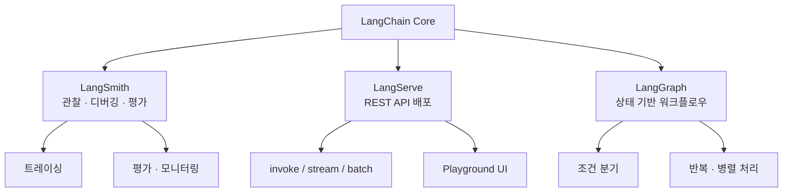
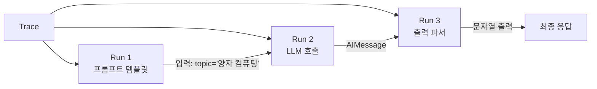
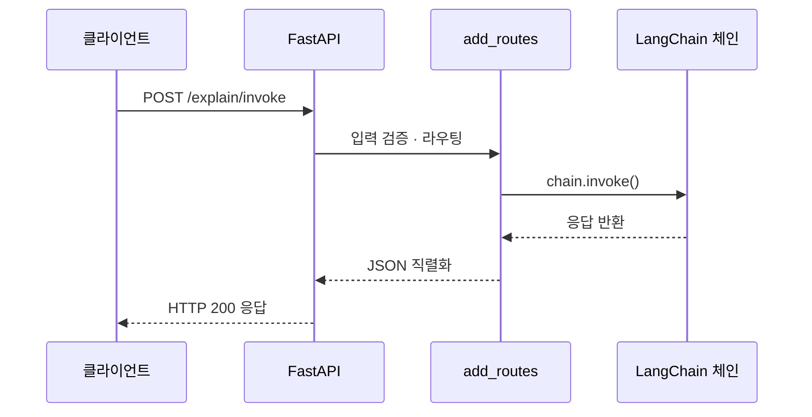
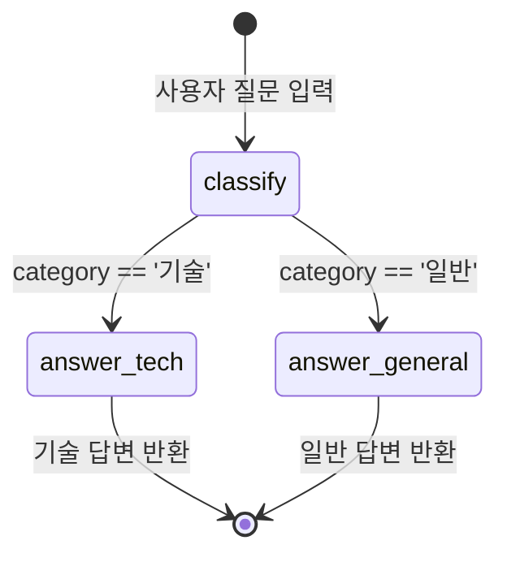

# LangChain 생태계 탐색

> LangSmith, LangServe, LangGraph — LangChain을 둘러싼 핵심 도구들을 만나보고, 여러분의 LLM 애플리케이션을 프로덕션 수준으로 끌어올리는 방법을 알아봅니다.

## 개요

이 섹션에서는 LangChain 프레임워크를 중심으로 형성된 **생태계 전체**를 조망합니다. 앞서 [Session 1.4: 첫 번째 LangChain 애플리케이션](ch01/session_04.md)에서 만든 체인을 **관찰하고(LangSmith)**, **배포하고(LangServe)**, **확장하는(LangGraph)** 도구들을 살펴보겠습니다.

**선수 지식**: Session 1.4에서 배운 ChatOpenAI, invoke/stream/batch 호출 패턴, LCEL 파이프 연산자(`|`)를 사용한 체인 구성
**학습 목표**:
- LangSmith 계정을 설정하고 트레이싱을 활성화하여 체인 실행을 관찰할 수 있다
- LangServe의 역할과 기본 배포 구조를 이해한다
- LangGraph의 상태 기반 그래프 개념을 파악하고, 간단한 워크플로우를 구성할 수 있다
- LangChain 생태계의 공식 학습 리소스와 커뮤니티를 활용할 수 있다

## 왜 알아야 할까?

코드를 작성하는 것과 그 코드를 **프로덕션에서 운영하는 것**은 완전히 다른 이야기입니다. 여러분이 만든 체인이 실제로 어떻게 동작하는지 눈으로 볼 수 없다면, 디버깅은 암흑 속에서 바늘 찾기가 됩니다. 사용자에게 서비스하려면 API로 배포해야 하고, 복잡한 비즈니스 로직을 처리하려면 단순 체인을 넘어선 워크플로우가 필요하죠.

LangChain 팀은 이런 현실적 문제를 해결하기 위해 **세 가지 핵심 도구**를 만들었습니다:

| 도구 | 역할 | 비유 |
|------|------|------|
| **LangSmith** | 관찰 · 디버깅 · 평가 | 자동차의 **계기판과 블랙박스** |
| **LangServe** | REST API 배포 | 요리를 **배달 서비스**에 올리기 |
| **LangGraph** | 복잡한 워크플로우 구축 | **지하철 노선도**처럼 경로를 설계 |

이 도구들을 모르고 LangChain만 사용하는 것은, 좋은 엔진을 가졌지만 계기판도 없고 도로도 없는 자동차를 모는 것과 같습니다.


> 📊 **그림 1**: LangChain 생태계 전체 구조



## 핵심 개념

### 개념 1: LangSmith — LLM 애플리케이션의 블랙박스

> 💡 **비유**: 비행기에는 블랙박스가 있어서 사고가 나면 무슨 일이 있었는지 정확히 추적할 수 있죠. LangSmith는 LLM 애플리케이션의 블랙박스입니다. 프롬프트에 뭘 넣었고, 모델이 뭘 출력했고, 각 단계에서 얼마나 시간이 걸렸는지 — 모든 것을 기록합니다.

LangSmith는 LangChain 애플리케이션의 **관찰 가능성(Observability) 플랫폼**입니다. 핵심 개념은 **트레이스(Trace)**인데요, 하나의 요청이 처리되는 전체 과정을 기록한 것입니다. 트레이스 안에는 개별 **런(Run)** — LLM 호출, 리트리버 검색 등 구체적인 작업 단위 — 이 포함됩니다.

#### LangSmith 설정하기

설정은 놀랍도록 간단합니다. 환경 변수 몇 개면 됩니다:

```python
# .env 파일에 추가
LANGCHAIN_TRACING_V2=true          # 트레이싱 활성화
LANGCHAIN_API_KEY=lsv2_pt_...      # LangSmith API 키
LANGCHAIN_PROJECT=my-first-project  # 프로젝트 이름 (선택)
LANGCHAIN_ENDPOINT=https://api.smith.langchain.com  # 엔드포인트 (기본값)
```

API 키는 [smith.langchain.com](https://smith.langchain.com)에서 계정을 만든 후 **Settings → API Keys**에서 발급받을 수 있습니다.

#### Python에서 트레이싱 활성화

```python
import os
from dotenv import load_dotenv

# .env 파일에서 환경 변수 로드
load_dotenv()

# 트레이싱이 활성화되어 있는지 확인
print(f"트레이싱 활성화: {os.getenv('LANGCHAIN_TRACING_V2')}")
print(f"프로젝트: {os.getenv('LANGCHAIN_PROJECT', 'default')}")
```

`LANGCHAIN_TRACING_V2=true`만 설정하면, 이후 실행하는 **모든 LangChain 코드의 트레이스가 자동으로 LangSmith에 기록**됩니다. 별도의 코드 수정이 필요 없다는 게 핵심이죠.

#### 트레이싱으로 확인할 수 있는 것들

```python
from langchain_openai import ChatOpenAI
from langchain_core.prompts import ChatPromptTemplate
from langchain_core.output_parsers import StrOutputParser

# 이 체인의 모든 실행이 LangSmith에 기록됩니다
llm = ChatOpenAI(model="gpt-4o", temperature=0.7)
prompt = ChatPromptTemplate.from_template("{topic}에 대한 한 줄 요약을 작성해주세요.")
chain = prompt | llm | StrOutputParser()

# invoke 호출 → LangSmith에서 트레이스 확인 가능
result = chain.invoke({"topic": "양자 컴퓨팅"})
print(result)
# 출력 예: "양자 컴퓨팅은 양자역학의 원리를 활용하여 기존 컴퓨터로는 불가능한 복잡한 계산을 수행하는 차세대 컴퓨팅 기술입니다."
```

이 코드를 실행한 뒤 [smith.langchain.com](https://smith.langchain.com)에 접속하면, 다음 정보를 확인할 수 있습니다:

> 📊 **그림 2**: LangSmith 트레이스 구조 — 체인 실행의 각 단계가 런(Run)으로 기록됩니다



- **입력**: `{topic: "양자 컴퓨팅"}`이 프롬프트 템플릿에 들어간 모습
- **프롬프트 → LLM**: 실제로 모델에 전달된 완성된 프롬프트
- **LLM 출력**: 모델의 원본 응답(AIMessage)
- **최종 출력**: StrOutputParser를 거친 문자열
- **지연 시간**: 각 단계별 소요 시간 (ms)

- **토큰 사용량**: 입력/출력 토큰 수와 비용

> 🔥 **실무 팁**: `LANGCHAIN_PROJECT` 환경 변수로 프로젝트를 분리하세요. 예를 들어 개발 중에는 `"dev"`, 테스트에는 `"staging"`, 운영에는 `"production"`으로 설정하면 트레이스를 환경별로 깔끔하게 관리할 수 있습니다.

### 개념 2: LangServe — 체인을 API로 배포하기

> 💡 **비유**: 여러분이 맛있는 요리를 만들 수 있다고 합시다. 하지만 손님에게 제공하려면 그릇에 담고, 메뉴판을 만들고, 주문을 받을 시스템이 필요하죠. LangServe는 여러분의 LangChain 체인(요리)을 REST API(레스토랑)로 바꿔주는 도구입니다.

LangServe는 LangChain의 Runnable을 **FastAPI 기반 REST API**로 쉽게 배포할 수 있게 해주는 라이브러리입니다. `add_routes()` 함수 하나로 여러 엔드포인트가 자동 생성되거든요:

| 엔드포인트 | 용도 |
|-----------|------|
| `/invoke` | 단일 입력 처리 |
| `/batch` | 여러 입력 일괄 처리 |
| `/stream` | 스트리밍 응답 |
| `/playground` | 브라우저에서 직접 테스트하는 UI |

#### 기본 구조

```python
# server.py
from fastapi import FastAPI
from langserve import add_routes
from langchain_openai import ChatOpenAI
from langchain_core.prompts import ChatPromptTemplate
from langchain_core.output_parsers import StrOutputParser

# FastAPI 앱 생성
app = FastAPI(
    title="내 첫 LangServe API",
    version="1.0",
    description="LangChain 체인을 REST API로 배포하는 예제",
)

# 체인 정의 (Session 1.4에서 만든 것과 동일!)
llm = ChatOpenAI(model="gpt-4o", temperature=0.7)
prompt = ChatPromptTemplate.from_template("{topic}에 대해 쉽게 설명해주세요.")
chain = prompt | llm | StrOutputParser()

# 이 한 줄이 핵심! 체인을 API로 등록
add_routes(app, chain, path="/explain")

if __name__ == "__main__":
    import uvicorn
    uvicorn.run(app, host="localhost", port=8000)
```

이 서버를 실행하면 다음과 같이 호출할 수 있습니다:

```bash
# 서버 실행
python server.py

# 다른 터미널에서 API 호출
curl -X POST "http://localhost:8000/explain/invoke" \
  -H "Content-Type: application/json" \
  -d '{"input": {"topic": "블록체인"}}'
```

`http://localhost:8000/explain/playground`에 접속하면 **브라우저에서 바로 테스트**할 수 있는 Playground UI도 제공됩니다. Swagger 문서는 `http://localhost:8000/docs`에서 자동 생성되죠.


> 📊 **그림 3**: LangServe의 요청 처리 흐름



> ⚠️ **흔한 오해**: "LangServe를 꼭 써야 API를 만들 수 있나요?" — 아닙니다! FastAPI만으로도 충분히 LangChain API를 만들 수 있습니다. LangServe는 반복적인 보일러플레이트(입력 검증, 스트리밍 처리, Playground 생성 등)를 자동화해주는 **편의 도구**입니다. 프로덕션에서 더 세밀한 제어가 필요하면 FastAPI를 직접 사용하는 것도 좋은 선택이에요.

### 개념 3: LangGraph — 상태 기반 워크플로우

> 💡 **비유**: 지하철 노선도를 생각해보세요. 승객(데이터)이 출발역에서 시작해서, 환승(조건 분기)을 거치며, 도착역(최종 결과)에 도달합니다. 어떤 노선(경로)을 탈지는 현재 상태에 따라 달라지죠. LangGraph는 이런 **노선도를 설계하는 도구**입니다.

LangChain의 LCEL 체인은 **직선적**입니다 — A → B → C 순서대로 흘러가죠. 하지만 현실의 AI 워크플로우는 더 복잡합니다. "LLM이 확신이 없으면 다시 검색하고, 확신이 있으면 바로 응답한다"처럼 **조건 분기, 반복, 병렬 처리**가 필요하거든요.

LangGraph는 이런 복잡한 워크플로우를 **상태 그래프(StateGraph)**로 모델링합니다:

- **노드(Node)**: 실제 작업을 수행하는 단계 (LLM 호출, 데이터 처리 등)
- **엣지(Edge)**: 노드 사이의 전환 규칙
- **상태(State)**: 그래프 전체에서 공유되는 데이터

#### 간단한 LangGraph 예제

```python
from typing import TypedDict
from langgraph.graph import StateGraph, START, END

# 1. 상태 정의 — 그래프 전체에서 공유되는 데이터 구조
class State(TypedDict):
    question: str    # 사용자 질문
    category: str    # 질문 분류
    answer: str      # 최종 답변

# 2. 노드 정의 — 각 단계에서 수행할 작업
def classify(state: State) -> dict:
    """질문을 분류하는 노드"""
    question = state["question"]
    # 간단한 키워드 기반 분류 (실제로는 LLM 사용)
    if "코드" in question or "프로그래밍" in question:
        category = "기술"
    else:
        category = "일반"
    return {"category": category}

def answer_tech(state: State) -> dict:
    """기술 질문에 답변하는 노드"""
    return {"answer": f"[기술 답변] '{state['question']}'에 대한 기술적 설명입니다."}

def answer_general(state: State) -> dict:
    """일반 질문에 답변하는 노드"""
    return {"answer": f"[일반 답변] '{state['question']}'에 대한 일반적 설명입니다."}

# 3. 라우팅 함수 — 조건에 따라 다른 경로 선택
def route_question(state: State) -> str:
    if state["category"] == "기술":
        return "answer_tech"
    return "answer_general"

# 4. 그래프 구성
graph = StateGraph(State)

# 노드 추가
graph.add_node("classify", classify)
graph.add_node("answer_tech", answer_tech)
graph.add_node("answer_general", answer_general)

# 엣지 연결
graph.add_edge(START, "classify")                          # 시작 → 분류
graph.add_conditional_edges("classify", route_question)    # 분류 → 조건 분기
graph.add_edge("answer_tech", END)                         # 기술 답변 → 종료
graph.add_edge("answer_general", END)                      # 일반 답변 → 종료

# 5. 컴파일 및 실행
app = graph.compile()

# 실행
result = app.invoke({"question": "파이썬 코드 작성법을 알려주세요"})
print(result["answer"])
# 출력: [기술 답변] '파이썬 코드 작성법을 알려주세요'에 대한 기술적 설명입니다.

result = app.invoke({"question": "오늘 날씨가 어떤가요?"})
print(result["answer"])
# 출력: [일반 답변] '오늘 날씨가 어떤가요?'에 대한 일반적 설명입니다.
```

위 코드의 워크플로우를 시각화하면 이렇습니다:

```
[START] → [classify] ─── 기술 ──→ [answer_tech] → [END]
                     └── 일반 ──→ [answer_general] → [END]
```

LCEL 체인은 `A | B | C`로 직선적이지만, LangGraph는 이처럼 **분기, 합류, 반복**이 가능합니다. 이 능력이 진가를 발휘하는 건 [Ch13: LangGraph 기초](ch13/session_01.md)에서 본격적으로 다룹니다.


> 📊 **그림 4**: LangGraph 예제 — 질문 분류 워크플로우



### 개념 4: 커뮤니티 리소스와 학습 경로

LangChain 생태계를 효과적으로 학습하고 최신 정보를 얻으려면 어디를 봐야 할까요?

| 리소스 | 용도 | URL |
|--------|------|-----|
| **공식 문서** | API 레퍼런스, 가이드 | [docs.langchain.com](https://docs.langchain.com) |
| **LangChain Academy** | 무료 구조화 코스 | [academy.langchain.com](https://academy.langchain.com) |
| **GitHub** | 소스 코드, 이슈 트래킹 | [github.com/langchain-ai](https://github.com/langchain-ai) |
| **LangChain 블로그** | 릴리스 노트, 베스트 프랙티스 | [blog.langchain.com](https://blog.langchain.com) |
| **LangChain 포럼** | 기술 질문, 커뮤니티 논의 | 공식 사이트 하단 링크 |

특히 **LangChain Academy**는 LangChain 팀이 직접 만든 유일한 공식 학습 플랫폼입니다. 체인, 에이전트, LangGraph, 프로덕션 패턴까지 체계적으로 다루며, **모든 코스가 무료**이고 수료 인증서도 제공합니다.

> 💡 **알고 계셨나요?**: LangChain Academy가 만들어진 이유가 재미있습니다. LangChain 팀이 개발자들이 **오래된 블로그 포스트와 깨진 튜토리얼**로 프레임워크를 배우는 걸 보다 못해서, "직접 만들자!"고 결심한 거라고 합니다. 빠르게 변하는 프레임워크일수록 공식 자료가 중요한 이유죠.

## 실습: 직접 해보기

LangSmith 트레이싱을 활성화하고, 실제로 트레이스가 기록되는 것을 확인하는 완전한 실습입니다.

```python
"""
LangSmith 트레이싱 실습
- LangSmith 계정과 API 키가 필요합니다
- smith.langchain.com에서 무료 계정 생성 후 API 키 발급
"""

import os
from dotenv import load_dotenv

# 1. 환경 변수 로드
load_dotenv()

# 2. LangSmith 설정 확인
def check_langsmith_config() -> bool:
    """LangSmith 설정이 올바른지 확인합니다."""
    required_vars = {
        "LANGCHAIN_TRACING_V2": "트레이싱 활성화 여부",
        "LANGCHAIN_API_KEY": "LangSmith API 키",
    }

    all_set = True
    for var, description in required_vars.items():
        value = os.getenv(var)
        if value:
            # API 키는 일부만 표시
            display = value[:8] + "..." if "KEY" in var else value
            print(f"✅ {var} ({description}): {display}")
        else:
            print(f"❌ {var} ({description}): 설정되지 않음")
            all_set = False

    # 선택 변수
    project = os.getenv("LANGCHAIN_PROJECT", "default")
    print(f"📁 프로젝트: {project}")

    return all_set

print("=== LangSmith 설정 확인 ===")
is_configured = check_langsmith_config()

if not is_configured:
    print("\n⚠️ .env 파일에 필요한 환경 변수를 추가해주세요.")
    print("참고: smith.langchain.com에서 API 키를 발급받을 수 있습니다.")
else:
    print("\n✅ LangSmith 설정이 완료되었습니다!")

    # 3. 트레이싱이 적용된 체인 실행
    from langchain_openai import ChatOpenAI
    from langchain_core.prompts import ChatPromptTemplate
    from langchain_core.output_parsers import StrOutputParser

    llm = ChatOpenAI(model="gpt-4o", temperature=0.7)

    # 여러 체인을 만들어 트레이스를 비교해봅시다
    summary_chain = (
        ChatPromptTemplate.from_template("{topic}을 한 문장으로 요약해주세요.")
        | llm
        | StrOutputParser()
    )

    detail_chain = (
        ChatPromptTemplate.from_template(
            "{topic}에 대해 3가지 핵심 포인트를 알려주세요."
        )
        | llm
        | StrOutputParser()
    )

    # 실행 — 각각의 트레이스가 LangSmith에 기록됩니다
    topics = ["인공지능", "블록체인", "클라우드 컴퓨팅"]

    print("\n=== 요약 체인 실행 ===")
    for topic in topics:
        result = summary_chain.invoke({"topic": topic})
        print(f"📌 {topic}: {result[:80]}...")  # 처음 80자만 출력

    print("\n=== 상세 체인 실행 ===")
    result = detail_chain.invoke({"topic": "LangChain"})
    print(f"📋 LangChain 핵심 포인트:\n{result}")

    print("\n🔍 smith.langchain.com에서 트레이스를 확인해보세요!")
    print(f"   프로젝트: {os.getenv('LANGCHAIN_PROJECT', 'default')}")
```

위 코드를 실행한 뒤 [smith.langchain.com](https://smith.langchain.com)에 접속하면, 각 `invoke()` 호출마다 트레이스가 생성된 것을 확인할 수 있습니다. 트레이스를 클릭하면 프롬프트 → LLM → 파서까지 각 단계의 입출력, 소요 시간, 토큰 사용량을 시각적으로 살펴볼 수 있습니다.

## 더 깊이 알아보기

### LangChain의 탄생 스토리

LangChain의 창시자 **해리슨 체이스(Harrison Chase)**는 하버드 대학에서 스포츠 분석 동아리 활동을 하며 데이터 과학과 머신러닝을 접했습니다. 졸업 후 Kensho Technologies와 Robust Intelligence에서 ML 엔지니어로 일했죠.

전환점은 2022년 초, Robust Intelligence의 사내 해커톤에서 찾아왔습니다. 체이스는 회사의 내부 Notion과 Slack 데이터를 질의할 수 있는 봇을 만들었는데요 — 지금은 **RAG(Retrieval-Augmented Generation)**라 불리는 패턴의 초기 형태였습니다.

여러 미팅과 개발자 모임에서, 생성형 언어 모델을 다루는 개발자들이 **비슷한 추상화 문제**로 고민하고 있다는 걸 발견한 체이스는 2022년 10월 자신의 사이드 프로젝트를 오픈소스로 공개합니다. 첫 커밋은 놀랍도록 소박했습니다 — Python의 `formatter.format`을 감싼 프롬프트 템플릿 래퍼가 전부였거든요.

불과 한 달 뒤인 2022년 11월, **ChatGPT가 출시**되면서 LangChain에 개발자들이 물밀 듯이 밀려왔습니다. GitHub 스타는 2023년 2월 5,000개에서 4월 18,000개로 **3배 이상 폭증**했고, 체이스는 공식적으로 회사를 설립합니다. Robust Intelligence 동료였던 **앙쿠시 골라(Ankush Gola)**가 공동 창업자로 합류했죠.

이 이야기에서 배울 점이 있습니다. LangChain은 거창한 비전에서 시작된 게 아니라, **개발자가 반복적으로 겪는 불편함을 해결하려는 작은 시도**에서 탄생했다는 것입니다. 여러분이 지금 배우고 있는 LCEL, Runnable, 체인 같은 추상화도 그런 실용적 필요에서 만들어졌습니다.

### LangChain과 LangGraph의 1.0 릴리스

2024~2025년에 걸쳐 LangChain과 LangGraph 모두 **1.0 정식 버전**에 도달했습니다. 이는 API가 안정화되었다는 뜻이며, 프로덕션에서 안심하고 사용할 수 있게 된 중요한 이정표입니다. 특히 LangGraph 1.0은 **내구성 있는 상태(durable state)** — 에이전트 실행 중 중단되어도 정확히 그 지점에서 재개할 수 있는 기능 — 을 핵심으로 내세웠습니다.

## 흔한 오해와 팁

> ⚠️ **흔한 오해**: "LangSmith를 사용하려면 비용을 지불해야 한다" — LangSmith는 **무료 플랜**을 제공합니다. 개인 개발자나 학습 목적이라면 무료 플랜으로 충분합니다. 트레이싱, 디버깅, 기본적인 평가 기능 모두 무료로 사용할 수 있어요.

> 💡 **알고 계셨나요?**: LangSmith에서 `LANGCHAIN_TRACING_V2="local"`로 설정하면 **트레이스를 로컬에서만** 확인할 수 있습니다. 클라우드로 데이터를 보내고 싶지 않은 상황(보안 민감한 데이터, 오프라인 개발 등)에서 유용하죠.

> 🔥 **실무 팁**: LangGraph를 처음 접할 때 "이걸 언제 써야 하지?"라는 고민이 들 수 있습니다. 간단한 판별 기준이 있어요: **체인으로 `|`를 일직선으로 연결할 수 있으면 LCEL**, **조건 분기나 반복이 필요하면 LangGraph**를 선택하세요. 둘 다 LCEL의 `invoke/stream/batch` 인터페이스를 공유하므로 전환도 자연스럽습니다.

> ⚠️ **흔한 오해**: "LangServe, LangGraph, LangSmith를 모두 써야만 LangChain을 제대로 쓰는 것이다" — 전혀 그렇지 않습니다! 이 도구들은 **필요에 따라 선택적으로** 사용하면 됩니다. 학습 단계에서는 LangSmith 트레이싱만 켜도 엄청난 도움이 되고, 나머지는 실제로 필요해질 때 도입하면 됩니다.

## 핵심 정리

| 개념 | 설명 |
|------|------|
| **LangSmith** | LLM 애플리케이션의 관찰 가능성 플랫폼. 트레이싱, 디버깅, 평가 기능 제공 |
| **트레이스(Trace)** | 하나의 요청이 처리되는 전체 과정의 기록. 내부에 개별 런(Run)을 포함 |
| **LANGCHAIN_TRACING_V2** | `"true"` 설정 시 모든 LangChain 실행이 자동으로 LangSmith에 기록됨 |
| **LangServe** | LangChain Runnable을 FastAPI 기반 REST API로 배포하는 라이브러리 |
| **add_routes()** | LangServe의 핵심 함수. 체인을 API 엔드포인트로 등록 |
| **LangGraph** | 상태 기반 그래프로 복잡한 워크플로우(분기, 반복, 병렬)를 구축하는 라이브러리 |
| **StateGraph** | LangGraph의 핵심 클래스. 노드(작업)와 엣지(전환)로 구성된 상태 머신 |
| **LangChain Academy** | LangChain 팀이 직접 만든 무료 공식 학습 플랫폼 |

## 다음 섹션 미리보기

축하합니다! Chapter 1을 모두 마쳤습니다. 이제 LangChain의 철학, 아키텍처, 개발 환경, 첫 애플리케이션, 그리고 생태계까지 전체 그림을 파악했습니다.

다음 챕터 [Ch2: LLM과 Chat Model 다루기](ch02/session_01.md)에서는 LangChain의 핵심인 **모델 계층**을 본격적으로 파고듭니다. ChatOpenAI를 넘어 다양한 모델 프로바이더를 다루고, `temperature`, `max_tokens`, `top_p` 같은 파라미터가 모델 출력에 어떤 영향을 미치는지 실험합니다. 또한 모델을 교체해도 코드를 수정할 필요가 없는 LangChain의 **통합 인터페이스**가 빛을 발하는 순간을 직접 체험하게 될 것입니다.

## 참고 자료

- [LangSmith 트레이싱 퀵스타트 — 공식 문서](https://docs.langchain.com/langsmith/observability-quickstart) - LangSmith 설정부터 첫 트레이스 확인까지의 공식 가이드
- [LangServe GitHub 리포지토리](https://github.com/langchain-ai/langserve) - LangServe의 소스 코드, 예제, API 문서를 모두 확인할 수 있는 공식 리포
- [LangGraph 공식 개요](https://docs.langchain.com/oss/python/langgraph/overview) - LangGraph의 설계 철학과 핵심 개념을 설명하는 공식 문서
- [LangChain & LangGraph 1.0 릴리스 블로그](https://blog.langchain.com/langchain-langgraph-1dot0/) - 1.0 버전의 주요 변경사항과 안정화된 API에 대한 공식 발표
- [LangChain Academy](https://academy.langchain.com/) - LangChain 팀이 직접 만든 무료 학습 플랫폼. 체인, 에이전트, LangGraph 코스 제공
- [LangChain 창업 스토리 — Contrary Research](https://research.contrary.com/company/langchain) - Harrison Chase의 창업 여정과 LangChain의 성장 과정에 대한 상세 리포트