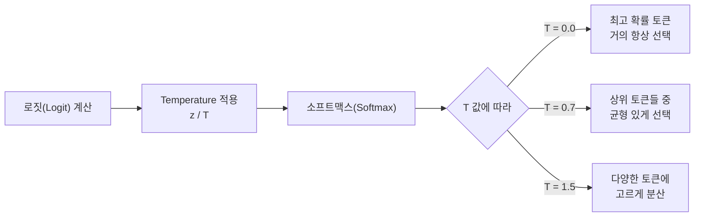
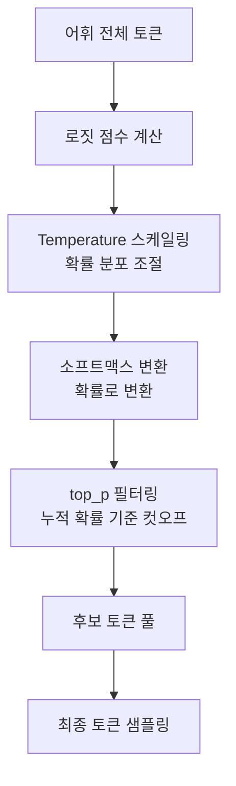
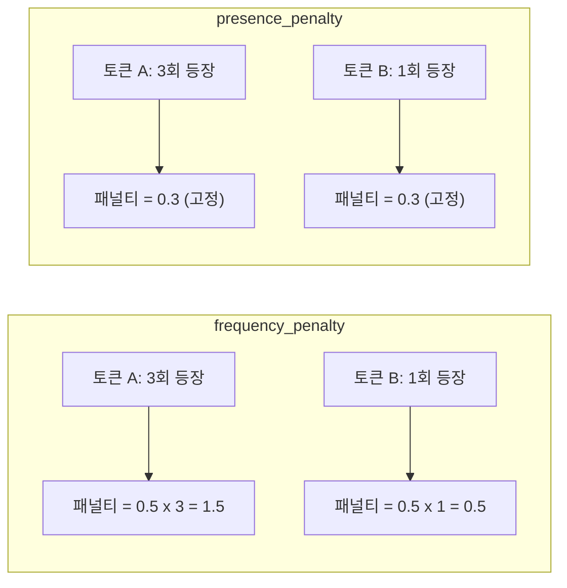
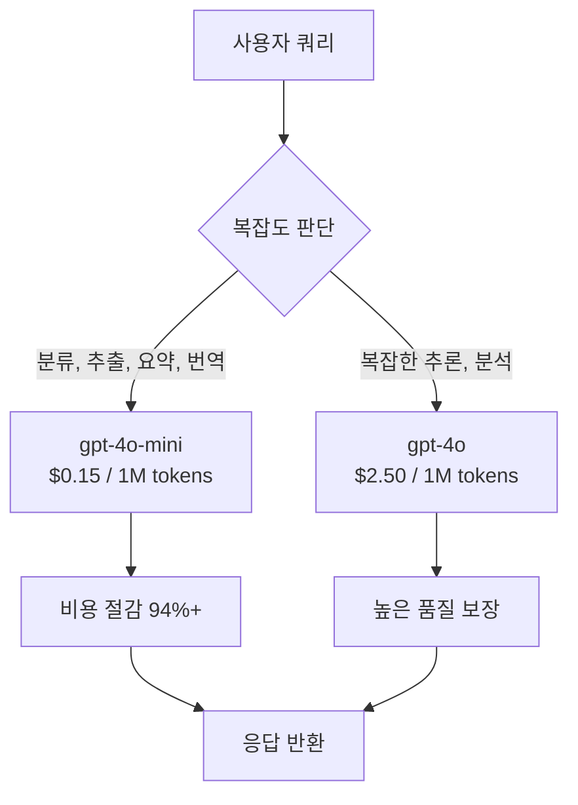

# ChatOpenAI 심화

> OpenAI 모델의 창의성과 비용을 동시에 제어하는 핵심 파라미터를 마스터합니다.

## 개요

이 섹션에서는 LangChain의 `ChatOpenAI` 클래스가 제공하는 다양한 모델 파라미터를 깊이 있게 살펴봅니다. 단순히 "모델을 호출한다"를 넘어서, **어떻게 호출하느냐**에 따라 응답의 품질, 창의성, 그리고 비용이 크게 달라진다는 사실을 직접 확인하게 될 거예요.

**선수 지식**: [Ch1: LangChain 소개와 개발 환경 설정](ch01)에서 배운 LangChain 설치, `.env` 설정, 그리고 `ChatOpenAI` 기본 사용법
**학습 목표**:
- `temperature`, `top_p`, `frequency_penalty`, `presence_penalty` 파라미터의 원리와 효과를 이해한다
- `usage_metadata`와 `get_openai_callback`을 사용하여 토큰 사용량을 정확히 추적할 수 있다
- 용도에 맞는 모델 선택과 파라미터 조합으로 비용을 최적화할 수 있다

## 왜 알아야 할까?

ChatGPT를 사용해본 분이라면 같은 질문에도 매번 조금씩 다른 답변이 나오는 걸 경험해보셨을 겁니다. 그런데 **프로덕션 환경**에서는 이야기가 달라지죠. 고객 서비스 챗봇이 매번 다른 답을 내놓으면 곤란하고, 반대로 창작 도우미가 늘 똑같은 답만 내놓아도 문제입니다.

여기에 비용 문제까지 더해집니다. OpenAI API는 토큰 단위로 과금되는데, 파라미터 하나를 잘못 설정하면 필요 이상으로 긴 응답이 생성되어 비용이 눈덩이처럼 불어날 수 있거든요. 실제로 스타트업들이 LLM API 비용 폭탄을 맞았다는 이야기는 이제 흔한 사례가 되었습니다.

이 섹션에서 배우는 파라미터 튜닝과 비용 추적 기법은, LLM 기반 서비스를 **안정적이고 경제적으로** 운영하기 위한 필수 역량입니다.

## 핵심 개념

### 개념 1: Temperature — 창의성의 온도 조절기

> 💡 **비유**: temperature는 **주사위의 면 수**를 조절하는 것과 같습니다. temperature가 낮으면 6면체 주사위인데 한 면이 유독 넓어서 거의 항상 같은 숫자가 나오고, temperature가 높으면 모든 면이 비슷한 크기라 어떤 숫자든 나올 수 있는 셈이죠.

LLM은 다음 토큰을 예측할 때 어휘 전체에 대한 점수(로짓, logit)를 계산합니다. 이 점수를 확률로 변환할 때 **소프트맥스(Softmax)** 함수를 사용하는데, temperature는 이 변환 과정에서 확률 분포의 "날카로움"을 조절합니다.

$$P(token_i) = \frac{e^{z_i / T}}{\sum_j e^{z_j / T}}$$

- $z_i$: 토큰 $i$의 로짓(raw score)
- $T$: temperature 값
- $P(token_i)$: 토큰 $i$가 선택될 최종 확률

이게 의미하는 바는 이렇습니다: **temperature가 낮을수록** 확률이 높은 토큰에 집중하여 예측 가능하고 일관된 출력을 만들고, **temperature가 높을수록** 다양한 토큰에 기회를 주어 창의적이지만 때로는 엉뚱한 결과를 생성합니다.


> 📊 **그림 1**: Temperature에 따른 토큰 선택 확률 변화




```python
from langchain_openai import ChatOpenAI
from langchain_core.messages import HumanMessage
from dotenv import load_dotenv

load_dotenv()  # .env 파일에서 OPENAI_API_KEY 로드

# 낮은 temperature: 결정적이고 일관된 응답
deterministic_llm = ChatOpenAI(
    model="gpt-4o-mini",
    temperature=0.0  # 거의 항상 같은 답변
)

# 높은 temperature: 창의적이고 다양한 응답
creative_llm = ChatOpenAI(
    model="gpt-4o-mini",
    temperature=1.2  # 다양하고 예측 불가능한 답변
)

question = [HumanMessage(content="'시간'을 주제로 비유를 하나 만들어주세요.")]

# 같은 질문, 다른 temperature → 다른 결과
response_low = deterministic_llm.invoke(question)
response_high = creative_llm.invoke(question)

print("🧊 Temperature 0.0:", response_low.content[:100])
print("🔥 Temperature 1.2:", response_high.content[:100])
```

| temperature 값 | 특성 | 적합한 용도 |
|:---:|---|---|
| 0.0 | 거의 결정적, 재현 가능 | 코드 생성, 분류, 추출 |
| 0.3–0.5 | 약간의 변동, 높은 일관성 | 고객 서비스, 요약, QA |
| 0.7–0.9 | 균형 잡힌 창의성 | 일반 대화, 콘텐츠 생성 |
| 1.0–1.5 | 높은 다양성, 예측 어려움 | 브레인스토밍, 창작 |

### 개념 2: top_p — 핵심 후보만 남기기 (핵 샘플링)

> 💡 **비유**: 시험 답을 고를 때, temperature가 "모든 보기를 얼마나 고르게 볼 것인가"라면, `top_p`는 "**상위 몇 개 보기만 볼 것인가**"를 정하는 겁니다. `top_p=0.1`이면 누적 확률 상위 10%에 해당하는 토큰들만 후보로 남기고 나머지는 아예 배제하는 거죠.

`top_p`(nucleus sampling)는 확률이 높은 토큰부터 누적해서 합이 `top_p` 값에 도달할 때까지만 후보로 남기는 방식입니다. 나머지 토큰은 확률이 0으로 처리됩니다.


> 📊 **그림 2**: Temperature와 top_p의 토큰 샘플링 파이프라인




```python
# top_p를 사용한 핵 샘플링
focused_llm = ChatOpenAI(
    model="gpt-4o-mini",
    temperature=1.0,  # temperature는 기본값으로 두고
    top_p=0.1         # 상위 10% 확률 토큰만 후보로 사용
)

response = focused_llm.invoke(
    [HumanMessage(content="머신러닝의 핵심 개념을 설명해주세요.")]
)
print(response.content[:200])
```

> ⚠️ **흔한 오해**: `temperature`와 `top_p`를 **동시에** 극단적으로 조절하는 것은 권장되지 않습니다. OpenAI 공식 문서에서도 둘 중 하나만 조절할 것을 권고하고 있어요. 둘 다 확률 분포를 변형하기 때문에, 동시에 조절하면 효과를 예측하기 어렵습니다.

### 개념 3: frequency_penalty와 presence_penalty — 반복의 함정 탈출

> 💡 **비유**: 뷔페에서 음식을 고르는 상황을 떠올려보세요. `frequency_penalty`는 "**이미 많이 먹은 음식일수록 다시 고르기 싫어지는**" 효과이고, `presence_penalty`는 "**한 번이라도 먹어본 음식은 다시 안 고르려는**" 효과입니다. 전자는 빈도에 비례하고, 후자는 등장 여부만 따집니다.

> 📊 **그림 3**: frequency_penalty vs presence_penalty 동작 비교




```python
# 반복 방지 파라미터 설정
no_repeat_llm = ChatOpenAI(
    model="gpt-4o-mini",
    temperature=0.7,
    frequency_penalty=0.5,  # -2.0 ~ 2.0, 높을수록 반복 단어 억제
    presence_penalty=0.3    # -2.0 ~ 2.0, 높을수록 새로운 주제 유도
)

response = no_repeat_llm.invoke(
    [HumanMessage(content="인공지능의 미래에 대해 500자로 에세이를 작성해주세요.")]
)
print(response.content)
```

| 파라미터 | 범위 | 효과 |
|---|:---:|---|
| `frequency_penalty` | -2.0 ~ 2.0 | 양수: 자주 등장한 토큰 억제 / 음수: 반복 유도 |
| `presence_penalty` | -2.0 ~ 2.0 | 양수: 이미 등장한 토큰 억제 / 음수: 기존 토큰 유도 |

### 개념 4: 토큰 사용량 추적 — 돈이 새는 곳을 찾아라

LangChain에서 토큰 사용량을 추적하는 방법은 크게 두 가지입니다.

**방법 1: `usage_metadata` 활용 (권장)**

`ChatOpenAI`가 반환하는 `AIMessage` 객체에는 `usage_metadata` 속성이 포함되어 있어, 별도 설정 없이 바로 토큰 사용량을 확인할 수 있습니다.

```python
from langchain_openai import ChatOpenAI
from langchain_core.messages import HumanMessage

llm = ChatOpenAI(model="gpt-4o-mini")

response = llm.invoke([HumanMessage(content="LangChain이란 무엇인가요?")])

# AIMessage의 usage_metadata에서 토큰 사용량 확인
print(f"입력 토큰: {response.usage_metadata['input_tokens']}")
print(f"출력 토큰: {response.usage_metadata['output_tokens']}")
print(f"총 토큰: {response.usage_metadata['total_tokens']}")
# 출력 예시:
# 입력 토큰: 15
# 출력 토큰: 187
# 총 토큰: 202
```

**방법 2: `get_openai_callback` 컨텍스트 매니저**

여러 번의 호출에 걸친 **누적 사용량과 비용**을 추적할 때 유용합니다.

```python
from langchain_openai import ChatOpenAI
from langchain_community.callbacks import get_openai_callback
from langchain_core.messages import HumanMessage

llm = ChatOpenAI(model="gpt-4o-mini")

with get_openai_callback() as cb:
    # 이 블록 안의 모든 OpenAI 호출이 추적됩니다
    response1 = llm.invoke([HumanMessage(content="Python이란?")])
    response2 = llm.invoke([HumanMessage(content="JavaScript란?")])

    print(f"총 토큰: {cb.total_tokens}")
    print(f"프롬프트 토큰: {cb.prompt_tokens}")
    print(f"완료 토큰: {cb.completion_tokens}")
    print(f"총 비용 (USD): ${cb.total_cost:.6f}")
    print(f"호출 횟수: {cb.successful_requests}")
# 출력 예시:
# 총 토큰: 438
# 프롬프트 토큰: 26
# 완료 토큰: 412
# 총 비용 (USD): $0.000259
# 호출 횟수: 2
```

### 개념 5: 비용 최적화 전략

> 💡 **비유**: LLM API 비용 관리는 **휴대폰 요금제 최적화**와 비슷합니다. 비싼 요금제(GPT-4o)가 항상 최선은 아니고, 용도에 따라 적절한 요금제(GPT-4o-mini)를 골라 쓰는 게 핵심이죠.

> 📊 **그림 4**: 쿼리 복잡도 기반 모델 라우팅 전략




**전략 1: 용도별 모델 선택**

```python
# 간단한 작업에는 저렴한 모델 사용
cheap_llm = ChatOpenAI(model="gpt-4o-mini", temperature=0)    # $0.15/1M input
# 복잡한 추론이 필요한 작업에만 고급 모델 사용
smart_llm = ChatOpenAI(model="gpt-4o", temperature=0)         # $2.50/1M input

def route_by_complexity(query: str) -> ChatOpenAI:
    """쿼리 복잡도에 따라 적절한 모델을 선택합니다."""
    # 간단한 분류/추출은 저렴한 모델로
    simple_keywords = ["분류", "추출", "요약", "번역"]
    if any(keyword in query for keyword in simple_keywords):
        return cheap_llm
    return smart_llm
```

**전략 2: `max_tokens`로 출력 길이 제한**

```python
# max_tokens로 불필요하게 긴 응답 방지
concise_llm = ChatOpenAI(
    model="gpt-4o-mini",
    temperature=0.3,
    max_tokens=200  # 최대 200 토큰으로 제한
)

response = concise_llm.invoke(
    [HumanMessage(content="LangChain의 핵심 장점을 설명해주세요.")]
)
print(f"응답 길이: {response.usage_metadata['output_tokens']} 토큰")
```

**전략 3: Batch API 활용 (50% 할인)**

대량의 비동기 작업은 OpenAI의 Batch API를 사용하면 입출력 토큰 비용을 50% 절감할 수 있습니다. 24시간 이내 결과를 반환하므로, 실시간이 아닌 요약·분류·임베딩 작업에 적합합니다.

**2025–2026년 주요 모델 가격 비교 (100만 토큰 기준)**:

| 모델 | 입력 | 출력 | 특징 |
|---|---:|---:|---|
| `gpt-4o` | $2.50 | $10.00 | 최고 성능의 범용 모델 |
| `gpt-4o-mini` | $0.15 | $0.60 | 비용 대비 성능 최적 |
| `gpt-4.1` | $2.00 | $8.00 | 코딩·지시 따르기 특화 |
| `gpt-4.1-mini` | $0.40 | $1.60 | 4.1 경량 버전 |
| `gpt-4.1-nano` | $0.10 | $0.40 | 초경량·초저가 |

> 🔥 **실무 팁**: 프로토타입 단계에서는 `gpt-4o`로 품질을 먼저 확인하고, 프로덕션에서는 `gpt-4o-mini`로 전환하여 비용을 **94% 이상** 절감하는 것이 일반적인 패턴입니다. 성능 차이가 허용 범위 안이라면 미니 모델이 합리적인 선택이에요.

## 실습: 직접 해보기

아래 코드는 **파라미터별 응답 변화를 비교**하고, **비용까지 추적**하는 완전한 실습 예제입니다.

```python
"""
ChatOpenAI 파라미터 실험실
- temperature, top_p, penalty 파라미터가 응답에 미치는 영향을 비교합니다.
- 각 호출의 토큰 사용량과 비용을 추적합니다.
"""

from langchain_openai import ChatOpenAI
from langchain_community.callbacks import get_openai_callback
from langchain_core.messages import HumanMessage
from dotenv import load_dotenv

load_dotenv()

# ──────────────────────────────────────────────
# 1. 파라미터 프리셋 정의
# ──────────────────────────────────────────────
PRESETS = {
    "정밀 모드": {
        "model": "gpt-4o-mini",
        "temperature": 0.0,
        "max_tokens": 150,
    },
    "균형 모드": {
        "model": "gpt-4o-mini",
        "temperature": 0.7,
        "top_p": 0.9,
        "max_tokens": 150,
    },
    "창의 모드": {
        "model": "gpt-4o-mini",
        "temperature": 1.2,
        "frequency_penalty": 0.5,
        "presence_penalty": 0.3,
        "max_tokens": 150,
    },
}

# ──────────────────────────────────────────────
# 2. 각 프리셋으로 같은 질문에 응답 생성
# ──────────────────────────────────────────────
question = [HumanMessage(content="'커피 한 잔'을 주제로 짧은 시를 써주세요.")]

with get_openai_callback() as cb:
    for name, params in PRESETS.items():
        llm = ChatOpenAI(**params)
        response = llm.invoke(question)

        print(f"\n{'='*50}")
        print(f"📋 프리셋: {name}")
        print(f"⚙️  설정: temp={params.get('temperature')}, "
              f"top_p={params.get('top_p', 'default')}, "
              f"freq_penalty={params.get('frequency_penalty', 0)}")
        print(f"📝 응답:\n{response.content}")
        print(f"📊 토큰: 입력={response.usage_metadata['input_tokens']}, "
              f"출력={response.usage_metadata['output_tokens']}")

    # 전체 비용 요약
    print(f"\n{'='*50}")
    print(f"💰 전체 비용 요약")
    print(f"   총 토큰: {cb.total_tokens}")
    print(f"   총 비용: ${cb.total_cost:.6f}")
    print(f"   총 호출: {cb.successful_requests}회")

# ──────────────────────────────────────────────
# 3. 모델별 비용 비교 실험
# ──────────────────────────────────────────────
print(f"\n{'='*50}")
print("🏷️ 모델별 비용 비교")

models = ["gpt-4o-mini", "gpt-4o"]
comparison_question = [HumanMessage(content="Python의 장점 3가지를 한 줄씩 설명해주세요.")]

for model_name in models:
    with get_openai_callback() as model_cb:
        llm = ChatOpenAI(model=model_name, temperature=0, max_tokens=200)
        response = llm.invoke(comparison_question)
        print(f"\n  모델: {model_name}")
        print(f"  토큰: {model_cb.total_tokens}, 비용: ${model_cb.total_cost:.6f}")
```

## 더 깊이 알아보기

### Temperature의 기원 — 통계물리학에서 AI로

"temperature"라는 이름이 왜 붙었을까요? 이 용어는 사실 **통계물리학의 볼츠만 분포(Boltzmann distribution)**에서 유래했습니다. 19세기 물리학자 루트비히 볼츠만(Ludwig Boltzmann)은 기체 분자들의 에너지 분포를 설명하면서, 온도가 높으면 분자들이 다양한 에너지 상태를 가지고, 온도가 낮으면 낮은 에너지 상태에 몰린다는 것을 발견했죠.

소프트맥스 함수에서의 temperature도 정확히 같은 원리입니다. 수식 $P \propto e^{z/T}$에서 $T$가 볼츠만 분포의 온도 $T$와 수학적으로 동일한 역할을 합니다. AI 연구자들이 이 유사성을 발견하고 "temperature"라는 이름을 그대로 가져온 거예요.

### Top-p 샘플링의 탄생

`top_p`(nucleus sampling)는 2019년 Ari Holtzman 등이 발표한 논문 *"The Curious Case of Neural Text Degeneration"*에서 처음 제안되었습니다. 당시 연구진은 기존의 top-k 샘플링이 상황에 따라 너무 많거나 너무 적은 후보를 남기는 문제를 발견했고, 확률 질량(probability mass) 기준으로 동적으로 후보 수를 조절하는 방법을 고안했습니다. 이 아이디어가 바로 오늘날 거의 모든 LLM API에서 지원하는 `top_p` 파라미터가 되었죠.

### OpenAI API의 가격 혁명

2023년 GPT-3.5 Turbo 출시 당시 100만 토큰당 $2.00이었던 가격은, 2024년 GPT-4o-mini 출시와 함께 $0.15까지 떨어졌습니다. 2년 만에 **93% 이상 하락**한 셈이에요. 이런 급격한 가격 하락은 LLM 기반 서비스의 진입 장벽을 크게 낮추었고, 이전에는 비용 때문에 불가능했던 다양한 애플리케이션이 등장하게 되었습니다.

## 흔한 오해와 팁

> ⚠️ **흔한 오해**: "temperature=0이면 항상 완전히 동일한 응답이 나온다?" — 아닙니다. `temperature=0`이라도 부동소수점 연산의 비결정성(GPU 병렬 연산 순서의 차이 등) 때문에 아주 미세한 차이가 발생할 수 있습니다. 완전한 재현성이 필요하다면 `seed` 파라미터를 함께 지정하세요: `ChatOpenAI(temperature=0, seed=42)`.

> 💡 **알고 계셨나요?**: OpenAI의 최신 o-시리즈 추론 모델(o1, o3 등)은 `temperature`, `top_p` 파라미터를 **지원하지 않습니다**. 이 모델들은 내부적으로 자체 추론 전략을 사용하기 때문에 외부에서 샘플링을 제어할 수 없어요. LangChain에서 이런 모델을 사용할 때 해당 파라미터를 설정하면 에러가 발생할 수 있으니 주의하세요.

> 🔥 **실무 팁**: `get_openai_callback`은 스트리밍 모드에서 토큰 사용량을 정확히 추적하지 못하는 알려진 이슈가 있습니다. 스트리밍 환경에서는 `stream_usage=True` 옵션을 설정하거나, 응답 완료 후 `usage_metadata`를 확인하는 방식을 사용하세요.

> 🔥 **실무 팁**: `frequency_penalty`와 `presence_penalty`는 기본값이 0입니다. 긴 텍스트 생성(에세이, 보고서 등)에서 반복이 심하다면, `frequency_penalty=0.3~0.7` 정도를 먼저 시도해보세요. 대부분의 경우 이것만으로 반복 문제가 크게 개선됩니다.

## 핵심 정리

| 개념 | 설명 |
|------|------|
| `temperature` | 0~2 범위. 낮으면 결정적, 높으면 창의적. 소프트맥스 분포의 날카로움 조절 |
| `top_p` | 0~1 범위. 누적 확률 기준으로 후보 토큰을 필터링 (핵 샘플링) |
| `frequency_penalty` | -2~2. 이미 많이 등장한 토큰의 확률을 빈도에 비례하여 감소 |
| `presence_penalty` | -2~2. 한 번이라도 등장한 토큰의 확률을 일괄 감소 |
| `max_tokens` | 출력 토큰 수 상한. 비용 제어와 응답 길이 제한에 사용 |
| `usage_metadata` | AIMessage에 포함된 토큰 사용량 정보 (input/output/total) |
| `get_openai_callback` | 여러 호출의 누적 토큰·비용을 추적하는 컨텍스트 매니저 |
| 비용 최적화 | 용도별 모델 선택 + max_tokens 제한 + Batch API 활용 |

## 다음 섹션 미리보기

이번 섹션에서 OpenAI 모델의 파라미터를 세밀하게 다루는 법을 배웠다면, 다음 섹션 **[2.2: 다양한 Chat Model 프로바이더](ch02/session2)**에서는 Anthropic(Claude), Google(Gemini), 오픈소스 모델 등 **OpenAI 이외의 LLM 프로바이더**를 LangChain에서 연동하는 방법을 알아봅니다. 모델을 하나만 알면 종속되지만, 여러 모델을 다룰 줄 알면 선택지가 생기죠.

## 참고 자료

- [ChatOpenAI — LangChain 공식 레퍼런스](https://reference.langchain.com/python/langchain-openai/chat_models/base/ChatOpenAI) - ChatOpenAI 클래스의 전체 파라미터 목록과 사용 예제
- [How to track token usage in ChatModels — LangChain Docs](https://docs.langchain.com/oss/python/langchain/overview) - 토큰 사용량 추적 방법 공식 가이드
- [OpenAI API Pricing](https://openai.com/api/pricing/) - 최신 모델별 가격 정보
- [Effective Strategies for OpenAI Cost Management in 2025](https://sedai.io/blog/how-to-optimize-openai-costs-in-2025) - 실전 비용 최적화 전략 모음
- [A Comprehensive Guide to LLM Temperature — Towards Data Science](https://towardsdatascience.com/a-comprehensive-guide-to-llm-temperature/) - temperature의 수학적 원리와 실전 가이드
- [The Curious Case of Neural Text Degeneration (Holtzman et al., 2019)](https://arxiv.org/abs/1904.09751) - top-p (nucleus sampling)을 처음 제안한 논문