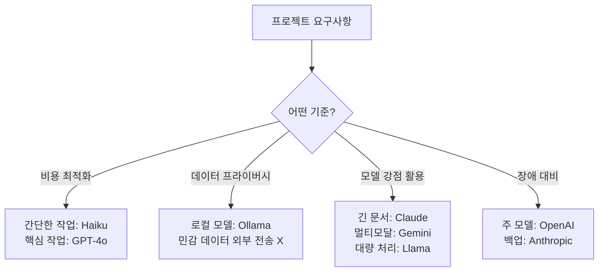
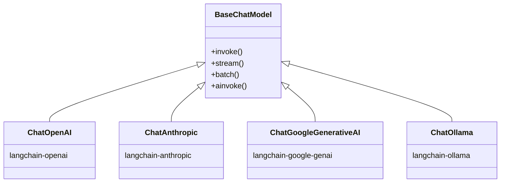
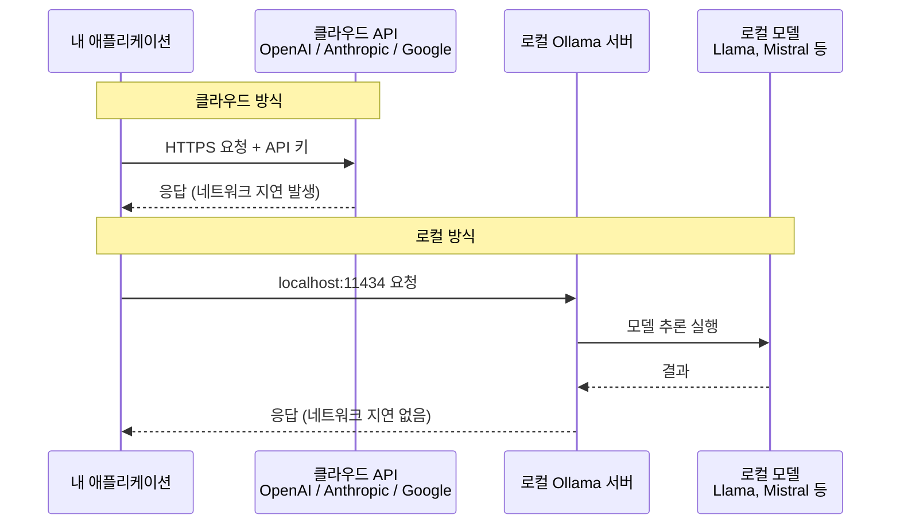
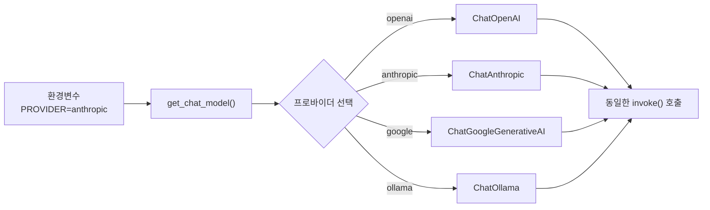

# 다중 프로바이더 연동

> LangChain의 통합 인터페이스를 활용하여 Anthropic, Google, 로컬 모델 등 다양한 LLM 프로바이더를 자유롭게 연동하고 전환하는 방법을 배웁니다.

## 개요

이 섹션에서는 OpenAI 외에 Anthropic(Claude), Google(Gemini), 그리고 Ollama를 통한 로컬 오픈소스 모델까지, 다양한 LLM 프로바이더를 LangChain에서 연동하는 방법을 다룹니다. 앞서 [Session 2.1: ChatOpenAI 심화](./session_2_1.md)에서 배운 `temperature`, `max_tokens` 같은 파라미터 개념이 다른 프로바이더에서도 동일하게 적용되는 것을 확인하게 됩니다.

**선수 지식**: Session 2.1에서 배운 ChatOpenAI 사용법, temperature/max_tokens 등 모델 파라미터 개념
**학습 목표**:
- ChatAnthropic, ChatGoogleGenerativeAI, ChatOllama를 각각 설치하고 초기화할 수 있다
- 프로바이더별 고유한 특성과 파라미터 차이를 이해한다
- Ollama를 사용하여 로컬 환경에서 LLM을 실행할 수 있다
- 통합 인터페이스를 활용하여 프로바이더 간 전환 코드를 작성할 수 있다

## 왜 알아야 할까?

실무에서 하나의 LLM만 사용하는 경우는 드뭅니다. 프로젝트마다, 심지어 하나의 파이프라인 안에서도 여러 모델을 조합하는 것이 일반적이거든요.

왜 여러 프로바이더가 필요할까요?

- **비용 최적화**: 간단한 분류 작업에 비싼 모델을 쓸 필요가 없습니다. Claude Haiku로 전처리하고, GPT-4o로 핵심 분석을 하는 식이죠.
- **벤더 종속 탈피**: 특정 API가 장애를 겪거나 가격이 올라도 빠르게 대안으로 전환할 수 있어야 합니다.
- **데이터 프라이버시**: 민감한 데이터는 클라우드에 보내지 않고 로컬 모델(Ollama)로 처리해야 하는 규정이 있을 수 있습니다.
- **모델별 강점 활용**: Claude는 긴 문서 분석에, Gemini는 멀티모달에, Llama는 비용 없는 대량 처리에 각각 강점이 있습니다.

> 📊 **그림 3**: 다중 프로바이더 활용 시나리오




LangChain의 가장 큰 장점 중 하나가 바로 이 **통합 인터페이스**입니다. `invoke`, `stream`, `batch` — 어떤 프로바이더를 쓰든 동일한 코드로 동작하죠.

## 핵심 개념

### 개념 1: LangChain의 프로바이더 아키텍처

> 💡 **비유**: 여러 프로바이더를 사용하는 것은 마치 **만능 리모컨** 같습니다. TV, 에어컨, 오디오 — 제조사가 달라도 하나의 리모컨으로 모두 조작할 수 있죠. LangChain의 `BaseChatModel`이 바로 그 만능 리모컨입니다. 버튼(메서드)은 같고, 내부적으로 각 기기(프로바이더)에 맞는 신호를 보내는 겁니다.

LangChain은 각 프로바이더를 **별도의 파트너 패키지**로 분리해 관리합니다. 이것이 핵심 설계 철학인데요, 필요한 프로바이더만 설치하면 되니 의존성이 가벼워집니다.

```
langchain-openai      → ChatOpenAI
langchain-anthropic   → ChatAnthropic
langchain-google-genai → ChatGoogleGenerativeAI
langchain-ollama      → ChatOllama
```

모든 Chat Model은 `BaseChatModel`을 상속하므로, 동일한 인터페이스(`invoke`, `stream`, `batch`, `ainvoke` 등)를 제공합니다. 이 덕분에 프로바이더를 교체할 때 **호출 코드는 전혀 수정하지 않아도** 됩니다.

> 📊 **그림 1**: LangChain 프로바이더 아키텍처 — 파트너 패키지와 통합 인터페이스




### 개념 2: ChatAnthropic — Claude 모델 연동

> 💡 **비유**: Anthropic의 Claude를 연동하는 것은 새로운 항공사 앱을 깔면서 마일리지 카드(API 키)를 등록하는 것과 비슷합니다. 앱(패키지)을 설치하고, 카드(API 키)를 등록하면, 이전에 다른 항공사 앱에서 했던 것처럼 똑같이 예약(invoke)할 수 있죠.

**설치 및 설정:**

```bash
pip install langchain-anthropic
```

```python
import os
from dotenv import load_dotenv
from langchain_anthropic import ChatAnthropic

# .env 파일에서 API 키 로드
load_dotenv()
# ANTHROPIC_API_KEY=sk-ant-... 가 .env에 있어야 합니다

# Claude 모델 초기화
llm = ChatAnthropic(
    model="claude-sonnet-4-5-20250514",  # 최신 Claude Sonnet 4.5
    temperature=0.7,
    max_tokens=1024,
)

# Session 2.1에서 배운 것처럼 동일하게 호출
response = llm.invoke("LangChain의 핵심 장점을 3가지 알려주세요.")
print(response.content)
```

**Claude 모델 라인업:**

| 모델명 | 특징 | 용도 |
|--------|------|------|
| `claude-sonnet-4-5-20250514` | 최신 고성능 모델 | 범용, 코딩, 분석 |
| `claude-haiku-4-5-20251001` | 빠르고 저렴 | 분류, 요약, 대량 처리 |
| `claude-opus-4-6` | 최고 성능 | 복잡한 추론, 연구 |

**Claude 고유 파라미터:**

```python
# Claude만의 extended thinking 기능
llm_thinking = ChatAnthropic(
    model="claude-sonnet-4-5-20250514",
    temperature=1,  # extended thinking 사용 시 temperature=1 필수
    max_tokens=16000,
    thinking={
        "type": "enabled",
        "budget_tokens": 10000  # 추론에 할당할 토큰 수
    },
)
```

### 개념 3: ChatGoogleGenerativeAI — Gemini 모델 연동

> 💡 **비유**: Google의 Gemini를 연동하는 것은 마치 구글 계정 하나로 Gmail, Drive, YouTube를 모두 쓰는 것과 같은 느낌입니다. 하나의 API 키로 텍스트, 이미지, 비디오까지 처리할 수 있는 멀티모달 모델이거든요.

**설치 및 설정:**

```bash
pip install langchain-google-genai
```

```python
import os
from dotenv import load_dotenv
from langchain_google_genai import ChatGoogleGenerativeAI

# .env 파일에서 API 키 로드
load_dotenv()
# GOOGLE_API_KEY=AI... 가 .env에 있어야 합니다

# Gemini 모델 초기화
llm = ChatGoogleGenerativeAI(
    model="gemini-2.0-flash",  # 빠르고 효율적인 모델
    temperature=0.7,
    max_tokens=1024,
)

# 동일한 인터페이스로 호출
response = llm.invoke("Python의 장점을 설명해주세요.")
print(response.content)
```

**Gemini 모델 라인업:**

| 모델명 | 특징 | 용도 |
|--------|------|------|
| `gemini-2.0-flash` | 빠르고 효율적 | 범용, 대량 처리 |
| `gemini-2.5-pro-preview-06-05` | 고성능, 긴 컨텍스트 | 복잡한 분석, 코딩 |
| `gemini-2.5-flash-preview-05-20` | 균형 잡힌 성능 | 비용 효율적 범용 |

**Gemini 고유 기능 — 안전 설정:**

```python
from langchain_google_genai import ChatGoogleGenerativeAI, HarmCategory, HarmBlockThreshold

# 안전 필터 커스터마이징
llm = ChatGoogleGenerativeAI(
    model="gemini-2.0-flash",
    safety_settings={
        HarmCategory.HARM_CATEGORY_DANGEROUS_CONTENT: HarmBlockThreshold.BLOCK_NONE,
    },
)
```

### 개념 4: ChatOllama — 로컬 모델 실행

> 💡 **비유**: Ollama로 로컬 모델을 실행하는 것은 마치 **집에 커피 머신을 놓는 것**과 같습니다. 카페(클라우드 API)에 가지 않아도 되고, 아무리 많이 내려도 추가 비용이 없으며, 내 레시피(데이터)가 밖으로 나가지 않죠. 다만, 카페의 전문 바리스타(대형 모델)만큼의 맛을 내려면 좋은 머신(GPU)이 필요합니다.

> 📊 **그림 4**: 클라우드 API 호출 vs 로컬 Ollama 실행 흐름 비교




**Ollama 설치 (macOS):**

```bash
# Homebrew로 설치
brew install ollama

# Ollama 서버 시작
brew services start ollama

# 모델 다운로드 (최초 1회)
ollama pull llama3.1        # Meta의 Llama 3.1 8B
ollama pull mistral          # Mistral 7B
ollama pull gemma2:2b        # Google의 경량 모델
```

**LangChain에서 사용:**

```python
from langchain_ollama import ChatOllama

# 로컬 모델 초기화 — API 키가 필요 없습니다!
llm = ChatOllama(
    model="llama3.1",       # ollama pull로 받은 모델명
    temperature=0.7,
    num_predict=1024,        # max_tokens에 해당 (Ollama 용어)
)

# 동일한 인터페이스
response = llm.invoke("재귀 함수를 설명해주세요.")
print(response.content)
```

**설치 및 패키지:**

```bash
pip install langchain-ollama
```

**인기 Ollama 모델 비교:**

| 모델 | 크기 | 최소 RAM | 강점 |
|------|------|----------|------|
| `llama3.1` (8B) | ~4.7GB | 8GB | 범용, 커뮤니티 최대 |
| `mistral` (7B) | ~4.1GB | 8GB | 빠른 속도, 유럽어 |
| `gemma2:2b` | ~1.6GB | 4GB | 초경량, 저사양 PC |
| `phi3` (3.8B) | ~2.3GB | 4GB | 크기 대비 고성능 |
| `qwen2.5` (7B) | ~4.4GB | 8GB | 다국어, 아시아어 강세 |

### 개념 5: 통합 인터페이스 — 프로바이더 전환 패턴

LangChain의 진짜 힘은 **동일한 코드로 여러 프로바이더를 사용**할 수 있다는 점입니다. 이것이 가능한 이유는 모든 Chat Model이 `Runnable` 인터페이스를 구현하기 때문이죠 — Session 1.1에서 배운 개념입니다.

```python
from langchain_openai import ChatOpenAI
from langchain_anthropic import ChatAnthropic
from langchain_google_genai import ChatGoogleGenerativeAI
from langchain_ollama import ChatOllama

def get_chat_model(provider: str, **kwargs) -> "BaseChatModel":
    """프로바이더 이름으로 Chat Model을 반환하는 팩토리 함수"""
    models = {
        "openai": lambda: ChatOpenAI(model="gpt-4o", **kwargs),
        "anthropic": lambda: ChatAnthropic(model="claude-sonnet-4-5-20250514", **kwargs),
        "google": lambda: ChatGoogleGenerativeAI(model="gemini-2.0-flash", **kwargs),
        "ollama": lambda: ChatOllama(model="llama3.1", **kwargs),
    }
    if provider not in models:
        raise ValueError(f"지원하지 않는 프로바이더: {provider}")
    return models[provider]()

# 어떤 프로바이더든 동일한 코드로 사용
llm = get_chat_model("anthropic", temperature=0.5)
response = llm.invoke("안녕하세요!")
print(response.content)
```

이 패턴을 쓰면 환경변수 하나로 프로바이더를 전환할 수 있어서, 개발 환경에서는 Ollama(무료), 프로덕션에서는 Claude나 GPT-4o를 사용하는 전략이 가능해집니다.

> 📊 **그림 2**: 팩토리 패턴을 활용한 프로바이더 전환 흐름




## 실습: 직접 해보기

아래 코드는 **세 프로바이더를 동시에 호출하고 결과를 비교**하는 완전한 실습 예제입니다. API 키가 없는 프로바이더는 자동으로 건너뜁니다.

```python
"""
다중 프로바이더 비교 실습
- 필요 패키지: pip install langchain-anthropic langchain-google-genai langchain-ollama python-dotenv
- .env 파일에 ANTHROPIC_API_KEY, GOOGLE_API_KEY 설정
- Ollama는 로컬 서버가 실행 중이어야 합니다 (ollama serve)
"""

import os
import time
from dotenv import load_dotenv
from langchain_core.messages import HumanMessage, SystemMessage

load_dotenv()

# ── 1. 프로바이더별 모델 초기화 ──────────────────────────
providers = {}

# Anthropic (Claude)
if os.getenv("ANTHROPIC_API_KEY"):
    from langchain_anthropic import ChatAnthropic
    providers["Anthropic Claude"] = ChatAnthropic(
        model="claude-sonnet-4-5-20250514",
        temperature=0.7,
        max_tokens=512,
    )

# Google (Gemini)
if os.getenv("GOOGLE_API_KEY"):
    from langchain_google_genai import ChatGoogleGenerativeAI
    providers["Google Gemini"] = ChatGoogleGenerativeAI(
        model="gemini-2.0-flash",
        temperature=0.7,
        max_tokens=512,
    )

# Ollama (로컬) — API 키 불필요
try:
    from langchain_ollama import ChatOllama
    providers["Ollama Llama3.1"] = ChatOllama(
        model="llama3.1",
        temperature=0.7,
        num_predict=512,
    )
except Exception:
    print("Ollama 연결 실패 — ollama serve가 실행 중인지 확인하세요.")

# ── 2. 동일한 프롬프트로 비교 호출 ──────────────────────────
messages = [
    SystemMessage(content="당신은 Python 전문가입니다. 간결하게 답하세요."),
    HumanMessage(content="파이썬의 리스트 컴프리헨션과 제너레이터 표현식의 차이를 설명해주세요."),
]

print("=" * 60)
print("🔄 다중 프로바이더 비교 테스트")
print("=" * 60)

for name, llm in providers.items():
    print(f"\n{'─' * 40}")
    print(f"📌 {name}")
    print(f"{'─' * 40}")
    
    start = time.time()
    try:
        # 모든 프로바이더에서 동일한 invoke 메서드 사용
        response = llm.invoke(messages)
        elapsed = time.time() - start
        
        print(f"⏱️  응답 시간: {elapsed:.2f}초")
        print(f"📝 응답:\n{response.content[:300]}...")  # 앞 300자만 출력
        
        # 토큰 사용량 확인 (지원하는 프로바이더만)
        if hasattr(response, "usage_metadata") and response.usage_metadata:
            meta = response.usage_metadata
            print(f"🔢 토큰: 입력 {meta.get('input_tokens', '?')}, "
                  f"출력 {meta.get('output_tokens', '?')}")
    except Exception as e:
        print(f"❌ 에러: {e}")

# ── 3. 스트리밍 비교 (Anthropic 예시) ──────────────────────
if "Anthropic Claude" in providers:
    print(f"\n{'=' * 60}")
    print("🌊 스트리밍 출력 예시 (Claude)")
    print("=" * 60)
    
    # stream도 모든 프로바이더에서 동일하게 동작합니다
    for chunk in providers["Anthropic Claude"].stream(
        "Python의 async/await를 한 문장으로 설명해주세요."
    ):
        print(chunk.content, end="", flush=True)
    print()  # 줄바꿈
```

**실행 결과 (예시):**

```
============================================================
🔄 다중 프로바이더 비교 테스트
============================================================

────────────────────────────────────────
📌 Anthropic Claude
────────────────────────────────────────
⏱️  응답 시간: 1.23초
📝 응답:
리스트 컴프리헨션은 전체 결과를 메모리에 한 번에 생성하고,
제너레이터 표현식은 값을 하나씩 지연 생성합니다...
🔢 토큰: 입력 42, 출력 156

────────────────────────────────────────
📌 Google Gemini
────────────────────────────────────────
⏱️  응답 시간: 0.89초
📝 응답:
리스트 컴프리헨션([])은 리스트를 즉시 생성하여 메모리에 저장하고,
제너레이터 표현식(())은 이터레이터를 반환하여 메모리를 절약합니다...
🔢 토큰: 입력 38, 출력 142
```

## 더 깊이 알아보기

### LangChain의 "파트너 패키지" 전략이 탄생한 이유

LangChain 초기(2022년 말)에는 모든 프로바이더 통합이 `langchain-community`라는 하나의 거대한 패키지에 담겨 있었습니다. ChatOpenAI를 쓰려면 Anthropic SDK도, Google SDK도, 심지어 Hugging Face 관련 라이브러리까지 함께 설치해야 했죠. 의존성 지옥이 열린 겁니다.

2024년 초, LangChain 팀은 과감한 결정을 내립니다. 각 프로바이더를 **독립된 파트너 패키지**로 분리한 것이죠(`langchain-openai`, `langchain-anthropic` 등). 이 결정은 처음에 마이그레이션 고통을 유발했지만, 결과적으로 각 프로바이더가 자체 릴리스 주기를 가지게 되어 새 모델이 출시되면 **핫픽스 수준으로 빠르게** 대응할 수 있게 되었습니다.

### Ollama의 탄생 — "로컬 LLM의 Docker"

Ollama는 2023년 7월, Meta의 Llama 2 공개 직후 등장했습니다. 창업자 Jeffrey Morgan은 "Docker가 서버 배포를 혁신한 것처럼, 로컬 LLM 실행도 그만큼 쉬워야 한다"는 비전을 가졌습니다. 실제로 `ollama pull llama3.1`이라는 한 줄 명령어로 모델을 받아 실행할 수 있게 만든 것은, `docker pull nginx`에서 직접 영감을 받은 것이죠. Modelfile이라는 설정 파일 형식도 Dockerfile에서 차용했습니다. 이 "익숙함의 설계"가 Ollama를 로컬 LLM 실행의 사실상 표준으로 만들었습니다.

## 흔한 오해와 팁

> ⚠️ **흔한 오해**: "모든 프로바이더의 파라미터 이름이 동일하다"
> 
> 인터페이스(`invoke`, `stream`)는 동일하지만, 초기화 파라미터는 프로바이더마다 미묘하게 다릅니다. 예를 들어 OpenAI와 Anthropic은 `max_tokens`를 쓰지만, Ollama는 `num_predict`를 사용합니다. ChatGoogleGenerativeAI의 `max_tokens`는 내부적으로 `max_output_tokens`로 매핑되고요. 항상 해당 프로바이더의 공식 문서를 확인하세요.

> 💡 **알고 계셨나요?**: Anthropic이라는 회사명은 "인간 중심의"라는 뜻의 영어 단어 'anthropic'에서 왔습니다. OpenAI 출신의 Dario Amodei와 Daniela Amodei가 2021년에 설립했는데, "AI 안전성"을 최우선 가치로 내세운 것이 특징입니다. Claude라는 이름은 정보 이론의 아버지 Claude Shannon에서 따온 것이고요.

> 🔥 **실무 팁**: 개발 초기에는 Ollama로 프로토타이핑하세요. API 비용이 $0이고, 네트워크 지연도 없어서 빠른 반복 개발에 최적입니다. 프롬프트와 체인 구조가 확정된 후에 클라우드 모델로 전환하면 비용을 크게 절약할 수 있습니다. 팩토리 패턴(위의 `get_chat_model`)을 사용하면 환경변수 하나로 전환이 가능하죠.

> 🔥 **실무 팁**: `langchain-community`에서 import하는 레거시 코드를 발견하면 반드시 파트너 패키지로 마이그레이션하세요. 예를 들어 `from langchain_community.chat_models import ChatAnthropic`은 더 이상 권장되지 않으며, `from langchain_anthropic import ChatAnthropic`으로 변경해야 합니다. 레거시 경로는 언제든 제거될 수 있습니다.

## 핵심 정리

| 개념 | 설명 |
|------|------|
| 파트너 패키지 | 각 프로바이더를 `langchain-*` 독립 패키지로 분리하여 관리 |
| ChatAnthropic | `langchain-anthropic` 패키지, Claude 모델 연동, extended thinking 지원 |
| ChatGoogleGenerativeAI | `langchain-google-genai` 패키지, Gemini 모델 연동, 안전 설정 커스터마이징 |
| ChatOllama | `langchain-ollama` 패키지, Ollama 로컬 서버를 통한 오픈소스 모델 실행 |
| 통합 인터페이스 | 모든 Chat Model이 `invoke`/`stream`/`batch` 동일 메서드 제공 |
| 팩토리 패턴 | 프로바이더명으로 모델 객체를 반환하는 함수로, 유연한 전환 구현 |
| `num_predict` | Ollama에서 `max_tokens`에 해당하는 파라미터명 |

## 다음 섹션 미리보기

다음 Session 2.3에서는 **스트리밍과 비동기 처리**를 다룹니다. 이번 섹션에서 간단히 사용한 `stream` 메서드의 작동 원리를 깊이 파헤치고, `async/await` 기반의 비동기 호출(`ainvoke`, `astream`)으로 동시에 여러 모델을 병렬 호출하는 방법을 배웁니다. 다중 프로바이더 환경에서 비동기 처리가 특히 강력한 이유를 실감하게 될 것입니다.

## 참고 자료

- [ChatAnthropic 공식 문서 — LangChain](https://docs.langchain.com/oss/python/integrations/chat/anthropic) - ChatAnthropic 설치부터 고급 기능까지 최신 가이드
- [ChatGoogleGenerativeAI 공식 문서 — LangChain](https://docs.langchain.com/oss/python/integrations/chat/google_generative_ai) - Gemini 모델 연동 및 안전 설정 가이드
- [ChatOllama 공식 문서 — LangChain](https://docs.langchain.com/oss/python/integrations/chat/ollama) - Ollama 로컬 모델 연동 방법
- [Ollama GitHub 저장소](https://github.com/ollama/ollama) - Ollama 설치 및 지원 모델 목록
- [Anthropic Claude 모델 문서](https://docs.anthropic.com/en/docs/about-claude/models) - Claude 모델 라인업 및 최신 스펙
- [Google Gemini 모델 문서](https://ai.google.dev/gemini-api/docs/models) - Gemini 모델별 상세 스펙

---
### 🔗 Related Sessions
- [runnable](../01-langchain-소개와-개발-환경-설정/01-llm-애플리케이션의-진화와-langchain.md) (prerequisite)
- [chatopenai](../01-langchain-소개와-개발-환경-설정/04-첫-번째-langchain-애플리케이션.md) (prerequisite)
- [temperature](../01-langchain-소개와-개발-환경-설정/04-첫-번째-langchain-애플리케이션.md) (prerequisite)
- [max_tokens](../01-langchain-소개와-개발-환경-설정/04-첫-번째-langchain-애플리케이션.md) (prerequisite)
- [invoke](../01-langchain-소개와-개발-환경-설정/04-첫-번째-langchain-애플리케이션.md) (prerequisite)
- [stream](../01-langchain-소개와-개발-환경-설정/04-첫-번째-langchain-애플리케이션.md) (prerequisite)
