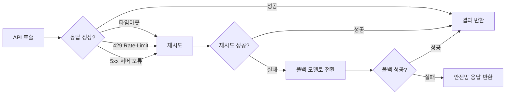
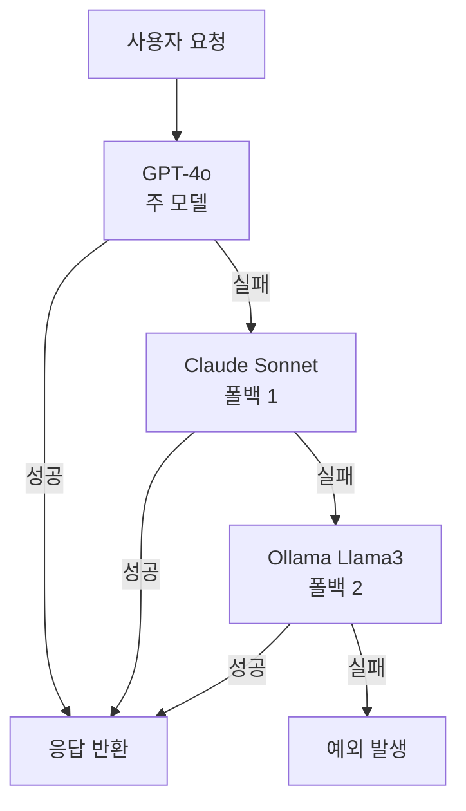
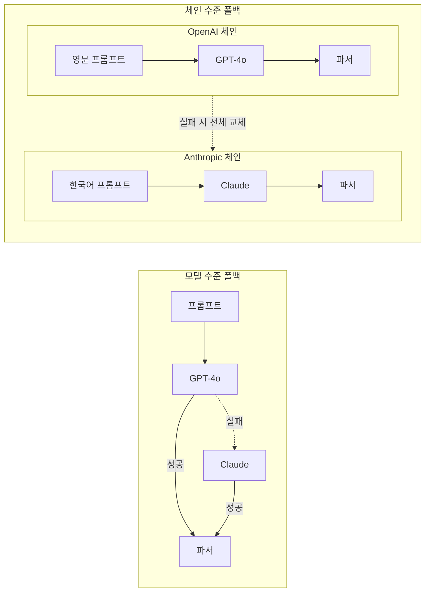
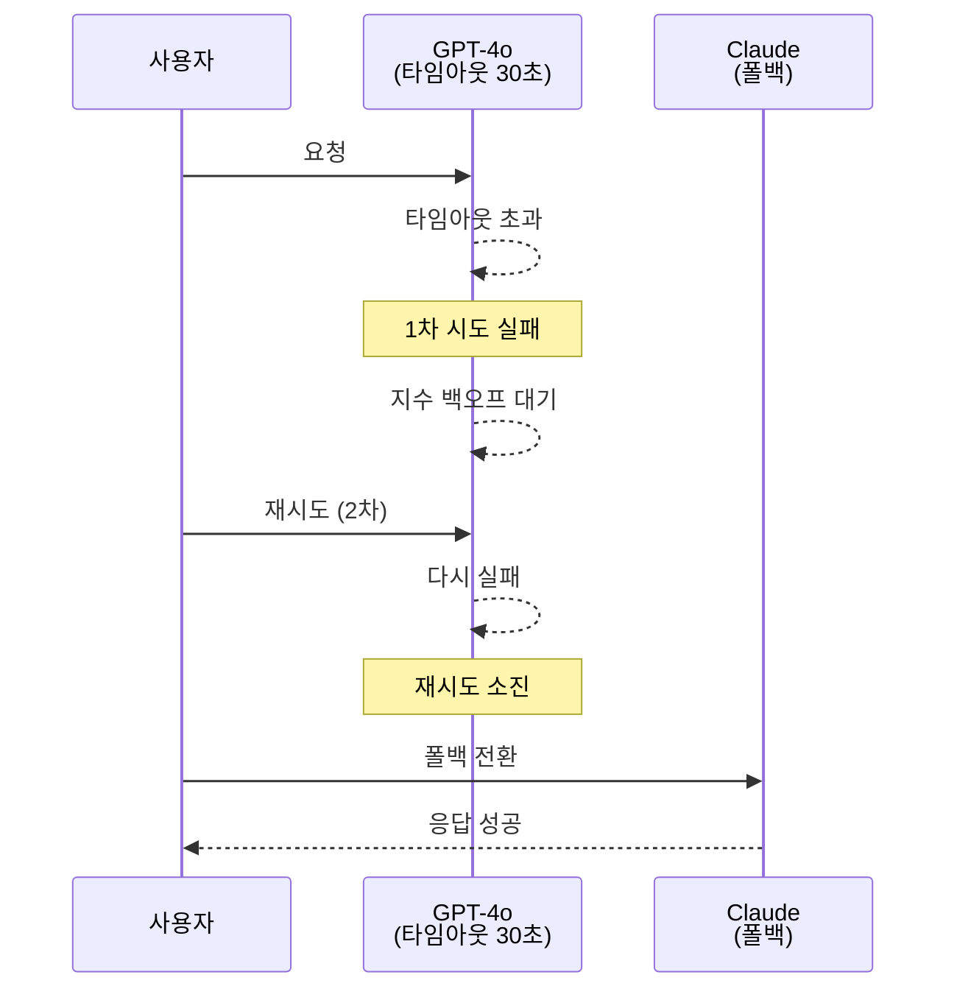

# 모델 폴백과 안정성

> LLM API 장애에도 끄떡없는 프로덕션 수준의 안정성을 구축하는 방법을 배웁니다.

## 개요

이 섹션에서는 LangChain의 `with_fallbacks()`, `with_retry()`, 타임아웃 설정, 그리고 체계적인 에러 핸들링 패턴을 배웁니다. 프로덕션 환경에서 LLM API는 언제든 실패할 수 있는데요, 이 섹션을 마치면 그런 상황에서도 서비스가 중단되지 않는 견고한 시스템을 만들 수 있습니다.

**선수 지식**: 앞서 [Session 2.1: ChatOpenAI 심화]에서 배운 모델 파라미터 설정, [Session 2.2: 다중 프로바이더 연동]에서 배운 여러 프로바이더 초기화, [Session 2.3: 스트리밍과 비동기 처리]에서 배운 `invoke`/`ainvoke` 호출 방식

**학습 목표**:
- `with_fallbacks()`를 사용하여 모델 수준·체인 수준의 폴백을 구현할 수 있다
- `with_retry()`로 지수 백오프(Exponential Backoff) 기반 재시도 로직을 설정할 수 있다
- `timeout`과 `max_retries` 파라미터로 API 호출의 타임아웃을 제어할 수 있다
- 폴백, 재시도, 타임아웃을 조합한 프로덕션 수준의 에러 핸들링 전략을 설계할 수 있다

## 왜 알아야 할까?

> 📊 **그림 1**: LLM API 호출에서 발생할 수 있는 장애와 대응 전략 개관




여러분이 GPT-4o를 사용하는 고객 상담 챗봇을 운영한다고 상상해 보세요. 어느 날 갑자기 OpenAI API에 장애가 발생합니다. 고객들은 답변을 받지 못하고, 문의가 쌓이고, 매출에 영향을 미칩니다. 이런 시나리오는 상상이 아닙니다 — 실제로 주요 LLM 프로바이더들은 주기적으로 다운타임이나 레이트 리밋(Rate Limit)을 경험합니다.

프로덕션 환경에서 LLM 기반 애플리케이션을 운영할 때 마주치는 대표적인 문제들입니다:

- **API 다운타임**: 프로바이더 서버가 일시적으로 응답하지 않는 경우
- **레이트 리밋(429 Too Many Requests)**: 요청 한도를 초과한 경우
- **네트워크 타임아웃**: 응답이 지나치게 오래 걸리는 경우
- **일시적 서버 오류(5xx)**: 프로바이더 내부 문제로 인한 간헐적 실패

이런 문제를 미리 대비하지 않으면 서비스 전체가 멈출 수 있습니다. 반대로, 적절한 폴백과 재시도 로직을 갖추면 한 프로바이더가 실패해도 다른 프로바이더로 자동 전환되어 사용자는 아무 문제도 느끼지 못하죠. 이번 섹션에서 바로 그 방법을 배웁니다.

## 핵심 개념

### 개념 1: 모델 폴백 — `with_fallbacks()`

> 💡 **비유**: 출근길에 지하철이 고장 나면 어떻게 하시나요? 버스를 타거나, 택시를 잡거나, 자전거를 탈 수 있죠. 이처럼 **주요 수단이 실패했을 때 대안으로 전환하는 것**이 바로 폴백(Fallback)입니다. LLM에서도 마찬가지예요 — OpenAI가 응답하지 않으면 Anthropic으로, 그마저도 안 되면 로컬 Ollama 모델로 전환하는 거죠.

LangChain의 모든 `Runnable`은 `.with_fallbacks()` 메서드를 제공합니다. 이 메서드에 대안 모델의 리스트를 전달하면, 첫 번째 모델이 실패할 때 순서대로 다음 모델을 시도합니다.

> 📊 **그림 2**: 모델 수준 폴백 체인의 동작 흐름




```python
from langchain_openai import ChatOpenAI
from langchain_anthropic import ChatAnthropic
from langchain_community.chat_models import ChatOllama

# 주 모델: GPT-4o
primary = ChatOpenAI(model="gpt-4o", max_retries=0)  # 폴백 사용 시 자체 재시도 비활성화

# 폴백 모델들: Claude → 로컬 Ollama 순서
fallback_1 = ChatAnthropic(model="claude-sonnet-4-20250514", max_retries=0)
fallback_2 = ChatOllama(model="llama3", num_predict=1024)

# 폴백 체인 구성
model_with_fallbacks = primary.with_fallbacks([fallback_1, fallback_2])

# 사용법은 일반 모델과 동일!
response = model_with_fallbacks.invoke("LangChain이 뭔가요?")
print(response.content)
```

여기서 중요한 포인트가 있는데요. `max_retries=0`으로 설정한 부분을 주목하세요. LangChain의 LLM 래퍼들은 기본적으로 자체 재시도 로직이 있습니다(보통 2회). 이걸 끄지 않으면 첫 번째 모델이 한참 동안 재시도하느라 폴백으로 넘어가지 않거든요.

> ⚠️ **흔한 오해**: "폴백을 설정하면 자동으로 재시도도 최적화된다" — 아닙니다! `with_fallbacks()`와 LLM 래퍼의 내장 `max_retries`는 **별개의 메커니즘**입니다. 폴백을 쓸 때는 개별 모델의 `max_retries=0`으로 설정해야 빠르게 대안 모델로 넘어갑니다.

### 개념 2: 체인 수준 폴백

> 💡 **비유**: 레스토랑에서 스테이크를 주문했는데 재료가 떨어졌다고 합니다. 단순히 고기만 바꾸는 게 아니라, "오늘의 특선 해산물 코스는 어떠세요?"처럼 **메뉴 전체를 대안으로 제안**하죠. 체인 수준 폴백도 마찬가지입니다 — 모델만 바꾸는 게 아니라 프롬프트, 파서 등 전체 파이프라인을 통째로 교체합니다.

서로 다른 모델은 서로 다른 프롬프트에서 최적의 성능을 발휘합니다. 따라서 프로덕션에서는 모델 수준이 아닌 **체인 수준** 폴백이 더 실용적입니다.

> 📊 **그림 3**: 모델 수준 vs 체인 수준 폴백 비교




```python
from langchain_openai import ChatOpenAI
from langchain_anthropic import ChatAnthropic
from langchain_core.prompts import ChatPromptTemplate
from langchain_core.output_parsers import StrOutputParser

# OpenAI용 체인 (OpenAI에 최적화된 프롬프트)
openai_prompt = ChatPromptTemplate.from_messages([
    ("system", "You are a helpful assistant. Respond in Korean."),
    ("human", "{question}")
])
openai_chain = openai_prompt | ChatOpenAI(model="gpt-4o", max_retries=0) | StrOutputParser()

# Anthropic용 체인 (Claude에 최적화된 프롬프트)
anthropic_prompt = ChatPromptTemplate.from_messages([
    ("system", "당신은 친절한 한국어 AI 어시스턴트입니다. 명확하고 구조적으로 답변하세요."),
    ("human", "{question}")
])
anthropic_chain = anthropic_prompt | ChatAnthropic(model="claude-sonnet-4-20250514", max_retries=0) | StrOutputParser()

# 체인 수준 폴백: OpenAI 체인 실패 시 Anthropic 체인으로 전환
chain_with_fallback = openai_chain.with_fallbacks([anthropic_chain])

# 호출은 동일
result = chain_with_fallback.invoke({"question": "RAG의 장점을 설명해주세요"})
print(result)
```

이렇게 하면 OpenAI에 장애가 생겨도 Anthropic이 각자에게 최적화된 프롬프트로 자연스럽게 응답을 이어갑니다.

### 개념 3: 재시도 로직 — `with_retry()`

> 💡 **비유**: 전화를 걸었는데 상대방이 안 받습니다. 바로 포기하지 않고 "5초 후에 다시, 15초 후에 다시, 30초 후에 다시" — 점점 간격을 늘려가며 몇 번 더 시도해 보죠? 이것이 바로 **지수 백오프(Exponential Backoff)** 재시도 전략입니다.

`with_retry()`는 일시적인 오류에 대해 자동으로 재시도하는 메커니즘을 제공합니다. 네트워크 순단이나 429 에러처럼 잠깐 기다리면 해결될 수 있는 문제에 특히 유용합니다.

```python
from langchain_openai import ChatOpenAI
from openai import RateLimitError, APITimeoutError

# 모델 초기화 (자체 재시도 비활성화)
model = ChatOpenAI(model="gpt-4o", max_retries=0)

# with_retry() 설정
model_with_retry = model.with_retry(
    retry_if_exception_type=(RateLimitError, APITimeoutError),  # 이 에러일 때만 재시도
    wait_exponential_jitter=True,   # 지수 백오프 + 무작위 지연(jitter)
    stop_after_attempt=3            # 최대 3회 시도
)

# 사용
response = model_with_retry.invoke("안녕하세요!")
print(response.content)
```

**`wait_exponential_jitter=True`의 동작 방식:**

| 시도 | 대기 시간 (대략) | 설명 |
|------|-----------------|------|
| 1차 | 즉시 | 첫 번째 시도 |
| 2차 | 1~2초 + 랜덤 | 지수 백오프 + jitter |
| 3차 | 2~4초 + 랜덤 | 더 긴 대기 후 재시도 |

jitter(무작위 지연)를 추가하는 이유가 뭘까요? 여러 클라이언트가 동시에 같은 시간에 재시도하면 서버에 다시 부하가 몰리는 **Thundering Herd** 문제가 발생합니다. jitter가 각 클라이언트의 재시도 시점을 무작위로 분산시켜 이 문제를 방지합니다.

### 개념 4: 타임아웃 설정

> 💡 **비유**: 식당에서 주문한 음식이 1시간이 지나도 안 나온다면? 계속 기다리기보다 "30분 넘으면 나간다"는 기준을 정하는 게 합리적이죠. API 호출도 마찬가지입니다 — 너무 오래 기다리면 전체 시스템이 느려지므로, **명확한 제한 시간**을 설정해야 합니다.

LangChain에서 타임아웃은 모델 초기화 시 `timeout` 파라미터로 설정합니다.

```python
import httpx
from langchain_openai import ChatOpenAI

# 방법 1: 단순 타임아웃 (초 단위)
model_simple = ChatOpenAI(
    model="gpt-4o",
    timeout=30.0,       # 전체 요청 타임아웃 30초
    max_retries=2       # 타임아웃 시 최대 2회 재시도
)

# 방법 2: 세밀한 타임아웃 (httpx.Timeout 사용)
model_advanced = ChatOpenAI(
    model="gpt-4o",
    timeout=httpx.Timeout(
        connect=5.0,    # 연결 수립까지 최대 5초
        read=30.0,      # 응답 수신까지 최대 30초
        write=10.0,     # 요청 전송까지 최대 10초
        pool=5.0        # 커넥션 풀에서 대기 최대 5초
    ),
    max_retries=0       # 폴백과 함께 사용 시 재시도 비활성화
)
```

타임아웃 값을 정할 때는 모델의 특성을 고려해야 합니다:

| 모델 유형 | 권장 타임아웃 | 이유 |
|-----------|-------------|------|
| GPT-4o / Claude | 30~60초 | 복잡한 추론에 시간 소요 |
| GPT-4o-mini / Haiku | 15~30초 | 빠른 응답 모델 |
| 로컬 모델 (Ollama) | 60~120초 | 하드웨어 성능에 따라 다름 |
| 스트리밍 모드 | 10~15초 (첫 토큰) | 첫 토큰만 빠르면 됨 |

### 개념 5: 폴백 + 재시도 + 타임아웃 조합

실제 프로덕션에서는 이 세 가지를 조합해서 사용합니다. 핵심은 **적용 순서**입니다:

```
타임아웃 → 재시도 → 폴백
```

즉, 각 모델에 타임아웃을 설정하고, 일시적 오류에는 재시도를 하며, 그래도 실패하면 다음 모델로 폴백합니다.

> 📊 **그림 4**: 타임아웃 - 재시도 - 폴백 조합의 실행 순서




```python
from langchain_openai import ChatOpenAI
from langchain_anthropic import ChatAnthropic
from openai import RateLimitError, APITimeoutError

# 1단계: 타임아웃이 설정된 모델 생성
primary = ChatOpenAI(
    model="gpt-4o",
    timeout=30.0,      # 30초 타임아웃
    max_retries=0       # 자체 재시도 비활성화 (with_retry에 위임)
)

fallback = ChatAnthropic(
    model="claude-sonnet-4-20250514",
    timeout=30.0,
    max_retries=0
)

# 2단계: 재시도 로직 추가 (모델별로)
primary_with_retry = primary.with_retry(
    retry_if_exception_type=(RateLimitError, APITimeoutError),
    wait_exponential_jitter=True,
    stop_after_attempt=2   # 빠른 폴백을 위해 2회로 제한
)

# 3단계: 폴백 연결
robust_model = primary_with_retry.with_fallbacks([fallback])

# 이제 이 모델은:
# 1. GPT-4o에 요청 (30초 타임아웃)
# 2. 실패 시 최대 1회 재시도 (지수 백오프)
# 3. 재시도도 실패 시 Claude로 폴백
response = robust_model.invoke("복잡한 분석을 해주세요")
```

> 🔥 **실무 팁**: 재시도 횟수(`stop_after_attempt`)는 폴백이 있을 때 **낮게 설정**하세요. 재시도를 5번씩 하면 폴백까지 도달하는 데 너무 오래 걸립니다. 폴백이 있다면 2회, 없다면 3~5회가 적당합니다.

## 실습: 직접 해보기

프로덕션 수준의 견고한 LLM 서비스를 단계별로 만들어 보겠습니다.

```python
"""
Session 2.4 실습: 프로덕션 수준의 모델 폴백과 안정성 시스템
"""
import time
import logging
from typing import Optional

from langchain_openai import ChatOpenAI
from langchain_anthropic import ChatAnthropic
from langchain_core.prompts import ChatPromptTemplate
from langchain_core.output_parsers import StrOutputParser
from langchain_core.runnables import RunnableLambda

# 로깅 설정 — 어떤 모델이 사용되었는지 추적
logging.basicConfig(level=logging.INFO)
logger = logging.getLogger(__name__)


# =====================================================
# 1단계: 개별 모델 설정 (타임아웃 + 재시도 비활성화)
# =====================================================
def create_models():
    """프로바이더별 모델을 타임아웃과 함께 생성합니다."""
    primary = ChatOpenAI(
        model="gpt-4o",
        temperature=0.7,
        timeout=30.0,       # 30초 타임아웃
        max_retries=0        # 자체 재시도 비활성화
    )

    secondary = ChatAnthropic(
        model="claude-sonnet-4-20250514",
        temperature=0.7,
        timeout=30.0,
        max_retries=0
    )

    return primary, secondary


# =====================================================
# 2단계: 모델 수준 폴백 (가장 간단한 방식)
# =====================================================
def simple_fallback_demo():
    """모델 수준 폴백: GPT-4o 실패 시 Claude로 전환."""
    primary, secondary = create_models()

    # 폴백 구성
    robust_model = primary.with_fallbacks([secondary])

    # 테스트
    response = robust_model.invoke("Python의 장점을 3가지 알려주세요.")
    print("=== 모델 수준 폴백 결과 ===")
    print(response.content)
    return response


# =====================================================
# 3단계: 체인 수준 폴백 (프로바이더별 최적화된 프롬프트)
# =====================================================
def chain_fallback_demo():
    """체인 수준 폴백: 프롬프트까지 통째로 교체."""
    primary, secondary = create_models()

    # OpenAI에 최적화된 체인
    openai_chain = (
        ChatPromptTemplate.from_messages([
            ("system", "You are a senior Python developer. Answer in Korean."),
            ("human", "{question}")
        ])
        | primary
        | StrOutputParser()
    )

    # Anthropic에 최적화된 체인
    anthropic_chain = (
        ChatPromptTemplate.from_messages([
            ("system",
             "당신은 시니어 파이썬 개발자입니다. "
             "명확하고 구조적으로, 예제 코드와 함께 답변하세요."),
            ("human", "{question}")
        ])
        | secondary
        | StrOutputParser()
    )

    # 체인 수준 폴백
    robust_chain = openai_chain.with_fallbacks([anthropic_chain])

    result = robust_chain.invoke({"question": "데코레이터 패턴을 설명해주세요"})
    print("=== 체인 수준 폴백 결과 ===")
    print(result)
    return result


# =====================================================
# 4단계: 재시도 + 폴백 조합
# =====================================================
def retry_with_fallback_demo():
    """재시도 로직과 폴백을 조합한 프로덕션 패턴."""
    from openai import RateLimitError, APITimeoutError

    primary, secondary = create_models()

    # 주 모델에 재시도 로직 추가
    primary_with_retry = primary.with_retry(
        retry_if_exception_type=(RateLimitError, APITimeoutError),
        wait_exponential_jitter=True,
        stop_after_attempt=2    # 빠른 폴백을 위해 2회로 제한
    )

    # 재시도가 적용된 주 모델에 폴백 연결
    robust_model = primary_with_retry.with_fallbacks([secondary])

    response = robust_model.invoke("비동기 프로그래밍이란 무엇인가요?")
    print("=== 재시도 + 폴백 결과 ===")
    print(response.content)
    return response


# =====================================================
# 5단계: 에러 로깅이 포함된 완전한 프로덕션 패턴
# =====================================================
def production_chain(question: str) -> str:
    """프로덕션 수준의 에러 핸들링이 적용된 체인.

    Args:
        question: 사용자 질문

    Returns:
        모델 응답 텍스트
    """
    from openai import RateLimitError, APITimeoutError

    primary, secondary = create_models()

    # 최후의 수단: 모든 모델이 실패했을 때의 안전망
    def emergency_response(inputs):
        """모든 모델 실패 시 반환할 기본 응답."""
        logger.error("모든 모델이 실패했습니다!")
        return "죄송합니다. 일시적인 서비스 장애가 발생했습니다. 잠시 후 다시 시도해 주세요."

    # 프롬프트
    prompt = ChatPromptTemplate.from_messages([
        ("system", "당신은 친절한 AI 어시스턴트입니다. 한국어로 답변하세요."),
        ("human", "{question}")
    ])
    parser = StrOutputParser()

    # 주 체인: GPT-4o + 재시도
    primary_chain = (
        prompt
        | primary.with_retry(
            retry_if_exception_type=(RateLimitError, APITimeoutError),
            wait_exponential_jitter=True,
            stop_after_attempt=2
        )
        | parser
    )

    # 폴백 체인: Claude
    fallback_chain = prompt | secondary | parser

    # 최후의 안전망: 정적 응답
    emergency_chain = RunnableLambda(emergency_response)

    # 전체 조합: 주 체인 → 폴백 체인 → 안전망
    robust_chain = primary_chain.with_fallbacks(
        [fallback_chain, emergency_chain]
    )

    # 실행 및 타이밍 측정
    start = time.time()
    try:
        result = robust_chain.invoke({"question": question})
        elapsed = time.time() - start
        logger.info(f"응답 완료 (소요 시간: {elapsed:.2f}초)")
        return result
    except Exception as e:
        elapsed = time.time() - start
        logger.error(f"최종 실패 ({elapsed:.2f}초): {e}")
        return "서비스 오류가 발생했습니다."


# =====================================================
# 실행
# =====================================================
if __name__ == "__main__":
    print("\n" + "=" * 60)
    print("1. 모델 수준 폴백")
    print("=" * 60)
    simple_fallback_demo()

    print("\n" + "=" * 60)
    print("2. 체인 수준 폴백")
    print("=" * 60)
    chain_fallback_demo()

    print("\n" + "=" * 60)
    print("3. 재시도 + 폴백 조합")
    print("=" * 60)
    retry_with_fallback_demo()

    print("\n" + "=" * 60)
    print("4. 프로덕션 패턴")
    print("=" * 60)
    answer = production_chain("RAG 시스템의 핵심 구성요소를 설명해주세요")
    print(answer)
```

## 더 깊이 알아보기

### 서킷 브레이커의 탄생 — 전기 공학에서 소프트웨어로

LangChain의 폴백 패턴을 이해하려면, 그 뿌리가 되는 **서킷 브레이커(Circuit Breaker) 패턴**의 역사를 알면 좋습니다.

물리적 서킷 브레이커는 전기 공학에서 태어났습니다. 전선에 과전류가 흐르면 자동으로 회로를 차단해서 화재를 방지하는 장치죠. 이 개념을 소프트웨어 세계로 가져온 사람이 **마이클 나이가드(Michael Nygard)**입니다. 그는 2007년 저서 *"Release It!"*에서 분산 시스템에서 **하나의 실패한 서비스가 전체 시스템을 마비시키는 연쇄 장애(Cascading Failure)**를 방지하기 위해 서킷 브레이커 패턴을 제안했습니다.

이 패턴을 대규모로 실전에 적용해 유명해진 것은 **Netflix**입니다. 2011년, Netflix 엔지니어링 팀은 수백 개의 마이크로서비스 사이에서 발생하는 연쇄 장애를 막기 위해 **Hystrix** 라이브러리를 개발했습니다. Hystrix는 서킷 브레이커, 폴백, 타임아웃, 격리(Bulkhead) 패턴을 통합한 라이브러리인데요, Netflix에서는 매일 수백억 건의 호출이 Hystrix를 통해 처리되었습니다.

LangChain의 `with_fallbacks()`와 `with_retry()`는 이 패턴의 현대적 구현입니다. 완전한 서킷 브레이커는 아니지만, "실패 시 대안으로 전환"이라는 핵심 철학을 LLM 호출에 적용한 것이죠. 프로덕션에서 더 정교한 서킷 브레이커가 필요하다면, Python의 `circuitbreaker` 라이브러리와 조합해서 사용할 수 있습니다.

### `exception_key`로 폴백에 에러 정보 전달하기

`with_fallbacks()`에는 `exception_key`라는 고급 파라미터가 있습니다. 이걸 설정하면 실패한 이유를 폴백 모델에 전달할 수 있어요.

```python
from langchain_core.runnables import RunnableLambda

# 에러 정보를 활용하는 폴백
def smart_fallback(inputs: dict) -> str:
    """에러 원인에 따라 다른 응답을 반환합니다."""
    error = inputs.get("error")  # exception_key로 전달된 에러
    question = inputs.get("question", "")

    if "rate_limit" in str(error).lower():
        return f"현재 요청이 많습니다. '{question}'에 대한 답변을 잠시 후 드리겠습니다."
    return f"일시적 오류가 발생했습니다. '{question}'에 대해 다시 시도해 주세요."

# exception_key 사용 (입력이 dict여야 함)
primary = RunnableLambda(lambda x: 1 / 0)  # 항상 실패하는 예시
fallback = RunnableLambda(smart_fallback)

chain = primary.with_fallbacks(
    [fallback],
    exception_key="error"  # 에러를 "error" 키로 폴백에 전달
)

result = chain.invoke({"question": "LangChain이란?"})
print(result)
# 출력: 일시적 오류가 발생했습니다. 'LangChain이란?'에 대해 다시 시도해 주세요.
```

### `exceptions_to_handle`로 폴백 범위 제한하기

모든 에러에 대해 폴백할 필요는 없습니다. 인증 실패(401)처럼 재시도해도 소용없는 에러는 즉시 예외를 발생시키는 것이 맞죠.

```python
from openai import RateLimitError, APITimeoutError

# 특정 에러에서만 폴백 실행
model_with_selective_fallback = primary.with_fallbacks(
    [fallback_model],
    exceptions_to_handle=(RateLimitError, APITimeoutError)  # 이 에러만 폴백
)
# AuthenticationError, InvalidRequestError 등은 폴백 없이 즉시 예외 발생
```

## 흔한 오해와 팁

> ⚠️ **흔한 오해**: "폴백이 있으니까 에러 핸들링을 안 해도 된다" — 폴백은 **모든 폴백 모델이 실패할 수 있습니다**. `with_fallbacks()`는 모든 폴백이 실패하면 마지막 예외를 그대로 발생시킵니다. 반드시 최외곽에 `try/except` 또는 `RunnableLambda`를 이용한 안전망을 두세요.

> 💡 **알고 계셨나요?**: 지수 백오프의 "jitter(무작위 지연)"는 AWS의 엔지니어들이 대규모 분산 시스템에서 발견한 **Thundering Herd 문제**를 해결하기 위해 고안되었습니다. 수천 대의 서버가 동시에 재시도하면 장애가 더 악화되는데, 각 서버의 재시도 시점을 무작위로 흩뜨리면 부하가 자연스럽게 분산됩니다. AWS는 2015년 블로그에서 "Full Jitter" 전략이 가장 효과적이라고 발표했는데, LangChain의 `wait_exponential_jitter=True`가 바로 이 전략을 사용합니다.

> 🔥 **실무 팁**: 폴백 모델은 **비용 순서로 배치**하세요. 가장 비싼 고성능 모델(GPT-4o)을 주 모델로, 중간 모델(Claude Sonnet)을 첫 번째 폴백으로, 저렴한 모델(GPT-4o-mini)이나 로컬 모델(Ollama)을 마지막 폴백으로 두면 비용과 품질 사이의 균형을 맞출 수 있습니다. 또한, 폴백 발생 횟수를 모니터링하여 주 모델의 안정성 문제를 조기에 감지하세요.

> 🔥 **실무 팁**: `with_retry()`에서 `retry_if_exception_type`을 반드시 지정하세요. 기본값은 모든 예외에 대해 재시도하는데, `AuthenticationError`처럼 재시도해봐야 소용없는 에러까지 재시도하면 시간만 낭비됩니다. `(RateLimitError, APITimeoutError)` 정도만 지정하는 것이 좋습니다.

## 핵심 정리

| 개념 | 설명 |
|------|------|
| `with_fallbacks()` | 주 모델 실패 시 대안 모델 리스트를 순서대로 시도하는 메서드 |
| 체인 수준 폴백 | 모델뿐 아니라 프롬프트·파서 등 전체 파이프라인을 통째로 교체하는 패턴 |
| `with_retry()` | 일시적 오류 발생 시 지수 백오프로 자동 재시도하는 메서드 |
| `wait_exponential_jitter` | Thundering Herd를 방지하는 무작위 지연이 포함된 지수 백오프 전략 |
| `stop_after_attempt` | 최대 재시도 횟수. 폴백이 있을 때는 낮게(2), 없을 때는 높게(3~5) |
| `timeout` | API 응답 대기 최대 시간. `float` 또는 `httpx.Timeout`으로 세밀하게 설정 |
| `max_retries=0` | LLM 래퍼의 내장 재시도 비활성화. `with_retry()`·`with_fallbacks()`와 함께 사용 시 필수 |
| `exceptions_to_handle` | 폴백을 실행할 예외 타입 제한. 인증 오류 등은 즉시 실패시키는 것이 바람직 |
| `exception_key` | 실패 원인을 폴백 Runnable의 입력에 전달하여 상황별 대응 가능 |
| 안전망 패턴 | 모든 모델 실패에 대비한 `RunnableLambda` 기반 최후의 정적 응답 |

## 다음 섹션 미리보기

이번 섹션에서 개별 모델 호출의 안정성을 확보하는 방법을 배웠다면, 다음 섹션 **[Session 2.5]**에서는 **배치 처리와 비용 최적화** — 여러 요청을 효율적으로 묶어 처리하고, 토큰 사용량을 모니터링하며, 모델 선택과 캐싱 전략을 통해 프로덕션 비용을 체계적으로 관리하는 방법을 다룹니다. 이번 섹션의 폴백 패턴과 결합하면 안정성과 비용 효율성을 모두 갖춘 시스템을 설계할 수 있습니다.

## 참고 자료

- [How to add fallbacks to a runnable — LangChain 공식 문서](https://python.langchain.com/docs/how_to/fallbacks/) - 폴백의 공식 사용법과 예제를 확인할 수 있는 필수 문서
- [RunnableWithFallbacks API Reference](https://python.langchain.com/api_reference/core/runnables/langchain_core.runnables.fallbacks.RunnableWithFallbacks.html) - `with_fallbacks()`의 모든 파라미터와 상세 설명
- [RunnableRetry API Reference](https://python.langchain.com/api_reference/core/runnables/langchain_core.runnables.retry.RunnableRetry.html) - `with_retry()`의 지수 백오프 설정과 파라미터 상세
- [Making the Netflix API More Resilient — Netflix Tech Blog](https://netflixtechblog.com/making-the-netflix-api-more-resilient-a8ec62159c2d) - 폴백 패턴의 실전 적용 사례를 보여주는 Netflix 엔지니어링 블로그
- [LangChain Fallbacks Source Code (GitHub)](https://github.com/langchain-ai/langchain/blob/master/libs/core/langchain_core/runnables/fallbacks.py) - 내부 구현을 이해하고 싶을 때 참고할 소스 코드

---
### 🔗 Related Sessions
- [lcel](../01-langchain-소개와-개발-환경-설정/01-llm-애플리케이션의-진화와-langchain.md) (prerequisite)
- [runnable](../01-langchain-소개와-개발-환경-설정/01-llm-애플리케이션의-진화와-langchain.md) (prerequisite)
- [chatopenai](../01-langchain-소개와-개발-환경-설정/04-첫-번째-langchain-애플리케이션.md) (prerequisite)
- [temperature](../01-langchain-소개와-개발-환경-설정/04-첫-번째-langchain-애플리케이션.md) (prerequisite)
- [invoke](../01-langchain-소개와-개발-환경-설정/04-첫-번째-langchain-애플리케이션.md) (prerequisite)
- [chatanthropic](../02-llm과-chat-model-다루기/02-다중-프로바이더-연동.md) (prerequisite)
- [chatollama](../02-llm과-chat-model-다루기/02-다중-프로바이더-연동.md) (prerequisite)
- [stroutputparser](../01-langchain-소개와-개발-환경-설정/04-첫-번째-langchain-애플리케이션.md) (prerequisite)
- [chatprompttemplate](../01-langchain-소개와-개발-환경-설정/04-첫-번째-langchain-애플리케이션.md) (prerequisite)
