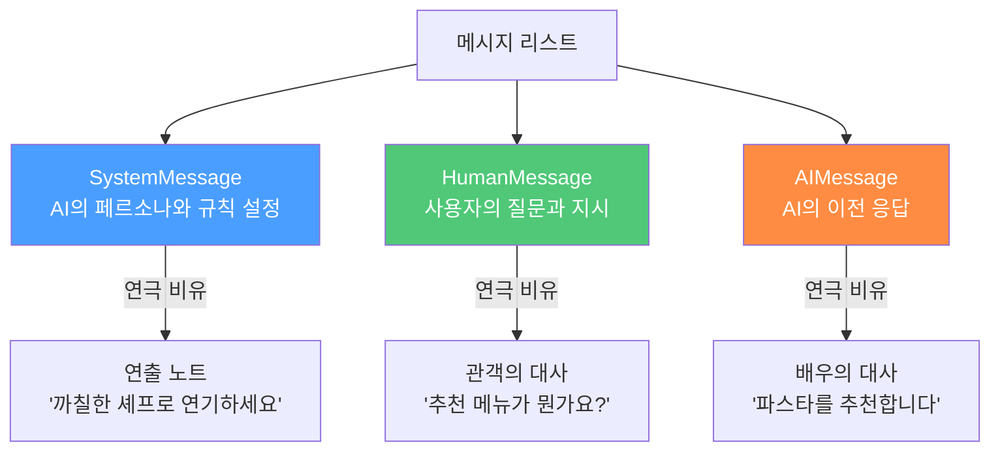
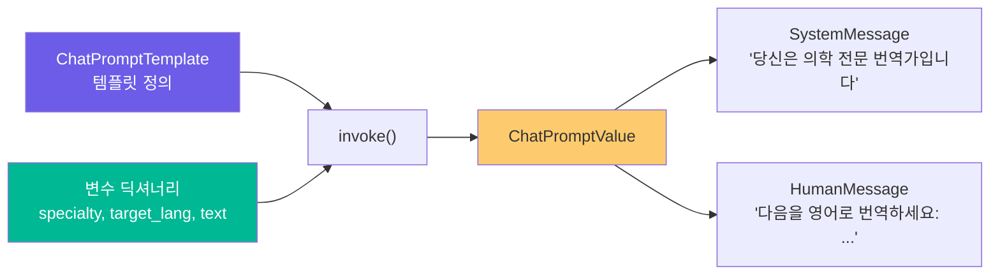
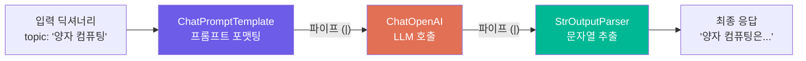
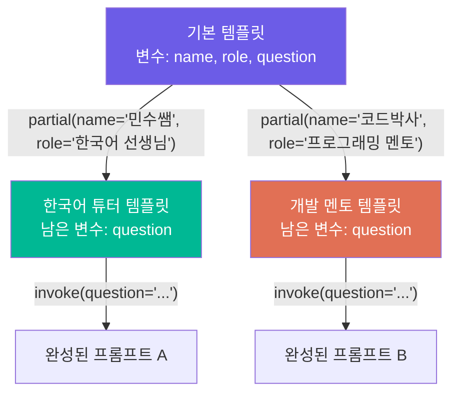

# ChatPromptTemplate 기초

> LangChain의 프롬프트 템플릿 시스템으로, 역할별 메시지를 구조화하고 재사용 가능한 프롬프트를 만드는 방법을 배웁니다.

## 개요

이 섹션에서는 LangChain의 핵심 프롬프트 구성 도구인 `ChatPromptTemplate`을 다룹니다. Chat 모델에게 메시지를 보낼 때 단순 문자열이 아닌, **역할(System, Human, AI)별로 구조화된 메시지**를 만들고 변수를 바인딩하여 동적으로 프롬프트를 생성하는 방법을 익힙니다.

**선수 지식**: [Ch2: LLM과 Chat Model 다루기]에서 배운 `ChatOpenAI` 모델 호출 방법과 `invoke()` 패턴
**학습 목표**:
- SystemMessage, HumanMessage, AIMessage의 역할과 차이를 이해할 수 있다
- `ChatPromptTemplate.from_messages()`를 사용하여 구조화된 프롬프트를 작성할 수 있다
- 변수 바인딩과 포맷팅으로 동적 프롬프트를 생성할 수 있다

## 왜 알아야 할까?

Chat 모델에게 "번역해줘"라고 말하는 것과, "너는 전문 번역가야. 한국어를 영어로 번역해줘. 격식체를 사용해"라고 말하는 것은 결과가 완전히 다릅니다. 하지만 이런 프롬프트를 매번 문자열로 직접 작성하면 어떻게 될까요?

```python
# 이렇게 하면 안 됩니다!
prompt = f"당신은 {role}입니다. {language}로 다음을 번역하세요: {text}"
```

코드가 지저분해지고, 프롬프트 수정할 때마다 문자열을 뜯어고쳐야 하며, 여러 메시지의 역할 구분도 불가능합니다. 실무에서는 **수십 개의 프롬프트**를 관리해야 하는데, 이런 방식으로는 금방 한계에 부딪히죠.

`ChatPromptTemplate`은 이 문제를 우아하게 해결합니다. 프롬프트를 **템플릿화**하여 재사용하고, 역할별 메시지를 명확히 분리하며, LCEL 파이프라인에 자연스럽게 연결할 수 있게 해줍니다.

## 핵심 개념

### 개념 1: 메시지의 세 가지 역할 — 연극의 대본처럼

> 📊 **그림 1**: Chat 모델의 세 가지 메시지 역할




> 💡 **비유**: Chat 모델과의 대화를 **연극 대본**이라고 생각해보세요. 연극에는 세 종류의 지시가 있습니다:
> - **연출 노트(Stage Direction)** = `SystemMessage`: "이 캐릭터는 까칠한 셰프입니다"
> - **배우의 대사** = `HumanMessage`: 관객(사용자)이 던지는 질문
> - **상대 배우의 대사** = `AIMessage`: AI가 이전에 했던 응답

LangChain에서 Chat 모델은 단순 텍스트가 아닌 **메시지 리스트**를 입력으로 받습니다. 각 메시지에는 역할(role)이 지정되어 있어서 모델이 맥락을 정확히 파악할 수 있거든요.

```python
from langchain_core.messages import SystemMessage, HumanMessage, AIMessage

# 각 메시지 타입을 직접 생성할 수 있습니다
system = SystemMessage(content="당신은 친절한 요리 전문가입니다.")
human = HumanMessage(content="파스타 삶는 시간이 어떻게 되나요?")
ai = AIMessage(content="일반적으로 8-12분 정도 삶으면 됩니다.")

# 메시지 리스트를 모델에 전달
messages = [system, human, ai, HumanMessage(content="알덴테로 하려면요?")]
```

**SystemMessage**는 특별합니다. 대화 전체에 걸쳐 AI의 행동 방식, 성격, 제약 조건을 설정하는 역할을 하죠. 마치 배우에게 "이번 공연에서는 이런 캐릭터로 연기해"라고 알려주는 것과 같습니다.

| 메시지 타입 | 역할 | 튜플 축약형 | 용도 |
|-------------|------|-------------|------|
| `SystemMessage` | 시스템 | `"system"` | AI의 행동 규칙, 페르소나 설정 |
| `HumanMessage` | 사용자 | `"human"` | 사용자의 질문이나 지시 |
| `AIMessage` | AI 응답 | `"ai"` | AI의 이전 응답 (Few-shot 등에 활용) |

### 개념 2: ChatPromptTemplate.from_messages() — 프롬프트 공장

> 💡 **비유**: `ChatPromptTemplate`은 **편지 양식(폼)**과 같습니다. 편지의 구조(인사말, 본문, 서명)는 고정되어 있지만, `{받는 사람}`, `{내용}` 같은 빈칸만 채우면 완성된 편지가 나오죠. 매번 처음부터 편지를 쓸 필요가 없습니다.

`ChatPromptTemplate.from_messages()`는 역할별 메시지를 **튜플 형태**로 간결하게 정의할 수 있게 해줍니다:

```python
from langchain_core.prompts import ChatPromptTemplate

# 튜플 형태: (역할, 내용)
prompt = ChatPromptTemplate.from_messages([
    ("system", "당신은 {specialty} 전문 번역가입니다. {style} 스타일로 번역하세요."),
    ("human", "다음 문장을 {target_lang}로 번역해주세요: {text}"),
])

# 변수 확인
print(prompt.input_variables)
# 출력: ['specialty', 'target_lang', 'style', 'text']
```

`{중괄호}` 안의 이름이 자동으로 **입력 변수**로 인식됩니다. Python의 f-string 문법과 비슷하지만, 즉시 포맷팅하지 않고 **나중에 값을 채울 수 있다**는 점이 핵심이에요.

참고로, LangChain v0.2.24부터는 `from_messages()` 없이도 동일한 튜플 형태를 `ChatPromptTemplate()` 생성자에 직접 전달할 수 있습니다:

```python
# v0.2.24+ 에서는 이것도 가능합니다
prompt = ChatPromptTemplate([
    ("system", "당신은 {specialty} 전문가입니다."),
    ("human", "{question}"),
])
```

### 개념 3: 변수 바인딩과 invoke() — 빈칸 채우기

> 📊 **그림 2**: ChatPromptTemplate의 변수 바인딩 흐름




> 💡 **비유**: 템플릿에 변수를 넣는 것은 **자판기에 동전을 넣는 것**과 같습니다. 올바른 동전(변수)을 모두 넣어야 음료(포맷팅된 프롬프트)가 나옵니다. 동전이 부족하면? 에러가 발생하죠.

템플릿을 만들었으면 `invoke()` 메서드로 변수에 실제 값을 전달합니다:

```python
from langchain_core.prompts import ChatPromptTemplate

# 1. 템플릿 정의
prompt = ChatPromptTemplate.from_messages([
    ("system", "당신은 {specialty} 전문 번역가입니다."),
    ("human", "다음을 {target_lang}로 번역하세요: {text}"),
])

# 2. 변수 바인딩 (invoke)
result = prompt.invoke({
    "specialty": "의학",
    "target_lang": "영어",
    "text": "환자의 혈압이 정상 범위입니다."
})

print(result)
# ChatPromptValue(messages=[
#     SystemMessage(content='당신은 의학 전문 번역가입니다.'),
#     HumanMessage(content='다음을 영어로 번역하세요: 환자의 혈압이 정상 범위입니다.')
# ])
```

`invoke()`는 딕셔너리를 받아 `ChatPromptValue` 객체를 반환합니다. 이 객체는 `messages` 속성을 통해 포맷팅된 메시지 리스트에 접근할 수 있고, LCEL 체인에서 다음 컴포넌트로 자연스럽게 전달됩니다.

`format_messages()` 메서드를 사용하면 `ChatPromptValue`가 아닌 메시지 리스트를 직접 받을 수도 있습니다:

```python
# format_messages()는 메시지 리스트를 직접 반환
messages = prompt.format_messages(
    specialty="법률",
    target_lang="일본어",
    text="계약 위반에 해당합니다."
)

print(type(messages))       # <class 'list'>
print(type(messages[0]))    # <class 'langchain_core.messages.system.SystemMessage'>
print(messages[0].content)  # '당신은 법률 전문 번역가입니다.'
```

### 개념 4: LCEL 체인과의 연결 — 파이프라인 완성

> 📊 **그림 3**: LCEL 파이프라인 — 프롬프트에서 최종 응답까지




> 💡 **비유**: LCEL의 파이프 연산자(`|`)는 **공장의 컨베이어 벨트**입니다. 프롬프트 템플릿이 원재료를 준비하면, 벨트를 타고 모델로 이동하고, 파서가 최종 제품을 포장합니다.

`ChatPromptTemplate`은 [Session 1.1]에서 배운 `Runnable` 인터페이스를 구현합니다. 덕분에 LCEL 파이프 연산자로 모델, 파서와 자연스럽게 연결할 수 있죠:

```python
from langchain_core.prompts import ChatPromptTemplate
from langchain_core.output_parsers import StrOutputParser
from langchain_openai import ChatOpenAI

# 프롬프트 → 모델 → 파서 체인
prompt = ChatPromptTemplate.from_messages([
    ("system", "당신은 간결하게 답변하는 AI 도우미입니다."),
    ("human", "{topic}에 대해 한 문장으로 설명해주세요."),
])

model = ChatOpenAI(model="gpt-4o", temperature=0.7)
parser = StrOutputParser()

# LCEL 파이프로 연결
chain = prompt | model | parser

# 체인 실행
response = chain.invoke({"topic": "양자 컴퓨팅"})
print(response)
# 출력 예: "양자 컴퓨팅은 양자역학의 원리를 활용하여 기존 컴퓨터보다
#          특정 문제를 기하급수적으로 빠르게 해결하는 차세대 컴퓨팅 기술입니다."
```

이 패턴이 LangChain 개발의 가장 기본적인 빌딩 블록입니다. 앞으로 배울 모든 고급 기능(RAG, 에이전트 등)도 결국 이 `프롬프트 → 모델 → 파서` 구조 위에 쌓아올리게 됩니다.

### 개념 5: partial()로 변수 미리 채우기

> 📊 **그림 4**: partial()로 전문가별 템플릿 분기




때로는 템플릿의 일부 변수만 미리 채워두고, 나머지는 나중에 채우고 싶을 때가 있습니다. `partial()` 메서드가 바로 이 용도입니다:

```python
from langchain_core.prompts import ChatPromptTemplate

# 원본 템플릿
prompt = ChatPromptTemplate.from_messages([
    ("system", "당신은 {name}이라는 이름의 {role}입니다."),
    ("human", "{question}"),
])

# 일부 변수를 미리 채움
korean_tutor = prompt.partial(name="민수쌤", role="한국어 선생님")

# 나중에 나머지 변수만 전달하면 됩니다
result = korean_tutor.invoke({"question": "'있다'와 '있습니다'의 차이는 뭔가요?"})
print(result.messages[0].content)
# '당신은 민수쌤이라는 이름의 한국어 선생님입니다.'
```

`partial()`은 원본 템플릿을 변경하지 않고 **새로운 템플릿**을 반환합니다. 하나의 기본 템플릿에서 여러 변형을 만들어 재사용하기에 딱이죠.

## 실습: 직접 해보기

다양한 분야의 전문가 챗봇을 만드는 실습입니다. 하나의 템플릿으로 여러 전문가를 생성해봅시다.

```python
"""
ChatPromptTemplate 실습: 멀티 전문가 챗봇
"""
import os
from dotenv import load_dotenv
from langchain_core.prompts import ChatPromptTemplate
from langchain_core.output_parsers import StrOutputParser
from langchain_openai import ChatOpenAI

# 환경 변수 로드
load_dotenv()

# --- 1단계: 기본 전문가 템플릿 정의 ---
expert_template = ChatPromptTemplate.from_messages([
    ("system", 
     "당신은 {field} 분야의 전문가 '{name}'입니다.\n"
     "답변 규칙:\n"
     "- {audience} 수준에 맞춰 설명하세요\n"
     "- 비유를 활용하여 쉽게 설명하세요\n"
     "- 답변은 3문장 이내로 간결하게 하세요"),
    ("human", "{question}"),
])

# 입력 변수 확인
print("필요한 변수:", expert_template.input_variables)
# 출력: ['field', 'name', 'audience', 'question']

# --- 2단계: partial()로 전문가별 템플릿 생성 ---
# 요리 전문가
chef_prompt = expert_template.partial(
    field="요리",
    name="백주부",
    audience="요리 초보자"
)

# 프로그래밍 전문가
dev_prompt = expert_template.partial(
    field="프로그래밍",
    name="코드박사",
    audience="입문 개발자"
)

# 남은 변수 확인
print("요리 전문가 남은 변수:", chef_prompt.input_variables)
# 출력: ['question']

# --- 3단계: 포맷팅 결과 확인 ---
chef_messages = chef_prompt.format_messages(
    question="스테이크를 맛있게 굽는 비결이 뭔가요?"
)
for msg in chef_messages:
    print(f"[{msg.type}] {msg.content}")
    print("---")

# --- 4단계: LCEL 체인 구성 및 실행 ---
model = ChatOpenAI(model="gpt-4o", temperature=0.7)
parser = StrOutputParser()

# 체인 생성
chef_chain = chef_prompt | model | parser
dev_chain = dev_prompt | model | parser

# 실행
chef_answer = chef_chain.invoke({"question": "스테이크를 맛있게 굽는 비결이 뭔가요?"})
print(f"\n🍳 백주부의 답변:\n{chef_answer}")

dev_answer = dev_chain.invoke({"question": "재귀 함수가 뭔가요?"})
print(f"\n💻 코드박사의 답변:\n{dev_answer}")

# --- 5단계: AIMessage를 활용한 Few-shot 패턴 ---
fewshot_prompt = ChatPromptTemplate.from_messages([
    ("system", "당신은 단어의 반의어를 알려주는 도우미입니다."),
    ("human", "행복"),
    ("ai", "불행"),        # AI의 이전 응답을 예시로 제공
    ("human", "빠르다"),
    ("ai", "느리다"),
    ("human", "{word}"),   # 실제 사용자 입력
])

fewshot_chain = fewshot_prompt | model | parser
result = fewshot_chain.invoke({"word": "밝다"})
print(f"\n📝 '밝다'의 반의어: {result}")
# 출력 예: '어둡다'
```

## 더 깊이 알아보기

### LangChain의 탄생과 프롬프트 템플릿의 기원

LangChain은 2022년 10월, Harrison Chase가 머신러닝 스타트업 Robust Intelligence에서 근무하면서 **사이드 프로젝트**로 시작했습니다. 놀랍게도 첫 번째 커밋부터 최초 출시까지 단 **10일**(2022년 10월 16일~25일)밖에 걸리지 않았거든요.

초기 LangChain은 사실 Python의 `str.format()`을 감싼 **아주 가벼운 프롬프트 템플릿 래퍼**에 불과했습니다. 800줄 정도의 단일 Python 파일이었죠. 하지만 "LLM을 다른 것들과 **조합(composability)**할 수 있게 하자"라는 핵심 가치가 개발자들의 폭발적인 호응을 얻으면서, 2023년 1월 공식 회사로 설립되었고, 같은 해 4월에는 Sequoia Capital 등으로부터 2,000만 달러 이상의 투자를 유치했습니다.

`ChatPromptTemplate`이 별도로 분리된 것은 ChatGPT의 등장과 깊은 관련이 있습니다. 2022년 말까지만 해도 LLM API는 단순 텍스트 입출력(completion) 방식이었는데, 2023년 초 OpenAI가 Chat Completion API를 공개하면서 **역할별 메시지 구조**가 표준이 되었습니다. LangChain은 이에 맞춰 기존의 `PromptTemplate`(단순 텍스트용)과 `ChatPromptTemplate`(메시지 기반)을 분리했고, 이것이 오늘날 우리가 사용하는 형태가 되었습니다.

### 왜 SystemMessage가 중요한가?

OpenAI의 Chat API 설계에서 `system` 역할이 도입된 이유는 흥미롭습니다. 초기 GPT-3 시절에는 프롬프트 앞부분에 "You are a helpful assistant"를 붙이는 것이 관행이었는데, 이것이 사용자 메시지와 섞여서 모델이 혼동하는 경우가 많았습니다. `system` 역할을 별도로 분리함으로써 모델에게 "이건 지시사항이고, 저건 사용자의 실제 질문이야"라고 명확히 구분해줄 수 있게 된 것이죠.

## 흔한 오해와 팁

> ⚠️ **흔한 오해**: "SystemMessage는 무조건 지켜진다"
> System 메시지는 AI에게 강력한 지시를 주지만 **절대적인 규칙이 아닙니다**. 특히 사용자가 교묘하게 System 프롬프트를 무시하도록 유도하는 "프롬프트 인젝션"에 취약할 수 있습니다. 중요한 비즈니스 로직은 System 메시지에만 의존하지 말고, 출력 검증 로직을 별도로 구현하세요.

> 💡 **알고 계셨나요?**: `ChatPromptTemplate`은 `Runnable` 인터페이스를 구현하기 때문에 `invoke()` 외에도 `batch()`, `stream()`, `ainvoke()` 등을 모두 지원합니다. 예를 들어, 여러 프롬프트를 한 번에 포맷팅하려면 `prompt.batch([{"topic": "AI"}, {"topic": "양자역학"}])`처럼 사용할 수 있죠.

> 🔥 **실무 팁**: 프롬프트 템플릿의 변수명은 **의미가 명확한 이름**을 사용하세요. `{x}`나 `{input}` 대신 `{customer_query}`, `{target_language}`처럼 구체적으로 짓는 것이 좋습니다. 팀원이 템플릿만 보고도 어떤 값을 넣어야 하는지 바로 이해할 수 있거든요. 또한 `input_variables` 속성으로 필요한 변수 목록을 언제든 확인할 수 있습니다.

## 핵심 정리

| 개념 | 설명 |
|------|------|
| `SystemMessage` | AI의 역할, 성격, 규칙을 설정하는 시스템 메시지 |
| `HumanMessage` | 사용자의 질문이나 지시를 담는 메시지 |
| `AIMessage` | AI의 이전 응답. Few-shot 예시에 활용 |
| `ChatPromptTemplate.from_messages()` | 튜플 리스트로 구조화된 프롬프트 템플릿 생성 |
| `invoke()` | 변수 딕셔너리를 받아 `ChatPromptValue` 반환 |
| `format_messages()` | 변수를 받아 메시지 리스트를 직접 반환 |
| `partial()` | 일부 변수를 미리 채운 새 템플릿 생성 |
| `input_variables` | 템플릿에 필요한 변수 이름 리스트 |
| LCEL 파이프(`\|`) | `prompt \| model \| parser` 형태로 체인 구성 |

## 다음 섹션 미리보기

이번 섹션에서 기본적인 `ChatPromptTemplate` 사용법을 익혔다면, 다음 섹션에서는 **Few-shot 프롬프팅**을 본격적으로 다룹니다. `AIMessage`를 활용한 간단한 예시를 맛봤는데, 다음에는 `FewShotChatMessagePromptTemplate`과 예제 선택기(Example Selector)를 사용하여 동적으로 예제를 선별하는 고급 기법을 배우게 됩니다.

## 참고 자료

- [ChatPromptTemplate — LangChain 공식 API 문서](https://python.langchain.com/api_reference/core/prompts/langchain_core.prompts.chat.ChatPromptTemplate.html) - `from_messages()`, `invoke()`, `partial()` 등 모든 메서드의 공식 레퍼런스
- [LangChain GitHub — chat.py 소스 코드](https://github.com/langchain-ai/langchain/blob/master/libs/core/langchain_core/prompts/chat.py) - ChatPromptTemplate의 실제 구현 코드를 직접 확인할 수 있습니다
- [LangChain Wikipedia](https://en.wikipedia.org/wiki/LangChain) - LangChain의 탄생 배경과 발전 역사를 정리한 문서
- [Announcing LangChain v0.3 — LangChain Blog](https://blog.langchain.com/announcing-langchain-v0-3/) - 최신 버전 변경사항과 마이그레이션 가이드

---
### 🔗 Related Sessions
- [lcel](../01-langchain-소개와-개발-환경-설정/01-llm-애플리케이션의-진화와-langchain.md) (prerequisite)
- [runnable](../01-langchain-소개와-개발-환경-설정/01-llm-애플리케이션의-진화와-langchain.md) (prerequisite)
- [chatopenai](../01-langchain-소개와-개발-환경-설정/04-첫-번째-langchain-애플리케이션.md) (prerequisite)
- [invoke](../01-langchain-소개와-개발-환경-설정/04-첫-번째-langchain-애플리케이션.md) (prerequisite)
- [stroutputparser](../01-langchain-소개와-개발-환경-설정/04-첫-번째-langchain-애플리케이션.md) (prerequisite)
