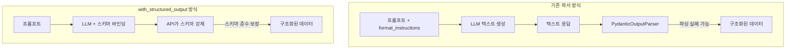
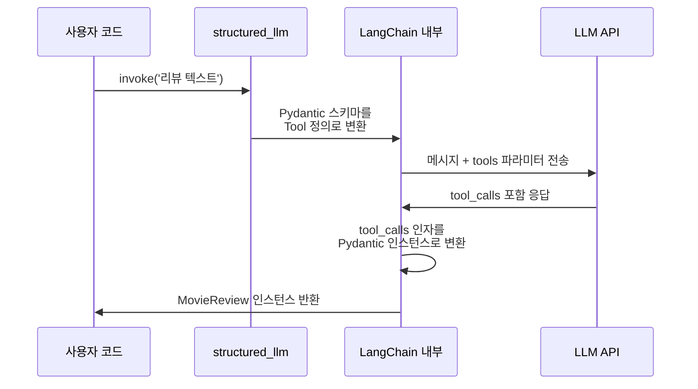
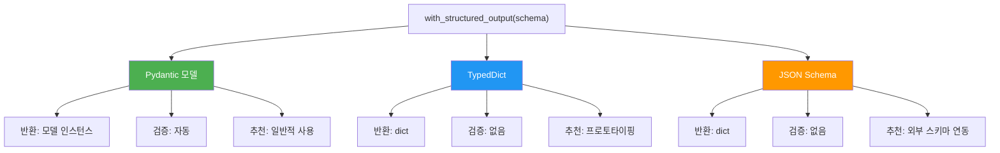
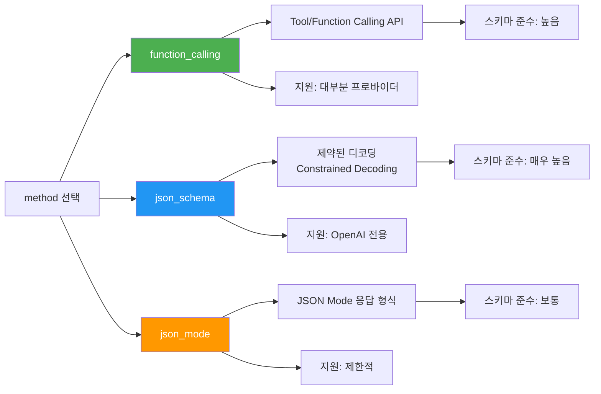
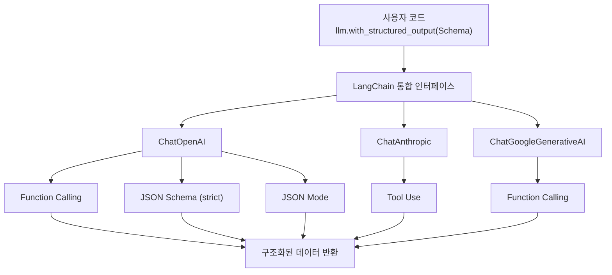

# with_structured_output 활용

> 파서 없이 LLM이 직접 구조화된 데이터를 반환하게 만드는, LangChain의 가장 현대적인 구조화 출력 방식

## 개요

이 섹션에서는 LangChain의 `with_structured_output()` 메서드를 학습합니다. 앞서 [4.1: 출력 파서 기초](ch04/session_4_1.md)에서 `JsonOutputParser`로 LLM 텍스트를 파싱하고, [4.2: Pydantic 기반 구조화 출력](ch04/session_4_2.md)에서 `PydanticOutputParser`로 타입 검증까지 더했는데요. 이번에는 **파서 자체를 없애고**, LLM이 네이티브 API(Function Calling / Tool Use)를 통해 **직접** 구조화된 데이터를 반환하도록 하는 방법을 배웁니다.

**선수 지식**: Session 4.2에서 배운 Pydantic 모델 정의, Field description, 중첩 모델 개념
**학습 목표**:
- `with_structured_output()`의 동작 원리와 내부 메커니즘을 이해할 수 있다
- Pydantic 모델, TypedDict, JSON Schema 세 가지 스키마 방식을 구분하여 사용할 수 있다
- `method`, `include_raw`, `strict` 등 핵심 파라미터를 상황에 맞게 활용할 수 있다
- OpenAI, Anthropic, Google 등 프로바이더별 지원 현황을 파악하고 적절히 대응할 수 있다

## 왜 알아야 할까?

Session 4.2에서 `PydanticOutputParser`를 사용해봤죠? 꽤 강력했지만, 한 가지 근본적인 한계가 있었습니다. **LLM이 텍스트를 생성한 뒤, 파이썬에서 그 텍스트를 파싱하는** 2단계 방식이라는 점이에요.

이 방식의 문제점을 생각해볼까요?

1. **포맷 지시문의 한계**: `format_instructions`를 프롬프트에 넣어도, LLM이 이를 100% 따른다는 보장이 없습니다
2. **파싱 실패 위험**: LLM이 JSON 대신 마크다운 코드 블록으로 감싸거나, 추가 설명을 덧붙이면 파싱이 실패합니다
3. **토큰 낭비**: `format_instructions` 자체가 꽤 긴 텍스트여서 프롬프트 토큰을 소모합니다

`with_structured_output()`은 이 모든 문제를 **LLM API 레벨에서** 해결합니다. OpenAI의 Function Calling, Anthropic의 Tool Use 같은 **모델 네이티브 기능**을 활용하기 때문에, LLM이 처음부터 스키마에 맞는 구조화된 데이터를 생성하거든요. 마치 프롬프트에 "JSON으로 답해줘"라고 부탁하는 것(파서 방식)과, API 설정에서 "응답 형식은 이 스키마야"라고 **강제하는 것**의 차이입니다.

> 📊 **그림 1**: 파서 방식 vs with_structured_output 방식 비교




## 핵심 개념

### 개념 1: with_structured_output()의 동작 원리

> 💡 **비유**: 식당에서 주문하는 두 가지 방법을 생각해보세요. 하나는 "스테이크 미디엄으로 주세요, 소스는 옆에 따로요, 감자는 구운 걸로요"라고 **말로** 주문하는 것이고(파서 방식), 다른 하나는 **주문서 양식**에 체크하는 것입니다(with_structured_output). 양식에는 "굽기: □레어 □미디엄 □웰던", "소스 위치: □위에 □옆에" 같은 칸이 있어서, 주방에서 절대 헷갈릴 수가 없죠.

`with_structured_output()`은 ChatModel의 메서드로, **스키마를 받아 새로운 Runnable을 반환**합니다. 이 Runnable은 일반 모델처럼 `invoke()`, `stream()`, `batch()`를 지원하지만, 반환값이 `AIMessage`가 아니라 **스키마에 맞는 구조화된 데이터**입니다.

> 📊 **그림 2**: with_structured_output 내부 동작 흐름




```python
from langchain_openai import ChatOpenAI
from pydantic import BaseModel, Field

# Pydantic 모델 정의
class MovieReview(BaseModel):
    """영화 리뷰 분석 결과"""
    title: str = Field(description="영화 제목")
    sentiment: str = Field(description="감성 분석 결과: positive, negative, neutral 중 하나")
    score: int = Field(description="1~10 사이의 평점", ge=1, le=10)
    summary: str = Field(description="리뷰 요약 (한 문장)")

# 모델에 스키마 바인딩 — 파서 없이!
llm = ChatOpenAI(model="gpt-4o", temperature=0)
structured_llm = llm.with_structured_output(MovieReview)

# invoke 호출 — 반환값이 MovieReview 인스턴스
result = structured_llm.invoke(
    "인셉션은 정말 대단한 영화였어요. 놀란 감독의 상상력에 감탄했고, "
    "특히 꿈속의 꿈 구조가 인상적이었습니다. 다만 후반부가 좀 복잡했어요."
)

print(type(result))    # <class 'MovieReview'>
print(result.title)    # 인셉션
print(result.sentiment)  # positive
print(result.score)    # 8
print(result.summary)  # 놀란 감독의 상상력이 돋보이는 대작이지만 후반부 복잡성이 아쉬움
```

핵심을 짚어볼까요? **`PydanticOutputParser`를 사용할 때와 비교하면 코드가 훨씬 간결**합니다:

```python
# ❌ 이전 방식 (Session 4.2) — 파서 + format_instructions 필요
parser = PydanticOutputParser(pydantic_object=MovieReview)
prompt = ChatPromptTemplate.from_messages([
    ("system", "리뷰를 분석하세요.\n{format_instructions}"),
    ("human", "{review}")
])
chain = prompt | llm | parser

# ✅ 새로운 방식 — with_structured_output 하나로 끝
structured_llm = llm.with_structured_output(MovieReview)
result = structured_llm.invoke("리뷰 텍스트...")
```

`format_instructions`를 프롬프트에 주입할 필요도 없고, 별도의 파서 체인도 필요 없습니다. 모델 API 레벨에서 스키마를 전달하기 때문이죠.

### 개념 2: 세 가지 스키마 방식 — Pydantic vs TypedDict vs JSON Schema

`with_structured_output()`은 세 가지 스키마 형식을 지원합니다. 각각의 특성을 이해하고 상황에 맞게 선택하는 것이 중요합니다.

> 💡 **비유**: 세 가지 스키마 방식은 서류 양식의 엄격함 수준과 비슷합니다. **JSON Schema**는 "이런 칸이 있어야 해"라는 최소 규격서이고, **TypedDict**는 "칸 이름과 타입을 지정한" 양식이며, **Pydantic**은 "칸마다 유효성 검증 로직까지 내장한" 스마트 양식인 거죠.

> 📊 **그림 3**: 세 가지 스키마 방식의 특성 비교




#### 방식 1: Pydantic 모델 (가장 추천)

```python
from pydantic import BaseModel, Field
from langchain_openai import ChatOpenAI

class Recipe(BaseModel):
    """요리 레시피"""
    name: str = Field(description="요리 이름")
    ingredients: list[str] = Field(description="재료 목록")
    cook_time_minutes: int = Field(description="조리 시간(분)", ge=1)
    difficulty: str = Field(description="난이도: easy, medium, hard 중 하나")

llm = ChatOpenAI(model="gpt-4o", temperature=0)
structured_llm = llm.with_structured_output(Recipe)

result = structured_llm.invoke("김치찌개 레시피를 알려줘")
print(result)
# name='김치찌개' ingredients=['김치', '돼지고기', '두부', '대파', '고춧가루', '다진 마늘']
# cook_time_minutes=30 difficulty='easy'

# Pydantic 인스턴스이므로 메서드 사용 가능
print(result.model_dump())  # dict로 변환
print(result.model_dump_json(indent=2))  # 예쁜 JSON 문자열
```

**반환 타입**: Pydantic 모델 인스턴스 → 검증, 직렬화 메서드 사용 가능

#### 방식 2: TypedDict (가볍게 쓰고 싶을 때)

```python
from typing import TypedDict, Annotated
from langchain_openai import ChatOpenAI

class Recipe(TypedDict):
    """요리 레시피"""
    name: Annotated[str, "요리 이름"]
    ingredients: Annotated[list[str], "재료 목록"]
    cook_time_minutes: Annotated[int, "조리 시간(분)"]
    difficulty: Annotated[str, "난이도: easy, medium, hard"]

llm = ChatOpenAI(model="gpt-4o", temperature=0)
structured_llm = llm.with_structured_output(Recipe)

result = structured_llm.invoke("김치찌개 레시피를 알려줘")
print(type(result))  # <class 'dict'>
print(result["name"])  # 김치찌개
```

**반환 타입**: 일반 `dict` → 런타임 검증 없음, 가볍고 빠름

> ⚠️ **흔한 오해**: TypedDict의 `Annotated` 메타데이터는 LLM에게 스키마 설명으로 전달됩니다. 빈 문자열이나 의미 없는 주석을 달면 LLM이 필드의 의미를 파악하지 못해 엉뚱한 값을 반환할 수 있어요. **반드시 명확한 설명을 적어주세요.**

#### 방식 3: JSON Schema (언어 중립적)

```python
from langchain_openai import ChatOpenAI

# JSON Schema 딕셔너리로 직접 정의
recipe_schema = {
    "title": "Recipe",
    "description": "요리 레시피",
    "type": "object",
    "properties": {
        "name": {"type": "string", "description": "요리 이름"},
        "ingredients": {
            "type": "array",
            "items": {"type": "string"},
            "description": "재료 목록"
        },
        "cook_time_minutes": {
            "type": "integer",
            "description": "조리 시간(분)"
        },
        "difficulty": {
            "type": "string",
            "enum": ["easy", "medium", "hard"],
            "description": "난이도"
        }
    },
    "required": ["name", "ingredients", "cook_time_minutes", "difficulty"]
}

llm = ChatOpenAI(model="gpt-4o", temperature=0)
structured_llm = llm.with_structured_output(recipe_schema)

result = structured_llm.invoke("김치찌개 레시피를 알려줘")
print(type(result))  # <class 'dict'>
print(result)
# {'name': '김치찌개', 'ingredients': ['김치', '돼지고기', ...], ...}
```

**반환 타입**: 일반 `dict` → JSON Schema를 외부 시스템에서 관리할 때 유용

세 방식을 비교하면:

| 기준 | Pydantic | TypedDict | JSON Schema |
|------|----------|-----------|-------------|
| 반환 타입 | 모델 인스턴스 | dict | dict |
| 런타임 검증 | ✅ 자동 | ❌ 없음 | ❌ 없음 |
| 기본값/제약조건 | ✅ Field() | ❌ 제한적 | ✅ enum, min/max 등 |
| IDE 자동완성 | ✅ 완벽 | ⚠️ 부분적 | ❌ 없음 |
| 언어 중립성 | ❌ Python 전용 | ❌ Python 전용 | ✅ 언어 무관 |
| 추천 상황 | 일반적인 경우 | 빠른 프로토타이핑 | 외부 스키마 연동 |

### 개념 3: 핵심 파라미터 — method, include_raw, strict

`with_structured_output()`에는 동작 방식을 세밀하게 제어하는 파라미터들이 있습니다.

> 💡 **비유**: 택배 발송과 비슷하게 생각해볼 수 있어요. `method`는 **배송 수단**(항공, 육로, 해상)을 선택하는 것이고, `include_raw`는 **배송 추적 정보**를 같이 받을지 정하는 것이며, `strict`는 **포장 규격 검사**를 얼마나 엄격하게 할지 정하는 것입니다.

#### method 파라미터

`method`는 구조화 출력을 **어떤 메커니즘으로** 수행할지 결정합니다:

> 📊 **그림 4**: method 파라미터별 동작 메커니즘




```python
from langchain_openai import ChatOpenAI
from pydantic import BaseModel, Field

class Sentiment(BaseModel):
    """감성 분석 결과"""
    label: str = Field(description="감성: positive, negative, neutral")
    confidence: float = Field(description="신뢰도 0.0~1.0", ge=0.0, le=1.0)

llm = ChatOpenAI(model="gpt-4o", temperature=0)

# 방법 1: function_calling (도구 호출 기반 — 가장 범용적)
structured_llm_fc = llm.with_structured_output(Sentiment, method="function_calling")

# 방법 2: json_schema (OpenAI Structured Outputs — 가장 엄격)
structured_llm_js = llm.with_structured_output(Sentiment, method="json_schema")

# 방법 3: json_mode (JSON Mode — 스키마 보장 약함)
# json_mode는 유효한 JSON 반환만 보장하고, 스키마 준수는 보장하지 않음
structured_llm_jm = llm.with_structured_output(Sentiment, method="json_mode")
```

| method | 메커니즘 | 스키마 준수 보장 | 지원 범위 |
|--------|----------|-----------------|----------|
| `"function_calling"` | Tool/Function Calling API | ⭐⭐⭐ 높음 | OpenAI, Anthropic, Google 등 대부분 |
| `"json_schema"` | OpenAI Structured Outputs | ⭐⭐⭐⭐ 매우 높음 | OpenAI (gpt-4o 이후 모델) |
| `"json_mode"` | JSON Mode 응답 형식 | ⭐⭐ 보통 | OpenAI, 일부 Ollama 모델 |

#### include_raw 파라미터

디버깅이나 에러 핸들링을 위해 원본 응답을 함께 받고 싶을 때 사용합니다:

```python
from langchain_openai import ChatOpenAI
from pydantic import BaseModel, Field

class CityInfo(BaseModel):
    """도시 정보"""
    name: str = Field(description="도시 이름")
    country: str = Field(description="국가")
    population: int = Field(description="인구수")

llm = ChatOpenAI(model="gpt-4o", temperature=0)

# include_raw=True로 설정하면 원본 응답도 함께 반환
structured_llm = llm.with_structured_output(CityInfo, include_raw=True)
result = structured_llm.invoke("서울에 대해 알려줘")

# 반환값이 dict로 바뀜: raw, parsed, parsing_error 키
print(result.keys())  # dict_keys(['raw', 'parsed', 'parsing_error'])

# 파싱된 결과
print(result["parsed"])         # CityInfo(name='서울', country='대한민국', population=9700000)

# 원본 AIMessage (tool_calls 포함)
print(result["raw"])            # AIMessage(content='', tool_calls=[...])

# 파싱 에러 (성공 시 None)
print(result["parsing_error"])  # None
```

`include_raw=True`는 프로덕션에서 **에러 로깅**과 **폴백(fallback) 처리**에 특히 유용합니다.

#### strict 파라미터

OpenAI의 Structured Outputs를 사용할 때, 스키마 검증 수준을 제어합니다:

```python
from langchain_openai import ChatOpenAI
from pydantic import BaseModel, Field

class StrictExample(BaseModel):
    """엄격한 스키마 예제"""
    name: str = Field(description="이름")
    age: int = Field(description="나이")

llm = ChatOpenAI(model="gpt-4o", temperature=0)

# strict=True: 모델이 스키마를 100% 준수하도록 강제
# OpenAI가 제약된 디코딩(constrained decoding)을 사용
structured_llm = llm.with_structured_output(StrictExample, strict=True)

result = structured_llm.invoke("김철수, 30살")
print(result)  # StrictExample(name='김철수', age=30)
```

> 🔥 **실무 팁**: `strict=True`는 OpenAI의 최신 모델(gpt-4o-2024-08-06 이후)에서만 동작합니다. Anthropic이나 Google 모델에서는 이 파라미터가 무시되거나 에러가 발생할 수 있어요. 멀티 프로바이더를 지원해야 한다면 `method="function_calling"`을 기본으로 사용하세요.

### 개념 4: 프로바이더별 지원 현황

`with_structured_output()`은 LangChain의 통합 인터페이스이지만, 내부 동작은 프로바이더마다 다릅니다. 어떤 차이가 있는지 알아야 프로덕션에서 문제를 피할 수 있겠죠?

```python
# OpenAI — 가장 풍부한 지원
from langchain_openai import ChatOpenAI

llm_openai = ChatOpenAI(model="gpt-4o", temperature=0)
# function_calling, json_schema, json_mode 모두 지원
structured = llm_openai.with_structured_output(MovieReview, method="json_schema", strict=True)
```

```python
# Anthropic — Tool Use 기반
from langchain_anthropic import ChatAnthropic

llm_anthropic = ChatAnthropic(model="claude-sonnet-4-20250514", temperature=0)
# function_calling(Tool Use) 방식으로 동작
# Pydantic 스키마가 Anthropic의 tool format으로 자동 변환됨
structured = llm_anthropic.with_structured_output(MovieReview)
```

```python
# Google — Gemini
from langchain_google_genai import ChatGoogleGenerativeAI

llm_google = ChatGoogleGenerativeAI(model="gemini-2.0-flash", temperature=0)
# function_calling 기반으로 동작
structured = llm_google.with_structured_output(MovieReview)
```

프로바이더별 지원 현황을 정리하면:

| 기능 | OpenAI | Anthropic | Google Gemini |
|------|--------|-----------|---------------|
| `with_structured_output()` | ✅ | ✅ | ✅ |
| `method="function_calling"` | ✅ | ✅ (Tool Use) | ✅ |
| `method="json_schema"` | ✅ (gpt-4o+) | ❌ | ❌ |
| `method="json_mode"` | ✅ | ❌ | ⚠️ 부분적 |
| `strict=True` | ✅ (gpt-4o+) | ❌ | ❌ |
| `include_raw=True` | ✅ | ✅ | ✅ |

**핵심 포인트**: `method="function_calling"`이 **모든 주요 프로바이더에서 공통적으로 지원**되는 방식입니다. 멀티 프로바이더 환경이라면 이 방식을 기본으로 사용하세요.

> 📊 **그림 5**: LangChain의 프로바이더 추상화 구조




### 개념 5: LCEL 체인에서 with_structured_output 활용

`with_structured_output()`이 반환하는 객체는 Runnable이므로, LCEL 파이프라인에 자연스럽게 결합됩니다:

```python
from langchain_openai import ChatOpenAI
from langchain_core.prompts import ChatPromptTemplate
from pydantic import BaseModel, Field

class BookAnalysis(BaseModel):
    """도서 분석 결과"""
    title: str = Field(description="책 제목")
    author: str = Field(description="저자")
    genre: str = Field(description="장르")
    themes: list[str] = Field(description="핵심 주제 목록")
    recommendation: str = Field(description="추천 대상 독자")

llm = ChatOpenAI(model="gpt-4o", temperature=0)
structured_llm = llm.with_structured_output(BookAnalysis)

# 프롬프트와 결합 — format_instructions 불필요!
prompt = ChatPromptTemplate.from_messages([
    ("system", "당신은 문학 평론가입니다. 주어진 책에 대해 분석해주세요."),
    ("human", "{book_description}")
])

# LCEL 체인: 프롬프트 → 구조화 출력 모델
chain = prompt | structured_llm

result = chain.invoke({
    "book_description": "조지 오웰의 1984는 전체주의 사회를 그린 디스토피아 소설입니다."
})

print(result.title)          # 1984
print(result.genre)          # 디스토피아 소설
print(result.themes)         # ['전체주의', '감시 사회', '자유의 상실', ...]
print(result.recommendation) # 사회 비평에 관심 있는 독자
```

이전 세션의 파서 방식과 비교하면, `partial_variables`로 `format_instructions`를 주입하는 과정이 완전히 사라졌습니다. 프롬프트는 **순수하게 지시사항만** 담고, 출력 형식은 모델 API가 처리하는 깔끔한 구조가 되었죠.

## 실습: 직접 해보기

실제 비즈니스 시나리오를 구현해봅시다. **고객 피드백을 자동으로 분석하는 시스템**을 만들겠습니다.

```python
"""
실습: 고객 피드백 분석 시스템
with_structured_output을 활용해 비정형 피드백을 구조화된 데이터로 변환합니다.
"""
import os
from dotenv import load_dotenv
from pydantic import BaseModel, Field
from langchain_openai import ChatOpenAI
from langchain_core.prompts import ChatPromptTemplate

load_dotenv()  # .env 파일에서 OPENAI_API_KEY 로드

# --- 1단계: 출력 스키마 정의 ---

class FeedbackItem(BaseModel):
    """개별 피드백 항목"""
    aspect: str = Field(description="피드백 대상 (예: 배송, 품질, 가격, 서비스)")
    sentiment: str = Field(description="감성: positive, negative, neutral 중 하나")
    detail: str = Field(description="구체적인 내용 요약")

class FeedbackAnalysis(BaseModel):
    """고객 피드백 종합 분석"""
    customer_intent: str = Field(
        description="고객의 주요 의도: complaint, praise, inquiry, suggestion 중 하나"
    )
    urgency: int = Field(
        description="긴급도 1~5 (5가 가장 긴급)",
        ge=1, le=5
    )
    items: list[FeedbackItem] = Field(
        description="개별 피드백 항목 목록"
    )
    suggested_action: str = Field(
        description="권장 대응 조치"
    )
    requires_human_review: bool = Field(
        description="사람의 검토가 필요한지 여부"
    )

# --- 2단계: 구조화 출력 모델 + LCEL 체인 구성 ---

llm = ChatOpenAI(model="gpt-4o", temperature=0)
structured_llm = llm.with_structured_output(FeedbackAnalysis)

prompt = ChatPromptTemplate.from_messages([
    ("system",
     "당신은 고객 서비스 분석 전문가입니다. "
     "고객의 피드백을 꼼꼼히 분석하여 구조화된 결과를 제공하세요. "
     "긴급한 불만은 urgency를 높게, 칭찬은 낮게 설정합니다."),
    ("human", "{feedback}")
])

# 파서 없이 깔끔한 체인
chain = prompt | structured_llm

# --- 3단계: 다양한 피드백 테스트 ---

feedbacks = [
    # 불만 피드백
    "주문한 지 2주나 지났는데 아직도 배송이 안 왔어요. "
    "고객센터 전화도 계속 안 받고... 제품 품질은 좋았는데 이번엔 정말 실망입니다. "
    "환불 처리해주세요.",

    # 칭찬 피드백
    "이번에 구매한 노트북 거치대 정말 좋아요! "
    "가격도 합리적이고, 다음날 바로 배송 온 것도 놀라웠습니다. "
    "친구한테도 추천했어요.",

    # 건의 피드백
    "앱에서 위시리스트 기능이 있으면 좋겠어요. "
    "지금은 매번 찾아봐야 해서 불편합니다. "
    "그리고 다크모드도 추가해주시면 감사하겠습니다."
]

for i, feedback in enumerate(feedbacks, 1):
    print(f"\n{'='*60}")
    print(f"피드백 #{i}")
    print(f"{'='*60}")

    # 분석 실행
    result = chain.invoke({"feedback": feedback})

    # 결과 출력
    print(f"의도: {result.customer_intent}")
    print(f"긴급도: {'🔴' * result.urgency}{'⚪' * (5 - result.urgency)} ({result.urgency}/5)")
    print(f"사람 검토 필요: {'예' if result.requires_human_review else '아니오'}")
    print(f"권장 조치: {result.suggested_action}")
    print(f"\n세부 항목:")
    for item in result.items:
        emoji = {"positive": "👍", "negative": "👎", "neutral": "➡️"}
        print(f"  {emoji.get(item.sentiment, '❓')} [{item.aspect}] {item.detail}")

# --- 4단계: include_raw=True로 디버깅 버전 ---

print(f"\n{'='*60}")
print("디버깅 모드 (include_raw=True)")
print(f"{'='*60}")

# include_raw=True로 원본 응답도 함께 확인
debug_llm = llm.with_structured_output(FeedbackAnalysis, include_raw=True)
debug_chain = prompt | debug_llm

debug_result = debug_chain.invoke({"feedback": feedbacks[0]})

print(f"파싱 성공: {debug_result['parsing_error'] is None}")
print(f"원본 tool_calls 수: {len(debug_result['raw'].tool_calls)}")
print(f"파싱 결과 타입: {type(debug_result['parsed']).__name__}")
```

실행하면 각 피드백이 자동으로 분석되어, 의도(complaint/praise/suggestion), 긴급도, 세부 항목별 감성, 권장 조치가 깔끔하게 구조화됩니다. `PydanticOutputParser`로 같은 작업을 하려면 복잡한 `format_instructions`와 파싱 에러 처리가 필요했을 텐데, `with_structured_output()`으로는 훨씬 깔끔하죠.

## 더 깊이 알아보기

### Function Calling의 탄생 — 구조화 출력의 기원

`with_structured_output()`의 근간이 되는 **Function Calling**은 어떻게 탄생했을까요?

2023년 6월 13일, OpenAI는 gpt-4-0613과 gpt-3.5-turbo-0613 모델과 함께 **Function Calling** 기능을 발표했습니다. 당시 개발자들은 LLM에게 "JSON으로 답해줘"라고 프롬프트에 적는 방식으로 구조화된 출력을 얻고 있었는데, 성공률이 불안정했죠. OpenAI의 엔지니어들은 "LLM이 외부 함수를 호출할 수 있게 하자"라는 아이디어에서 출발해, **API 레벨에서 함수 스키마를 전달**하는 방식을 만들었습니다.

원래는 말 그대로 "함수 호출"을 위한 기능이었지만, 개발자 커뮤니티에서 이를 **구조화된 출력을 얻는 용도로** 활용하기 시작했어요. "함수"라고 이름 붙였지만, 실제로 함수를 실행할 필요 없이 스키마에 맞는 인자(arguments)만 추출하면 그것이 곧 구조화된 데이터였으니까요.

이 "원래 의도와 다른" 활용이 너무 인기를 끌자, OpenAI는 2023년 11월에 `functions` 파라미터를 `tools`로 개편하며 더 범용적인 이름을 채택했습니다. 그리고 2024년 8월에는 아예 **Structured Outputs**라는 전용 기능을 출시해서, `strict: true`로 설정하면 JSON Schema를 100% 보장하는 제약된 디코딩(constrained decoding)을 지원하게 됐죠.

Anthropic도 2024년 4월 Claude 3 모델군과 함께 **Tool Use** 기능을 출시하며, LangChain의 `with_structured_output()`이 여러 프로바이더를 동일한 인터페이스로 지원할 수 있는 기반이 마련되었습니다.

### 제약된 디코딩(Constrained Decoding)이란?

`strict=True`가 어떻게 스키마 100% 준수를 보장하는지 궁금하지 않으신가요?

일반적인 LLM은 매 토큰을 생성할 때 전체 어휘(vocabulary)에서 확률 분포를 계산합니다. 하지만 **제약된 디코딩**에서는 JSON Schema에 맞지 않는 토큰의 확률을 0으로 만들어버립니다. 예를 들어 `"age": ` 다음에는 숫자 토큰만 선택할 수 있도록 제한하는 거죠. 이렇게 하면 **생성 과정 자체에서** 스키마 위반이 불가능해집니다. 프롬프트로 "JSON 형식으로 답해줘"라고 부탁하는 것과는 차원이 다른 보장 수준인 셈이에요.

## 흔한 오해와 팁

> ⚠️ **흔한 오해**: "with_structured_output이 PydanticOutputParser를 완전히 대체한다"고 생각하기 쉽지만, 그렇지는 않습니다. `with_structured_output()`은 **Tool Calling을 지원하는 ChatModel**에서만 사용 가능합니다. 오래된 모델(gpt-3.5-turbo 초기 버전 등)이나 일부 로컬 모델에서는 여전히 `PydanticOutputParser`가 필요할 수 있어요. 또한 스트리밍 시 부분 결과(partial)를 받아야 하는 상황에서는 `JsonOutputParser`가 더 적합할 수도 있습니다.

> 💡 **알고 계셨나요?**: `with_structured_output()`에 Pydantic 모델을 전달하면, LangChain이 내부적으로 Pydantic 스키마를 **Tool/Function 정의의 `parameters`(또는 `input_schema`)로 변환**합니다. 즉, 모델은 "이 함수를 호출할게"라는 형식으로 응답하고, LangChain이 그 "함수 인자"를 Pydantic 인스턴스로 변환하는 것이에요. `include_raw=True`로 원본을 확인하면, `AIMessage`의 `tool_calls` 필드에 실제 도구 호출 형태가 담겨 있는 것을 볼 수 있습니다.

> 🔥 **실무 팁**: 프로덕션에서는 **반드시 `include_raw=True`와 에러 핸들링을 함께** 사용하세요. 구조화 출력이 실패할 수 있는 경우(네트워크 이슈, 모델 변경, 복잡한 스키마 등)에 대비해, `parsing_error`를 체크하고 원본 응답을 로깅하는 것이 디버깅 시간을 크게 줄여줍니다. 아래는 실무 패턴입니다:
>
> ```python
> structured_llm = llm.with_structured_output(MyModel, include_raw=True)
> result = structured_llm.invoke(query)
> if result["parsing_error"]:
>     logger.error(f"파싱 실패: {result['parsing_error']}")
>     logger.error(f"원본 응답: {result['raw']}")
>     # 폴백 로직 실행
> else:
>     process(result["parsed"])
> ```

## 핵심 정리

| 개념 | 설명 |
|------|------|
| `with_structured_output()` | ChatModel에 스키마를 바인딩하여 구조화된 데이터를 직접 반환하는 Runnable을 생성하는 메서드 |
| Pydantic 스키마 | 가장 추천하는 방식. 모델 인스턴스 반환, 런타임 검증, IDE 자동완성 지원 |
| TypedDict 스키마 | 가볍고 빠른 방식. dict 반환, 런타임 검증 없음. 프로토타이핑에 적합 |
| JSON Schema | 언어 중립적 방식. dict 반환. 외부 시스템 스키마 연동에 적합 |
| `method` 파라미터 | `"function_calling"` (범용), `"json_schema"` (OpenAI 전용, 가장 엄격), `"json_mode"` (JSON 보장만) |
| `include_raw=True` | 파싱 결과와 함께 원본 AIMessage, 파싱 에러를 dict로 반환. 디버깅·폴백에 필수 |
| `strict=True` | OpenAI의 제약된 디코딩으로 스키마 100% 준수 보장 (gpt-4o 이후 모델) |
| Function Calling 기반 | 프롬프트에 format_instructions를 주입하는 대신, API 레벨에서 스키마를 전달하여 안정성 향상 |

## 다음 섹션 미리보기

구조화 출력이 항상 성공하면 좋겠지만, 현실은 그렇지 않습니다. LLM이 복잡한 스키마를 제대로 따르지 못하거나, 네트워크 이슈로 파싱이 실패하는 경우가 있거든요. 다음 세션 **[4.4: 파싱 에러 처리와 복구 전략]**에서는 `OutputFixingParser`, `RetryWithErrorOutputParser`, 그리고 `with_structured_output()`의 `include_raw` 옵션을 활용한 **폴백 체인** 구축 방법을 배웁니다. 프로덕션 수준의 견고한 출력 파이프라인을 만드는 핵심 스킬이에요.

## 참고 자료

- [How to return structured data from a model - LangChain 공식 문서](https://python.langchain.com/docs/how_to/structured_output/) - `with_structured_output()`의 공식 가이드. Pydantic, TypedDict, JSON Schema 세 가지 방식을 모두 다룹니다
- [Introducing Structured Outputs in the API - OpenAI 공식 블로그](https://openai.com/index/introducing-structured-outputs-in-the-api/) - OpenAI의 Structured Outputs 발표 포스트. `strict: true`와 제약된 디코딩의 원리를 설명합니다
- [Function calling and other API updates - OpenAI 공식 블로그](https://openai.com/index/function-calling-and-other-api-updates/) - 2023년 6월 Function Calling의 최초 발표. 구조화 출력의 기원을 이해하는 데 필수입니다
- [ChatOpenAI API Reference - LangChain](https://python.langchain.com/api_reference/openai/chat_models/langchain_openai.chat_models.base.ChatOpenAI.html) - `with_structured_output()` 메서드의 파라미터 상세 문서
- [Structured Output Comparison across popular LLM providers](https://medium.com/@rosgluk/structured-output-comparison-across-popular-llm-providers-openai-gemini-anthropic-mistral-and-1a5d42fa612a) - OpenAI, Anthropic, Gemini 등 프로바이더별 구조화 출력 지원 비교 분석

---
### 🔗 Related Sessions
- [lcel](../01-langchain-소개와-개발-환경-설정/01-llm-애플리케이션의-진화와-langchain.md) (prerequisite)
- [runnable](../01-langchain-소개와-개발-환경-설정/01-llm-애플리케이션의-진화와-langchain.md) (prerequisite)
- [chain](../01-langchain-소개와-개발-환경-설정/01-llm-애플리케이션의-진화와-langchain.md) (prerequisite)
- [json_output_parser](../04-출력-파서와-구조화된-출력/01-출력-파서-기초.md) (prerequisite)
- [format_instructions](../04-출력-파서와-구조화된-출력/01-출력-파서-기초.md) (prerequisite)
- [pydantic_output_parser](../04-출력-파서와-구조화된-출력/02-pydantic-기반-구조화-출력.md) (prerequisite)
- [nested_model](../04-출력-파서와-구조화된-출력/02-pydantic-기반-구조화-출력.md) (prerequisite)
- [field_validator](../04-출력-파서와-구조화된-출력/02-pydantic-기반-구조화-출력.md) (prerequisite)
