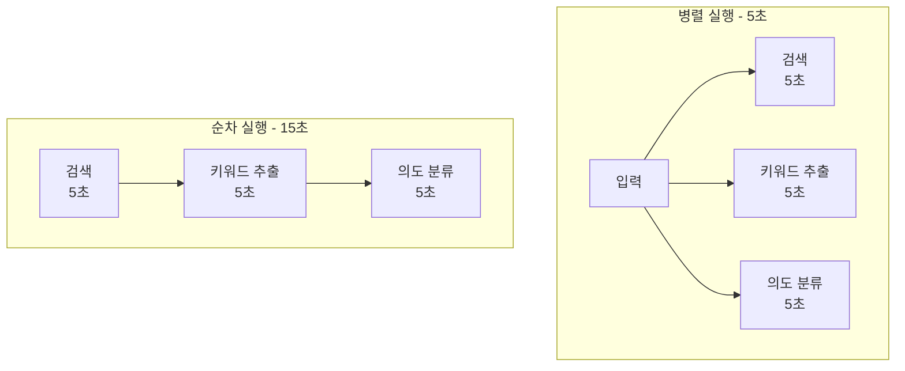
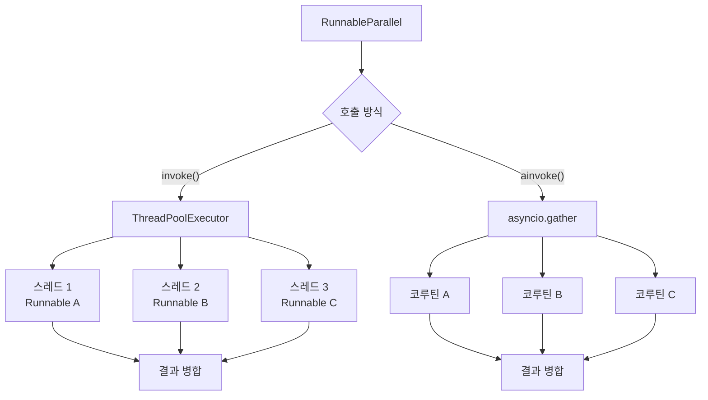
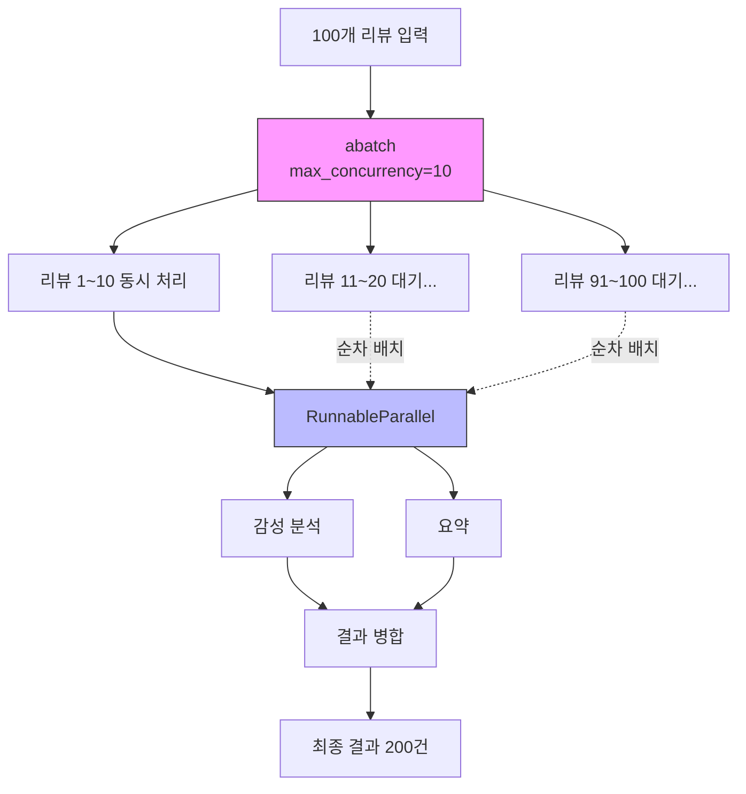
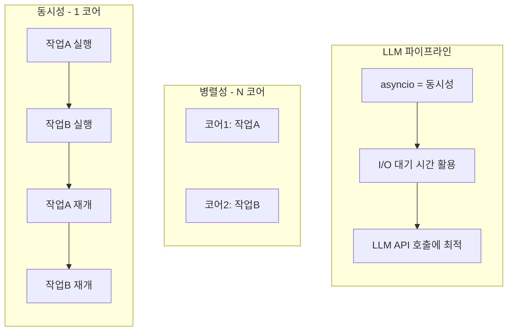

# 병렬 실행과 성능 최적화

> LCEL의 병렬 실행 메커니즘과 비동기 패턴을 활용하여 LLM 파이프라인의 성능을 극대화하는 방법을 학습합니다.

## 개요

이 섹션에서는 LCEL의 `RunnableParallel`을 심화 학습하고, Python `asyncio`를 활용한 비동기 실행, 동시성 제어, 배치 처리 최적화까지 LLM 파이프라인 성능을 극대화하는 전략을 다룹니다.

**선수 지식**: [5.2 핵심 Runnable 컴포넌트](ch05/session_5_2.md)에서 배운 `RunnableParallel` 기초, [5.1 LCEL 기초와 파이프 연산자](ch05/session_5_1.md)에서 배운 `invoke`/`stream`/`batch` 인터페이스

**학습 목표**:
- `RunnableParallel`의 내부 동작 원리(스레드 풀 vs 이벤트 루프)를 이해할 수 있다
- `ainvoke`, `astream`, `abatch` 등 비동기 메서드를 활용하여 동시 처리를 구현할 수 있다
- `max_concurrency` 설정으로 동시성을 제어할 수 있다
- `batch` 처리를 최적화하여 대량 입력을 효율적으로 처리할 수 있다

## 왜 알아야 할까?

> 📊 **그림 1**: 순차 실행 vs 병렬 실행 — 처리 시간 비교




LLM API 호출은 느립니다. 한 번의 호출에 보통 1~5초가 걸리는데요, 만약 10개의 질문을 순차적으로 처리하면 최대 50초가 걸릴 수 있습니다. 하지만 이 10개를 **동시에** 보내면? 가장 느린 하나의 응답 시간만큼만 기다리면 됩니다.

실전에서 마주하는 시나리오를 떠올려 보세요:

- **RAG 파이프라인**: 질문에 대해 문서 검색, 키워드 추출, 의도 분류를 동시에 수행
- **다국어 번역**: 하나의 텍스트를 영어, 일본어, 중국어로 동시 번역
- **대량 처리**: 수백 개의 고객 리뷰를 한꺼번에 감성 분석

이런 상황에서 순차 실행과 병렬 실행의 차이는 "커피 한 잔 마시고 올 시간" vs "버튼 누르면 바로 결과"만큼 극적입니다. 프로덕션 환경에서는 이 차이가 곧 사용자 경험과 서버 비용의 차이로 이어지죠.

## 핵심 개념

### 개념 1: RunnableParallel 심화 — 동시에 여러 요리를 하는 주방

> 💡 **비유**: 레스토랑 주방을 상상해보세요. 스테이크, 샐러드, 수프를 주문받았을 때, 한 명의 셰프가 순서대로 만들면 30분 걸립니다. 하지만 세 명의 셰프가 동시에 각자 하나씩 만들면? 가장 오래 걸리는 요리 시간(10분)이면 충분하죠. `RunnableParallel`이 바로 이 "여러 셰프 동시 투입" 역할을 합니다.

[5.2 핵심 Runnable 컴포넌트](ch05/session_5_2.md)에서 `RunnableParallel`의 기본 사용법을 배웠는데요, 이번에는 **내부 동작 원리**와 **성능 최적화 관점**에서 깊이 들어가 보겠습니다.

> 📊 **그림 2**: RunnableParallel 내부 동작 — 동기 vs 비동기




`RunnableParallel`의 동기(`invoke`) 호출은 내부적으로 **스레드 풀 실행기(ThreadPoolExecutor)**를 사용합니다. 각 Runnable을 별도 스레드에서 실행하여 I/O 바운드 작업(LLM API 호출 등)의 대기 시간을 겹치게 만드는 거죠. 비동기(`ainvoke`) 호출에서는 `asyncio.gather`를 사용하여 더 가볍고 효율적인 동시 실행을 수행합니다.

```python
import time
from langchain_core.runnables import RunnableParallel, RunnableLambda

# 2초 걸리는 작업 시뮬레이션
def slow_task_a(x: dict) -> str:
    time.sleep(2)
    return f"A 완료: {x['topic']}"

def slow_task_b(x: dict) -> str:
    time.sleep(2)
    return f"B 완료: {x['topic']}"

def slow_task_c(x: dict) -> str:
    time.sleep(2)
    return f"C 완료: {x['topic']}"

# 순차 실행: 약 6초
start = time.time()
result_a = slow_task_a({"topic": "AI"})
result_b = slow_task_b({"topic": "AI"})
result_c = slow_task_c({"topic": "AI"})
sequential_time = time.time() - start
print(f"순차 실행: {sequential_time:.1f}초")
# 출력: 순차 실행: 6.0초

# 병렬 실행: 약 2초
parallel_chain = RunnableParallel(
    a=RunnableLambda(slow_task_a),
    b=RunnableLambda(slow_task_b),
    c=RunnableLambda(slow_task_c),
)
start = time.time()
result = parallel_chain.invoke({"topic": "AI"})
parallel_time = time.time() - start
print(f"병렬 실행: {parallel_time:.1f}초")
print(f"속도 향상: {sequential_time / parallel_time:.1f}배")
# 출력: 병렬 실행: 2.0초
# 출력: 속도 향상: 3.0배
```

핵심을 짚어볼까요? 세 작업이 각각 2초씩 걸리지만, `RunnableParallel`로 감싸면 **동시에 실행**되어 총 2초만 소요됩니다. 3배의 속도 향상이죠.

### 개념 2: 비동기 실행 — 기다리는 동안 다른 일 하기

> 💡 **비유**: 카페에서 커피를 주문하고 진동벨을 받는 상황을 생각해보세요. 커피가 만들어지는 동안 자리에 앉아 책을 읽을 수 있죠. 이게 바로 비동기(async) 프로그래밍의 핵심입니다. "기다리는 시간"을 "다른 일 하는 시간"으로 바꾸는 것이거든요. 반대로 동기(sync) 방식은 카운터 앞에 서서 커피가 나올 때까지 멍하니 기다리는 겁니다.

LLM API 호출은 전형적인 **I/O 바운드** 작업입니다. CPU가 열심히 계산하는 게 아니라, 네트워크를 통해 요청을 보내고 **응답을 기다리는** 시간이 대부분이죠. Python의 `asyncio`는 이런 대기 시간을 활용하여 다른 작업을 수행할 수 있게 해줍니다.

LCEL의 모든 Runnable은 동기 메서드에 대응하는 비동기 메서드를 제공합니다:

| 동기 메서드 | 비동기 메서드 | 용도 |
|-----------|------------|------|
| `invoke()` | `ainvoke()` | 단일 입력 처리 |
| `stream()` | `astream()` | 스트리밍 출력 |
| `batch()` | `abatch()` | 다중 입력 배치 처리 |

> 📊 **그림 3**: 비동기 동시 실행 흐름 — asyncio.gather

```mermaid
sequenceDiagram
    participant App as 애플리케이션
    participant Loop as 이벤트 루프
    participant API1 as LLM API (토픽1)
    participant API2 as LLM API (토픽2)
    participant API3 as LLM API (토픽3)
    App->>Loop: asyncio.gather(ainvoke x 3)
    Loop->>API1: 요청 전송
    Loop->>API2: 요청 전송
    Loop->>API3: 요청 전송
    Note over Loop: 대기 중 다른 작업 가능
    API2-->>Loop: 응답 (1.2초)
    API1-->>Loop: 응답 (1.5초)
    API3-->>Loop: 응답 (1.8초)
    Loop-->>App: 모든 결과 반환 (총 1.8초)
```


```python
import asyncio
import time
from langchain_openai import ChatOpenAI
from langchain_core.prompts import ChatPromptTemplate
from langchain_core.output_parsers import StrOutputParser

# 모델과 체인 설정
model = ChatOpenAI(model="gpt-4o", temperature=0.7)
prompt = ChatPromptTemplate.from_template("{topic}에 대해 한 문장으로 설명해주세요.")
chain = prompt | model | StrOutputParser()

# --- 동기 순차 실행 ---
topics = ["인공지능", "블록체인", "양자컴퓨팅", "메타버스", "사이버보안"]

start = time.time()
sync_results = []
for topic in topics:
    result = chain.invoke({"topic": topic})  # 하나씩 순차 실행
    sync_results.append(result)
sync_time = time.time() - start
print(f"동기 순차 실행: {sync_time:.1f}초")


# --- 비동기 동시 실행 ---
async def run_async():
    tasks = [
        chain.ainvoke({"topic": topic})  # 비동기 호출 생성
        for topic in topics
    ]
    return await asyncio.gather(*tasks)  # 모두 동시에 실행

start = time.time()
async_results = asyncio.run(run_async())
async_time = time.time() - start
print(f"비동기 동시 실행: {async_time:.1f}초")
print(f"속도 향상: {sync_time / async_time:.1f}배")
# 5개 토픽을 동시에 처리하므로 약 5배 빨라집니다!
```

`asyncio.gather`는 여러 코루틴을 **동시에 실행**하고 모든 결과가 준비될 때까지 기다립니다. LLM API처럼 네트워크 I/O가 주된 작업에서는 거의 **선형적인 속도 향상**을 얻을 수 있어요.

### 개념 3: 배치 처리와 max_concurrency — 수도꼭지 조절하기

> 💡 **비유**: 수도꼭지를 완전히 열면 물이 빨리 나오지만, 수압이 떨어지거나 파이프가 터질 수 있습니다. `max_concurrency`는 바로 이 수도꼭지의 개방도를 조절하는 밸브입니다. API 제공자의 요청 제한(rate limit)을 넘지 않으면서 최대한 빠르게 처리하는 적절한 균형점을 찾는 거죠.

`batch()` 메서드는 여러 입력을 한꺼번에 처리합니다. 기본적으로 모든 입력을 동시에 처리하려고 하는데, API rate limit이 있을 때는 문제가 될 수 있습니다. `max_concurrency` 옵션으로 동시 처리 개수를 제한할 수 있습니다.

```python
from langchain_openai import ChatOpenAI
from langchain_core.prompts import ChatPromptTemplate
from langchain_core.output_parsers import StrOutputParser
import time

model = ChatOpenAI(model="gpt-4o", temperature=0)
prompt = ChatPromptTemplate.from_template(
    "{product}의 장점을 한 문장으로 작성해주세요."
)
chain = prompt | model | StrOutputParser()

# 20개 제품 목록
products = [{"product": f"제품_{i}"} for i in range(20)]

# --- 동시성 제한 없이 배치 실행 ---
start = time.time()
results_all = chain.batch(products)  # 20개 동시 실행 시도
print(f"제한 없음: {time.time() - start:.1f}초")

# --- 동시성 5로 제한하여 배치 실행 ---
start = time.time()
results_limited = chain.batch(
    products,
    config={"max_concurrency": 5}  # 최대 5개씩 동시 실행
)
print(f"max_concurrency=5: {time.time() - start:.1f}초")

# --- 비동기 배치: abatch ---
import asyncio

async def run_abatch():
    return await chain.abatch(
        products,
        config={"max_concurrency": 5}  # 비동기에서도 동시성 제어 가능
    )

start = time.time()
results_async = asyncio.run(run_abatch())
print(f"abatch (max_concurrency=5): {time.time() - start:.1f}초")
```

> ⚠️ **흔한 오해**: "`max_concurrency`를 높이면 무조건 빨라진다"고 생각하기 쉽지만, 실제로는 API provider의 rate limit(예: OpenAI TPM/RPM 제한)에 걸려 오히려 429 에러가 발생하고 더 느려질 수 있습니다. 적절한 값을 찾는 것이 핵심입니다.

### 개념 4: RunnableParallel + 비동기의 조합 — 진정한 성능 최적화

> 💡 **비유**: `RunnableParallel`은 "여러 요리를 동시에 만드는 것"이고, 비동기(`async`)는 "요리 중 오븐 앞에서 기다리지 않고 다른 준비를 하는 것"입니다. 두 가지를 결합하면? 여러 요리를 동시에 만들면서, 각 요리의 대기 시간도 활용하는 **초효율 주방**이 완성됩니다.

실전에서는 `RunnableParallel`과 비동기 실행을 조합하여 복잡한 파이프라인의 성능을 극대화합니다. `RunnableParallel`에 `ainvoke`를 호출하면, 내부적으로 `asyncio.gather`를 사용하여 각 Runnable의 `ainvoke`를 동시에 실행합니다.

```python
import asyncio
import time
from langchain_openai import ChatOpenAI
from langchain_core.prompts import ChatPromptTemplate
from langchain_core.output_parsers import StrOutputParser
from langchain_core.runnables import RunnableParallel, RunnablePassthrough

model = ChatOpenAI(model="gpt-4o", temperature=0.7)

# 세 가지 분석을 동시에 수행하는 파이프라인
sentiment_chain = (
    ChatPromptTemplate.from_template(
        "다음 텍스트의 감성을 '긍정/부정/중립'으로 분류하세요: {text}"
    )
    | model
    | StrOutputParser()
)

keyword_chain = (
    ChatPromptTemplate.from_template(
        "다음 텍스트에서 핵심 키워드 3개를 추출하세요: {text}"
    )
    | model
    | StrOutputParser()
)

summary_chain = (
    ChatPromptTemplate.from_template(
        "다음 텍스트를 한 문장으로 요약하세요: {text}"
    )
    | model
    | StrOutputParser()
)

# RunnableParallel로 세 분석을 동시 실행
analysis_pipeline = RunnableParallel(
    sentiment=sentiment_chain,
    keywords=keyword_chain,
    summary=summary_chain,
)

# 동기 실행
start = time.time()
result_sync = analysis_pipeline.invoke(
    {"text": "LangChain은 LLM 애플리케이션 개발을 혁신적으로 간소화했습니다."}
)
print(f"동기 병렬: {time.time() - start:.1f}초")
print(result_sync)

# 비동기 실행 — 서버 환경에서 더 효율적
async def analyze_async():
    result = await analysis_pipeline.ainvoke(
        {"text": "LangChain은 LLM 애플리케이션 개발을 혁신적으로 간소화했습니다."}
    )
    return result

start = time.time()
result_async = asyncio.run(analyze_async())
print(f"비동기 병렬: {time.time() - start:.1f}초")
```

동기와 비동기 모두 세 체인을 병렬로 실행하지만, 비동기 버전은 **스레드 오버헤드 없이** 이벤트 루프에서 가볍게 동작합니다. 특히 FastAPI 같은 비동기 웹 프레임워크와 결합할 때 진가를 발휘하죠.

### 개념 5: 실전 패턴 — 대량 배치의 병렬 + 동시성 제어

실전에서는 수백~수천 개의 입력을 처리해야 하는 경우가 많습니다. 이때 `batch` + `max_concurrency`와 `RunnableParallel`을 결합하여 **안전하면서도 빠른** 파이프라인을 구축합니다.

```python
import asyncio
import time
from langchain_openai import ChatOpenAI
from langchain_core.prompts import ChatPromptTemplate
from langchain_core.output_parsers import StrOutputParser
from langchain_core.runnables import RunnableParallel

model = ChatOpenAI(model="gpt-4o", temperature=0)

# 각 리뷰에 대해 감성 + 요약을 동시에 수행하는 파이프라인
review_pipeline = RunnableParallel(
    sentiment=(
        ChatPromptTemplate.from_template(
            "감성 분석 (긍정/부정/중립): {review}"
        )
        | model
        | StrOutputParser()
    ),
    summary=(
        ChatPromptTemplate.from_template(
            "한 줄 요약: {review}"
        )
        | model
        | StrOutputParser()
    ),
)

# 100개 리뷰 배치 처리 (동시성 10으로 제한)
reviews = [{"review": f"리뷰 내용 {i}번..."} for i in range(100)]

async def process_reviews():
    results = await review_pipeline.abatch(
        reviews,
        config={"max_concurrency": 10}  # 동시에 10개 리뷰만 처리
    )
    return results

start = time.time()
all_results = asyncio.run(process_reviews())
print(f"100개 리뷰 처리 완료: {time.time() - start:.1f}초")
print(f"각 리뷰 결과 예시: {all_results[0]}")
# 출력 예시: {'sentiment': '긍정', 'summary': '...'}
```

이 패턴에서는 **두 단계의 병렬화**가 동시에 작동합니다:

1. **`RunnableParallel`**: 각 리뷰에 대해 감성 분석과 요약을 **동시에** 실행
2. **`abatch` + `max_concurrency`**: 100개 리뷰를 10개씩 묶어서 **동시에** 처리

이렇게 하면 하나의 리뷰당 LLM 호출이 2번(감성 + 요약)이므로 총 200번의 호출이 필요하지만, 병렬화 덕분에 순차 실행 대비 극적으로 빨라집니다.

> 📊 **그림 4**: 2단계 병렬화 구조 — RunnableParallel + abatch




## 실습: 직접 해보기

다음은 실제 프로덕션에 가까운 **다국어 콘텐츠 분석 파이프라인**입니다. 하나의 텍스트를 입력하면 번역, 요약, 감성 분석을 동시에 수행하고, 여러 텍스트를 배치로 처리합니다.

```python
"""
실습: 다국어 콘텐츠 분석 파이프라인
- RunnableParallel로 번역/요약/감성을 동시 분석
- batch + max_concurrency로 대량 처리
- 동기 vs 비동기 성능 비교
"""

import asyncio
import time
from dotenv import load_dotenv
from langchain_openai import ChatOpenAI
from langchain_core.prompts import ChatPromptTemplate
from langchain_core.output_parsers import StrOutputParser
from langchain_core.runnables import RunnableParallel

# 환경 변수 로드 (.env 파일에 OPENAI_API_KEY 필요)
load_dotenv()

# 모델 설정
MODEL_NAME = "gpt-4o"
TEMPERATURE = 0.3

model = ChatOpenAI(model=MODEL_NAME, temperature=TEMPERATURE)
parser = StrOutputParser()

# === 1단계: 개별 분석 체인 구성 ===

# 영어 번역 체인
translate_chain = (
    ChatPromptTemplate.from_template(
        "Translate the following Korean text to English. "
        "Output only the translation:\n\n{text}"
    )
    | model
    | parser
)

# 핵심 요약 체인
summary_chain = (
    ChatPromptTemplate.from_template(
        "다음 텍스트를 핵심만 담아 2문장으로 요약하세요:\n\n{text}"
    )
    | model
    | parser
)

# 감성 분석 체인
sentiment_chain = (
    ChatPromptTemplate.from_template(
        "다음 텍스트의 감성을 분석하세요.\n"
        "형식: 감성(긍정/부정/중립) | 확신도(0-100%) | 근거\n\n{text}"
    )
    | model
    | parser
)

# 키워드 추출 체인
keyword_chain = (
    ChatPromptTemplate.from_template(
        "다음 텍스트에서 핵심 키워드 5개를 쉼표로 구분하여 추출하세요:\n\n{text}"
    )
    | model
    | parser
)

# === 2단계: RunnableParallel로 동시 분석 파이프라인 구성 ===
analysis_pipeline = RunnableParallel(
    translation=translate_chain,   # 영어 번역
    summary=summary_chain,         # 요약
    sentiment=sentiment_chain,     # 감성 분석
    keywords=keyword_chain,        # 키워드 추출
)

# === 3단계: 테스트 데이터 ===
sample_texts = [
    {"text": "LangChain은 LLM 기반 애플리케이션 개발을 획기적으로 간소화한 프레임워크입니다. "
             "LCEL 덕분에 복잡한 파이프라인도 직관적으로 구성할 수 있게 되었습니다."},
    {"text": "최근 AI 기술의 발전 속도가 너무 빨라서 개발자들이 따라가기 힘든 상황입니다. "
             "매주 새로운 모델과 프레임워크가 등장하고 있어 학습 부담이 큽니다."},
    {"text": "오늘 출시된 신제품은 사용자 인터페이스가 직관적이고 성능도 뛰어나서 "
             "많은 개발자들로부터 호평을 받고 있습니다."},
]


# === 4단계: 성능 비교 ===
def run_sync():
    """동기 순차 실행"""
    results = []
    for text_input in sample_texts:
        result = analysis_pipeline.invoke(text_input)
        results.append(result)
    return results


async def run_async_sequential():
    """비동기 순차 실행 (ainvoke를 순서대로)"""
    results = []
    for text_input in sample_texts:
        result = await analysis_pipeline.ainvoke(text_input)
        results.append(result)
    return results


async def run_async_gather():
    """비동기 동시 실행 (asyncio.gather로 모든 텍스트를 동시에)"""
    tasks = [
        analysis_pipeline.ainvoke(text_input)
        for text_input in sample_texts
    ]
    return await asyncio.gather(*tasks)


async def run_abatch():
    """abatch로 배치 실행 (동시성 제어 포함)"""
    return await analysis_pipeline.abatch(
        sample_texts,
        config={"max_concurrency": 2}  # 동시에 2개 텍스트만 처리
    )


# === 5단계: 벤치마크 실행 ===
def benchmark():
    print("=" * 60)
    print("🚀 다국어 콘텐츠 분석 파이프라인 벤치마크")
    print("=" * 60)
    print(f"텍스트 수: {len(sample_texts)}개")
    print(f"텍스트당 분석 항목: 4개 (번역, 요약, 감성, 키워드)")
    print(f"총 LLM 호출 수: {len(sample_texts) * 4}회")
    print("-" * 60)

    # 1. 동기 순차 실행
    start = time.time()
    sync_results = run_sync()
    sync_time = time.time() - start
    print(f"1) 동기 순차 실행:       {sync_time:.1f}초")

    # 2. 비동기 순차 실행
    start = time.time()
    async_seq_results = asyncio.run(run_async_sequential())
    async_seq_time = time.time() - start
    print(f"2) 비동기 순차 실행:     {async_seq_time:.1f}초")

    # 3. 비동기 동시 실행 (asyncio.gather)
    start = time.time()
    async_gather_results = asyncio.run(run_async_gather())
    async_gather_time = time.time() - start
    print(f"3) 비동기 동시 실행:     {async_gather_time:.1f}초")

    # 4. abatch 실행
    start = time.time()
    abatch_results = asyncio.run(run_abatch())
    abatch_time = time.time() - start
    print(f"4) abatch(max_conc=2):  {abatch_time:.1f}초")

    print("-" * 60)
    print(f"✨ 최대 속도 향상: {sync_time / async_gather_time:.1f}배")
    print()

    # 결과 샘플 출력
    print("📊 첫 번째 텍스트 분석 결과:")
    print("-" * 60)
    for key, value in async_gather_results[0].items():
        print(f"  [{key}]")
        print(f"    {value[:100]}...")
        print()


if __name__ == "__main__":
    benchmark()
```

실행하면 네 가지 방식의 처리 시간을 비교할 수 있습니다:

1. **동기 순차**: 가장 느림 (모든 호출이 순서대로)
2. **비동기 순차**: 약간 개선 (각 `RunnableParallel` 내부는 병렬이지만 텍스트 간은 순차)
3. **비동기 동시**: 가장 빠름 (텍스트 간도 동시 + 분석 항목도 동시)
4. **abatch**: 동시성 제어로 rate limit 안전 + 적절한 속도

## 더 깊이 알아보기

### Python asyncio의 탄생 이야기

Python의 비동기 프로그래밍은 꽤 험난한 역사를 거쳐왔습니다. 2000년대 초반, Python 커뮤니티에서는 Twisted, Tornado 같은 비동기 프레임워크가 각자의 이벤트 루프를 갖고 경쟁하고 있었는데요.

2012년, Python의 창시자 귀도 반 로섬(Guido van Rossum)이 직접 나서서 **PEP 3156 — Asynchronous IO Support Rebooted**를 제안합니다. "비동기 프로그래밍의 표준이 필요하다"는 절실한 요구에 응답한 것이죠. 이것이 Python 3.4(2014년)에서 `asyncio` 모듈로 탄생합니다.

하지만 초기의 `asyncio`는 `@asyncio.coroutine`과 `yield from` 문법을 사용해야 해서 꽤 불편했습니다. Python 3.5(2015년)에서 `async`/`await` 키워드가 도입되면서 비로소 우리가 아는 깔끔한 비동기 문법이 완성되었죠.

재미있는 점은, Python의 **GIL(Global Interpreter Lock)** 때문에 멀티스레딩이 CPU 바운드 작업에서 효과가 없다는 한계가 오히려 `asyncio`의 인기를 끌어올렸다는 겁니다. "어차피 스레드로 병렬 처리가 안 되니, I/O 바운드 작업은 코루틴으로 하자"는 실용적 선택이 LangChain 같은 LLM 프레임워크에서 빛을 발하고 있습니다.

> 💡 **알고 계셨나요?**: LangChain의 LCEL은 설계 초기부터 비동기를 1급 시민(first-class citizen)으로 지원했습니다. Harrison Chase(LangChain 창시자)는 2023년 LCEL 발표에서 "모든 체인이 동기/비동기 양쪽으로 아무런 코드 변경 없이 작동해야 한다"를 핵심 설계 원칙으로 꼽았습니다. 이 덕분에 개발 시에는 `invoke`로 편하게 테스트하고, 프로덕션에서는 `ainvoke`로 바꾸기만 하면 되는 거죠.

### 동시성(Concurrency) vs 병렬성(Parallelism)

> 📊 **그림 5**: 동시성 vs 병렬성 — 실행 방식 비교




이 두 개념은 자주 혼동되지만 명확히 다릅니다:

- **동시성**: 여러 작업이 **번갈아가며** 진행됨 (하나의 코어에서 컨텍스트 스위칭)
- **병렬성**: 여러 작업이 **물리적으로 동시에** 실행됨 (여러 코어 사용)

`asyncio`는 **동시성**을 제공합니다. 하나의 스레드에서 여러 코루틴이 번갈아 실행되죠. 하지만 LLM API 호출처럼 대기 시간이 긴 I/O 작업에서는 동시성만으로도 엄청난 성능 향상을 얻을 수 있습니다.

## 흔한 오해와 팁

> ⚠️ **흔한 오해**: "비동기를 쓰면 무조건 빨라진다"고 생각하기 쉬운데, 사실 단일 LLM 호출에서는 동기와 비동기의 차이가 거의 없습니다. 비동기의 진정한 이점은 **여러 작업을 동시에 처리**할 때 나타납니다. `ainvoke` 하나만 호출하면 `invoke`와 속도 차이가 없어요.

> 💡 **알고 계셨나요?**: `RunnableParallel`의 동기 `invoke`는 내부적으로 `ThreadPoolExecutor`를 사용하여 각 Runnable을 별도 스레드에서 실행합니다. 따라서 동기 모드에서도 병렬 실행이 이루어지지만, 비동기 `ainvoke`가 스레드 생성 오버헤드 없이 더 가볍게 동작합니다. 수천 개의 동시 작업이 필요한 서버 환경에서는 이 차이가 중요해집니다.

> 🔥 **실무 팁**: `max_concurrency` 값은 사용하는 API의 rate limit에 맞춰 설정하세요. OpenAI의 경우 티어에 따라 RPM(Requests Per Minute)이 다른데, 대략 `RPM / 60`을 초기 `max_concurrency` 값으로 설정하고, 429 에러 발생 여부를 모니터링하며 조절하는 것이 좋습니다. 예를 들어 RPM이 500이라면 `max_concurrency=8` 정도로 시작하세요.

> 🔥 **실무 팁**: Jupyter Notebook에서 `asyncio.run()`을 사용하면 "이미 이벤트 루프가 실행 중"이라는 에러가 발생합니다. Notebook에서는 `await`를 직접 사용하거나, `nest_asyncio` 패키지를 설치하여 `nest_asyncio.apply()`를 호출한 후 사용하세요.

## 핵심 정리

| 개념 | 설명 |
|------|------|
| `RunnableParallel` 내부 동작 | 동기: `ThreadPoolExecutor`로 스레드 병렬, 비동기: `asyncio.gather`로 코루틴 동시 |
| `ainvoke` / `astream` / `abatch` | Runnable의 비동기 메서드, `async`/`await`와 함께 사용 |
| `asyncio.gather` | 여러 코루틴을 동시에 실행하고 모든 결과를 모아 반환 |
| `max_concurrency` | `batch`/`abatch` 호출 시 `config={"max_concurrency": N}`으로 동시 처리 수 제한 |
| I/O 바운드 vs CPU 바운드 | LLM API 호출은 I/O 바운드이므로 비동기/동시성으로 큰 성능 향상 가능 |
| 동시성 vs 병렬성 | 동시성은 번갈아 실행, 병렬성은 물리적 동시 실행. `asyncio`는 동시성 제공 |
| 2단계 병렬화 | `RunnableParallel`(항목 간) + `batch`(입력 간) 결합으로 최대 성능 |

## 다음 섹션 미리보기

이번 섹션에서 성능을 높이는 **병렬 실행**과 **비동기 처리**를 배웠다면, 다음 섹션 [5.5 스트리밍과 이벤트 처리](ch05/session_5_5.md)에서는 `astream_events`와 `astream_log`를 활용하여 체인 실행 중간 과정을 **실시간으로 관찰**하고, 사용자에게 **점진적으로 결과를 보여주는** 스트리밍 패턴을 학습합니다. 특히 복잡한 파이프라인에서 각 단계의 중간 결과를 추적하는 고급 스트리밍 기법을 다룹니다.

## 참고 자료

- [LangChain LCEL Concepts — 공식 문서](https://python.langchain.com/docs/concepts/lcel/) - LCEL의 핵심 설계 원칙과 Runnable 인터페이스의 동기/비동기 지원을 설명하는 공식 개념 문서
- [RunnableParallel API Reference — LangChain](https://python.langchain.com/api_reference/core/runnables/langchain_core.runnables.base.RunnableParallel.html) - `RunnableParallel`의 모든 메서드와 `config` 옵션을 상세히 기술한 API 레퍼런스
- [Python asyncio 공식 문서](https://docs.python.org/3/library/asyncio.html) - `asyncio`의 이벤트 루프, 코루틴, `gather` 등 핵심 API에 대한 공식 가이드
- [Async Calls for Chains with LangChain — Towards Data Science](https://towardsdatascience.com/async-calls-for-chains-with-langchain-3818c16062ed/) - LangChain에서 비동기 체인 호출의 성능 이점을 실측 벤치마크와 함께 설명한 실전 가이드
- [LangChain Expression Language — 공식 블로그](https://blog.langchain.com/langchain-expression-language/) - LCEL의 설계 철학과 병렬 실행 지원에 대한 LangChain 팀의 공식 발표 글

---
### 🔗 Related Sessions
- [lcel_pipe_operator](../05-lcellangchain-expression-language-마스터/01-lcel-기초와-파이프-연산자.md) (prerequisite)
- [runnable_protocol](../05-lcellangchain-expression-language-마스터/01-lcel-기초와-파이프-연산자.md) (prerequisite)
- [invoke_method](../05-lcellangchain-expression-language-마스터/01-lcel-기초와-파이프-연산자.md) (prerequisite)
- [batch_method](../05-lcellangchain-expression-language-마스터/01-lcel-기초와-파이프-연산자.md) (prerequisite)
- [runnable_lambda](../05-lcellangchain-expression-language-마스터/02-핵심-runnable-컴포넌트.md) (prerequisite)
- [runnable_parallel](../05-lcellangchain-expression-language-마스터/02-핵심-runnable-컴포넌트.md) (prerequisite)
- [stream_method](../05-lcellangchain-expression-language-마스터/01-lcel-기초와-파이프-연산자.md) (prerequisite)
