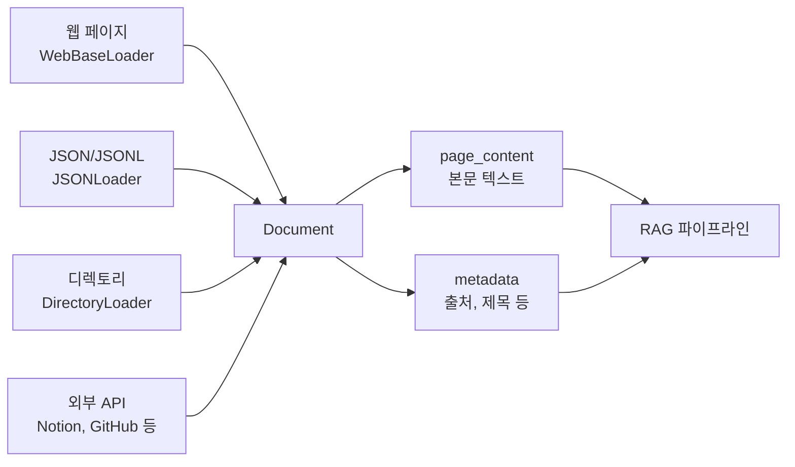
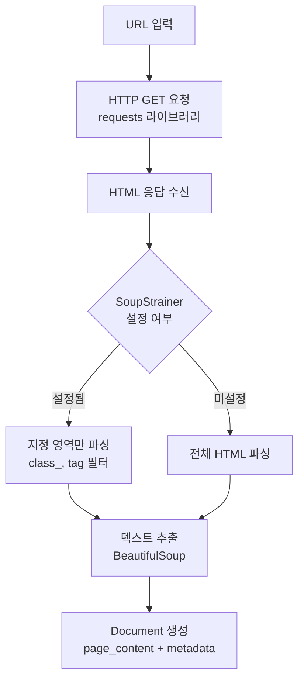
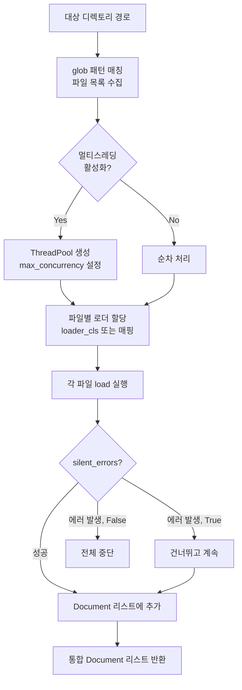
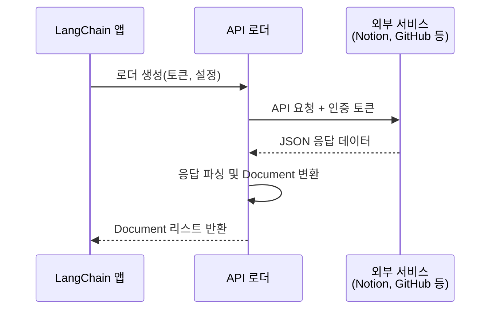

# 다양한 소스 로더

> 웹 페이지, JSON, 디렉토리, API까지 — LangChain이 세상의 모든 데이터를 Document로 변환하는 방법

## 개요

이 섹션에서는 텍스트·PDF·CSV를 넘어, 웹 페이지, JSON 파일, 디렉토리 전체, 그리고 외부 API와 데이터베이스에서 문서를 로드하는 다양한 소스 로더를 학습합니다. 실무에서 마주치는 거의 모든 데이터 소스를 LangChain의 `Document` 형태로 통합하는 능력을 기르게 됩니다.

**선수 지식**: [6.1 문서 로더 기초](ch06/session_6.1.md)에서 배운 `Document` 객체(`page_content` + `metadata`), `load()`/`lazy_load()` 메서드, `TextLoader`/`PyPDFLoader`/`CSVLoader` 기본 사용법

**학습 목표**:
- `WebBaseLoader`로 웹 페이지를 크롤링하고 BeautifulSoup으로 원하는 영역만 추출할 수 있다
- `JSONLoader`의 `jq_schema`를 사용해 JSON/JSONL 파일에서 필요한 필드를 정확히 로드할 수 있다
- `DirectoryLoader`로 디렉토리 내 수백 개 파일을 한 번에 로드하고, 로더 매핑과 멀티스레딩을 활용할 수 있다
- `NotionDBLoader` 등 API 기반 로더의 작동 원리와 인증 방식을 이해한다

## 왜 알아야 할까?

> 📊 **그림 1**: LangChain 소스 로더 통합 아키텍처 — 다양한 데이터 소스가 하나의 Document 형식으로 통합되는 구조




현실 세계의 데이터는 깔끔한 텍스트 파일 하나에 담겨 있지 않습니다. 회사 위키는 Notion에, 기술 문서는 웹 사이트에, 설정 파일은 JSON으로, 보고서는 여러 폴더에 흩어져 있죠. RAG 시스템을 구축하려면 이 모든 소스에서 데이터를 끌어올 수 있어야 합니다.

LangChain은 200개가 넘는 문서 로더를 제공하는데요, 이번 섹션에서 다루는 로더들은 그중에서도 **가장 자주 사용되는 핵심 로더**입니다. 웹 크롤링, JSON 파싱, 디렉토리 일괄 처리, API 연동 — 이 네 가지만 익히면 실무에서 마주치는 데이터 소스의 90% 이상을 커버할 수 있거든요.

## 핵심 개념

### 개념 1: WebBaseLoader — 웹의 모든 것을 Document로

> 📊 **그림 2**: WebBaseLoader의 처리 흐름 — HTTP 요청부터 Document 변환까지




> 💡 **비유**: WebBaseLoader는 **신문 스크랩하는 사람**과 같습니다. 웹 페이지라는 신문을 가져와서(HTTP 요청), 필요한 기사만 오려내고(BeautifulSoup 파싱), 깔끔하게 스크랩북에 붙여넣는(Document 변환) 거죠. `bs_kwargs`는 "어떤 섹션을 오릴지" 알려주는 가위 가이드라인입니다.

`WebBaseLoader`는 URL에서 HTML을 가져와 BeautifulSoup으로 파싱한 뒤 `Document` 객체로 변환합니다. 내부적으로 `requests` + `bs4` 조합을 사용하며, 비동기 로딩(`aload`)도 지원합니다.

```python
# 기본 사용법: 웹 페이지 전체 로드
from langchain_community.document_loaders import WebBaseLoader

loader = WebBaseLoader("https://lilianweng.github.io/posts/2023-06-23-agent/")
docs = loader.load()

print(f"문서 수: {len(docs)}")  # 출력: 문서 수: 1
print(f"내용 미리보기: {docs[0].page_content[:200]}")
print(f"메타데이터: {docs[0].metadata}")
# metadata에 'source', 'title', 'language' 등이 포함됨
```

하지만 웹 페이지 전체를 로드하면 네비게이션 바, 푸터, 광고 등 불필요한 내용이 잔뜩 포함됩니다. 실무에서는 **BeautifulSoup의 `SoupStrainer`**를 사용해 원하는 영역만 정밀하게 추출하는 것이 핵심이에요.

```python
# 핵심 패턴: SoupStrainer로 특정 영역만 추출
import bs4
from langchain_community.document_loaders import WebBaseLoader

# 블로그 본문만 추출 (class 기반 필터링)
loader = WebBaseLoader(
    web_paths=["https://lilianweng.github.io/posts/2023-06-23-agent/"],
    bs_kwargs=dict(
        parse_only=bs4.SoupStrainer(
            class_=("post-title", "post-content", "post-header")
        )
    ),
)
docs = loader.load()
print(f"필터링 후 길이: {len(docs[0].page_content)}")
# 전체 로드 대비 훨씬 깔끔한 본문만 추출됨
```

여러 URL을 한 번에 로드할 수도 있습니다. 이때 `requests_per_second` 파라미터로 요청 속도를 제어해 서버에 부담을 주지 않도록 합니다.

```python
# 여러 URL 동시 로드 (속도 제한 설정)
loader = WebBaseLoader(
    web_paths=[
        "https://lilianweng.github.io/posts/2023-06-23-agent/",
        "https://lilianweng.github.io/posts/2023-03-15-prompt-engineering/",
    ],
    requests_per_second=2,  # 초당 최대 2개 요청 (기본값)
)
docs = loader.load()
print(f"로드된 문서 수: {len(docs)}")  # 출력: 로드된 문서 수: 2
```

### 개념 2: JSONLoader — 구조화된 데이터에서 원하는 것만 꺼내기

> 💡 **비유**: JSONLoader는 **도서관 사서**와 비슷합니다. 거대한 JSON이라는 책장에서 "3번째 선반, 왼쪽에서 두 번째 칸"처럼 정확한 위치(`jq_schema`)를 알려주면, 딱 필요한 책(데이터)만 꺼내주는 거죠.

`JSONLoader`는 `jq` 문법을 사용해 JSON 구조에서 원하는 필드를 정밀하게 추출합니다. `jq`는 JSON을 다루는 커맨드라인 도구에서 유래한 쿼리 언어인데요, LangChain에서는 Python의 `jq` 패키지를 통해 이 문법을 지원합니다.

```python
# 설치 필요: pip install jq
from langchain_community.document_loaders import JSONLoader

# 예시 JSON 파일 (messages.json):
# {
#   "conversations": [
#     {"role": "user", "content": "LangChain이 뭐야?"},
#     {"role": "assistant", "content": "LLM 앱 개발 프레임워크입니다."},
#     {"role": "user", "content": "RAG는?"},
#     {"role": "assistant", "content": "검색 증강 생성 기법입니다."}
#   ]
# }

# jq_schema로 특정 필드만 추출
loader = JSONLoader(
    file_path="./messages.json",
    jq_schema=".conversations[]",  # conversations 배열의 각 요소
    text_content=False,  # JSON 객체 자체를 텍스트로 변환
)
docs = loader.load()

for doc in docs:
    print(doc.page_content)
    print(doc.metadata)
    print("---")
```

`content_key` 파라미터를 사용하면 JSON 객체에서 `page_content`로 사용할 필드를 지정할 수 있고, 나머지 필드는 자동으로 메타데이터에 포함됩니다.

```python
# content_key로 본문 필드 지정 + 메타데이터 자동 추출
loader = JSONLoader(
    file_path="./messages.json",
    jq_schema=".conversations[]",
    content_key="content",  # "content" 필드를 page_content로 사용
)
docs = loader.load()

for doc in docs:
    print(f"본문: {doc.page_content}")
    # page_content = "LangChain이 뭐야?" 등
    print(f"메타데이터: {doc.metadata}")
    # metadata에 source, seq_num 등 포함
```

JSON Lines(`.jsonl`) 형식도 `json_lines=True`로 간단히 처리합니다.

```python
# JSONL(JSON Lines) 파일 로드
# 각 줄이 독립적인 JSON 객체인 로그 파일 등에 유용
loader = JSONLoader(
    file_path="./chat_logs.jsonl",
    jq_schema=".content",        # 각 줄에서 content 필드 추출
    text_content=True,           # 텍스트로 직접 사용
    json_lines=True,             # JSONL 모드 활성화
)
docs = loader.load()
```

### 개념 3: DirectoryLoader — 폴더 통째로 로드하기

> 📊 **그림 3**: DirectoryLoader의 내부 동작 흐름




> 💡 **비유**: DirectoryLoader는 **이삿짐 센터의 팀장**입니다. "이 폴더(집) 안에 있는 모든 파일(짐)을 가져와"라고 지시하면, 파일 확장자(짐 종류)에 따라 적절한 로더(포장 전문가)를 배정하고, 필요하면 여러 명이 동시에 작업(멀티스레딩)하도록 조율합니다.

`DirectoryLoader`는 지정된 디렉토리에서 glob 패턴에 맞는 파일들을 찾아 일괄 로드합니다. 기본적으로 모든 파일에 `UnstructuredLoader`를 적용하지만, `loader_cls`나 `loader_mapping`으로 파일 유형별 로더를 지정할 수 있습니다.

```python
from langchain_community.document_loaders import DirectoryLoader, TextLoader

# 기본 사용법: 특정 확장자 파일만 로드
loader = DirectoryLoader(
    path="./documents/",       # 대상 디렉토리
    glob="**/*.txt",           # txt 파일만 (하위 폴더 포함)
    loader_cls=TextLoader,     # 사용할 로더 클래스
    show_progress=True,        # 프로그레스 바 표시
)
docs = loader.load()
print(f"로드된 문서 수: {len(docs)}")
```

실무에서는 하나의 폴더에 `.txt`, `.pdf`, `.md` 등 여러 파일 형식이 섞여 있는 경우가 많습니다. 이때 **파일 확장자별로 다른 로더를 매핑**할 수 있어요.

```python
from langchain_community.document_loaders import DirectoryLoader, TextLoader
from langchain_community.document_loaders import PyPDFLoader
from langchain_community.document_loaders import UnstructuredMarkdownLoader

# 확장자별 로더 매핑
loader_mapping = {
    ".txt": TextLoader,
    ".pdf": PyPDFLoader,
    ".md": UnstructuredMarkdownLoader,
}

# 각 확장자별로 DirectoryLoader 생성 후 결과 합치기
all_docs = []
for ext, loader_cls in loader_mapping.items():
    loader = DirectoryLoader(
        path="./documents/",
        glob=f"**/*{ext}",
        loader_cls=loader_cls,
        show_progress=True,
    )
    all_docs.extend(loader.load())

print(f"총 문서 수: {len(all_docs)}")
```

대용량 디렉토리에서는 **멀티스레딩**을 활성화해 로딩 속도를 크게 높일 수 있습니다.

```python
# 멀티스레딩으로 대용량 디렉토리 빠르게 로드
loader = DirectoryLoader(
    path="./large_dataset/",
    glob="**/*.txt",
    loader_cls=TextLoader,
    use_multithreading=True,   # 멀티스레딩 활성화
    max_concurrency=8,         # 최대 동시 스레드 수 (기본: 4)
    show_progress=True,
    silent_errors=True,        # 개별 파일 에러 시 건너뛰기
    loader_kwargs={"encoding": "utf-8"},  # 로더에 전달할 추가 인자
)
docs = loader.load()
print(f"성공적으로 로드된 문서 수: {len(docs)}")
```

### 개념 4: API 기반 로더 — 외부 서비스에서 직접 가져오기

> 📊 **그림 4**: API 기반 로더의 인증 및 데이터 흐름




> 💡 **비유**: API 기반 로더는 **배달 앱**과 같습니다. Notion이라는 레스토랑에서 음식을 주문하듯, API 토큰(결제 수단)을 등록하고 데이터베이스 ID(메뉴)를 선택하면, 로더가 알아서 데이터를 가져다 `Document` 형태(배달 상자)로 전달해주는 거죠.

LangChain은 Notion, Slack, Google Drive, Wikipedia 등 수십 개의 외부 서비스와 연동되는 로더를 제공합니다. 대부분 API 키나 인증 토큰이 필요하며, 서비스별 Python 패키지를 추가로 설치해야 합니다.

```python
# NotionDBLoader: Notion 데이터베이스에서 문서 로드
# 설치: pip install notion-client
from langchain_community.document_loaders import NotionDBLoader

loader = NotionDBLoader(
    integration_token="your-notion-integration-token",  # .env로 관리
    database_id="your-database-id",
    request_timeout_sec=30,  # 요청 타임아웃 (기본: 10초)
)
docs = loader.load()

for doc in docs:
    print(f"제목: {doc.metadata.get('title', 'N/A')}")
    print(f"내용: {doc.page_content[:100]}...")
```

```python
# WikipediaLoader: 위키피디아 문서 검색 및 로드
# 설치: pip install wikipedia
from langchain_community.document_loaders import WikipediaLoader

loader = WikipediaLoader(
    query="Large Language Model",  # 검색 쿼리
    load_max_docs=3,               # 최대 로드 문서 수
    lang="ko",                     # 한국어 위키피디아
)
docs = loader.load()

for doc in docs:
    print(f"제목: {doc.metadata['title']}")
    print(f"요약: {doc.page_content[:150]}...")
    print("---")
```

```python
# GitHubIssuesLoader: GitHub 이슈 로드
# 설치: pip install pygithub
from langchain_community.document_loaders import GitHubIssuesLoader

loader = GitHubIssuesLoader(
    repo="langchain-ai/langchain",
    access_token="your-github-token",  # .env로 관리
    include_prs=False,  # PR 제외, 이슈만
    state="open",       # 열린 이슈만
)
docs = loader.load()
```

## 실습: 직접 해보기

아래 실습은 여러 소스에서 문서를 수집해 하나의 `Document` 리스트로 통합하는 **멀티소스 데이터 수집 파이프라인**입니다. 실제 RAG 시스템 구축의 첫 단계에 해당합니다.

```python
"""
멀티소스 문서 수집 파이프라인
- 웹 페이지, JSON 파일, 디렉토리를 하나의 파이프라인으로 통합
"""
import os
import json
from pathlib import Path
from langchain_core.documents import Document
from langchain_community.document_loaders import (
    WebBaseLoader,
    JSONLoader,
    DirectoryLoader,
    TextLoader,
)

# ============================================================
# 1단계: 실습용 데이터 준비
# ============================================================

# 실습 디렉토리 생성
os.makedirs("./practice_data/notes", exist_ok=True)

# 텍스트 파일 생성
Path("./practice_data/notes/meeting_01.txt").write_text(
    "2024년 1분기 AI 프로젝트 회의록\n"
    "참석자: 김개발, 이디자인, 박기획\n"
    "안건: RAG 시스템 도입 검토\n"
    "결론: LangChain 기반으로 POC 진행 결정",
    encoding="utf-8",
)

Path("./practice_data/notes/meeting_02.txt").write_text(
    "2024년 2분기 AI 프로젝트 회의록\n"
    "참석자: 김개발, 최데이터\n"
    "안건: 벡터 스토어 선정\n"
    "결론: FAISS로 시작, 추후 Pinecone 마이그레이션 검토",
    encoding="utf-8",
)

# JSON 데이터 생성
faq_data = {
    "faqs": [
        {
            "question": "LangChain이란 무엇인가요?",
            "answer": "LLM 기반 애플리케이션을 쉽게 개발할 수 있는 프레임워크입니다.",
            "category": "general",
        },
        {
            "question": "RAG는 어떻게 동작하나요?",
            "answer": "질문과 관련된 문서를 검색한 뒤, 그 문서를 컨텍스트로 LLM에 전달합니다.",
            "category": "rag",
        },
        {
            "question": "임베딩이란?",
            "answer": "텍스트를 수치 벡터로 변환하여 의미적 유사도를 계산할 수 있게 하는 기법입니다.",
            "category": "embedding",
        },
    ]
}
Path("./practice_data/faqs.json").write_text(
    json.dumps(faq_data, ensure_ascii=False, indent=2),
    encoding="utf-8",
)

print("✅ 실습 데이터 준비 완료!")

# ============================================================
# 2단계: 각 소스별 로더 구성
# ============================================================

# 소스 1: 웹 페이지 로드 (BeautifulSoup 필터 적용)
import bs4

web_loader = WebBaseLoader(
    web_paths=["https://lilianweng.github.io/posts/2023-06-23-agent/"],
    bs_kwargs=dict(
        parse_only=bs4.SoupStrainer(
            class_=("post-title", "post-content")  # 제목 + 본문만 추출
        )
    ),
)

# 소스 2: JSON 파일 로드 (FAQ 답변을 Document로 변환)
json_loader = JSONLoader(
    file_path="./practice_data/faqs.json",
    jq_schema=".faqs[]",           # faqs 배열의 각 요소
    content_key="answer",          # answer 필드를 본문으로
    text_content=True,
)

# 소스 3: 디렉토리 일괄 로드 (회의록 폴더)
dir_loader = DirectoryLoader(
    path="./practice_data/notes/",
    glob="**/*.txt",
    loader_cls=TextLoader,
    loader_kwargs={"encoding": "utf-8"},
    show_progress=True,
)

# ============================================================
# 3단계: 모든 소스 통합
# ============================================================

def load_all_sources():
    """여러 소스에서 문서를 로드하고 통합합니다."""
    all_documents = []

    # 각 로더별 로드 (에러 처리 포함)
    loaders = {
        "웹 페이지": web_loader,
        "JSON FAQ": json_loader,
        "회의록 디렉토리": dir_loader,
    }

    for name, loader in loaders.items():
        try:
            docs = loader.load()
            # 소스 태그 추가 (어디서 온 문서인지 추적)
            for doc in docs:
                doc.metadata["source_type"] = name
            all_documents.extend(docs)
            print(f"✅ {name}: {len(docs)}개 문서 로드")
        except Exception as e:
            print(f"❌ {name} 로드 실패: {e}")

    return all_documents

# 실행
documents = load_all_sources()

# ============================================================
# 4단계: 결과 확인
# ============================================================

print(f"\n{'='*50}")
print(f"총 수집 문서: {len(documents)}개")
print(f"{'='*50}\n")

for i, doc in enumerate(documents):
    source_type = doc.metadata.get("source_type", "unknown")
    content_preview = doc.page_content[:80].replace("\n", " ")
    print(f"[{i+1}] ({source_type}) {content_preview}...")
    print(f"    메타데이터 키: {list(doc.metadata.keys())}")
    print()

# 정리
import shutil
shutil.rmtree("./practice_data", ignore_errors=True)
print("🧹 실습 데이터 정리 완료!")
```

실행하면 웹, JSON, 디렉토리 세 가지 소스에서 문서를 수집하고, 각 문서의 출처(`source_type`)를 메타데이터로 추적할 수 있습니다. 이런 패턴은 [9장 RAG 구축](ch09/)에서 본격적으로 활용하게 됩니다.

## 더 깊이 알아보기

### 웹 스크래핑 로더의 진화 — 정적 HTML에서 동적 렌더링까지

LLM 애플리케이션에서 웹은 가장 방대하면서도 가장 다루기 까다로운 데이터 소스입니다. 초기 웹 로더들은 `requests` + `BeautifulSoup` 조합으로 정적 HTML만 처리할 수 있었는데요, 현대 웹 사이트의 상당수가 JavaScript 기반 SPA(Single Page Application)로 구축되면서 이 방식만으로는 한계가 뚜렷해졌습니다.

이 문제를 해결하기 위해 LangChain 커뮤니티는 `SeleniumURLLoader`와 `PlaywrightURLLoader`를 도입했습니다. Selenium은 2004년부터 웹 테스트 자동화의 표준이었고, Playwright는 2020년 Microsoft가 공개한 차세대 브라우저 자동화 도구입니다. 두 로더 모두 실제 브라우저 엔진을 띄워 JavaScript를 실행한 뒤 렌더링된 결과를 가져오기 때문에, React나 Vue로 만든 SPA 사이트의 콘텐츠도 정상적으로 추출할 수 있죠.

한편 API 기반 로더는 또 다른 방향에서 발전했습니다. 웹 스크래핑이 "상대 사이트의 HTML 구조에 의존하는" 불안정한 방식이라면, API 로더는 **서비스가 공식 제공하는 구조화된 데이터**를 가져오므로 훨씬 안정적입니다. Notion, Confluence, Slack 같은 서비스들이 공식 API를 제공하면서, 스크래핑 없이도 데이터를 Document로 변환하는 것이 가능해졌어요. 실무에서는 "가능하면 API 로더를 우선 사용하고, API가 없는 소스에만 웹 스크래핑 로더를 적용하라"는 것이 일반적인 원칙입니다.

### Unstructured 라이브러리와의 만남

문서 로딩에서 빼놓을 수 없는 이름이 **Unstructured** 라이브러리입니다. 2022년에 시작된 이 프로젝트는 "비정형 데이터를 정형 데이터로" 변환하는 것을 목표로 하는데요, PDF, DOCX, HTML, 이미지 속 텍스트까지 자동으로 파싱할 수 있습니다.

LangChain은 초기부터 Unstructured와 긴밀하게 통합했습니다. `UnstructuredFileLoader`(현재는 `UnstructuredLoader`로 마이그레이션)는 파일 확장자를 자동 감지하여 적절한 파서를 선택하는 "만능 로더"로 큰 인기를 끌었죠. 다만 최근 v0.2.8부터 `UnstructuredFileLoader`가 deprecated되고 `langchain_unstructured` 패키지의 `UnstructuredLoader`로 교체되었다는 점을 기억해 두세요. 새 버전에서는 `mode` 파라미터 대신 의미 기반 `chunking_strategy`를 사용하는 등 동작 방식이 일부 달라졌습니다.

### `jq` — JSON 세계의 `sed`

`JSONLoader`가 사용하는 `jq`는 2012년 Stephen Dolan이 만든 커맨드라인 JSON 처리 도구입니다. Unix의 `sed`나 `awk`가 텍스트 스트림을 처리하듯, `jq`는 JSON 스트림을 필터링하고 변환합니다. `.conversations[].content`처럼 점과 대괄호로 JSON 구조를 탐색하는 문법은 직관적이면서도 강력해서, 데이터 엔지니어들 사이에서 "JSON의 스위스 아미 나이프"라 불립니다.

## 흔한 오해와 팁

> ⚠️ **흔한 오해**: "WebBaseLoader는 모든 웹 사이트를 크롤링할 수 있다"
>
> WebBaseLoader는 정적 HTML만 파싱합니다. JavaScript로 동적 렌더링되는 SPA(Single Page Application) 사이트의 콘텐츠는 가져올 수 없어요. 동적 사이트에는 `SeleniumURLLoader`나 `PlaywrightURLLoader`처럼 브라우저 엔진 기반 로더를 사용해야 합니다.

> 💡 **알고 계셨나요?**: LangChain의 문서 로더는 200개가 넘지만, 모두 `BaseLoader` 하나를 상속합니다. 즉, `load()` 메서드만 알면 어떤 로더든 동일한 방식으로 사용할 수 있어요. 이것이 LangChain의 "통합 인터페이스" 철학입니다. 새로운 로더를 만들고 싶다면 `BaseLoader`를 상속하고 `lazy_load()` 메서드만 구현하면 됩니다.

> 🔥 **실무 팁**: `DirectoryLoader`에서 `silent_errors=True`를 설정하면 개별 파일 로드 실패 시 전체가 중단되지 않고 건너뜁니다. 수백 개 파일을 로드할 때 하나의 깨진 파일 때문에 전체 파이프라인이 멈추는 사고를 방지할 수 있죠. 단, 실패한 파일을 나중에 확인할 수 있도록 로그를 남기는 습관을 들이세요.

> 🔥 **실무 팁**: API 키나 인증 토큰은 절대 코드에 하드코딩하지 마세요. 반드시 `.env` 파일과 `python-dotenv`를 사용하고, `.gitignore`에 `.env`를 추가하세요. `NotionDBLoader`나 `GitHubIssuesLoader` 같은 API 로더를 쓸 때 특히 중요합니다.

## 핵심 정리

| 개념 | 설명 |
|------|------|
| **WebBaseLoader** | URL에서 HTML을 가져와 BeautifulSoup으로 파싱, `bs_kwargs`로 특정 영역만 추출 가능 |
| **SoupStrainer** | BeautifulSoup의 파싱 필터, `class_`나 HTML 태그로 원하는 영역만 선택 |
| **JSONLoader** | `jq_schema`로 JSON 구조 탐색, `content_key`로 본문 필드 지정, JSONL도 지원 |
| **DirectoryLoader** | 디렉토리 내 파일을 glob 패턴으로 일괄 로드, `loader_cls`로 로더 지정 |
| **멀티스레딩** | `DirectoryLoader`의 `use_multithreading=True`로 대용량 로드 속도 향상 |
| **API 기반 로더** | `NotionDBLoader`, `WikipediaLoader` 등 외부 서비스 연동, 인증 토큰 필요 |
| **UnstructuredLoader** | 파일 유형 자동 감지 만능 로더, `UnstructuredFileLoader`의 후속 (별도 패키지) |
| **통합 인터페이스** | 모든 로더가 `BaseLoader` 상속, `load()`/`lazy_load()` 동일 인터페이스 |

## 다음 섹션 미리보기

문서를 로드했다면, 이제 이 문서들을 RAG에 적합한 크기로 **분할(Splitting)**해야 합니다. 다음 섹션에서는 `RecursiveCharacterTextSplitter`를 중심으로 텍스트 분할의 기본 전략과 `chunk_size`, `chunk_overlap` 같은 핵심 파라미터의 의미를 학습합니다. "왜 문서를 그냥 통째로 넣으면 안 되는지", 그리고 "어떻게 잘라야 맥락을 보존하면서 검색 품질을 높일 수 있는지" 알아보겠습니다.

## 참고 자료

- [LangChain Document Loader Integrations 공식 목록](https://python.langchain.com/docs/integrations/document_loaders/) - 200개 이상의 로더 전체 목록과 사용법, 필요한 로더를 찾을 때 가장 먼저 확인할 페이지
- [WebBaseLoader API Reference](https://python.langchain.com/api_reference/community/document_loaders/langchain_community.document_loaders.web_base.WebBaseLoader.html) - WebBaseLoader의 전체 파라미터와 사용 예제 공식 문서
- [DirectoryLoader API Reference](https://python.langchain.com/api_reference/community/document_loaders/langchain_community.document_loaders.directory.DirectoryLoader.html) - DirectoryLoader의 glob, 멀티스레딩, 로더 매핑 등 상세 설정 공식 문서
- [JSONLoader 통합 가이드](https://python.langchain.com/docs/integrations/document_loaders/json/) - jq 스키마 문법과 다양한 JSON 구조 처리 예제
- [Unstructured Integration](https://python.langchain.com/docs/integrations/document_loaders/unstructured_file/) - UnstructuredLoader 마이그레이션 가이드와 파일 유형 자동 감지 기능 설명
- [LangChain Document Loaders Complete Guide 2025 (Latenode)](https://latenode.com/blog/ai-frameworks-technical-infrastructure/langchain-setup-tools-agents-memory/langchain-document-loaders-complete-guide-to-loading-files-code-examples-2025) - 실전 코드 예제와 함께 주요 로더들을 비교 분석한 종합 가이드

---
### 🔗 Related Sessions
- [document_loader](../06-문서-로더와-텍스트-분할/01-문서-로더-기초.md) (prerequisite)
- [page_content](../06-문서-로더와-텍스트-분할/01-문서-로더-기초.md) (prerequisite)
- [metadata](../06-문서-로더와-텍스트-분할/01-문서-로더-기초.md) (prerequisite)
- [text_loader](../06-문서-로더와-텍스트-분할/01-문서-로더-기초.md) (prerequisite)
- [pypdf_loader](../06-문서-로더와-텍스트-분할/01-문서-로더-기초.md) (prerequisite)
- [lazy_load](../06-문서-로더와-텍스트-분할/01-문서-로더-기초.md) (prerequisite)
