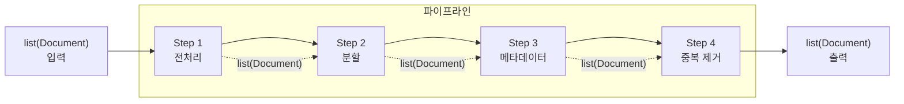
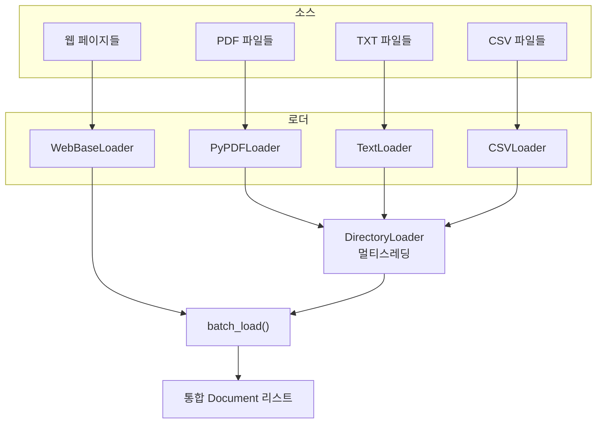
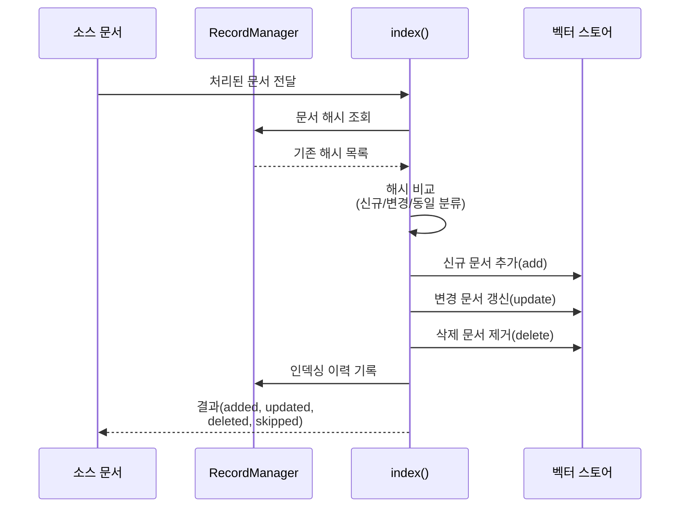

# 문서 처리 파이프라인 구축

> 로드부터 저장까지, 실전 RAG를 위한 엔드투엔드 문서 처리 자동화

## 개요

이 섹션에서는 지금까지 배운 문서 로더, 텍스트 분할기, 고급 분할 전략을 하나의 **자동화된 파이프라인**으로 통합하는 방법을 배웁니다. 대용량 문서를 배치로 처리하고, 메타데이터를 자동 추출·강화하며, 중복 문서를 제거하고, 최종적으로 벡터 스토어에 인덱싱하는 프로덕션 수준의 파이프라인을 구축합니다.

**선수 지식**: 
- [6.1 문서 로더 기초](ch06/session_01.md)에서 배운 Document 객체와 load()/lazy_load()
- [6.2 다양한 소스 로더](ch06/session_02.md)에서 배운 DirectoryLoader, WebBaseLoader
- [6.3 텍스트 분할 전략](ch06/session_03.md)에서 배운 RecursiveCharacterTextSplitter와 chunk_size/chunk_overlap
- [6.4 고급 텍스트 분할](ch06/session_04.md)에서 배운 구조 인식 분할과 SemanticChunker

**학습 목표**:
- 멀티소스 문서를 배치로 로드하고 전처리하는 파이프라인을 설계할 수 있다
- LLM 기반 메타데이터 자동 추출과 커스텀 메타데이터 강화를 구현할 수 있다
- 해시 기반·임베딩 기반 중복 제거 전략을 적용할 수 있다
- LangChain Indexing API를 활용하여 증분 인덱싱과 자동 정리를 구현할 수 있다

## 왜 알아야 할까?

실제 RAG 시스템을 운영해보면 금세 깨닫게 되는 사실이 있습니다. **문서를 로드하고 분할하는 건 시작일 뿐**이라는 거죠. 

실무에서는 PDF 수백 개, 웹 페이지 수천 개, CSV와 JSON 데이터가 매일 쏟아져 들어옵니다. 이걸 일일이 수동으로 처리할 순 없겠죠? 게다가 같은 문서가 여러 소스에 중복으로 존재하기도 하고, 메타데이터가 빠져 있어서 검색 품질이 떨어지기도 합니다. 소스가 업데이트되면 벡터 스토어에 이미 저장된 구버전은 어떻게 해야 할까요?

이런 문제들을 해결하려면 **로드 → 전처리 → 분할 → 메타데이터 강화 → 중복 제거 → 인덱싱**이라는 일련의 과정을 자동화한 파이프라인이 필요합니다. 이번 섹션에서 구축하는 파이프라인은 챕터 9에서 만들 RAG 시스템의 데이터 입수(ingestion) 계층이 됩니다.


## 핵심 개념

### 개념 1: 문서 처리 파이프라인 아키텍처

> 📊 **그림 5**: 파이프라인 단계별 통일 인터페이스




> 💡 **비유**: 자동차 공장의 조립 라인을 떠올려 보세요. 원자재(철판, 부품)가 들어오면 세척 → 프레스 가공 → 도장 → 조립 → 품질 검사를 거쳐 완성차가 나옵니다. 각 공정은 독립적이지만 순서대로 연결되어 있죠. 문서 처리 파이프라인도 마찬가지입니다. 원본 문서가 들어오면 정제 → 분할 → 메타데이터 부착 → 중복 제거 → 저장을 거쳐 "RAG에 바로 쓸 수 있는 문서"가 됩니다.

문서 처리 파이프라인의 전형적인 흐름은 다음과 같습니다:

> 📊 **그림 1**: 문서 처리 파이프라인의 6단계 흐름


```
[멀티소스 로드] → [전처리/정제] → [텍스트 분할] → [메타데이터 강화] → [중복 제거] → [벡터 스토어 인덱싱]
```

각 단계를 파이썬 함수로 구현하고, 이를 순서대로 연결하면 됩니다. 핵심은 **각 단계가 `list[Document]`를 입력받아 `list[Document]`를 반환**하는 통일된 인터페이스를 갖는다는 점입니다.

```python
from langchain_core.documents import Document
from typing import Callable

# 파이프라인의 각 단계: Document 리스트 → Document 리스트
PipelineStep = Callable[[list[Document]], list[Document]]

class DocumentPipeline:
    """문서 처리 파이프라인 — 단계별 변환을 순차 실행합니다."""
    
    def __init__(self):
        self.steps: list[tuple[str, PipelineStep]] = []
    
    def add_step(self, name: str, func: PipelineStep) -> "DocumentPipeline":
        """파이프라인에 처리 단계를 추가합니다."""
        self.steps.append((name, func))
        return self  # 메서드 체이닝 지원
    
    def run(self, documents: list[Document]) -> list[Document]:
        """모든 단계를 순차적으로 실행합니다."""
        for name, func in self.steps:
            before = len(documents)
            documents = func(documents)
            after = len(documents)
            print(f"[{name}] {before} docs → {after} docs")
        return documents
```

> 🔥 **실무 팁**: 각 단계에서 입력/출력 문서 수를 로깅하면 파이프라인 디버깅이 훨씬 쉬워집니다. 어느 단계에서 문서가 급격히 줄거나 늘어나는지 한눈에 파악할 수 있거든요.

### 개념 2: 멀티소스 배치 로딩

> 💡 **비유**: 대형 마트에서 장을 볼 때, 채소 코너·정육 코너·유제품 코너를 각각 돌며 장바구니에 담죠? 멀티소스 로딩도 마찬가지입니다. PDF 코너, 웹 코너, CSV 코너에서 문서를 모아 하나의 장바구니(Document 리스트)에 담는 겁니다.

> 📊 **그림 2**: 멀티소스 배치 로딩 구조




앞서 [6.2 다양한 소스 로더](ch06/session_02.md)에서 배운 다양한 로더를 통합하여 여러 소스의 문서를 한 번에 수집하는 함수를 만들어 봅시다.

```python
import logging
from pathlib import Path
from langchain_community.document_loaders import (
    DirectoryLoader,
    PyPDFLoader,
    TextLoader,
    CSVLoader,
    WebBaseLoader,
)

logger = logging.getLogger(__name__)

def load_from_directory(
    dir_path: str,
    glob_patterns: dict[str, type] | None = None,
) -> list[Document]:
    """디렉토리에서 파일 형식별로 문서를 배치 로드합니다."""
    if glob_patterns is None:
        glob_patterns = {
            "**/*.pdf": PyPDFLoader,
            "**/*.txt": TextLoader,
            "**/*.csv": CSVLoader,
        }
    
    all_docs: list[Document] = []
    
    for pattern, loader_cls in glob_patterns.items():
        try:
            loader = DirectoryLoader(
                dir_path,
                glob=pattern,
                loader_cls=loader_cls,
                use_multithreading=True,  # 멀티스레딩으로 속도 향상
                silent_errors=True,       # 개별 파일 실패 시 계속 진행
                show_progress=True,
            )
            docs = loader.load()
            logger.info(f"[{pattern}] {len(docs)}개 문서 로드 완료")
            all_docs.extend(docs)
        except Exception as e:
            logger.error(f"[{pattern}] 로드 실패: {e}")
    
    return all_docs


def load_from_urls(urls: list[str]) -> list[Document]:
    """웹 URL 목록에서 문서를 로드합니다."""
    loader = WebBaseLoader(
        web_paths=urls,
        requests_per_second=2,  # 서버 부하 방지용 레이트 리밋
    )
    return loader.load()


def batch_load(
    directories: list[str] | None = None,
    urls: list[str] | None = None,
) -> list[Document]:
    """여러 소스에서 문서를 통합 로드합니다."""
    all_docs: list[Document] = []
    
    # 디렉토리 소스 로드
    for dir_path in (directories or []):
        docs = load_from_directory(dir_path)
        all_docs.extend(docs)
    
    # 웹 소스 로드
    if urls:
        web_docs = load_from_urls(urls)
        all_docs.extend(web_docs)
    
    logger.info(f"총 {len(all_docs)}개 문서 로드 완료")
    return all_docs
```

### 개념 3: 문서 전처리와 정제

> 💡 **비유**: 요리하기 전에 재료를 손질하는 과정과 같습니다. 채소의 흙을 씻어내고, 못 먹는 부분을 잘라내고, 껍질을 벗기죠. 문서 전처리도 원본 텍스트에서 불필요한 노이즈를 제거하고 일관된 형태로 정리하는 과정입니다.

RAG 시스템에서 "Garbage in, garbage out"은 절대적인 진리입니다. 로드된 문서를 그대로 벡터 스토어에 넣으면 검색 품질이 크게 떨어질 수 있습니다.

```python
import re
import hashlib
from datetime import datetime


def clean_text(text: str) -> str:
    """텍스트에서 노이즈를 제거합니다."""
    # 과도한 공백과 빈 줄 정리
    text = re.sub(r'\n{3,}', '\n\n', text)
    # 연속 공백을 단일 공백으로
    text = re.sub(r'[ \t]+', ' ', text)
    # 특수 유니코드 문자 정규화 (예: 전각 → 반각)
    text = text.replace('\u3000', ' ')
    # 앞뒤 공백 제거
    text = text.strip()
    return text


def preprocess_documents(docs: list[Document]) -> list[Document]:
    """문서 리스트를 전처리합니다."""
    processed = []
    for doc in docs:
        # 빈 문서 필터링
        cleaned = clean_text(doc.page_content)
        if len(cleaned) < 50:  # 너무 짧은 문서 제거
            continue
        
        # 메타데이터에 처리 정보 추가
        doc.page_content = cleaned
        doc.metadata["processed_at"] = datetime.now().isoformat()
        doc.metadata["char_count"] = len(cleaned)
        doc.metadata["content_hash"] = hashlib.md5(
            cleaned.encode()
        ).hexdigest()
        
        processed.append(doc)
    
    return processed
```

> ⚠️ **흔한 오해**: "전처리는 텍스트 분할 후에 해도 되지 않나요?" — 순서가 중요합니다! 전처리를 분할 **전에** 해야 합니다. 분할 후에 하면 청크 경계의 공백이나 특수 문자가 분할 품질에 영향을 미칠 수 있거든요.

### 개념 4: 메타데이터 자동 추출과 강화

> 💡 **비유**: 도서관에서 새 책이 들어오면 사서가 제목, 저자, 장르, 키워드를 카탈로그 카드에 기록하죠? 메타데이터 강화는 LLM이 사서 역할을 하는 겁니다. 문서의 내용을 읽고 자동으로 주제, 카테고리, 핵심 키워드 같은 메타데이터를 추출해서 붙여줍니다.

LangChain은 `create_metadata_tagger`라는 Document Transformer를 제공합니다. LLM이 문서 내용을 분석해서 정해진 스키마에 따라 메타데이터를 자동으로 추출해주는 도구입니다.

```python
from langchain_community.document_transformers.openai_functions import (
    create_metadata_tagger,
)
from langchain_openai import ChatOpenAI

# 추출할 메타데이터 스키마 정의
metadata_schema = {
    "properties": {
        "category": {
            "type": "string",
            "enum": ["기술", "비즈니스", "법률", "마케팅", "기타"],
            "description": "문서의 주요 카테고리",
        },
        "topic": {
            "type": "string",
            "description": "문서의 핵심 주제 (한국어)",
        },
        "difficulty": {
            "type": "string",
            "enum": ["초급", "중급", "고급"],
            "description": "문서의 난이도",
        },
        "key_entities": {
            "type": "array",
            "items": {"type": "string"},
            "description": "문서에 등장하는 주요 엔터티(기업명, 기술명 등)",
        },
    },
    "required": ["category", "topic"],
}

# LLM 기반 메타데이터 태거 생성
llm = ChatOpenAI(temperature=0, model="gpt-4o-mini")
metadata_tagger = create_metadata_tagger(metadata_schema, llm)

# 사용 예시
original_docs = [
    Document(
        page_content="LangChain은 LLM 기반 애플리케이션 개발 프레임워크로...",
        metadata={"source": "langchain_intro.pdf"}
    )
]

# 메타데이터가 자동으로 추출되어 추가됩니다
tagged_docs = metadata_tagger.transform_documents(original_docs)
# tagged_docs[0].metadata:
# {"source": "langchain_intro.pdf", "category": "기술", 
#  "topic": "LLM 프레임워크", "difficulty": "초급",
#  "key_entities": ["LangChain", "LLM"]}
```

LLM 호출 비용이 부담된다면, 규칙 기반의 커스텀 메타데이터 강화도 함께 활용할 수 있습니다:

```python
from pathlib import Path


def enrich_metadata(docs: list[Document]) -> list[Document]:
    """규칙 기반으로 메타데이터를 강화합니다."""
    for doc in docs:
        source = doc.metadata.get("source", "")
        
        # 파일 확장자에서 문서 타입 추출
        if source:
            ext = Path(source).suffix.lower()
            doc.metadata["file_type"] = ext.lstrip(".")
        
        # 텍스트 길이 기반 분류
        content_len = len(doc.page_content)
        if content_len < 500:
            doc.metadata["length_category"] = "short"
        elif content_len < 2000:
            doc.metadata["length_category"] = "medium"
        else:
            doc.metadata["length_category"] = "long"
        
        # 언어 감지 (간단한 휴리스틱)
        korean_ratio = len(re.findall(r'[가-힣]', doc.page_content)) / max(content_len, 1)
        doc.metadata["language"] = "ko" if korean_ratio > 0.3 else "en"
    
    return docs
```

### 개념 5: 중복 문서 제거

> 💡 **비유**: 사진첩을 정리할 때 같은 사진이 여러 장 있으면 가장 좋은 한 장만 남기고 나머지는 지우죠? 중복 제거도 마찬가지입니다. 다만 "같은 사진"을 판별하는 방법이 두 가지 있습니다 — 파일명이 같은지 비교하는 것(해시 기반)과, 사진 내용이 비슷한지 비교하는 것(임베딩 기반)입니다.

**방법 1: 해시 기반 완전 중복 제거 (Exact Deduplication)**

콘텐츠 해시를 비교하여 완전히 동일한 문서를 제거합니다. 빠르고 비용이 들지 않습니다.

```python
def deduplicate_by_hash(docs: list[Document]) -> list[Document]:
    """콘텐츠 해시 기반으로 완전 중복 문서를 제거합니다."""
    seen_hashes: set[str] = set()
    unique_docs: list[Document] = []
    
    for doc in docs:
        # 전처리 단계에서 이미 hash를 계산해두었다면 재사용
        content_hash = doc.metadata.get("content_hash")
        if not content_hash:
            content_hash = hashlib.md5(
                doc.page_content.encode()
            ).hexdigest()
        
        if content_hash not in seen_hashes:
            seen_hashes.add(content_hash)
            unique_docs.append(doc)
    
    removed = len(docs) - len(unique_docs)
    if removed > 0:
        logger.info(f"해시 기반 중복 제거: {removed}개 문서 제거")
    
    return unique_docs
```

**방법 2: 임베딩 기반 유사 중복 제거 (Near-Duplicate Detection)**


LangChain의 `EmbeddingsRedundantFilter`를 사용하면 의미적으로 거의 동일한 문서(표현만 조금 다른)도 제거할 수 있습니다.

```python
from langchain_community.document_transformers import (
    EmbeddingsRedundantFilter,
)
from langchain_openai import OpenAIEmbeddings

embeddings = OpenAIEmbeddings()

# 유사도 임계값: 0.95 이상이면 중복으로 판단
redundant_filter = EmbeddingsRedundantFilter(
    embeddings=embeddings,
    similarity_threshold=0.95,
)

# Document Transformer 인터페이스를 따릅니다
unique_docs = redundant_filter.transform_documents(docs)
```

> ⚠️ **흔한 오해**: `similarity_threshold=0.95`라고 해서 "95% 같으면 중복"이라는 뜻이 아닙니다. 이 값은 코사인 유사도 기준인데, 임베딩 공간에서 0.95는 사실상 거의 동일한 텍스트를 의미합니다. 표현을 약간 바꾼 정도의 "유사 중복"까지 잡으려면 0.90 정도로 낮춰야 합니다.

### 개념 6: Indexing API를 활용한 증분 인덱싱

> 💡 **비유**: 클라우드 파일 동기화 서비스(Google Drive, Dropbox)를 생각해 보세요. 파일을 수정하면 변경된 파일만 동기화하고, 삭제하면 클라우드에서도 삭제됩니다. LangChain Indexing API가 정확히 이 역할을 합니다 — 벡터 스토어를 소스 문서와 자동으로 동기화해 줍니다.

반복적으로 파이프라인을 실행할 때, 이미 저장된 문서를 다시 임베딩하면 비용과 시간이 낭비됩니다. LangChain의 **Indexing API**는 `RecordManager`를 사용하여 어떤 문서가 이미 인덱싱되었는지 추적하고, 세 가지 정리(cleanup) 모드를 제공합니다.

> 📊 **그림 4**: Indexing API의 증분 인덱싱 동작 흐름




| 모드 | 동작 | 적합한 상황 |
|------|------|-------------|
| `None` | 자동 정리 없음, 새 문서만 추가 | 수동 관리 원할 때 |
| `"incremental"` | 변경된 문서의 이전 버전만 삭제 | 실시간 업데이트 |
| `"full"` | 현재 배치에 없는 모든 이전 문서 삭제 | 전체 재동기화 |


```python
from langchain.indexes import SQLRecordManager, index
from langchain_openai import OpenAIEmbeddings
from langchain_community.vectorstores import Chroma

# 1. 벡터 스토어 초기화
embeddings = OpenAIEmbeddings()
vectorstore = Chroma(
    collection_name="my_documents",
    embedding_function=embeddings,
    persist_directory="./chroma_db",
)

# 2. RecordManager 초기화 — 문서 인덱싱 이력을 추적합니다
record_manager = SQLRecordManager(
    namespace="my_documents",
    db_url="sqlite:///record_manager.db",
)
record_manager.create_schema()  # 최초 1회 실행

# 3. 증분 인덱싱 실행
result = index(
    docs_source=processed_docs,       # 파이프라인을 거친 문서들
    record_manager=record_manager,
    vector_store=vectorstore,
    cleanup="incremental",            # 변경분만 처리
    source_id_key="source",           # 소스 식별용 메타데이터 키
)

print(result)
# {'num_added': 15, 'num_updated': 3, 'num_deleted': 2, 'num_skipped': 80}
```

`result` 딕셔너리가 알려주는 정보가 핵심입니다:
- `num_added`: 새로 추가된 문서 수
- `num_updated`: 내용이 변경되어 갱신된 문서 수
- `num_deleted`: 소스에서 사라져서 삭제된 문서 수
- `num_skipped`: 변경 없어서 건너뛴 문서 수

> 🔥 **실무 팁**: `"incremental"` 모드를 사용할 때는 반드시 각 문서의 `metadata`에 `source` 키가 있어야 합니다. 이 값이 같은 문서끼리 버전을 비교하거든요. `source_id_key` 파라미터를 생략하면 `ValueError`가 발생합니다.

## 실습: 직접 해보기

지금까지 배운 모든 개념을 조합하여 엔드투엔드 문서 처리 파이프라인을 구축해 봅시다.

```python
"""
엔드투엔드 문서 처리 파이프라인 실습
====================================
로드 → 전처리 → 분할 → 메타데이터 강화 → 중복 제거 → 인덱싱
"""

import hashlib
import logging
import re
from datetime import datetime
from pathlib import Path
from typing import Callable

from langchain_core.documents import Document
from langchain_text_splitters import RecursiveCharacterTextSplitter
from langchain_community.document_loaders import (
    DirectoryLoader,
    PyPDFLoader,
    TextLoader,
)

logging.basicConfig(level=logging.INFO)
logger = logging.getLogger(__name__)


# ──────────────────────────────────────
# 1단계: 파이프라인 프레임워크
# ──────────────────────────────────────
PipelineStep = Callable[[list[Document]], list[Document]]


class DocumentPipeline:
    """문서 처리 파이프라인 — 단계별 변환을 순차 실행합니다."""

    def __init__(self, name: str = "default"):
        self.name = name
        self.steps: list[tuple[str, PipelineStep]] = []

    def add_step(self, name: str, func: PipelineStep) -> "DocumentPipeline":
        """파이프라인에 처리 단계를 추가합니다."""
        self.steps.append((name, func))
        return self

    def run(self, documents: list[Document]) -> list[Document]:
        """모든 단계를 순차적으로 실행합니다."""
        logger.info(f"=== 파이프라인 '{self.name}' 시작 ===")
        logger.info(f"입력 문서: {len(documents)}개")

        for step_name, func in self.steps:
            before = len(documents)
            documents = func(documents)
            after = len(documents)
            logger.info(f"  [{step_name}] {before} → {after} docs")

        logger.info(f"=== 파이프라인 완료: {len(documents)}개 문서 ===")
        return documents


# ──────────────────────────────────────
# 2단계: 전처리 함수들
# ──────────────────────────────────────
def clean_text(text: str) -> str:
    """텍스트 노이즈를 제거합니다."""
    text = re.sub(r'\n{3,}', '\n\n', text)   # 과도한 빈 줄 정리
    text = re.sub(r'[ \t]+', ' ', text)       # 연속 공백 정리
    text = text.replace('\u3000', ' ')        # 전각 공백 처리
    return text.strip()


def preprocess(docs: list[Document]) -> list[Document]:
    """문서를 정제하고 기본 메타데이터를 추가합니다."""
    result = []
    for doc in docs:
        cleaned = clean_text(doc.page_content)
        if len(cleaned) < 50:                  # 너무 짧은 문서 제외
            continue

        doc.page_content = cleaned
        doc.metadata["processed_at"] = datetime.now().isoformat()
        doc.metadata["char_count"] = len(cleaned)
        doc.metadata["content_hash"] = hashlib.md5(
            cleaned.encode()
        ).hexdigest()
        result.append(doc)
    return result


# ──────────────────────────────────────
# 3단계: 텍스트 분할
# ──────────────────────────────────────
def split_documents(docs: list[Document]) -> list[Document]:
    """RecursiveCharacterTextSplitter로 문서를 분할합니다."""
    splitter = RecursiveCharacterTextSplitter(
        chunk_size=1000,
        chunk_overlap=200,
        separators=["\n\n", "\n", ". ", " ", ""],
    )
    return splitter.split_documents(docs)


# ──────────────────────────────────────
# 4단계: 메타데이터 강화 (규칙 기반)
# ──────────────────────────────────────
def enrich_metadata(docs: list[Document]) -> list[Document]:
    """규칙 기반으로 메타데이터를 보강합니다."""
    for doc in docs:
        source = doc.metadata.get("source", "")

        # 파일 타입 추출
        if source:
            doc.metadata["file_type"] = Path(source).suffix.lstrip(".")

        # 언어 감지 (휴리스틱)
        content = doc.page_content
        korean_chars = len(re.findall(r'[가-힣]', content))
        total_chars = max(len(content), 1)
        doc.metadata["language"] = "ko" if korean_chars / total_chars > 0.3 else "en"

    return docs


# ──────────────────────────────────────
# 5단계: 해시 기반 중복 제거
# ──────────────────────────────────────
def deduplicate(docs: list[Document]) -> list[Document]:
    """콘텐츠 해시 기반으로 완전 중복을 제거합니다."""
    seen: set[str] = set()
    unique: list[Document] = []

    for doc in docs:
        h = hashlib.md5(doc.page_content.encode()).hexdigest()
        if h not in seen:
            seen.add(h)
            unique.append(doc)

    removed = len(docs) - len(unique)
    if removed:
        logger.info(f"  → {removed}개 중복 문서 제거됨")
    return unique


# ──────────────────────────────────────
# 파이프라인 조립 및 실행
# ──────────────────────────────────────
def create_ingestion_pipeline() -> DocumentPipeline:
    """표준 문서 입수 파이프라인을 생성합니다."""
    return (
        DocumentPipeline(name="ingestion")
        .add_step("전처리", preprocess)
        .add_step("분할", split_documents)
        .add_step("메타데이터 강화", enrich_metadata)
        .add_step("중복 제거", deduplicate)
    )


# ──────────────────────────────────────
# 테스트 실행
# ──────────────────────────────────────
if __name__ == "__main__":
    # 샘플 문서 생성 (실제로는 로더에서 가져옵니다)
    sample_docs = [
        Document(
            page_content="""
            LangChain은 대규모 언어 모델(LLM)을 활용한 애플리케이션 개발을
            위한 프레임워크입니다. 프롬프트 관리, 체인 구성, 데이터 증강 생성,
            에이전트 등 다양한 기능을 제공합니다.
            
            LangChain의 핵심 구성 요소로는 Model I/O, Retrieval, Agents가
            있으며, LCEL을 통해 선언적으로 체인을 구성할 수 있습니다.
            """,
            metadata={"source": "docs/langchain_intro.txt"},
        ),
        Document(
            page_content="""
            RAG(Retrieval-Augmented Generation)는 외부 지식을 활용하여
            LLM의 응답 품질을 향상시키는 기법입니다. 문서를 벡터화하여
            저장하고, 질문과 유사한 문서를 검색하여 컨텍스트로 제공합니다.
            
            RAG 파이프라인은 크게 인덱싱(문서 처리)과 검색(질의 처리)
            두 단계로 나뉩니다. 인덱싱 단계에서는 문서를 로드하고, 분할하고,
            임베딩하여 벡터 스토어에 저장합니다.
            """,
            metadata={"source": "docs/rag_overview.txt"},
        ),
        # 의도적 중복 문서
        Document(
            page_content="""
            LangChain은 대규모 언어 모델(LLM)을 활용한 애플리케이션 개발을
            위한 프레임워크입니다. 프롬프트 관리, 체인 구성, 데이터 증강 생성,
            에이전트 등 다양한 기능을 제공합니다.
            
            LangChain의 핵심 구성 요소로는 Model I/O, Retrieval, Agents가
            있으며, LCEL을 통해 선언적으로 체인을 구성할 수 있습니다.
            """,
            metadata={"source": "docs/langchain_intro_copy.txt"},
        ),
        Document(
            page_content="짧은 텍스트",  # 필터링될 문서
            metadata={"source": "docs/short.txt"},
        ),
    ]

    # 파이프라인 실행
    pipeline = create_ingestion_pipeline()
    result_docs = pipeline.run(sample_docs)

    # 결과 확인
    print(f"\n최종 문서 수: {len(result_docs)}")
    for i, doc in enumerate(result_docs):
        print(f"\n--- 문서 {i+1} ---")
        print(f"내용 미리보기: {doc.page_content[:80]}...")
        print(f"메타데이터: {doc.metadata}")
```

실행 결과:

```
INFO:__main__:=== 파이프라인 'ingestion' 시작 ===
INFO:__main__:입력 문서: 4개
INFO:__main__:  [전처리] 4 → 3 docs
INFO:__main__:  [분할] 3 → 4 docs
INFO:__main__:  [메타데이터 강화] 4 → 4 docs
INFO:__main__:  → 1개 중복 문서 제거됨
INFO:__main__:  [중복 제거] 4 → 3 docs
INFO:__main__:=== 파이프라인 완료: 3개 문서 ===

최종 문서 수: 3

--- 문서 1 ---
내용 미리보기: LangChain은 대규모 언어 모델(LLM)을 활용한 애플리케이션 개발을 위한 프레임워크입니다....
메타데이터: {'source': 'docs/langchain_intro.txt', 'processed_at': '2026-03-03T...', 
            'char_count': 186, 'content_hash': 'a1b2c3...', 'file_type': 'txt', 'language': 'ko'}
```

짧은 문서(50자 미만)는 전처리에서 제거되고, 중복 문서는 마지막 단계에서 걸러진 것을 확인할 수 있습니다. 4개 문서가 3개로 정제되었죠.

## 더 깊이 알아보기

### 문서 처리의 역사: 검색 엔진에서 RAG까지

문서 처리 파이프라인이라는 개념은 사실 LLM 시대에 갑자기 등장한 것이 아닙니다. 그 뿌리는 1990년대 후반 **Apache Lucene** 프로젝트까지 거슬러 올라갑니다.

1999년, Doug Cutting이 만든 Lucene은 "문서를 입수(ingest)하고 → 분석(analyze)하고 → 인덱싱(index)한다"는 3단계 파이프라인을 정립했습니다. Analyzer 컴포넌트가 텍스트를 토큰화하고, 불용어를 제거하고, 스테밍(어간 추출)을 수행했는데, 이것이 바로 오늘날 우리가 하는 "전처리"의 원형입니다.

2020년, Facebook AI Research(현 Meta AI)에서 발표한 **RAG 논문**(Lewis et al., "Retrieval-Augmented Generation for Knowledge-Intensive NLP Tasks")이 "검색 + 생성"이라는 패러다임을 제시하면서, 문서 처리 파이프라인은 새로운 의미를 갖게 되었습니다. 단순히 키워드 검색을 위한 인덱싱이 아니라, **LLM이 이해하기 좋은 형태로 문서를 변환**하는 것이 목표가 된 거죠.

LangChain의 창시자 Harrison Chase는 2022년 10월에 LangChain을 처음 공개하면서, 이 RAG 파이프라인을 누구나 쉽게 구축할 수 있도록 Document Loader → Text Splitter → Embedding → Vector Store라는 표준 인터페이스를 설계했습니다. 이후 2023년에 추가된 Indexing API는 프로덕션 환경에서 가장 큰 고통이었던 "중복 인덱싱"과 "구버전 정리" 문제를 해결해 주었습니다.

### `RecordManager`의 내부 동작

`RecordManager`는 각 문서에 대해 **콘텐츠 해시**, **쓰기 시각**, **소스 ID**를 기록합니다. 재인덱싱 시 해시를 비교하여 변경된 문서만 갱신하고, `"full"` 모드에서는 현재 배치에 포함되지 않은 이전 레코드를 자동 삭제합니다. 내부적으로 단조 증가하는 타임스탬프를 사용하여 동시성 문제를 방지합니다.

## 흔한 오해와 팁

> ⚠️ **흔한 오해**: "Indexing API의 `full` 모드로 실행하면 모든 문서를 다시 임베딩하나요?" — 아닙니다! `full` 모드라도 내용이 변경되지 않은 문서는 `num_skipped`로 건너뜁니다. `full`이 의미하는 것은 "현재 배치에 없는 이전 문서를 삭제한다"는 것뿐입니다. 즉, 정리(cleanup)의 범위가 `full`인 것이지 재처리가 `full`인 게 아닙니다.

> 💡 **알고 계셨나요?**: LangChain의 `create_metadata_tagger`는 내부적으로 OpenAI의 Function Calling을 사용합니다. 그래서 현재는 OpenAI 모델만 지원하는데요, 다른 LLM을 사용하고 싶다면 `with_structured_output()`을 활용한 커스텀 태거를 만들 수 있습니다. 실제로 LangChain 커뮤니티에서는 Anthropic의 Claude나 오픈소스 모델용 메타데이터 태거를 구현한 사례가 많습니다.

> 🔥 **실무 팁**: 프로덕션 파이프라인에서는 **각 단계의 결과를 중간 저장**하는 것이 좋습니다. 분할 후 결과를 JSON으로 덤프해두면, 메타데이터 강화 로직을 수정했을 때 로드→분할을 다시 실행하지 않아도 됩니다. 특히 PDF 로딩은 느리기 때문에, 체크포인팅이 파이프라인 실행 시간을 극적으로 줄여줍니다.

> 🔥 **실무 팁**: `EmbeddingsRedundantFilter`는 O(n²) 비교를 하기 때문에 문서 수가 많으면 느려집니다. 대규모 데이터셋에서는 먼저 **해시 기반 완전 중복 제거**를 하고, 그다음에 **임베딩 기반 유사 중복 제거**를 적용하는 2단계 전략이 효율적입니다.

## 핵심 정리

| 개념 | 설명 |
|------|------|
| `DocumentPipeline` | `list[Document]` → `list[Document]` 변환을 체이닝하는 파이프라인 프레임워크 |
| 멀티소스 배치 로딩 | DirectoryLoader + 멀티스레딩으로 다양한 형식의 파일을 한 번에 로드 |
| 문서 전처리 | 공백 정리, 짧은 문서 필터링, 콘텐츠 해시 생성 등 정제 작업 |
| `create_metadata_tagger` | LLM이 문서 내용을 분석하여 스키마에 따라 메타데이터를 자동 추출 |
| 해시 기반 중복 제거 | MD5 해시로 완전 동일한 문서를 O(n)으로 빠르게 제거 |
| `EmbeddingsRedundantFilter` | 임베딩 유사도로 "거의 같은" 문서까지 제거 (similarity_threshold) |
| Indexing API (`index`) | RecordManager로 인덱싱 이력을 추적하여 증분 갱신·자동 정리 수행 |
| cleanup 모드 | `None`(수동), `"incremental"`(변경분만), `"full"`(전체 동기화) |

## 다음 섹션 미리보기

이번 챕터에서 우리는 문서를 **로드하고, 분할하고, 정제하여 저장하는** 전 과정을 마스터했습니다. 하지만 저장된 문서가 실제로 "검색 가능"하려면 **벡터 공간에 매핑**되어야 합니다. 다음 챕터 [7. 임베딩과 벡터 스토어](ch07/session_01.md)에서는 텍스트를 숫자 벡터로 변환하는 임베딩(Embedding)의 원리와, 이 벡터들을 효율적으로 저장하고 검색하는 벡터 스토어(Vector Store)를 배웁니다. 이번 섹션에서 구축한 파이프라인의 마지막 단계 — `index()` 함수가 호출하는 그 벡터 스토어의 내부를 들여다보게 될 거예요.

## 참고 자료

- [How to use the LangChain indexing API](https://python.langchain.com/docs/how_to/indexing/) - RecordManager와 index() 함수의 공식 가이드. cleanup 모드별 동작과 예제를 상세히 설명합니다
- [OpenAI Metadata Tagger (LangChain 공식 문서)](https://python.langchain.com/docs/integrations/document_transformers/openai_metadata_tagger/) - create_metadata_tagger의 사용법과 커스텀 스키마 정의 방법
- [EmbeddingsRedundantFilter API 레퍼런스](https://python.langchain.com/api_reference/community/document_transformers/langchain_community.document_transformers.embeddings_redundant_filter.EmbeddingsRedundantFilter.html) - 임베딩 기반 중복 제거 필터의 파라미터와 사용법
- [DocumentCompressorPipeline API 레퍼런스](https://python.langchain.com/api_reference/langchain/retrievers/langchain.retrievers.document_compressors.base.DocumentCompressorPipeline.html) - LangChain의 공식 문서 압축 파이프라인 인터페이스
- [Syncing data sources to vector stores (LangChain 블로그)](https://blog.langchain.com/syncing-data-sources-to-vector-stores/) - Indexing API 탄생 배경과 설계 철학을 설명하는 공식 블로그 포스트

---
### 🔗 Related Sessions
- [document_loader](../06-문서-로더와-텍스트-분할/01-문서-로더-기초.md) (prerequisite)
- [page_content](../06-문서-로더와-텍스트-분할/01-문서-로더-기초.md) (prerequisite)
- [metadata](../06-문서-로더와-텍스트-분할/01-문서-로더-기초.md) (prerequisite)
- [text_loader](../06-문서-로더와-텍스트-분할/01-문서-로더-기초.md) (prerequisite)
- [pypdf_loader](../06-문서-로더와-텍스트-분할/01-문서-로더-기초.md) (prerequisite)
- [lazy_load](../06-문서-로더와-텍스트-분할/01-문서-로더-기초.md) (prerequisite)
- [recursive_character_text_splitter](../06-문서-로더와-텍스트-분할/03-텍스트-분할-전략.md) (prerequisite)
- [chunk_size](../06-문서-로더와-텍스트-분할/03-텍스트-분할-전략.md) (prerequisite)
- [chunk_overlap](../06-문서-로더와-텍스트-분할/03-텍스트-분할-전략.md) (prerequisite)
- [split_documents](../06-문서-로더와-텍스트-분할/03-텍스트-분할-전략.md) (prerequisite)
- [csv_loader](../06-문서-로더와-텍스트-분할/01-문서-로더-기초.md) (prerequisite)
- [web_base_loader](../06-문서-로더와-텍스트-분할/02-다양한-소스-로더.md) (prerequisite)
- [directory_loader](../06-문서-로더와-텍스트-분할/02-다양한-소스-로더.md) (prerequisite)
