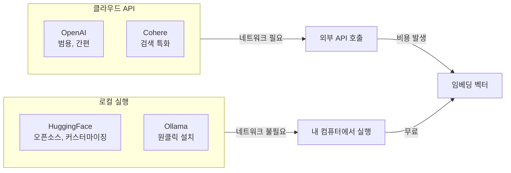
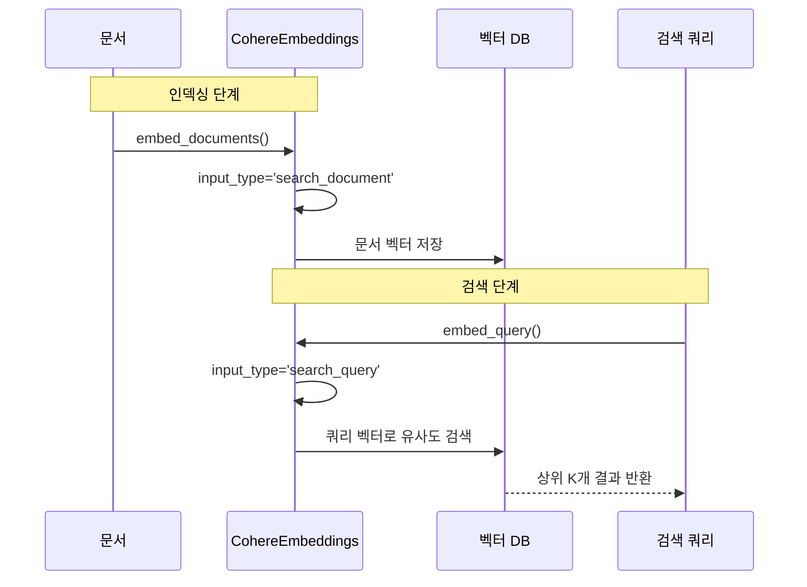
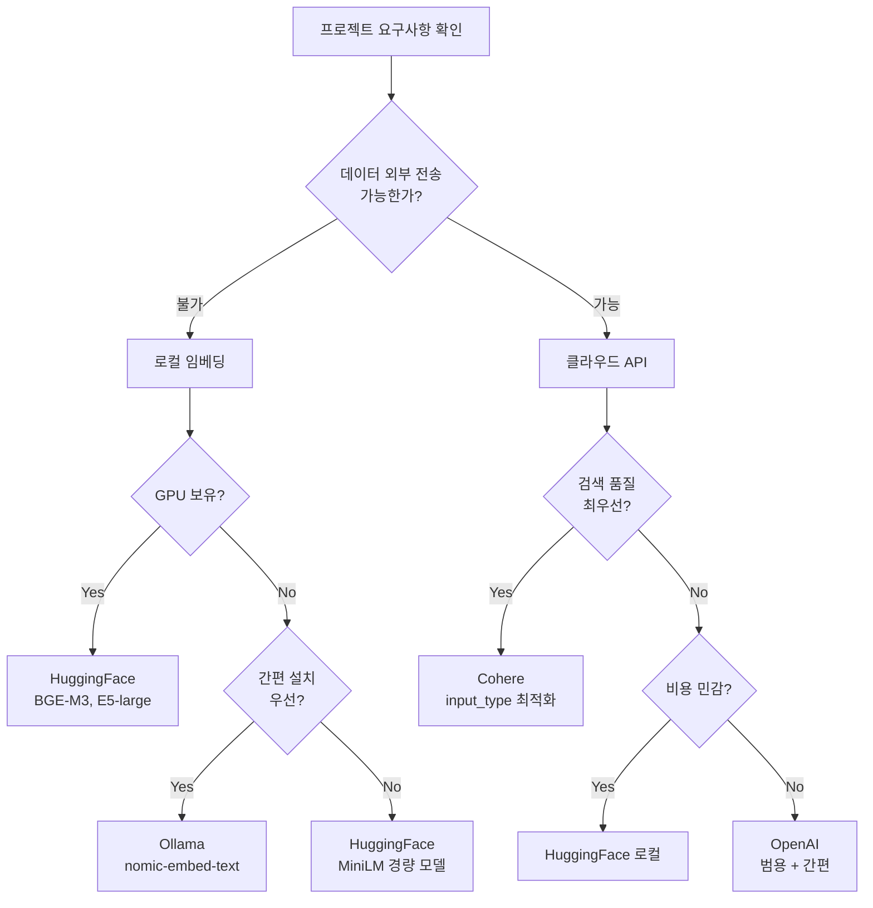
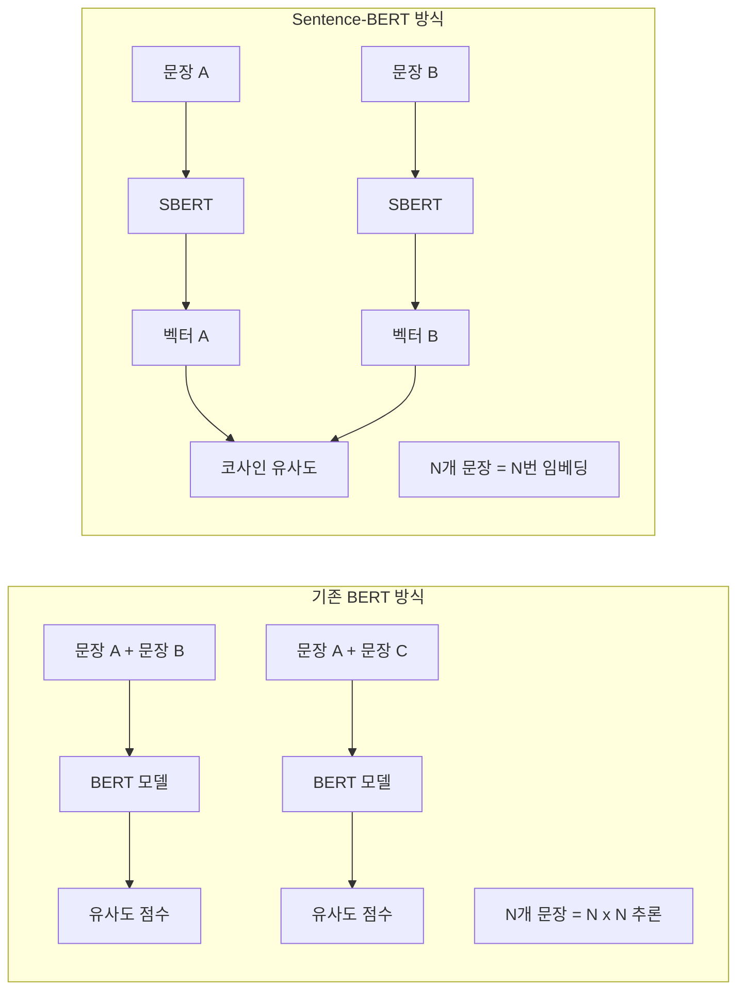

# 다양한 임베딩 모델

> LangChain에서 사용할 수 있는 임베딩 모델의 세계를 탐험하고, 프로젝트에 최적인 모델을 선택하는 기준을 배웁니다.

## 개요

이 섹션에서는 OpenAI 외에도 LangChain이 지원하는 다양한 임베딩 모델을 살펴봅니다. Hugging Face의 오픈소스 모델, Cohere의 상용 API, 그리고 Ollama를 활용한 로컬 임베딩까지 — 각 선택지의 장단점을 비교하고 실전에서 최적의 모델을 고르는 안목을 기릅니다.

**선수 지식**: [7.1 텍스트 임베딩 이해](ch07/session_01.md)에서 배운 임베딩의 기본 개념, 코사인 유사도, `embed_query()`와 `embed_documents()` 인터페이스
**학습 목표**:
- HuggingFaceEmbeddings로 오픈소스 임베딩 모델을 로컬에서 실행할 수 있다
- CohereEmbeddings의 `input_type` 파라미터를 올바르게 활용할 수 있다
- OllamaEmbeddings로 완전한 오프라인 임베딩 환경을 구축할 수 있다
- MTEB 벤치마크를 기반으로 프로젝트에 적합한 임베딩 모델을 선택할 수 있다

## 왜 알아야 할까?

앞서 [7.1 텍스트 임베딩 이해](ch07/session_01.md)에서는 OpenAI의 임베딩 모델을 사용해 텍스트를 벡터로 변환하는 방법을 배웠습니다. 그런데 실무에서는 "OpenAI만 쓰면 되지 않나?"라는 질문에 곧바로 벽에 부딪히는 경우가 많습니다.

- **비용 문제**: 수백만 개의 문서를 임베딩할 때 API 호출 비용이 기하급수적으로 늘어납니다
- **데이터 프라이버시**: 의료, 금융, 법률 분야에서는 외부 API로 데이터를 보내는 것 자체가 금지되기도 합니다
- **네트워크 의존성**: 오프라인 환경이나 에어갭(air-gapped) 네트워크에서는 클라우드 API를 사용할 수 없습니다
- **성능 최적화**: 한국어, 다국어, 특정 도메인에서는 OpenAI보다 뛰어난 전문 모델이 존재합니다

임베딩 모델 선택은 RAG 파이프라인의 검색 품질을 좌우하는 **가장 중요한 결정** 중 하나입니다. 마치 자동차를 고를 때 용도에 따라 세단, SUV, 트럭 중에서 선택하듯이 — 임베딩 모델도 상황에 맞는 최적의 선택이 필요하거든요.

> 📊 **그림 1**: 임베딩 모델 유형별 특성 비교




## 핵심 개념

### 개념 1: HuggingFaceEmbeddings — 오픈소스의 힘

> 💡 **비유**: HuggingFaceEmbeddings는 마치 **집에서 직접 빵을 굽는 것**과 같습니다. 재료(모델)를 직접 고르고, 내 오븐(컴퓨터)에서 구워내므로 완전한 통제권을 가집니다. 빵집(API)에 갈 필요도 없고, 비용도 초기 장비(GPU) 외에는 들지 않죠.

[Hugging Face](https://huggingface.co/)는 15,000개 이상의 사전학습된 임베딩 모델을 호스팅하는 오픈소스 플랫폼입니다. LangChain의 `HuggingFaceEmbeddings`를 사용하면 이 모델들을 로컬에서 바로 실행할 수 있습니다.

**설치:**

```bash
# langchain-huggingface 파트너 패키지 설치
pip install langchain-huggingface sentence-transformers
```

**기본 사용법:**

```python
from langchain_huggingface import HuggingFaceEmbeddings

# 모델 초기화 (처음 실행 시 자동 다운로드)
embeddings = HuggingFaceEmbeddings(
    model_name="sentence-transformers/all-MiniLM-L6-v2",  # 경량 모델
    model_kwargs={"device": "cpu"},         # GPU가 있으면 "cuda"로 변경
    encode_kwargs={"normalize_embeddings": True}  # 코사인 유사도에 최적화
)

# 단일 텍스트 임베딩
query_vector = embeddings.embed_query("LangChain은 LLM 애플리케이션 프레임워크입니다")
print(f"벡터 차원: {len(query_vector)}")  # 출력: 벡터 차원: 384

# 다중 문서 임베딩
docs = [
    "파이썬은 배우기 쉬운 프로그래밍 언어입니다",
    "자바스크립트는 웹 개발의 핵심 언어입니다",
    "LangChain으로 RAG 시스템을 구축할 수 있습니다"
]
doc_vectors = embeddings.embed_documents(docs)
print(f"문서 수: {len(doc_vectors)}, 각 벡터 차원: {len(doc_vectors[0])}")
# 출력: 문서 수: 3, 각 벡터 차원: 384
```

**인기 있는 Hugging Face 임베딩 모델:**

| 모델명 | 차원 | 크기 | 특징 |
|--------|------|------|------|
| `all-MiniLM-L6-v2` | 384 | ~80MB | 빠르고 가벼움, 입문용 |
| `all-mpnet-base-v2` | 768 | ~420MB | 균형 잡힌 성능 |
| `BAAI/bge-large-en-v1.5` | 1024 | ~1.3GB | 영어 최고 수준 |
| `BAAI/bge-m3` | 1024 | ~2.2GB | 100+언어 다국어 지원 |
| `intfloat/multilingual-e5-large` | 1024 | ~2.2GB | 다국어 검색 강자 |

> 🔥 **실무 팁**: `normalize_embeddings=True`를 설정하면 벡터가 단위 벡터로 정규화됩니다. 이렇게 하면 코사인 유사도 계산이 단순한 내적(dot product)으로 바뀌어 검색 속도가 빨라집니다.

### 개념 2: CohereEmbeddings — 검색에 특화된 상용 모델

> 💡 **비유**: Cohere의 임베딩은 마치 **맞춤 양복**과 같습니다. "이 옷을 어디에 입을 건가요?"라고 물어보고 — 면접용인지, 파티용인지에 따라 다르게 재단하죠. Cohere도 "이 텍스트를 어떤 용도로 쓸 건가요?"라고 `input_type`을 물어봅니다.

Cohere는 검색 특화 임베딩 모델로 유명합니다. 가장 큰 특징은 **`input_type` 파라미터**인데, 같은 텍스트라도 용도에 따라 다르게 임베딩한다는 것이 핵심입니다.

**설치:**

```bash
pip install langchain-cohere
```

**기본 사용법:**

```python
import os
from langchain_cohere import CohereEmbeddings

# 환경 변수로 API 키 설정
os.environ["COHERE_API_KEY"] = "your-api-key-here"  # .env 파일 사용 권장

# Cohere 임베딩 초기화
embeddings = CohereEmbeddings(
    model="embed-english-v3.0"  # 영어 특화 모델
    # model="embed-multilingual-v3.0"  # 다국어 모델 (한국어 포함)
)

# 문서 임베딩 — 벡터 DB에 저장할 때
doc_vectors = embeddings.embed_documents(
    ["LangChain은 LLM 애플리케이션 개발 프레임워크입니다"]
)
print(f"문서 벡터 차원: {len(doc_vectors[0])}")  # 출력: 문서 벡터 차원: 1024

# 쿼리 임베딩 — 검색할 때
query_vector = embeddings.embed_query("LangChain이 뭔가요?")
print(f"쿼리 벡터 차원: {len(query_vector)}")  # 출력: 쿼리 벡터 차원: 1024
```

**`input_type`이 왜 중요할까요?**

Cohere v3 이상 모델에서는 같은 텍스트라도 용도에 따라 최적화된 임베딩을 생성합니다:

| input_type | 용도 | 설명 |
|------------|------|------|
| `search_document` | 문서 저장 | 벡터 DB에 인덱싱할 문서용 |
| `search_query` | 검색 쿼리 | 검색 질의에 최적화 |
| `classification` | 분류 | 텍스트 분류 태스크용 |
| `clustering` | 클러스터링 | 그룹핑/군집화용 |

LangChain의 `CohereEmbeddings`는 `embed_documents()`를 호출하면 자동으로 `search_document`, `embed_query()`를 호출하면 `search_query`로 설정합니다. 이 구분이 검색 정확도를 상당히 높여주거든요.

> 📊 **그림 2**: Cohere의 비대칭 검색 — embed_documents vs embed_query




> ⚠️ **흔한 오해**: "embed_query()와 embed_documents() 결과가 같다"고 생각하기 쉽지만, Cohere 모델에서는 **명백히 다른 벡터**를 반환합니다. 문서를 저장할 때와 검색할 때 반드시 올바른 메서드를 사용해야 합니다. 혼용하면 검색 품질이 크게 떨어집니다.

### 개념 3: OllamaEmbeddings — 완전한 로컬 임베딩

> 💡 **비유**: Ollama는 **자가발전기**와 같습니다. 전력회사(클라우드 API)와의 연결 없이도 내 집에서 독립적으로 전기를 만들어 씁니다. 인터넷이 끊겨도, 비용 걱정 없이, 데이터가 외부로 나가지 않습니다.

[Ollama](https://ollama.com/)는 로컬 머신에서 LLM과 임베딩 모델을 쉽게 실행할 수 있게 해주는 도구입니다. Docker처럼 모델을 `pull`하고 바로 사용할 수 있어 진입장벽이 매우 낮습니다.

**사전 준비:**

```bash
# 1. Ollama 설치 (macOS)
brew install ollama

# 2. Ollama 서비스 시작
brew services start ollama
# 또는: ollama serve

# 3. 임베딩 모델 다운로드
ollama pull nomic-embed-text       # 274MB, 빠르고 가벼움
ollama pull mxbai-embed-large      # 670MB, 높은 정확도
```

**LangChain 연동:**

```bash
pip install langchain-ollama
```

```python
from langchain_ollama import OllamaEmbeddings

# Ollama 임베딩 초기화
embeddings = OllamaEmbeddings(
    model="nomic-embed-text"  # 로컬에 pull한 모델명
)

# 사용법은 다른 임베딩과 동일합니다!
query_vector = embeddings.embed_query("로컬에서 실행되는 임베딩입니다")
print(f"벡터 차원: {len(query_vector)}")  # 출력: 벡터 차원: 768

# 여러 문서 임베딩
docs = [
    "Ollama는 로컬에서 모델을 실행합니다",
    "인터넷 연결 없이도 작동합니다",
    "데이터가 외부로 전송되지 않습니다"
]
doc_vectors = embeddings.embed_documents(docs)
print(f"문서 수: {len(doc_vectors)}")  # 출력: 문서 수: 3
```

**Ollama에서 사용 가능한 주요 임베딩 모델:**

| 모델명 | 차원 | 크기 | MTEB 평균 | 특징 |
|--------|------|------|-----------|------|
| `nomic-embed-text` | 768 | 274MB | ~53.0 | 빠르고 가벼움, 8K 컨텍스트 |
| `mxbai-embed-large` | 1024 | 670MB | ~64.7 | BERT-large급 최고 성능 |
| `snowflake-arctic-embed` | 1024 | 670MB | ~60.0 | 균형 잡힌 성능 |
| `all-minilm` | 384 | 46MB | ~56.0 | 초경량, 빠른 프로토타이핑 |

### 개념 4: 임베딩 모델 선택 기준 — MTEB와 실전 지표

> 📊 **그림 3**: 임베딩 모델 선택 의사결정 흐름




그렇다면 이 많은 모델 중에서 어떤 걸 골라야 할까요? 임베딩 모델 세계에는 **MTEB(Massive Text Embedding Benchmark)**라는 공인된 벤치마크가 있습니다.

**MTEB란?**

MTEB는 임베딩 모델을 검색(Retrieval), 분류(Classification), 클러스터링(Clustering), 의미 유사도(STS) 등 다양한 태스크에서 종합적으로 평가하는 벤치마크입니다. [Hugging Face MTEB 리더보드](https://huggingface.co/spaces/mteb/leaderboard)에서 실시간으로 모델 순위를 확인할 수 있습니다.


**실전 선택 기준 매트릭스:**

```
프로젝트 요구사항을 확인하세요:

┌─ 데이터가 외부로 나가면 안 되나요?
│   ├─ Yes → 로컬 임베딩 (HuggingFace 또는 Ollama)
│   │   ├─ GPU가 있나요?
│   │   │   ├─ Yes → HuggingFaceEmbeddings + BGE-M3 또는 E5-large
│   │   │   └─ No  → OllamaEmbeddings + nomic-embed-text
│   │   └─ 설치가 간편해야 하나요?
│   │       ├─ Yes → Ollama (원클릭 설치)
│   │       └─ No  → HuggingFace (세밀한 커스터마이징)
│   └─ No  → 클라우드 API 가능
│       ├─ 검색 품질이 최우선인가요?
│       │   ├─ Yes → CohereEmbeddings (input_type 최적화)
│       │   └─ No  → OpenAIEmbeddings (범용 + 간편)
│       └─ 비용이 중요한가요?
│           ├─ Yes → HuggingFace 로컬 실행
│           └─ No  → OpenAI 또는 Cohere
```

**주요 모델 종합 비교:**

| 기준 | OpenAI | Cohere | HuggingFace (로컬) | Ollama (로컬) |
|------|--------|--------|-------------------|---------------|
| **비용** | 토큰당 과금 | 토큰당 과금 | 무료 (하드웨어 비용) | 무료 |
| **프라이버시** | 데이터 전송 | 데이터 전송 | 완전 로컬 | 완전 로컬 |
| **설치 난이도** | 쉬움 | 쉬움 | 보통 | 쉬움 |
| **한국어 성능** | 양호 | 우수 (multilingual) | 모델에 따라 다름 | 모델에 따라 다름 |
| **속도** | 네트워크 의존 | 네트워크 의존 | GPU 의존 | CPU/GPU 의존 |
| **커스터마이징** | 불가 | 제한적 | 파인튜닝 가능 | 제한적 |
| **오프라인 사용** | 불가 | 불가 | 가능 | 가능 |

## 실습: 직접 해보기

이제 세 가지 임베딩 모델을 동일한 텍스트에 적용하고, 유사도 검색 결과를 비교해봅시다.

```python
"""
세션 7.2 실습: 다양한 임베딩 모델 비교 실험
- HuggingFaceEmbeddings, CohereEmbeddings, OllamaEmbeddings를 비교합니다.
- 동일한 쿼리와 문서로 유사도를 측정하고 결과를 비교합니다.

사전 준비:
  pip install langchain-huggingface langchain-cohere langchain-ollama
  pip install sentence-transformers numpy python-dotenv
  ollama pull nomic-embed-text  # Ollama 모델 미리 다운로드
"""

import numpy as np
from dotenv import load_dotenv

load_dotenv()  # .env 파일에서 COHERE_API_KEY 로드

# ── 1단계: 테스트용 문서와 쿼리 준비 ──────────────────────────
documents = [
    "LangChain은 대규모 언어 모델을 활용한 애플리케이션 개발 프레임워크입니다",
    "벡터 데이터베이스는 임베딩 벡터를 저장하고 유사도 검색을 수행합니다",
    "RAG는 외부 지식을 검색하여 LLM 응답의 정확성을 높이는 기법입니다",
    "파이썬은 데이터 과학과 머신러닝에 널리 사용되는 프로그래밍 언어입니다",
    "도커는 애플리케이션을 컨테이너로 패키징하여 배포하는 플랫폼입니다",
]

query = "LLM을 활용한 검색 증강 생성은 어떻게 작동하나요?"

# ── 코사인 유사도 계산 함수 ────────────────────────────────
def cosine_similarity(a: list[float], b: list[float]) -> float:
    """두 벡터 간 코사인 유사도를 계산합니다."""
    a_arr, b_arr = np.array(a), np.array(b)
    return float(np.dot(a_arr, b_arr) / (np.linalg.norm(a_arr) * np.linalg.norm(b_arr)))

def rank_documents(
    query_vec: list[float],
    doc_vecs: list[list[float]],
    documents: list[str],
    model_name: str
) -> None:
    """쿼리와 문서 간 유사도를 계산하고 순위를 출력합니다."""
    similarities = [
        (doc, cosine_similarity(query_vec, doc_vec))
        for doc, doc_vec in zip(documents, doc_vecs)
    ]
    # 유사도 내림차순 정렬
    similarities.sort(key=lambda x: x[1], reverse=True)

    print(f"\n{'='*60}")
    print(f"📊 [{model_name}] 유사도 순위")
    print(f"{'='*60}")
    for rank, (doc, sim) in enumerate(similarities, 1):
        # 상위 2개는 강조 표시
        marker = "✅" if rank <= 2 else "  "
        print(f"  {marker} {rank}위: {sim:.4f} | {doc[:40]}...")


# ── 2단계: HuggingFace 임베딩 ──────────────────────────────
print("\n🤗 HuggingFaceEmbeddings 로딩 중...")
from langchain_huggingface import HuggingFaceEmbeddings

hf_embeddings = HuggingFaceEmbeddings(
    model_name="sentence-transformers/all-MiniLM-L6-v2",
    model_kwargs={"device": "cpu"},
    encode_kwargs={"normalize_embeddings": True},
)

hf_query_vec = hf_embeddings.embed_query(query)
hf_doc_vecs = hf_embeddings.embed_documents(documents)
print(f"  ✓ 벡터 차원: {len(hf_query_vec)}")
rank_documents(hf_query_vec, hf_doc_vecs, documents, "HuggingFace all-MiniLM-L6-v2")


# ── 3단계: Cohere 임베딩 (API 키 필요) ─────────────────────
print("\n🔷 CohereEmbeddings 로딩 중...")
try:
    from langchain_cohere import CohereEmbeddings

    cohere_embeddings = CohereEmbeddings(
        model="embed-multilingual-v3.0"  # 한국어 지원 모델
    )

    cohere_query_vec = cohere_embeddings.embed_query(query)
    cohere_doc_vecs = cohere_embeddings.embed_documents(documents)
    print(f"  ✓ 벡터 차원: {len(cohere_query_vec)}")
    rank_documents(cohere_query_vec, cohere_doc_vecs, documents, "Cohere embed-multilingual-v3.0")
except Exception as e:
    print(f"  ⚠ Cohere 건너뜀 (API 키 필요): {e}")


# ── 4단계: Ollama 임베딩 (로컬 서버 필요) ──────────────────
print("\n🦙 OllamaEmbeddings 로딩 중...")
try:
    from langchain_ollama import OllamaEmbeddings

    ollama_embeddings = OllamaEmbeddings(
        model="nomic-embed-text"
    )

    ollama_query_vec = ollama_embeddings.embed_query(query)
    ollama_doc_vecs = ollama_embeddings.embed_documents(documents)
    print(f"  ✓ 벡터 차원: {len(ollama_query_vec)}")
    rank_documents(ollama_query_vec, ollama_doc_vecs, documents, "Ollama nomic-embed-text")
except Exception as e:
    print(f"  ⚠ Ollama 건너뜀 (로컬 서버 필요): {e}")


# ── 5단계: 결과 요약 ──────────────────────────────────────
print(f"\n{'='*60}")
print("📋 비교 요약")
print(f"{'='*60}")
print(f"  쿼리: {query}")
print(f"  기대 결과: RAG 관련 문서(3번)와 LangChain 문서(1번)가 상위")
print(f"  → 각 모델의 순위를 비교하여 검색 품질을 판단하세요!")
```

**실행 결과 예시:**

```
🤗 HuggingFaceEmbeddings 로딩 중...
  ✓ 벡터 차원: 384

============================================================
📊 [HuggingFace all-MiniLM-L6-v2] 유사도 순위
============================================================
  ✅ 1위: 0.5823 | RAG는 외부 지식을 검색하여 LLM 응답의 정확성을 높이는 기법...
  ✅ 2위: 0.4217 | LangChain은 대규모 언어 모델을 활용한 애플리케이션 개발 프...
     3위: 0.3845 | 벡터 데이터베이스는 임베딩 벡터를 저장하고 유사도 검색을 수...
     4위: 0.1532 | 파이썬은 데이터 과학과 머신러닝에 널리 사용되는 프로그래밍 ...
     5위: 0.0621 | 도커는 애플리케이션을 컨테이너로 패키징하여 배포하는 플랫폼...
```

## 더 깊이 알아보기

### Sentence-BERT의 탄생 — 임베딩 혁명의 시작

2019년, 독일 다름슈타트 공대의 Nils Reimers와 Iryna Gurevych는 한 가지 불만을 가지고 있었습니다. BERT는 놀라운 자연어 이해 능력을 보여줬지만, 두 문장의 유사도를 구하려면 반드시 **두 문장을 동시에 모델에 넣어야** 했습니다. 10,000개의 문장 중에서 가장 유사한 쌍을 찾으려면? 약 5,000만 번의 추론이 필요했고, 이는 V100 GPU로도 65시간이 걸리는 작업이었죠.

그래서 Reimers는 **Sentence-BERT(SBERT)**를 만들었습니다. 핵심 아이디어는 단순했습니다 — 각 문장을 독립적으로 임베딩하여 고정 크기 벡터로 만들면, 유사도 검색이 코사인 유사도 한 번으로 끝나니까요. 같은 10,000개 문장 검색이 65시간에서 **5초**로 줄었습니다. 이 SBERT가 바로 오늘날 `sentence-transformers` 라이브러리의 시작이자, HuggingFaceEmbeddings의 기반입니다.


> 📊 **그림 4**: BERT vs Sentence-BERT 유사도 계산 방식 비교




### MTEB — 임베딩 올림픽의 등장

임베딩 모델이 폭발적으로 늘어나자, "도대체 어떤 모델이 진짜 좋은 거야?"라는 질문이 커졌습니다. 2022년 Hugging Face 연구팀이 발표한 **MTEB(Massive Text Embedding Benchmark)**는 8개 태스크 카테고리, 58개 데이터셋, 112개 언어에 걸쳐 임베딩 모델을 종합 평가하는 벤치마크입니다. 마치 올림픽에서 10종 경기처럼, 하나의 종목이 아니라 **종합 실력**을 평가하는 것이죠.

MTEB 리더보드는 지금도 새로운 모델이 등록되면 실시간으로 순위가 갱신되며, 임베딩 모델 선택의 사실상의 표준으로 자리잡았습니다.


### Cohere의 input_type — 비대칭 검색의 지혜

검색 엔진의 세계에서는 오랜 관찰이 있었습니다. 사용자의 검색 쿼리("맛있는 파스타 만드는 법")와 검색 대상 문서("이탈리아 요리의 역사와 파스타 레시피...")는 **길이, 형식, 의도**가 완전히 다르다는 것이죠. 이를 **비대칭 검색(Asymmetric Search)**이라고 합니다.

Cohere는 이 통찰을 모델 아키텍처에 녹여, 쿼리와 문서를 아예 다른 방식으로 인코딩합니다. 이것이 `input_type` 파라미터의 탄생 배경이며, 검색 품질 향상에 실질적인 효과를 보여주었습니다.

## 흔한 오해와 팁

> ⚠️ **흔한 오해**: "차원이 높을수록 무조건 좋다"고 생각하기 쉽지만, 실제로는 그렇지 않습니다. 384차원의 `all-MiniLM-L6-v2`가 특정 태스크에서 1024차원 모델보다 나은 성능을 보이기도 합니다. 차원이 높으면 저장 공간과 검색 속도에 부담을 주므로, 벤치마크 결과와 실제 데이터로 테스트하는 것이 중요합니다.

> 💡 **알고 계셨나요?**: `all-MiniLM-L6-v2` 모델명의 "MiniLM"은 Microsoft가 2020년에 발표한 경량화 기법의 이름입니다. "L6"는 6개의 트랜스포머 레이어를 의미하고, "v2"는 두 번째 버전이라는 뜻이죠. 이렇게 모델 이름에 아키텍처 정보가 담겨 있어, 이름만 봐도 대략적인 크기와 성능을 짐작할 수 있습니다.

> 🔥 **실무 팁**: 프로덕션에서 임베딩 모델을 교체하면 **기존 벡터 DB의 모든 문서를 다시 임베딩**해야 합니다. 서로 다른 모델의 벡터는 호환되지 않거든요. 따라서 초기에 모델을 신중하게 선택하고, 교체 시에는 반드시 마이그레이션 계획을 세우세요. 소규모 테스트 → 벤치마크 비교 → 프로덕션 적용 순으로 진행하는 것을 권장합니다.

> 🔥 **실무 팁**: Hugging Face 모델을 처음 사용할 때 자동 다운로드가 발생합니다. CI/CD 파이프라인에서는 미리 모델을 캐시해두거나, `SENTENCE_TRANSFORMERS_HOME` 환경 변수로 캐시 경로를 지정하세요. 프로덕션 배포 시 갑작스러운 다운로드로 서비스가 지연되는 것을 방지할 수 있습니다.

## 핵심 정리

| 개념 | 설명 |
|------|------|
| HuggingFaceEmbeddings | `langchain-huggingface` 패키지로 15,000+ 오픈소스 모델을 로컬 실행. `sentence-transformers` 기반 |
| CohereEmbeddings | 검색 특화 상용 API. `input_type`으로 쿼리/문서를 구분하여 비대칭 검색 최적화 |
| OllamaEmbeddings | Ollama 기반 완전 로컬 임베딩. `ollama pull` 후 바로 사용 가능, 무료 |
| MTEB | 임베딩 모델의 종합 벤치마크. 검색, 분류, 클러스터링 등 다양한 태스크로 평가 |
| `normalize_embeddings` | 벡터 정규화 옵션. 코사인 유사도 계산을 내적으로 단순화하여 속도 향상 |
| `input_type` | Cohere v3+ 모델의 핵심 파라미터. `search_document`/`search_query` 등 용도별 최적화 |
| 모델 선택 기준 | 비용, 프라이버시, 언어 지원, 오프라인 필요성, 검색 품질 종합 고려 |

## 다음 섹션 미리보기

임베딩 모델로 텍스트를 벡터로 변환하는 방법을 익혔으니, 이제 이 벡터들을 **저장하고 검색**할 차례입니다. 다음 섹션 [7.3 벡터 스토어 기초](ch07/session_03.md)에서는 FAISS, Chroma 등 벡터 스토어를 구축하고, 유사도 기반 검색을 수행하는 방법을 배웁니다. 오늘 비교한 다양한 임베딩 모델을 벡터 스토어와 연동하는 실전 패턴도 함께 다룰 예정이니 기대하세요!

## 참고 자료

- [LangChain HuggingFaceEmbeddings 공식 문서](https://python.langchain.com/api_reference/huggingface/embeddings/langchain_huggingface.embeddings.huggingface.HuggingFaceEmbeddings.html) - HuggingFaceEmbeddings 클래스의 파라미터와 사용법 레퍼런스
- [LangChain CohereEmbeddings 공식 문서](https://python.langchain.com/api_reference/cohere/embeddings/langchain_cohere.embeddings.CohereEmbeddings.html) - CohereEmbeddings 클래스와 input_type 활용법
- [LangChain OllamaEmbeddings 공식 문서](https://python.langchain.com/api_reference/ollama/embeddings/langchain_ollama.embeddings.OllamaEmbeddings.html) - OllamaEmbeddings 설정과 로컬 실행 가이드
- [Ollama 임베딩 모델 블로그](https://ollama.com/blog/embedding-models) - Ollama에서 지원하는 임베딩 모델 목록과 사용법
- [MTEB: Massive Text Embedding Benchmark (GitHub)](https://github.com/embeddings-benchmark/mteb) - 임베딩 모델 벤치마크 코드와 리더보드
- [Hugging Face × LangChain 파트너 패키지 소개](https://huggingface.co/blog/langchain) - langchain-huggingface 패키지의 탄생 배경과 기능 설명
- [Cohere Embed 모델 공식 가이드](https://docs.cohere.com/docs/cohere-embed) - Cohere 임베딩 모델의 아키텍처와 input_type 상세 설명
- [langchain-huggingface (PyPI)](https://pypi.org/project/langchain-huggingface/) - 최신 버전 확인 및 설치 가이드

---
### 🔗 Related Sessions
- [embedding](../07-임베딩과-벡터-스토어/01-텍스트-임베딩-이해.md) (prerequisite)
- [cosine_similarity](../07-임베딩과-벡터-스토어/01-텍스트-임베딩-이해.md) (prerequisite)
- [embed_query](../07-임베딩과-벡터-스토어/01-텍스트-임베딩-이해.md) (prerequisite)
- [embed_documents](../07-임베딩과-벡터-스토어/01-텍스트-임베딩-이해.md) (prerequisite)
- [text-embedding-3-small](../07-임베딩과-벡터-스토어/01-텍스트-임베딩-이해.md) (prerequisite)
