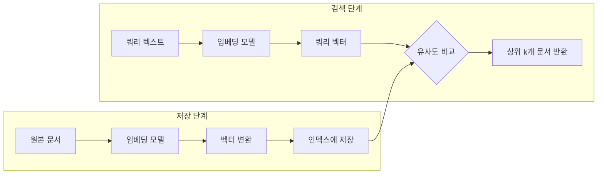
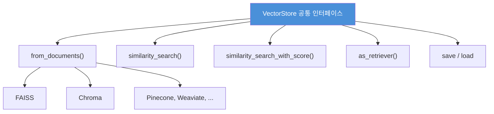
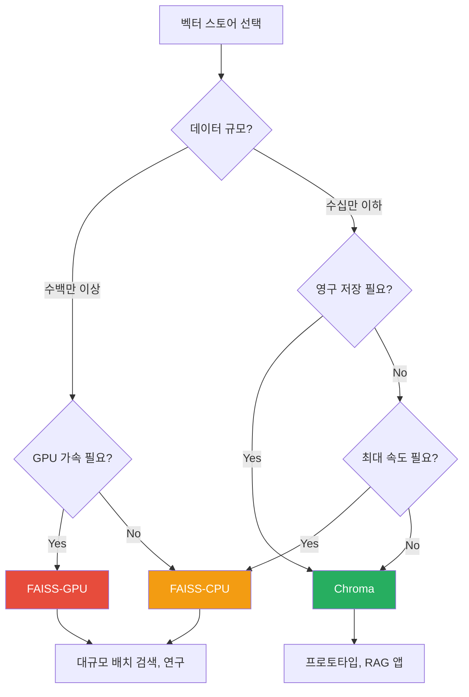
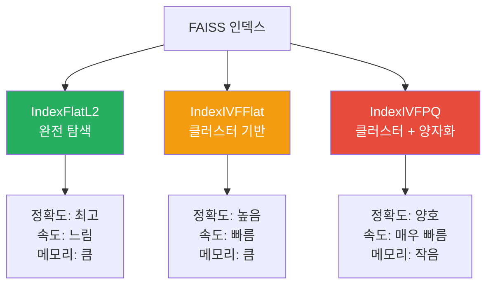

# 벡터 스토어 구축 - FAISS와 Chroma

> 임베딩 벡터를 저장하고 빠르게 검색하는 벡터 스토어를 FAISS와 Chroma로 직접 구축합니다.

## 개요

이 섹션에서는 앞서 학습한 임베딩 벡터를 실제로 저장하고 검색하는 **벡터 스토어(Vector Store)**를 구축합니다. 수천, 수만 개의 문서를 벡터로 변환한 뒤 "가장 비슷한 문서를 찾아줘"라고 요청할 수 있는 시스템을 만드는 거죠.

**선수 지식**: [7.1 텍스트 임베딩 이해](7.1)에서 배운 벡터 변환과 코사인 유사도 개념, [7.2 다양한 임베딩 모델](7.2)에서 익힌 임베딩 모델 사용법

**학습 목표**:
- FAISS 벡터 스토어를 생성하고 유사도 검색을 수행할 수 있다
- Chroma 영구 저장소를 구성하여 데이터를 디스크에 보존할 수 있다
- `similarity_search`와 `similarity_search_with_score`의 차이를 이해하고 활용할 수 있다
- 프로젝트 요구사항에 맞는 벡터 스토어를 선택할 수 있다

## 왜 알아야 할까?

[7.1 텍스트 임베딩 이해](7.1)에서 텍스트를 벡터로 변환하는 방법을 배웠는데요, 이 벡터들을 어디에 저장하고 어떻게 검색할까요? 매번 모든 문서를 임베딩하고 하나씩 비교하는 건 너무 느리겠죠.

**벡터 스토어**는 수백만 개의 벡터를 효율적으로 저장하고, 쿼리 벡터와 가장 유사한 벡터를 밀리초 단위로 찾아주는 전문 데이터베이스입니다. RAG(Retrieval-Augmented Generation) 시스템의 핵심 인프라이기도 합니다. 실제로 ChatGPT 플러그인, 기업용 문서 검색 시스템, 추천 엔진 등 LLM 기반 애플리케이션의 대부분이 내부적으로 벡터 스토어를 사용하고 있습니다.

이번 섹션에서 배울 **FAISS**와 **Chroma**는 가장 널리 쓰이는 두 벡터 스토어입니다. FAISS는 Meta(Facebook)가 만든 초고속 인메모리 검색 라이브러리이고, Chroma는 AI 애플리케이션에 특화된 영구 저장 벡터 데이터베이스입니다.

## 핵심 개념

### 개념 1: 벡터 스토어란 무엇인가

> 💡 **비유**: 벡터 스토어는 **거대한 도서관의 사서**와 같습니다. 일반 데이터베이스가 "ISBN이 978-89-..."인 책을 찾는 것이라면, 벡터 스토어는 "이 책과 **분위기가 비슷한** 책을 찾아주세요"라고 요청할 수 있는 사서인 셈이죠. 정확한 값이 아니라 **의미적 유사성**을 기준으로 검색합니다.

벡터 스토어의 동작 원리를 단순화하면 이렇습니다:

1. **저장(Indexing)**: 문서를 임베딩 모델로 벡터로 변환하여 인덱스에 저장
2. **검색(Search)**: 쿼리 텍스트를 같은 임베딩 모델로 벡터화한 뒤, 인덱스에서 가장 가까운 벡터들을 찾음
3. **반환(Return)**: 가장 유사한 문서(들)를 원본 텍스트와 함께 반환

> 📊 **그림 1**: 벡터 스토어의 저장(Indexing)과 검색(Search) 흐름




LangChain에서 모든 벡터 스토어는 공통 인터페이스를 따릅니다:

```python
# 벡터 스토어 공통 인터페이스 (의사 코드)
vector_store = VectorStore.from_documents(documents, embedding)  # 생성
results = vector_store.similarity_search(query, k=4)             # 검색
results_with_score = vector_store.similarity_search_with_score(query, k=4)  # 점수 포함 검색
retriever = vector_store.as_retriever()                          # 리트리버 변환
```

이 공통 인터페이스 덕분에 FAISS에서 Chroma로, 또는 다른 벡터 스토어로 전환하더라도 코드 변경이 최소화됩니다.

> 📊 **그림 2**: LangChain 벡터 스토어 공통 인터페이스 구조




### 개념 2: FAISS — 초고속 인메모리 벡터 검색

> 💡 **비유**: FAISS는 **초고속 색인 카드함**입니다. 모든 카드를 메모리에 올려놓고 번개처럼 빠르게 찾아줍니다. 대신 카드함의 크기는 RAM 용량에 제한되고, 전원이 꺼지면 카드를 다시 정리해야 합니다(별도로 저장하지 않는 한).

**FAISS**(Facebook AI Similarity Search)는 Meta AI Research 팀이 개발한 고성능 벡터 유사도 검색 라이브러리입니다. C++로 작성되어 Python 바인딩을 제공하며, 수십억 규모의 벡터도 처리할 수 있을 만큼 빠릅니다.

**설치**:

```bash
# FAISS와 LangChain 커뮤니티 패키지 설치
pip install langchain-community faiss-cpu

# GPU가 있다면 (CUDA 지원)
# pip install faiss-gpu
```

**FAISS 벡터 스토어 생성과 검색**:

```python
from langchain_community.vectorstores import FAISS
from langchain_openai import OpenAIEmbeddings
from langchain_core.documents import Document

# 임베딩 모델 준비
embeddings = OpenAIEmbeddings(model="text-embedding-3-small")

# 문서 준비
documents = [
    Document(page_content="LangChain은 LLM 기반 앱 개발 프레임워크입니다.", metadata={"source": "intro"}),
    Document(page_content="FAISS는 벡터 유사도 검색 라이브러리입니다.", metadata={"source": "faiss"}),
    Document(page_content="RAG는 검색 증강 생성 기법입니다.", metadata={"source": "rag"}),
    Document(page_content="벡터 임베딩은 텍스트를 숫자로 변환합니다.", metadata={"source": "embedding"}),
    Document(page_content="프롬프트 엔지니어링은 AI에게 좋은 질문을 하는 기술입니다.", metadata={"source": "prompt"}),
]

# FAISS 벡터 스토어 생성 (from_documents)
vector_store = FAISS.from_documents(documents, embeddings)

# 유사도 검색 — 가장 비슷한 2개 문서 반환
results = vector_store.similarity_search("벡터 검색이란?", k=2)
for doc in results:
    print(f"[{doc.metadata['source']}] {doc.page_content}")
# 출력:
# [faiss] FAISS는 벡터 유사도 검색 라이브러리입니다.
# [embedding] 벡터 임베딩은 텍스트를 숫자로 변환합니다.
```

**점수 포함 검색 — `similarity_search_with_score`**:

```python
# 점수와 함께 검색 (낮을수록 유사)
results_with_score = vector_store.similarity_search_with_score("LLM 앱 만들기", k=3)
for doc, score in results_with_score:
    print(f"점수: {score:.4f} | [{doc.metadata['source']}] {doc.page_content}")
# 출력 예시:
# 점수: 0.3215 | [intro] LangChain은 LLM 기반 앱 개발 프레임워크입니다.
# 점수: 0.5847 | [prompt] 프롬프트 엔지니어링은 AI에게 좋은 질문을 하는 기술입니다.
# 점수: 0.6123 | [rag] RAG는 검색 증강 생성 기법입니다.
```

> ⚠️ **흔한 오해**: FAISS의 `similarity_search_with_score`가 반환하는 점수는 **L2(유클리드) 거리**입니다. 코사인 유사도와 달리 **낮을수록 더 유사**합니다. "점수가 높으면 더 비슷하겠지?"라고 생각하면 결과 해석이 완전히 뒤바뀌니 주의하세요!

**인덱스 저장과 로드**:

FAISS는 인메모리 라이브러리이므로, 프로그램을 종료하면 인덱스가 사라집니다. `save_local`과 `load_local`로 디스크에 저장할 수 있습니다.

```python
# 인덱스 저장
vector_store.save_local("faiss_index")
# faiss_index/ 디렉토리에 index.faiss와 index.pkl 파일 생성

# 인덱스 로드 (프로그램 재시작 후에도 사용 가능)
loaded_store = FAISS.load_local(
    "faiss_index",
    embeddings,
    allow_dangerous_deserialization=True  # pickle 역직렬화 허용
)

# 로드한 인덱스로 검색
results = loaded_store.similarity_search("RAG란?", k=1)
print(results[0].page_content)
# 출력: RAG는 검색 증강 생성 기법입니다.
```

> 🔥 **실무 팁**: `allow_dangerous_deserialization=True`는 pickle 파일을 역직렬화할 때 필요한데요, 신뢰할 수 없는 출처의 인덱스 파일은 절대 로드하지 마세요. pickle은 임의 코드 실행 취약점이 있으므로, 반드시 본인이 생성한 파일만 사용해야 합니다.

### 개념 3: Chroma — AI 네이티브 영구 벡터 데이터베이스

> 💡 **비유**: Chroma는 **자동 저장되는 디지털 노트앱**과 같습니다. FAISS가 칠판에 적어놓고 빠르게 훑어보는 방식이라면, Chroma는 노트앱에 적어두면 자동으로 클라우드에 저장되고, 앱을 다시 열어도 내용이 고스란히 남아있는 방식입니다.

**Chroma**는 AI 애플리케이션을 위해 설계된 오픈소스 벡터 데이터베이스입니다. FAISS와 달리 **영구 저장(persistence)**이 기본 설계에 포함되어 있고, 메타데이터 필터링, 컬렉션 관리 등 데이터베이스다운 기능을 제공합니다.

**설치**:

```bash
# Chroma와 LangChain Chroma 패키지 설치
pip install langchain-chroma chromadb
```

**Chroma 벡터 스토어 생성과 검색**:

```python
from langchain_chroma import Chroma
from langchain_openai import OpenAIEmbeddings
from langchain_core.documents import Document

# 임베딩 모델 준비
embeddings = OpenAIEmbeddings(model="text-embedding-3-small")

# 문서 준비
documents = [
    Document(page_content="Python은 간결하고 읽기 쉬운 프로그래밍 언어입니다.", metadata={"category": "language"}),
    Document(page_content="JavaScript는 웹 개발의 핵심 언어입니다.", metadata={"category": "language"}),
    Document(page_content="Docker는 애플리케이션을 컨테이너로 패키징합니다.", metadata={"category": "devops"}),
    Document(page_content="Kubernetes는 컨테이너 오케스트레이션 도구입니다.", metadata={"category": "devops"}),
    Document(page_content="FastAPI는 Python 기반 웹 프레임워크입니다.", metadata={"category": "framework"}),
]

# 인메모리 Chroma (테스트용, 영구 저장 없음)
vector_store = Chroma.from_documents(documents, embeddings)

results = vector_store.similarity_search("웹 개발 도구", k=2)
for doc in results:
    print(f"[{doc.metadata['category']}] {doc.page_content}")
# 출력:
# [language] JavaScript는 웹 개발의 핵심 언어입니다.
# [framework] FastAPI는 Python 기반 웹 프레임워크입니다.
```

**영구 저장소 구성**:

Chroma의 가장 큰 장점 중 하나는 `persist_directory`를 지정하면 자동으로 디스크에 데이터를 저장하는 것입니다.

```python
# 영구 저장소가 있는 Chroma 생성
vector_store = Chroma.from_documents(
    documents,
    embeddings,
    persist_directory="./chroma_db",         # 이 경로에 데이터 저장
    collection_name="my_documents"           # 컬렉션 이름 지정
)

# 검색 수행
results = vector_store.similarity_search("Python 프레임워크", k=2)
for doc in results:
    print(doc.page_content)
# 출력:
# FastAPI는 Python 기반 웹 프레임워크입니다.
# Python은 간결하고 읽기 쉬운 프로그래밍 언어입니다.
```

```python
# 프로그램 재시작 후 — 기존 저장소 로드
vector_store = Chroma(
    persist_directory="./chroma_db",
    embedding_function=embeddings,
    collection_name="my_documents"
)

# 저장된 데이터로 바로 검색 가능
results = vector_store.similarity_search("컨테이너 기술", k=1)
print(results[0].page_content)
# 출력: Docker는 애플리케이션을 컨테이너로 패키징합니다.
```

**문서 추가와 삭제**:

```python
# 기존 벡터 스토어에 문서 추가
new_docs = [
    Document(page_content="Redis는 인메모리 데이터 스토어입니다.", metadata={"category": "database"}),
    Document(page_content="PostgreSQL은 관계형 데이터베이스입니다.", metadata={"category": "database"}),
]

# add_documents는 문서 ID 리스트를 반환
ids = vector_store.add_documents(new_docs)
print(f"추가된 문서 ID: {ids}")
# 출력: 추가된 문서 ID: ['uuid1...', 'uuid2...']

# 특정 문서 삭제 (ID 기반)
vector_store.delete(ids=[ids[0]])  # Redis 문서 삭제
```

### 개념 4: 메타데이터 필터링

벡터 유사도 검색만으로는 부족할 때가 있습니다. "DevOps 카테고리에서만 검색해줘"처럼 **메타데이터 조건**을 걸고 싶을 때 필터링을 사용합니다.

```python
# Chroma — 메타데이터 필터링
results = vector_store.similarity_search(
    "개발 도구",
    k=3,
    filter={"category": "devops"}  # devops 카테고리만 검색
)
for doc in results:
    print(f"[{doc.metadata['category']}] {doc.page_content}")
# 출력:
# [devops] Docker는 애플리케이션을 컨테이너로 패키징합니다.
# [devops] Kubernetes는 컨테이너 오케스트레이션 도구입니다.
```

```python
# FAISS — 메타데이터 필터링 (filter 딕셔너리 사용)
faiss_store = FAISS.from_documents(documents, embeddings)
results = faiss_store.similarity_search(
    "개발 도구",
    k=3,
    filter={"category": "language"}  # language 카테고리만
)
for doc in results:
    print(f"[{doc.metadata['category']}] {doc.page_content}")
# 출력:
# [language] JavaScript는 웹 개발의 핵심 언어입니다.
# [language] Python은 간결하고 읽기 쉬운 프로그래밍 언어입니다.
```

### 개념 5: FAISS vs Chroma — 무엇을 선택할까?

> 📊 **그림 4**: 프로젝트 요구사항에 따른 벡터 스토어 선택 가이드




| 기준 | FAISS | Chroma |
|------|-------|--------|
| **저장 방식** | 인메모리 (수동 저장) | 영구 저장 (자동) |
| **설치** | `faiss-cpu` / `faiss-gpu` | `chromadb` |
| **속도** | 매우 빠름 (C++ 기반) | 빠름 (충분히 실용적) |
| **확장성** | 수십억 벡터 처리 가능 | 수백만 벡터에 적합 |
| **메타데이터 필터링** | 기본 지원 | 풍부한 필터 지원 |
| **문서 추가/삭제** | 추가 가능, 삭제 제한적 | CRUD 완전 지원 |
| **GPU 지원** | 네 (faiss-gpu) | 아니오 |
| **적합한 용도** | 대규모 배치 검색, 연구 | 앱 프로토타이핑, RAG |

> 🔥 **실무 팁**: 프로토타이핑이나 소규모 프로젝트에서는 **Chroma**가 편리합니다. 영구 저장, 문서 관리, 메타데이터 필터링이 기본 내장이니까요. 반면 수백만~수십억 건의 대규모 검색이 필요하거나 GPU 가속이 중요한 환경에서는 **FAISS**가 더 적합합니다. 실제 프로덕션에서는 둘 다 시작점으로 쓰고, 필요에 따라 Pinecone, Weaviate, Milvus 같은 클라우드 벡터 DB로 이전하는 경우가 많습니다.

## 실습: 직접 해보기

FAISS와 Chroma 두 가지 벡터 스토어를 사용하여 동일한 문서 컬렉션에 대해 유사도 검색을 수행하고, 결과를 비교하는 실습입니다.

```python
"""
벡터 스토어 비교 실습 — FAISS vs Chroma
동일한 문서 세트로 두 벡터 스토어를 구축하고 검색 결과를 비교합니다.
"""
import os
from dotenv import load_dotenv
from langchain_core.documents import Document
from langchain_openai import OpenAIEmbeddings
from langchain_community.vectorstores import FAISS
from langchain_chroma import Chroma

# 환경 변수 로드
load_dotenv()

# 임베딩 모델 초기화
embeddings = OpenAIEmbeddings(model="text-embedding-3-small")

# ── 1단계: 문서 준비 ──────────────────────────────────────────
documents = [
    Document(
        page_content="LangChain의 LCEL은 파이프 연산자(|)를 사용하여 컴포넌트를 선언적으로 조합합니다.",
        metadata={"topic": "langchain", "difficulty": "intermediate"}
    ),
    Document(
        page_content="RAG 시스템은 외부 문서를 검색하여 LLM의 답변 정확도를 높입니다.",
        metadata={"topic": "rag", "difficulty": "intermediate"}
    ),
    Document(
        page_content="벡터 임베딩은 텍스트의 의미를 고차원 공간의 점으로 표현합니다.",
        metadata={"topic": "embedding", "difficulty": "beginner"}
    ),
    Document(
        page_content="프롬프트 템플릿은 변수를 포함한 재사용 가능한 프롬프트 구조입니다.",
        metadata={"topic": "prompt", "difficulty": "beginner"}
    ),
    Document(
        page_content="에이전트는 LLM이 도구를 선택적으로 사용하여 복잡한 작업을 수행하는 시스템입니다.",
        metadata={"topic": "agent", "difficulty": "advanced"}
    ),
    Document(
        page_content="LangGraph는 상태 기반 그래프로 복잡한 에이전트 워크플로우를 구축합니다.",
        metadata={"topic": "langgraph", "difficulty": "advanced"}
    ),
    Document(
        page_content="출력 파서는 LLM의 텍스트 응답을 JSON 등 구조화된 데이터로 변환합니다.",
        metadata={"topic": "parser", "difficulty": "beginner"}
    ),
    Document(
        page_content="벡터 스토어는 임베딩 벡터를 저장하고 유사도 기반 검색을 수행합니다.",
        metadata={"topic": "vectorstore", "difficulty": "intermediate"}
    ),
]

# ── 2단계: FAISS 벡터 스토어 구축 ──────────────────────────────
print("=" * 60)
print("FAISS 벡터 스토어")
print("=" * 60)

# FAISS 인덱스 생성
faiss_store = FAISS.from_documents(documents, embeddings)

# 유사도 검색
query = "LLM 응답을 개선하는 방법"
print(f"\n🔍 쿼리: '{query}'\n")

# similarity_search — 문서만 반환
faiss_results = faiss_store.similarity_search(query, k=3)
print("[ similarity_search 결과 ]")
for i, doc in enumerate(faiss_results, 1):
    print(f"  {i}. [{doc.metadata['topic']}] {doc.page_content[:50]}...")

# similarity_search_with_score — 점수도 반환
print("\n[ similarity_search_with_score 결과 ]")
faiss_scored = faiss_store.similarity_search_with_score(query, k=3)
for i, (doc, score) in enumerate(faiss_scored, 1):
    print(f"  {i}. (L2거리: {score:.4f}) [{doc.metadata['topic']}] {doc.page_content[:50]}...")

# FAISS 인덱스 저장
faiss_store.save_local("faiss_practice_index")
print("\n✅ FAISS 인덱스 저장 완료: faiss_practice_index/")

# ── 3단계: Chroma 벡터 스토어 구축 ────────────────────────────
print("\n" + "=" * 60)
print("Chroma 벡터 스토어")
print("=" * 60)

# Chroma 영구 저장소 생성
chroma_store = Chroma.from_documents(
    documents,
    embeddings,
    persist_directory="./chroma_practice_db",
    collection_name="langchain_docs"
)

# 동일한 쿼리로 검색
print(f"\n🔍 쿼리: '{query}'\n")

chroma_results = chroma_store.similarity_search(query, k=3)
print("[ similarity_search 결과 ]")
for i, doc in enumerate(chroma_results, 1):
    print(f"  {i}. [{doc.metadata['topic']}] {doc.page_content[:50]}...")

# Chroma의 점수 포함 검색
chroma_scored = chroma_store.similarity_search_with_score(query, k=3)
print("\n[ similarity_search_with_score 결과 ]")
for i, (doc, score) in enumerate(chroma_scored, 1):
    print(f"  {i}. (거리: {score:.4f}) [{doc.metadata['topic']}] {doc.page_content[:50]}...")

# ── 4단계: 메타데이터 필터링 비교 ─────────────────────────────
print("\n" + "=" * 60)
print("메타데이터 필터링 검색")
print("=" * 60)

filter_query = "LangChain 개념"

# FAISS — beginner 난이도만 필터
faiss_filtered = faiss_store.similarity_search(
    filter_query, k=2, filter={"difficulty": "beginner"}
)
print(f"\n🔍 FAISS 필터링 (difficulty='beginner'):")
for doc in faiss_filtered:
    print(f"  [{doc.metadata['difficulty']}] {doc.page_content[:60]}...")

# Chroma — beginner 난이도만 필터
chroma_filtered = chroma_store.similarity_search(
    filter_query, k=2, filter={"difficulty": "beginner"}
)
print(f"\n🔍 Chroma 필터링 (difficulty='beginner'):")
for doc in chroma_filtered:
    print(f"  [{doc.metadata['difficulty']}] {doc.page_content[:60]}...")

# ── 5단계: Retriever 변환 (다음 챕터 미리보기) ────────────────
print("\n" + "=" * 60)
print("Retriever 변환")
print("=" * 60)

# 벡터 스토어 → 리트리버 변환
retriever = chroma_store.as_retriever(
    search_type="similarity",  # 검색 타입: similarity, mmr
    search_kwargs={"k": 2}     # 반환할 문서 수
)

# 리트리버로 검색
retrieved_docs = retriever.invoke("벡터 검색 원리")
print(f"\n🔍 Retriever 검색 결과:")
for doc in retrieved_docs:
    print(f"  [{doc.metadata['topic']}] {doc.page_content[:60]}...")

print("\n✅ 실습 완료!")
```

## 더 깊이 알아보기

### FAISS의 탄생 — 10억 개의 이미지를 검색하라

2015년, Meta(당시 Facebook) AI Research 팀의 **Hervé Jégou**, **Matthijs Douze**, **Jeff Johnson** 등은 거대한 도전에 직면했습니다. Facebook에 매일 올라오는 수십억 장의 사진에서 유사한 이미지를 찾아내야 했거든요. 기존의 검색 알고리즘은 수백만 개 수준에서 이미 한계에 부딪혔습니다.

이들은 2년간의 연구와 엔지니어링 끝에 **FAISS**를 개발하여 2017년 3월에 오픈소스로 공개했습니다. 놀랍게도 당시 기준 최첨단 대비 **8.5배 빠른 성능**을 달성했죠. 핵심 비결은 **역파일 인덱스(IVF, Inverted File Index)**와 **곱 양자화(Product Quantization)** 같은 근사 최근접 이웃(ANN) 알고리즘이었습니다.


FAISS 내부에는 여러 종류의 인덱스가 있습니다:
- **IndexFlatL2**: 모든 벡터를 하나씩 비교하는 완전 탐색. 정확하지만 느림
- **IndexIVFFlat**: 벡터를 클러스터(보로노이 셀)로 나눠두고, 쿼리와 가까운 클러스터만 검색. 빠르지만 근사값
- **IndexIVFPQ**: IVF + 곱 양자화로 메모리까지 절약. 대규모 데이터에 적합


LangChain의 FAISS 래퍼는 기본적으로 **IndexFlatL2**를 사용하므로, 정확한 검색 결과를 보장합니다. 수백만 건 이상의 대규모 데이터에서는 FAISS를 직접 사용하여 IVF 계열 인덱스를 구성하는 것을 고려해볼 수 있습니다.

> 📊 **그림 3**: FAISS 인덱스 종류와 트레이드오프




### Chroma의 철학 — "AI 개발자를 위한 데이터베이스"

Chroma는 2022년에 설립되어 2023년 4월 1,800만 달러의 시드 투자를 유치한 스타트업입니다. 창업자들은 기존 벡터 데이터베이스들이 **웹 규모 시맨틱 검색**을 위해 설계되어 AI 애플리케이션 개발자에게는 불필요하게 복잡하다고 느꼈습니다.

그래서 Chroma는 "AI 네이티브"를 표방하며, `pip install chromadb` 한 줄이면 바로 사용할 수 있는 단순함을 목표로 설계되었습니다. Apache 2.0 라이선스의 완전한 오픈소스이고, 로컬 개발부터 프로덕션까지 동일한 API로 사용할 수 있다는 점이 개발자들에게 큰 호응을 얻었습니다.

## 흔한 오해와 팁

> ⚠️ **흔한 오해**: "벡터 스토어는 기존 데이터베이스를 대체한다?" — 아닙니다. 벡터 스토어는 **유사도 검색에 특화**된 도구이지, MySQL이나 PostgreSQL 같은 범용 데이터베이스를 대체하는 것이 아닙니다. 실제 프로덕션에서는 관계형 DB(사용자 정보, 트랜잭션)와 벡터 스토어(의미 검색)를 함께 사용합니다.

> 💡 **알고 계셨나요?**: FAISS는 원래 **이미지 검색**을 위해 만들어졌습니다. 텍스트 임베딩에 사용하는 건 LLM 시대에 와서 폭발적으로 늘어난 활용법이에요. FAISS 팀은 처음에 10억 개의 이미지 벡터(96차원)를 단일 GPU에서 35분 만에 인덱싱하는 성과를 보여줬습니다.

> 🔥 **실무 팁**: Chroma에서 같은 `persist_directory`에 `from_documents`를 반복 호출하면 **문서가 중복 저장**됩니다. 기존 저장소에 추가할 때는 `Chroma(persist_directory=...)` 로 기존 인스턴스를 로드한 뒤 `add_documents()`를 사용하세요. 중복 방지가 필요하다면 문서 ID를 직접 관리하는 것이 좋습니다.

> 🔥 **실무 팁**: FAISS와 Chroma 모두 `as_retriever()` 메서드로 LangChain의 **Retriever**로 변환할 수 있습니다. `search_type="mmr"`을 지정하면 앞서 [7.1 텍스트 임베딩 이해](7.1)에서 배운 MMR(Maximal Marginal Relevance) 알고리즘으로 유사하면서도 다양한 결과를 얻을 수 있죠. 이 부분은 [8장 검색기(Retriever) 심화](ch8)에서 본격적으로 다룹니다.

## 핵심 정리

| 개념 | 설명 |
|------|------|
| **벡터 스토어** | 임베딩 벡터를 저장하고 유사도 기반으로 검색하는 전문 데이터베이스 |
| **FAISS** | Meta가 개발한 초고속 인메모리 벡터 검색 라이브러리. C++ 기반으로 매우 빠름 |
| **Chroma** | AI 네이티브 오픈소스 벡터 DB. 영구 저장, CRUD, 메타데이터 필터링 기본 제공 |
| **`from_documents`** | 문서 리스트로부터 벡터 스토어를 한 번에 생성하는 클래스 메서드 |
| **`similarity_search`** | 쿼리와 가장 유사한 k개 문서를 반환하는 기본 검색 메서드 |
| **`similarity_search_with_score`** | 유사도 점수(거리값)를 함께 반환. FAISS는 L2 거리(낮을수록 유사) |
| **`save_local` / `load_local`** | FAISS 인덱스를 디스크에 저장하고 다시 로드하는 메서드 |
| **`persist_directory`** | Chroma의 영구 저장 경로. 지정 시 자동으로 데이터가 디스크에 보존됨 |
| **메타데이터 필터링** | `filter` 매개변수로 특정 메타데이터 조건에 맞는 문서만 검색 |
| **`as_retriever()`** | 벡터 스토어를 LangChain Retriever 인터페이스로 변환 |

## 다음 섹션 미리보기

이번 섹션에서 FAISS와 Chroma로 벡터 스토어를 구축하고 기본 유사도 검색을 수행해봤습니다. 하지만 실전에서는 "검색 결과가 너무 비슷한 문서만 나온다", "대량의 문서를 효율적으로 인덱싱하고 싶다" 같은 과제가 생기는데요. 다음 섹션에서는 **벡터 스토어 성능 최적화** — MMR 검색, 인덱스 튜닝, 배치 처리 전략 등을 다뤄 실전에서 벡터 스토어를 더 효과적으로 활용하는 방법을 알아봅니다.

## 참고 자료

- [LangChain FAISS Integration](https://python.langchain.com/api_reference/community/vectorstores/langchain_community.vectorstores.faiss.FAISS.html) - FAISS 벡터 스토어의 전체 API 레퍼런스. 모든 메서드와 매개변수를 확인할 수 있습니다
- [LangChain Chroma Integration](https://python.langchain.com/api_reference/chroma/vectorstores/langchain_chroma.vectorstores.Chroma.html) - Chroma 벡터 스토어의 공식 API 문서. 영구 저장, 컬렉션 관리 등 상세 가이드 포함
- [FAISS GitHub Repository](https://github.com/facebookresearch/faiss) - FAISS 공식 리포지토리. 인덱스 종류별 가이드와 벤치마크 데이터 제공
- [Chroma 공식 사이트](https://www.trychroma.com/) - Chroma DB의 공식 문서와 시작 가이드
- [Engineering at Meta: FAISS 소개](https://engineering.fb.com/2017/03/29/data-infrastructure/faiss-a-library-for-efficient-similarity-search/) - FAISS 개발 배경과 설계 철학을 담은 Meta 엔지니어링 블로그 원문

---
### 🔗 Related Sessions
- [embedding](../07-임베딩과-벡터-스토어/01-텍스트-임베딩-이해.md) (prerequisite)
- [cosine_similarity](../07-임베딩과-벡터-스토어/01-텍스트-임베딩-이해.md) (prerequisite)
- [embed_query](../07-임베딩과-벡터-스토어/01-텍스트-임베딩-이해.md) (prerequisite)
- [embed_documents](../07-임베딩과-벡터-스토어/01-텍스트-임베딩-이해.md) (prerequisite)
- [euclidean_distance](../07-임베딩과-벡터-스토어/01-텍스트-임베딩-이해.md) (prerequisite)
- [huggingfaceembeddings](../07-임베딩과-벡터-스토어/02-다양한-임베딩-모델.md) (prerequisite)
