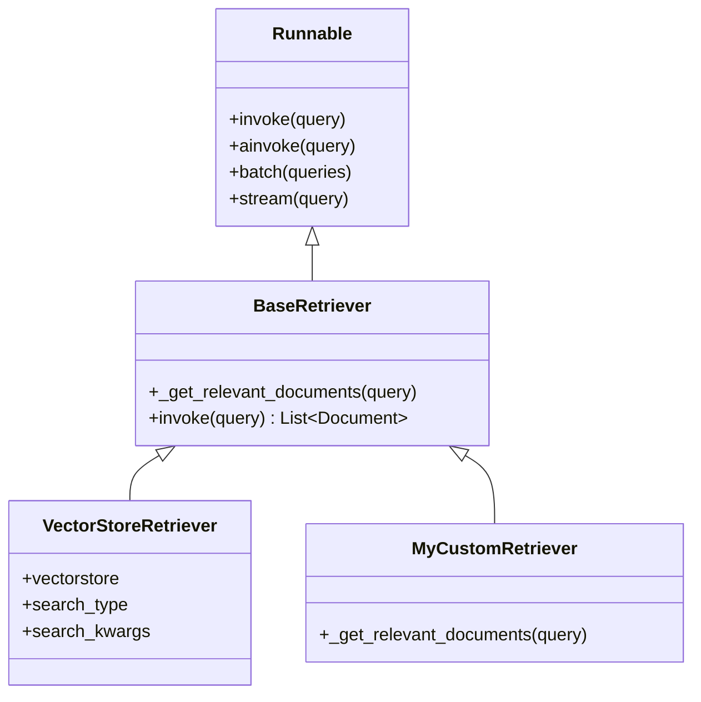
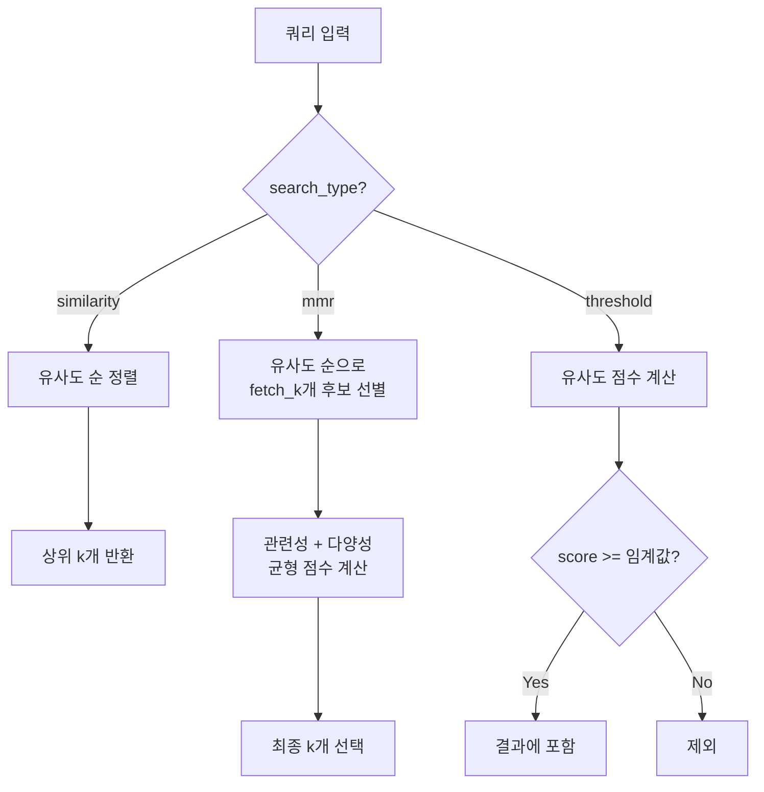
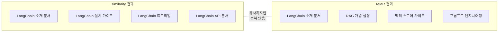

# 검색기 기초

> LangChain의 검색기(Retriever) 인터페이스를 이해하고, VectorStoreRetriever를 다양한 전략으로 설정하는 방법을 배웁니다.

## 개요

이 섹션에서는 LangChain 검색 시스템의 핵심인 **BaseRetriever 인터페이스**와 **VectorStoreRetriever**를 다룹니다. 검색기가 어떤 역할을 하는지, 어떻게 설정하고 튜닝하는지를 단계별로 배워보겠습니다.

**선수 지식**: [Ch7: 임베딩과 벡터 스토어](ch07)에서 배운 벡터 스토어 생성, 임베딩 개념, 유사도 검색의 기본 원리
**학습 목표**:
- BaseRetriever 인터페이스의 구조와 Runnable 프로토콜을 이해한다
- VectorStoreRetriever의 `search_type`과 `search_kwargs`를 설정할 수 있다
- similarity, MMR, similarity_score_threshold 세 가지 검색 전략을 비교하고 선택할 수 있다
- k값과 관련 파라미터를 상황에 맞게 최적화할 수 있다

## 왜 알아야 할까?

RAG(Retrieval-Augmented Generation) 시스템을 떠올려 보세요. 사용자가 질문을 던지면, LLM이 답변하기 전에 **관련 문서를 먼저 찾아야** 합니다. 이때 "어떤 문서를 가져올 것인가"를 결정하는 게 바로 검색기(Retriever)의 역할이거든요.

아무리 훌륭한 LLM을 사용하더라도, 검색기가 엉뚱한 문서를 가져오면 답변 품질은 떨어질 수밖에 없습니다. 반대로, 검색기를 잘 튜닝하면 같은 LLM으로도 훨씬 정확한 답변을 만들어낼 수 있죠. **검색기는 RAG 파이프라인의 성패를 좌우하는 핵심 컴포넌트**입니다.

> 📊 **그림 1**: RAG 파이프라인에서 검색기의 위치


실무에서는 "검색 결과가 부정확해요"라는 피드백의 대부분이 검색기 설정 문제에서 비롯됩니다. `k`값 하나만 바꿔도 답변 품질이 극적으로 달라질 수 있어요. 이 섹션에서 검색기의 기초를 탄탄히 다져두면, 이후 고급 검색 전략(앙상블, 멀티쿼리, 셀프 쿼리 등)을 훨씬 수월하게 이해할 수 있습니다.

## 핵심 개념

### 개념 1: BaseRetriever — 모든 검색기의 뿌리

> 📊 **그림 2**: BaseRetriever 클래스 구조와 Runnable 인터페이스




> 💡 **비유**: BaseRetriever는 **도서관의 사서 자격증**과 같습니다. "질문을 받으면 관련 자료를 찾아 돌려준다"라는 약속만 지키면, 서가에서 찾든 데이터베이스에서 찾든 상관없어요. 어떤 방식이든 사서 자격만 있으면 도서관에서 일할 수 있죠.

LangChain의 `BaseRetriever`는 모든 검색기가 구현해야 하는 **추상 인터페이스**입니다. 핵심 약속은 단 하나, "문자열 쿼리를 받아서 `Document` 리스트를 반환한다"는 것이죠.

```python
from langchain_core.retrievers import BaseRetriever
from langchain_core.documents import Document
from typing import List

class MySimpleRetriever(BaseRetriever):
    """커스텀 검색기 예시"""
    docs: List[Document]  # 검색 대상 문서 리스트
    k: int = 3            # 반환할 문서 수

    def _get_relevant_documents(self, query: str) -> List[Document]:
        """핵심 메서드: 쿼리와 관련된 문서를 반환"""
        # 여기서는 단순히 처음 k개를 반환하지만,
        # 실제로는 유사도 계산 등 복잡한 로직이 들어갑니다
        return self.docs[:self.k]
```

여기서 중요한 점이 있습니다. BaseRetriever는 **Runnable 인터페이스**를 구현하고 있어요. 앞서 [Ch5: LCEL 마스터](ch05)에서 배운 것처럼, Runnable이면 `invoke`, `ainvoke`, `batch`, `stream` 같은 표준 메서드를 모두 사용할 수 있고, **파이프 연산자(`|`)로 체인에 조합**할 수도 있습니다.

```python
# Runnable이기 때문에 이런 것들이 모두 가능합니다
docs = retriever.invoke("LangChain이 뭔가요?")        # 동기 호출
docs = await retriever.ainvoke("LangChain이 뭔가요?")  # 비동기 호출
results = retriever.batch(["질문1", "질문2", "질문3"])  # 배치 호출

# LCEL 체인에 바로 연결
chain = retriever | format_docs | llm | parser
```

### 개념 2: VectorStoreRetriever — 가장 흔히 쓰는 검색기

> 💡 **비유**: 벡터 스토어가 거대한 **도서관 서가**라면, VectorStoreRetriever는 그 서가 전담 **사서**입니다. "비슷한 책 찾아줘"라고 하면 유사도 검색을, "다양한 주제의 책도 섞어줘"라고 하면 MMR 검색을 수행하죠. 같은 서가를 두고도 검색 전략을 바꿀 수 있는 셈입니다.

실무에서 가장 많이 쓰는 검색기는 `VectorStoreRetriever`입니다. 벡터 스토어의 `.as_retriever()` 메서드를 호출하면 바로 만들 수 있어요.

```python
from langchain_community.vectorstores import FAISS
from langchain_openai import OpenAIEmbeddings

# 벡터 스토어 생성 (Ch7에서 배운 내용)
embeddings = OpenAIEmbeddings()
vectorstore = FAISS.from_texts(
    texts=["LangChain은 LLM 프레임워크입니다", "Python은 프로그래밍 언어입니다"],
    embedding=embeddings
)

# 벡터 스토어를 검색기로 변환 — 이것이 VectorStoreRetriever
retriever = vectorstore.as_retriever()

# 사용
docs = retriever.invoke("LangChain이 뭔가요?")
```

`.as_retriever()`를 호출하면 내부적으로 `VectorStoreRetriever` 인스턴스가 생성됩니다. 이 검색기는 벡터 스토어의 유사도 검색 기능을 BaseRetriever 인터페이스로 감싸주는 역할을 하죠.

### 개념 3: search_type — 세 가지 검색 전략

VectorStoreRetriever의 `search_type` 파라미터로 검색 전략을 선택할 수 있습니다. 세 가지 옵션이 있어요.

> 📊 **그림 3**: 세 가지 search_type 검색 전략 비교




**1) `"similarity"` (기본값) — 유사도 순 검색**

가장 직관적인 방식입니다. 쿼리와 코사인 유사도가 높은 문서를 k개 반환합니다.

```python
# 기본 유사도 검색 (search_type 생략 시 기본값)
retriever = vectorstore.as_retriever(
    search_type="similarity",
    search_kwargs={"k": 4}  # 상위 4개 문서 반환
)
```

**2) `"mmr"` — 최대 한계 관련성(Maximal Marginal Relevance)**

유사도만 높은 문서를 가져오면, 비슷한 내용의 문서가 중복되는 문제가 생기거든요. MMR은 **관련성과 다양성을 동시에 고려**합니다. 먼저 쿼리와 유사한 문서를 `fetch_k`개 가져온 뒤, 그중에서 서로 겹치지 않는 `k`개를 골라냅니다.

```python
# MMR 검색: 관련성 + 다양성 균형
retriever = vectorstore.as_retriever(
    search_type="mmr",
    search_kwargs={
        "k": 4,            # 최종 반환할 문서 수
        "fetch_k": 20,     # MMR 알고리즘에 전달할 후보 문서 수
        "lambda_mult": 0.5  # 다양성 조절 (0=최대 다양성, 1=최대 관련성)
    }
)
```

**3) `"similarity_score_threshold"` — 임계값 기반 검색**

"상위 k개"가 아니라, **유사도 점수가 기준을 넘는 문서만** 반환합니다. 관련 없는 문서가 섞이는 걸 방지할 수 있어요.

```python
# 유사도 임계값 기반 검색
retriever = vectorstore.as_retriever(
    search_type="similarity_score_threshold",
    search_kwargs={
        "score_threshold": 0.7,  # 유사도 0.7 이상만 반환
        "k": 10                   # 최대 반환 문서 수
    }
)
```

세 전략을 한눈에 비교해 볼까요?

| 전략 | 장점 | 단점 | 적합한 상황 |
|------|------|------|------------|
| `similarity` | 빠르고 직관적 | 중복 문서 가능 | 일반적인 QA |
| `mmr` | 다양한 관점 제공 | 다소 느림 | 요약, 브레인스토밍 |
| `similarity_score_threshold` | 노이즈 필터링 | 결과가 0개일 수 있음 | 정밀도 중시 시스템 |

### 개념 4: search_kwargs 심화 — k값과 파라미터 최적화

> 💡 **비유**: k값 설정은 **뷔페에서 접시 크기 고르기**와 비슷합니다. 접시가 너무 작으면(k가 작으면) 원하는 음식을 다 담지 못하고, 너무 크면(k가 크면) 안 먹을 음식까지 담아서 낭비가 생기죠. 상황에 맞는 적절한 크기가 중요합니다.

`search_kwargs`는 딕셔너리 형태로 다양한 파라미터를 전달할 수 있습니다. 주요 파라미터를 정리하면:

```python
# 모든 search_kwargs 파라미터 예시
retriever = vectorstore.as_retriever(
    search_type="mmr",
    search_kwargs={
        "k": 4,              # 반환할 문서 수 (기본값: 4)
        "fetch_k": 20,       # MMR용 후보 문서 수 (기본값: 20)
        "lambda_mult": 0.5,  # MMR 다양성 (0~1, 기본값: 0.5)
        "filter": {           # 메타데이터 필터링
            "source": "arxiv"
        }
    }
)
```

**k값 최적화 가이드라인:**

- **k = 1~3**: 단답형 QA, 특정 사실 확인. 정확한 문서 1~2개면 충분한 경우
- **k = 4~6**: 일반적인 RAG 파이프라인. 대부분의 경우 좋은 시작점
- **k = 8~15**: 종합적인 분석, 리포트 생성. 여러 관점을 모아야 할 때
- **k = 20+**: 거의 사용하지 않음. LLM 컨텍스트 윈도우를 낭비하게 됨

왜 k값이 중요할까요? k가 너무 크면 **두 가지 문제**가 생깁니다. 첫째, 관련 없는 문서가 섞여 LLM이 혼란을 겪습니다("Lost in the Middle" 현상). 둘째, 더 많은 토큰을 소비하므로 비용이 늘어나요. 반대로 k가 너무 작으면 필요한 정보를 놓칠 수 있습니다.

")


```python
# 메타데이터 필터와 함께 사용하는 실전 패턴
retriever = vectorstore.as_retriever(
    search_type="similarity",
    search_kwargs={
        "k": 5,
        "filter": {"category": "technical", "year": 2025}
    }
)

# 필터 덕분에 특정 카테고리 문서만 검색됩니다
docs = retriever.invoke("LangChain 최신 업데이트")
```

## 실습: 직접 해보기

아래 코드는 실제로 벡터 스토어를 만들고, 세 가지 검색 전략을 비교하는 완전한 예제입니다.

```python
"""
Session 8.1 실습: 검색기 기초 — 세 가지 검색 전략 비교
"""

import os
from dotenv import load_dotenv

# 환경 변수 로드
load_dotenv()

from langchain_openai import OpenAIEmbeddings
from langchain_community.vectorstores import FAISS
from langchain_core.documents import Document

# ── 1단계: 샘플 문서 준비 ────────────────────────────────
# 실제 프로젝트에서는 문서 로더로 가져오지만, 여기서는 직접 만듭니다
documents = [
    Document(
        page_content="LangChain은 LLM 기반 애플리케이션 개발을 위한 오픈소스 프레임워크입니다.",
        metadata={"source": "docs", "topic": "langchain"}
    ),
    Document(
        page_content="LangChain의 LCEL은 파이프 연산자로 컴포넌트를 조합하는 선언적 언어입니다.",
        metadata={"source": "docs", "topic": "langchain"}
    ),
    Document(
        page_content="RAG는 외부 지식을 검색하여 LLM 응답의 정확성을 높이는 기법입니다.",
        metadata={"source": "paper", "topic": "rag"}
    ),
    Document(
        page_content="벡터 스토어는 임베딩 벡터를 저장하고 유사도 검색을 수행하는 데이터베이스입니다.",
        metadata={"source": "docs", "topic": "vectorstore"}
    ),
    Document(
        page_content="검색기(Retriever)는 쿼리를 받아 관련 문서를 반환하는 컴포넌트입니다.",
        metadata={"source": "docs", "topic": "retriever"}
    ),
    Document(
        page_content="LangChain은 다양한 LLM 제공자(OpenAI, Anthropic 등)를 지원합니다.",
        metadata={"source": "blog", "topic": "langchain"}
    ),
    Document(
        page_content="프롬프트 엔지니어링은 LLM에게 효과적인 지시를 내리는 기술입니다.",
        metadata={"source": "blog", "topic": "prompt"}
    ),
    Document(
        page_content="임베딩은 텍스트를 고차원 벡터 공간의 수치 벡터로 변환하는 과정입니다.",
        metadata={"source": "paper", "topic": "embedding"}
    ),
]

# ── 2단계: 벡터 스토어 생성 ──────────────────────────────
embeddings = OpenAIEmbeddings()
vectorstore = FAISS.from_documents(documents, embeddings)

print("=" * 60)
print("검색기 기초 실습: 세 가지 검색 전략 비교")
print("=" * 60)

query = "LangChain 프레임워크란 무엇인가요?"

# ── 3단계: similarity 검색 ───────────────────────────────
print("\n📌 [전략 1] similarity 검색 (k=3)")
print("-" * 40)

retriever_sim = vectorstore.as_retriever(
    search_type="similarity",
    search_kwargs={"k": 3}
)

docs_sim = retriever_sim.invoke(query)
for i, doc in enumerate(docs_sim, 1):
    print(f"  {i}. [{doc.metadata['topic']}] {doc.page_content[:50]}...")

# ── 4단계: MMR 검색 ─────────────────────────────────────
print("\n📌 [전략 2] MMR 검색 (k=3, fetch_k=8, lambda_mult=0.5)")
print("-" * 40)

retriever_mmr = vectorstore.as_retriever(
    search_type="mmr",
    search_kwargs={
        "k": 3,
        "fetch_k": 8,         # 후보 8개 중 다양한 3개 선택
        "lambda_mult": 0.5    # 관련성과 다양성 균형
    }
)

docs_mmr = retriever_mmr.invoke(query)
for i, doc in enumerate(docs_mmr, 1):
    print(f"  {i}. [{doc.metadata['topic']}] {doc.page_content[:50]}...")

# ── 5단계: similarity_score_threshold 검색 ───────────────
print("\n📌 [전략 3] similarity_score_threshold 검색 (threshold=0.3)")
print("-" * 40)

retriever_threshold = vectorstore.as_retriever(
    search_type="similarity_score_threshold",
    search_kwargs={
        "score_threshold": 0.3,  # 유사도 0.3 이상만
        "k": 10
    }
)

docs_threshold = retriever_threshold.invoke(query)
print(f"  임계값을 넘은 문서 수: {len(docs_threshold)}개")
for i, doc in enumerate(docs_threshold, 1):
    print(f"  {i}. [{doc.metadata['topic']}] {doc.page_content[:50]}...")

# ── 6단계: 메타데이터 필터 활용 ──────────────────────────
print("\n📌 [보너스] 메타데이터 필터 + similarity 검색")
print("-" * 40)

retriever_filtered = vectorstore.as_retriever(
    search_type="similarity",
    search_kwargs={
        "k": 3,
        "filter": {"source": "docs"}  # 공식 문서만 검색
    }
)

docs_filtered = retriever_filtered.invoke(query)
print(f"  'docs' 소스에서만 검색한 결과: {len(docs_filtered)}개")
for i, doc in enumerate(docs_filtered, 1):
    print(f"  {i}. [{doc.metadata['source']}] {doc.page_content[:50]}...")

# ── 7단계: LCEL 체인에 검색기 연결 (미리보기) ────────────
print("\n📌 [미리보기] 검색기 → LCEL 체인 연결")
print("-" * 40)

from langchain_openai import ChatOpenAI
from langchain_core.prompts import ChatPromptTemplate
from langchain_core.output_parsers import StrOutputParser
from langchain_core.runnables import RunnablePassthrough

# 검색 결과를 텍스트로 포맷팅하는 함수
def format_docs(docs):
    return "\n\n".join(doc.page_content for doc in docs)

# RAG 체인 구성
prompt = ChatPromptTemplate.from_template(
    "다음 컨텍스트를 참고하여 질문에 답하세요.\n\n"
    "컨텍스트:\n{context}\n\n"
    "질문: {question}"
)

llm = ChatOpenAI(model="gpt-4o", temperature=0)

rag_chain = (
    {"context": retriever_sim | format_docs, "question": RunnablePassthrough()}
    | prompt
    | llm
    | StrOutputParser()
)

answer = rag_chain.invoke(query)
print(f"  답변: {answer}")
```

실행하면 같은 쿼리에 대해 세 가지 전략이 어떻게 다른 결과를 반환하는지 직접 확인할 수 있습니다. 특히 similarity와 MMR의 차이를 주목해 보세요 — MMR은 "LangChain" 관련 문서만 모으지 않고, RAG나 벡터 스토어 같은 다양한 주제의 문서도 함께 가져오는 경향이 있습니다.

## 더 깊이 알아보기

### 정보 검색(Information Retrieval)의 역사와 BM25의 탄생

검색기의 뿌리는 1950~60년대 **정보 검색(Information Retrieval)** 분야로 거슬러 올라갑니다. 당시 연구자들은 "방대한 문서 속에서 원하는 정보를 어떻게 찾을 것인가?"라는 근본적인 질문과 씨름하고 있었죠.

1970~80년대, 영국 런던 시티 대학교의 **스티븐 로버트슨(Stephen Robertson)**과 **카렌 스파크 존스(Karen Spärck Jones)**는 **확률적 관련성 프레임워크(Probabilistic Relevance Framework)**를 발전시켰습니다. 이 연구에서 탄생한 것이 바로 **BM25** 알고리즘이에요.

"BM"은 "Best Matching"의 약자이고, "25"는 놀랍게도 **25번째 반복 실험**에서 나온 모델이라는 뜻입니다. 연구팀이 24번의 시행착오를 거쳐 도달한 결과물인 셈이죠! 이 알고리즘을 처음 탑재한 시스템의 이름은 **Okapi**였기에, 정식 명칭은 **Okapi BM25**입니다.

BM25는 지금도 Elasticsearch, Apache Lucene 등 주요 검색 엔진의 기본 랭킹 알고리즘으로 쓰이고 있습니다. LangChain에서도 `BM25Retriever`로 이 키워드 기반 검색을 활용할 수 있는데, 다음 섹션에서 벡터 검색과 결합하는 **앙상블 전략**을 배우게 됩니다.

### MMR의 탄생 — "다양성"이라는 발상의 전환

**MMR(Maximal Marginal Relevance)**은 1998년 카네기멜론 대학교의 **Jaime Carbonell**과 **Jade Goldstein**이 발표한 알고리즘입니다. 당시 검색 엔진들은 관련성 점수 순으로만 결과를 보여줬는데, 상위 결과가 거의 같은 내용인 경우가 많았거든요.

Carbonell과 Goldstein은 "사용자가 원하는 건 **가장 비슷한 문서 10개**가 아니라, **유용하면서도 다양한 관점의 문서 10개**"라는 통찰에서 출발했습니다. 이 간단하지만 혁신적인 아이디어가 RAG 시스템에서도 핵심 검색 전략으로 자리 잡게 된 것이죠.

> 📊 **그림 4**: similarity vs MMR 검색 결과 차이




## 흔한 오해와 팁

> ⚠️ **흔한 오해**: "k값은 클수록 좋다"
>
> k를 크게 잡으면 더 많은 정보를 LLM에 제공하니까 답변이 좋아질 거라고 생각하기 쉽습니다. 하지만 실제로는 **"Lost in the Middle"** 현상이 발생합니다. LLM은 긴 컨텍스트의 중간 부분을 잘 활용하지 못하는 경향이 있어서, 관련 없는 문서가 섞이면 오히려 답변 품질이 떨어집니다. 대부분의 경우 k=4~6이 좋은 출발점이에요.

> 💡 **알고 계셨나요?**: `get_relevant_documents()`는 더 이상 권장되지 않습니다
>
> LangChain 초기 문서에서는 `retriever.get_relevant_documents(query)` 형태를 많이 볼 수 있는데, 현재는 Runnable 인터페이스의 `retriever.invoke(query)`가 표준입니다. `get_relevant_documents`는 하위 호환성을 위해 남아 있지만, 새 코드에서는 `invoke`를 사용하세요.

> 🔥 **실무 팁**: MMR에서 `fetch_k`는 `k`의 3~5배로 설정하세요
>
> `fetch_k`가 `k`와 같거나 비슷하면 MMR 알고리즘이 다양성을 확보할 여유가 없습니다. 예를 들어 `k=5`라면 `fetch_k=20` 정도로 설정해야 충분한 후보 풀에서 다양한 문서를 골라낼 수 있습니다. `lambda_mult`는 0.5에서 시작해 결과를 보면서 조절하는 것을 권장합니다.

> 🔥 **실무 팁**: `similarity_score_threshold`를 쓸 때는 결과가 0개인 경우를 대비하세요
>
> 임계값을 너무 높게 잡으면 어떤 문서도 반환되지 않을 수 있습니다. RAG 파이프라인에서 검색 결과가 빈 리스트이면 LLM이 "컨텍스트가 없습니다"라는 엉뚱한 답변을 할 수 있으므로, 빈 결과에 대한 **폴백(fallback) 로직**을 반드시 구현하세요.

## 핵심 정리

| 개념 | 설명 |
|------|------|
| **BaseRetriever** | 모든 검색기의 추상 베이스 클래스. `_get_relevant_documents()` 메서드를 구현하면 커스텀 검색기를 만들 수 있다 |
| **Runnable 프로토콜** | BaseRetriever는 Runnable을 구현하므로 `invoke`, `ainvoke`, `batch` 등 표준 메서드와 LCEL 파이프 연산자를 사용할 수 있다 |
| **VectorStoreRetriever** | 벡터 스토어의 `.as_retriever()`로 생성하는 가장 일반적인 검색기 |
| **search_type** | `"similarity"` (기본, 유사도 순), `"mmr"` (관련성+다양성), `"similarity_score_threshold"` (임계값 기반) |
| **k** | 반환할 문서 수. 기본값 4. 너무 크면 "Lost in the Middle", 너무 작으면 정보 부족 |
| **fetch_k** | MMR 전용. 알고리즘에 전달할 후보 문서 수. k의 3~5배 권장 |
| **lambda_mult** | MMR 전용. 다양성 조절 (0=최대 다양성, 1=최대 관련성). 기본값 0.5 |
| **score_threshold** | threshold 검색 전용. 이 값 이상의 유사도 점수를 가진 문서만 반환 |
| **filter** | 메타데이터 기반 필터링. 딕셔너리로 조건 전달 |

## 다음 섹션 미리보기

이번 섹션에서 VectorStoreRetriever의 기본적인 검색 전략을 익혔다면, 다음 섹션 **[8.2: 키워드 검색과 BM25 검색기]**에서는 벡터 유사도가 아닌 **키워드 기반 검색**인 BM25Retriever를 배우고, 이를 벡터 검색과 결합하는 **앙상블(Ensemble) 전략**으로 검색 품질을 한 단계 끌어올리는 방법을 다룹니다. 유사도 검색과 키워드 검색, 각각의 장단점이 뚜렷하기 때문에 둘을 함께 쓰면 시너지가 큽니다.

## 참고 자료

- [How to use a vectorstore as a retriever — LangChain 공식 문서](https://python.langchain.com/docs/how_to/vectorstore_retriever/) - VectorStoreRetriever의 `search_type`과 `search_kwargs` 사용법을 단계별로 설명하는 공식 가이드
- [BaseRetriever API Reference — LangChain](https://python.langchain.com/api_reference/core/retrievers/langchain_core.retrievers.BaseRetriever.html) - BaseRetriever의 모든 메서드와 속성을 정리한 공식 API 레퍼런스
- [VectorStoreRetriever API Reference — LangChain](https://api.python.langchain.com/en/latest/core/vectorstores/langchain_core.vectorstores.base.VectorStoreRetriever.html) - VectorStoreRetriever의 상세 파라미터와 설정 옵션
- [Okapi BM25 — Wikipedia](https://en.wikipedia.org/wiki/Okapi_BM25) - BM25 알고리즘의 역사, 수학적 배경, 그리고 현대 검색 엔진에서의 활용
- [The Probabilistic Relevance Framework: BM25 and Beyond](https://www.staff.city.ac.uk/~sbrp622/papers/foundations_bm25_review.pdf) - Stephen Robertson과 Hugo Zaragoza의 확률적 관련성 프레임워크 원논문

---
### 🔗 Related Sessions
- [lcel](../01-langchain-소개와-개발-환경-설정/01-llm-애플리케이션의-진화와-langchain.md) (prerequisite)
- [runnable](../01-langchain-소개와-개발-환경-설정/01-llm-애플리케이션의-진화와-langchain.md) (prerequisite)
- [embedding](../07-임베딩과-벡터-스토어/01-텍스트-임베딩-이해.md) (prerequisite)
- [faiss](../07-임베딩과-벡터-스토어/03-벡터-스토어-구축---faiss와-chroma.md) (prerequisite)
