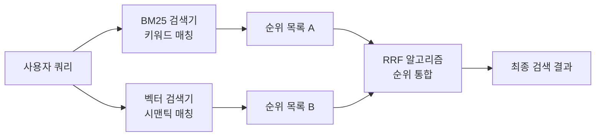
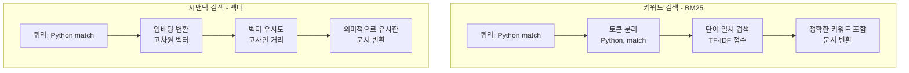
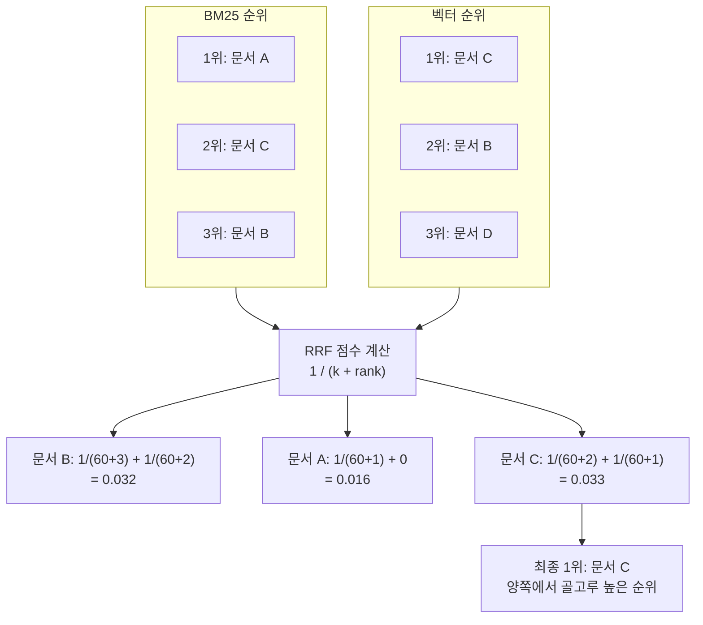
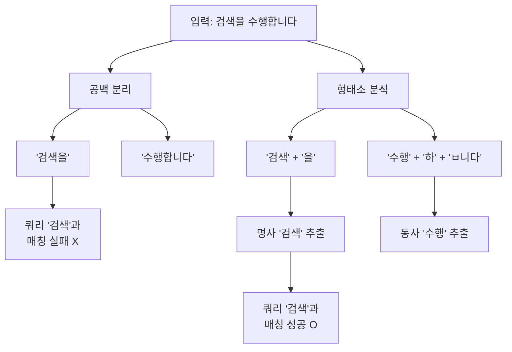

# 키워드와 앙상블 검색

> BM25 키워드 검색과 벡터 시맨틱 검색을 결합하여 검색 품질을 극대화하는 앙상블 전략을 학습합니다.

## 개요

이 섹션에서는 키워드 기반 검색의 대표 알고리즘인 BM25와, 이를 시맨틱 검색과 결합하는 EnsembleRetriever를 학습합니다. 두 검색 방식은 각각의 강점과 약점이 분명하기 때문에, 함께 사용하면 단독 사용보다 훨씬 뛰어난 검색 품질을 얻을 수 있습니다.

**선수 지식**: [검색기 기초](ch08/session_01.md)에서 배운 BaseRetriever 인터페이스, VectorStoreRetriever, similarity/MMR 검색 전략
**학습 목표**:
- BM25 알고리즘의 원리를 이해하고 BM25Retriever를 구성할 수 있다
- 키워드 검색과 시맨틱 검색의 차이를 설명하고 각각의 강점/약점을 구분할 수 있다
- EnsembleRetriever로 두 검색기를 결합하고, 가중치를 상황에 맞게 조절할 수 있다
- Reciprocal Rank Fusion(RRF) 알고리즘의 동작 원리를 이해할 수 있다
- 한국어 형태소 분석기를 BM25의 전처리 함수로 적용하여 검색 정확도를 높일 수 있다

## 왜 알아야 할까?

> 📊 **그림 1**: 하이브리드 검색의 전체 흐름 — 키워드와 시맨틱 검색을 결합하여 최종 결과를 생성




앞서 [검색기 기초](ch08/session_01.md)에서 벡터 유사도 기반 검색을 배웠는데요. 이 방식은 "의미적으로 비슷한" 문서를 잘 찾아주지만, 의외로 **정확한 키워드가 포함된 문서를 놓치는 경우**가 꽤 있습니다.

예를 들어볼까요? 사용자가 "Python 3.12 match 문법"이라고 검색했다고 해봅시다. 벡터 검색은 "패턴 매칭", "구조적 분기 처리" 같은 의미적으로 유사한 문서를 잘 가져오지만, 정확히 "Python 3.12"와 "match"라는 **키워드가 동시에 들어 있는** 문서를 놓칠 수 있습니다. 반대로 키워드 검색은 정확한 용어를 포함한 문서는 잘 찾지만, "구조적 패턴 매칭"처럼 **다른 표현으로 쓰인 문서**는 놓치죠.

특히 한국어의 경우 **조사와 어미 변화** 때문에 키워드 검색의 어려움이 더 큽니다. "검색한다", "검색하는", "검색을" 같은 표현이 기본 BM25에서는 모두 다른 토큰으로 취급되거든요. 이 문제를 해결하려면 **형태소 분석기**를 전처리에 활용해야 하는데, 이 역시 이 섹션에서 함께 다룹니다.

실제 프로덕션 RAG 시스템에서는 이 두 가지를 결합한 **하이브리드 검색(Hybrid Search)** 이 사실상 표준입니다. Elasticsearch, Pinecone, Weaviate 같은 벡터 DB들도 모두 하이브리드 검색을 핵심 기능으로 지원하고 있거든요.

## 핵심 개념

### 개념 1: BM25 — 키워드 검색의 왕

> 💡 **비유**: 도서관 사서가 책을 찾는 방법을 떠올려 보세요. "머신러닝 입문"이라는 요청을 받으면, 사서는 제목과 목차에서 "머신러닝"과 "입문"이라는 **단어가 직접 등장하는** 책을 찾습니다. 이때 "머신러닝"이 100권 중 3권에만 나온다면 그 단어가 더 중요하다고 판단하고, 한 권에서 10번 반복되면 관련성이 더 높다고 봅니다. BM25가 바로 이런 방식으로 작동합니다.

BM25(Best Matching 25)는 **키워드의 출현 빈도와 희소성**을 기반으로 문서의 관련성을 점수화하는 알고리즘입니다. 핵심 아이디어는 세 가지입니다:

1. **TF(Term Frequency)**: 검색어가 문서에 많이 등장할수록 관련성이 높다
2. **IDF(Inverse Document Frequency)**: 전체 문서에서 드물게 나타나는 단어일수록 더 중요하다
3. **문서 길이 정규화**: 긴 문서에서 단어가 많이 나오는 건 당연하므로, 문서 길이를 고려해 보정한다

BM25의 점수 공식은 다음과 같습니다:

$$\text{score}(D, Q) = \sum_{i=1}^{n} \text{IDF}(q_i) \cdot \frac{f(q_i, D) \cdot (k_1 + 1)}{f(q_i, D) + k_1 \cdot \left(1 - b + b \cdot \frac{|D|}{\text{avgdl}}\right)}$$

- $q_i$: 검색 쿼리의 i번째 단어
- $f(q_i, D)$: 문서 D에서 $q_i$가 등장하는 횟수
- $|D|$: 문서 D의 길이, $\text{avgdl}$: 전체 문서의 평균 길이
- $k_1$: TF 포화 파라미터 (보통 1.2~2.0, 값이 클수록 빈도 차이에 민감)
- $b$: 문서 길이 정규화 파라미터 (0~1, 보통 0.75)

")


이게 의미하는 바는, 검색어가 문서에 자주 나오되($f$ 높음), 다른 문서들에는 잘 안 나오는($\text{IDF}$ 높음) 단어일수록 높은 점수를 받는다는 것입니다.

LangChain에서는 `rank_bm25` 패키지를 래핑한 `BM25Retriever`를 제공합니다:

```python
from langchain_community.retrievers import BM25Retriever
from langchain_core.documents import Document

# 문서 준비
docs = [
    Document(page_content="LangChain은 LLM 기반 애플리케이션 개발 프레임워크입니다."),
    Document(page_content="벡터 데이터베이스는 임베딩을 저장하고 유사도 검색을 수행합니다."),
    Document(page_content="BM25는 키워드 기반의 전통적인 정보 검색 알고리즘입니다."),
    Document(page_content="RAG는 검색 증강 생성으로, 외부 지식을 활용하여 LLM 응답을 개선합니다."),
]

# BM25 검색기 생성
bm25_retriever = BM25Retriever.from_documents(docs)
bm25_retriever.k = 2  # 상위 2개 문서 반환

# 검색 실행
results = bm25_retriever.invoke("LLM 프레임워크")
for doc in results:
    print(doc.page_content)
# 출력:
# LangChain은 LLM 기반 애플리케이션 개발 프레임워크입니다.
# RAG는 검색 증강 생성으로, 외부 지식을 활용하여 LLM 응답을 개선합니다.
```

### 개념 2: 키워드 검색 vs 시맨틱 검색 — 서로 다른 눈

> 📊 **그림 2**: 키워드 검색과 시맨틱 검색의 동작 방식 비교




> 💡 **비유**: 키워드 검색은 **돋보기**와 같습니다. 정확히 그 단어가 적힌 곳을 샅샅이 찾아줍니다. 시맨틱 검색은 **독심술**과 같습니다. 단어가 달라도 "의미"가 통하면 찾아줍니다. 돋보기는 정확하지만 시야가 좁고, 독심술은 넓게 보지만 때로 엉뚱한 걸 가져옵니다. 둘 다 있으면 최고겠죠?

| 특성 | 키워드 검색 (BM25) | 시맨틱 검색 (벡터) |
|------|-------------------|------------------|
| **동작 원리** | 단어 일치 + 통계적 가중치 | 임베딩 벡터 간 거리 |
| **강점** | 고유명사, 약어, 코드명 정확 검색 | 동의어, 유사 표현, 다국어 검색 |
| **약점** | 동의어/유사 표현 인식 불가 | 정확한 키워드 매칭에 약함 |
| **연산 비용** | 매우 가벼움 (CPU만으로 충분) | 임베딩 생성 시 API/GPU 필요 |
| **적합한 쿼리** | "Python 3.12 match 문법" | "패턴 매칭 사용법" |
| **외부 의존성** | 없음 (rank_bm25 패키지) | 임베딩 모델 필요 |

이 차이를 코드로 확인해 봅시다:

```python
from langchain_community.retrievers import BM25Retriever
from langchain_openai import OpenAIEmbeddings
from langchain_community.vectorstores import FAISS
from langchain_core.documents import Document

# 테스트 문서
docs = [
    Document(page_content="Python의 match-case 문은 구조적 패턴 매칭을 지원합니다."),
    Document(page_content="switch문과 유사하지만 더 강력한 분기 처리가 가능합니다."),
    Document(page_content="패턴 매칭은 함수형 프로그래밍에서 유래한 개념입니다."),
    Document(page_content="Python 3.10부터 match 키워드가 도입되었습니다."),
]

query = "Python match 구문"

# 1) BM25 키워드 검색: "Python"과 "match" 단어가 포함된 문서 우선
bm25 = BM25Retriever.from_documents(docs, k=2)
bm25_results = bm25.invoke(query)
print("=== BM25 결과 ===")
for doc in bm25_results:
    print(f"  → {doc.page_content}")
# "Python"과 "match"가 직접 포함된 문서를 정확히 찾음

# 2) 시맨틱 검색: 의미적으로 유사한 문서 우선
vectorstore = FAISS.from_documents(docs, OpenAIEmbeddings())
semantic = vectorstore.as_retriever(search_kwargs={"k": 2})
semantic_results = semantic.invoke(query)
print("\n=== 시맨틱 결과 ===")
for doc in semantic_results:
    print(f"  → {doc.page_content}")
# "패턴 매칭", "분기 처리" 등 의미적으로 관련된 문서도 포함
```

### 개념 3: EnsembleRetriever — 두 세계의 장점을 합치다

> 💡 **비유**: 축구 팀을 꾸린다고 생각해 보세요. 수비수만 11명이면 실점은 적지만 골을 못 넣고, 공격수만 11명이면 골은 넣지만 수비가 뚫립니다. 최고의 팀은 수비와 공격을 **적절히 섞는** 것이죠. EnsembleRetriever가 바로 이 감독 역할을 합니다 — 키워드 검색(수비)과 시맨틱 검색(공격)을 적절한 비율로 조합해서 최강의 검색 라인업을 만듭니다.

`EnsembleRetriever`는 여러 검색기의 결과를 **Reciprocal Rank Fusion(RRF)** 알고리즘으로 통합합니다. 각 검색기가 독립적으로 문서를 가져오고, 그 순위를 종합하여 최종 순위를 결정하는 방식이거든요.

```python
from langchain.retrievers import EnsembleRetriever
from langchain_community.retrievers import BM25Retriever
from langchain_openai import OpenAIEmbeddings
from langchain_community.vectorstores import FAISS
from langchain_core.documents import Document

# 문서 준비
docs = [
    Document(page_content="LCEL은 LangChain Expression Language의 약자입니다.",
             metadata={"source": "glossary"}),
    Document(page_content="체인을 선언적으로 구성하는 파이프 연산자를 사용합니다.",
             metadata={"source": "tutorial"}),
    Document(page_content="LCEL을 사용하면 스트리밍과 배치 처리가 자동 지원됩니다.",
             metadata={"source": "docs"}),
    Document(page_content="Runnable 인터페이스는 invoke, stream, batch 메서드를 제공합니다.",
             metadata={"source": "api-ref"}),
]

# 검색기 1: BM25 키워드 검색
bm25_retriever = BM25Retriever.from_documents(docs, k=3)

# 검색기 2: 벡터 시맨틱 검색
vectorstore = FAISS.from_documents(docs, OpenAIEmbeddings())
vector_retriever = vectorstore.as_retriever(search_kwargs={"k": 3})

# 앙상블 검색기 생성 (BM25 40% + 벡터 60%)
ensemble_retriever = EnsembleRetriever(
    retrievers=[bm25_retriever, vector_retriever],
    weights=[0.4, 0.6],  # 가중치 합이 1.0
)

# 검색 실행
results = ensemble_retriever.invoke("LCEL 파이프 연산자")
for doc in results:
    print(f"[{doc.metadata.get('source', 'N/A')}] {doc.page_content}")
```

### 개념 4: Reciprocal Rank Fusion(RRF) — 순위를 합치는 마법

> 💡 **비유**: 노래 대회 심사를 떠올려 보세요. 심사위원 A가 뽑은 1등과 심사위원 B가 뽑은 1등이 다릅니다. 그런데 한 참가자가 A에서는 2등, B에서는 3등이었다면? 개별 1등보다 **종합 순위**에서는 이 참가자가 더 높을 수 있습니다. RRF가 바로 이 종합 순위를 계산하는 방식입니다.

RRF의 점수 공식은 놀랍도록 간단합니다:

> 📊 **그림 3**: RRF 점수 계산 과정 — 두 검색기의 순위를 통합하여 최종 순위 결정




$$\text{RRF}(d) = \sum_{r \in R} \frac{1}{k + r(d)}$$

- $d$: 문서
- $R$: 모든 검색기의 순위 목록
- $r(d)$: 검색기 r에서 문서 d의 순위 (1부터 시작)
- $k$: 상수 (기본값 60, 상위 순위의 영향력을 조절)

예를 들어 문서 A가 BM25에서 1등, 벡터 검색에서 5등이면:

$$\text{RRF}(A) = \frac{1}{60 + 1} + \frac{1}{60 + 5} = 0.01639 + 0.01538 = 0.03177$$

문서 B가 BM25에서 3등, 벡터 검색에서 2등이면:

$$\text{RRF}(B) = \frac{1}{60 + 3} + \frac{1}{60 + 2} = 0.01587 + 0.01613 = 0.03200$$

문서 B의 RRF 점수(0.032)가 A(0.0318)보다 높으므로, **두 검색기에서 골고루 높은 순위를 받은 B가 최종 1등**이 됩니다. 이렇게 RRF는 한쪽에서만 높은 것보다 **여러 검색기에서 안정적으로 좋은 순위를 받은 문서**를 우대합니다.

EnsembleRetriever에서 `c` 파라미터로 이 상수 k를 조절할 수 있습니다:

```python
# c값이 낮으면 상위 순위에 더 큰 가중치
ensemble_strict = EnsembleRetriever(
    retrievers=[bm25_retriever, vector_retriever],
    weights=[0.5, 0.5],
    c=20,  # 상위 결과에 더 집중 (기본값: 60)
)

# c값이 높으면 순위 간 차이가 완만해짐
ensemble_smooth = EnsembleRetriever(
    retrievers=[bm25_retriever, vector_retriever],
    weights=[0.5, 0.5],
    c=100,  # 순위 간 차이를 부드럽게
)
```

### 개념 5: 가중치 조절 전략

가중치를 어떻게 설정하느냐에 따라 검색 특성이 크게 달라집니다. 정답은 없지만, 도메인에 따른 가이드라인이 있습니다:

| 시나리오 | BM25 가중치 | 벡터 가중치 | 이유 |
|---------|-----------|-----------|------|
| 기술 문서 / API 레퍼런스 | 0.6 | 0.4 | 정확한 함수명, 클래스명 매칭 중요 |
| 일반 Q&A / 고객 상담 | 0.3 | 0.7 | 다양한 표현으로 같은 질문을 함 |
| 법률 / 의료 문서 | 0.5 | 0.5 | 정확한 용어 + 맥락 이해 모두 중요 |
| 코드 검색 | 0.7 | 0.3 | 변수명, 함수명 등 키워드 정확도 중요 |
| 다국어 콘텐츠 | 0.2 | 0.8 | 임베딩이 언어 간 의미 매핑에 강함 |

```python
# 시나리오별 앙상블 검색기 팩토리 함수
def create_ensemble(
    docs: list[Document],
    embeddings,
    bm25_weight: float = 0.4,
    vector_weight: float = 0.6,
    k: int = 4,
) -> EnsembleRetriever:
    """상황에 맞는 앙상블 검색기를 생성합니다.

    Args:
        docs: 검색 대상 문서 리스트
        embeddings: 임베딩 모델
        bm25_weight: BM25 검색기 가중치 (기본 0.4)
        vector_weight: 벡터 검색기 가중치 (기본 0.6)
        k: 반환할 문서 수

    Returns:
        설정된 가중치의 앙상블 검색기
    """
    # BM25 검색기
    bm25 = BM25Retriever.from_documents(docs, k=k)

    # 벡터 검색기
    vectorstore = FAISS.from_documents(docs, embeddings)
    vector = vectorstore.as_retriever(search_kwargs={"k": k})

    return EnsembleRetriever(
        retrievers=[bm25, vector],
        weights=[bm25_weight, vector_weight],
    )
```

### 개념 6: 한국어 BM25와 형태소 분석 — 교착어의 벽을 넘다

> 📊 **그림 4**: 한국어 BM25 토큰화 파이프라인 — 공백 분리 vs 형태소 분석




> 💡 **비유**: 영어에서 "search"를 찾으면 "search", "searches" 정도만 구별하면 됩니다. 하지만 한국어에서 "검색"을 찾으려면? "검색은", "검색을", "검색하다", "검색하는", "검색했던", "검색이" — 조사와 어미가 붙어서 형태가 수십 가지로 변합니다. 기본 BM25는 공백으로만 단어를 자르기 때문에 이 변형들을 모두 다른 단어로 취급합니다. **형태소 분석기**는 이 단어들에서 "검색"이라는 공통 어근을 추출해 주는 도구입니다.

한국어는 **교착어(膠着語)** 로서, 어간에 조사·어미가 결합하여 단어의 형태가 크게 변합니다. 기본 BM25의 공백 기반 토큰화로는 이런 변화를 처리할 수 없어서, 한국어 문서에서는 검색 정확도가 크게 떨어집니다.

이 문제를 해결하는 두 가지 대표적인 한국어 형태소 분석기가 있습니다:

| 특성 | KoNLPy (Okt) | Kiwipiepy |
|------|-------------|-----------|
| **설치** | `pip install konlpy` (Java 필요) | `pip install kiwipiepy` (순수 C++) |
| **외부 의존성** | JDK 설치 필요 | 없음 |
| **속도** | 보통 | 빠름 |
| **특징** | 다양한 분석기 선택 가능 (Okt, Komoran 등) | 경량, 서버 환경에 유리 |

BM25Retriever의 `preprocess_func` 파라미터에 형태소 분석 함수를 전달하면, 토큰화 단계에서 자동으로 적용됩니다:

```python
from langchain_community.retrievers import BM25Retriever
from langchain_core.documents import Document

# ── 방법 1: KoNLPy (Okt) 사용 ────────────────────────
# 필요 패키지: pip install konlpy rank-bm25
from konlpy.tag import Okt

okt = Okt()

def okt_tokenizer(text: str) -> list[str]:
    """Okt로 명사, 동사, 형용사만 추출합니다."""
    return [word for word, pos in okt.pos(text)
            if pos in ("Noun", "Verb", "Adjective")]

# ── 방법 2: Kiwipiepy 사용 ────────────────────────────
# 필요 패키지: pip install kiwipiepy rank-bm25
from kiwipiepy import Kiwi

kiwi = Kiwi()

def kiwi_tokenizer(text: str) -> list[str]:
    """Kiwi로 명사(NNG, NNP), 동사(VV), 형용사(VA)의 형태소를 추출합니다."""
    tokens = kiwi.tokenize(text)
    return [t.form for t in tokens
            if t.tag in ("NNG", "NNP", "VV", "VA")]

# ── 토큰화 결과 비교 ──────────────────────────────────
sample = "벡터 데이터베이스는 임베딩을 저장하고 유사도 검색을 수행합니다."

print("공백 분리:", sample.split())
# → ['벡터', '데이터베이스는', '임베딩을', '저장하고', '유사도', '검색을', '수행합니다.']

print("Okt 형태소:", okt_tokenizer(sample))
# → ['벡터', '데이터베이스', '임베딩', '저장', '유사', '도', '검색', '수행']

print("Kiwi 형태소:", kiwi_tokenizer(sample))
# → ['벡터', '데이터베이스', '임베딩', '저장', '유사도', '검색', '수행']
```

공백 분리에서는 "데이터베이스**는**", "임베딩**을**", "검색**을**"처럼 조사가 붙어 있어서 "데이터베이스", "임베딩", "검색" 같은 쿼리와 매칭되지 않습니다. 형태소 분석기를 사용하면 어근만 추출되어 정확한 매칭이 가능해집니다.

## 실습: 직접 해보기

기술 문서 검색 시나리오에서 BM25, 벡터 검색, 앙상블 검색의 결과를 비교해 봅시다.

```python
"""
Session 8.2 실습: 키워드와 앙상블 검색 비교
- BM25Retriever, VectorStoreRetriever, EnsembleRetriever를 비교합니다.
- 필요 패키지: pip install langchain langchain-openai langchain-community faiss-cpu rank-bm25
"""
import os
from dotenv import load_dotenv
from langchain_core.documents import Document
from langchain_community.retrievers import BM25Retriever
from langchain_openai import OpenAIEmbeddings
from langchain_community.vectorstores import FAISS
from langchain.retrievers import EnsembleRetriever

load_dotenv()

# ── 1. 테스트 문서 준비 ──────────────────────────────────
tech_docs = [
    Document(
        page_content="ChatOpenAI 클래스는 OpenAI의 채팅 모델을 래핑합니다. "
                     "temperature, model_name 등의 파라미터를 설정할 수 있습니다.",
        metadata={"source": "api-ref", "topic": "model"},
    ),
    Document(
        page_content="대화형 AI 모델을 사용할 때는 적절한 온도 설정이 중요합니다. "
                     "창의적인 응답에는 높은 temperature를, 정확한 답변에는 낮은 값을 사용하세요.",
        metadata={"source": "best-practice", "topic": "model"},
    ),
    Document(
        page_content="ChatPromptTemplate.from_messages()를 사용하면 "
                     "시스템 메시지와 사용자 메시지를 구조화할 수 있습니다.",
        metadata={"source": "tutorial", "topic": "prompt"},
    ),
    Document(
        page_content="프롬프트 설계 시 역할 지정과 맥락 제공이 핵심입니다. "
                     "명확한 지시사항은 모델의 출력 품질을 크게 향상시킵니다.",
        metadata={"source": "guide", "topic": "prompt"},
    ),
    Document(
        page_content="LCEL 파이프 연산자(|)를 사용하면 프롬프트, 모델, 파서를 "
                     "하나의 체인으로 간결하게 연결할 수 있습니다.",
        metadata={"source": "docs", "topic": "lcel"},
    ),
    Document(
        page_content="RunnablePassthrough는 입력을 그대로 전달하는 유틸리티로, "
                     "체인 내에서 데이터 흐름을 제어할 때 유용합니다.",
        metadata={"source": "api-ref", "topic": "lcel"},
    ),
    Document(
        page_content="StrOutputParser는 모델 출력에서 문자열만 추출합니다. "
                     "AIMessage 객체 대신 순수 텍스트가 필요할 때 사용합니다.",
        metadata={"source": "api-ref", "topic": "parser"},
    ),
    Document(
        page_content="출력 파싱은 LLM 응답을 구조화된 데이터로 변환하는 과정입니다. "
                     "JSON, Pydantic 모델, 리스트 등 다양한 형식을 지원합니다.",
        metadata={"source": "tutorial", "topic": "parser"},
    ),
]

# ── 2. 검색기 생성 ──────────────────────────────────────
# BM25 키워드 검색기
bm25_retriever = BM25Retriever.from_documents(tech_docs, k=3)

# 벡터 시맨틱 검색기
embeddings = OpenAIEmbeddings()
vectorstore = FAISS.from_documents(tech_docs, embeddings)
vector_retriever = vectorstore.as_retriever(search_kwargs={"k": 3})

# 앙상블 검색기 (BM25 40% + 벡터 60%)
ensemble_retriever = EnsembleRetriever(
    retrievers=[bm25_retriever, vector_retriever],
    weights=[0.4, 0.6],
)

# ── 3. 검색 비교 ────────────────────────────────────────
queries = [
    "ChatOpenAI temperature 설정",     # 키워드가 명확한 쿼리
    "모델 응답의 창의성을 조절하는 방법",  # 의미 기반 쿼리
    "LCEL 체인 연결",                   # 혼합형 쿼리
]

for query in queries:
    print(f"\n{'='*60}")
    print(f"쿼리: {query}")
    print('='*60)

    # BM25 결과
    bm25_results = bm25_retriever.invoke(query)
    print("\n📌 BM25 (키워드 검색):")
    for i, doc in enumerate(bm25_results, 1):
        print(f"  {i}. [{doc.metadata['source']}] {doc.page_content[:60]}...")

    # 벡터 검색 결과
    vector_results = vector_retriever.invoke(query)
    print("\n🔮 벡터 (시맨틱 검색):")
    for i, doc in enumerate(vector_results, 1):
        print(f"  {i}. [{doc.metadata['source']}] {doc.page_content[:60]}...")

    # 앙상블 결과
    ensemble_results = ensemble_retriever.invoke(query)
    print("\n🎯 앙상블 (하이브리드 검색):")
    for i, doc in enumerate(ensemble_results, 1):
        print(f"  {i}. [{doc.metadata['source']}] {doc.page_content[:60]}...")

# ── 4. 가중치 실험 ──────────────────────────────────────
print(f"\n\n{'='*60}")
print("가중치 실험: 'ChatOpenAI 클래스 사용법'")
print('='*60)

test_query = "ChatOpenAI 클래스 사용법"

for bm25_w, vec_w in [(0.8, 0.2), (0.5, 0.5), (0.2, 0.8)]:
    ens = EnsembleRetriever(
        retrievers=[bm25_retriever, vector_retriever],
        weights=[bm25_w, vec_w],
    )
    results = ens.invoke(test_query)
    print(f"\n⚖️  BM25={bm25_w} / 벡터={vec_w}:")
    for i, doc in enumerate(results, 1):
        print(f"  {i}. [{doc.metadata['source']}] {doc.page_content[:50]}...")

# ── 5. 한국어 형태소 분석기 적용 ────────────────────────
# 필요 패키지: pip install kiwipiepy  (또는 konlpy)
print(f"\n\n{'='*60}")
print("한국어 형태소 분석기 BM25 비교")
print('='*60)

from kiwipiepy import Kiwi

kiwi = Kiwi()

def kiwi_tokenizer(text: str) -> list[str]:
    """Kiwi 형태소 분석기로 명사·동사·형용사를 추출합니다."""
    return [t.form for t in kiwi.tokenize(text)
            if t.tag in ("NNG", "NNP", "VV", "VA")]

# 기본 BM25 (공백 기준 분리)
default_bm25 = BM25Retriever.from_documents(tech_docs, k=3)

# 형태소 분석 BM25 (Kiwi 전처리)
korean_bm25 = BM25Retriever.from_documents(
    tech_docs, k=3, preprocess_func=kiwi_tokenizer
)

# 한국어 자연어 쿼리로 비교
ko_queries = [
    "모델의 파라미터를 설정하는 방법",    # 조사 포함
    "출력을 파싱하여 구조화하기",        # 어미 변형
    "체인에서 데이터를 전달하는 유틸리티",  # 복합 표현
]

for query in ko_queries:
    print(f"\n쿼리: {query}")
    print("-" * 50)

    default_results = default_bm25.invoke(query)
    korean_results = korean_bm25.invoke(query)

    print("  기본 BM25 상위 1:")
    print(f"    → {default_results[0].page_content[:60]}...")
    print("  형태소 BM25 상위 1:")
    print(f"    → {korean_results[0].page_content[:60]}...")
    # 형태소 분석기를 사용하면 "설정하는" → "설정", "파싱하여" → "파싱" 등
    # 어근 기준으로 매칭되어 한국어 검색 정확도가 크게 향상됩니다.

# ── 6. 형태소 분석 + 앙상블 조합 ────────────────────────
print(f"\n\n{'='*60}")
print("형태소 분석 BM25 + 벡터 앙상블")
print('='*60)

# 형태소 분석 BM25를 앙상블에 적용
korean_ensemble = EnsembleRetriever(
    retrievers=[korean_bm25, vector_retriever],
    weights=[0.4, 0.6],
)

query = "모델 응답의 온도를 조절하는 설정"
print(f"\n쿼리: {query}")

print("\n📌 기본 BM25 앙상블:")
for i, doc in enumerate(ensemble_retriever.invoke(query), 1):
    print(f"  {i}. [{doc.metadata['source']}] {doc.page_content[:55]}...")

print("\n🎯 형태소 BM25 앙상블:")
for i, doc in enumerate(korean_ensemble.invoke(query), 1):
    print(f"  {i}. [{doc.metadata['source']}] {doc.page_content[:55]}...")
# 형태소 분석 BM25를 사용한 앙상블이 한국어 쿼리에서 더 정확한 결과를 반환합니다.
```

### BM25 전처리 함수 커스터마이징

한국어 문서에서 BM25 성능을 높이려면 형태소 분석기를 전처리 함수로 활용할 수 있습니다. 여기서는 KoNLPy와 Kiwipiepy 두 가지 방법을 모두 살펴봅니다:

```python
"""
한국어 형태소 분석을 활용한 BM25 전처리 예제
- KoNLPy 사용 시: pip install konlpy rank-bm25 (JDK 필요)
- Kiwipiepy 사용 시: pip install kiwipiepy rank-bm25 (외부 의존성 없음)
"""
from langchain_community.retrievers import BM25Retriever
from langchain_core.documents import Document

# ── 방법 1: KoNLPy (Okt) ─────────────────────────────
from konlpy.tag import Okt

okt = Okt()

def okt_tokenizer(text: str) -> list[str]:
    """한국어 텍스트를 Okt 형태소 분석기로 분리합니다.

    명사, 동사, 형용사만 추출하여 검색 정확도를 높입니다.
    """
    # 명사, 동사, 형용사만 추출 (조사, 어미 제외)
    tokens = okt.pos(text)
    return [word for word, pos in tokens if pos in ("Noun", "Verb", "Adjective")]

# ── 방법 2: Kiwipiepy ────────────────────────────────
from kiwipiepy import Kiwi

kiwi = Kiwi()

def kiwi_tokenizer(text: str) -> list[str]:
    """한국어 텍스트를 Kiwi 형태소 분석기로 분리합니다.

    일반명사(NNG), 고유명사(NNP), 동사(VV), 형용사(VA)만 추출합니다.
    Java 없이 설치 가능하여 서버 환경에 유리합니다.
    """
    tokens = kiwi.tokenize(text)
    return [t.form for t in tokens if t.tag in ("NNG", "NNP", "VV", "VA")]

# ── 비교 실험 ─────────────────────────────────────────
docs = [
    Document(page_content="자연어 처리는 컴퓨터가 인간의 언어를 이해하는 기술입니다."),
    Document(page_content="기계 번역은 한 언어를 다른 언어로 자동 변환합니다."),
    Document(page_content="감정 분석은 텍스트에서 긍정/부정 감정을 판별합니다."),
]

# 기본 BM25 (공백 기준 분리)
default_bm25 = BM25Retriever.from_documents(docs, k=2)

# KoNLPy 형태소 분석 BM25
okt_bm25 = BM25Retriever.from_documents(
    docs, k=2, preprocess_func=okt_tokenizer,
)

# Kiwipiepy 형태소 분석 BM25
kiwi_bm25 = BM25Retriever.from_documents(
    docs, k=2, preprocess_func=kiwi_tokenizer,
)

query = "언어를 이해하는 방법"
print("기본 BM25:", [d.page_content[:30] for d in default_bm25.invoke(query)])
print("Okt BM25: ", [d.page_content[:30] for d in okt_bm25.invoke(query)])
print("Kiwi BM25:", [d.page_content[:30] for d in kiwi_bm25.invoke(query)])
# 형태소 분석을 사용하면 "이해하다" → "이해", "언어를" → "언어" 등
# 어근 매칭이 가능해져 한국어 검색 정확도가 크게 향상됩니다.

# ── 실무 팁: 불용어 제거 추가 ──────────────────────────
def kiwi_tokenizer_with_stopwords(text: str) -> list[str]:
    """형태소 분석 + 불용어 제거를 함께 수행합니다."""
    stopwords = {"하다", "되다", "있다", "없다", "이다", "것", "수", "등"}
    tokens = kiwi.tokenize(text)
    return [t.form for t in tokens
            if t.tag in ("NNG", "NNP", "VV", "VA") and t.form not in stopwords]
```

## 더 깊이 알아보기

### BM25의 탄생 — 런던에서 시작된 검색 혁명

BM25의 "BM"은 **Best Matching**의 약자입니다. 1990년대 초, 영국 런던 시티대학교(City University)에서 개발된 **Okapi 정보 검색 시스템**에서 처음 사용되었는데요, "Okapi"는 아프리카의 희귀 동물 오카피에서 이름을 따왔습니다. 연구팀이 BM1, BM2, ... 순서대로 다양한 랭킹 공식을 실험하다가 **25번째 공식**이 가장 좋은 성능을 보여서 BM25라는 이름이 붙었습니다.

핵심 개발자인 **스티븐 로버트슨(Stephen Robertson)** 과 **캐런 스파크 존스(Karen Spärck Jones)** 는 확률론적 정보 검색 이론의 창시자들입니다. 특히 스파크 존스는 IDF(역문서 빈도) 개념을 1972년에 처음 제안한 인물이기도 합니다. 로버트슨은 이 공로로 정보 검색 분야 최고 영예인 **ACM 제라드 솔턴 상(Gerard Salton Award)** 을 2000년에 수상했습니다.

놀라운 점은, 30년이 넘은 이 알고리즘이 딥러닝 시대에도 여전히 강력하다는 것입니다. 2023년의 한 벤치마크에서 BM25는 일부 신경망 기반 검색기와 대등하거나 더 나은 성능을 보이기도 했습니다.

### RRF — SIGIR 2009에서 발표된 우아한 해법

**Reciprocal Rank Fusion**은 2009년 워터루 대학교의 **Gordon Cormack, Charles Clarke, Stefan Buettcher**가 ACM SIGIR 학회에서 발표한 알고리즘입니다. 논문 제목은 "Reciprocal Rank Fusion outperforms Condorcet and individual rank learning methods"인데, 말 그대로 당시 주류였던 Condorcet 방식과 개별 학습 기반 방식을 모두 능가했다는 뜻입니다.

RRF의 매력은 **극단적인 단순함**에 있습니다. 학습이 필요 없고(unsupervised), 하이퍼파라미터 튜닝도 거의 불필요하며, 서로 전혀 다른 종류의 검색 점수를 결합할 수 있습니다. 이 특성 덕분에 Elasticsearch, MongoDB Atlas Search 등 주요 검색 엔진들이 하이브리드 검색의 기본 결합 알고리즘으로 RRF를 채택했습니다.

## 흔한 오해와 팁

> ⚠️ **흔한 오해**: "BM25는 구식이니까 벡터 검색만 쓰면 된다" — 이는 가장 흔한 실수입니다. 벡터 검색은 의미적 유사성에 강하지만, 고유명사(예: "GPT-4o"), 에러 코드(예: "CUDA_ERROR_OUT_OF_MEMORY"), API 이름(예: "from_documents") 같은 **정확한 키워드 매칭**에서는 BM25가 압도적으로 우수합니다. 프로덕션 RAG 시스템에서 하이브리드 검색이 표준인 이유가 바로 이것입니다.

> ⚠️ **흔한 오해**: "한국어에서 기본 BM25만 써도 충분하다" — 한국어는 교착어 특성상 공백 기반 토큰화만으로는 검색 품질이 크게 떨어집니다. "검색을", "검색하는", "검색했던"이 모두 다른 토큰으로 처리되기 때문입니다. 한국어 RAG 시스템에서는 반드시 `preprocess_func`에 형태소 분석기(Kiwi, Okt 등)를 적용하세요. 특히 서버 환경에서는 Java 의존성이 없는 **Kiwipiepy**가 설치와 운영 면에서 유리합니다.

> 💡 **알고 계셨나요?**: LangChain의 `BM25Retriever`는 **인메모리**로만 동작합니다. 문서가 수만 건을 넘으면 Elasticsearch나 OpenSearch 같은 전용 검색 엔진의 BM25를 사용하는 것이 좋습니다. `ElasticsearchRetriever`와 `EnsembleRetriever`를 조합하면 대규모 데이터에서도 하이브리드 검색을 구현할 수 있습니다.

> 🔥 **실무 팁**: 가중치 최적화는 **평가 데이터셋**으로 실험하세요. 쿼리-정답 쌍을 20~50개만 만들어 놓으면, 다양한 가중치 조합의 Recall@k를 비교하여 도메인에 최적인 비율을 찾을 수 있습니다. 처음에는 BM25=0.4, 벡터=0.6으로 시작하고, 키워드 정확도가 중요한 도메인이라면 BM25 비율을 높이세요.

> 🔥 **실무 팁**: `EnsembleRetriever`에서 중복 문서가 반환될 수 있습니다. 두 검색기가 같은 문서를 가져올 경우 `id_key` 파라미터로 문서의 고유 식별자 필드를 지정하면 중복이 자동 제거됩니다. `metadata`에 고유 ID를 포함시키는 습관을 들이세요.

## 핵심 정리

| 개념 | 설명 |
|------|------|
| BM25 | 키워드 출현 빈도(TF)와 희소성(IDF)을 기반으로 문서 관련성을 점수화하는 전통적 검색 알고리즘 |
| BM25Retriever | LangChain에서 `rank_bm25` 패키지를 래핑한 인메모리 키워드 검색기 |
| 키워드 vs 시맨틱 | 키워드 검색은 정확한 단어 매칭에 강하고, 시맨틱 검색은 의미적 유사성에 강함 |
| EnsembleRetriever | 여러 검색기의 결과를 RRF 알고리즘으로 결합하는 LangChain 검색기 |
| RRF | Reciprocal Rank Fusion — 순위의 역수를 합산하여 여러 검색 결과를 통합하는 알고리즘 |
| weights | 각 검색기의 상대적 중요도를 조절하는 가중치 (합이 1.0) |
| preprocess_func | BM25 토큰화 전에 텍스트를 전처리하는 함수 (형태소 분석기 등 활용 가능) |
| 한국어 형태소 분석 | KoNLPy(Okt)나 Kiwipiepy로 조사·어미를 제거하여 한국어 BM25 검색 정확도를 높이는 전처리 |
| c 파라미터 | RRF에서 상위 순위의 영향력을 조절하는 상수 (기본값 60) |

## 다음 섹션 미리보기

키워드와 벡터 검색의 결합으로 검색 품질을 높이는 방법을 배웠습니다. 하지만 검색된 문서가 너무 길거나, 쿼리와 무관한 부분이 많이 포함되어 있다면 어떻게 할까요? 다음 섹션 **컨텍스트 압축과 재순위화**에서는 검색 결과를 LLM이나 임베딩 모델로 **압축·필터링**하여, 정말 필요한 정보만 추출하는 `ContextualCompressionRetriever`를 학습합니다.

## 참고 자료

- [LangChain BM25Retriever 공식 문서](https://python.langchain.com/api_reference/community/retrievers/langchain_community.retrievers.bm25.BM25Retriever.html) - BM25Retriever의 API 레퍼런스와 사용법
- [LangChain EnsembleRetriever 공식 문서](https://python.langchain.com/api_reference/langchain/retrievers/langchain.retrievers.ensemble.EnsembleRetriever.html) - EnsembleRetriever의 파라미터와 RRF 설정
- [LangChain BM25 통합 가이드](https://docs.langchain.com/oss/python/integrations/retrievers/bm25) - BM25 설치와 통합 예제
- [Kiwipiepy GitHub](https://github.com/bab2min/kiwipiepy) - 경량 한국어 형태소 분석기, C++ 기반으로 Java 의존성 없음
- [KoNLPy 공식 문서](https://konlpy.org/) - 한국어 자연어 처리 패키지, 다양한 형태소 분석기 지원
- [Okapi BM25 - Wikipedia](https://en.wikipedia.org/wiki/Okapi_BM25) - BM25 알고리즘의 역사, 수학적 배경, 변형 알고리즘 설명
- [Reciprocal Rank Fusion 원본 논문 (Cormack et al., SIGIR 2009)](https://dl.acm.org/doi/10.1145/1571941.1572114) - RRF 알고리즘의 원본 학술 논문

---
### 🔗 Related Sessions
- [baseretriever](../08-검색기retriever-심화/01-검색기-기초.md) (prerequisite)
- [vectorstoreretriever](../08-검색기retriever-심화/01-검색기-기초.md) (prerequisite)
- [search_type](../08-검색기retriever-심화/01-검색기-기초.md) (prerequisite)
- [search_kwargs](../08-검색기retriever-심화/01-검색기-기초.md) (prerequisite)
- [mmr](../07-임베딩과-벡터-스토어/05-벡터-검색-최적화.md) (prerequisite)
