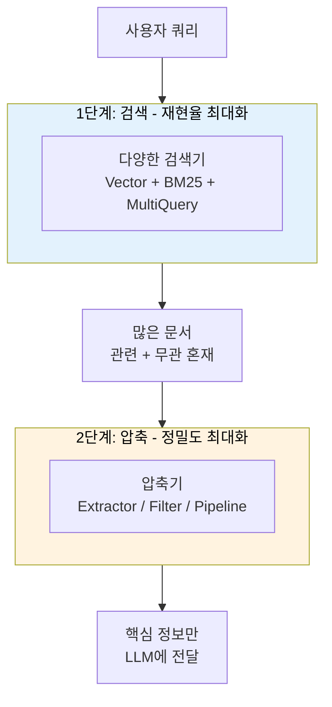
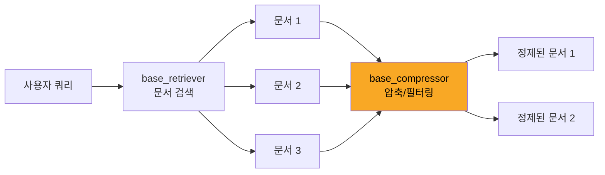
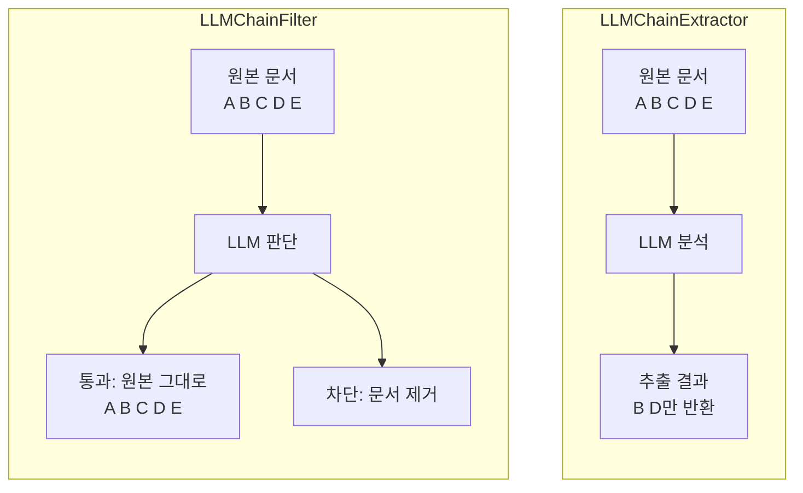
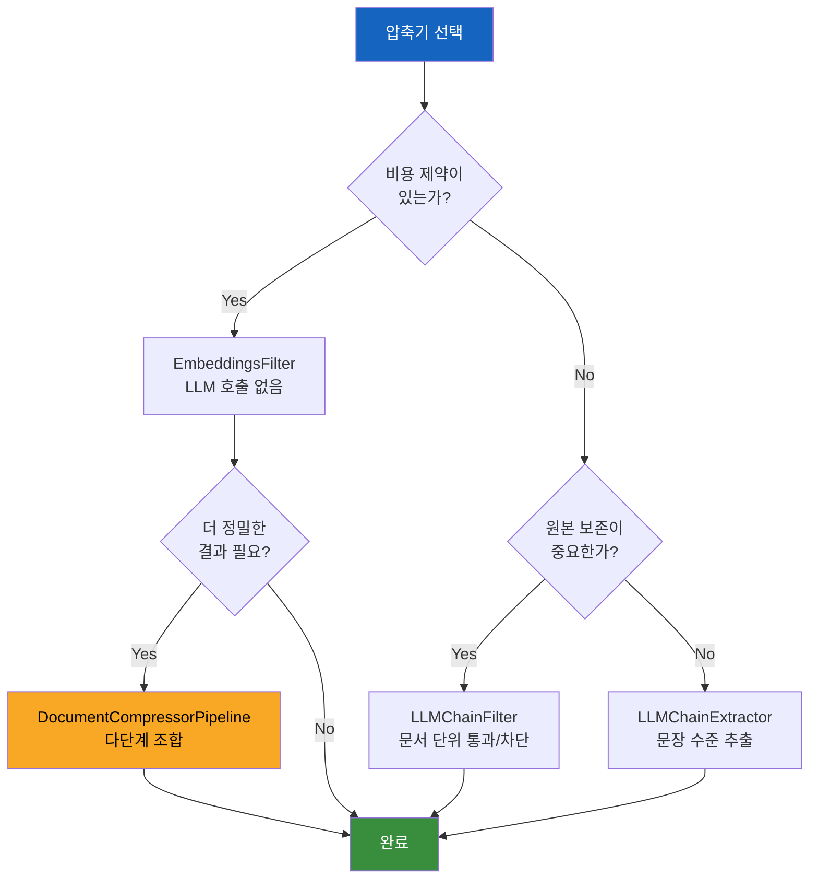

# 컨텍스트 압축

> 검색 결과에서 쿼리와 관련된 핵심 정보만 추출하여 LLM에 전달하는 고급 검색 최적화 기법

## 개요

이 섹션에서는 LangChain의 **ContextualCompressionRetriever**를 중심으로, 검색된 문서에서 불필요한 정보를 걸러내고 핵심만 추출하는 컨텍스트 압축 기법을 학습합니다. LLM 기반 추출기, 임베딩 필터, 그리고 이들을 조합하는 압축 파이프라인까지 단계적으로 다룹니다.

**선수 지식**: [8.1 검색기 기초](ch08/session_01.md)에서 배운 VectorStoreRetriever와 search_type, [8.2 키워드와 앙상블 검색](ch08/session_02.md)에서 배운 EnsembleRetriever, [8.3 멀티쿼리와 RAG Fusion](ch08/session_03.md)에서 배운 검색 다양성 향상 기법

**학습 목표**:
- ContextualCompressionRetriever의 작동 원리와 구조를 이해할 수 있다
- LLMChainExtractor와 LLMChainFilter를 사용하여 LLM 기반 문서 압축을 구현할 수 있다
- EmbeddingsFilter를 활용한 비용 효율적인 필터링을 구현할 수 있다
- DocumentCompressorPipeline으로 여러 압축기를 조합한 고급 파이프라인을 구축할 수 있다

## 왜 알아야 할까?

앞선 세션들에서 우리는 검색의 **재현율(Recall)**을 높이는 데 집중했습니다. VectorStoreRetriever로 유사한 문서를 찾고, EnsembleRetriever로 키워드와 시맨틱 검색을 결합하고, MultiQueryRetriever로 쿼리를 확장했죠. 그런데 한 가지 문제가 남아 있습니다.

"많이 찾아오는 건 좋은데, 찾아온 문서가 전부 쓸모 있는 건 아니잖아요?"

실제로 검색된 문서 하나가 1,000토큰인데, 쿼리와 관련된 내용은 고작 100토큰에 불과한 경우가 비일비재합니다. 나머지 900토큰은 LLM의 소중한 컨텍스트 윈도우를 차지하면서 오히려 답변 품질을 떨어뜨릴 수 있거든요. 더 심각한 건, 관련 없는 정보가 LLM을 "혼란"에 빠뜨려 엉뚱한 답변을 생성할 수도 있다는 점입니다.

컨텍스트 압축은 이 문제를 해결합니다. **검색 단계에서는 재현율을 최대화하고, 압축 단계에서는 정밀도(Precision)를 최대화하는** 2단계 전략이죠. 이 패턴은 프로덕션 RAG 시스템에서 응답 품질과 비용 효율을 동시에 잡는 핵심 기법입니다.

> 📊 **그림 4**: 2단계 전략 — 재현율과 정밀도의 분리




## 핵심 개념

### 개념 1: ContextualCompressionRetriever — 압축 검색기의 구조

> 💡 **비유**: 도서관에서 책을 빌려오는 상황을 생각해보세요. 일반 검색기는 "관련 책 5권"을 통째로 가져옵니다. 하지만 컨텍스트 압축 검색기는 사서(Compressor)가 각 책에서 **질문과 관련된 페이지만 복사**해서 건네주는 것과 같습니다. 책 전체가 아니라 필요한 부분만 받으니 훨씬 효율적이죠.

ContextualCompressionRetriever는 두 가지 핵심 컴포넌트로 구성됩니다:

1. **base_retriever**: 기존 검색기 (VectorStoreRetriever, EnsembleRetriever 등 어떤 검색기든 가능)
2. **base_compressor**: 검색 결과를 압축하는 DocumentCompressor

작동 흐름은 명확합니다:

> 📊 **그림 1**: ContextualCompressionRetriever의 작동 흐름




```
사용자 쿼리 → base_retriever로 문서 검색 → base_compressor로 압축/필터링 → 정제된 결과 반환
```

```python
from langchain.retrievers import ContextualCompressionRetriever

# base_retriever: 어떤 검색기든 사용 가능
# base_compressor: 다양한 압축기 중 선택
compression_retriever = ContextualCompressionRetriever(
    base_compressor=compressor,     # 압축기 (아래에서 종류별로 학습)
    base_retriever=base_retriever   # 기본 검색기
)

# 사용법은 일반 검색기와 동일 — Runnable 인터페이스
results = compression_retriever.invoke("검색 쿼리")
```

ContextualCompressionRetriever도 Runnable 인터페이스를 구현하므로, `invoke()`, `batch()`, `stream()` 등을 그대로 사용할 수 있고, LCEL 파이프(`|`)로 다른 컴포넌트와 자유롭게 조합할 수 있습니다.

### 개념 2: LLMChainExtractor — LLM으로 핵심만 추출

> 📊 **그림 2**: LLMChainExtractor vs LLMChainFilter 동작 비교




> 💡 **비유**: LLMChainExtractor는 형광펜을 든 조교 같은 존재입니다. 검색된 문서를 하나하나 읽으면서, 질문과 관련된 문장만 형광펜으로 칠한 뒤 그 부분만 돌려주는 거죠. 나머지는 과감히 버립니다.

LLMChainExtractor는 가장 강력한 압축기입니다. 각 문서를 LLM에 보내서 **쿼리와 관련된 내용만 추출**하도록 요청합니다. 문서의 내용 자체가 재작성되므로, 원본보다 훨씬 간결하고 관련성 높은 텍스트를 얻을 수 있습니다.

```python
from langchain.retrievers.document_compressors import LLMChainExtractor
from langchain_openai import ChatOpenAI

# LLM 인스턴스 생성
llm = ChatOpenAI(model="gpt-4o-mini", temperature=0)

# LLMChainExtractor 생성 — from_llm() 팩토리 메서드 사용
compressor = LLMChainExtractor.from_llm(llm)

# ContextualCompressionRetriever와 결합
compression_retriever = ContextualCompressionRetriever(
    base_compressor=compressor,
    base_retriever=base_retriever  # 기존에 만든 검색기
)

# 검색 실행 — 각 문서에서 관련 내용만 추출됨
docs = compression_retriever.invoke("LangChain의 주요 특징은?")
```

LLMChainExtractor는 내부적으로 각 문서에 대해 다음과 비슷한 프롬프트를 실행합니다:

```
주어진 쿼리: "{query}"
다음 문서에서 쿼리와 관련된 내용만 추출하세요:
"{document_content}"
관련 내용이 없으면 NO_OUTPUT을 반환하세요.
```

관련 내용이 전혀 없는 문서는 결과에서 완전히 제거됩니다.

### 개념 3: LLMChainFilter — 문서 단위 필터링

> 💡 **비유**: LLMChainExtractor가 문서 안에서 문장을 골라내는 "정밀 가위"라면, LLMChainFilter는 문서 전체를 "통과/차단"으로 판단하는 **출입 심사관**입니다. 문서 내용을 수정하지 않고, 관련 있는 문서만 통과시키죠.

LLMChainFilter는 LLMChainExtractor보다 단순하지만, 그만큼 **더 안정적**입니다. 문서 내용을 재작성하지 않기 때문에 원본 정보가 변형될 위험이 없거든요.

```python
from langchain.retrievers.document_compressors import LLMChainFilter

# LLMChainFilter 생성
_filter = LLMChainFilter.from_llm(llm)

compression_retriever = ContextualCompressionRetriever(
    base_compressor=_filter,
    base_retriever=base_retriever
)

# 관련 없는 문서가 통째로 제거된 결과
docs = compression_retriever.invoke("벡터 임베딩이란?")
```

| 비교 항목 | LLMChainExtractor | LLMChainFilter |
|-----------|-------------------|----------------|
| 동작 방식 | 문서 내 관련 문장 추출 | 문서 전체 통과/차단 |
| 결과 문서 크기 | 원본보다 작아짐 | 원본 그대로 유지 |
| 정보 손실 위험 | 추출 과정에서 맥락 유실 가능 | 없음 (원본 유지) |
| 적합한 상황 | 긴 문서, 정밀 추출 필요 시 | 짧은 청크, 안정성 우선 시 |

### 개념 4: EmbeddingsFilter — 비용 효율적인 임베딩 기반 필터링

> 💡 **비유**: LLM 기반 압축기가 "전문가 감정사"라면, EmbeddingsFilter는 **금속 탐지기** 같은 존재입니다. 전문가만큼 정교하진 않지만, 빠르고 저렴하게 관련 없는 것들을 걸러낼 수 있죠. 대량의 문서를 처리할 때 특히 유용합니다.

EmbeddingsFilter는 LLM을 호출하지 않습니다. 대신 **쿼리와 문서의 임베딩 유사도**를 계산해서, 임계값 이하인 문서를 제거합니다. LLM API 비용이 들지 않으므로 대규모 시스템에서 매우 경제적이에요.

```python
from langchain.retrievers.document_compressors import EmbeddingsFilter
from langchain_openai import OpenAIEmbeddings

embeddings = OpenAIEmbeddings()

# similarity_threshold: 유사도 기준값 (0~1)
# 이 값보다 낮은 유사도의 문서는 제거됨
embeddings_filter = EmbeddingsFilter(
    embeddings=embeddings,
    similarity_threshold=0.76  # 0.76 이상의 유사도만 통과
)

compression_retriever = ContextualCompressionRetriever(
    base_compressor=embeddings_filter,
    base_retriever=base_retriever
)

docs = compression_retriever.invoke("RAG 시스템 구축 방법")
```

`similarity_threshold` 값을 어떻게 설정하느냐에 따라 결과가 크게 달라집니다:
- **높은 값 (0.8+)**: 매우 관련 있는 문서만 통과 → 정밀도 높음, 재현율 낮음
- **낮은 값 (0.5~0.7)**: 느슨한 기준 → 정밀도 낮음, 재현율 높음
- **권장 범위**: 도메인에 따라 다르지만, 보통 **0.7~0.8** 사이에서 시작

### 개념 5: DocumentCompressorPipeline — 압축기 조합의 기술

> 💡 **비유**: 정수 필터를 떠올려보세요. 물이 여러 단계의 필터를 차례로 통과하면서 점점 깨끗해지죠? DocumentCompressorPipeline은 **다단계 정수 필터**와 같습니다. 첫 번째 필터에서 큰 불순물을 거르고, 두 번째 필터에서 미세 불순물을 거르듯, 여러 압축기를 순차적으로 적용하여 점점 정제된 결과를 만들어냅니다.

실전에서는 하나의 압축기만 쓰기보다 **여러 압축기를 파이프라인으로 연결**하는 것이 훨씬 효과적입니다. DocumentCompressorPipeline은 변환기(Transformer)와 압축기(Compressor)를 원하는 순서대로 체이닝할 수 있게 해줍니다.

대표적인 파이프라인 구성:

> 📊 **그림 3**: DocumentCompressorPipeline 다단계 처리 흐름


```
문서 → TextSplitter(작은 청크로 분할) → EmbeddingsRedundantFilter(중복 제거)
     → EmbeddingsFilter(관련도 필터링) → 정제된 결과
```

```python
from langchain.retrievers.document_compressors import DocumentCompressorPipeline
from langchain.retrievers.document_compressors import EmbeddingsFilter
from langchain_community.document_transformers import EmbeddingsRedundantFilter
from langchain_text_splitters import CharacterTextSplitter
from langchain_openai import OpenAIEmbeddings

embeddings = OpenAIEmbeddings()

# 1단계: 문서를 작은 청크로 분할
splitter = CharacterTextSplitter(
    chunk_size=300,
    chunk_overlap=0,
    separator=". "
)

# 2단계: 중복 문서 제거 (임베딩 유사도 기반)
redundant_filter = EmbeddingsRedundantFilter(embeddings=embeddings)

# 3단계: 쿼리와 관련 없는 청크 제거
relevant_filter = EmbeddingsFilter(
    embeddings=embeddings,
    similarity_threshold=0.76
)

# 파이프라인 구성 — 순서대로 실행됨
pipeline_compressor = DocumentCompressorPipeline(
    transformers=[splitter, redundant_filter, relevant_filter]
)

compression_retriever = ContextualCompressionRetriever(
    base_compressor=pipeline_compressor,
    base_retriever=base_retriever
)
```

이 파이프라인의 장점은 **각 단계가 독립적**이라는 것입니다. 분할 전략을 바꾸고 싶으면 `splitter`만 교체하면 되고, 필터링 기준을 조정하고 싶으면 `relevant_filter`의 임계값만 바꾸면 됩니다.

## 실습: 직접 해보기

아래 코드는 기술 문서를 대상으로 다양한 압축기를 비교하는 완전한 예제입니다.

```python
"""
LangChain 컨텍스트 압축 실습
— 다양한 압축기의 동작과 결과를 비교합니다
"""

import os
from dotenv import load_dotenv

load_dotenv()

# === 임포트 ===
from langchain_openai import ChatOpenAI, OpenAIEmbeddings
from langchain_community.vectorstores import FAISS
from langchain_core.documents import Document
from langchain.retrievers import ContextualCompressionRetriever
from langchain.retrievers.document_compressors import (
    LLMChainExtractor,
    LLMChainFilter,
    EmbeddingsFilter,
    DocumentCompressorPipeline,
)
from langchain_community.document_transformers import EmbeddingsRedundantFilter
from langchain_text_splitters import CharacterTextSplitter

# === 샘플 문서 준비 ===
documents = [
    Document(
        page_content=(
            "LangChain은 LLM 기반 애플리케이션 개발 프레임워크입니다. "
            "주요 컴포넌트로 프롬프트 템플릿, LLM 래퍼, 체인, 에이전트가 있습니다. "
            "LCEL을 사용하면 파이프 연산자로 컴포넌트를 선언적으로 조합할 수 있습니다. "
            "LangChain은 2022년 10월 Harrison Chase가 처음 공개했습니다."
        ),
        metadata={"source": "langchain_overview.md", "topic": "framework"},
    ),
    Document(
        page_content=(
            "RAG는 외부 지식을 검색하여 LLM 응답을 향상시키는 기법입니다. "
            "문서 로딩, 텍스트 분할, 임베딩, 벡터 저장, 검색의 5단계로 구성됩니다. "
            "RAG를 사용하면 환각(Hallucination)을 줄이고 최신 정보를 반영할 수 있습니다."
        ),
        metadata={"source": "rag_guide.md", "topic": "rag"},
    ),
    Document(
        page_content=(
            "Python의 GIL(Global Interpreter Lock)은 멀티스레딩을 제한합니다. "
            "CPU 바운드 작업에는 multiprocessing 모듈을 사용하는 것이 효과적입니다. "
            "Python 3.13부터 실험적으로 free-threaded 모드가 도입되었습니다."
        ),
        metadata={"source": "python_concurrency.md", "topic": "python"},
    ),
    Document(
        page_content=(
            "벡터 데이터베이스는 고차원 벡터를 효율적으로 저장하고 검색합니다. "
            "FAISS, Chroma, Pinecone, Weaviate 등이 대표적인 벡터 스토어입니다. "
            "HNSW 알고리즘은 근사 최근접 이웃 검색에 널리 사용되는 인덱스 구조입니다. "
            "임베딩 차원 수는 보통 768~3072 사이이며, 모델에 따라 다릅니다."
        ),
        metadata={"source": "vectordb_guide.md", "topic": "vector_store"},
    ),
]

# === 벡터 스토어 & 기본 검색기 설정 ===
embeddings = OpenAIEmbeddings()
vectorstore = FAISS.from_documents(documents, embeddings)

# k=4로 설정하여 모든 문서를 가져오도록 (재현율 최대화)
base_retriever = vectorstore.as_retriever(search_kwargs={"k": 4})

# === 쿼리 정의 ===
query = "LangChain에서 RAG를 구축하는 방법은?"

# === 1. 기본 검색 (압축 없음) ===
print("=" * 60)
print("📌 기본 검색 결과 (압축 없음)")
print("=" * 60)
base_docs = base_retriever.invoke(query)
for i, doc in enumerate(base_docs):
    print(f"\n[문서 {i+1}] 출처: {doc.metadata['source']}")
    print(f"  내용: {doc.page_content[:100]}...")
    print(f"  길이: {len(doc.page_content)}자")

# === 2. LLMChainExtractor — 관련 내용만 추출 ===
print("\n" + "=" * 60)
print("🔍 LLMChainExtractor 결과 (문장 수준 추출)")
print("=" * 60)

llm = ChatOpenAI(model="gpt-4o-mini", temperature=0)
extractor = LLMChainExtractor.from_llm(llm)

extractor_retriever = ContextualCompressionRetriever(
    base_compressor=extractor,
    base_retriever=base_retriever,
)

extracted_docs = extractor_retriever.invoke(query)
for i, doc in enumerate(extracted_docs):
    print(f"\n[문서 {i+1}] 출처: {doc.metadata['source']}")
    print(f"  추출 내용: {doc.page_content}")
    print(f"  길이: {len(doc.page_content)}자")

# === 3. LLMChainFilter — 문서 단위 필터링 ===
print("\n" + "=" * 60)
print("🚦 LLMChainFilter 결과 (문서 단위 통과/차단)")
print("=" * 60)

doc_filter = LLMChainFilter.from_llm(llm)

filter_retriever = ContextualCompressionRetriever(
    base_compressor=doc_filter,
    base_retriever=base_retriever,
)

filtered_docs = filter_retriever.invoke(query)
for i, doc in enumerate(filtered_docs):
    print(f"\n[문서 {i+1}] 출처: {doc.metadata['source']}")
    print(f"  내용 (원본 유지): {doc.page_content[:100]}...")
    print(f"  길이: {len(doc.page_content)}자")
print(f"\n→ 기본 {len(base_docs)}개 → 필터링 후 {len(filtered_docs)}개")

# === 4. EmbeddingsFilter — 비용 효율적 필터링 ===
print("\n" + "=" * 60)
print("📊 EmbeddingsFilter 결과 (임베딩 유사도 기반)")
print("=" * 60)

emb_filter = EmbeddingsFilter(
    embeddings=embeddings,
    similarity_threshold=0.80  # 높은 임계값으로 엄격한 필터링
)

emb_filter_retriever = ContextualCompressionRetriever(
    base_compressor=emb_filter,
    base_retriever=base_retriever,
)

emb_filtered_docs = emb_filter_retriever.invoke(query)
for i, doc in enumerate(emb_filtered_docs):
    print(f"\n[문서 {i+1}] 출처: {doc.metadata['source']}")
    print(f"  내용: {doc.page_content[:100]}...")
print(f"\n→ 기본 {len(base_docs)}개 → 유사도 필터 후 {len(emb_filtered_docs)}개")

# === 5. DocumentCompressorPipeline — 다단계 파이프라인 ===
print("\n" + "=" * 60)
print("🔗 DocumentCompressorPipeline 결과 (분할→중복제거→필터)")
print("=" * 60)

# 파이프라인 구성 요소
splitter = CharacterTextSplitter(
    chunk_size=200,       # 작은 청크로 분할
    chunk_overlap=0,
    separator=". ",
)
redundant_filter = EmbeddingsRedundantFilter(embeddings=embeddings)
relevant_filter = EmbeddingsFilter(
    embeddings=embeddings,
    similarity_threshold=0.76,
)

# 파이프라인 조합: 분할 → 중복 제거 → 관련도 필터
pipeline = DocumentCompressorPipeline(
    transformers=[splitter, redundant_filter, relevant_filter]
)

pipeline_retriever = ContextualCompressionRetriever(
    base_compressor=pipeline,
    base_retriever=base_retriever,
)

pipeline_docs = pipeline_retriever.invoke(query)
for i, doc in enumerate(pipeline_docs):
    print(f"\n[청크 {i+1}] 출처: {doc.metadata['source']}")
    print(f"  내용: {doc.page_content}")
    print(f"  길이: {len(doc.page_content)}자")
print(f"\n→ 기본 {len(base_docs)}개 문서 → 파이프라인 후 {len(pipeline_docs)}개 청크")

# === 6. LCEL 체인에 통합 ===
print("\n" + "=" * 60)
print("⛓️ LCEL 체인에 압축 검색기 통합")
print("=" * 60)

from langchain_core.prompts import ChatPromptTemplate
from langchain_core.output_parsers import StrOutputParser
from langchain_core.runnables import RunnablePassthrough

# 프롬프트 템플릿
prompt = ChatPromptTemplate.from_template(
    """다음 컨텍스트를 바탕으로 질문에 답하세요.

컨텍스트:
{context}

질문: {question}

답변:"""
)

# 문서를 텍스트로 변환하는 헬퍼
def format_docs(docs: list) -> str:
    return "\n\n".join(doc.page_content for doc in docs)

# LCEL 체인 구성 — 압축 검색기를 retriever로 사용
rag_chain = (
    {
        "context": pipeline_retriever | format_docs,  # 압축 검색기 사용
        "question": RunnablePassthrough(),
    }
    | prompt
    | llm
    | StrOutputParser()
)

# 체인 실행
answer = rag_chain.invoke(query)
print(f"\n질문: {query}")
print(f"답변: {answer}")
```

위 코드를 실행하면 각 압축기별로 검색 결과가 어떻게 달라지는지 직접 비교할 수 있습니다. 특히 기본 검색에서는 Python GIL 관련 문서처럼 무관한 내용까지 포함되지만, 압축기를 적용하면 LangChain과 RAG 관련 문서만 남게 됩니다.

## 더 깊이 알아보기

### 컨텍스트 압축의 탄생 이야기

LangChain 팀은 2023년 4월, "[Improving Document Retrieval with Contextual Compression](https://blog.langchain.com/improving-document-retrieval-with-contextual-compression/)"이라는 블로그 포스트를 통해 이 기능을 처음 소개했습니다. 당시 RAG 시스템의 가장 큰 고민은 **"검색은 잘 되는데, 검색 결과가 너무 지저분하다"**는 것이었어요.


핵심 통찰은 정보 검색(Information Retrieval) 분야의 오래된 원칙에서 왔습니다. 바로 **"재현율과 정밀도의 트레이드오프"**인데요. 검색 단계에서 재현율을 높이면 관련 문서를 놓칠 확률은 줄어들지만, 관련 없는 문서도 함께 딸려옵니다. LangChain 팀은 이를 **2단계로 분리**하는 아이디어를 냈습니다: 검색은 재현율에 집중하고, 후처리(압축)에서 정밀도를 담당하게 한 것이죠.

### 학술적 맥락: RAG에서의 컨텍스트 압축 연구

2024년 9월, IBM의 Sourav Verma가 발표한 서베이 논문 "[Contextual Compression in Retrieval-Augmented Generation for Large Language Models](https://arxiv.org/abs/2409.13385)"는 RAG 시스템에서의 컨텍스트 압축 기법을 체계적으로 분류했습니다. 이 논문에 따르면 압축 기법은 크게 세 가지로 나뉩니다:

1. **시맨틱 압축 (Semantic Compression)**: 프롬프트 압축, 어텐션 최적화 등
2. **사전학습 언어모델 기반**: AutoCompressor, RECOMP 등 학습된 압축기
3. **검색기 기반 (Retriever-based)**: LangChain의 LLMChainExtractor, EmbeddingsFilter 등

LangChain의 접근법은 세 번째 범주에 속하며, **프레임워크 수준에서 가장 실용적인 구현**으로 평가받고 있습니다.

## 흔한 오해와 팁

> ⚠️ **흔한 오해**: "LLMChainExtractor가 항상 최선의 선택이다"
> 
> LLMChainExtractor는 강력하지만, 문서마다 LLM API를 호출하기 때문에 **비용과 지연 시간이 문서 수에 비례**합니다. 검색된 문서가 10개면 LLM 호출도 10번입니다. 프로덕션에서는 먼저 EmbeddingsFilter로 빠르게 걸러낸 후, 남은 문서에만 LLM 압축을 적용하는 **2단계 전략**이 훨씬 효율적입니다.

> 💡 **알고 계셨나요?**: LLMChainExtractor는 관련 내용이 없는 문서에 대해 내부적으로 `NO_OUTPUT`이라는 특수 토큰을 반환하도록 설계되어 있습니다. 이 토큰이 감지되면 해당 문서는 결과에서 완전히 제거됩니다. 즉, Extractor는 내용을 추출하는 동시에 **필터 역할도 수행**하는 셈이죠.

> 🔥 **실무 팁**: `similarity_threshold`는 마법의 숫자가 아닙니다. 도메인과 임베딩 모델에 따라 최적값이 완전히 달라집니다. 실무에서는 레이블된 소규모 평가 세트를 만들어 **threshold를 0.5부터 0.95까지 0.05 단위로 스윕(sweep)**하면서 F1 스코어가 최대가 되는 지점을 찾는 것이 가장 확실한 방법입니다.

> 🔥 **실무 팁**: DocumentCompressorPipeline에서 **순서가 중요**합니다. 비용이 낮은 필터를 먼저 배치하세요. `TextSplitter → EmbeddingsRedundantFilter → EmbeddingsFilter → (선택) LLMChainExtractor` 순서로 구성하면, LLM 호출이 필요한 마지막 단계에 도달하는 문서 수가 최소화되어 비용을 크게 절감할 수 있습니다.

## 핵심 정리

> 📊 **그림 5**: 상황별 압축기 선택 가이드




| 개념 | 설명 |
|------|------|
| ContextualCompressionRetriever | base_retriever + base_compressor를 결합하여 검색 결과를 자동 압축하는 래퍼 검색기 |
| LLMChainExtractor | LLM을 사용해 각 문서에서 쿼리 관련 문장만 추출 (가장 정밀하지만 비용 높음) |
| LLMChainFilter | LLM을 사용해 문서 전체를 통과/차단 판단 (원본 보존, Extractor보다 안정적) |
| EmbeddingsFilter | 임베딩 유사도 기반 필터링 (LLM 비용 없음, 빠르고 경제적) |
| EmbeddingsRedundantFilter | 문서 간 임베딩 유사도를 비교하여 중복 문서 제거 |
| DocumentCompressorPipeline | 여러 변환기/압축기를 순차적으로 연결하는 파이프라인 |
| similarity_threshold | EmbeddingsFilter의 유사도 기준값 (0~1), 도메인별 튜닝 필요 |
| 2단계 전략 | 검색은 재현율 최대화, 압축은 정밀도 최대화 — 프로덕션 RAG의 핵심 패턴 |

## 다음 섹션 미리보기

이번 섹션에서는 검색 결과를 **후처리**하여 품질을 높이는 방법을 배웠습니다. 다음 섹션 [8.5 셀프 쿼리와 메타데이터 필터링](ch08/session_05.md)에서는 검색의 **전처리** 단계로 돌아가, 사용자의 자연어 쿼리를 자동으로 분석하여 메타데이터 기반 필터 조건을 생성하는 **SelfQueryRetriever**를 학습합니다. 컨텍스트 압축이 "찾아온 것에서 골라내기"라면, 셀프 쿼리는 "처음부터 정확히 찾기"에 해당하는 전략이죠.

## 참고 자료

- [How to do retrieval with contextual compression — LangChain 공식 문서](https://python.langchain.com/docs/how_to/contextual_compression/) - 모든 압축기의 사용법과 코드 예제를 담은 공식 가이드
- [Improving Document Retrieval with Contextual Compression — LangChain Blog](https://blog.langchain.com/improving-document-retrieval-with-contextual-compression/) - LangChain 팀이 컨텍스트 압축을 처음 소개한 블로그 포스트로, 설계 동기와 핵심 아이디어를 이해하는 데 필수
- [Contextual Compression in RAG for LLMs: A Survey (arXiv:2409.13385)](https://arxiv.org/abs/2409.13385) - RAG에서의 컨텍스트 압축 기법을 학술적으로 체계 정리한 서베이 논문
- [ContextualCompressionRetriever API Reference](https://api.python.langchain.com/en/latest/retrievers/langchain.retrievers.contextual_compression.ContextualCompressionRetriever.html) - 클래스 파라미터, 메서드, 상속 구조 등 API 레벨의 상세 레퍼런스
- [Contextual Compression: LangChain | LlamaIndex — Medium](https://medium.com/@SrGrace_/contextual-compression-langchain-llamaindex-7675c8d1f9eb) - LangChain과 LlamaIndex의 컨텍스트 압축 구현을 비교하는 실용적 튜토리얼

---
### 🔗 Related Sessions
- [lcel](../01-langchain-소개와-개발-환경-설정/01-llm-애플리케이션의-진화와-langchain.md) (prerequisite)
- [runnable](../01-langchain-소개와-개발-환경-설정/01-llm-애플리케이션의-진화와-langchain.md) (prerequisite)
- [faiss](../07-임베딩과-벡터-스토어/03-벡터-스토어-구축---faiss와-chroma.md) (prerequisite)
- [baseretriever](../08-검색기retriever-심화/01-검색기-기초.md) (prerequisite)
- [vectorstoreretriever](../08-검색기retriever-심화/01-검색기-기초.md) (prerequisite)
- [search_kwargs](../08-검색기retriever-심화/01-검색기-기초.md) (prerequisite)
- [ensembleretriever](../07-임베딩과-벡터-스토어/05-벡터-검색-최적화.md) (prerequisite)
