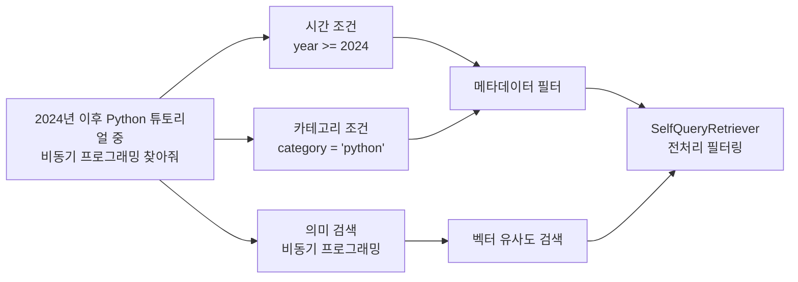
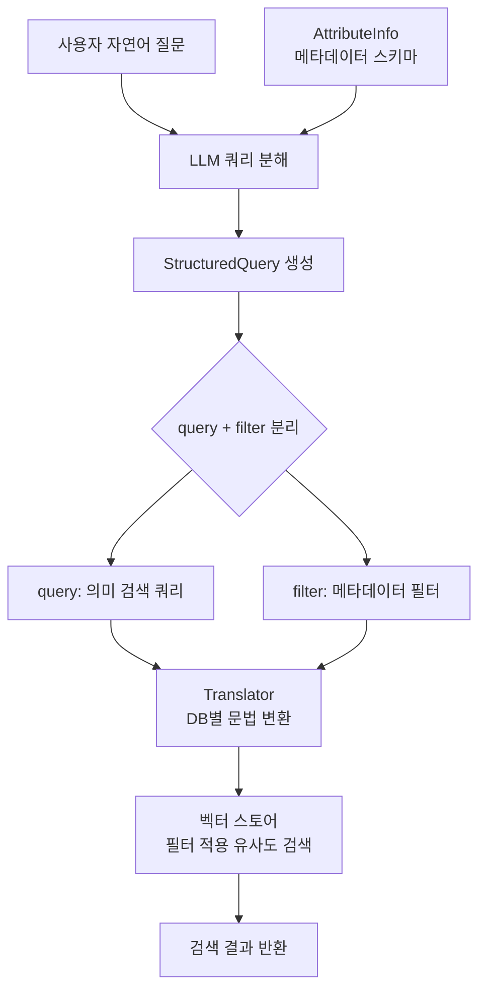
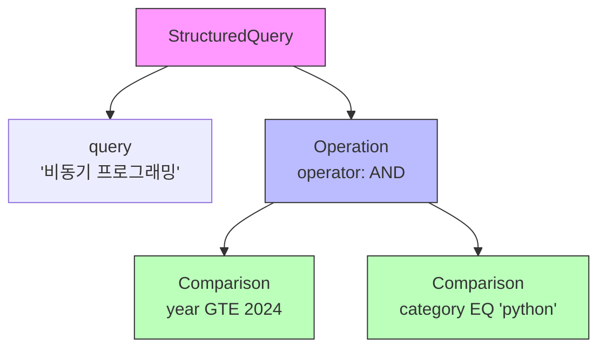
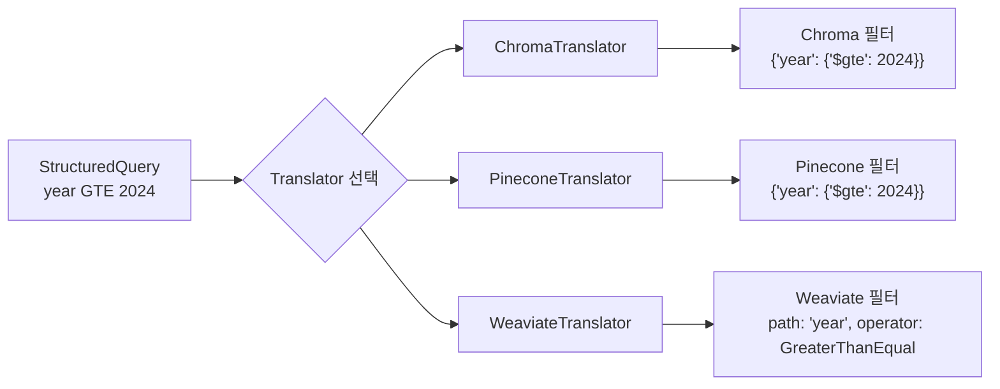
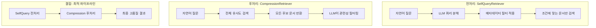

# 셀프 쿼리 검색기

> 자연어 질문을 메타데이터 필터로 자동 변환하여, "2023년 이후 Python 관련 문서"처럼 조건이 포함된 검색을 지능적으로 수행하는 SelfQueryRetriever를 마스터합니다.

## 개요

이 섹션에서는 LangChain의 가장 정교한 검색 전략 중 하나인 **SelfQueryRetriever**를 학습합니다. 지금까지 배운 검색기들이 "검색 후 필터링"(후처리) 방식이었다면, 셀프 쿼리는 **"검색 전 필터링"(전처리)** 방식으로 패러다임을 전환합니다. LLM이 사용자의 자연어 질문을 분석하여 의미 검색 쿼리와 메타데이터 필터를 자동으로 분리하고, 벡터 스토어에 구조화된 쿼리를 전달합니다.

**선수 지식**: [8.1 검색기 기초](ch08/session_01.md)에서 배운 VectorStoreRetriever와 search_kwargs, [8.4 컨텍스트 압축](ch08/session_04.md)에서 다룬 후처리 기반 검색 최적화 개념

**학습 목표**:
- SelfQueryRetriever의 작동 원리(쿼리 분해 → 구조화 → 필터링)를 이해한다
- AttributeInfo로 메타데이터 스키마를 정의하고 LLM에 전달할 수 있다
- 자연어 질문이 Comparator/Operator로 변환되는 과정을 이해한다
- 복합 조건(AND, OR, NOT)을 활용한 고급 메타데이터 검색을 구현할 수 있다

## 왜 알아야 할까?

> 📊 **그림 1**: 자연어 질문 속 세 가지 정보의 분리




실제 문서 데이터베이스에는 텍스트 내용뿐 아니라 **메타데이터**가 풍부하게 존재합니다. 작성일, 카테고리, 저자, 버전, 언어 같은 구조화된 정보가 문서마다 붙어 있죠. 사용자는 이런 메타데이터를 자연스럽게 질문에 섞어 사용합니다.

"**2024년 이후에 작성된 Python 튜토리얼 중에서 비동기 프로그래밍에 대한 내용을 찾아줘**"

이 질문에는 세 가지 정보가 담겨 있습니다:
1. **시간 조건**: 2024년 이후 → 메타데이터 필터 (`year >= 2024`)
2. **카테고리 조건**: Python 튜토리얼 → 메타데이터 필터 (`category == "python"`)
3. **의미 검색**: 비동기 프로그래밍 → 벡터 유사도 검색

[8.1 검색기 기초](ch08/session_01.md)에서 배운 VectorStoreRetriever는 세 번째만 처리할 수 있었고, [8.4 컨텍스트 압축](ch08/session_04.md)의 방식으로는 일단 모든 문서를 검색한 뒤에야 불필요한 결과를 걸러낼 수 있었습니다. SelfQueryRetriever는 **검색 단계에서부터** 메타데이터 조건을 적용하여, 처음부터 조건에 맞는 문서만 검색 대상으로 삼습니다. 이것은 성능과 정확도 모두에서 큰 차이를 만듭니다.

## 핵심 개념

### 개념 1: SelfQueryRetriever — 스스로 질문을 해석하는 검색기

> 📊 **그림 2**: SelfQueryRetriever의 2단계 처리 흐름




> 💡 **비유**: 도서관 사서에게 "최근 2년 이내에 출판된 한국 작가의 SF 소설 추천해주세요"라고 말한다고 상상해보세요. 유능한 사서는 이 한 문장을 듣고 머릿속에서 자동으로 분리합니다 — "출판일 ≥ 2023년", "국적 = 한국", "장르 = SF"라는 **서가 검색 조건**과, "추천할 만한"이라는 **내용 기반 판단**으로요. SelfQueryRetriever가 바로 이 사서입니다. LLM이라는 두뇌로 자연어 질문을 분석하여 메타데이터 필터와 의미 검색 쿼리를 자동으로 분리합니다.

SelfQueryRetriever는 이름 그대로 "스스로(Self) 쿼리를 구성하는" 검색기입니다. 내부적으로 두 단계를 거칩니다:

**1단계 — 쿼리 분해(Query Construction)**: LLM이 사용자 질문을 분석하여 `StructuredQuery` 객체를 생성합니다. 이 객체에는 의미 검색용 `query` 문자열과 메타데이터 `filter`가 분리되어 있습니다.

**2단계 — 구조화된 검색(Structured Search)**: `StructuredQuery`가 벡터 스토어별 번역기(Translator)를 통해 해당 DB의 네이티브 필터 문법으로 변환된 뒤, 벡터 스토어에 전달됩니다.

```
사용자 질문
    │
    ▼
┌──────────────────┐
│  LLM (쿼리 분해)   │ ← AttributeInfo (메타데이터 스키마)
└──────────────────┘
    │
    ▼
┌──────────────────┐
│ StructuredQuery   │
│ ├─ query: str    │  → "비동기 프로그래밍"
│ └─ filter: ...   │  → year >= 2024 AND category == "python"
└──────────────────┘
    │
    ▼
┌──────────────────┐
│   Translator      │ ← Chroma / Pinecone / Weaviate 등
└──────────────────┘
    │
    ▼
┌──────────────────┐
│  Vector Store     │  → 필터가 적용된 유사도 검색 실행
└──────────────────┘
```

핵심은 **LLM이 메타데이터 스키마를 알고 있어야 한다**는 점입니다. 어떤 필드가 존재하고, 각 필드가 어떤 타입이며, 어떤 의미를 담고 있는지를 `AttributeInfo`로 알려줘야 하죠.

### 개념 2: AttributeInfo — 메타데이터의 설명서

> 💡 **비유**: 새로운 데이터베이스를 처음 접했을 때 가장 먼저 보는 게 뭔가요? 바로 **테이블 스키마(Schema)**입니다. 컬럼명, 데이터 타입, 설명을 보면 어떤 쿼리를 짤 수 있는지 바로 파악할 수 있죠. `AttributeInfo`는 LLM에게 주는 메타데이터 스키마 설명서입니다. LLM은 이 설명서를 읽고 "아, `year` 필드는 정수형이니까 비교 연산이 가능하겠구나"라고 판단합니다.

`AttributeInfo`는 Pydantic 모델로, 각 메타데이터 필드에 대해 세 가지 정보를 정의합니다:

```python
from langchain.chains.query_constructor.schema import AttributeInfo

metadata_field_info = [
    AttributeInfo(
        name="category",          # 메타데이터 필드 이름
        description="문서의 카테고리. 'python', 'javascript', 'devops' 중 하나",  # 설명
        type="string",            # 데이터 타입
    ),
    AttributeInfo(
        name="year",
        description="문서가 작성된 연도",
        type="integer",
    ),
    AttributeInfo(
        name="difficulty",
        description="문서의 난이도. 1(입문)부터 5(전문가)까지의 정수",
        type="integer",
    ),
    AttributeInfo(
        name="author",
        description="문서 작성자의 이름",
        type="string",
    ),
]
```

여기서 `description`이 매우 중요합니다. LLM은 이 설명을 기반으로 사용자 질문의 어떤 부분이 어떤 메타데이터 필드에 매핑되는지를 판단하거든요. 예를 들어 description에 `"'python', 'javascript', 'devops' 중 하나"`라고 가능한 값을 명시하면, LLM이 "Python 관련 문서"라는 질문에서 `category == "python"`이라는 필터를 정확하게 생성할 확률이 높아집니다.

**지원하는 타입**:

| 타입 | 설명 | 사용 예 |
|------|------|---------|
| `"string"` | 문자열 | 카테고리, 저자, 제목 |
| `"integer"` | 정수 | 연도, 페이지 수, 버전 |
| `"float"` | 실수 | 평점, 가격 |
| `"boolean"` | 참/거짓 | 공개 여부, 번역 여부 |
| `"list[string]"` | 문자열 리스트 | 태그, 키워드 목록 |

### 개념 3: Comparator와 Operator — 필터의 문법

> 📊 **그림 3**: StructuredQuery의 필터 트리 구조 예시




> 💡 **비유**: SQL에서 `WHERE year >= 2024 AND category = 'python'`이라고 쓰듯, SelfQueryRetriever도 내부적으로 비교 연산자(Comparator)와 논리 연산자(Operator)를 사용합니다. 다만 사용자가 SQL을 직접 쓰는 게 아니라, LLM이 자연어를 분석하여 자동으로 이 연산자들을 선택합니다.

**Comparator** — 개별 필드에 대한 비교 연산:

| Comparator | 의미 | SQL 대응 | 예시 |
|-----------|------|---------|------|
| `eq` | 같다 | `=` | `category == "python"` |
| `ne` | 같지 않다 | `!=` | `category != "devops"` |
| `gt` | 크다 | `>` | `year > 2023` |
| `gte` | 크거나 같다 | `>=` | `year >= 2024` |
| `lt` | 작다 | `<` | `difficulty < 3` |
| `lte` | 작거나 같다 | `<=` | `rating <= 4.5` |
| `contain` | 포함 | `IN` | `tags CONTAIN "async"` |
| `like` | 유사 | `LIKE` | `title LIKE "%tutorial%"` |

**Operator** — 여러 조건을 결합하는 논리 연산:

| Operator | 의미 | 예시 |
|---------|------|------|
| `and` | 모든 조건 만족 | `year >= 2024 AND category == "python"` |
| `or` | 하나 이상 만족 | `category == "python" OR category == "javascript"` |
| `not` | 조건 부정 | `NOT category == "devops"` |

LLM이 생성하는 `StructuredQuery`는 이 Comparator와 Operator를 조합한 트리 구조입니다:

```python
# LLM이 내부적으로 생성하는 구조 (개념적 표현)
StructuredQuery(
    query="비동기 프로그래밍",    # 의미 검색용 쿼리
    filter=Operation(
        operator=Operator.AND,
        arguments=[
            Comparison(
                comparator=Comparator.GTE,
                attribute="year",
                value=2024
            ),
            Comparison(
                comparator=Comparator.EQ,
                attribute="category",
                value="python"
            ),
        ]
    )
)
```

> ⚠️ **흔한 오해**: "모든 벡터 스토어가 모든 Comparator를 지원한다"고 생각하기 쉽지만, 실제로는 벡터 스토어마다 지원하는 연산자가 다릅니다. 예를 들어 Chroma는 `contain`과 `like`를 직접 지원하지 않을 수 있습니다. `SelfQueryRetriever.from_llm()`을 호출할 때 `structured_query_translator`가 자동으로 해당 벡터 스토어에 맞는 연산자만 허용합니다.

### 개념 4: SelfQueryRetriever 생성하기 — from_llm()

SelfQueryRetriever를 생성하는 가장 일반적인 방법은 `from_llm()` 클래스메서드입니다. 네 가지 필수 파라미터와 유용한 옵션 파라미터들을 살펴보겠습니다.

```python
from langchain.retrievers.self_query.base import SelfQueryRetriever
from langchain_openai import ChatOpenAI

# SelfQueryRetriever 생성
retriever = SelfQueryRetriever.from_llm(
    llm=ChatOpenAI(model="gpt-4o", temperature=0),  # 필수: 쿼리 분해용 LLM
    vectorstore=vectorstore,                          # 필수: 벡터 스토어
    document_contents="프로그래밍 기술 문서",            # 필수: 문서 내용에 대한 간단한 설명
    metadata_field_info=metadata_field_info,           # 필수: AttributeInfo 리스트
    enable_limit=False,                                # 선택: 결과 수 제한 허용 여부
    use_original_query=True,                           # 선택: LLM 변환 쿼리 대신 원본 사용
    verbose=True,                                      # 선택: 디버깅용 로그 출력
)
```

**파라미터 상세**:

| 파라미터 | 필수 | 설명 |
|---------|------|------|
| `llm` | ✅ | 쿼리를 분석할 LLM. GPT-4급 모델 권장 |
| `vectorstore` | ✅ | 검색 대상 벡터 스토어 |
| `document_contents` | ✅ | 문서 내용에 대한 **짧은 설명** (실제 내용 아님) |
| `metadata_field_info` | ✅ | `AttributeInfo` 리스트 |
| `enable_limit` | ❌ | `True`면 LLM이 결과 수 제한을 설정 가능 |
| `use_original_query` | ❌ | `True`면 원본 쿼리를 벡터 검색에 사용 |
| `structured_query_translator` | ❌ | 벡터 스토어별 번역기 (보통 자동 감지) |
| `search_kwargs` | ❌ | 벡터 스토어 검색 추가 파라미터 |

`document_contents`에는 "기술 블로그 글" 이나 "영화 리뷰" 처럼 문서가 무엇에 관한 것인지 한 문장으로 설명합니다. LLM은 이 설명을 보고, 사용자 질문에서 **"내용에 관한 부분"과 "메타데이터에 관한 부분"**을 분리하는 기준으로 삼습니다.

### 개념 5: 벡터 스토어 번역기(Translator) — DB별 맞춤 변환

> 📊 **그림 4**: Translator의 역할 — 추상 쿼리를 DB 네이티브 필터로 변환




SelfQueryRetriever의 또 다른 핵심 부품은 **번역기(Translator)**입니다. LLM이 생성한 추상적인 `StructuredQuery`를 특정 벡터 스토어의 네이티브 필터 문법으로 바꿔주는 역할이죠.

```python
# Chroma용 번역기 (보통 자동 감지됨)
from langchain_community.query_constructors.chroma import ChromaTranslator

# 수동으로 번역기를 지정하는 경우
retriever = SelfQueryRetriever.from_llm(
    llm=llm,
    vectorstore=vectorstore,
    document_contents="프로그래밍 기술 문서",
    metadata_field_info=metadata_field_info,
    structured_query_translator=ChromaTranslator(),
)
```

각 벡터 스토어마다 전용 번역기가 있습니다:

| 벡터 스토어 | 번역기 | 패키지 |
|------------|--------|--------|
| Chroma | `ChromaTranslator` | `langchain_community` |
| Pinecone | `PineconeTranslator` | `langchain_community` |
| Weaviate | `WeaviateTranslator` | `langchain_community` |
| Elasticsearch | `ElasticsearchTranslator` | `langchain_elasticsearch` |
| MongoDB Atlas | `MongoDBAtlasTranslator` | `langchain_mongodb` |

대부분의 경우 `from_llm()`이 벡터 스토어 타입을 보고 알맞은 번역기를 **자동으로 선택**합니다. 직접 지정이 필요한 경우는 드물지만, 커스텀 벡터 스토어를 사용하거나 특정 Comparator를 제한하고 싶을 때 유용합니다.

> 💡 **FAISS 대신 Chroma를 사용하는 이유**: 이전 세션(8.1~8.4)에서는 FAISS를 벡터 스토어로 사용했지만, SelfQueryRetriever에서는 **Chroma**를 사용합니다. SelfQueryRetriever가 동작하려면 `StructuredQuery`를 벡터 스토어의 네이티브 필터 문법으로 변환하는 Translator가 반드시 필요한데, Chroma는 `ChromaTranslator`를 통해 `$gt`, `$eq` 같은 메타데이터 필터링 연산을 네이티브로 지원합니다. 반면 FAISS는 순수 벡터 유사도 검색에 특화된 라이브러리로, 메타데이터 기반 필터링 메커니즘을 자체적으로 제공하지 않아 SelfQueryRetriever용 Translator가 존재하지 않습니다. 따라서 메타데이터 필터링이 핵심인 셀프 쿼리 검색에서는 Chroma처럼 네이티브 필터링을 지원하는 벡터 스토어를 선택해야 합니다.

## 실습: 직접 해보기

기술 문서 데이터셋을 만들고, SelfQueryRetriever로 다양한 조건의 자연어 검색을 수행해보겠습니다.

```python
# 필요한 패키지 설치
# pip install langchain langchain-openai langchain-chroma lark python-dotenv

import os
from dotenv import load_dotenv
from langchain_core.documents import Document
from langchain_openai import ChatOpenAI, OpenAIEmbeddings
from langchain_chroma import Chroma
from langchain.chains.query_constructor.schema import AttributeInfo
from langchain.retrievers.self_query.base import SelfQueryRetriever

# 환경 변수 로드
load_dotenv()

# --- 1단계: 문서 데이터 준비 (풍부한 메타데이터 포함) ---
docs = [
    Document(
        page_content="Python의 asyncio 라이브러리를 활용한 비동기 웹 스크래핑 가이드입니다. "
                     "aiohttp와 함께 사용하여 동시에 수백 개의 페이지를 효율적으로 크롤링합니다.",
        metadata={
            "category": "python",
            "year": 2024,
            "difficulty": 3,
            "author": "김파이",
            "tags": ["async", "web-scraping"],
        },
    ),
    Document(
        page_content="FastAPI로 REST API를 구축하는 실전 가이드입니다. "
                     "Pydantic 모델 검증, 의존성 주입, 자동 문서화까지 다룹니다.",
        metadata={
            "category": "python",
            "year": 2025,
            "difficulty": 2,
            "author": "이웹",
            "tags": ["fastapi", "rest-api"],
        },
    ),
    Document(
        page_content="React 18의 Suspense와 Server Components를 활용한 "
                     "차세대 프론트엔드 아키텍처를 소개합니다.",
        metadata={
            "category": "javascript",
            "year": 2024,
            "difficulty": 4,
            "author": "박리액",
            "tags": ["react", "frontend"],
        },
    ),
    Document(
        page_content="Docker와 Kubernetes를 이용한 마이크로서비스 배포 자동화. "
                     "CI/CD 파이프라인 구성부터 모니터링까지 전체 워크플로우를 다룹니다.",
        metadata={
            "category": "devops",
            "year": 2023,
            "difficulty": 4,
            "author": "최도커",
            "tags": ["docker", "kubernetes"],
        },
    ),
    Document(
        page_content="LangChain과 OpenAI를 활용한 RAG 시스템 구축 완벽 가이드. "
                     "벡터 스토어, 임베딩, 검색기까지 실전 예제로 설명합니다.",
        metadata={
            "category": "python",
            "year": 2025,
            "difficulty": 3,
            "author": "김파이",
            "tags": ["langchain", "rag"],
        },
    ),
    Document(
        page_content="TypeScript 5의 데코레이터와 타입 시스템 고급 활용법. "
                     "제네릭, 조건부 타입, 템플릿 리터럴 타입을 실전에서 사용합니다.",
        metadata={
            "category": "javascript",
            "year": 2025,
            "difficulty": 5,
            "author": "이타입",
            "tags": ["typescript", "advanced"],
        },
    ),
]

# --- 2단계: 벡터 스토어 생성 ---
# 💡 SelfQueryRetriever는 메타데이터 필터링을 네이티브로 지원하는 벡터 스토어가 필요합니다.
# Chroma는 ChromaTranslator를 통해 $gt, $eq 등의 필터 연산을 지원하므로
# SelfQueryRetriever와 궁합이 좋습니다. (FAISS는 자체 필터링을 지원하지 않아 사용 불가)
embeddings = OpenAIEmbeddings(model="text-embedding-3-small")
vectorstore = Chroma.from_documents(docs, embeddings)

# --- 3단계: 메타데이터 스키마 정의 (AttributeInfo) ---
metadata_field_info = [
    AttributeInfo(
        name="category",
        description="문서의 프로그래밍 카테고리. "
                    "'python', 'javascript', 'devops' 중 하나",
        type="string",
    ),
    AttributeInfo(
        name="year",
        description="문서가 작성된 연도. 2023부터 2025 사이의 정수",
        type="integer",
    ),
    AttributeInfo(
        name="difficulty",
        description="문서의 난이도 수준. 1(입문)부터 5(전문가)까지의 정수",
        type="integer",
    ),
    AttributeInfo(
        name="author",
        description="문서를 작성한 저자의 이름",
        type="string",
    ),
]

# 문서 내용에 대한 간결한 설명
document_content_description = "프로그래밍 및 소프트웨어 개발 관련 기술 튜토리얼"

# --- 4단계: SelfQueryRetriever 생성 ---
llm = ChatOpenAI(model="gpt-4o", temperature=0)

retriever = SelfQueryRetriever.from_llm(
    llm=llm,
    vectorstore=vectorstore,
    document_contents=document_content_description,
    metadata_field_info=metadata_field_info,
    verbose=True,  # 생성된 구조화 쿼리를 확인
)

# --- 5단계: 다양한 자연어 쿼리 테스트 ---

# 테스트 1: 순수 의미 검색 (메타데이터 필터 없음)
print("=" * 60)
print("테스트 1: 순수 의미 검색")
print("=" * 60)
results = retriever.invoke("비동기 프로그래밍에 대해 알려줘")
for doc in results:
    print(f"  [{doc.metadata['category']}] {doc.page_content[:50]}...")

# 테스트 2: 메타데이터 필터만 (의미 검색 없음)
print("\n" + "=" * 60)
print("테스트 2: 메타데이터 필터 — 카테고리 지정")
print("=" * 60)
results = retriever.invoke("Python 관련 문서를 모두 보여줘")
for doc in results:
    print(f"  [{doc.metadata['category']}, {doc.metadata['year']}] "
          f"{doc.page_content[:50]}...")

# 테스트 3: 의미 검색 + 메타데이터 필터 조합
print("\n" + "=" * 60)
print("테스트 3: 의미 검색 + 메타데이터 필터 — 연도 조건")
print("=" * 60)
results = retriever.invoke("2025년에 작성된 API 관련 튜토리얼")
for doc in results:
    print(f"  [{doc.metadata['category']}, {doc.metadata['year']}] "
          f"{doc.page_content[:50]}...")

# 테스트 4: 복합 조건 (AND)
print("\n" + "=" * 60)
print("테스트 4: 복합 조건 — Python + 난이도 3 이상")
print("=" * 60)
results = retriever.invoke("난이도 3 이상인 Python 문서")
for doc in results:
    print(f"  [{doc.metadata['category']}, 난이도:{doc.metadata['difficulty']}] "
          f"{doc.page_content[:50]}...")

# 테스트 5: 특정 저자 검색
print("\n" + "=" * 60)
print("테스트 5: 저자 기반 검색")
print("=" * 60)
results = retriever.invoke("김파이가 쓴 글")
for doc in results:
    print(f"  [저자:{doc.metadata['author']}, {doc.metadata['year']}] "
          f"{doc.page_content[:50]}...")
```

**예상 출력**:

```
============================================================
테스트 1: 순수 의미 검색
============================================================
  [python] Python의 asyncio 라이브러리를 활용한 비동기 웹 스크래핑 가이드입니다...

============================================================
테스트 2: 메타데이터 필터 — 카테고리 지정
============================================================
  [python, 2024] Python의 asyncio 라이브러리를 활용한 비동기 웹 스크래핑 가이...
  [python, 2025] FastAPI로 REST API를 구축하는 실전 가이드입니다...
  [python, 2025] LangChain과 OpenAI를 활용한 RAG 시스템 구축 완벽 가이드...

============================================================
테스트 3: 의미 검색 + 메타데이터 필터 — 연도 조건
============================================================
  [python, 2025] FastAPI로 REST API를 구축하는 실전 가이드입니다...

============================================================
테스트 4: 복합 조건 — Python + 난이도 3 이상
============================================================
  [python, 난이도:3] Python의 asyncio 라이브러리를 활용한 비동기 웹 스크래핑...
  [python, 난이도:3] LangChain과 OpenAI를 활용한 RAG 시스템 구축 완벽 가이드...

============================================================
테스트 5: 저자 기반 검색
============================================================
  [저자:김파이, 2024] Python의 asyncio 라이브러리를 활용한 비동기 웹 스크래핑...
  [저자:김파이, 2025] LangChain과 OpenAI를 활용한 RAG 시스템 구축 완벽 가이드...
```

아래는 쿼리 구성 과정을 직접 들여다보는 심화 예제입니다:

```python
# --- 심화: 쿼리 구성 체인을 직접 사용하기 ---
from langchain.chains.query_constructor.base import (
    load_query_constructor_runnable,
    get_query_constructor_prompt,
)

# 쿼리 구성 프롬프트 확인 (LLM에 전달되는 프롬프트)
prompt = get_query_constructor_prompt(
    document_contents=document_content_description,
    attribute_info=metadata_field_info,
)
print("=== 쿼리 구성 프롬프트 (일부) ===")
print(prompt.format(query="2025년에 작성된 Python 튜토리얼")[:500])

# 쿼리 구성 Runnable 직접 생성
query_constructor = load_query_constructor_runnable(
    llm=llm,
    document_contents=document_content_description,
    attribute_info=metadata_field_info,
)

# 구조화된 쿼리 객체 확인
structured_query = query_constructor.invoke(
    "2024년 이후 난이도 3 이하인 Python 튜토리얼"
)
print("\n=== 생성된 StructuredQuery ===")
print(f"query: {structured_query.query}")       # 의미 검색 쿼리
print(f"filter: {structured_query.filter}")     # 메타데이터 필터 트리
print(f"limit: {structured_query.limit}")       # 결과 수 제한 (None이면 미설정)
```

**예상 출력**:

```
=== 생성된 StructuredQuery ===
query: Python 튜토리얼
filter: Operation(operator=<Operator.AND>, arguments=[
    Comparison(comparator=<Comparator.GTE>, attribute='year', value=2024),
    Comparison(comparator=<Comparator.LTE>, attribute='difficulty', value=3),
    Comparison(comparator=<Comparator.EQ>, attribute='category', value='python')
])
limit: None
```

## 더 깊이 알아보기

### SelfQueryRetriever의 탄생 배경

SelfQueryRetriever는 LangChain 프레임워크 초기부터 존재했던 기능은 아닙니다. 2022년 10월 Harrison Chase가 LangChain을 오픈소스로 출시한 이후, 벡터 검색 기반 RAG가 빠르게 인기를 얻었는데요. 곧 개발자들이 공통적으로 부딪히는 문제가 드러났습니다 — **벡터 유사도 검색만으로는 "2023년 이후 문서"같은 구조화된 조건을 처리할 수 없다**는 것이었죠.

이 문제의 해법은 사실 데이터베이스 분야에서 이미 잘 알려진 개념이었습니다. 전통적인 RDBMS의 **쿼리 파서(Query Parser)**가 SQL 문을 구문 분석하여 실행 계획을 만드는 것처럼, LLM을 쿼리 파서로 활용하면 자연어를 구조화된 쿼리로 변환할 수 있다는 아이디어였습니다. LangChain 팀은 이를 `lark`라는 파싱 라이브러리와 결합하여 SelfQueryRetriever를 구현했습니다.

흥미로운 점은, 이 접근법이 후에 **Text-to-SQL** 패턴과 비교되곤 한다는 것입니다. Text-to-SQL이 자연어를 SQL로 변환한다면, SelfQueryRetriever는 자연어를 **벡터 스토어의 필터 쿼리**로 변환합니다. 두 기법 모두 "LLM을 쿼리 변환기로 활용한다"는 같은 철학을 공유하며, 2023~2024년에 걸쳐 RAG 시스템의 핵심 구성 요소로 자리잡았습니다.

### lark 파서의 역할

SelfQueryRetriever를 설치할 때 `pip install lark`가 필요한 이유가 궁금하셨을 수 있습니다. `lark`는 Python의 범용 파싱 라이브러리로, LLM이 생성한 텍스트 형태의 필터 표현식을 **구문 트리(Parse Tree)**로 변환하는 데 사용됩니다. LLM이 "year >= 2024 AND category == python" 같은 표현식을 텍스트로 출력하면, lark 파서가 이를 `Comparison`과 `Operation` 객체의 트리 구조로 파싱하는 것이죠. 이 설계 덕분에 LLM의 출력 형식이 약간 불안정하더라도 안정적으로 구조화된 쿼리를 생성할 수 있습니다.

## 흔한 오해와 팁

> ⚠️ **흔한 오해**: "`document_contents`에 실제 문서 내용을 넣어야 한다"고 오해하는 분이 많습니다. 이 파라미터는 문서의 **내용에 대한 짧은 설명(description)**이지, 문서 텍스트 자체가 아닙니다. "기술 블로그 문서", "영화 리뷰 데이터" 처럼 한 문장으로 쓰세요. LLM은 이 설명을 보고 사용자 질문에서 의미 검색 부분과 메타데이터 필터 부분을 구분합니다.

> ⚠️ **흔한 오해**: "SelfQueryRetriever는 느리니까 프로덕션에서 쓸 수 없다"는 생각도 잘못된 것입니다. 확실히 LLM 호출이 한 번 추가되므로 단순 벡터 검색보다 느리지만, 불필요한 문서를 애초에 검색하지 않으므로 **후속 처리(reranking, compression) 비용을 대폭 절감**합니다. 특히 문서 수가 많고 메타데이터가 풍부한 프로덕션 환경에서 오히려 전체 파이프라인 효율이 높아질 수 있습니다.

> 💡 **알고 계셨나요?**: `AttributeInfo`의 `description`에 **가능한 값의 목록**을 명시하면 필터 생성 정확도가 크게 향상됩니다. 예를 들어 `"'python', 'javascript', 'devops' 중 하나"` 라고 쓰면, LLM이 사용자 질문의 "파이썬"을 `"python"`으로 정확하게 매핑합니다. 이것은 LangChain GitHub Discussion에서 공유된 베스트 프랙티스이기도 합니다.

> 🔥 **실무 팁**: 프로덕션에서는 `SelfQueryRetriever`와 [8.4 컨텍스트 압축](ch08/session_04.md)의 `ContextualCompressionRetriever`를 **결합**하면 강력합니다. SelfQueryRetriever가 메타데이터 기반 전처리를, ContextualCompressionRetriever가 LLM 기반 후처리를 담당하는 2단계 파이프라인이죠:
> ```python
> from langchain.retrievers import ContextualCompressionRetriever
> from langchain.retrievers.document_compressors import LLMChainFilter
> 
> # 1단계: 메타데이터 필터링 (전처리)
> self_query_retriever = SelfQueryRetriever.from_llm(...)
> 
> # 2단계: LLM 기반 관련성 필터링 (후처리)
> compressor = LLMChainFilter.from_llm(llm)
> compression_retriever = ContextualCompressionRetriever(
>     base_compressor=compressor,
>     base_retriever=self_query_retriever,
> )
> ```

> 🔥 **실무 팁**: `enable_limit=True`를 설정하면 LLM이 사용자 질문에서 결과 수 제한도 추출할 수 있습니다. "상위 3개만 보여줘" 같은 요청이 자동으로 `limit=3`으로 변환됩니다. 다만, 기본값은 `False`이므로 명시적으로 켜줘야 합니다.

## 핵심 정리

> 📊 **그림 5**: 전처리(SelfQuery) vs 후처리(Compression) 검색 전략 비교




| 개념 | 설명 |
|------|------|
| **SelfQueryRetriever** | LLM으로 자연어를 분석하여 의미 검색 쿼리와 메타데이터 필터를 자동 분리하는 검색기 |
| **AttributeInfo** | 메타데이터 필드의 이름, 설명, 타입을 정의하여 LLM에 스키마 정보를 전달하는 객체 |
| **StructuredQuery** | LLM이 생성하는 구조화된 쿼리 객체. `query`(의미 검색)와 `filter`(메타데이터 필터)로 구성 |
| **Comparator** | `eq`, `gt`, `gte`, `lt`, `lte` 등 개별 필드 비교 연산자 |
| **Operator** | `and`, `or`, `not` 등 여러 Comparison을 결합하는 논리 연산자 |
| **Translator** | StructuredQuery를 벡터 스토어 네이티브 필터 문법으로 변환하는 번역기 |
| **document_contents** | 문서 내용에 대한 짧은 설명 (실제 문서가 아님) |
| **enable_limit** | 사용자 질문에서 결과 수 제한을 자동 추출할지 여부 |
| **전처리 vs 후처리** | SelfQuery(전처리 필터링) ↔ Compression(후처리 필터링) — 결합 시 최적 |

## 다음 섹션 미리보기

이것으로 **Chapter 8: 검색기(Retriever) 심화**를 마무리합니다! 지금까지 VectorStoreRetriever의 기초부터 BM25·앙상블, 멀티쿼리·RAG Fusion, 컨텍스트 압축, 그리고 셀프 쿼리까지 — 다양한 검색 전략의 스펙트럼을 모두 탐험했습니다. 다음 [Chapter 9: RAG(Retrieval-Augmented Generation) 구축](ch09/session_01.md)에서는 이 모든 검색기들을 **실제 RAG 파이프라인** 안에서 조합하고 활용하는 방법을 배웁니다. 검색기가 "부품"이었다면, 이제 그 부품들을 조립하여 **완성된 QA 시스템**을 만들어볼 차례입니다.

## 참고 자료

- [LangChain Self-querying How-To Guide](https://python.langchain.com/docs/how_to/self_query/) - 공식 문서의 SelfQueryRetriever 사용법과 예제. 가장 먼저 참고해야 할 자료
- [LangChain SelfQueryRetriever API Reference](https://python.langchain.com/api_reference/langchain/retrievers/langchain.retrievers.self_query.base.SelfQueryRetriever.html) - `from_llm()` 파라미터와 클래스 속성의 상세 레퍼런스
- [Chroma Self-Query Integration (GitHub)](https://github.com/langchain-ai/langchain/blob/master/docs/docs/integrations/retrievers/self_query/chroma_self_query.ipynb) - Chroma 벡터 스토어와 SelfQueryRetriever를 연동하는 공식 Jupyter 노트북 예제
- [How LangChain Implements Self Querying — Zilliz Blog](https://zilliz.com/blog/How-LangChain-Implements-Self-Querying) - SelfQueryRetriever의 내부 구현 원리를 심층 분석한 기술 블로그
- [How to Build a RAG System with a Self-Querying Retriever — Towards Data Science](https://towardsdatascience.com/how-to-build-a-rag-system-with-a-self-querying-retriever-in-langchain-16b4fa23e9ad/) - SelfQueryRetriever를 활용한 실전 RAG 시스템 구축 가이드

---
### 🔗 Related Sessions
- [chatopenai](../01-langchain-소개와-개발-환경-설정/04-첫-번째-langchain-애플리케이션.md) (prerequisite)
- [chroma](../07-임베딩과-벡터-스토어/03-벡터-스토어-구축---faiss와-chroma.md) (prerequisite)
- [vectorstoreretriever](../08-검색기retriever-심화/01-검색기-기초.md) (prerequisite)
- [search_kwargs](../08-검색기retriever-심화/01-검색기-기초.md) (prerequisite)
- [contextualcompressionretriever](../08-검색기retriever-심화/04-컨텍스트-압축.md) (prerequisite)
- [llmchainfilter](../08-검색기retriever-심화/04-컨텍스트-압축.md) (prerequisite)
