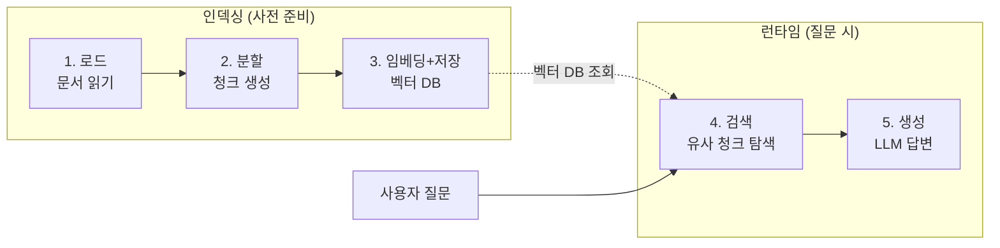
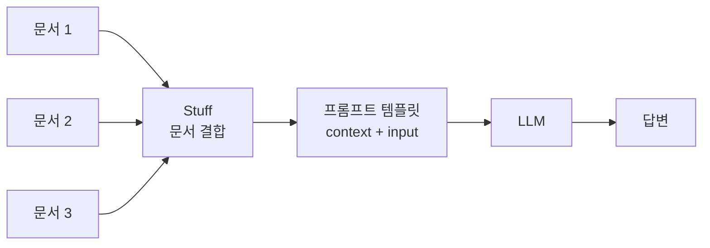
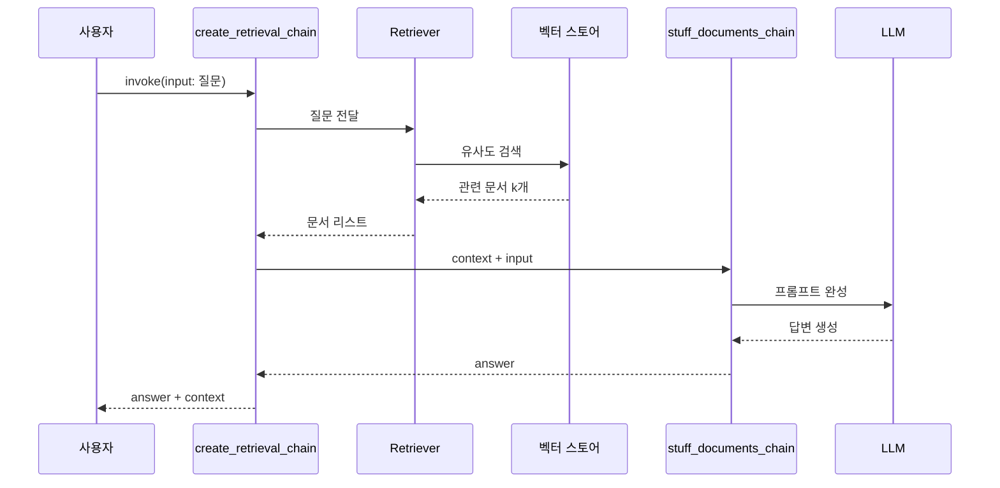
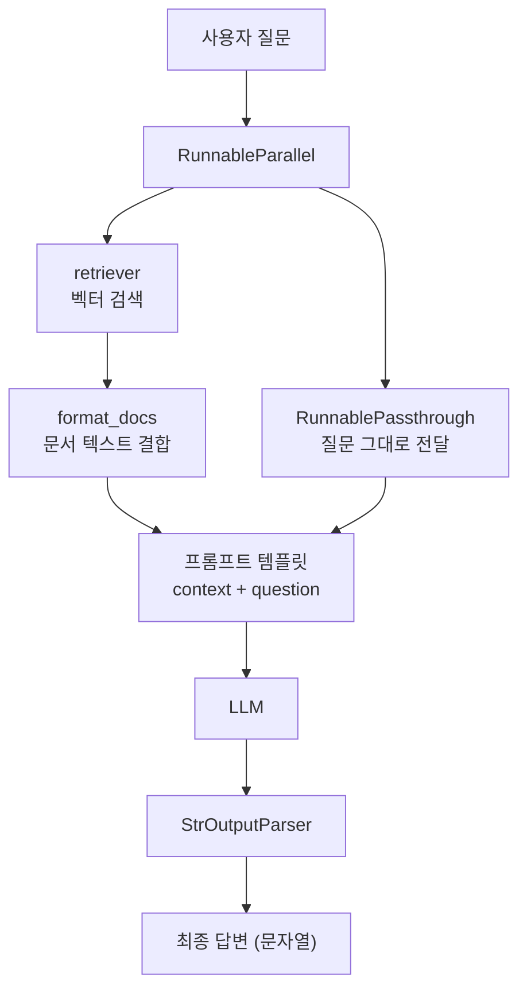
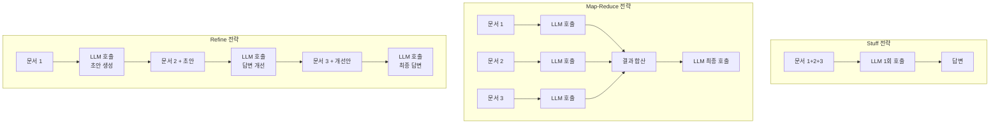

# 기본 RAG 체인 구축

> 문서를 불러오고, 나누고, 임베딩하고, 검색하고, 답변을 생성하는 — RAG의 전체 파이프라인을 처음부터 끝까지 구축합니다.

## 개요

이 섹션에서는 RAG(Retrieval-Augmented Generation)의 핵심 파이프라인을 처음부터 단계별로 구축해봅니다. 문서 로드부터 텍스트 분할, 임베딩, 벡터 저장, 검색, 그리고 최종 답변 생성까지 — RAG의 다섯 단계를 하나의 체인으로 연결하는 방법을 배우게 됩니다.

**선수 지식**: 
- [Ch5] LCEL과 파이프 연산자(`|`)를 이용한 체인 구성
- [Ch6] 문서 로더와 텍스트 분할기 사용법
- [Ch7] 임베딩과 벡터 스토어 구축
- [Ch8] 검색기(Retriever)의 동작 원리

**학습 목표**:
- RAG 파이프라인의 5단계(로드 → 분할 → 임베딩 → 검색 → 생성) 흐름을 설명할 수 있다
- `create_stuff_documents_chain`과 `create_retrieval_chain`을 사용하여 기본 RAG 체인을 구축할 수 있다
- LCEL의 `RunnableParallel`과 파이프 연산자로 동일한 RAG 체인을 직접 구성할 수 있다
- 프롬프트 설계가 RAG 답변 품질에 미치는 영향을 이해할 수 있다

## 왜 알아야 할까?

ChatGPT에게 "우리 회사 내부 규정에서 연차 사용 조건이 뭐야?"라고 물어보면 어떻게 될까요? 당연히 모릅니다. LLM은 학습 데이터에 없는 정보는 답할 수 없거든요. 심지어 "모른다"고 하지 않고 그럴듯한 거짓말을 만들어내기도 합니다 — 이른바 **환각(Hallucination)** 문제죠.

RAG는 이 문제를 정면으로 해결합니다. "LLM이 모르면, 아는 곳에서 찾아와서 읽게 해주자"는 아이디어입니다. 실제로 기업용 AI 챗봇, 문서 QA 시스템, 고객 지원 봇의 대부분이 RAG 아키텍처를 기반으로 만들어지고 있습니다. LangChain을 배우는 가장 큰 이유 중 하나가 바로 이 RAG 파이프라인을 쉽고 빠르게 구축할 수 있기 때문이죠.

이번 섹션에서 만드는 기본 RAG 체인은 앞으로 Ch9 전체에서 계속 발전시킬 토대가 됩니다. 프롬프트 최적화, 대화형 RAG, 고급 검색 패턴, 프로덕션 아키텍처를 차근차근 쌓아 올릴 예정이니, 하나하나 확실하게 이해하고 넘어가겠습니다.

## 핵심 개념

### 개념 1: RAG 파이프라인의 5단계

> 💡 **비유**: RAG는 **오픈북 시험**과 같습니다. 일반 LLM이 "머릿속 기억만으로 답하는 시험"이라면, RAG는 "교과서를 펼쳐 관련 페이지를 찾아 읽은 뒤 답하는 시험"이에요. 교과서를 준비하고(인덱싱), 관련 페이지를 찾고(검색), 읽고 답하는(생성) 과정이 곧 RAG입니다.

RAG 파이프라인은 크게 **인덱싱(Indexing)**과 **검색+생성(Retrieval & Generation)** 두 단계로 나뉘는데요, 이를 좀 더 세분화하면 다음 5단계로 구성됩니다:

| 단계 | 역할 | LangChain 도구 | 이전 학습 |
|------|------|----------------|-----------|
| 1. **로드(Load)** | 원본 문서를 읽어들임 | `TextLoader`, `PyPDFLoader` 등 | [Ch6] 문서 로더 |
| 2. **분할(Split)** | 긴 문서를 청크로 나눔 | `RecursiveCharacterTextSplitter` | [Ch6] 텍스트 분할 |
| 3. **임베딩+저장(Embed & Store)** | 청크를 벡터로 변환하여 저장 | `OpenAIEmbeddings` + `Chroma` | [Ch7] 벡터 스토어 |
| 4. **검색(Retrieve)** | 질문과 유사한 청크를 찾음 | `vectorstore.as_retriever()` | [Ch8] 검색기 |
| 5. **생성(Generate)** | 검색된 문맥으로 답변 생성 | `ChatOpenAI` + 프롬프트 | **이번 섹션에서 새로 배움** |

1~3단계는 **인덱싱** 과정으로, 보통 사전에 한 번 실행합니다. 4~5단계가 사용자 질문이 들어올 때마다 실행되는 **런타임** 과정이에요.

> 📊 **그림 1**: RAG 파이프라인 5단계 — 인덱싱과 런타임의 구분




지금까지 Ch6~Ch8에서 1~4단계를 개별적으로 배웠습니다. 이번 섹션의 핵심은 이 모든 단계를 **하나의 체인으로 연결하는 5단계(생성)**를 추가하는 것입니다. 즉, 지금까지 배운 퍼즐 조각들을 하나로 맞추는 시간이에요.

```python
# RAG 파이프라인 5단계 개요 (의사 코드)

# === 인덱싱 (사전 준비) — Ch6~Ch7에서 배운 내용 ===
documents = load("my_docs/")       # 1. 로드 [Ch6]
chunks = split(documents)           # 2. 분할 [Ch6]
vectorstore = embed_and_store(chunks)  # 3. 임베딩 + 저장 [Ch7]

# === 런타임 (질문 시마다) — Ch8 + 이번 섹션 ===
relevant_chunks = retrieve(vectorstore, question)  # 4. 검색 [Ch8]
answer = generate(llm, relevant_chunks, question)  # 5. 생성 ⬅ NEW!
```

> 💡 **핵심 포인트**: 1~4단계는 이미 배운 내용의 복습입니다. 이번 섹션에서 **진짜 새로운 것**은 "검색된 문서를 LLM 프롬프트에 넣어 답변을 생성하는 5단계"와, 이 전체를 하나의 체인으로 엮는 방법이에요.

### 개념 2: create_stuff_documents_chain — 문서를 "뭉쳐서" 프롬프트에 넣기

> 💡 **비유**: 도서관에서 관련 책 3권을 찾았다고 해봅시다. `create_stuff_documents_chain`은 이 3권의 관련 페이지를 **한 장의 요약 노트로 합쳐서** 선생님(LLM)에게 건네주는 역할입니다. "Stuff"라는 이름 자체가 "문서를 꾹꾹 눌러담는다(stuff)"는 의미거든요.

`create_stuff_documents_chain`은 검색된 문서 리스트를 하나의 프롬프트에 합쳐 넣는 체인을 생성합니다. 이 함수의 임포트 경로와 기본 사용법을 살펴보겠습니다:

```python
from langchain.chains.combine_documents import create_stuff_documents_chain
from langchain_core.prompts import ChatPromptTemplate
from langchain_openai import ChatOpenAI

# LLM 초기화
llm = ChatOpenAI(model="gpt-4o", temperature=0)

# 프롬프트 — 반드시 {context} 변수를 포함해야 합니다
prompt = ChatPromptTemplate.from_template(
    """다음 문맥을 바탕으로 질문에 답변해주세요.
    문맥에 답이 없으면 "모르겠습니다"라고 답하세요.
    
    문맥: {context}
    
    질문: {input}
    """
)

# 문서 결합 체인 생성
combine_docs_chain = create_stuff_documents_chain(llm=llm, prompt=prompt)
```

여기서 핵심은 프롬프트에 `{context}`라는 변수가 반드시 포함되어야 한다는 점입니다. 이 변수에 검색된 문서들이 합쳐져서 들어가게 됩니다.

> 📊 **그림 2**: create_stuff_documents_chain의 동작 흐름




> ⚠️ **흔한 오해**: `create_stuff_documents_chain`이 "검색까지 해주는 것"이라고 생각하기 쉬운데요, 이 체인은 **이미 검색된 문서를 프롬프트에 합치는 역할만** 합니다. 검색은 다음에 배울 `create_retrieval_chain`이 담당해요.

### 개념 3: create_retrieval_chain — 검색 + 생성을 하나로

> 💡 **비유**: `create_retrieval_chain`은 **사서 + 선생님을 한 팀으로 묶는 것**과 같습니다. "이 질문에 대한 답 찾아줘"라고 하면, 사서(Retriever)가 관련 문서를 찾아오고, 선생님(LLM + 문서 체인)이 그 문서를 읽고 답변을 만들어줍니다.

`create_retrieval_chain`은 **Retriever**와 **문서 결합 체인**을 연결하여, 질문이 들어오면 자동으로 검색 → 생성을 수행하는 완전한 RAG 체인을 만듭니다:

```python
from langchain.chains import create_retrieval_chain

# retriever는 Ch8에서 배운 벡터스토어 기반 검색기
retriever = vectorstore.as_retriever(search_kwargs={"k": 3})

# 검색 체인 = 검색기 + 문서 결합 체인
rag_chain = create_retrieval_chain(retriever, combine_docs_chain)

# 실행 — input 키로 질문 전달
result = rag_chain.invoke({"input": "RAG의 장점은 무엇인가요?"})

print(result["answer"])   # 생성된 답변
print(result["context"])  # 검색된 문서 리스트
```

`create_retrieval_chain`의 출력은 딕셔너리로, `answer` 키에 최종 답변이, `context` 키에 검색된 문서 리스트가 담깁니다. 검색 근거를 함께 확인할 수 있어 디버깅과 투명성 확보에 유용하죠.

> 📊 **그림 3**: create_retrieval_chain — 검색에서 답변까지의 전체 흐름




### 개념 4: LCEL로 직접 RAG 체인 만들기

앞서 배운 헬퍼 함수도 편리하지만, LCEL을 사용하면 RAG 체인의 각 단계를 **투명하게 제어**할 수 있습니다. [Ch5] LCEL 마스터에서 배운 `RunnableParallel`과 `RunnablePassthrough`가 여기서 빛을 발합니다:

```python
from langchain_core.runnables import RunnableParallel, RunnablePassthrough
from langchain_core.output_parsers import StrOutputParser

# 검색된 문서를 하나의 문자열로 합치는 함수
def format_docs(docs):
    return "\n\n".join(doc.page_content for doc in docs)

# LCEL RAG 체인 구성
rag_chain = (
    RunnableParallel(
        context=retriever | format_docs,   # 검색 → 문서 포맷팅
        question=RunnablePassthrough()      # 원본 질문 그대로 전달
    )
    | prompt       # 프롬프트 템플릿에 context + question 주입
    | llm          # LLM이 답변 생성
    | StrOutputParser()  # 문자열로 파싱
)

# 실행 — 문자열로 바로 질문
answer = rag_chain.invoke("RAG의 장점은 무엇인가요?")
print(answer)
```

이 구조를 풀어보면:

1. `RunnableParallel`이 **동시에** 두 작업을 수행합니다:
   - `context`: retriever로 문서를 검색하고 → `format_docs`로 텍스트를 합침
   - `question`: 원본 질문을 그대로 통과시킴
2. 결과가 딕셔너리 `{"context": "...", "question": "..."}`로 프롬프트에 전달됩니다
3. 프롬프트 → LLM → 출력 파서를 거쳐 최종 답변이 나옵니다

> 📊 **그림 4**: LCEL RAG 체인의 내부 구조 — RunnableParallel 병렬 처리




> 🔥 **실무 팁**: 헬퍼 함수(`create_retrieval_chain`)는 빠른 프로토타이핑에, LCEL 직접 구성은 커스터마이징이 필요할 때 사용하세요. 예를 들어 검색 결과를 재랭킹하거나, 중간에 로깅을 넣거나, 조건 분기를 추가하려면 LCEL 방식이 훨씬 유연합니다.

### 개념 5: 프롬프트가 RAG 품질을 결정한다 — 다음 단계로의 징검다리

기본 RAG 체인을 구축했다면, 자연스럽게 이런 의문이 생깁니다: **"검색은 잘 되는데, 답변이 기대만큼 좋지 않다면?"** 이때 가장 먼저 점검해야 할 것이 바로 **프롬프트**입니다.

같은 문서가 검색되더라도, 프롬프트를 어떻게 작성하느냐에 따라 답변의 품질이 크게 달라집니다:

```python
# 프롬프트 A: 최소한의 지시
prompt_basic = ChatPromptTemplate.from_template(
    "문맥: {context}\n질문: {question}\n답변:"
)

# 프롬프트 B: 구체적인 지시 추가
prompt_detailed = ChatPromptTemplate.from_template(
    """당신은 기술 문서 전문가입니다.
    다음 문맥을 바탕으로 질문에 답변하되:
    - 핵심 포인트를 번호 목록으로 정리하세요
    - 문맥에 구체적 수치나 예시가 있으면 반드시 포함하세요
    - 문맥에 없는 내용은 절대 추측하지 마세요
    
    문맥: {context}
    
    질문: {question}
    
    답변:"""
)

# 같은 검색 결과 + 같은 질문이라도 프롬프트에 따라 답변이 달라집니다!
```

위 두 프롬프트에 동일한 검색 결과와 질문을 넣으면, `prompt_basic`은 간략하고 구조화되지 않은 답변을, `prompt_detailed`는 번호가 매겨진 체계적인 답변을 생성합니다. 이처럼 프롬프트 설계는 RAG 시스템의 **최종 사용자 경험을 좌우하는 핵심 요소**입니다.

> 💡 **왜 중요한가**: RAG에서 "검색"이 **어떤 정보를 찾을지**를 결정한다면, "프롬프트"는 그 정보를 **어떻게 가공하여 전달할지**를 결정합니다. 이번 섹션에서는 기본 프롬프트로 동작하는 RAG를 만들었고, 다음 섹션(Ch9.2)에서 프롬프트를 체계적으로 최적화하는 방법을 배웁니다.

## 실습: 직접 해보기

텍스트 파일로 간단한 문서 QA 시스템을 처음부터 만들어봅시다. 두 가지 방식(헬퍼 함수 / LCEL)을 모두 구현합니다.

```python
# ============================================
# 기본 RAG 체인 구축 — 완전한 실습 코드
# ============================================

import os
from dotenv import load_dotenv

# 환경 변수 로드 (.env 파일에 OPENAI_API_KEY 필요)
load_dotenv()

# --- 1단계: 문서 준비 ---
# 실습용 샘플 문서를 생성합니다
sample_texts = [
    """RAG(Retrieval-Augmented Generation)는 2020년 Facebook AI Research 팀의 
    Patrick Lewis 등이 제안한 기법입니다. LLM이 학습 데이터에 없는 정보에 대해 
    환각(hallucination)을 일으키는 문제를 해결하기 위해 고안되었습니다. 
    핵심 아이디어는 질문에 관련된 외부 문서를 검색하여 LLM의 입력에 함께 
    제공하는 것입니다.""",
    
    """RAG의 주요 장점은 다음과 같습니다:
    1. 최신 정보 반영: 외부 지식 소스를 업데이트하면 즉시 반영됩니다
    2. 환각 감소: 검색된 문맥에 기반하여 답변하므로 정확도가 높아집니다
    3. 출처 추적: 어떤 문서를 참고했는지 확인할 수 있어 투명합니다
    4. 비용 효율: 모델 재학습 없이 지식을 확장할 수 있습니다""",
    
    """RAG 파이프라인은 크게 인덱싱과 검색-생성 두 단계로 나뉩니다.
    인덱싱 단계에서는 문서를 로드하고, 적절한 크기로 분할한 뒤, 
    임베딩 벡터로 변환하여 벡터 데이터베이스에 저장합니다.
    검색-생성 단계에서는 사용자 질문이 들어오면 벡터 유사도 검색으로 
    관련 문서를 찾아 LLM 프롬프트에 함께 전달하여 답변을 생성합니다.""",
    
    """LangChain에서 RAG를 구현하는 방법은 두 가지입니다.
    첫째, create_retrieval_chain과 create_stuff_documents_chain 헬퍼 함수를 사용하는 방법,
    둘째, LCEL(LangChain Expression Language)로 RunnableParallel을 활용하여 
    직접 체인을 구성하는 방법입니다. 
    헬퍼 함수는 빠른 프로토타이핑에, LCEL은 유연한 커스터마이징에 적합합니다."""
]

# --- 2단계: 텍스트 분할 ---
from langchain_text_splitters import RecursiveCharacterTextSplitter
from langchain_core.documents import Document

# 샘플 텍스트를 Document 객체로 변환
documents = [Document(page_content=text) for text in sample_texts]

# 텍스트 분할기 설정
text_splitter = RecursiveCharacterTextSplitter(
    chunk_size=300,        # 청크 최대 글자 수
    chunk_overlap=50,      # 청크 간 겹침 글자 수
    separators=["\n\n", "\n", ". ", " "]  # 분할 우선순위
)

# 문서 분할
splits = text_splitter.split_documents(documents)
print(f"원본 문서: {len(documents)}개 → 분할 후: {len(splits)}개 청크")

# --- 3단계: 임베딩 + 벡터 스토어 ---
from langchain_openai import OpenAIEmbeddings
from langchain_community.vectorstores import Chroma

# 임베딩 모델 초기화
embeddings = OpenAIEmbeddings(model="text-embedding-3-small")

# 벡터 스토어 생성 (인메모리)
vectorstore = Chroma.from_documents(
    documents=splits,
    embedding=embeddings,
    collection_name="rag_tutorial"
)

print(f"벡터 스토어에 {vectorstore._collection.count()}개 벡터 저장 완료")

# --- 4단계: 검색기 설정 ---
retriever = vectorstore.as_retriever(
    search_type="similarity",   # 유사도 기반 검색
    search_kwargs={"k": 3}      # 상위 3개 문서 반환
)

# --- 5단계: RAG 체인 구축 ---
from langchain_openai import ChatOpenAI
from langchain_core.prompts import ChatPromptTemplate
from langchain.chains.combine_documents import create_stuff_documents_chain
from langchain.chains import create_retrieval_chain

# LLM 초기화
llm = ChatOpenAI(model="gpt-4o", temperature=0)

# ============================================
# 방법 1: 헬퍼 함수 사용
# ============================================
prompt = ChatPromptTemplate.from_template(
    """다음 문맥을 바탕으로 질문에 답변해주세요.
    문맥에 답이 없으면 "제공된 문서에서 관련 정보를 찾을 수 없습니다"라고 답하세요.
    답변은 간결하고 명확하게 작성하세요.
    
    문맥: {context}
    
    질문: {input}
    
    답변:"""
)

# 문서 결합 체인 → 검색 체인
combine_docs_chain = create_stuff_documents_chain(llm=llm, prompt=prompt)
rag_chain_v1 = create_retrieval_chain(retriever, combine_docs_chain)

# 질문 실행
print("\n=== 방법 1: 헬퍼 함수 ===")
result = rag_chain_v1.invoke({"input": "RAG의 주요 장점은 무엇인가요?"})
print(f"답변: {result['answer']}")
print(f"참조 문서 수: {len(result['context'])}")

# ============================================
# 방법 2: LCEL로 직접 구성
# ============================================
from langchain_core.runnables import RunnableParallel, RunnablePassthrough
from langchain_core.output_parsers import StrOutputParser

def format_docs(docs):
    """검색된 문서를 하나의 문자열로 합칩니다."""
    return "\n\n".join(doc.page_content for doc in docs)

# LCEL 프롬프트 (변수명이 context, question)
lcel_prompt = ChatPromptTemplate.from_template(
    """다음 문맥을 바탕으로 질문에 답변해주세요.
    문맥에 답이 없으면 "제공된 문서에서 관련 정보를 찾을 수 없습니다"라고 답하세요.
    답변은 간결하고 명확하게 작성하세요.
    
    문맥: {context}
    
    질문: {question}
    
    답변:"""
)

# LCEL RAG 체인
rag_chain_v2 = (
    RunnableParallel(
        context=retriever | format_docs,    # 검색 → 포맷팅
        question=RunnablePassthrough()       # 질문 통과
    )
    | lcel_prompt       # 프롬프트 주입
    | llm               # LLM 호출
    | StrOutputParser() # 문자열 파싱
)

# 질문 실행
print("\n=== 방법 2: LCEL ===")
answer = rag_chain_v2.invoke("RAG는 누가 만들었나요?")
print(f"답변: {answer}")

# ============================================
# 보너스: 여러 질문으로 테스트
# ============================================
questions = [
    "RAG 파이프라인은 어떤 단계로 구성되나요?",
    "LangChain에서 RAG를 구현하는 방법은?",
    "환각 문제를 RAG가 어떻게 해결하나요?",
]

print("\n=== 여러 질문 테스트 ===")
for q in questions:
    answer = rag_chain_v2.invoke(q)
    print(f"\nQ: {q}")
    print(f"A: {answer}")

# ============================================
# 브릿지: 프롬프트 변경이 답변을 바꾼다
# ============================================
# 같은 검색 결과라도 프롬프트에 따라 답변 품질이 달라집니다.
# 이 차이를 직접 확인해봅시다.

prompt_minimal = ChatPromptTemplate.from_template(
    "문맥: {context}\n질문: {question}\n답변:"
)

prompt_structured = ChatPromptTemplate.from_template(
    """당신은 기술 문서 전문가입니다.
    다음 문맥만을 바탕으로 질문에 답변하세요.
    - 핵심 포인트를 번호 목록으로 정리하세요
    - 문맥에 구체적 수치나 이름이 있으면 반드시 포함하세요
    - 문맥에 없는 내용은 절대 추측하지 마세요
    
    문맥: {context}
    질문: {question}
    답변:"""
)

# 최소 프롬프트 체인
chain_minimal = (
    RunnableParallel(context=retriever | format_docs, question=RunnablePassthrough())
    | prompt_minimal | llm | StrOutputParser()
)

# 구조화된 프롬프트 체인
chain_structured = (
    RunnableParallel(context=retriever | format_docs, question=RunnablePassthrough())
    | prompt_structured | llm | StrOutputParser()
)

test_question = "RAG의 장점은 무엇인가요?"
print("\n=== 프롬프트 비교 실험 ===")
print(f"[최소 프롬프트] {chain_minimal.invoke(test_question)}")
print(f"\n[구조화 프롬프트] {chain_structured.invoke(test_question)}")
# → 같은 질문, 같은 검색 결과인데 답변 형식과 품질이 다릅니다!
# → 다음 섹션(Ch9.2)에서 이 프롬프트 최적화를 체계적으로 다룹니다.

# 정리: 인메모리 벡터 스토어 삭제
vectorstore.delete_collection()
print("\n벡터 스토어 정리 완료")
```

**예상 출력:**
```
원본 문서: 4개 → 분할 후: 7개 청크
벡터 스토어에 7개 벡터 저장 완료

=== 방법 1: 헬퍼 함수 ===
답변: RAG의 주요 장점은 다음과 같습니다:
1. 최신 정보 반영: 외부 지식 소스를 업데이트하면 즉시 반영됩니다
2. 환각 감소: 검색된 문맥에 기반하여 답변하므로 정확도가 높아집니다
3. 출처 추적: 어떤 문서를 참고했는지 확인할 수 있어 투명합니다
4. 비용 효율: 모델 재학습 없이 지식을 확장할 수 있습니다
참조 문서 수: 3

=== 방법 2: LCEL ===
답변: RAG는 2020년 Facebook AI Research 팀의 Patrick Lewis 등이 제안했습니다.

=== 여러 질문 테스트 ===
Q: RAG 파이프라인은 어떤 단계로 구성되나요?
A: RAG 파이프라인은 인덱싱(문서 로드, 분할, 임베딩 저장)과 검색-생성(유사도 검색, LLM 답변 생성) 두 단계로 구성됩니다.
...

=== 프롬프트 비교 실험 ===
[최소 프롬프트] RAG의 장점은 최신 정보 반영, 환각 감소, 출처 추적, 비용 효율입니다.

[구조화 프롬프트] RAG의 주요 장점은 다음과 같습니다:
1. 최신 정보 반영: 외부 지식 소스를 업데이트하면 즉시 반영됩니다
2. 환각 감소: 검색된 문맥에 기반하여 답변하므로 정확도가 높아집니다
3. 출처 추적: 어떤 문서를 참고했는지 확인할 수 있어 투명합니다
4. 비용 효율: 모델 재학습 없이 지식을 확장할 수 있습니다

벡터 스토어 정리 완료
```

## 더 깊이 알아보기

### RAG의 탄생 — Patrick Lewis와 "오픈북 시험" 아이디어

2020년, Facebook AI Research(현 Meta AI)의 **Patrick Lewis**와 동료들은 한 가지 근본적인 질문에 천착했습니다: *"언어 모델이 모든 지식을 파라미터 안에 외워야만 할까?"*

당시 GPT-3 같은 대규모 모델들은 놀라운 성능을 보여주었지만, 학습 데이터에 없는 최신 정보나 전문 지식에 대해서는 속수무책이었습니다. 모델을 더 크게 만들면 될까요? 파라미터를 늘리는 건 비용도 엄청나고, 지식이 바뀔 때마다 재학습해야 했죠.

Lewis 팀은 영감을 **정보 검색(Information Retrieval)** 분야에서 얻었습니다. "모델이 모든 걸 외우는 대신, 필요할 때 참고서를 찾아보게 하면 어떨까?" 이렇게 탄생한 것이 바로 RAG — **Retrieval-Augmented Generation**입니다.


2020년 NeurIPS에 발표된 논문 *"Retrieval-Augmented Generation for Knowledge-Intensive NLP Tasks"*에서, 그들은 **사전 학습된 seq2seq 모델**(생성기)과 **위키피디아의 Dense Passage Retrieval 인덱스**(검색기)를 결합했습니다. 결과는 놀라웠는데요 — Open-domain QA, 사실 검증, 슬롯 채우기 등 지식 집약적 과제에서 기존 방식을 크게 앞질렀거든요.

흥미로운 점은 "RAG"라는 이름 자체입니다. Lewis는 인터뷰에서 "Retrieval-Augmented Generation이라는 이름이 기술을 정확히 설명한다고 생각했다"고 말했는데, 이 직관적인 이름 덕분에 RAG는 빠르게 업계 표준 용어로 자리잡았습니다. 불과 몇 년 만에 RAG는 특정 논문의 기법을 넘어, LLM 애플리케이션 아키텍처의 **핵심 패러다임**이 되었습니다.

### Stuff, Map-Reduce, Refine — 세 가지 문서 결합 전략

`create_stuff_documents_chain`에서 "stuff"가 왜 하필 "stuff"일까요? LangChain은 여러 문서를 결합하는 세 가지 전략을 제공합니다:

| 전략 | 동작 방식 | 장점 | 단점 |
|------|-----------|------|------|
| **Stuff** | 모든 문서를 하나로 합쳐 넣음 | 단순하고 빠름 | 토큰 한도 초과 위험 |
| **Map-Reduce** | 각 문서 별도 처리 → 결과 합침 | 많은 문서 처리 가능 | LLM 호출 횟수 증가 |
| **Refine** | 문서를 순차적으로 읽으며 답변 개선 | 점진적 개선 | 가장 느림 |

"Stuff"는 말 그대로 문서를 프롬프트에 "꾹꾹 눌러담는" 가장 단순한 전략입니다. 대부분의 RAG 시스템에서는 검색 결과가 3~5개 청크 정도로 제한되어 토큰 한도를 넘기지 않으므로, stuff 전략이 기본으로 사용됩니다.

> 📊 **그림 5**: 세 가지 문서 결합 전략 비교




## 흔한 오해와 팁

> ⚠️ **흔한 오해**: "RAG를 쓰면 환각이 완전히 사라진다"고 생각하기 쉬운데요, 사실 RAG도 환각을 **줄여줄** 뿐 완전히 제거하지는 못합니다. 검색된 문서가 질문과 무관하거나, LLM이 문맥을 잘못 해석하면 여전히 부정확한 답변이 나올 수 있어요. "문맥에 답이 없으면 모르겠다고 답하라"는 프롬프트 지시가 중요한 이유입니다.

> 💡 **알고 계셨나요?**: RAG 논문의 제1저자 Patrick Lewis는 당시 UCL(University College London) 박사과정 학생이었습니다. 박사 연구 중 만든 이 개념이 불과 몇 년 만에 전체 AI 산업의 표준 아키텍처가 된 셈이죠. Lewis는 이후 Cohere에 합류하여 RAG 기술의 실용화에 기여하고 있습니다.

> 🔥 **실무 팁**: `create_retrieval_chain`의 출력에는 `context` 키로 검색된 원본 문서가 포함됩니다. 이를 활용하면 "이 답변은 [문서 A, 3페이지]를 참고했습니다" 같은 **출처 표시 기능**을 쉽게 구현할 수 있어요. 프로덕션 환경에서는 이 출처 추적이 사용자 신뢰도에 큰 영향을 미칩니다.

> 🔥 **실무 팁**: 검색 결과 개수(`k` 값)는 "많을수록 좋다"가 아닙니다. k를 너무 크게 잡으면 무관한 문서가 섞여 오히려 답변 품질이 떨어집니다. 보통 **k=3~5**로 시작해서 평가 결과에 따라 조정하는 것이 좋습니다.

> 🔥 **실무 팁**: RAG 답변이 기대에 못 미칠 때, 검색과 프롬프트 중 어디가 문제인지 먼저 구분하세요. `result["context"]`를 출력해서 검색된 문서가 적절한지 확인하고, 문서가 관련 있는데 답변이 부실하다면 **프롬프트 개선**이 우선입니다. 이 진단 방법은 다음 섹션(Ch9.2)에서 더 체계적으로 배웁니다.

## 핵심 정리

| 개념 | 설명 |
|------|------|
| RAG 파이프라인 | 로드 → 분할 → 임베딩/저장 → 검색 → 생성의 5단계 구조 |
| 인덱싱 vs 런타임 | 인덱싱(1~3단계)은 사전 준비, 런타임(4~5단계)은 질문 시 실행 |
| `create_stuff_documents_chain` | 검색된 문서를 하나로 합쳐 프롬프트에 넣는 체인 생성 |
| `create_retrieval_chain` | Retriever + 문서 결합 체인을 연결하여 완전한 RAG 체인 구성 |
| LCEL RAG 체인 | `RunnableParallel`로 검색과 질문 전달을 병렬 처리하여 구성 |
| Stuff 전략 | 모든 문서를 하나로 합치는 가장 단순하고 일반적인 문서 결합 방식 |
| 출력 구조 | 헬퍼 함수: `{"answer": ..., "context": ...}`, LCEL: 문자열 |
| 프롬프트와 품질 | 같은 검색 결과라도 프롬프트 설계에 따라 답변 품질이 크게 달라짐 |

## 다음 섹션 미리보기

기본 RAG 체인을 만드는 데 성공했고, 브릿지 실험에서 프롬프트가 답변 품질을 크게 좌우한다는 것도 확인했습니다. 하지만 우리가 사용한 프롬프트는 아직 즉흥적이에요. "답변을 간결하게", "목록으로 정리하세요" 같은 지시를 직감에 의존해서 넣었을 뿐, **체계적인 최적화 전략**은 아직 없습니다.

다음 섹션에서는 RAG 프롬프트를 전문적으로 다듬는 **프롬프트 최적화** 기법을 배웁니다. 역할 지정, 출력 형식 제어, few-shot 예시 주입, 그리고 답변 품질을 정량적으로 비교하는 방법까지 — 같은 검색 결과로부터 최대한의 답변 품질을 끌어내는 체계적 접근법을 익히게 됩니다.

## 참고 자료

- [Build a RAG agent with LangChain — LangChain 공식 문서](https://docs.langchain.com/oss/python/langchain/rag) - RAG 구축의 공식 가이드로, 인덱싱부터 검색-생성까지 전체 흐름을 설명합니다
- [create_retrieval_chain API Reference](https://python.langchain.com/api_reference/langchain/chains/langchain.chains.retrieval.create_retrieval_chain.html) - `create_retrieval_chain` 함수의 파라미터와 사용법을 정확히 확인할 수 있습니다
- [create_stuff_documents_chain API Reference](https://python.langchain.com/api_reference/langchain/chains/langchain.chains.combine_documents.stuff.create_stuff_documents_chain.html) - 문서 결합 체인의 상세 API 명세입니다
- [Retrieval-Augmented Generation for Knowledge-Intensive NLP Tasks (Lewis et al., 2020)](https://arxiv.org/abs/2005.11401) - RAG의 원조 논문으로, RAG 아키텍처의 이론적 기반을 이해하는 데 필수입니다
- [Building a RAG chain using LCEL — Towards Data Science](https://towardsdatascience.com/building-a-rag-chain-using-langchain-expression-language-lcel-3688260cad05/) - LCEL을 사용한 RAG 체인 구축을 단계별로 설명하는 실용적 튜토리얼입니다

---
### 🔗 Related Sessions
- [lcel](../01-langchain-소개와-개발-환경-설정/01-llm-애플리케이션의-진화와-langchain.md) (prerequisite)
- [runnable](../01-langchain-소개와-개발-환경-설정/01-llm-애플리케이션의-진화와-langchain.md) (prerequisite)
- [embedding](../07-임베딩과-벡터-스토어/01-텍스트-임베딩-이해.md) (prerequisite)
- [chain](../01-langchain-소개와-개발-환경-설정/01-llm-애플리케이션의-진화와-langchain.md) (prerequisite)
- [document_loader](../06-문서-로더와-텍스트-분할/01-문서-로더-기초.md) (prerequisite)
- [vector_store](../07-임베딩과-벡터-스토어/03-벡터-스토어-구축---faiss와-chroma.md) (prerequisite)
