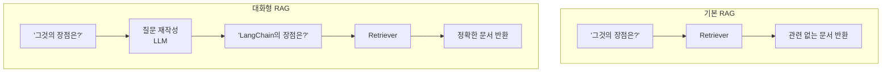
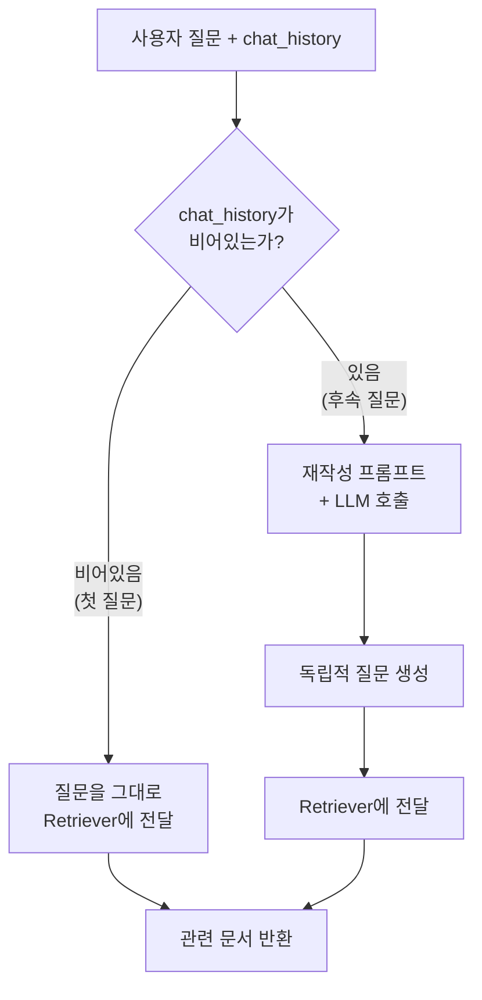
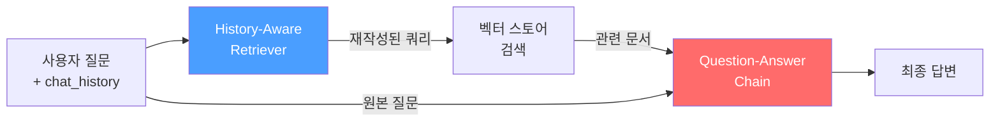
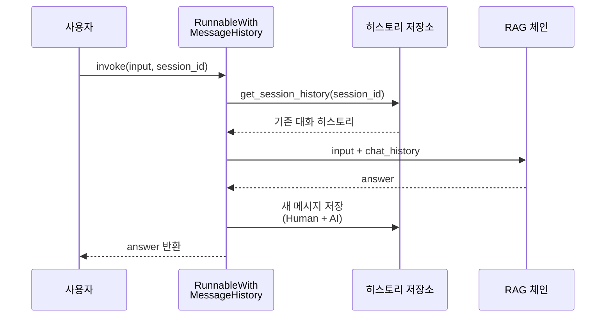
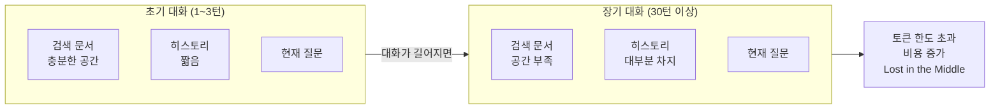

# 대화형 RAG

> 기억하는 RAG — 대화 히스토리를 활용해 멀티턴 질의응답이 가능한 RAG 시스템을 구축합니다.

## 개요

이 섹션에서는 기본 RAG 체인에 **대화 히스토리**를 추가하여 사용자와 자연스러운 멀티턴 대화가 가능한 RAG 시스템을 구축합니다. 앞서 [기본 RAG 체인 구축](ch09/session_01.md)에서 만든 단발성 QA 체인을 확장하고, [RAG 프롬프트 최적화](ch09/session_02.md)에서 다룬 프롬프트 설계를 대화형으로 발전시킵니다.

**선수 지식**:
- `create_stuff_documents_chain`, `create_retrieval_chain`을 이용한 기본 RAG 체인 (Session 9.1)
- RAG 프롬프트 설계와 `with_structured_output` (Session 9.2)
- `ChatPromptTemplate`, `MessagesPlaceholder` (Chapter 3)
- LCEL 파이프 연산자와 `RunnablePassthrough` (Chapter 5)

**학습 목표**:
- `create_history_aware_retriever`의 내부 동작 원리를 이해할 수 있다
- 대화 히스토리를 활용한 **질문 재작성(Query Reformulation)** 기법을 구현할 수 있다
- `RunnableWithMessageHistory`로 세션 기반 대화 관리를 자동화할 수 있다
- 대화형 RAG에서 컨텍스트 윈도우 한계가 미치는 영향을 이해할 수 있다

## 왜 알아야 할까?

실제 사용자는 한 번의 질문으로 만족하지 않습니다. "이 회사의 매출이 얼마야?"라고 물은 뒤 "그럼 작년 대비 얼마나 늘었어?"라고 후속 질문을 던지죠. 이때 **"그럼"** 이 무엇을 가리키는지, **"작년 대비"** 가 어떤 맥락인지 시스템이 이해하지 못하면 대화는 무너집니다.

Session 9.1에서 만든 기본 RAG는 매 질문이 독립적입니다. "그것의 장점은?"이라고 물으면 "그것"이 무엇인지 모르기 때문에 엉뚱한 문서를 검색하게 되죠. 대화형 RAG는 이 문제를 해결합니다 — 이전 대화 맥락을 이해하고, 후속 질문을 독립적인 검색 쿼리로 재작성하여 정확한 문서를 찾아냅니다.

ChatGPT, Perplexity 같은 대화형 AI 서비스가 자연스러운 멀티턴 대화를 제공하는 것도 바로 이 기술 덕분입니다. 프로덕션 RAG 시스템에서 대화형 기능은 선택이 아닌 필수거든요.

## 핵심 개념

### 개념 1: 대화형 RAG의 핵심 문제 — "그것"을 아는 검색기

> 💡 **비유**: 카페에서 친구와 대화한다고 상상해보세요. "어제 그 영화 봤어?" — "응, 재밌더라" — "주인공이 누구야?" 이 세 번째 질문의 "주인공"은 첫 번째 질문의 "그 영화"에 달린 거잖아요. 우리는 자연스럽게 맥락을 이해하지만, 검색 엔진에 "주인공이 누구야?"만 던지면 아무 결과도 못 찾겠죠. 대화형 RAG는 마치 **옆에서 대화를 다 듣고 있던 비서**가 "어제 본 영화 X의 주인공이 누구인지 검색해드릴게요"라고 질문을 바꿔주는 것과 같습니다.

기본 RAG의 문제를 정리하면 이렇습니다:

| 시나리오 | 사용자 질문 | 기본 RAG가 검색하는 것 | 실제 의도 |
|---------|-----------|-------------------|---------| 
| 1턴 | "LangChain이 뭐야?" | "LangChain이 뭐야?" | LangChain 개요 |
| 2턴 | "그것의 장점은?" | "그것의 장점은?" ❌ | "LangChain의 장점은?" |
| 3턴 | "코드 예제 보여줘" | "코드 예제 보여줘" ❌ | "LangChain 장점 관련 코드 예제" |

후속 질문에는 **대명사**("그것", "이것"), **생략**("장점은?"), **암묵적 참조**("코드 예제") 같은 대화적 표현이 포함됩니다. 대화형 RAG는 이런 불완전한 질문을 **독립적인 검색 쿼리(Standalone Query)** 로 재작성하는 것이 핵심입니다.

> 📊 **그림 1**: 기본 RAG vs 대화형 RAG의 질문 처리 흐름




### 개념 2: `create_history_aware_retriever` — 질문 재작성 엔진

> 💡 **비유**: `create_history_aware_retriever`는 **동시통역사**와 비슷합니다. 회의에서 참석자가 "아까 그 제안은 어떻게 됐어요?"라고 하면, 통역사는 앞의 맥락을 파악해 "30분 전에 김 부장이 제안한 해외 진출 건의 진행 상황은 어떤가요?"로 풀어서 통역하죠. LLM이 바로 이 통역사 역할을 합니다.

`create_history_aware_retriever`는 LangChain이 제공하는 헬퍼 함수로, 내부적으로 `RunnableBranch`를 사용합니다. 동작 방식을 단계별로 살펴보면:

**대화 히스토리가 없을 때** (첫 번째 질문):
```
input → retriever → [문서들]
```

**대화 히스토리가 있을 때** (후속 질문):
```
(chat_history + input) → prompt → LLM → StrOutputParser → retriever → [문서들]
```

즉, 대화 히스토리가 있으면 LLM에게 "이 대화 맥락을 보고, 마지막 질문을 검색에 적합한 독립적 질문으로 바꿔줘"라고 요청합니다. 내부 소스 코드를 간략히 보면 이런 구조입니다:

> 📊 **그림 2**: create_history_aware_retriever 내부 동작 — RunnableBranch 분기




```python
from langchain.chains import create_history_aware_retriever
from langchain_core.prompts import ChatPromptTemplate, MessagesPlaceholder
from langchain_openai import ChatOpenAI

# LLM 초기화
llm = ChatOpenAI(model="gpt-4o", temperature=0)

# 질문 재작성 프롬프트
contextualize_q_prompt = ChatPromptTemplate.from_messages([
    ("system", 
     "주어진 대화 히스토리와 최신 사용자 질문을 바탕으로, "
     "대화 히스토리 없이도 이해할 수 있는 독립적인 질문을 만드세요. "
     "질문에 답하지 말고, 필요하다면 질문을 재구성하세요. "
     "그렇지 않으면 그대로 반환하세요."),
    MessagesPlaceholder("chat_history"),  # 대화 히스토리 삽입 위치
    ("human", "{input}"),                  # 최신 사용자 질문
])

# history-aware retriever 생성
history_aware_retriever = create_history_aware_retriever(
    llm,                        # 질문 재작성에 사용할 LLM
    retriever,                  # 기존 벡터 스토어 retriever
    contextualize_q_prompt      # 질문 재작성 프롬프트
)
```

> ⚠️ **흔한 오해**: `create_history_aware_retriever`가 대화 히스토리를 **저장**한다고 생각하기 쉽지만, 실제로는 히스토리를 저장하지 않습니다. 매 호출 시 `chat_history`를 입력으로 받아 질문을 재작성할 뿐이에요. 히스토리 **관리**는 별도의 메커니즘(`RunnableWithMessageHistory` 등)이 담당합니다.

### 개념 3: 대화형 RAG 체인 조립 — 세 개의 체인이 하나로

기본 RAG에서는 두 개의 체인(문서 결합 체인 + 검색 체인)을 조합했습니다. 대화형 RAG에서는 **세 개의 체인**이 협력합니다:

1. **History-Aware Retriever**: 대화 맥락을 반영한 검색
2. **Question-Answer Chain**: 검색된 문서 기반 답변 생성
3. **Retrieval Chain**: 위 두 체인을 연결하는 최종 파이프라인

> 📊 **그림 3**: 대화형 RAG 체인 조립 구조 — 세 개의 체인이 하나로




```python
from langchain.chains import create_retrieval_chain
from langchain.chains.combine_documents import create_stuff_documents_chain

# 1단계: history-aware retriever (위에서 생성)
# history_aware_retriever = create_history_aware_retriever(...)

# 2단계: 답변 생성 프롬프트 (대화 히스토리 포함)
qa_prompt = ChatPromptTemplate.from_messages([
    ("system", 
     "당신은 질의응답 도우미입니다. "
     "검색된 컨텍스트를 사용하여 질문에 답변하세요. "
     "답을 모르면 모른다고 말하세요. "
     "최대 세 문장으로 간결하게 답변하세요.\n\n"
     "{context}"),
    MessagesPlaceholder("chat_history"),  # 답변에도 대화 히스토리 반영
    ("human", "{input}"),
])

# 3단계: 문서 결합 체인
question_answer_chain = create_stuff_documents_chain(llm, qa_prompt)

# 4단계: 최종 대화형 RAG 체인
rag_chain = create_retrieval_chain(
    history_aware_retriever,   # 히스토리 인식 검색기
    question_answer_chain      # 답변 생성 체인
)
```

이 체인을 호출할 때는 `input`과 `chat_history`를 함께 전달합니다:

```python
from langchain_core.messages import HumanMessage, AIMessage

# 첫 번째 질문 (히스토리 없음)
result1 = rag_chain.invoke({
    "input": "LangChain이 뭐야?",
    "chat_history": []
})
print(result1["answer"])

# 두 번째 질문 (이전 대화 포함)
result2 = rag_chain.invoke({
    "input": "그것의 주요 특징은?",
    "chat_history": [
        HumanMessage(content="LangChain이 뭐야?"),
        AIMessage(content=result1["answer"])
    ]
})
print(result2["answer"])
# → "LangChain의 주요 특징은..." (맥락을 이해하고 정확히 답변)
```

### 개념 4: `RunnableWithMessageHistory` — 자동 히스토리 관리

위 코드처럼 매번 `chat_history` 리스트를 수동으로 관리하는 건 번거롭죠. `RunnableWithMessageHistory`는 이 과정을 자동화합니다. **세션 ID** 기반으로 대화 히스토리를 자동 저장·로드해주거든요.

> 💡 **비유**: 호텔 프런트 데스크를 생각해보세요. 손님이 체크인할 때 방 번호(세션 ID)를 받으면, 이후 "어제 요청한 모닝콜은 어떻게 됐어요?"라고 물을 때 프런트 직원이 그 방 번호의 기록을 알아서 찾아서 맥락을 파악하잖아요. `RunnableWithMessageHistory`가 바로 이 프런트 데스크 역할입니다.

> 📊 **그림 4**: RunnableWithMessageHistory의 세션 기반 히스토리 관리




```python
from langchain_core.runnables.history import RunnableWithMessageHistory
from langchain_community.chat_message_histories import ChatMessageHistory

# 세션별 히스토리 저장소 (메모리 기반)
store = {}

def get_session_history(session_id: str) -> ChatMessageHistory:
    """세션 ID로 대화 히스토리를 가져오거나 새로 생성합니다."""
    if session_id not in store:
        store[session_id] = ChatMessageHistory()
    return store[session_id]

# RunnableWithMessageHistory로 체인 감싸기
conversational_rag_chain = RunnableWithMessageHistory(
    rag_chain,                              # 기존 RAG 체인
    get_session_history,                    # 히스토리 팩토리 함수
    input_messages_key="input",             # 입력 키
    history_messages_key="chat_history",    # 히스토리 키
    output_messages_key="answer",           # 출력 키
)

# 이제 chat_history를 수동으로 관리할 필요 없음!
config = {"configurable": {"session_id": "user_123"}}

response1 = conversational_rag_chain.invoke(
    {"input": "LangChain이 뭐야?"},
    config=config,
)
print(response1["answer"])

# 같은 session_id로 호출하면 이전 대화를 자동으로 기억
response2 = conversational_rag_chain.invoke(
    {"input": "그것의 주요 특징은?"},
    config=config,
)
print(response2["answer"])
# → 이전 대화를 바탕으로 "LangChain의 주요 특징"을 정확히 검색하고 답변
```

핵심 파라미터를 정리하면:

| 파라미터 | 역할 | 예시 값 |
|---------|------|--------|
| `input_messages_key` | 사용자 입력을 담는 키 | `"input"` |
| `history_messages_key` | 히스토리가 주입되는 키 | `"chat_history"` |
| `output_messages_key` | 출력에서 히스토리에 저장할 키 | `"answer"` |

### 개념 5: 컨텍스트 윈도우와 히스토리 — 왜 관리가 필요한가

LLM에는 컨텍스트 윈도우(Context Window) 제한이 있습니다. GPT-4o는 128K 토큰, Claude는 200K 토큰까지 처리할 수 있지만, 대화가 길어지면 결국 한계에 도달하죠. 더구나 RAG에서는 **검색된 문서 + 대화 히스토리 + 현재 질문**이 모두 컨텍스트에 들어가야 하므로, 히스토리가 무한정 쌓이면 문제가 생깁니다.

> 💡 **비유**: 책상 위의 작업 공간을 떠올려보세요. 책상 크기(컨텍스트 윈도우)는 정해져 있는데, 참고 서류(검색된 문서)도 올려야 하고 회의록(대화 히스토리)도 펼쳐야 합니다. 서류가 너무 쌓이면 정작 지금 작업할 공간이 없어지겠죠? 오래된 회의록은 핵심만 요약해서 정리하거나, 최근 것만 남기는 전략이 필요합니다.

대화형 RAG를 구축할 때 이 문제를 인식하는 것이 중요합니다. 대표적인 히스토리 관리 전략으로는 **슬라이딩 윈도우**(최근 N턴만 유지), **토큰 수 기반 트리밍**, **요약 기반 압축** 등이 있습니다. 이러한 전략의 구체적인 구현 방법과 각 전략의 장단점 비교는 [Chapter 10 — 메모리와 상태 관리](ch10/session_02.md)에서 상세히 다루므로, 여기서는 대화형 RAG가 왜 히스토리 관리를 필요로 하는지 이해하는 데 집중하겠습니다.

핵심은 이것입니다 — 대화형 RAG에서 히스토리가 과도하게 쌓이면 세 가지 문제가 발생합니다:

> 📊 **그림 5**: 컨텍스트 윈도우 내 공간 경쟁 — 히스토리가 쌓일수록 문서 공간이 줄어듦




| 문제 | 설명 |
|------|------|
| **토큰 한도 초과** | 검색 문서 + 히스토리 + 질문이 모델의 컨텍스트 윈도우를 넘어선다 |
| **비용 증가** | 매 요청마다 전체 히스토리를 전송하므로 API 호출 비용이 기하급수적으로 늘어난다 |
| **Lost in the Middle** | 히스토리가 길어지면 모델이 중간 부분의 정보를 무시하는 현상이 발생한다 |


## 실습: 직접 해보기

실제로 동작하는 완전한 대화형 RAG 시스템을 구축해봅시다. 여기서는 간단한 텍스트 문서를 기반으로 멀티턴 대화가 가능한 시스템을 만듭니다.

```python
"""
대화형 RAG 시스템 실습
- create_history_aware_retriever로 질문 재작성
- RunnableWithMessageHistory로 자동 세션 관리
"""

import os
from dotenv import load_dotenv

load_dotenv()

# === 1. 필수 임포트 ===
from langchain_openai import ChatOpenAI, OpenAIEmbeddings
from langchain_core.prompts import ChatPromptTemplate, MessagesPlaceholder
from langchain_core.runnables.history import RunnableWithMessageHistory
from langchain_community.chat_message_histories import ChatMessageHistory
from langchain_community.vectorstores import FAISS
from langchain_text_splitters import RecursiveCharacterTextSplitter
from langchain.chains import create_history_aware_retriever, create_retrieval_chain
from langchain.chains.combine_documents import create_stuff_documents_chain
from langchain_core.documents import Document

# === 2. 샘플 문서 준비 ===
# 실제로는 PDF, 웹 페이지 등에서 로드하지만 여기서는 샘플 사용
documents = [
    Document(
        page_content=(
            "LangChain은 LLM 기반 애플리케이션 개발을 위한 오픈소스 프레임워크입니다. "
            "2022년 10월 Harrison Chase가 처음 공개했으며, "
            "프롬프트 관리, 체인 구성, 에이전트 빌딩 등 다양한 기능을 제공합니다. "
            "Python과 JavaScript/TypeScript를 지원합니다."
        ),
        metadata={"source": "langchain_overview.md", "section": "소개"},
    ),
    Document(
        page_content=(
            "LangChain의 주요 특징으로는 LCEL(LangChain Expression Language), "
            "다양한 LLM 프로바이더 통합, RAG 파이프라인 지원, "
            "에이전트 시스템, LangSmith를 통한 관찰 가능성이 있습니다. "
            "LCEL은 파이프 연산자(|)를 사용한 선언적 체인 구성을 가능하게 합니다."
        ),
        metadata={"source": "langchain_features.md", "section": "주요 특징"},
    ),
    Document(
        page_content=(
            "LangGraph는 LangChain 생태계의 확장 라이브러리로, "
            "상태 기반 그래프를 사용하여 복잡한 에이전트 워크플로우를 구축합니다. "
            "노드와 엣지로 구성된 StateGraph를 통해 조건부 분기, "
            "반복, Human-in-the-Loop 등의 패턴을 구현할 수 있습니다."
        ),
        metadata={"source": "langgraph_intro.md", "section": "LangGraph 소개"},
    ),
    Document(
        page_content=(
            "LangSmith는 LangChain 애플리케이션의 관찰 가능성 플랫폼입니다. "
            "트레이싱으로 각 단계의 입출력을 추적하고, "
            "프롬프트 테스트, 평가 데이터셋 관리, 성능 모니터링 기능을 제공합니다. "
            "프로덕션 환경에서 LLM 애플리케이션의 품질 관리에 필수적입니다."
        ),
        metadata={"source": "langsmith_guide.md", "section": "LangSmith"},
    ),
]

# === 3. 벡터 스토어 구축 ===
text_splitter = RecursiveCharacterTextSplitter(
    chunk_size=500,
    chunk_overlap=50,
)
splits = text_splitter.split_documents(documents)

embeddings = OpenAIEmbeddings(model="text-embedding-3-small")
vectorstore = FAISS.from_documents(splits, embeddings)
retriever = vectorstore.as_retriever(search_kwargs={"k": 3})

# === 4. LLM 초기화 ===
llm = ChatOpenAI(model="gpt-4o", temperature=0)

# === 5. 질문 재작성 프롬프트 ===
contextualize_q_system_prompt = (
    "주어진 대화 히스토리와 최신 사용자 질문을 바탕으로, "
    "대화 히스토리를 참조할 수 있는 질문이라면 "
    "대화 히스토리 없이도 이해할 수 있는 독립적인 질문으로 재구성하세요. "
    "질문에 답하지 마세요. 필요하면 재구성하고, "
    "아니면 그대로 반환하세요."
)

contextualize_q_prompt = ChatPromptTemplate.from_messages([
    ("system", contextualize_q_system_prompt),
    MessagesPlaceholder("chat_history"),
    ("human", "{input}"),
])

# === 6. History-Aware Retriever 생성 ===
history_aware_retriever = create_history_aware_retriever(
    llm, retriever, contextualize_q_prompt
)

# === 7. 답변 생성 프롬프트 ===
qa_system_prompt = (
    "당신은 기술 문서 기반 질의응답 도우미입니다. "
    "검색된 컨텍스트를 사용하여 질문에 정확하게 답변하세요. "
    "컨텍스트에서 답을 찾을 수 없으면 솔직히 모른다고 말하세요. "
    "답변은 간결하되 핵심을 빠뜨리지 마세요.\n\n"
    "컨텍스트:\n{context}"
)

qa_prompt = ChatPromptTemplate.from_messages([
    ("system", qa_system_prompt),
    MessagesPlaceholder("chat_history"),
    ("human", "{input}"),
])

# === 8. 대화형 RAG 체인 조립 ===
question_answer_chain = create_stuff_documents_chain(llm, qa_prompt)
rag_chain = create_retrieval_chain(history_aware_retriever, question_answer_chain)

# === 9. 세션 기반 히스토리 관리 ===
store: dict[str, ChatMessageHistory] = {}

def get_session_history(session_id: str) -> ChatMessageHistory:
    """세션 ID별 대화 히스토리를 반환합니다."""
    if session_id not in store:
        store[session_id] = ChatMessageHistory()
    return store[session_id]

conversational_rag = RunnableWithMessageHistory(
    rag_chain,
    get_session_history,
    input_messages_key="input",
    history_messages_key="chat_history",
    output_messages_key="answer",
)

# === 10. 대화 테스트 ===
config = {"configurable": {"session_id": "demo_session_1"}}

# 1턴: 첫 질문
print("=" * 60)
print("[1턴] 사용자: LangChain이 뭐야?")
response1 = conversational_rag.invoke(
    {"input": "LangChain이 뭐야?"},
    config=config,
)
print(f"[1턴] AI: {response1['answer']}")
print(f"[검색된 문서 수]: {len(response1['context'])}")

# 2턴: 대명사를 사용한 후속 질문
print("\n" + "=" * 60)
print("[2턴] 사용자: 그것의 주요 특징은?")
response2 = conversational_rag.invoke(
    {"input": "그것의 주요 특징은?"},
    config=config,
)
print(f"[2턴] AI: {response2['answer']}")

# 3턴: 맥락을 이어가는 질문
print("\n" + "=" * 60)
print("[3턴] 사용자: 관련된 다른 도구도 있어?")
response3 = conversational_rag.invoke(
    {"input": "관련된 다른 도구도 있어?"},
    config=config,
)
print(f"[3턴] AI: {response3['answer']}")

# 히스토리 확인
print("\n" + "=" * 60)
print("[저장된 히스토리]")
for msg in store["demo_session_1"].messages:
    role = "Human" if msg.type == "human" else "AI"
    print(f"  {role}: {msg.content[:80]}...")

# === 11. 다른 세션 — 독립적인 대화 ===
config2 = {"configurable": {"session_id": "demo_session_2"}}
print("\n" + "=" * 60)
print("[새 세션] 사용자: LangSmith가 뭐야?")
response_new = conversational_rag.invoke(
    {"input": "LangSmith가 뭐야?"},
    config=config2,
)
print(f"[새 세션] AI: {response_new['answer']}")
# → 이전 세션의 대화와 완전히 독립적
```

**예상 출력:**
```
============================================================
[1턴] 사용자: LangChain이 뭐야?
[1턴] AI: LangChain은 LLM 기반 애플리케이션 개발을 위한 오픈소스 프레임워크입니다. 
2022년 10월 Harrison Chase가 처음 공개했으며, 프롬프트 관리, 체인 구성, 
에이전트 빌딩 등 다양한 기능을 제공합니다.
[검색된 문서 수]: 3

============================================================
[2턴] 사용자: 그것의 주요 특징은?
[2턴] AI: LangChain의 주요 특징으로는 LCEL, 다양한 LLM 프로바이더 통합, 
RAG 파이프라인 지원, 에이전트 시스템, LangSmith를 통한 관찰 가능성이 있습니다.

============================================================
[3턴] 사용자: 관련된 다른 도구도 있어?
[3턴] AI: LangChain 생태계에는 LangGraph와 LangSmith가 있습니다. 
LangGraph는 상태 기반 그래프로 복잡한 에이전트 워크플로우를 구축하며,
LangSmith는 트레이싱과 평가를 위한 관찰 가능성 플랫폼입니다.
```

## 더 깊이 알아보기

### 질문 재작성(Query Reformulation)의 역사

질문 재작성은 RAG 이전, 정보 검색(Information Retrieval) 분야에서 오래 연구된 주제입니다. 1990년대 검색 엔진 시대부터 **쿼리 확장(Query Expansion)** 이라는 이름으로 연구되었죠. 사용자의 짧고 모호한 검색어를 더 풍부하게 확장하여 검색 품질을 높이는 기법이었습니다.

대화형 검색에서의 질문 재작성은 2019년 TREC CAsT(Conversational Assistance Track)가 중요한 전환점이 됩니다. 이 대회에서 참가팀들은 대화 맥락을 반영해 질문을 재작성하는 기법들을 본격적으로 연구했는데요, 당시에는 규칙 기반이나 BERT 같은 사전학습 모델을 사용했습니다. 지금은 GPT-4 같은 LLM이 이 역할을 훨씬 자연스럽게 해내고 있죠.

LangChain의 대화형 RAG도 이 전통 위에 서 있습니다. 초기에는 `ConversationalRetrievalChain`이라는 단일 클래스로 제공됐지만, LCEL의 등장 이후 `create_history_aware_retriever` + `create_retrieval_chain` 조합으로 재설계되었습니다. 모듈화된 설계 덕분에 각 단계를 독립적으로 교체하거나 커스터마이징할 수 있게 된 거죠.

### `ConversationalRetrievalChain` → 현대적 접근법

`ConversationalRetrievalChain`은 LangChain 초기부터 존재한 레거시 체인입니다. 사용이 간편했지만, 내부 동작을 커스터마이징하기 어려웠죠. LangChain 팀은 이를 **deprecated**(사용 중단 예정)로 표시하고, `create_history_aware_retriever` + `create_stuff_documents_chain` + `create_retrieval_chain`의 조합을 권장합니다. 새로운 접근법은 각 컴포넌트를 레고 블록처럼 교체할 수 있어, 프로덕션 환경에서 훨씬 유연합니다.

## 흔한 오해와 팁

> ⚠️ **흔한 오해**: "대화 히스토리를 전부 프롬프트에 넣으면 되지 않나요?" — 그렇게 하면 컨텍스트 윈도우를 빠르게 소진합니다. 50턴 대화의 히스토리만 해도 수천 토큰이고, 여기에 검색된 문서까지 더하면 토큰 제한에 금방 걸립니다. 또한 히스토리가 길어질수록 **Lost in the Middle** 현상으로 중간에 있는 정보를 모델이 무시하는 문제도 생깁니다. 프로덕션에서는 히스토리 관리 전략이 필수인데, 슬라이딩 윈도우·토큰 트리밍·요약 압축 등의 구체적인 기법은 [Chapter 10 — 메모리와 상태 관리](ch10/session_02.md)에서 상세히 다룹니다.

> 💡 **알고 계셨나요?**: `create_history_aware_retriever`의 내부 구현을 보면, `chat_history`가 빈 리스트일 때는 LLM을 거치지 않고 입력을 바로 retriever에 전달합니다. `RunnableBranch`를 사용한 조건 분기인데요, 이 덕분에 첫 번째 질문에서는 불필요한 LLM 호출 비용이 들지 않습니다. 사소해 보이지만 프로덕션에서 수천 건의 요청을 처리할 때 비용 절감 효과가 크죠.

> 🔥 **실무 팁**: 질문 재작성 프롬프트는 **"질문에 답하지 말고 질문만 재구성하라"** 는 지시를 반드시 포함하세요. 이 지시가 없으면 LLM이 질문에 답변해버리고, 그 답변 텍스트가 retriever에 검색 쿼리로 들어가서 엉뚱한 결과가 나옵니다. 또한, 재작성된 질문이 실제로 어떻게 변환되는지 확인하려면 `history_aware_retriever`를 직접 invoke하고 중간 결과를 LangSmith로 트레이싱해보세요.

> 🔥 **실무 팁**: `RunnableWithMessageHistory`의 히스토리 저장소로 딕셔너리(`store = {}`)를 사용하면 서버 재시작 시 히스토리가 날아갑니다. 프로덕션에서는 Redis(`RedisChatMessageHistory`)나 PostgreSQL(`PostgresChatMessageHistory`) 같은 영속성 있는 저장소를 사용하세요.

## 핵심 정리

| 개념 | 설명 |
|------|------|
| `create_history_aware_retriever` | 대화 히스토리를 반영해 질문을 재작성하는 검색기. 내부적으로 `RunnableBranch`를 사용하여 히스토리 유무에 따라 분기한다 |
| 질문 재작성 (Query Reformulation) | "그것의 장점은?" → "LangChain의 장점은?"처럼 후속 질문을 독립적 검색 쿼리로 변환하는 기법 |
| `RunnableWithMessageHistory` | 세션 ID 기반으로 대화 히스토리를 자동 저장·로드하는 LCEL 래퍼 |
| `ChatMessageHistory` | 메시지 리스트를 관리하는 히스토리 저장소. 메모리, Redis, PostgreSQL 등 다양한 백엔드 지원 |
| `MessagesPlaceholder` | 프롬프트 템플릿에서 대화 히스토리 메시지가 삽입될 위치를 지정하는 플레이스홀더 |
| 컨텍스트 윈도우 관리 | 대화가 길어지면 토큰 한도·비용·정확도 문제가 발생하며, 구체적 관리 전략은 Ch10에서 다룬다 |

## 다음 섹션 미리보기

이번 섹션에서 대화형 RAG의 기본 구조를 완성했습니다. 하지만 RAG의 품질은 결국 **얼마나 좋은 문서를 검색하느냐**에 달려 있습니다. 다음 섹션에서는 **RAG 성능 평가와 최적화** — 검색 정확도와 답변 품질을 체계적으로 측정하고, 청킹 전략, 검색 파라미터 튜닝, 리랭킹(Reranking) 등으로 RAG 성능을 끌어올리는 기법을 다룹니다.

## 참고 자료

- [Build a Retrieval Augmented Generation (RAG) App: Part 2 — LangChain 공식 튜토리얼](https://python.langchain.com/docs/tutorials/qa_chat_history/) - 대화형 RAG의 공식 가이드로, `create_history_aware_retriever`와 `RunnableWithMessageHistory` 사용법을 단계별로 설명합니다
- [create_history_aware_retriever API 문서](https://api.python.langchain.com/en/latest/chains/langchain.chains.history_aware_retriever.create_history_aware_retriever.html) - 함수 시그니처, 파라미터, 소스 코드를 확인할 수 있는 공식 API 레퍼런스
- [RunnableWithMessageHistory API 문서](https://python.langchain.com/api_reference/core/runnables/langchain_core.runnables.history.RunnableWithMessageHistory.html) - 세션 기반 히스토리 자동 관리의 공식 문서
- [How a history-aware retriever works? — DEV Community](https://dev.to/guilhermecxe/how-a-history-aware-retriever-works-5e07) - 내부 `RunnableBranch` 동작 원리를 시각적으로 잘 설명한 글
- [Conversational RAG Chatbot — Build a Chatbot with LangChain and Chainlit](https://stonefishy.github.io/2025/02/27/conversational-rag-chatbot-build-a-chatbot-with-langchain/) - 2025년 기준 대화형 RAG 챗봇 구축 실전 튜토리얼

---
### 🔗 Related Sessions
- [chatprompttemplate](../01-langchain-소개와-개발-환경-설정/04-첫-번째-langchain-애플리케이션.md) (prerequisite)
- [rag_pipeline](../09-ragretrieval-augmented-generation-구축/01-기본-rag-체인-구축.md) (prerequisite)
- [format_docs](../09-ragretrieval-augmented-generation-구축/01-기본-rag-체인-구축.md) (prerequisite)
