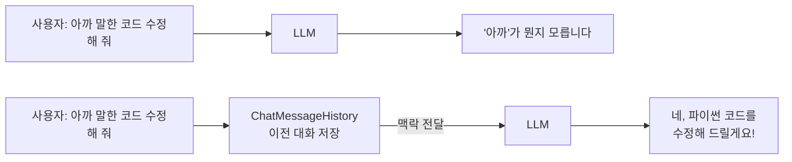
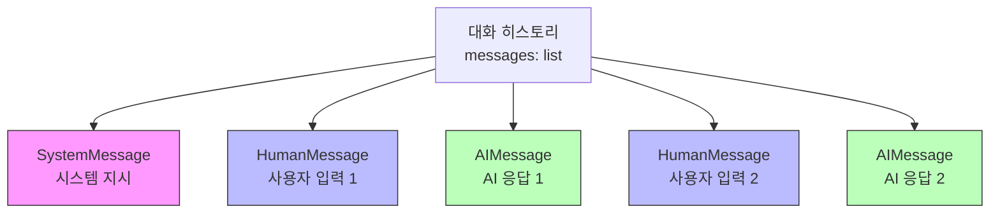
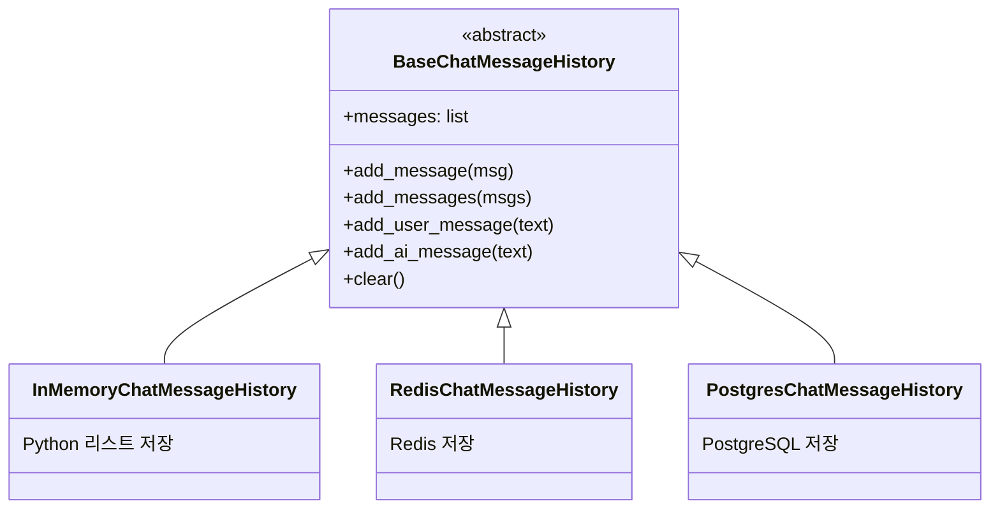
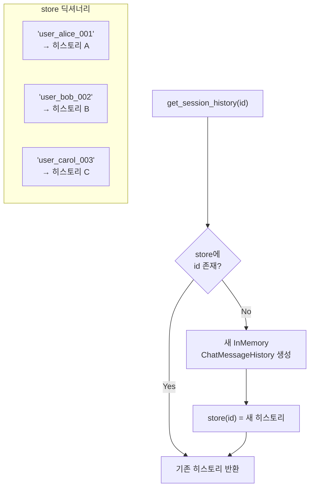
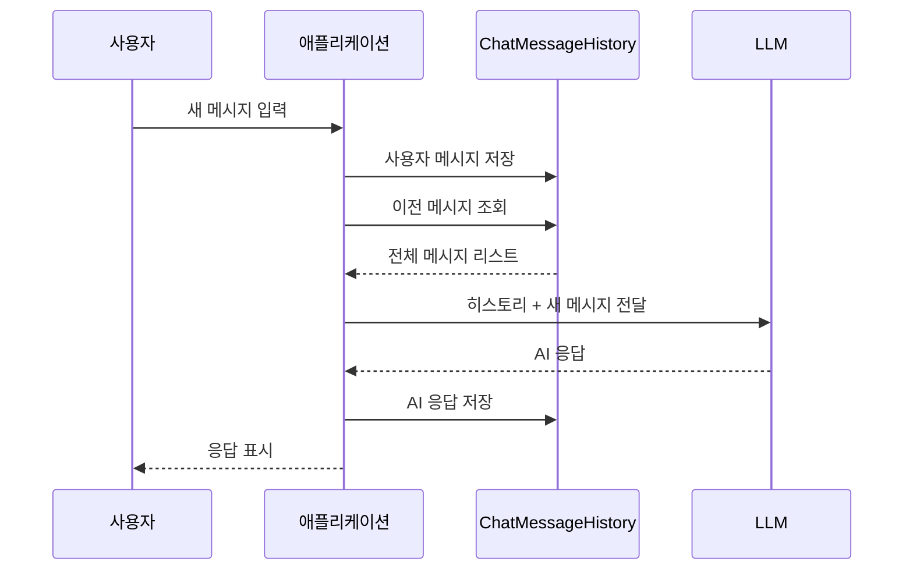

# 메시지 히스토리 기초

> LangChain에서 대화의 맥락을 기억하는 첫 번째 단계, 메시지 히스토리의 구조와 사용법을 알아봅니다.

## 개요

이 섹션에서는 LangChain 애플리케이션에서 대화 히스토리를 저장하고 관리하는 핵심 인터페이스인 `BaseChatMessageHistory`와 그 인메모리 구현체 `InMemoryChatMessageHistory`를 학습합니다. 이전 챕터에서 다룬 Chain(체인)과 LCEL 파이프라인이 **한 번의 호출**에 집중했다면, 이번 챕터부터는 **여러 번의 호출을 하나의 대화로 연결**하는 방법을 다룹니다.

특히 [Ch9.3: 대화형 RAG](ch09/session3)에서 구축한 대화형 RAG 시스템을 떠올려 보세요. 사용자가 "이전에 검색한 문서에서 두 번째 항목을 더 자세히 설명해 줘"라고 요청할 때, 시스템이 이전 대화 맥락을 기억해야만 정확한 응답이 가능했습니다. 이 챕터에서 배우는 메모리 관리 기법들은 바로 그런 **대화형 RAG의 맥락 유지 품질을 결정짓는 핵심 기반**입니다. 히스토리를 얼마나 효율적으로 저장하고, 얼마나 적절하게 트리밍하느냐에 따라 RAG 시스템의 응답 정확도와 사용자 경험이 크게 달라지거든요.

**선수 지식**: [Ch5: LCEL 마스터](ch05)에서 배운 Runnable 인터페이스와 파이프 연산자(`|`) 사용법, [Ch2: LLM과 Chat Model](ch02)에서 배운 메시지 타입(`HumanMessage`, `AIMessage`, `SystemMessage`), [Ch9: RAG 구축](ch09)에서 배운 검색-생성 파이프라인의 기본 구조
**학습 목표**:
- `BaseChatMessageHistory` 인터페이스의 설계 철학과 핵심 메서드를 이해한다
- `InMemoryChatMessageHistory`를 사용하여 대화 히스토리를 저장하고 조회할 수 있다
- 메시지 추가, 조회, 초기화의 전체 생명주기를 코드로 구현할 수 있다
- 메모리 관리가 대화형 RAG 등 멀티턴 시스템의 품질에 미치는 영향을 이해한다

## 왜 알아야 할까?

카페에서 단골 바리스타와 대화하는 장면을 떠올려 보세요. "지난번에 시킨 거요"라고 말하면, 바리스타는 여러분이 이전에 주문했던 아이스 아메리카노를 기억하고 바로 만들어 줍니다. 만약 바리스타가 매번 기억을 잃는다면? 매번 처음부터 주문을 설명해야 할 거예요.

LLM도 마찬가지입니다. 기본적으로 LLM은 **무상태(stateless)** 입니다. 이전 대화를 전혀 기억하지 못하죠. 사용자가 "아까 말한 코드를 수정해 줘"라고 요청하면, LLM은 "아까 말한 코드"가 무엇인지 전혀 알 수 없습니다. 이 문제를 해결하려면 **대화 히스토리를 외부에 저장하고, 매 호출마다 LLM에게 전달**해야 합니다.

> 📊 **그림 1**: 무상태 LLM의 문제와 히스토리 저장소의 역할




이 문제가 가장 극명하게 드러나는 곳이 바로 [Ch9.3](ch09/session3)에서 구축한 **대화형 RAG 시스템**입니다. 단발성 질문-답변이라면 히스토리가 필요 없겠지만, 사용자가 "방금 검색한 내용에서 3번 항목 좀 더 설명해 줘"라든가 "아까 말한 것과 반대되는 사례도 찾아줘"처럼 **이전 검색 결과와 대화 맥락을 참조하는 후속 질문**을 던질 때, 히스토리 없이는 제대로 된 응답이 불가능합니다. 메모리 관리는 RAG의 검색 품질과 응답 일관성을 좌우하는 핵심 요소인 셈이죠.

`ChatMessageHistory`는 바로 이 "바리스타의 기억 노트"에 해당합니다. 고객 서비스 챗봇, 개인 비서, 코드 리뷰 도우미, 그리고 대화형 RAG 시스템 등 거의 모든 대화형 AI 애플리케이션에서 필수적인 컴포넌트거든요. 이 기초를 제대로 이해해야 이후 섹션에서 다룰 영구 저장소 연동, 토큰 관리, 멀티턴 시스템 구축이 수월해집니다.

## 핵심 개념

### 개념 1: 메시지 — 대화의 기본 단위

> 💡 **비유**: 메시지는 카카오톡 채팅방의 **말풍선 하나하나**와 같습니다. 보낸 사람(나/상대방/시스템 공지)에 따라 말풍선 색깔이 다르듯, LangChain 메시지도 역할(role)에 따라 타입이 나뉩니다.

LangChain에서 대화는 메시지 객체의 리스트로 표현됩니다. [Ch2: LLM과 Chat Model](ch02)에서 배운 것처럼, 핵심 메시지 타입은 세 가지입니다:

| 메시지 타입 | 역할 | 비유 |
|------------|------|------|
| `SystemMessage` | 시스템 지시 | 채팅방 공지사항 |
| `HumanMessage` | 사용자 입력 | 내가 보낸 말풍선 |
| `AIMessage` | LLM 응답 | 상대가 보낸 말풍선 |

```python
from langchain_core.messages import HumanMessage, AIMessage, SystemMessage

# 대화 흐름 예시
messages = [
    SystemMessage(content="당신은 친절한 요리 도우미입니다."),  # 시스템 지시
    HumanMessage(content="김치찌개 레시피 알려줘"),              # 사용자 질문
    AIMessage(content="김치찌개 레시피를 알려드릴게요! ..."),     # AI 응답
    HumanMessage(content="양을 2인분으로 줄여줘"),               # 후속 질문
    AIMessage(content="2인분 기준으로 조정하면 ..."),            # 후속 응답
]
```

이 메시지 리스트가 바로 대화의 **히스토리**입니다. 핵심은, 이 리스트를 **어딘가에 저장하고 관리하는 체계**가 필요하다는 것이죠. 그것이 `ChatMessageHistory`의 역할입니다.

> 📊 **그림 2**: LangChain 메시지 타입과 대화 구조




### 개념 2: BaseChatMessageHistory — 메모리의 설계도

> 💡 **비유**: `BaseChatMessageHistory`는 노트 앱의 **인터페이스 규격**과 같습니다. 노션이든, 메모장이든, 구글 킵이든 — "메모 추가", "메모 읽기", "메모 전체 삭제" 기능은 반드시 있어야 하죠. 구체적인 저장 방식(클라우드, 로컬 파일, 데이터베이스)만 다를 뿐입니다.

> 📊 **그림 3**: BaseChatMessageHistory 인터페이스와 구현체 계층




`BaseChatMessageHistory`는 `langchain_core.chat_history` 모듈에 있는 **추상 기본 클래스(ABC)** 입니다. 이 클래스는 "대화 히스토리 저장소는 이런 기능을 반드시 갖춰야 한다"는 계약(contract)을 정의합니다.

핵심 메서드를 살펴보겠습니다:

| 메서드 | 설명 | 비유 |
|--------|------|------|
| `messages` | 저장된 모든 메시지를 리스트로 반환 | 노트 전체 읽기 |
| `add_message(message)` | 메시지 1개 추가 | 한 줄 메모 추가 |
| `add_messages(messages)` | 메시지 여러 개를 한번에 추가 | 여러 줄 한꺼번에 붙여넣기 |
| `add_user_message(message)` | 사용자 메시지 편의 메서드 | "나" 라벨 메모 추가 |
| `add_ai_message(message)` | AI 메시지 편의 메서드 | "AI" 라벨 메모 추가 |
| `clear()` | 모든 메시지 삭제 | 노트 전체 비우기 |

```python
from langchain_core.chat_history import BaseChatMessageHistory

# BaseChatMessageHistory는 추상 클래스이므로 직접 인스턴스화할 수 없습니다
# 아래는 인터페이스 구조를 이해하기 위한 의사 코드입니다

class MyCustomHistory(BaseChatMessageHistory):
    """커스텀 히스토리 저장소 — 반드시 아래 메서드를 구현해야 합니다."""

    @property
    def messages(self) -> list:
        """저장된 메시지를 반환"""
        ...

    def add_message(self, message) -> None:
        """메시지 하나를 저장"""
        ...

    def clear(self) -> None:
        """모든 메시지를 삭제"""
        ...
```

> ⚠️ **흔한 오해**: `add_message()`와 `add_messages()`를 혼동하는 경우가 많습니다. 공식 문서에서는 **`add_messages()`(복수형)를 권장**합니다. 단일 메시지를 추가할 때도 `add_messages([msg])` 형태를 사용하면, 데이터베이스나 외부 저장소를 사용할 때 네트워크 왕복(round-trip)을 줄일 수 있거든요.

### 개념 3: InMemoryChatMessageHistory — 가장 간단한 메모리

> 💡 **비유**: `InMemoryChatMessageHistory`는 **포스트잇에 메모하는 것**과 같습니다. 빠르고 간편하지만, 포스트잇을 버리면(프로그램을 종료하면) 내용이 사라집니다. 중요한 회의록이라면 노트에 제대로 적겠지만, 빠른 메모에는 포스트잇이 딱이죠.

`InMemoryChatMessageHistory`는 `BaseChatMessageHistory`의 가장 기본적인 구현체입니다. 이름 그대로 메시지를 **파이썬 리스트(메모리)** 에 저장합니다. 프로세스가 종료되면 데이터가 사라지므로, 주로 **개발/테스트 단계**에서 사용하거나, 단일 세션 챗봇에 활용합니다.

```python
from langchain_core.chat_history import InMemoryChatMessageHistory

# 1. 히스토리 객체 생성
history = InMemoryChatMessageHistory()

# 2. 사용자 메시지 추가 (편의 메서드)
history.add_user_message("안녕하세요! 파이썬 질문이 있어요.")

# 3. AI 메시지 추가 (편의 메서드)
history.add_ai_message("안녕하세요! 어떤 질문이든 도와드릴게요.")

# 4. 저장된 메시지 확인
for msg in history.messages:
    print(f"[{msg.type}] {msg.content}")
# 출력:
# [human] 안녕하세요! 파이썬 질문이 있어요.
# [ai] 안녕하세요! 어떤 질문이든 도와드릴게요.

# 5. 메시지 개수 확인
print(f"저장된 메시지 수: {len(history.messages)}")
# 출력: 저장된 메시지 수: 2
```

더 세밀한 제어가 필요할 때는 메시지 객체를 직접 만들어 추가할 수도 있습니다:

```python
from langchain_core.messages import HumanMessage, AIMessage, SystemMessage
from langchain_core.chat_history import InMemoryChatMessageHistory

history = InMemoryChatMessageHistory()

# 시스템 메시지도 추가 가능
history.add_message(SystemMessage(content="당신은 파이썬 전문가입니다."))

# 메타데이터가 포함된 메시지 추가
history.add_message(
    HumanMessage(
        content="데코레이터가 뭔가요?",
        additional_kwargs={"timestamp": "2025-01-15T10:30:00"}  # 메타데이터
    )
)

history.add_message(
    AIMessage(content="데코레이터는 함수를 감싸서 기능을 확장하는 문법이에요.")
)

# 전체 메시지 확인
for msg in history.messages:
    print(f"[{msg.type}] {msg.content[:30]}...")
# 출력:
# [system] 당신은 파이썬 전문가입니다....
# [human] 데코레이터가 뭔가요?...
# [ai] 데코레이터는 함수를 감싸서 기능을 확장하는...
```

### 개념 4: 멀티 세션 관리 — session_id 패턴

> 💡 **비유**: 병원 접수대를 생각해 보세요. 환자마다 **차트 번호**가 있어서, 같은 환자가 다시 방문하면 이전 진료 기록을 바로 꺼낼 수 있죠. `session_id`가 바로 이 차트 번호 역할을 합니다.

> 📊 **그림 4**: session_id 기반 멀티 세션 관리 구조




실제 서비스에서는 여러 사용자가 동시에 대화합니다. 각 사용자(또는 대화 세션)별로 히스토리를 분리 관리해야 하죠. 가장 기본적인 패턴은 **딕셔너리 + session_id** 조합입니다:

```python
from langchain_core.chat_history import InMemoryChatMessageHistory

# 세션별 히스토리를 저장하는 딕셔너리
store: dict[str, InMemoryChatMessageHistory] = {}

def get_session_history(session_id: str) -> InMemoryChatMessageHistory:
    """session_id에 해당하는 히스토리를 반환하거나 새로 생성합니다."""
    if session_id not in store:
        store[session_id] = InMemoryChatMessageHistory()
    return store[session_id]

# 사용자 A의 대화
history_a = get_session_history("user_alice_001")
history_a.add_user_message("React와 Vue 중 뭘 배울까요?")
history_a.add_ai_message("프로젝트 목적에 따라 다릅니다...")

# 사용자 B의 대화 (완전히 독립!)
history_b = get_session_history("user_bob_002")
history_b.add_user_message("FastAPI 튜토리얼 추천해 주세요")
history_b.add_ai_message("공식 문서부터 시작하는 걸 추천합니다...")

# 각 세션의 메시지 수 확인
print(f"Alice 메시지 수: {len(history_a.messages)}")  # 2
print(f"Bob 메시지 수: {len(history_b.messages)}")    # 2

# 기존 세션 이어가기
history_a_again = get_session_history("user_alice_001")
history_a_again.add_user_message("React로 결정했어요!")
print(f"Alice 총 메시지 수: {len(history_a_again.messages)}")  # 3
```

이 `get_session_history` 함수 패턴은 이후 섹션에서 배울 `RunnableWithMessageHistory`와 연결되는 핵심 패턴이니 꼭 기억해 두세요.

### 개념 5: 히스토리 초기화와 생명주기

대화를 종료하거나 새 대화를 시작할 때는 히스토리를 초기화해야 합니다:

```python
from langchain_core.chat_history import InMemoryChatMessageHistory

history = InMemoryChatMessageHistory()

# 대화 진행
history.add_user_message("오늘 날씨 어때?")
history.add_ai_message("맑고 화창한 날씨입니다!")
print(f"초기화 전: {len(history.messages)}개 메시지")  # 2

# 히스토리 초기화
history.clear()
print(f"초기화 후: {len(history.messages)}개 메시지")  # 0

# 새 대화 시작
history.add_user_message("새로운 주제로 대화하고 싶어요")
print(f"새 대화: {len(history.messages)}개 메시지")    # 1
```

> 🔥 **실무 팁**: 프로덕션 환경에서 `clear()`를 호출하기 전에 반드시 확인 로직을 넣으세요. 실수로 대화 히스토리를 날리면 사용자 경험에 치명적입니다. 서비스에서는 `clear()` 대신 **소프트 삭제**(삭제 플래그 설정)를 구현하는 경우도 많습니다.

## 실습: 직접 해보기

이제 배운 내용을 모두 조합하여, 간단한 **대화 기록 관리 시스템**을 만들어 봅시다. 이 시스템은 세션별 대화를 관리하고, 대화 내용을 보기 좋게 출력하는 기능을 제공합니다.

```python
"""
메시지 히스토리 실습 — 세션 기반 대화 기록 관리 시스템
실행 환경: Python 3.10+, langchain-core 설치 필요
pip install langchain-core
"""

from langchain_core.chat_history import InMemoryChatMessageHistory
from langchain_core.messages import HumanMessage, AIMessage, SystemMessage


# === 1. 세션 관리자 클래스 ===
class ConversationManager:
    """세션별 대화 히스토리를 관리하는 클래스"""

    def __init__(self):
        # session_id → InMemoryChatMessageHistory 매핑
        self._store: dict[str, InMemoryChatMessageHistory] = {}

    def get_history(self, session_id: str) -> InMemoryChatMessageHistory:
        """세션 히스토리를 가져오거나 새로 생성합니다."""
        if session_id not in self._store:
            self._store[session_id] = InMemoryChatMessageHistory()
        return self._store[session_id]

    def list_sessions(self) -> list[str]:
        """활성 세션 ID 목록을 반환합니다."""
        return list(self._store.keys())

    def delete_session(self, session_id: str) -> bool:
        """세션을 삭제합니다."""
        if session_id in self._store:
            del self._store[session_id]
            return True
        return False

    def print_conversation(self, session_id: str) -> None:
        """대화 내용을 보기 좋게 출력합니다."""
        history = self.get_history(session_id)
        print(f"\n{'='*50}")
        print(f"  세션: {session_id}")
        print(f"  메시지 수: {len(history.messages)}")
        print(f"{'='*50}")

        # 메시지 타입별 이모지 매핑
        type_labels = {
            "system": "🔧 시스템",
            "human": "👤 사용자",
            "ai": "🤖 AI",
        }

        for i, msg in enumerate(history.messages, 1):
            label = type_labels.get(msg.type, f"❓ {msg.type}")
            print(f"  [{i}] {label}: {msg.content}")

        print(f"{'='*50}\n")


# === 2. 실습 시나리오 실행 ===
def main():
    manager = ConversationManager()

    # 시나리오 1: 기본 대화 기록
    print("📌 시나리오 1: 기본 대화 기록")
    h1 = manager.get_history("session_001")
    h1.add_message(SystemMessage(content="당신은 Python 튜터입니다."))
    h1.add_user_message("리스트 컴프리헨션이 뭔가요?")
    h1.add_ai_message(
        "리스트 컴프리헨션은 리스트를 간결하게 생성하는 파이썬 문법입니다. "
        "예: [x**2 for x in range(10)]"
    )
    h1.add_user_message("일반 for문보다 빠른가요?")
    h1.add_ai_message(
        "네, 일반적으로 리스트 컴프리헨션이 for문보다 약간 더 빠릅니다. "
        "C로 최적화된 내부 루프를 사용하기 때문이에요."
    )
    manager.print_conversation("session_001")

    # 시나리오 2: 독립적인 세션
    print("📌 시나리오 2: 독립적인 두 번째 세션")
    h2 = manager.get_history("session_002")
    h2.add_user_message("Django vs FastAPI 차이점은?")
    h2.add_ai_message("Django는 풀스택, FastAPI는 경량 API 프레임워크입니다.")
    manager.print_conversation("session_002")

    # 시나리오 3: 세션 목록 관리
    print("📌 시나리오 3: 세션 관리")
    print(f"  활성 세션: {manager.list_sessions()}")
    # 출력: 활성 세션: ['session_001', 'session_002']

    # 시나리오 4: 히스토리 초기화
    print("\n📌 시나리오 4: 히스토리 초기화")
    h1 = manager.get_history("session_001")
    print(f"  초기화 전 메시지 수: {len(h1.messages)}")  # 5
    h1.clear()
    print(f"  초기화 후 메시지 수: {len(h1.messages)}")  # 0

    # 시나리오 5: 메시지를 한꺼번에 추가 (add_messages)
    print("\n📌 시나리오 5: 벌크 메시지 추가")
    h3 = manager.get_history("session_003")
    bulk_messages = [
        SystemMessage(content="당신은 데이터 분석가입니다."),
        HumanMessage(content="pandas에서 groupby 사용법을 알려주세요."),
        AIMessage(content="df.groupby('column').agg(func) 형태로 사용합니다."),
    ]
    h3.add_messages(bulk_messages)  # 한 번에 3개 메시지 추가
    print(f"  벌크 추가 후 메시지 수: {len(h3.messages)}")  # 3
    manager.print_conversation("session_003")


if __name__ == "__main__":
    main()
```

위 코드를 실행하면 다음과 같은 출력을 확인할 수 있습니다:

```
📌 시나리오 1: 기본 대화 기록
==================================================
  세션: session_001
  메시지 수: 5
==================================================
  [1] 🔧 시스템: 당신은 Python 튜터입니다.
  [2] 👤 사용자: 리스트 컴프리헨션이 뭔가요?
  [3] 🤖 AI: 리스트 컴프리헨션은 리스트를 간결하게 생성하는 파이썬 문법입니다. ...
  [4] 👤 사용자: 일반 for문보다 빠른가요?
  [5] 🤖 AI: 네, 일반적으로 리스트 컴프리헨션이 for문보다 약간 더 빠릅니다. ...
==================================================
```

## 더 깊이 알아보기

### 대화 히스토리의 탄생 배경

LLM 기반 챗봇에서 메모리 관리가 본격적으로 논의된 건 2022~2023년, ChatGPT 열풍과 함께였습니다. 그 이전의 NLP 챗봇(예: 규칙 기반, seq2seq 모델)은 대화 상태를 모델 내부에 인코딩하거나, 별도의 상태 머신으로 관리했거든요.

그런데 GPT-3.5, GPT-4 같은 대규모 언어 모델은 근본적으로 **무상태(stateless) API** 입니다. 매 요청마다 이전 대화를 **프롬프트에 통째로 넣어야** 맥락을 이해합니다. LangChain 창시자 Harrison Chase는 이 문제를 체계적으로 해결하기 위해, 2023년 초 LangChain에 `Memory` 추상화를 도입했습니다.

초기 LangChain(v0.0.x)에서는 `ConversationBufferMemory`, `ConversationSummaryMemory` 등의 `Memory` 클래스를 사용했습니다. 하지만 LCEL이 도입되면서, 더 유연한 **`ChatMessageHistory` + `RunnableWithMessageHistory`** 패턴으로 아키텍처가 진화했죠. 기존 `Memory` 클래스들은 레거시로 분류되었고, 현재 LangChain 공식 문서에서는 `ChatMessageHistory` 기반 접근을 권장합니다.

> 💡 **알고 계셨나요?**: LangChain이라는 이름은 "Language"와 "Chain"의 합성어입니다. Harrison Chase가 2022년 10월에 처음 공개했을 때, 여러 LLM 호출을 **체인처럼 연결**한다는 개념에서 이름이 붙었죠. 초기에는 파이썬 스크립트 한 개로 시작했지만, 불과 1년 만에 GitHub에서 가장 빠르게 성장한 오픈소스 프로젝트 중 하나가 되었습니다.

### BaseChatMessageHistory의 설계 철학

`BaseChatMessageHistory`가 추상 클래스로 설계된 데에는 중요한 이유가 있습니다. LangChain은 **저장소에 대한 의존성을 분리(Dependency Inversion)** 하고 싶었거든요. 인메모리, Redis, PostgreSQL, MongoDB, DynamoDB 등 어떤 저장소를 사용하든, 상위 레벨 코드(체인, 에이전트)는 동일한 인터페이스로 히스토리에 접근합니다. 이 설계 덕분에, 개발 중에는 `InMemoryChatMessageHistory`로 빠르게 프로토타이핑하고, 프로덕션에서는 `RedisChatMessageHistory`로 교체하는 것이 코드 한 줄 바꾸는 수준으로 간단합니다.

### 메모리와 대화형 RAG의 관계

앞서 [Ch9.3: 대화형 RAG](ch09/session3)에서 구축한 시스템을 떠올려 보면, 메모리 관리가 RAG 품질에 얼마나 큰 영향을 미치는지 실감할 수 있습니다. 대화형 RAG에서 히스토리는 단순한 "이전 대화 기록" 이상의 역할을 합니다:

- **질문 재구성(Query Reformulation)**: 사용자가 "그것에 대해 더 알려줘"라고 할 때, 히스토리에서 "그것"이 무엇인지 파악하여 완전한 검색 쿼리로 변환합니다
- **검색 맥락 유지**: 이전에 검색한 문서들과 관련된 후속 질문을 처리할 때, 히스토리가 없으면 완전히 다른 문서를 검색하게 됩니다
- **답변 일관성**: 같은 대화 세션 내에서 이전 답변과 모순되지 않는 응답을 생성하려면, 이전 AI 응답도 히스토리에 포함되어야 합니다

이 챕터에서 배우는 히스토리 저장, 세션 관리, 그리고 이후 섹션의 토큰 트리밍 전략은 모두 대화형 RAG 시스템의 실전 품질을 좌우하는 기반 기술입니다.

## 흔한 오해와 팁

> ⚠️ **흔한 오해**: "InMemoryChatMessageHistory에 저장하면 LLM이 자동으로 이전 대화를 기억한다"고 생각하기 쉽습니다. 하지만 **히스토리에 저장하는 것과 LLM에 전달하는 것은 별개**입니다. 히스토리는 단순한 저장소일 뿐이고, LLM에게 맥락을 전달하려면 히스토리의 메시지를 프롬프트에 포함시키는 추가 단계가 필요합니다. 이 연결 역할은 다음 섹션에서 배울 `RunnableWithMessageHistory`가 담당합니다.

> 📊 **그림 5**: 히스토리 저장과 LLM 전달은 별개 — 전체 흐름




> 💡 **알고 계셨나요?**: `InMemoryChatMessageHistory`는 내부적으로 Pydantic `BaseModel`을 상속합니다. 그래서 `.model_dump()`로 직렬화하거나, `model_validate()`로 역직렬화하는 것이 가능합니다. 테스트 시 히스토리 상태를 스냅샷으로 저장하고 복원할 때 유용하죠.

> 🔥 **실무 팁**: `add_message()` 대신 `add_messages()`(복수형)를 습관적으로 사용하세요. 단일 메시지를 추가할 때도 `add_messages([msg])` 형태로 사용하면, 나중에 데이터베이스 기반 히스토리로 교체했을 때 불필요한 네트워크 왕복(round-trip)을 줄일 수 있습니다. 공식 문서에서도 이 방식을 권장합니다.

> 🔥 **실무 팁**: 개발 초기에는 `InMemoryChatMessageHistory`로 빠르게 시작하되, 프로덕션 전환 시 반드시 영구 저장소 기반 구현체(Redis, PostgreSQL 등)로 교체하세요. `get_session_history()` 함수 패턴을 사용하면, 저장소 교체 시 이 함수 하나만 수정하면 됩니다.

## 핵심 정리

| 개념 | 설명 |
|------|------|
| `BaseChatMessageHistory` | 대화 히스토리 저장소의 추상 인터페이스. `messages`, `add_message()`, `add_messages()`, `clear()` 등 핵심 메서드를 정의 |
| `InMemoryChatMessageHistory` | 파이썬 리스트에 메시지를 저장하는 인메모리 구현체. 개발/테스트에 적합 |
| `add_user_message()` / `add_ai_message()` | 문자열만으로 메시지를 추가하는 편의 메서드. 내부적으로 `HumanMessage` / `AIMessage` 객체를 생성 |
| `add_messages()` | 여러 메시지를 한꺼번에 추가하는 벌크 메서드. 네트워크 효율성을 위해 권장 |
| `session_id` 패턴 | 딕셔너리 + 팩토리 함수로 세션별 히스토리를 관리하는 패턴 |
| `clear()` | 히스토리의 모든 메시지를 삭제. 프로덕션에서는 소프트 삭제 권장 |
| 무상태 LLM | LLM은 기본적으로 이전 대화를 기억하지 못하므로, 히스토리를 별도로 관리해야 함 |
| 대화형 RAG 연계 | 히스토리 관리는 대화형 RAG(Ch9.3)의 질문 재구성, 검색 맥락 유지, 답변 일관성의 핵심 기반 |

## 다음 섹션 미리보기

메시지를 저장하는 방법을 배웠으니, 다음 질문은 자연스럽게 이겁니다: **"저장한 히스토리를 어떻게 LLM에게 자동으로 전달할 수 있을까?"** 다음 섹션 [10.2: 대화 체인과 RunnableWithMessageHistory](ch10/session2)에서는 `RunnableWithMessageHistory`를 사용하여 히스토리를 LCEL 체인에 자동으로 주입하는 방법을 다룹니다. 오늘 만든 `get_session_history` 함수가 바로 그 연결고리가 됩니다.

## 참고 자료

- [LangChain 공식 API — BaseChatMessageHistory](https://reference.langchain.com/v0.3/python/core/chat_history/langchain_core.chat_history.BaseChatMessageHistory.html) — `BaseChatMessageHistory`의 전체 메서드와 사용법을 확인할 수 있는 공식 레퍼런스
- [LangChain 공식 가이드 — How to add message history](https://python.langchain.com/docs/how_to/message_history/) — 메시지 히스토리를 체인에 통합하는 단계별 가이드
- [LangChain GitHub — chat_history.py 소스코드](https://github.com/langchain-ai/langchain/blob/master/libs/core/langchain_core/chat_history.py) — `BaseChatMessageHistory`와 `InMemoryChatMessageHistory`의 실제 구현을 직접 읽어볼 수 있습니다
- [Aurelio AI — Conversational Memory in LangChain](https://www.aurelio.ai/learn/langchain-conversational-memory) — LangChain 메모리 아키텍처의 진화 과정과 다양한 메모리 패턴을 정리한 튜토리얼

---
### 🔗 Related Sessions
- [lcel](../01-langchain-소개와-개발-환경-설정/01-llm-애플리케이션의-진화와-langchain.md) (prerequisite)
- [runnable](../01-langchain-소개와-개발-환경-설정/01-llm-애플리케이션의-진화와-langchain.md) (prerequisite)
- [systemmessage](../03-프롬프트-엔지니어링과-템플릿/01-chatprompttemplate-기초.md) (prerequisite)
- [humanmessage](../03-프롬프트-엔지니어링과-템플릿/01-chatprompttemplate-기초.md) (prerequisite)
- [aimessage](../01-langchain-소개와-개발-환경-설정/04-첫-번째-langchain-애플리케이션.md) (prerequisite)
