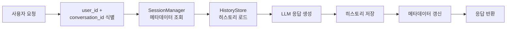
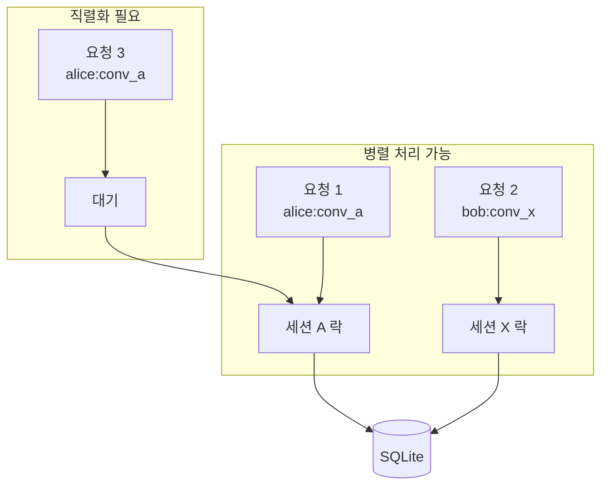
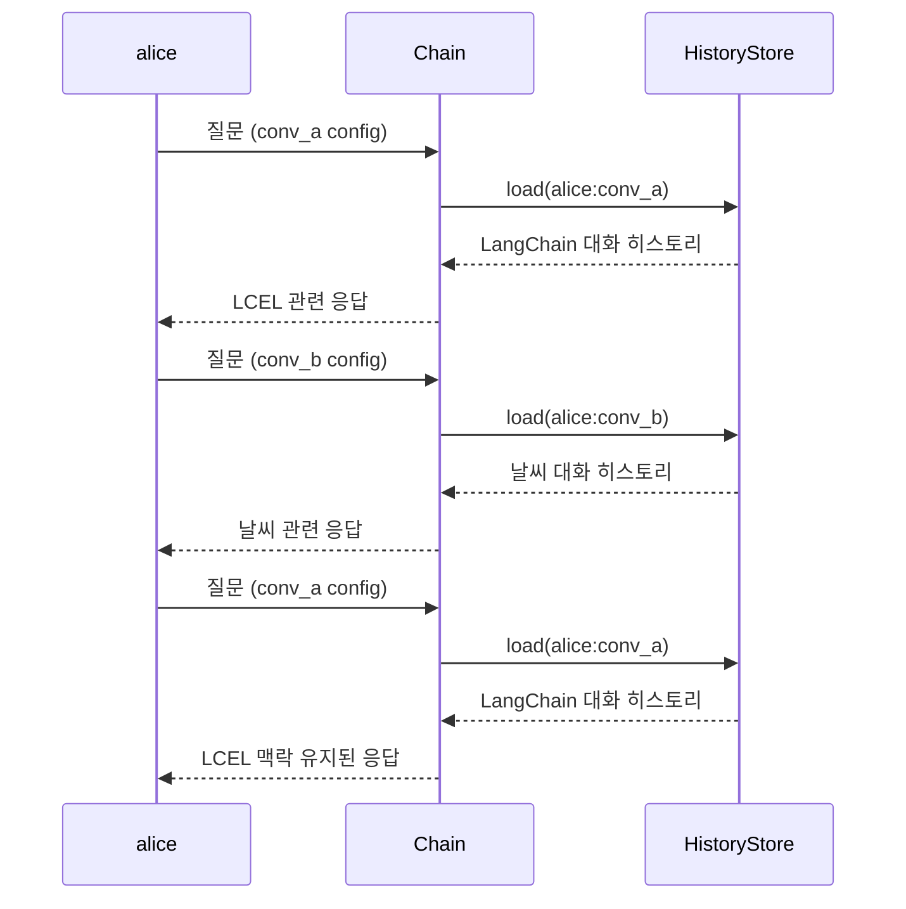
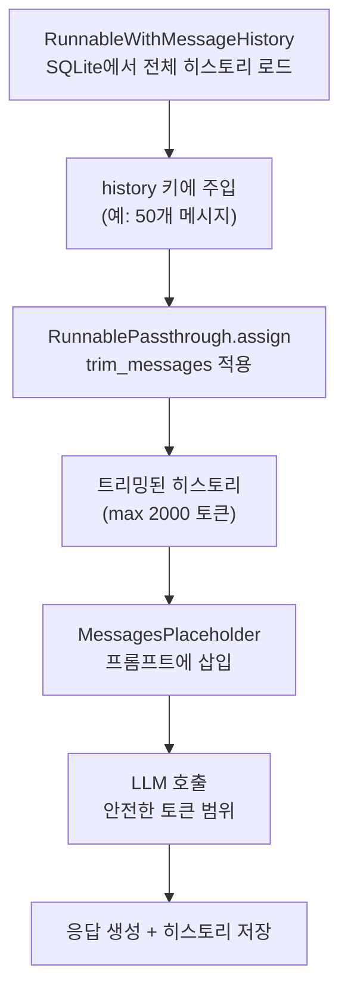
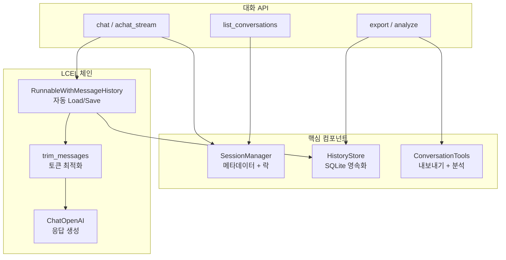

# 멀티턴 대화 시스템 구축

> 앞서 배운 메시지 히스토리, RunnableWithMessageHistory, 영구 저장소, 메모리 최적화를 하나로 엮어 프로덕션급 대화 시스템을 완성합니다.

## 개요

이 섹션에서는 Chapter 10 전체를 관통하는 최종 통합 실습을 진행합니다. 지금까지 개별적으로 배운 메시지 히스토리 관리, RunnableWithMessageHistory 래핑, 영구 저장소 연동, 토큰 최적화 전략을 모두 결합하여 **동시 사용자를 처리하고, 대화 컨텍스트를 전환하며, 대화 로그를 내보내고 분석하는** 실전 시스템을 구축합니다.

**선수 지식**: 
- [10.1 메시지 히스토리 기초](ch10/session_10_1.md)에서 배운 `BaseChatMessageHistory`와 session_id 패턴
- [10.2 RunnableWithMessageHistory](ch10/session_10_2.md)에서 배운 Load-Run-Save 자동화
- [10.3 영구 메시지 저장소](ch10/session_10_3.md)에서 배운 SQL/Redis 연동
- [10.4 메모리 최적화 전략](ch10/session_10_4.md)에서 배운 trim_messages와 하이브리드 메모리

**학습 목표**:
- 동시 다발적 사용자 요청을 안전하게 처리하는 세션 관리 아키텍처를 설계할 수 있다
- 같은 사용자의 여러 대화 사이를 자유롭게 전환하는 컨텍스트 스위칭을 구현할 수 있다
- 대화 히스토리를 내보내고 분석하는 파이프라인을 구축할 수 있다
- `trim_messages`를 체인에 통합하여 토큰 한도를 자동으로 관리하는 프로덕션급 대화 시스템을 완성할 수 있다

## 왜 알아야 할까?

실제 서비스를 운영해 본 분이라면 아실 겁니다 — 개발 환경에서 잘 돌아가는 챗봇이 프로덕션에 배포되는 순간 전혀 다른 문제들이 쏟아진다는 것을요. 100명이 동시에 대화하면 세션이 뒤섞이지 않을까? 한 사용자가 "프로젝트 A" 대화와 "프로젝트 B" 대화를 오갈 때 맥락이 꼬이지 않을까? 서버가 갑자기 죽으면 대화가 다 날아가지 않을까?

ChatGPT, Claude, Gemini 같은 대규모 AI 서비스들도 결국 이런 문제들을 풀어야 했습니다. 사용자별 대화 목록 관리, 대화 간 전환, 대화 내보내기 — 이 모든 것이 **멀티턴 대화 시스템 아키텍처**의 핵심입니다.

이 세션에서는 지금까지 배운 모든 것을 조립해서, 여러분이 실제로 배포할 수 있는 수준의 대화 시스템을 만들어 봅니다.

## 핵심 개념

### 개념 1: 세션 관리 아키텍처

> 💡 **비유**: 호텔 프런트 데스크를 생각해 보세요. 수백 명의 투숙객이 동시에 체크인하고, 각자 다른 방(세션)을 배정받고, 룸서비스(LLM 호출)를 요청합니다. 프런트 데스크는 "302호 손님이 커피를 주문했는데, 이 커피를 505호에 가져다주는" 실수를 절대 해서는 안 됩니다. 세션 관리 아키텍처가 바로 이 프런트 데스크의 역할을 합니다.

프로덕션 대화 시스템에서 세션 관리란 **사용자 식별 → 세션 라우팅 → 히스토리 로드 → 응답 생성 → 히스토리 저장**의 전체 흐름을 관장하는 것입니다. 핵심은 `user_id`와 `conversation_id`를 조합한 **복합 키** 패턴입니다.

> 📊 **그림 1**: 세션 관리 아키텍처 — 요청부터 응답까지의 전체 흐름




[10.2 RunnableWithMessageHistory](ch10/session_10_2.md)에서 `ConfigurableFieldSpec`으로 복합 키를 만드는 법을 배웠는데요, 이제 이것을 실제 아키텍처로 확장합니다.

```python
from dataclasses import dataclass, field
from datetime import datetime
from typing import Optional
import threading


@dataclass
class ConversationMeta:
    """대화 메타데이터 — 히스토리와 별도로 대화의 상태를 관리합니다."""
    conversation_id: str
    user_id: str
    title: str = "새 대화"
    created_at: datetime = field(default_factory=datetime.now)
    updated_at: datetime = field(default_factory=datetime.now)
    message_count: int = 0
    is_archived: bool = False


class SessionManager:
    """
    동시 사용자를 안전하게 처리하는 세션 매니저.
    user_id + conversation_id 복합 키로 세션을 격리합니다.
    """
    
    def __init__(self):
        # 대화 메타데이터 저장소: {user_id: {conv_id: ConversationMeta}}
        self._conversations: dict[str, dict[str, ConversationMeta]] = {}
        # 스레드 안전성을 위한 락
        self._lock = threading.Lock()
    
    def create_conversation(
        self, user_id: str, title: str = "새 대화"
    ) -> ConversationMeta:
        """새 대화를 생성하고 메타데이터를 반환합니다."""
        import uuid
        conv_id = str(uuid.uuid4())[:8]
        
        meta = ConversationMeta(
            conversation_id=conv_id,
            user_id=user_id,
            title=title,
        )
        
        with self._lock:  # 동시 접근 보호
            if user_id not in self._conversations:
                self._conversations[user_id] = {}
            self._conversations[user_id][conv_id] = meta
        
        return meta
    
    def list_conversations(
        self, user_id: str, include_archived: bool = False
    ) -> list[ConversationMeta]:
        """사용자의 대화 목록을 반환합니다."""
        with self._lock:
            convs = self._conversations.get(user_id, {})
            result = [
                meta for meta in convs.values()
                if include_archived or not meta.is_archived
            ]
        # 최근 업데이트순 정렬
        return sorted(result, key=lambda m: m.updated_at, reverse=True)
    
    def get_session_key(self, user_id: str, conversation_id: str) -> str:
        """RunnableWithMessageHistory에 전달할 세션 키를 생성합니다."""
        return f"{user_id}:{conversation_id}"
    
    def update_metadata(
        self, user_id: str, conversation_id: str, **kwargs
    ) -> None:
        """대화 메타데이터를 업데이트합니다."""
        with self._lock:
            meta = self._conversations.get(user_id, {}).get(conversation_id)
            if meta:
                for key, value in kwargs.items():
                    if hasattr(meta, key):
                        setattr(meta, key, value)
                meta.updated_at = datetime.now()
```

이 구조에서 `threading.Lock()`이 왜 필요한지 궁금하실 수 있습니다. FastAPI 같은 비동기 웹 프레임워크에서 여러 요청이 동시에 `create_conversation`을 호출하면, 딕셔너리에 동시 쓰기가 발생하면서 데이터가 유실될 수 있거든요. 락은 이런 **경쟁 조건(Race Condition)**을 방지합니다.

### 개념 2: 동시 사용자 처리와 스레드 안전성

> 💡 **비유**: 은행 ATM을 떠올려 보세요. 같은 계좌에 두 사람이 동시에 출금하면 잔액이 꼬일 수 있죠? 그래서 ATM은 한 트랜잭션이 끝날 때까지 다른 접근을 차단합니다. 대화 시스템에서도 같은 원리가 적용됩니다 — 한 세션에 대한 동시 쓰기를 방지해야 합니다.

> 📊 **그림 2**: 동시 접근 제어 — 서로 다른 세션은 병렬, 같은 세션은 직렬




LangChain의 `RunnableWithMessageHistory`는 `invoke` 호출 자체는 내부 상태를 변경하지 않기 때문에 **여러 세션에 대한 동시 호출은 안전**합니다. 하지만 **같은 세션에 대한 동시 호출**은 히스토리 저장소의 특성에 따라 문제가 될 수 있습니다.

```python
from langchain_core.chat_history import BaseChatMessageHistory
from langchain_core.messages import BaseMessage
from langchain_community.chat_message_histories import SQLChatMessageHistory
import threading


class ThreadSafeHistoryStore:
    """
    스레드 안전한 히스토리 팩토리.
    같은 session_key에 대한 동시 접근을 직렬화합니다.
    """
    
    def __init__(self, connection_string: str = "sqlite:///chat_history.db"):
        self._connection_string = connection_string
        # 세션별 락: 같은 세션에 대한 동시 쓰기를 방지
        self._session_locks: dict[str, threading.Lock] = {}
        self._global_lock = threading.Lock()
    
    def _get_session_lock(self, session_key: str) -> threading.Lock:
        """세션별 락을 가져오거나 생성합니다."""
        with self._global_lock:
            if session_key not in self._session_locks:
                self._session_locks[session_key] = threading.Lock()
            return self._session_locks[session_key]
    
    def get_history(self, session_key: str) -> BaseChatMessageHistory:
        """
        RunnableWithMessageHistory에 전달할 팩토리 함수.
        세션별 락으로 동시 쓰기를 방지합니다.
        """
        return SQLChatMessageHistory(
            session_id=session_key,
            connection=self._connection_string,
        )
    
    def get_history_with_lock(self, session_key: str):
        """
        히스토리 접근 시 세션 락을 함께 반환합니다.
        외부에서 with 문으로 사용할 수 있습니다.
        """
        lock = self._get_session_lock(session_key)
        return lock, self.get_history(session_key)


# 사용 예시: get_session_history 팩토리로 연결
history_store = ThreadSafeHistoryStore("sqlite:///production_chat.db")

def get_session_history(user_id: str, conversation_id: str) -> BaseChatMessageHistory:
    """복합 키 기반 히스토리 팩토리 — RunnableWithMessageHistory에 주입됩니다."""
    session_key = f"{user_id}:{conversation_id}"
    return history_store.get_history(session_key)
```

> ⚠️ **흔한 오해**: "파이썬은 GIL이 있으니까 스레드 안전하지 않나요?"라고 생각하기 쉽습니다. GIL은 CPU 바운드 연산의 병렬 실행을 막을 뿐, I/O 대기 중에는 다른 스레드로 전환됩니다. DB 쓰기 같은 I/O 작업에서는 여전히 경쟁 조건이 발생할 수 있으므로 명시적 동기화가 필요합니다.

### 개념 3: 대화 컨텍스트 전환

> 💡 **비유**: 스마트폰에서 카카오톡 대화방을 전환하는 것과 같습니다. "엄마" 대화방에서 "직장 동료" 대화방으로 넘어갈 때, 각 대화방의 이전 대화가 독립적으로 보존되어야 하죠. 대화 컨텍스트 전환은 이것과 똑같은 원리입니다.

컨텍스트 전환의 핵심은 `config`의 `session_id`(또는 복합 키)를 바꾸는 것입니다. `RunnableWithMessageHistory`가 알아서 해당 세션의 히스토리를 Load해 주기 때문에, 우리가 할 일은 **어떤 세션으로 전환할지 결정**하는 것뿐입니다.

> 📊 **그림 3**: 대화 컨텍스트 전환 — config만 바꾸면 히스토리가 자동 전환




```python
from langchain_core.prompts import ChatPromptTemplate, MessagesPlaceholder
from langchain_core.runnables.history import RunnableWithMessageHistory
from langchain_core.runnables import ConfigurableFieldSpec
from langchain_openai import ChatOpenAI


# 1) 체인 구성
prompt = ChatPromptTemplate.from_messages([
    ("system", "당신은 친절한 AI 비서입니다. 사용자의 이전 대화를 기억하며 대화합니다."),
    MessagesPlaceholder(variable_name="history"),
    ("human", "{input}"),
])

llm = ChatOpenAI(model="gpt-4o", temperature=0.7)
chain = prompt | llm

# 2) 복합 키 기반 RunnableWithMessageHistory 구성
chain_with_history = RunnableWithMessageHistory(
    chain,
    get_session_history,  # 위에서 정의한 팩토리 함수
    input_messages_key="input",
    history_messages_key="history",
    history_factory_config=[
        ConfigurableFieldSpec(
            id="user_id",
            annotation=str,
            name="사용자 ID",
            description="사용자 고유 식별자",
        ),
        ConfigurableFieldSpec(
            id="conversation_id",
            annotation=str,
            name="대화 ID",
            description="대화 고유 식별자",
        ),
    ],
)


# 3) 컨텍스트 전환 — config만 바꾸면 됩니다
def make_config(user_id: str, conversation_id: str) -> dict:
    """대화 세션 config를 생성합니다."""
    return {"configurable": {"user_id": user_id, "conversation_id": conversation_id}}

# 사용자 "alice"의 대화 A에서 질문
# response_a = chain_with_history.invoke(
#     {"input": "LangChain이 뭐야?"},
#     config=make_config("alice", "conv_a"),
# )

# 같은 사용자 "alice"의 대화 B로 전환 — 완전히 독립된 히스토리
# response_b = chain_with_history.invoke(
#     {"input": "오늘 날씨 어때?"},
#     config=make_config("alice", "conv_b"),
# )

# 다시 대화 A로 돌아오면, LangChain 관련 대화 맥락이 그대로 살아 있습니다
# response_a2 = chain_with_history.invoke(
#     {"input": "아까 그거 더 자세히 설명해줘"},
#     config=make_config("alice", "conv_a"),
# )
```

이 패턴의 강점은 **전환 비용이 거의 없다**는 것입니다. RunnableWithMessageHistory가 매 호출마다 `get_session_history`를 통해 히스토리를 새로 로드하기 때문에, 별도의 "전환" 로직 없이 config만 바꾸면 자연스럽게 컨텍스트가 전환됩니다.

### 개념 4: 스트리밍 응답 통합

> 💡 **비유**: 뷔페 레스토랑에서 음식이 한 접시씩 나오는 것(invoke)과 셰프가 눈앞에서 요리하며 한 조각씩 건네주는 것(streaming)의 차이입니다. 사용자 경험 측면에서 스트리밍은 대기 시간을 체감적으로 크게 줄여줍니다.

`RunnableWithMessageHistory`는 `stream`과 `astream` 메서드를 모두 지원합니다. 스트리밍을 사용하더라도 히스토리의 Load-Run-Save 사이클은 동일하게 작동합니다.

```python
import asyncio
from langchain_core.messages import AIMessageChunk


async def stream_conversation(
    chain_with_history: RunnableWithMessageHistory,
    user_input: str,
    user_id: str,
    conversation_id: str,
) -> str:
    """
    스트리밍으로 응답을 생성하면서, 전체 응답도 수집합니다.
    실제 서비스에서는 각 청크를 WebSocket이나 SSE로 클라이언트에 전송합니다.
    """
    config = make_config(user_id, conversation_id)
    full_response = ""
    
    async for chunk in chain_with_history.astream(
        {"input": user_input},
        config=config,
    ):
        # chunk는 AIMessageChunk 또는 문자열
        if isinstance(chunk, AIMessageChunk):
            token = chunk.content
        else:
            token = str(chunk)
        
        full_response += token
        print(token, end="", flush=True)  # 실시간 출력
    
    print()  # 줄바꿈
    return full_response


# 비동기 실행 예시
# asyncio.run(stream_conversation(
#     chain_with_history, "RAG가 뭐야?", "alice", "conv_a"
# ))
```

> 🔥 **실무 팁**: Python 3.10 이하에서 `astream`을 사용할 때는 반드시 `config`를 명시적으로 전달해야 합니다. Python 3.11+에서는 `contextvars` 개선으로 자동 전파되지만, 하위 호환성을 위해 항상 명시적으로 전달하는 습관을 들이세요.

### 개념 5: 대화 내보내기와 분석

> 💡 **비유**: 병원에서 진료 기록을 관리하는 것과 비슷합니다. 환자(사용자)의 모든 진료 내역(대화)을 체계적으로 보관하고, 필요할 때 요약본을 뽑거나, 특정 증상(키워드)으로 과거 기록을 검색하고, 통계 분석까지 할 수 있어야 합니다.

대화 데이터는 단순한 로그가 아닙니다. 사용자 행동 분석, 서비스 품질 모니터링, 모델 성능 평가의 핵심 소스입니다. 체계적인 내보내기와 분석 파이프라인을 구축해 봅시다.

```python
import json
from datetime import datetime
from langchain_core.messages import (
    HumanMessage, AIMessage, SystemMessage, BaseMessage,
)


class ConversationExporter:
    """대화 히스토리를 다양한 형식으로 내보내고 분석합니다."""
    
    @staticmethod
    def messages_to_dicts(messages: list[BaseMessage]) -> list[dict]:
        """메시지 리스트를 직렬화 가능한 딕셔너리로 변환합니다."""
        result = []
        for msg in messages:
            entry = {
                "role": msg.type,            # "human", "ai", "system"
                "content": msg.content,
                "timestamp": msg.additional_kwargs.get(
                    "timestamp", datetime.now().isoformat()
                ),
            }
            # 토큰 사용량 등 추가 메타데이터가 있으면 포함
            if hasattr(msg, "response_metadata") and msg.response_metadata:
                entry["metadata"] = msg.response_metadata
            result.append(entry)
        return result
    
    @staticmethod
    def export_to_json(
        messages: list[BaseMessage],
        conversation_id: str,
        user_id: str,
        filepath: str,
    ) -> str:
        """대화를 JSON 파일로 내보냅니다."""
        export_data = {
            "conversation_id": conversation_id,
            "user_id": user_id,
            "exported_at": datetime.now().isoformat(),
            "message_count": len(messages),
            "messages": ConversationExporter.messages_to_dicts(messages),
        }
        
        with open(filepath, "w", encoding="utf-8") as f:
            json.dump(export_data, f, ensure_ascii=False, indent=2)
        
        return filepath
    
    @staticmethod
    def export_to_markdown(
        messages: list[BaseMessage],
        title: str = "대화 기록",
    ) -> str:
        """대화를 읽기 좋은 마크다운 형식으로 변환합니다."""
        lines = [f"# {title}\n"]
        
        role_labels = {
            "human": "🧑 **사용자**",
            "ai": "🤖 **AI**",
            "system": "⚙️ **시스템**",
        }
        
        for msg in messages:
            label = role_labels.get(msg.type, msg.type)
            lines.append(f"{label}: {msg.content}\n")
        
        return "\n".join(lines)


class ConversationAnalyzer:
    """대화 히스토리에서 유용한 통계와 인사이트를 추출합니다."""
    
    @staticmethod
    def get_statistics(messages: list[BaseMessage]) -> dict:
        """대화의 기본 통계를 계산합니다."""
        human_msgs = [m for m in messages if m.type == "human"]
        ai_msgs = [m for m in messages if m.type == "ai"]
        
        # 평균 메시지 길이 계산
        avg_human_len = (
            sum(len(m.content) for m in human_msgs) / len(human_msgs)
            if human_msgs else 0
        )
        avg_ai_len = (
            sum(len(m.content) for m in ai_msgs) / len(ai_msgs)
            if ai_msgs else 0
        )
        
        return {
            "total_messages": len(messages),
            "human_messages": len(human_msgs),
            "ai_messages": len(ai_msgs),
            "avg_human_length": round(avg_human_len, 1),
            "avg_ai_length": round(avg_ai_len, 1),
            "total_characters": sum(len(m.content) for m in messages),
        }
    
    @staticmethod
    def generate_title(messages: list[BaseMessage], max_length: int = 30) -> str:
        """첫 번째 사용자 메시지를 기반으로 대화 제목을 생성합니다."""
        for msg in messages:
            if msg.type == "human":
                title = msg.content[:max_length]
                if len(msg.content) > max_length:
                    title += "..."
                return title
        return "새 대화"
```

## 실습: 직접 해보기

이제 위의 모든 개념을 통합하여 **프로덕션급 멀티턴 대화 시스템**을 완성합니다. [10.3](ch10/session_10_3.md)에서 배운 SQLite 저장소와 [10.4](ch10/session_10_4.md)에서 배운 `trim_messages` 기반 메모리 최적화를 결합한 전체 코드입니다.

```python
"""
프로덕션급 멀티턴 대화 시스템
- 동시 사용자 처리 (스레드 안전)
- 복합 키 기반 세션 관리
- 메모리 최적화 (Ch10.4의 trim_messages 연동)
- 스트리밍 응답
- 대화 내보내기 & 분석
"""

import asyncio
import json
import threading
import uuid
from dataclasses import dataclass, field
from datetime import datetime
from operator import itemgetter
from typing import Optional

from langchain_core.chat_history import BaseChatMessageHistory
from langchain_core.messages import (
    AIMessage, BaseMessage, HumanMessage, SystemMessage,
    trim_messages,
)
from langchain_core.prompts import ChatPromptTemplate, MessagesPlaceholder
from langchain_core.runnables import (
    ConfigurableFieldSpec, RunnablePassthrough,
)
from langchain_core.runnables.history import RunnableWithMessageHistory
from langchain_community.chat_message_histories import SQLChatMessageHistory
from langchain_openai import ChatOpenAI


# ──────────────────────────────────────────────
# 1. 대화 메타데이터
# ──────────────────────────────────────────────
@dataclass
class ConversationMeta:
    """각 대화의 상태와 메타데이터를 추적합니다."""
    conversation_id: str
    user_id: str
    title: str = "새 대화"
    created_at: str = field(default_factory=lambda: datetime.now().isoformat())
    updated_at: str = field(default_factory=lambda: datetime.now().isoformat())
    message_count: int = 0
    is_archived: bool = False


# ──────────────────────────────────────────────
# 2. 세션 매니저 — 동시 접근 보호 포함
# ──────────────────────────────────────────────
class SessionManager:
    """user_id + conversation_id 복합 키로 세션을 관리합니다."""
    
    def __init__(self):
        self._conversations: dict[str, dict[str, ConversationMeta]] = {}
        self._lock = threading.Lock()
    
    def create_conversation(
        self, user_id: str, title: str = "새 대화"
    ) -> ConversationMeta:
        conv_id = str(uuid.uuid4())[:8]
        meta = ConversationMeta(
            conversation_id=conv_id,
            user_id=user_id,
            title=title,
        )
        with self._lock:
            self._conversations.setdefault(user_id, {})[conv_id] = meta
        return meta
    
    def list_conversations(self, user_id: str) -> list[ConversationMeta]:
        with self._lock:
            convs = self._conversations.get(user_id, {})
            active = [m for m in convs.values() if not m.is_archived]
        return sorted(active, key=lambda m: m.updated_at, reverse=True)
    
    def update_after_message(self, user_id: str, conv_id: str) -> None:
        with self._lock:
            meta = self._conversations.get(user_id, {}).get(conv_id)
            if meta:
                meta.message_count += 2  # human + ai 한 쌍
                meta.updated_at = datetime.now().isoformat()
    
    def archive_conversation(self, user_id: str, conv_id: str) -> None:
        with self._lock:
            meta = self._conversations.get(user_id, {}).get(conv_id)
            if meta:
                meta.is_archived = True


# ──────────────────────────────────────────────
# 3. 히스토리 스토어 — SQLite 기반
# ──────────────────────────────────────────────
class HistoryStore:
    """SQLite 기반 히스토리 저장소입니다."""
    
    def __init__(self, db_path: str = "sqlite:///conversations.db"):
        self._db_path = db_path
    
    def get_history(
        self, user_id: str, conversation_id: str
    ) -> BaseChatMessageHistory:
        session_key = f"{user_id}:{conversation_id}"
        return SQLChatMessageHistory(
            session_id=session_key,
            connection=self._db_path,
        )


# ──────────────────────────────────────────────
# 4. 대화 내보내기 & 분석
# ──────────────────────────────────────────────
class ConversationTools:
    """대화 내보내기와 분석 유틸리티입니다."""
    
    @staticmethod
    def export_json(
        messages: list[BaseMessage], conv_id: str, user_id: str
    ) -> dict:
        """대화를 JSON 직렬화 가능한 딕셔너리로 변환합니다."""
        return {
            "conversation_id": conv_id,
            "user_id": user_id,
            "exported_at": datetime.now().isoformat(),
            "message_count": len(messages),
            "messages": [
                {"role": m.type, "content": m.content}
                for m in messages
            ],
        }
    
    @staticmethod
    def get_stats(messages: list[BaseMessage]) -> dict:
        """대화 통계를 계산합니다."""
        human = [m for m in messages if m.type == "human"]
        ai = [m for m in messages if m.type == "ai"]
        return {
            "total": len(messages),
            "turns": len(human),  # 대화 턴 수
            "avg_user_chars": (
                round(sum(len(m.content) for m in human) / len(human), 1)
                if human else 0
            ),
            "avg_ai_chars": (
                round(sum(len(m.content) for m in ai) / len(ai), 1)
                if ai else 0
            ),
        }
    
    @staticmethod
    def auto_title(messages: list[BaseMessage]) -> str:
        """첫 사용자 메시지로 자동 제목을 생성합니다."""
        for m in messages:
            if m.type == "human":
                return m.content[:25] + ("..." if len(m.content) > 25 else "")
        return "새 대화"


# ──────────────────────────────────────────────
# 5. 프로덕션 대화 시스템 — 모든 것의 통합
# ──────────────────────────────────────────────
class ProductionChatSystem:
    """
    프로덕션급 멀티턴 대화 시스템.
    세션 관리, 히스토리 영속화, 메모리 최적화, 스트리밍을 통합합니다.
    """
    
    def __init__(
        self,
        model_name: str = "gpt-4o",
        temperature: float = 0.7,
        db_path: str = "sqlite:///conversations.db",
        max_history_tokens: int = 2000,
    ):
        # 컴포넌트 초기화
        self.session_mgr = SessionManager()
        self.history_store = HistoryStore(db_path)
        self.tools = ConversationTools()
        self._max_tokens = max_history_tokens
        
        # LLM 초기화
        self._llm = ChatOpenAI(model=model_name, temperature=temperature)
        
        # ── Ch10.4 연동: trim_messages로 히스토리 자동 트리밍 ──
        # 대화가 아무리 길어져도 max_history_tokens를 초과하지 않습니다.
        # strategy="last"로 최신 메시지를 우선 유지하고,
        # include_system=True로 시스템 메시지는 항상 보존합니다.
        self._trimmer = trim_messages(
            max_tokens=max_history_tokens,
            strategy="last",            # 최근 메시지 우선 유지
            token_counter=self._llm,    # LLM 토크나이저로 정확한 토큰 계산
            include_system=True,        # 시스템 메시지는 항상 유지
            start_on="human",           # 트리밍 후 첫 메시지가 human이 되도록 보장
        )
        
        prompt = ChatPromptTemplate.from_messages([
            ("system",
             "당신은 친절하고 전문적인 AI 비서입니다. "
             "사용자의 이전 대화 맥락을 기억하며 일관된 대화를 이어갑니다."),
            MessagesPlaceholder(variable_name="history"),
            ("human", "{input}"),
        ])
        
        # trim_messages를 LCEL 체인에 통합합니다.
        # RunnableWithMessageHistory가 로드한 히스토리를
        # 프롬프트에 전달하기 전에 자동으로 트리밍합니다.
        base_chain = (
            RunnablePassthrough.assign(
                history=itemgetter("history") | self._trimmer
            )
            | prompt
            | self._llm
        )
        
        # RunnableWithMessageHistory로 래핑 (복합 키 사용)
        self.chain = RunnableWithMessageHistory(
            base_chain,
            self.history_store.get_history,
            input_messages_key="input",
            history_messages_key="history",
            history_factory_config=[
                ConfigurableFieldSpec(
                    id="user_id", annotation=str,
                    name="User ID", description="사용자 식별자",
                ),
                ConfigurableFieldSpec(
                    id="conversation_id", annotation=str,
                    name="Conversation ID", description="대화 식별자",
                ),
            ],
        )
    
    def _make_config(self, user_id: str, conv_id: str) -> dict:
        """세션 config를 생성합니다."""
        return {"configurable": {
            "user_id": user_id,
            "conversation_id": conv_id,
        }}
    
    # --- 대화 관리 API ---
    
    def new_conversation(
        self, user_id: str, title: str = "새 대화"
    ) -> ConversationMeta:
        """새 대화를 시작합니다."""
        return self.session_mgr.create_conversation(user_id, title)
    
    def chat(self, user_id: str, conv_id: str, message: str) -> str:
        """
        동기 방식으로 대화합니다.
        내부적으로 trim_messages가 체인에 통합되어 있어,
        히스토리가 max_history_tokens를 초과하면 자동으로 트리밍됩니다.
        """
        config = self._make_config(user_id, conv_id)
        response = self.chain.invoke({"input": message}, config=config)
        
        # 메타데이터 업데이트
        self.session_mgr.update_after_message(user_id, conv_id)
        
        # 첫 메시지면 자동 제목 설정
        history = self.history_store.get_history(user_id, conv_id)
        msgs = history.messages
        if len(msgs) <= 2:  # 첫 턴
            title = self.tools.auto_title(msgs)
            self.session_mgr.update_after_message(user_id, conv_id)
        
        return response.content
    
    async def achat_stream(
        self, user_id: str, conv_id: str, message: str
    ):
        """
        비동기 스트리밍으로 대화합니다. 각 토큰을 yield합니다.
        스트리밍에서도 trim_messages가 동일하게 적용됩니다.
        """
        config = self._make_config(user_id, conv_id)
        
        async for chunk in self.chain.astream(
            {"input": message}, config=config
        ):
            yield chunk.content
        
        # 스트리밍 완료 후 메타데이터 업데이트
        self.session_mgr.update_after_message(user_id, conv_id)
    
    # --- 대화 조회 & 내보내기 API ---
    
    def list_conversations(self, user_id: str) -> list[ConversationMeta]:
        """사용자의 활성 대화 목록을 반환합니다."""
        return self.session_mgr.list_conversations(user_id)
    
    def export_conversation(
        self, user_id: str, conv_id: str
    ) -> dict:
        """대화를 JSON으로 내보냅니다."""
        history = self.history_store.get_history(user_id, conv_id)
        return self.tools.export_json(history.messages, conv_id, user_id)
    
    def analyze_conversation(
        self, user_id: str, conv_id: str
    ) -> dict:
        """대화 통계를 반환합니다."""
        history = self.history_store.get_history(user_id, conv_id)
        return self.tools.get_stats(history.messages)
    
    def archive(self, user_id: str, conv_id: str) -> None:
        """대화를 아카이브합니다."""
        self.session_mgr.archive_conversation(user_id, conv_id)


# ──────────────────────────────────────────────
# 6. 실행 예시
# ──────────────────────────────────────────────
def main():
    """멀티턴 대화 시스템 사용 예시입니다."""
    
    # 시스템 초기화 — max_history_tokens로 토큰 한도 설정
    system = ProductionChatSystem(
        model_name="gpt-4o",
        db_path="sqlite:///demo_chat.db",
        max_history_tokens=2000,  # 히스토리를 2000 토큰 이내로 유지
    )
    
    # === 사용자 alice의 시나리오 ===
    user_id = "alice"
    
    # 대화 1: LangChain 학습
    conv1 = system.new_conversation(user_id, "LangChain 학습")
    print(f"대화 생성: {conv1.conversation_id} - {conv1.title}")
    
    # 대화 1에서 질문
    r1 = system.chat(user_id, conv1.conversation_id, "LCEL이 뭐야?")
    print(f"[대화1] AI: {r1[:80]}...")
    
    r2 = system.chat(
        user_id, conv1.conversation_id,
        "방금 설명한 거 코드 예제로 보여줘"  # 이전 맥락 참조
    )
    print(f"[대화1] AI: {r2[:80]}...")
    
    # 대화 2: 날씨 이야기 (완전히 독립된 맥락)
    conv2 = system.new_conversation(user_id, "일상 대화")
    r3 = system.chat(user_id, conv2.conversation_id, "오늘 기분이 좋아!")
    print(f"[대화2] AI: {r3[:80]}...")
    
    # 다시 대화 1로 전환 — LCEL 맥락이 살아있음
    r4 = system.chat(
        user_id, conv1.conversation_id,
        "아까 그 파이프 연산자 말이야, 내부적으로 어떻게 동작해?"
    )
    print(f"[대화1 복귀] AI: {r4[:80]}...")
    
    # === 대화 목록 조회 ===
    conversations = system.list_conversations(user_id)
    print(f"\n{user_id}의 대화 목록:")
    for conv in conversations:
        print(f"  - [{conv.conversation_id}] {conv.title} "
              f"(메시지 {conv.message_count}개)")
    
    # === 대화 분석 ===
    stats = system.analyze_conversation(user_id, conv1.conversation_id)
    print(f"\n대화1 통계: {stats}")
    
    # === 대화 내보내기 ===
    export = system.export_conversation(user_id, conv1.conversation_id)
    print(f"\n내보내기 완료: {export['message_count']}개 메시지")
    
    # JSON 파일로 저장
    with open(f"export_{conv1.conversation_id}.json", "w", encoding="utf-8") as f:
        json.dump(export, f, ensure_ascii=False, indent=2)
    print(f"파일 저장: export_{conv1.conversation_id}.json")
    
    # === 대화 아카이브 ===
    system.archive(user_id, conv2.conversation_id)
    active = system.list_conversations(user_id)
    print(f"\n아카이브 후 활성 대화: {len(active)}개")


if __name__ == "__main__":
    main()

# 예상 출력:
# 대화 생성: a1b2c3d4 - LangChain 학습
# [대화1] AI: LCEL(LangChain Expression Language)은 LangChain의 선언적 체인 구성 언어로...
# [대화1] AI: 네, LCEL의 파이프 연산자를 사용한 예제를 보여드리겠습니다...
# [대화2] AI: 기분이 좋다니 저도 기쁘네요! 좋은 하루 보내고 계신가 봐요...
# [대화1 복귀] AI: 아까 설명드린 파이프 연산자(|)의 내부 동작을 설명하면...
# 
# alice의 대화 목록:
#   - [a1b2c3d4] LangChain 학습 (메시지 6개)
#   - [e5f6g7h8] 일상 대화 (메시지 2개)
# 
# 대화1 통계: {'total': 6, 'turns': 3, 'avg_user_chars': 18.3, 'avg_ai_chars': 245.7}
# 내보내기 완료: 6개 메시지
# 파일 저장: export_a1b2c3d4.json
# 아카이브 후 활성 대화: 1개
```

위 코드에서 주목할 부분은 `ProductionChatSystem.__init__`에서 `trim_messages`를 LCEL 체인에 통합한 부분입니다. [10.4 메모리 최적화 전략](ch10/session_10_4.md)에서 배운 `trim_messages`를 `RunnablePassthrough.assign`으로 체인 안에 끼워 넣으면, `RunnableWithMessageHistory`가 로드한 전체 히스토리가 프롬프트에 도달하기 전에 **자동으로 트리밍**됩니다. 흐름을 정리하면 이렇습니다:

1. `RunnableWithMessageHistory`가 SQLite에서 전체 히스토리를 로드하여 `history` 키에 주입

> 📊 **그림 4**: trim_messages 통합 흐름 — 히스토리 로드부터 트리밍, 응답까지



2. `RunnablePassthrough.assign(history=itemgetter("history") | self._trimmer)`가 히스토리를 `max_history_tokens` 이내로 트리밍
3. 트리밍된 히스토리가 `MessagesPlaceholder`를 통해 프롬프트에 삽입
4. LLM이 토큰 한도를 초과하지 않는 안전한 프롬프트로 응답을 생성

이 패턴 덕분에 `chat()`이든 `achat_stream()`이든 별도의 트리밍 코드 없이 **모든 호출에서 자동으로 메모리가 최적화**됩니다. 대화가 100턴을 넘어가도 `max_history_tokens=2000` 설정이 지켜지면서, `strategy="last"` 덕분에 가장 최근의 맥락은 항상 보존됩니다.

> 💡 **비유**: 도서관의 열람실 좌석이 한정된 것과 비슷합니다. 새 손님(최근 메시지)이 들어오면 가장 오래 앉아 있던 손님(오래된 메시지)이 자연스럽게 나가는 방식이죠. 하지만 사서 선생님(시스템 메시지)은 `include_system=True`로 항상 자리를 보장받습니다.

## 더 깊이 알아보기

### 대화 시스템의 역사 — ELIZA에서 ChatGPT까지

세계 최초의 대화 시스템은 1966년 MIT의 조셉 바이첸바움(Joseph Weizenbaum)이 만든 **ELIZA**였습니다. 놀랍게도 ELIZA는 어떤 "메모리"도 없었습니다 — 사용자가 방금 한 말을 패턴 매칭으로 뒤집어 질문하는 것이 전부였죠. "I feel sad"라고 하면 "Why do you feel sad?"라고 되묻는 식이었습니다.

그런데 여기서 놀라운 일이 벌어졌습니다. 바이첸바움의 비서가 ELIZA와 대화하더니 **"저 좀 나가주세요, 개인적인 대화를 하고 있어요"**라고 말한 겁니다. 메모리도 이해력도 없는 프로그램에 사람이 감정적으로 몰입한 최초의 사례였습니다. 바이첸바움은 이에 충격을 받아 이후 AI 비판론자가 되었습니다.

그로부터 약 60년이 지난 지금, 우리가 만드는 대화 시스템은 ELIZA와는 차원이 다릅니다. 수천 턴의 대화를 기억하고, 요약하고, 여러 대화 사이를 오가며, 수백만 사용자의 세션을 동시에 처리합니다. 하지만 핵심 과제는 여전히 같습니다 — **"이 시스템이 나를 기억하고 있다"는 느낌을 어떻게 줄 것인가?**

LangChain의 메모리 시스템은 이 오랜 질문에 대한 현대적 답변입니다. `BaseChatMessageHistory`라는 단순한 인터페이스 뒤에 SQLite부터 Redis까지 다양한 저장소를 끼워 넣을 수 있고, `RunnableWithMessageHistory`로 히스토리 관리를 자동화하며, `trim_messages`로 토큰 한도 안에서 최적의 맥락을 유지합니다.

### LangGraph로의 진화

사실 LangChain v0.3부터 공식 문서는 새로운 애플리케이션에 **LangGraph의 persistence 기능**을 사용할 것을 권장합니다. LangGraph의 체크포인트 시스템은 대화 히스토리뿐 아니라 에이전트의 중간 상태까지 저장할 수 있어서, 더 복잡한 워크플로우에 적합하거든요. 이 내용은 [Ch13 LangGraph 기초](ch13/session_13_1.md)에서 자세히 다루게 됩니다.

하지만 `RunnableWithMessageHistory` 패턴은 여전히 유효합니다. 단순한 챗봇이나 QA 시스템에서는 LangGraph의 복잡성이 오히려 과도할 수 있고, 기존 LCEL 체인에 메모리를 추가하는 가장 간결한 방법이기 때문입니다.

## 흔한 오해와 팁

> ⚠️ **흔한 오해**: "RunnableWithMessageHistory가 알아서 토큰 관리를 해준다"고 생각하기 쉽습니다. 사실 `RunnableWithMessageHistory`는 히스토리의 Load/Save만 담당하고, 토큰 트리밍은 **별도로** 처리해야 합니다. 위의 `ProductionChatSystem`에서처럼 [10.4](ch10/session_10_4.md)에서 배운 `trim_messages`를 `RunnablePassthrough.assign`으로 체인 안에 넣어야 자동 트리밍이 작동합니다.

> 💡 **알고 계셨나요?**: LangChain의 `add_messages` 메서드는 `add_message`보다 효율적입니다. 여러 메시지를 한 번에 저장할 때 `add_messages`는 단일 DB 트랜잭션으로 처리하지만, `add_message`를 반복 호출하면 매번 별도 트랜잭션이 발생합니다. 특히 SQL 기반 저장소에서 성능 차이가 큽니다.

> 🔥 **실무 팁**: 프로덕션에서 대화 시스템을 운영할 때는 반드시 **관찰 가능성(Observability)**을 함께 구축하세요. LangSmith를 연동하면 각 대화의 토큰 사용량, 응답 지연 시간, 에러율을 실시간으로 모니터링할 수 있습니다. 환경 변수 `LANGCHAIN_TRACING_V2=true`와 `LANGCHAIN_API_KEY`만 설정하면 자동으로 트레이싱이 시작됩니다. 이 내용은 [Ch16 콜백과 관찰 가능성](ch16/session_16_1.md)에서 깊이 다룹니다.

> 🔥 **실무 팁**: FastAPI와 통합할 때 `asyncio.Lock()`과 `threading.Lock()`을 혼동하지 마세요. FastAPI의 async 엔드포인트에서는 `asyncio.Lock()`을, 동기 엔드포인트(`def` 함수)에서는 `threading.Lock()`을 사용해야 합니다. 둘을 섞으면 데드락이 발생할 수 있습니다.

## 핵심 정리

> 📊 **그림 5**: ProductionChatSystem 전체 아키텍처




| 개념 | 설명 |
|------|------|
| **세션 관리 아키텍처** | `user_id` + `conversation_id` 복합 키로 대화를 격리하고, `SessionManager`로 메타데이터를 관리 |
| **동시 사용자 처리** | `threading.Lock()`으로 같은 세션에 대한 동시 쓰기를 방지. `invoke`는 서로 다른 세션 간에는 안전 |
| **컨텍스트 전환** | `config`의 `user_id`/`conversation_id`만 바꾸면 `RunnableWithMessageHistory`가 자동으로 히스토리를 전환 |
| **메모리 최적화 통합** | `trim_messages`를 `RunnablePassthrough.assign`으로 체인에 통합하여, 히스토리가 `max_history_tokens`를 초과하지 않도록 자동 트리밍 |
| **스트리밍 응답** | `astream()`으로 토큰 단위 스트리밍 가능. Load-Run-Save 사이클과 trim_messages 모두 동일하게 작동 |
| **대화 내보내기** | 메시지를 JSON/Markdown으로 직렬화. `BaseMessage`의 `type`과 `content`가 핵심 필드 |
| **대화 분석** | 턴 수, 평균 메시지 길이, 총 문자 수 등의 통계로 서비스 품질 모니터링 |
| **자동 제목 생성** | 첫 사용자 메시지를 기반으로 대화 제목을 자동 설정 |

## 다음 섹션 미리보기

Chapter 10에서 메모리와 대화 관리의 전체 스펙트럼을 다뤘습니다. 다음 [Chapter 11: 도구(Tools)와 함수 호출](ch11/session_11_1.md)에서는 LLM이 단순히 텍스트를 생성하는 것을 넘어, **외부 도구를 선택하고 실행**하는 방법을 배웁니다. 검색 엔진 호출, 계산기 실행, 데이터베이스 쿼리 — 이 모든 것을 LLM이 스스로 판단하여 수행하게 됩니다. 이 세션에서 구축한 대화 시스템에 도구 사용 능력을 더하면, 진정한 AI 에이전트의 기반이 완성됩니다.

## 참고 자료

- [LangChain 공식 문서 — Chat History 개념](https://python.langchain.com/docs/concepts/chat_history/) - 메시지 히스토리의 핵심 개념과 설계 철학을 이해할 수 있는 공식 가이드
- [RunnableWithMessageHistory API 레퍼런스](https://python.langchain.com/api_reference/core/runnables/langchain_core.runnables.history.RunnableWithMessageHistory.html) - 복합 키 설정, 스트리밍, 비동기 지원 등 상세 API 문서
- [LangChain Community — Chat Message Histories](https://python.langchain.com/api_reference/community/chat_message_histories.html) - SQL, Redis, MongoDB 등 다양한 영구 저장소 구현체 목록과 사용법
- [LangChain Best Practices — Swarnendu De](https://www.swarnendu.de/blog/langchain-best-practices/) - 프로덕션 LangChain 애플리케이션의 아키텍처, 성능 최적화, 관찰 가능성 베스트 프랙티스
- [FastAPI + LangChain 세션 관리 커뮤니티 논의](https://community.latenode.com/t/best-practices-for-managing-session-based-memory-in-langchain-with-fastapi-websocket-connections/39408) - WebSocket 기반 실시간 대화 시스템 구축 시 세션 관리 패턴과 주의사항

---
### 🔗 Related Sessions
- [basechatmessagehistory](../10-메모리와-대화-관리/01-메시지-히스토리-기초.md) (prerequisite)
- [session_id_pattern](../10-메모리와-대화-관리/01-메시지-히스토리-기초.md) (prerequisite)
- [get_session_history](../09-ragretrieval-augmented-generation-구축/03-대화형-rag.md) (prerequisite)
- [runnablewithmessagehistory](../10-메모리와-대화-관리/02-runnablewithmessagehistory.md) (prerequisite)
- [input_messages_key](../10-메모리와-대화-관리/02-runnablewithmessagehistory.md) (prerequisite)
- [history_messages_key](../10-메모리와-대화-관리/02-runnablewithmessagehistory.md) (prerequisite)
- [sqlchatmessagehistory](../10-메모리와-대화-관리/03-영구-메시지-저장소.md) (prerequisite)
- [trim_messages](../10-메모리와-대화-관리/04-메모리-최적화-전략.md) (prerequisite)
