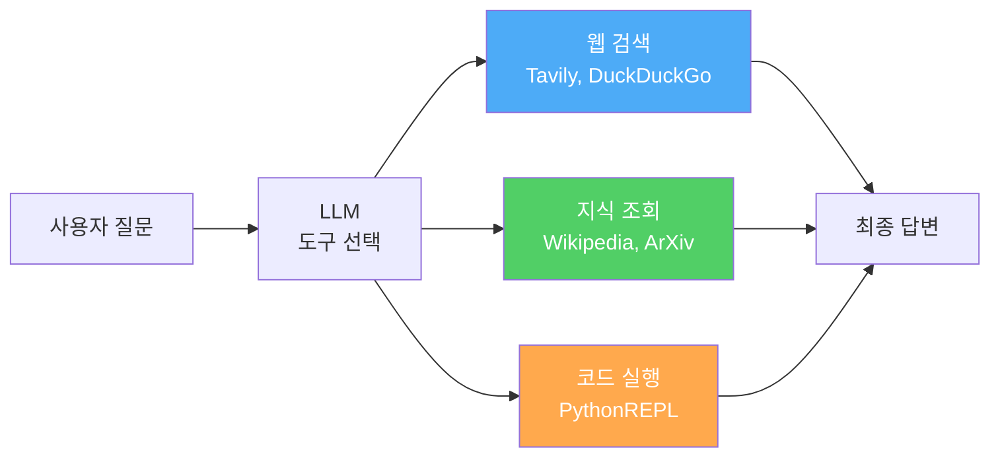
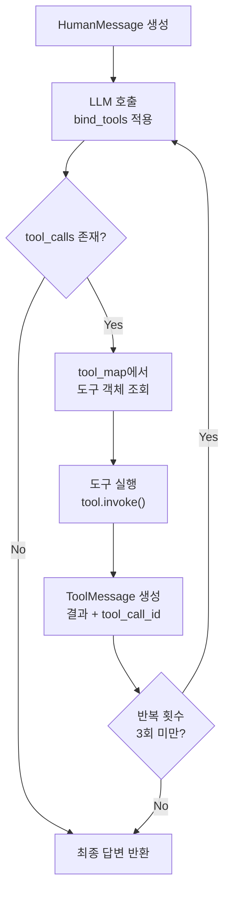
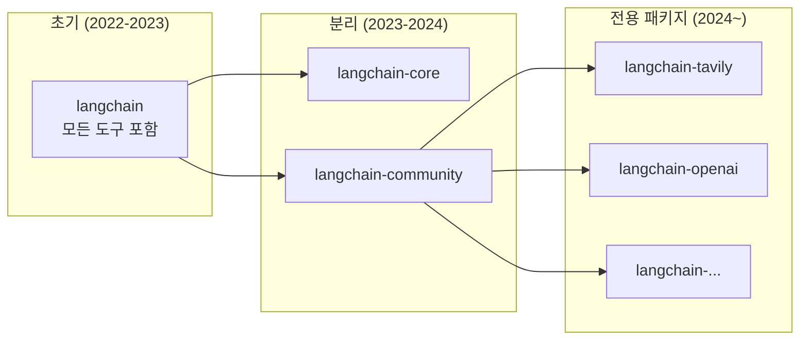

# 내장 도구 활용

> LangChain이 제공하는 풍부한 내장 도구 생태계를 탐색하고, 웹 검색·백과사전·코드 실행 도구를 프로젝트에 즉시 적용하는 방법을 배웁니다.

## 개요

이 섹션에서는 앞서 [11.1: 도구 정의와 바인딩](ch11_session1.md)에서 직접 도구를 만들어 본 경험을 바탕으로, LangChain 생태계가 **이미 준비해 둔** 수십 가지 내장 도구를 살펴봅니다. 검색, 백과사전, 코드 실행 등 실무에서 가장 많이 쓰이는 도구 세 가지를 집중적으로 다루고, 커뮤니티 도구 생태계를 탐색하는 방법까지 익힙니다.

**선수 지식**: `@tool` 데코레이터, `bind_tools()`, `AIMessage.tool_calls`, `ToolMessage` (세션 11.1에서 학습)
**학습 목표**:
- TavilySearchResults로 실시간 웹 검색을 LLM에 연결할 수 있다
- WikipediaQueryRun으로 백과사전 지식을 에이전트에 통합할 수 있다
- PythonREPLTool로 LLM이 코드를 실행하게 할 수 있다
- `langchain-community` 패키지에서 필요한 도구를 찾아 활용할 수 있다

## 왜 알아야 할까?

세션 11.1에서 직접 도구를 만들어 봤는데요, 매번 모든 도구를 처음부터 구현해야 한다면 어떨까요? 웹 검색 API를 호출하는 코드, 위키피디아 파싱 로직, 파이썬 코드 샌드박스… 이걸 전부 직접 만든다면 도구를 만드는 데만 하루가 다 갈 겁니다.

다행히 LangChain은 **70가지 이상의 사전 구축된 도구**를 제공합니다. 이 도구들은 이미 Runnable 인터페이스를 구현하고 있어서 `bind_tools()`로 즉시 연결할 수 있죠. 마치 레고 블록처럼 원하는 도구를 골라 끼우기만 하면 됩니다.

실무에서 가장 빈번하게 사용되는 도구 조합은 이렇습니다:
- **웹 검색** — 최신 정보가 필요할 때 (Tavily, DuckDuckGo)
- **지식 조회** — 정확한 사실 확인이 필요할 때 (Wikipedia, ArXiv)
- **코드 실행** — 계산이나 데이터 처리가 필요할 때 (PythonREPL)

이 세 가지만 조합해도 놀라울 정도로 다양한 작업을 자동화할 수 있습니다.

> 📊 **그림 1**: 내장 도구 카테고리와 역할 분담




## 핵심 개념

### 개념 1: TavilySearchResults — AI를 위한 검색 엔진

> 💡 **비유**: 일반 검색 엔진이 '도서관 사서'라면, Tavily는 **'AI 전문 리서치 어시스턴트'**입니다. 사서는 "이 책장을 찾아보세요"라고 안내하지만, 리서치 어시스턴트는 필요한 정보를 직접 요약해서 건네주죠.

Tavily는 **AI 에이전트를 위해 특별히 설계된 검색 엔진**입니다. 일반 검색 엔진과 달리, 검색 결과를 LLM이 바로 소화할 수 있는 구조화된 JSON으로 반환합니다.

**설치 및 설정**:

```python
# 필요한 패키지 설치
# pip install langchain-community tavily-python

import os
from dotenv import load_dotenv

load_dotenv()
# .env 파일에 TAVILY_API_KEY=tvly-xxxxx 형태로 저장
```

**기본 사용법**:

```python
from langchain_community.tools.tavily_search import TavilySearchResults

# 검색 도구 생성 — max_results로 반환 개수 제한
search_tool = TavilySearchResults(
    max_results=3,              # 최대 3개 결과 반환
    search_depth="advanced",    # "basic" 또는 "advanced"
    include_answer=True,        # AI 생성 요약 답변 포함
    include_raw_content=False,  # 원본 HTML 제외 (토큰 절약)
)

# 도구 메타 정보 확인
print(f"이름: {search_tool.name}")
print(f"설명: {search_tool.description}")
print(f"입력 스키마: {search_tool.args}")

# 직접 실행
results = search_tool.invoke("LangChain 최신 버전 2025")
for r in results:
    print(f"- {r['url']}: {r['content'][:100]}...")
```

**LLM에 바인딩**:

```python
from langchain_openai import ChatOpenAI

llm = ChatOpenAI(model="gpt-4o", temperature=0)

# bind_tools로 검색 도구 연결
llm_with_search = llm.bind_tools([search_tool])

# 최신 정보가 필요한 질문
response = llm_with_search.invoke("2025년 파이썬 최신 버전은 무엇인가요?")

# 모델이 도구 호출을 요청하는지 확인
if response.tool_calls:
    call = response.tool_calls[0]
    print(f"도구: {call['name']}")
    print(f"검색어: {call['args']['query']}")
```

> 🔥 **실무 팁**: Tavily API는 무료 티어에서 월 1,000회 검색을 제공합니다. 프로토타이핑에는 충분하지만, 프로덕션에서는 `search_depth="basic"`을 기본으로 사용하여 크레딧을 아끼세요. "advanced"는 정말 정확한 답이 필요할 때만 사용하는 것이 좋습니다.

### 개념 2: WikipediaQueryRun — 신뢰할 수 있는 지식 베이스

> 💡 **비유**: Tavily가 '오늘의 뉴스'를 알려주는 신문이라면, Wikipedia는 **'검증된 백과사전'**입니다. 최신 정보는 부족하지만, 역사적 사실, 인물, 개념에 대해서는 탁월한 정확도를 자랑하죠.

WikipediaQueryRun은 위키피디아 API를 감싸는 도구입니다. API 키가 필요 없어서 빠르게 시작할 수 있다는 큰 장점이 있어요.

**설치 및 설정**:

```python
# pip install wikipedia langchain-community
```

**기본 사용법**:

```python
from langchain_community.tools import WikipediaQueryRun
from langchain_community.utilities import WikipediaAPIWrapper

# API 래퍼 설정
api_wrapper = WikipediaAPIWrapper(
    top_k_results=2,              # 상위 2개 문서만 반환
    doc_content_chars_max=2000,   # 문서당 최대 2000자
    lang="ko",                    # 한국어 위키피디아 검색
)

# 도구 생성
wiki_tool = WikipediaQueryRun(api_wrapper=api_wrapper)

# 메타 정보 확인
print(f"이름: {wiki_tool.name}")
# 출력: wikipedia
print(f"설명: {wiki_tool.description}")
# 출력: A wrapper around Wikipedia. Useful for when you need to answer
#        general questions about people, places, companies, facts,
#        historical events, or other subjects...

# 직접 실행
result = wiki_tool.invoke("트랜스포머 모델 딥러닝")
print(result[:500])
```

**영어 + 한국어 이중 검색 패턴**:

```python
# 한국어 위키피디아
wiki_ko = WikipediaQueryRun(
    api_wrapper=WikipediaAPIWrapper(
        top_k_results=1,
        doc_content_chars_max=1500,
        lang="ko",
    )
)

# 영어 위키피디아 (기술 문서가 더 풍부)
wiki_en = WikipediaQueryRun(
    api_wrapper=WikipediaAPIWrapper(
        top_k_results=1,
        doc_content_chars_max=1500,
        lang="en",
    )
)

# 두 도구를 함께 바인딩
llm_with_wiki = llm.bind_tools([wiki_ko, wiki_en])
```

> ⚠️ **흔한 오해**: "WikipediaQueryRun은 항상 최신 정보를 제공한다"고 생각하기 쉽지만, 위키피디아는 **편집 지연**이 있습니다. 최신 뉴스나 며칠 전 발표된 기술 정보는 반영되지 않을 수 있어요. 최신 정보가 필요하면 Tavily나 DuckDuckGo 검색을 함께 사용하세요.

### 개념 3: PythonREPLTool — LLM에 계산 능력 부여

> 💡 **비유**: 지금까지의 도구가 LLM에 **'눈과 귀'**를 달아줬다면, PythonREPLTool은 **'손'**을 달아주는 것입니다. 정보를 읽고 듣는 것을 넘어, 직접 계산하고 데이터를 가공할 수 있게 되니까요.

PythonREPLTool은 LLM이 파이썬 코드를 작성하고 **실제로 실행**할 수 있게 해주는 도구입니다. `langchain_experimental` 패키지에 포함되어 있으며, 이름에서 알 수 있듯 **실험적(experimental)** 기능입니다.

**설치 및 설정**:

```python
# pip install langchain-experimental
```

**기본 사용법**:

```python
from langchain_experimental.tools import PythonREPLTool

# 파이썬 REPL 도구 생성
python_tool = PythonREPLTool()

# 메타 정보 확인
print(f"이름: {python_tool.name}")
# 출력: Python_REPL
print(f"설명: {python_tool.description}")
# 출력: A Python shell. Use this to execute python commands.
#        Input should be a valid python command.
#        If you want to see the output of a value,
#        you should print it out with `print(...)`.

# 직접 실행 — 수학 계산
result = python_tool.invoke("print(sum(range(1, 101)))")
print(result)  # 5050

# 데이터 처리 예제
code = """
import json
data = [
    {"name": "Alice", "score": 85},
    {"name": "Bob", "score": 92},
    {"name": "Charlie", "score": 78},
]
avg = sum(d["score"] for d in data) / len(data)
print(f"평균 점수: {avg:.1f}")
print(f"최고 점수: {max(data, key=lambda x: x['score'])['name']}")
"""
result = python_tool.invoke(code)
print(result)
# 평균 점수: 85.0
# 최고 점수: Bob
```

**보안 주의사항 — 이것은 매우 중요합니다**:

```python
# ⚠️ PythonREPLTool은 실제 파이썬 인터프리터에서 코드를 실행합니다!
# 프로덕션에서는 반드시 샌드박스 환경에서 사용하세요.

# 안전한 사용 패턴: 허용된 모듈만 사용하도록 제한
from langchain_experimental.tools import PythonREPLTool

# 사용자 입력이 직접 코드로 실행되지 않도록 주의
python_tool = PythonREPLTool(
    # description을 커스터마이즈하여 모델이 안전한 코드만 생성하도록 유도
    description=(
        "파이썬 코드를 실행합니다. 수학 계산, 데이터 처리, "
        "문자열 변환에만 사용하세요. 파일 시스템 접근, "
        "네트워크 요청, 시스템 명령 실행은 금지합니다."
    )
)
```

> ⚠️ **흔한 오해**: "PythonREPLTool은 안전하다"고 생각하는 분들이 많은데, 이 도구는 **실제 시스템에서 임의 코드를 실행**합니다. `os.system("rm -rf /")` 같은 위험한 코드도 실행될 수 있어요. 반드시 Docker 컨테이너나 격리된 환경에서만 사용하고, 프로덕션에서는 코드 검증 레이어를 추가하세요.

### 개념 4: 커뮤니티 도구 생태계 탐색

> 💡 **비유**: LangChain의 내장 도구는 스마트폰의 **앱 스토어**와 같습니다. 직접 앱을 만들 수도 있지만(`@tool`), 이미 누군가가 만들어 둔 앱을 설치해서 쓰는 것이 훨씬 효율적이죠.

`langchain-community` 패키지에는 수십 가지 도구가 준비되어 있습니다. 주요 카테고리별로 살펴볼까요?

**검색 도구** — API 키 없이 사용 가능한 대안 포함:

```python
# DuckDuckGo — 무료, API 키 불필요!
# pip install duckduckgo-search langchain-community
from langchain_community.tools import DuckDuckGoSearchRun

ddg_tool = DuckDuckGoSearchRun()
result = ddg_tool.invoke("LangChain 최신 업데이트")
print(result[:200])
```

**학술 논문 검색**:

```python
# ArXiv — 학술 논문 검색, 무료
# pip install arxiv langchain-community
from langchain_community.tools.arxiv.tool import ArxivQueryRun
from langchain_community.utilities import ArxivAPIWrapper

arxiv_tool = ArxivQueryRun(
    api_wrapper=ArxivAPIWrapper(
        top_k_results=2,
        doc_content_chars_max=1500,
    )
)

result = arxiv_tool.invoke("attention mechanism transformer")
print(result[:300])
```

**도구 조합의 힘** — 여러 도구를 하나의 LLM에 바인딩:

```python
from langchain_openai import ChatOpenAI

llm = ChatOpenAI(model="gpt-4o", temperature=0)

# 용도에 맞는 도구들을 한꺼번에 바인딩
tools = [search_tool, wiki_tool, python_tool, ddg_tool]
llm_with_tools = llm.bind_tools(tools)

# LLM이 질문에 따라 적절한 도구를 선택합니다
response = llm_with_tools.invoke(
    "파이(π)의 소수점 아래 100자리까지 계산해주세요"
)

if response.tool_calls:
    for call in response.tool_calls:
        print(f"선택된 도구: {call['name']}")
        print(f"입력: {call['args']}")
# LLM은 수학 계산이 필요하므로 Python_REPL을 선택할 것입니다
```

## 실습: 직접 해보기

이제 세 가지 내장 도구를 조합하여 **멀티 도구 리서치 어시스턴트**를 만들어 봅시다. 사용자의 질문에 따라 LLM이 적절한 도구를 선택하고, 결과를 종합하여 답변합니다.

> 📊 **그림 3**: 멀티 도구 리서치 어시스턴트 실행 루프




```python
"""
멀티 도구 리서치 어시스턴트
- Tavily: 최신 웹 정보 검색
- Wikipedia: 배경 지식 조회
- PythonREPL: 계산 및 데이터 처리
"""
import os
from dotenv import load_dotenv

load_dotenv()

from langchain_openai import ChatOpenAI
from langchain_community.tools.tavily_search import TavilySearchResults
from langchain_community.tools import WikipediaQueryRun
from langchain_community.utilities import WikipediaAPIWrapper
from langchain_experimental.tools import PythonREPLTool
from langchain_core.messages import HumanMessage, AIMessage, ToolMessage

# ── 1. 도구 설정 ──
search_tool = TavilySearchResults(
    max_results=3,
    search_depth="basic",
    include_answer=True,
)

wiki_tool = WikipediaQueryRun(
    api_wrapper=WikipediaAPIWrapper(
        top_k_results=2,
        doc_content_chars_max=2000,
        lang="ko",
    )
)

python_tool = PythonREPLTool(
    description=(
        "파이썬 코드를 실행합니다. 수학 계산, 데이터 변환, "
        "통계 분석에 사용하세요. print()로 결과를 출력해야 합니다."
    )
)

# 도구 이름 → 도구 객체 매핑 (결과 처리용)
tool_map = {
    "tavily_search_results_json": search_tool,
    "wikipedia": wiki_tool,
    "Python_REPL": python_tool,
}

# ── 2. LLM에 도구 바인딩 ──
llm = ChatOpenAI(model="gpt-4o", temperature=0)
llm_with_tools = llm.bind_tools(list(tool_map.values()))

# ── 3. 도구 실행 루프 ──
def run_research_assistant(question: str) -> str:
    """질문을 받아 도구를 활용하여 답변을 생성합니다."""
    print(f"\n{'='*60}")
    print(f"질문: {question}")
    print(f"{'='*60}")

    # 대화 기록 초기화
    messages = [HumanMessage(content=question)]

    # 최대 3번까지 도구 호출 반복
    for step in range(3):
        # LLM 호출
        response = llm_with_tools.invoke(messages)
        messages.append(response)

        # 도구 호출이 없으면 최종 답변
        if not response.tool_calls:
            print(f"\n📝 최종 답변:\n{response.content}")
            return response.content

        # 각 도구 호출 실행
        for tool_call in response.tool_calls:
            tool_name = tool_call["name"]
            tool_args = tool_call["args"]
            print(f"\n🔧 [{step+1}단계] 도구 호출: {tool_name}")
            print(f"   입력: {str(tool_args)[:100]}...")

            # 도구 실행
            tool = tool_map[tool_name]
            try:
                result = tool.invoke(tool_args)
                # 결과를 문자열로 변환
                result_str = str(result) if not isinstance(result, str) else result
                print(f"   결과: {result_str[:150]}...")
            except Exception as e:
                result_str = f"도구 실행 오류: {str(e)}"
                print(f"   ❌ {result_str}")

            # ToolMessage로 결과 전달
            messages.append(
                ToolMessage(
                    content=result_str,
                    tool_call_id=tool_call["id"],
                )
            )

    # 루프 종료 후 최종 응답 요청
    final = llm_with_tools.invoke(messages)
    print(f"\n📝 최종 답변:\n{final.content}")
    return final.content


# ── 4. 테스트 실행 ──
if __name__ == "__main__":
    # 테스트 1: 웹 검색이 필요한 질문
    run_research_assistant(
        "2025년 현재 가장 인기 있는 파이썬 웹 프레임워크는 무엇인가요?"
    )

    # 테스트 2: 배경 지식이 필요한 질문
    run_research_assistant(
        "트랜스포머 모델의 어텐션 메커니즘을 설명해주세요"
    )

    # 테스트 3: 계산이 필요한 질문
    run_research_assistant(
        "1부터 1000까지 소수의 합을 계산해주세요"
    )
```

위 코드를 실행하면, LLM이 질문의 성격에 따라 다른 도구를 자동으로 선택하는 것을 확인할 수 있습니다:
- 첫 번째 질문 → TavilySearchResults (최신 트렌드 정보)
- 두 번째 질문 → Wikipedia (학술적 배경 지식)
- 세 번째 질문 → Python_REPL (수학 계산)

## 더 깊이 알아보기

### Tavily의 탄생 스토리

Tavily의 이야기는 꽤 흥미롭습니다. 데이터 과학자 **Rotem Weiss**가 2023년에 **GPT Researcher**라는 오픈소스 프로젝트를 만든 것이 시작이었습니다. ChatGPT가 아직 인터넷에 연결되기 전이었는데, 이 프로젝트는 실시간 웹 데이터를 가져와 LLM에 제공하는 도구였죠. GitHub에서 거의 **20,000개의 스타**를 받으며 대단한 인기를 끌었습니다.

그런데 ChatGPT를 비롯한 LLM들이 웹 검색 기능을 내장하기 시작하자, Weiss는 방향을 전환했습니다. 소비자용 도구 대신 **기업용 AI 검색 플랫폼**으로 Tavily를 재탄생시킨 거죠. Groq, Cohere, MongoDB 같은 기업들이 고객이 되었고, 2025년에는 2,500만 달러의 투자를 유치했습니다.

LangChain과 Tavily의 관계도 주목할 만합니다. LangChain은 Tavily를 **기본 검색 도구**로 채택했는데, 이는 Tavily가 처음부터 AI 에이전트를 위해 설계되었기 때문입니다. 일반 검색 엔진이 사람을 위한 HTML 페이지를 반환하는 반면, Tavily는 LLM이 바로 이해할 수 있는 구조화된 JSON을 반환합니다.

### 도구 생태계의 진화

LangChain의 도구 생태계는 크게 세 단계를 거쳐 발전했습니다:

1. **초기 (2022-2023)**: 모든 도구가 `langchain` 메인 패키지에 포함. 설치 하나로 모든 도구를 사용할 수 있었지만, 패키지가 비대해지는 문제가 있었습니다.

2. **분리 (2023-2024)**: `langchain-community`로 커뮤니티 도구를 분리. 핵심 로직(`langchain-core`)과 통합 도구를 분리하여 의존성을 줄였습니다.

3. **전용 패키지 (2024-현재)**: `langchain-tavily`, `langchain-openai`처럼 개별 통합마다 전용 패키지를 제공. 더 세밀한 버전 관리가 가능해졌죠.

이 흐름은 "모놀리식 → 마이크로서비스"라는 소프트웨어 아키텍처의 보편적 진화 패턴을 그대로 따르고 있어요.

> 📊 **그림 4**: LangChain 도구 패키지 진화 과정




## 흔한 오해와 팁

> ⚠️ **흔한 오해**: "내장 도구는 커스텀 도구보다 항상 낫다." 내장 도구는 범용적이라 편리하지만, 여러분의 특정 도메인에 최적화된 것은 아닙니다. 예를 들어 자사 DB를 검색해야 한다면 `@tool`로 직접 만든 도구가 훨씬 효과적이에요. 내장 도구는 **범용 작업**에, 커스텀 도구는 **도메인 특화 작업**에 사용하는 것이 정석입니다.

> 💡 **알고 계셨나요?**: DuckDuckGoSearchRun은 **API 키가 전혀 필요 없는** 검색 도구입니다. Tavily의 무료 쿼터가 소진되었거나, 빠르게 프로토타이핑해야 할 때 훌륭한 대안이 됩니다. 단, Tavily만큼 AI에 최적화된 결과를 주지는 않으므로, 프로덕션에서는 Tavily를 권장합니다.

> 🔥 **실무 팁**: 여러 도구를 `bind_tools()`로 바인딩할 때, **도구의 `description`이 도구 선택의 핵심**입니다. LLM은 description을 보고 어떤 도구를 호출할지 결정합니다. 기본 description이 모호하다면 커스터마이즈하세요:
> ```python
> search_tool.description = (
>     "최신 뉴스, 실시간 정보, 최근 이벤트를 검색합니다. "
>     "오늘 날짜 이후의 정보가 필요할 때 사용하세요."
> )
> wiki_tool.description = (
>     "역사적 사실, 인물, 과학 개념 등 검증된 배경 지식을 "
>     "조회합니다. 정확한 정의나 설명이 필요할 때 사용하세요."
> )
> ```

> 🔥 **실무 팁**: `PythonREPLTool` 대신 `PythonAstREPLTool`도 있습니다. 이 도구는 AST(Abstract Syntax Tree) 파싱을 통해 코드를 사전 검증한 후 실행하므로 한 단계 더 안전합니다. 다만 일부 동적 코드 패턴이 실행되지 않을 수 있다는 트레이드오프가 있어요.

## 핵심 정리

| 개념 | 설명 |
|------|------|
| TavilySearchResults | AI 에이전트 최적화 웹 검색 도구. API 키 필요, `search_depth`로 정밀도 조절 |
| WikipediaQueryRun | 위키피디아 기반 지식 조회 도구. API 키 불필요, `lang` 파라미터로 다국어 지원 |
| PythonREPLTool | 파이썬 코드 실행 도구. `langchain_experimental` 소속, 보안 주의 필수 |
| DuckDuckGoSearchRun | 무료 대안 검색 도구. API 키 불필요, 프로토타이핑에 적합 |
| ArxivQueryRun | 학술 논문 검색 도구. ArXiv API 기반, 무료 |
| `tool_map` 패턴 | 도구 이름 → 도구 객체 딕셔너리로 동적 도구 실행을 구현하는 패턴 |
| `description` 커스터마이즈 | 도구 설명을 세밀하게 조정하여 LLM의 도구 선택 정확도를 높이는 기법 |

## 다음 섹션 미리보기

이번 섹션에서 내장 도구를 활용하는 법을 배웠지만, 도구 실행 루프를 매번 직접 구현하는 것은 번거롭죠. 다음 세션에서는 LangChain이 제공하는 **도구 호출 자동화 패턴**을 다룹니다. LCEL 체인 안에서 도구 호출과 결과 처리를 깔끔하게 통합하는 방법, 그리고 멀티 스텝 도구 실행을 자동으로 반복하는 루프 패턴을 익히게 됩니다.

## 참고 자료

- [LangChain Tavily Search Integration 공식 문서](https://python.langchain.com/docs/integrations/tools/tavily_search/) - TavilySearchResults의 파라미터와 사용법을 상세히 설명하는 공식 가이드
- [LangChain Wikipedia Integration 공식 문서](https://python.langchain.com/docs/integrations/tools/wikipedia/) - WikipediaQueryRun과 WikipediaAPIWrapper의 설정 방법 및 예제
- [LangChain PythonREPLTool API Reference](https://python.langchain.com/api_reference/experimental/tools/langchain_experimental.tools.python.tool.PythonREPLTool.html) - PythonREPLTool의 전체 파라미터 및 Runnable 인터페이스 문서
- [langchain-community GitHub Repository](https://github.com/langchain-ai/langchain-community) - 커뮤니티 도구의 전체 목록과 소스 코드를 탐색할 수 있는 저장소
- [langchain-tavily PyPI](https://pypi.org/project/langchain-tavily/) - Tavily 전용 LangChain 패키지 (TavilySearch, TavilyExtract 등 최신 API 포함)
- [Tavily 공식 문서](https://docs.tavily.com/documentation/api-reference/endpoint/search) - Tavily Search API의 전체 파라미터 레퍼런스

---
### 🔗 Related Sessions
- [lcel](../01-langchain-소개와-개발-환경-설정/01-llm-애플리케이션의-진화와-langchain.md) (prerequisite)
- [chatopenai](../01-langchain-소개와-개발-환경-설정/04-첫-번째-langchain-애플리케이션.md) (prerequisite)
- [humanmessage](../03-프롬프트-엔지니어링과-템플릿/01-chatprompttemplate-기초.md) (prerequisite)
- [aimessage](../01-langchain-소개와-개발-환경-설정/04-첫-번째-langchain-애플리케이션.md) (prerequisite)
- [tool](../11-도구tools와-함수-호출/01-도구-정의와-바인딩.md) (prerequisite)
- [bind_tools](../11-도구tools와-함수-호출/01-도구-정의와-바인딩.md) (prerequisite)
- [tool_calls](../11-도구tools와-함수-호출/01-도구-정의와-바인딩.md) (prerequisite)
- [toolmessage](../11-도구tools와-함수-호출/01-도구-정의와-바인딩.md) (prerequisite)
