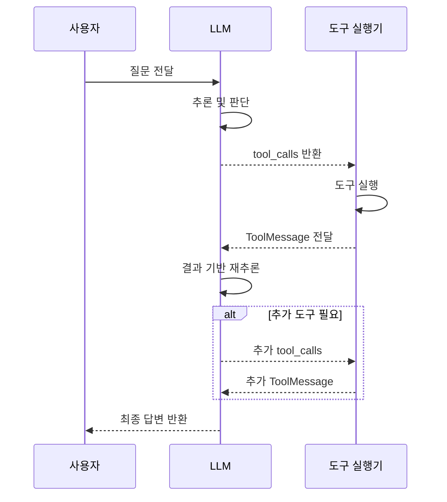
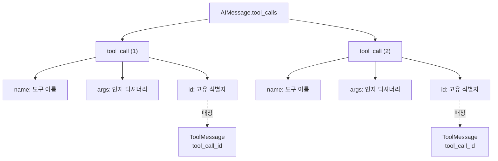
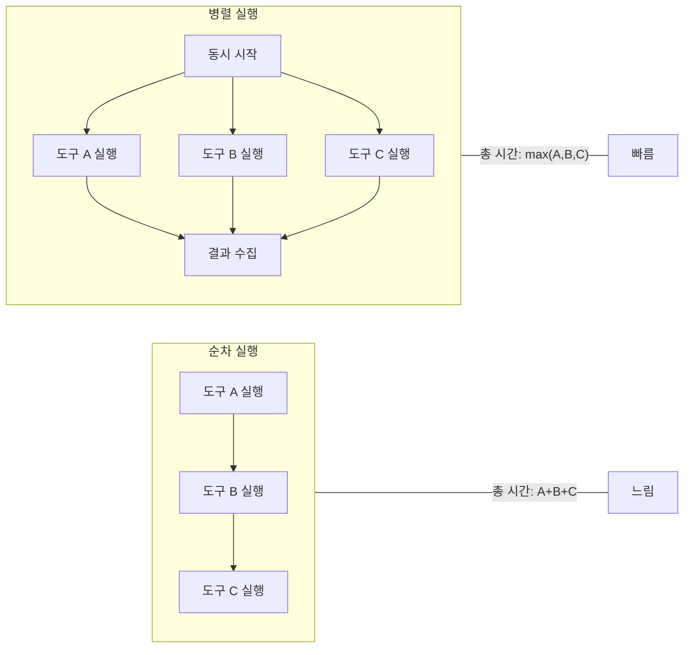
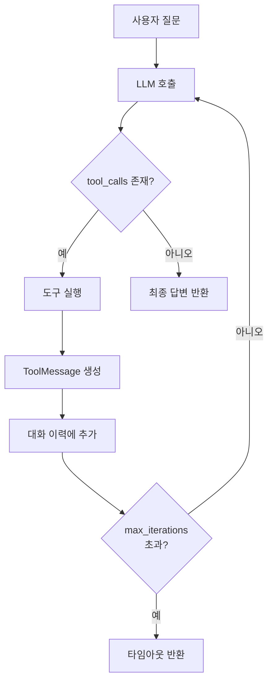
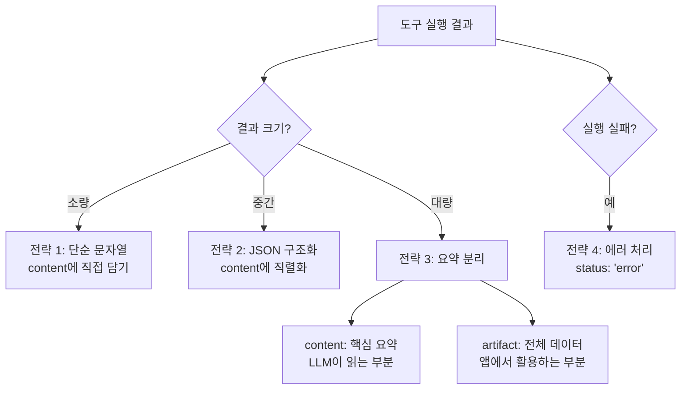

# 도구 호출 처리

> LLM이 요청한 도구 호출을 파싱하고, 실행하고, 결과를 다시 모델에 전달하는 전체 흐름을 마스터합니다.

## 개요

이 섹션에서는 [세션 11.1: 도구 정의와 바인딩](ch11/session_11_1.md)에서 배운 `bind_tools()`와 `tool_calls`, [세션 11.2: 내장 도구 활용](ch11/session_11_2.md)에서 익힌 다양한 내장 도구를 바탕으로, **도구 호출의 전체 생명주기**를 자동화하는 방법을 다룹니다. LLM이 반환한 `tool_calls`를 파싱하고, 병렬로 실행하며, `ToolMessage`로 결과를 포맷팅해 모델에 다시 전달하는 루프를 직접 구현합니다.

> 📊 **그림 1**: 도구 호출의 전체 생명주기 — 요청부터 최종 답변까지




**선수 지식**: `@tool` 데코레이터, `bind_tools()`, `AIMessage.tool_calls`, `ToolMessage` 기본 개념 (세션 11.1), 내장 도구 사용법과 `tool_map` 패턴 (세션 11.2)
**학습 목표**:
- `AIMessage.tool_calls`의 구조를 완전히 이해하고 파싱할 수 있다
- 병렬 도구 호출(parallel tool calls)을 처리할 수 있다
- `ToolMessage`의 `content`, `tool_call_id`, `artifact` 필드를 적절히 활용할 수 있다
- 도구 실행 → 결과 전달 → 재호출의 자동화 루프를 구현할 수 있다

## 왜 알아야 할까?

세션 11.1에서 우리는 도구 호출의 3단계 흐름(요청 → 실행 → 결과 전달)을 배웠는데요. 하지만 실제 애플리케이션에서는 이 과정이 **한 번으로 끝나지 않습니다**. 사용자가 "서울 날씨를 확인하고, 그 정보를 바탕으로 여행 계획을 세워줘"라고 요청하면 어떻게 될까요? LLM은 먼저 날씨 도구를 호출하고, 그 결과를 받은 뒤 다시 추론하여 계획을 세워야 합니다. 때로는 한 번에 **여러 도구를 동시에** 호출하기도 하죠.

이런 복잡한 흐름을 수동으로 매번 작성하면 코드는 금세 스파게티가 됩니다. 도구 호출 처리를 체계적으로 자동화하면, 단 몇 줄의 루프로 LLM이 필요한 만큼 도구를 사용하고 최종 답변을 생성하는 **자율적인 시스템**을 만들 수 있습니다. 이것이 바로 다음 챕터에서 배울 에이전트(Agent)의 핵심 메커니즘이기도 합니다.

## 핵심 개념

### 개념 1: tool_calls 파싱 — 주문서 읽기

> 💡 **비유**: 식당에서 웨이터가 손님의 주문을 받아왔다고 상상해보세요. 주문서에는 "김치찌개 1개, 된장찌개 2개"처럼 요리 이름과 수량이 적혀 있죠. `AIMessage.tool_calls`는 바로 이 **주문서**입니다. LLM이 "이 도구를 이 인자로 호출해주세요"라고 적어놓은 요청 목록이에요.

`AIMessage.tool_calls`는 리스트 형태이며, 각 항목은 딕셔너리 구조를 가집니다:

```python
# tool_calls의 구조
{
    "name": str,        # 호출할 도구 이름
    "args": dict,       # 도구에 전달할 인자
    "id": str,          # 이 호출의 고유 식별자
    "type": "tool_call" # 항상 "tool_call"
}
```

여기서 `id` 필드가 특히 중요한데요, 이 값이 나중에 `ToolMessage`의 `tool_call_id`와 매칭되어 "이 결과는 저 요청에 대한 답변이야"라는 연결고리를 만들어줍니다. 마치 식당에서 주문 번호로 어떤 테이블 음식인지 구분하는 것과 같죠.

> 📊 **그림 2**: tool_calls 파싱 구조 — 주문서에서 정보 읽기




```python
from langchain_openai import ChatOpenAI
from langchain_core.tools import tool

# 도구 정의
@tool
def get_weather(city: str) -> str:
    """도시의 현재 날씨를 조회합니다."""
    # 실제로는 API 호출
    weather_data = {"서울": "맑음, 15°C", "부산": "흐림, 18°C"}
    return weather_data.get(city, f"{city}의 날씨 정보를 찾을 수 없습니다")

@tool
def get_population(city: str) -> str:
    """도시의 인구 정보를 조회합니다."""
    pop_data = {"서울": "약 950만 명", "부산": "약 330만 명"}
    return pop_data.get(city, f"{city}의 인구 정보를 찾을 수 없습니다")

# 모델에 도구 바인딩
llm = ChatOpenAI(model="gpt-4o", temperature=0)
llm_with_tools = llm.bind_tools([get_weather, get_population])

# 호출 및 tool_calls 파싱
response = llm_with_tools.invoke("서울의 날씨와 인구를 알려줘")

# tool_calls 확인
for tc in response.tool_calls:
    print(f"도구: {tc['name']}")        # 예: "get_weather"
    print(f"인자: {tc['args']}")        # 예: {"city": "서울"}
    print(f"ID:   {tc['id']}")          # 예: "call_abc123..."
    print("---")

# 출력 예시:
# 도구: get_weather
# 인자: {'city': '서울'}
# ID:   call_abc123...
# ---
# 도구: get_population
# 인자: {'city': '서울'}
# ID:   call_def456...
# ---
```

눈치채셨나요? LLM이 "서울의 날씨**와** 인구"라는 요청에 대해 **두 개의 도구를 동시에** 호출하도록 요청했습니다. 이것이 바로 **병렬 도구 호출(parallel tool calls)**입니다.

### 개념 2: 병렬 도구 호출 — 동시에 여러 주문 처리하기

> 💡 **비유**: 한 명의 셰프가 요리를 하나씩 순서대로 만드는 것과, 여러 셰프가 동시에 각자 다른 요리를 만드는 것. 어떤 게 더 빠를까요? 병렬 도구 호출은 후자에 해당합니다. LLM이 한 번의 응답에서 여러 도구 호출을 요청하면, 우리는 이를 **동시에 실행**하여 총 대기 시간을 크게 줄일 수 있습니다.

> 📊 **그림 3**: 순차 실행 vs 병렬 실행 비교




OpenAI가 2023년 11월 개발자 컨퍼런스에서 **병렬 함수 호출(parallel function calling)**을 발표했을 때, 이는 LLM 도구 사용의 패러다임을 바꿨습니다. 기존에는 도구를 하나씩 순차 호출해야 했는데, 이제 모델이 독립적인 여러 작업을 한 번에 요청할 수 있게 된 거죠.

LangChain에서 병렬 도구 호출을 처리하는 방법을 살펴보겠습니다:

```python
import asyncio
from langchain_core.messages import ToolMessage

# tool_map: 도구 이름 → 도구 객체 매핑 (세션 11.2에서 배운 패턴)
tool_map = {
    "get_weather": get_weather,
    "get_population": get_population,
}

# 방법 1: 순차 실행 (간단하지만 느림)
def execute_tools_sequential(tool_calls: list, tool_map: dict) -> list[ToolMessage]:
    """도구 호출을 순차적으로 실행합니다."""
    tool_messages = []
    for tc in tool_calls:
        tool = tool_map[tc["name"]]             # 도구 찾기
        result = tool.invoke(tc["args"])         # 실행
        tool_messages.append(
            ToolMessage(
                content=str(result),             # 결과를 문자열로
                tool_call_id=tc["id"],           # 요청 ID와 매칭
                name=tc["name"],                 # 도구 이름 (선택)
            )
        )
    return tool_messages

# 방법 2: 비동기 병렬 실행 (빠름!)
async def execute_tools_parallel(tool_calls: list, tool_map: dict) -> list[ToolMessage]:
    """도구 호출을 병렬로 실행합니다."""
    async def run_one(tc):
        tool = tool_map[tc["name"]]
        result = await tool.ainvoke(tc["args"])  # 비동기 실행
        return ToolMessage(
            content=str(result),
            tool_call_id=tc["id"],
            name=tc["name"],
        )
    
    # 모든 도구를 동시에 실행
    return await asyncio.gather(*[run_one(tc) for tc in tool_calls])
```

> ⚠️ **흔한 오해**: "병렬 도구 호출은 내가 직접 구현해야 한다"고 생각하기 쉽지만, LangGraph의 `ToolNode`를 사용하면 자동으로 병렬 실행됩니다. 하지만 원리를 이해하고 있어야 커스터마이징이 가능하기 때문에 직접 구현하는 법을 먼저 배우는 것이 중요합니다.

### 개념 3: ToolMessage 심화 — 결과를 제대로 포장하기

> 💡 **비유**: 택배를 보낼 때를 생각해보세요. 송장 번호(`tool_call_id`)가 있어야 수신자가 어떤 주문에 대한 배송인지 알 수 있고, 내용물(`content`)이 있어야 하며, 때로는 영수증 같은 부가 정보(`artifact`)도 함께 넣죠. `ToolMessage`는 도구 실행 결과를 이 모든 정보와 함께 깔끔하게 포장하는 택배 상자입니다.

`ToolMessage`의 주요 필드를 자세히 살펴보겠습니다:

```python
from langchain_core.messages import ToolMessage

# 기본 사용: content + tool_call_id
basic_msg = ToolMessage(
    content="서울: 맑음, 15°C",          # 모델에게 전달할 핵심 내용
    tool_call_id="call_abc123",           # 어떤 요청에 대한 응답인지
)

# 고급 사용: artifact 활용
# artifact는 모델에게 보내지 않지만 앱에서 활용할 수 있는 추가 데이터
detailed_msg = ToolMessage(
    content="서울: 맑음, 15°C",          # 모델이 보는 요약 정보
    tool_call_id="call_abc123",
    name="get_weather",                   # 어떤 도구의 결과인지
    artifact={                            # 모델에게는 안 보내지만 앱에서 활용
        "temperature": 15,
        "humidity": 45,
        "wind_speed": 3.2,
        "forecast_hours": [16, 17, 14, 13],
        "raw_api_response": { ... }
    },
)

# status 필드: 도구 실행 성공/실패 표시
error_msg = ToolMessage(
    content="API 호출 실패: 네트워크 오류",
    tool_call_id="call_abc123",
    status="error",                       # 에러 상태 명시
)
```

`artifact` 필드는 왜 필요할까요? 예를 들어 이미지 검색 도구가 있다면, 모델에게는 `"검색 결과: 고양이 사진 3장 발견"`이라는 텍스트만 보내고, 실제 이미지 URL이나 바이너리 데이터는 `artifact`에 저장해서 프론트엔드에서 직접 렌더링할 수 있습니다. 모델에게 불필요한 대량 데이터를 보내지 않으면서도, 애플리케이션에서는 전체 데이터를 활용할 수 있는 거죠.

### 개념 4: 도구 실행 자동화 루프 — 자율 주행 시스템

> 💡 **비유**: 자동차의 자율 주행을 생각해보세요. "목적지까지 알아서 가줘"라고 하면, 차는 (1) 현재 상황을 판단하고, (2) 핸들을 꺾거나 가속하고(도구 실행), (3) 그 결과를 감지하고, (4) 다시 판단하는... 이 루프를 목적지에 도착할 때까지 반복합니다. 도구 실행 자동화 루프도 똑같은 원리입니다!

핵심 아이디어는 간단합니다: **`tool_calls`가 비어 있을 때까지 반복**하면 됩니다.

> 📊 **그림 4**: 도구 실행 자동화 루프 흐름도




```python
from langchain_core.messages import HumanMessage, AIMessage, ToolMessage
from langchain_openai import ChatOpenAI
from langchain_core.tools import tool

@tool
def calculator(expression: str) -> str:
    """수학 표현식을 계산합니다. 예: '2 + 3 * 4'"""
    try:
        return str(eval(expression))  # 실습용 간단 구현
    except Exception as e:
        return f"계산 오류: {e}"

@tool
def unit_converter(value: float, from_unit: str, to_unit: str) -> str:
    """단위를 변환합니다."""
    conversions = {
        ("km", "mile"): 0.621371,
        ("kg", "lb"): 2.20462,
        ("celsius", "fahrenheit"): lambda v: v * 9/5 + 32,
    }
    key = (from_unit.lower(), to_unit.lower())
    if key in conversions:
        factor = conversions[key]
        if callable(factor):
            result = factor(value)
        else:
            result = value * factor
        return f"{value} {from_unit} = {result:.2f} {to_unit}"
    return f"변환 불가: {from_unit} → {to_unit}"

# 도구 설정
tools = [calculator, unit_converter]
tool_map = {t.name: t for t in tools}
llm = ChatOpenAI(model="gpt-4o", temperature=0)
llm_with_tools = llm.bind_tools(tools)

def run_tool_loop(user_input: str, max_iterations: int = 10) -> str:
    """도구 호출 자동화 루프를 실행합니다."""
    messages = [HumanMessage(content=user_input)]
    
    for i in range(max_iterations):
        # 1단계: LLM 호출
        response = llm_with_tools.invoke(messages)
        messages.append(response)  # AI 응답을 대화 이력에 추가
        
        # 2단계: 도구 호출이 없으면 최종 답변 → 루프 종료
        if not response.tool_calls:
            return response.content
        
        # 3단계: 도구 실행 및 결과 수집
        print(f"[반복 {i+1}] {len(response.tool_calls)}개 도구 호출 감지")
        for tc in response.tool_calls:
            print(f"  → {tc['name']}({tc['args']})")
            
            # 도구 실행
            tool_result = tool_map[tc["name"]].invoke(tc["args"])
            
            # ToolMessage로 결과 추가
            messages.append(
                ToolMessage(
                    content=str(tool_result),
                    tool_call_id=tc["id"],
                    name=tc["name"],
                )
            )
        # 4단계: 다시 1단계로 → LLM이 결과를 보고 추가 판단
    
    return "최대 반복 횟수에 도달했습니다."

# 실행
result = run_tool_loop("마라톤 풀코스(42.195km)가 몇 마일인지 계산해주고, 그 거리의 제곱도 구해줘")
print(result)

# 출력 예시:
# [반복 1] 2개 도구 호출 감지
#   → unit_converter({'value': 42.195, 'from_unit': 'km', 'to_unit': 'mile'})
#   → calculator({'expression': '26.22 ** 2'})
# 마라톤 풀코스 42.195km는 약 26.22마일이며, 그 거리의 제곱은 약 687.49입니다.
```

이 루프의 흐름을 정리하면:

```
사용자 질문
    ↓
┌─→ LLM 호출
│     ↓
│   tool_calls 있음?
│     ├─ 예 → 도구 실행 → ToolMessage 생성 → 대화 이력에 추가 ─┐
│     └─ 아니오 → 최종 답변 반환 (종료)                          │
└──────────────────────────────────────────────────────────────┘
```

### 개념 5: 결과 포맷팅 전략 — 모델이 이해하기 쉽게

도구 실행 결과를 `ToolMessage`의 `content`에 어떻게 담느냐에 따라 LLM의 후속 추론 품질이 달라집니다. 결과 포맷팅은 생각보다 중요한데요, 몇 가지 전략을 소개합니다:

> 📊 **그림 5**: ToolMessage 결과 포맷팅 전략 — content vs artifact 분리




```python
import json

# 전략 1: 단순 문자열 (간단한 결과)
ToolMessage(content="15°C, 맑음", tool_call_id=tc_id)

# 전략 2: 구조화된 JSON (복잡한 결과)
result = {"temperature": 15, "condition": "맑음", "humidity": 45}
ToolMessage(content=json.dumps(result, ensure_ascii=False), tool_call_id=tc_id)

# 전략 3: 요약 + 상세 분리 (대량 데이터)
search_results = [{"title": "문서1", "snippet": "..."}, ...]  # 10개 결과
summary = f"검색 결과 {len(search_results)}건 발견. 상위 3건:\n"
for r in search_results[:3]:
    summary += f"- {r['title']}: {r['snippet'][:50]}...\n"

ToolMessage(
    content=summary,                # 모델에게는 요약만
    artifact=search_results,        # 전체 데이터는 artifact에
    tool_call_id=tc_id,
)

# 전략 4: 에러 처리가 포함된 결과
def format_tool_result(tc: dict, tool_map: dict) -> ToolMessage:
    """도구 실행 결과를 안전하게 포맷팅합니다."""
    try:
        tool = tool_map.get(tc["name"])
        if tool is None:
            return ToolMessage(
                content=f"알 수 없는 도구: {tc['name']}",
                tool_call_id=tc["id"],
                status="error",
            )
        result = tool.invoke(tc["args"])
        return ToolMessage(
            content=str(result),
            tool_call_id=tc["id"],
            name=tc["name"],
        )
    except Exception as e:
        return ToolMessage(
            content=f"도구 실행 오류: {type(e).__name__}: {e}",
            tool_call_id=tc["id"],
            name=tc["name"],
            status="error",
        )
```

> 🔥 **실무 팁**: 도구 결과가 너무 길면 LLM의 컨텍스트 윈도우를 낭비합니다. 모델에게는 핵심 정보만 `content`에 담고, 전체 데이터는 `artifact`에 저장하는 습관을 들이세요. 특히 DB 쿼리 결과나 API 응답처럼 대량 데이터를 반환하는 도구에서 이 패턴이 빛을 발합니다.

## 실습: 직접 해보기

멀티 도구 자동화 리서치 봇을 만들어보겠습니다. 사용자의 질문에 따라 여러 도구를 자동으로 호출하고, 결과를 종합하여 답변을 생성합니다.

```python
"""
멀티 도구 자동화 리서치 봇
- 도구 호출 자동화 루프
- 병렬 도구 호출 처리
- 결과 포맷팅 및 에러 핸들링
"""
import json
import logging
from typing import Any

from dotenv import load_dotenv
from langchain_core.messages import HumanMessage, AIMessage, ToolMessage
from langchain_core.tools import tool
from langchain_openai import ChatOpenAI

# 환경 변수 로드
load_dotenv()

# 로깅 설정
logging.basicConfig(level=logging.INFO)
logger = logging.getLogger(__name__)

# ─── 도구 정의 ───

@tool
def search_news(query: str, max_results: int = 3) -> str:
    """뉴스를 검색합니다. query: 검색어, max_results: 최대 결과 수"""
    # 실제로는 뉴스 API 호출
    mock_results = [
        {"title": f"[속보] {query} 관련 최신 뉴스 {i+1}", "date": "2026-03-03"}
        for i in range(max_results)
    ]
    return json.dumps(mock_results, ensure_ascii=False)

@tool
def get_stock_price(ticker: str) -> str:
    """주식 가격을 조회합니다. ticker: 종목 코드 (예: AAPL, 005930)"""
    # 실제로는 주식 API 호출
    mock_prices = {
        "AAPL": {"price": 198.50, "change": "+1.2%"},
        "005930": {"price": 72000, "change": "-0.5%"},
        "GOOGL": {"price": 175.30, "change": "+0.8%"},
    }
    data = mock_prices.get(ticker.upper())
    if data:
        return json.dumps(data, ensure_ascii=False)
    return f"종목 코드 '{ticker}'를 찾을 수 없습니다"

@tool
def calculate(expression: str) -> str:
    """수학 표현식을 계산합니다. 예: '100 * 1.05 ** 3'"""
    try:
        result = eval(expression)
        return f"{expression} = {result}"
    except Exception as e:
        return f"계산 오류: {e}"

@tool
def summarize_data(data: str, format: str = "bullet") -> str:
    """데이터를 요약합니다. data: 요약할 텍스트, format: 'bullet' 또는 'paragraph'"""
    # 간단한 요약 시뮬레이션
    lines = data.split("\n") if "\n" in data else [data]
    if format == "bullet":
        return "\n".join(f"• {line.strip()}" for line in lines[:5] if line.strip())
    return " ".join(line.strip() for line in lines[:3] if line.strip())

# ─── 도구 실행 엔진 ───

# 사용할 도구 목록
TOOLS = [search_news, get_stock_price, calculate, summarize_data]
TOOL_MAP = {t.name: t for t in TOOLS}

# 시스템 프롬프트
SYSTEM_PROMPT = """당신은 다양한 도구를 활용하는 리서치 어시스턴트입니다.
사용자의 질문에 답하기 위해 필요한 도구를 적절히 호출하세요.
여러 정보가 필요하면 도구를 동시에 호출할 수 있습니다.
모든 도구 결과를 종합하여 한국어로 명확하게 답변하세요."""


def execute_tool_call(tc: dict) -> ToolMessage:
    """단일 도구 호출을 실행하고 ToolMessage를 반환합니다."""
    tool_name = tc["name"]
    tool_args = tc["args"]
    tool_call_id = tc["id"]
    
    logger.info(f"도구 실행: {tool_name}({tool_args})")
    
    # 도구 존재 여부 확인
    if tool_name not in TOOL_MAP:
        return ToolMessage(
            content=f"알 수 없는 도구: {tool_name}",
            tool_call_id=tool_call_id,
            status="error",
        )
    
    try:
        # 도구 실행
        result = TOOL_MAP[tool_name].invoke(tool_args)
        
        # 결과 포맷팅: JSON 파싱 시도 → 성공하면 구조화, 실패하면 문자열 그대로
        try:
            parsed = json.loads(result)
            content = json.dumps(parsed, ensure_ascii=False, indent=2)
            artifact = parsed  # 파싱된 데이터를 artifact에 보존
        except (json.JSONDecodeError, TypeError):
            content = str(result)
            artifact = None
        
        return ToolMessage(
            content=content,
            tool_call_id=tool_call_id,
            name=tool_name,
            artifact=artifact,
        )
        
    except Exception as e:
        logger.error(f"도구 실행 실패 — {tool_name}: {e}")
        return ToolMessage(
            content=f"실행 오류: {type(e).__name__}: {e}",
            tool_call_id=tool_call_id,
            name=tool_name,
            status="error",
        )


def run_research_bot(
    user_input: str,
    max_iterations: int = 5,
    verbose: bool = True,
) -> dict[str, Any]:
    """
    멀티 도구 자동화 리서치 봇을 실행합니다.
    
    Args:
        user_input: 사용자 질문
        max_iterations: 최대 도구 호출 루프 반복 횟수
        verbose: 상세 로그 출력 여부
    
    Returns:
        {"answer": 최종 답변, "tool_calls_log": 도구 호출 이력}
    """
    llm = ChatOpenAI(model="gpt-4o", temperature=0)
    llm_with_tools = llm.bind_tools(TOOLS)
    
    # 대화 이력 초기화
    messages = [
        {"role": "system", "content": SYSTEM_PROMPT},
        HumanMessage(content=user_input),
    ]
    
    tool_calls_log = []  # 도구 호출 이력 기록
    
    for iteration in range(1, max_iterations + 1):
        # ── 1단계: LLM 호출 ──
        response: AIMessage = llm_with_tools.invoke(messages)
        messages.append(response)
        
        # ── 2단계: 도구 호출 여부 확인 ──
        if not response.tool_calls:
            if verbose:
                print(f"\n{'='*50}")
                print(f"[최종 답변] (반복 {iteration}회 만에 완료)")
                print(f"{'='*50}")
                print(response.content)
            return {
                "answer": response.content,
                "tool_calls_log": tool_calls_log,
                "iterations": iteration,
            }
        
        # ── 3단계: 도구 실행 ──
        if verbose:
            print(f"\n[반복 {iteration}] {len(response.tool_calls)}개 도구 호출")
        
        for tc in response.tool_calls:
            # 도구 실행
            tool_msg = execute_tool_call(tc)
            messages.append(tool_msg)
            
            # 이력 기록
            log_entry = {
                "iteration": iteration,
                "tool": tc["name"],
                "args": tc["args"],
                "result_preview": tool_msg.content[:100],
                "status": getattr(tool_msg, "status", "success"),
            }
            tool_calls_log.append(log_entry)
            
            if verbose:
                status = "✓" if log_entry["status"] != "error" else "✗"
                print(f"  {status} {tc['name']}({tc['args']}) → {tool_msg.content[:60]}...")
        
        # ── 4단계: 다시 1단계로 (루프 계속) ──
    
    # 최대 반복 도달
    return {
        "answer": "최대 반복 횟수에 도달했습니다. 마지막 응답: " + response.content,
        "tool_calls_log": tool_calls_log,
        "iterations": max_iterations,
    }


# ─── 실행 ───
if __name__ == "__main__":
    # 테스트 1: 단일 도구 호출
    print("=" * 60)
    print("테스트 1: 단일 도구 호출")
    print("=" * 60)
    result1 = run_research_bot("애플(AAPL) 주가가 얼마야?")
    
    print("\n")
    
    # 테스트 2: 병렬 도구 호출
    print("=" * 60)
    print("테스트 2: 병렬 도구 호출")
    print("=" * 60)
    result2 = run_research_bot(
        "삼성전자(005930)와 애플(AAPL) 주가를 비교해주고, "
        "환율 1350원 기준으로 삼성전자를 달러로 환산하면 얼마인지 계산해줘"
    )
    
    print("\n")
    
    # 테스트 3: 멀티 스텝 도구 호출
    print("=" * 60)
    print("테스트 3: 멀티 스텝 추론")
    print("=" * 60)
    result3 = run_research_bot(
        "AI 반도체 최신 뉴스를 검색하고, "
        "그 결과를 bullet 형식으로 요약해줘"
    )
    
    # 도구 호출 이력 확인
    print("\n\n[도구 호출 이력 — 테스트 2]")
    for log in result2["tool_calls_log"]:
        print(f"  반복 {log['iteration']}: {log['tool']}({log['args']})")
```

## 더 깊이 알아보기

### 함수 호출에서 도구 호출로: 명칭 변경의 이유

OpenAI가 2023년 6월에 처음 "function calling"을 발표했을 때, 커뮤니티는 열광했습니다. LLM이 구조화된 출력을 안정적으로 생성할 수 있게 된 것이니까요. 하지만 이 기능은 빠르게 진화했습니다.

2023년 11월, OpenAI 개발자 컨퍼런스에서 두 가지 중요한 변화가 있었는데요. 첫째, "function calling"이 "**tool calling**"으로 이름이 바뀌었습니다. 함수 호출은 도구 사용의 한 형태일 뿐이고, 코드 실행기(Code Interpreter)나 파일 검색 같은 다른 도구들도 있으므로 더 포괄적인 이름이 필요했기 때문입니다. 둘째, **병렬 도구 호출**이 도입되었습니다. 하나의 응답에서 여러 도구를 동시에 요청할 수 있게 되면서, "서울 날씨와 도쿄 날씨를 동시에 알려줘" 같은 요청이 한 번의 LLM 호출로 처리 가능해졌습니다.

LangChain은 이 변화에 발빠르게 대응했습니다. Harrison Chase와 LangChain 팀은 각 모델 제공업체(OpenAI, Anthropic, Google, Mistral 등)의 서로 다른 도구 호출 구현을 **`bind_tools()`와 `tool_calls`라는 통합 인터페이스**로 감쌌는데요. 덕분에 개발자는 모델을 교체해도 도구 호출 코드를 수정할 필요가 없게 되었습니다. 공식 블로그에서 Harrison은 "가장 성능이 좋은 세 모델의 도구 호출 방식이 서로 호환되지 않았다"고 이 결정의 배경을 설명했습니다.

### tool_call_id가 꼭 필요한 이유

병렬 도구 호출이 도입되기 전에는 `tool_call_id`가 크게 중요하지 않았습니다. 어차피 도구 호출이 하나뿐이니 결과도 하나였으니까요. 하지만 LLM이 한 번에 3개의 도구를 호출하면? 돌아오는 3개의 결과가 각각 어떤 요청에 대한 것인지 매칭해야 합니다. `tool_call_id`는 바로 이 **주문 번호** 역할을 합니다. 이 ID가 잘못 매칭되면 LLM은 날씨 결과를 주가로 오해하는 식의 혼란에 빠질 수 있습니다.

## 흔한 오해와 팁

> ⚠️ **흔한 오해**: "`tool_calls`가 빈 리스트면 에러가 난 것이다." — 아닙니다! `tool_calls`가 비어 있다는 것은 LLM이 **더 이상 도구가 필요 없다**고 판단한 것입니다. 즉, 충분한 정보를 얻었으므로 `response.content`에 최종 답변을 담아 반환한 것이죠. 이것이 바로 자동화 루프의 정상적인 종료 조건입니다.

> 💡 **알고 계셨나요?**: OpenAI의 병렬 도구 호출은 기본적으로 활성화되어 있습니다. 만약 순차 실행이 필요하다면 `llm.bind_tools(tools, parallel_tool_calls=False)`로 비활성화할 수 있는데요, 이는 도구 간에 의존성이 있을 때(A 도구의 결과가 B 도구의 입력이 되는 경우) 유용합니다.

> 🔥 **실무 팁**: `max_iterations`를 반드시 설정하세요! 도구 호출 루프에 상한이 없으면, LLM이 무한 루프에 빠질 수 있습니다. 프로덕션에서는 보통 5~10회로 제한하고, 도달 시 사용자에게 "더 구체적인 질문을 해주세요"라고 안내하는 것이 좋습니다. 또한 각 반복의 도구 호출 비용(API 토큰)도 누적되므로 비용 관리 측면에서도 중요합니다.

> 🔥 **실무 팁**: `ToolMessage`의 `content`는 반드시 **문자열**이어야 합니다. 딕셔너리나 리스트를 직접 넣으면 에러가 납니다. `json.dumps()`로 직렬화하거나 `str()`로 변환하는 것을 잊지 마세요.

## 핵심 정리

| 개념 | 설명 |
|------|------|
| `tool_calls` 구조 | `[{"name", "args", "id", "type"}]` — LLM이 요청한 도구 호출 목록 |
| `tool_call_id` | 도구 요청과 응답을 매칭하는 고유 식별자. 병렬 호출 시 필수 |
| `ToolMessage` | `content`(모델용 결과) + `tool_call_id`(매칭) + `artifact`(앱용 추가 데이터) |
| `artifact` 필드 | 모델에게는 보내지 않지만 애플리케이션에서 활용할 수 있는 부가 데이터 |
| `status` 필드 | 도구 실행 성공/실패를 명시 (`"error"` 등) |
| 병렬 도구 호출 | LLM이 한 번에 여러 도구를 요청. `asyncio.gather()`로 동시 실행 가능 |
| 자동화 루프 | `tool_calls`가 빌 때까지 LLM 호출 → 도구 실행 → 결과 전달 반복 |
| 결과 포맷팅 | 핵심은 `content`, 전체 데이터는 `artifact`에 분리하여 토큰 절약 |

## 다음 섹션 미리보기

도구 호출 처리의 전체 흐름을 마스터했으니, 다음 세션에서는 이 도구 시스템을 **안전하게 운영**하는 방법을 다룹니다. 사용자 입력 검증, 위험한 도구의 실행 제한, 타임아웃 처리, 그리고 도구 실행 샌드박스 구현 등 **프로덕션 환경에서 반드시 필요한 보안 패턴**을 배우게 됩니다. "자동차가 스스로 운전할 수 있게 됐다면, 이제 안전벨트와 에어백을 달아야 할 차례"인 셈이죠.

## 참고 자료

- [Tool calling | LangChain Concepts](https://python.langchain.com/docs/concepts/tool_calling) — LangChain 공식 문서의 도구 호출 개념 가이드. `tool_calls`, `ToolMessage`, 병렬 호출 등 핵심 개념을 체계적으로 설명합니다
- [Tool Calling with LangChain (Official Blog)](https://blog.langchain.com/tool-calling-with-langchain/) — LangChain 팀이 `bind_tools()` 통합 인터페이스를 만든 배경과 설계 철학을 소개하는 공식 블로그 포스트
- [ToolMessage API Reference](https://reference.langchain.com/v0.3/python/core/messages/langchain_core.messages.tool.ToolMessage.html) — `ToolMessage` 클래스의 전체 필드와 사용법을 확인할 수 있는 API 레퍼런스
- [Parallel Function Calling for Structured Data Extraction (LangChain Blog)](https://www.blog.langchain.com/parallel-function-calling-extraction/) — 병렬 도구 호출이 데이터 추출에 어떻게 활용되는지 실전 예제와 함께 설명합니다

---
### 🔗 Related Sessions
- [tool](../11-도구tools와-함수-호출/01-도구-정의와-바인딩.md) (prerequisite)
- [bind_tools](../11-도구tools와-함수-호출/01-도구-정의와-바인딩.md) (prerequisite)
- [tool_calls](../11-도구tools와-함수-호출/01-도구-정의와-바인딩.md) (prerequisite)
- [toolmessage](../11-도구tools와-함수-호출/01-도구-정의와-바인딩.md) (prerequisite)
- [structuredtool](../11-도구tools와-함수-호출/01-도구-정의와-바인딩.md) (prerequisite)
- [tool_map](../11-도구tools와-함수-호출/02-내장-도구-활용.md) (prerequisite)
