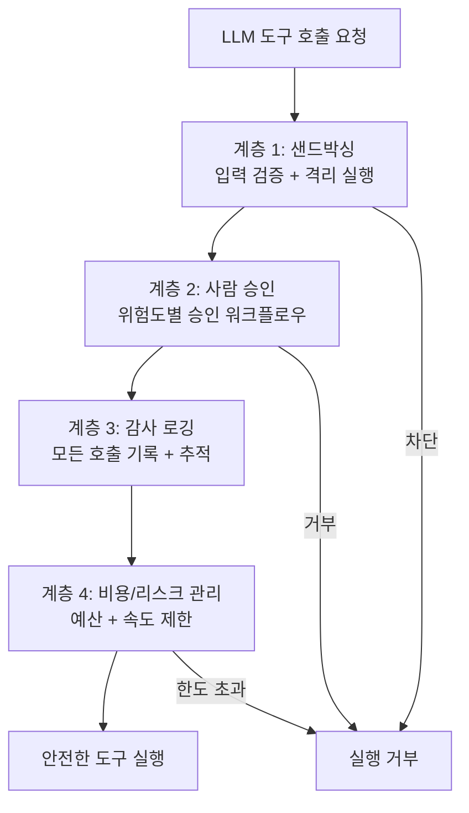
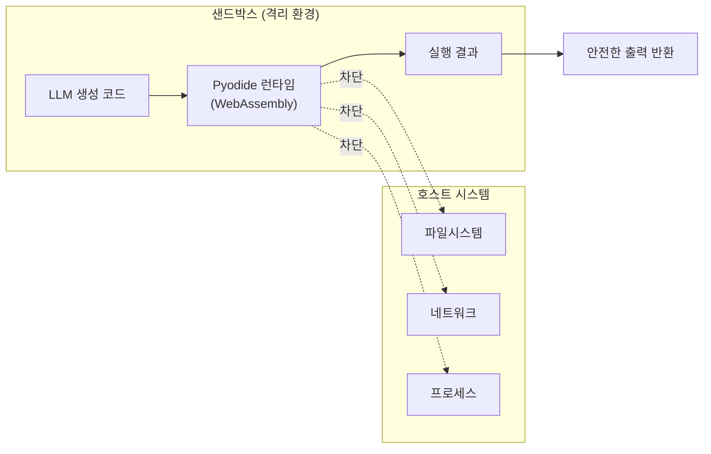
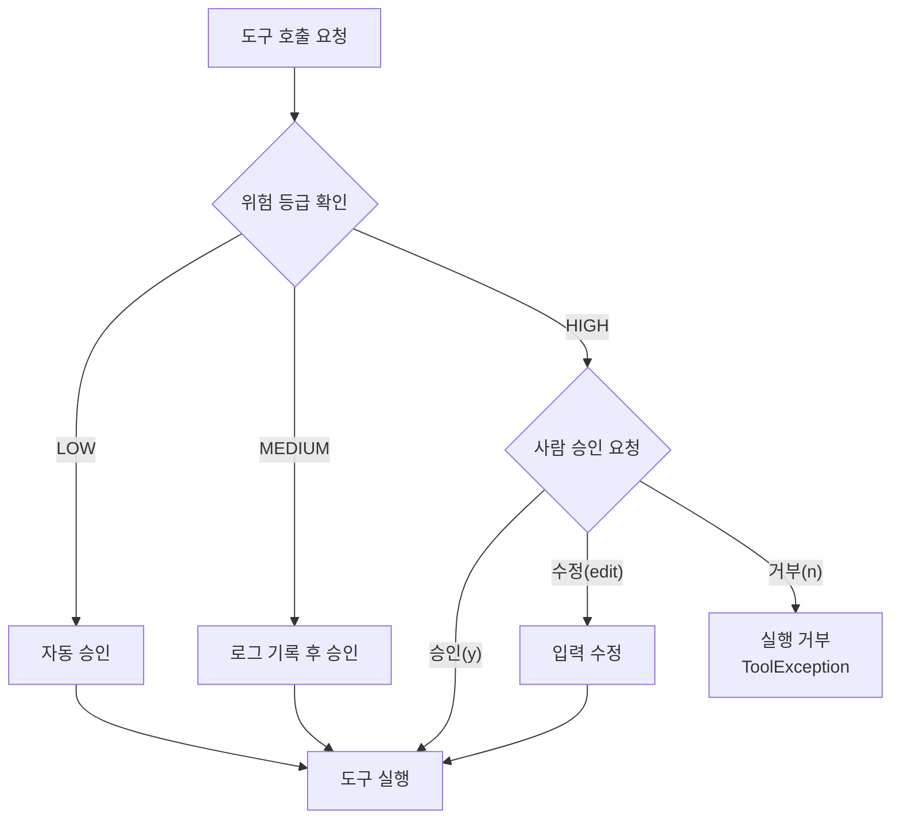
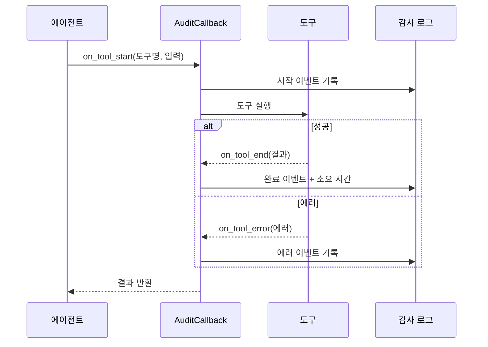
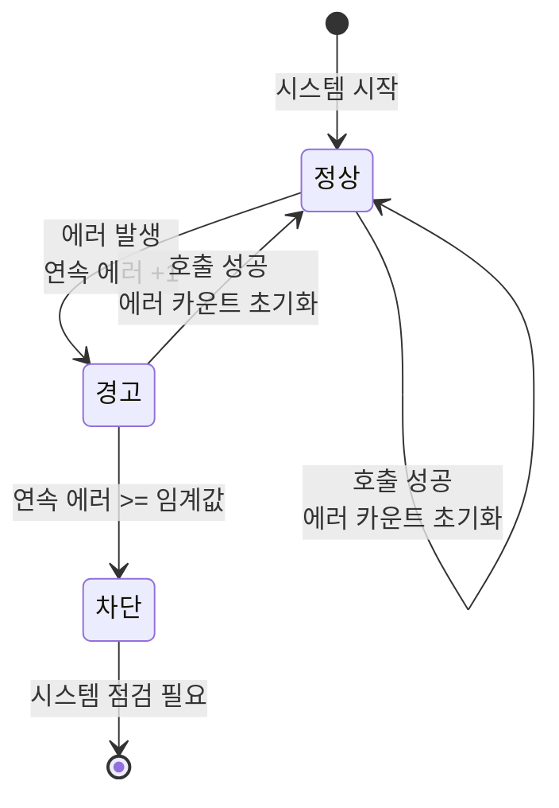

# 안전한 도구 실행

> LLM이 도구를 쓸 때, 안전장치 없이는 프로덕션에 배포할 수 없습니다 — 샌드박싱, 승인 워크플로우, 로깅, 비용 관리까지 완전한 안전망을 구축합니다.

## 개요

이 섹션에서는 LLM이 도구를 호출할 때 발생할 수 있는 보안 위험을 이해하고, 이를 방어하는 4가지 핵심 안전 계층을 구축합니다. [세션 11.4: 고급 도구 패턴](ch11/session4.md)에서 배운 ToolException과 재시도 패턴이 **"도구가 실패했을 때"**의 대응이었다면, 이번 세션은 **"도구가 위험한 일을 하려 할 때"**의 대응입니다.

**선수 지식**: 
- [세션 11.1](ch11/session1.md)의 도구 정의와 bind_tools
- [세션 11.3](ch11/session3.md)의 도구 실행 자동화 루프(tool_loop)
- [세션 11.4](ch11/session4.md)의 ToolException, handle_tool_error, with_retry

**학습 목표**:
- 도구 실행을 격리된 환경(샌드박스)에서 안전하게 수행할 수 있다
- 위험한 도구 호출에 사람의 승인을 요구하는 워크플로우를 구현할 수 있다
- 커스텀 콜백으로 모든 도구 사용을 추적하고 감사(audit) 로그를 남길 수 있다
- 토큰 예산과 호출 빈도 제한으로 비용과 리스크를 통제할 수 있다

## 왜 알아야 할까?

2025년 12월, LangChain 코어에서 심각한 보안 취약점(CVE-2025-68664)이 발견되었습니다. 공격자가 조작된 입력을 통해 도구 실행 경로를 탈취할 수 있는 문제였죠. 이 사건은 "LLM이 도구를 쓴다"는 것이 곧 **외부 시스템에 대한 실행 권한을 위임하는 것**임을 다시 한번 상기시켜 주었습니다.

현실에서 일어날 수 있는 시나리오를 생각해 보세요:

- LLM이 PythonREPLTool로 `os.system("rm -rf /")`를 실행하려 한다면?
- 사용자가 의도하지 않은 API를 호출해 과금이 폭증한다면?
- 에이전트가 반복 루프에 빠져 수백 번의 도구 호출을 한다면?

도구는 LLM에게 **"손과 발"**을 주는 것과 같습니다. 강력하지만, 안전벨트 없이 고속도로를 달리는 것과 다름없거든요. 이 섹션에서 배우는 4가지 안전 계층 — 샌드박싱, 사람 승인, 로깅, 비용 관리 — 은 프로덕션 도구 시스템의 **필수 인프라**입니다.

> 📊 **그림 1**: 안전한 도구 실행의 4계층 방어 구조




## 핵심 개념

### 개념 1: 도구 실행 샌드박싱 — 격리된 놀이터 만들기

> 💡 **비유**: 어린이 놀이터를 생각해 보세요. 아이들(LLM)이 자유롭게 놀 수 있지만, 울타리(샌드박스) 밖의 도로로는 나갈 수 없습니다. 놀이터 안에서 무슨 짓을 해도 바깥 세상에는 영향이 없죠. 도구 실행 샌드박싱도 같은 원리입니다.

**샌드박싱(Sandboxing)**이란 코드 실행을 격리된 환경에 가두어, 호스트 시스템에 영향을 미치지 못하게 하는 기법입니다. LangChain은 2025년에 `langchain-sandbox` 패키지를 공식 출시하여, Pyodide(WebAssembly 기반 Python 런타임)를 활용한 네이티브 샌드박싱을 지원합니다.

> 📊 **그림 2**: 샌드박스 격리 구조 — 호스트 시스템 보호




#### 방법 1: langchain-sandbox (Pyodide 기반)

```python
# pip install langchain-sandbox
from langchain_sandbox import PyodideSandbox

# 샌드박스 생성 — 네트워크 접근 차단
sandbox = PyodideSandbox(
    allow_net=False,  # 네트워크 접근 차단
    timeout=10,       # 10초 타임아웃
)

# 안전한 코드 실행
result = await sandbox.execute("2 + 2")
print(result.output)  # "4"

# 위험한 코드 시도 — 차단됨
result = await sandbox.execute("import os; os.system('rm -rf /')")
print(result.error)  # 네트워크/파일시스템 접근 차단
```

#### 방법 2: 커스텀 권한 제어 샌드박스

실무에서는 Pyodide만으로 부족한 경우가 많습니다. 도구별로 세밀한 권한 제어가 필요하죠.

```python
from dataclasses import dataclass, field
from typing import Any, Callable
from langchain_core.tools import tool, ToolException


@dataclass
class ToolPermission:
    """도구별 권한 정의"""
    allow_network: bool = False      # 네트워크 접근 허용 여부
    allow_file_write: bool = False   # 파일 쓰기 허용 여부
    allow_file_read: bool = True     # 파일 읽기 허용 여부
    max_execution_time: int = 30     # 최대 실행 시간(초)
    allowed_domains: list[str] = field(default_factory=list)  # 허용 도메인
    blocked_commands: list[str] = field(
        default_factory=lambda: ["rm", "del", "drop", "truncate", "shutdown"]
    )


class ToolSandbox:
    """도구 실행을 격리하고 권한을 검증하는 샌드박스"""

    def __init__(self, permissions: dict[str, ToolPermission]):
        self.permissions = permissions  # 도구명 -> 권한 매핑

    def validate_input(self, tool_name: str, tool_input: dict[str, Any]) -> bool:
        """도구 입력에 위험한 패턴이 없는지 검증"""
        perm = self.permissions.get(tool_name)
        if perm is None:
            raise ToolException(f"등록되지 않은 도구: {tool_name}")

        # 입력값을 문자열로 변환하여 위험 명령어 검사
        input_str = str(tool_input).lower()
        for blocked in perm.blocked_commands:
            if blocked in input_str:
                raise ToolException(
                    f"차단된 명령어 '{blocked}'가 입력에 포함되어 있습니다."
                )
        return True

    def execute(
        self, tool_name: str, tool_func: Callable, tool_input: dict[str, Any]
    ) -> Any:
        """권한 검증 후 도구 실행"""
        self.validate_input(tool_name, tool_input)
        perm = self.permissions.get(tool_name, ToolPermission())

        import signal

        def timeout_handler(signum, frame):
            raise TimeoutError(
                f"도구 '{tool_name}' 실행이 {perm.max_execution_time}초를 초과했습니다."
            )

        # 타임아웃 설정 (Unix 계열)
        signal.signal(signal.SIGALRM, timeout_handler)
        signal.alarm(perm.max_execution_time)

        try:
            result = tool_func(**tool_input)
            return result
        finally:
            signal.alarm(0)  # 타임아웃 해제


# 사용 예시
sandbox = ToolSandbox(
    permissions={
        "search_web": ToolPermission(
            allow_network=True,
            allowed_domains=["google.com", "wikipedia.org"],
            max_execution_time=15,
        ),
        "read_file": ToolPermission(
            allow_file_read=True,
            allow_file_write=False,
            max_execution_time=5,
        ),
        "execute_code": ToolPermission(
            allow_network=False,
            allow_file_write=False,
            max_execution_time=10,
            blocked_commands=["rm", "del", "os.system", "subprocess", "eval"],
        ),
    }
)
```

> ⚠️ **흔한 오해**: "LLM은 똑똑하니까 위험한 코드를 스스로 거를 수 있다"고 생각하기 쉽습니다. 하지만 프롬프트 인젝션(Prompt Injection) 공격으로 LLM이 의도와 다른 코드를 실행하도록 유도할 수 있습니다. **보안은 LLM의 판단이 아니라 시스템 수준에서 강제해야 합니다.**

---

### 개념 2: 사람 승인 워크플로우 — 중요한 결정은 사람이

> 💡 **비유**: 은행에서 1만 원을 이체할 때는 비밀번호만 있으면 되지만, 1억 원을 이체할 때는 OTP, 전화 인증, 그리고 창구 직원의 확인까지 필요합니다. 도구 호출도 마찬가지예요. 검색은 자동으로 허용하되, 데이터 삭제나 결제 같은 고위험 작업은 사람의 승인을 거쳐야 합니다.

**Human-in-the-Loop(HITL)**은 에이전트의 도구 호출 중 특정 작업을 사람이 검토하고 승인/거부/수정할 수 있는 패턴입니다.

> 📊 **그림 3**: 위험도 기반 승인 워크플로우




#### 기본 승인 미들웨어 구현

```python
from typing import Any
from enum import Enum
from langchain_core.tools import tool, ToolException
from langchain_core.messages import AIMessage, ToolMessage


class RiskLevel(Enum):
    LOW = "low"        # 자동 승인 (검색, 조회)
    MEDIUM = "medium"  # 로그만 남기고 승인
    HIGH = "high"      # 사람 승인 필수 (삭제, 결제, 전송)


class ToolApprovalMiddleware:
    """도구 호출에 위험도 기반 승인 프로세스를 적용하는 미들웨어"""

    def __init__(self, risk_levels: dict[str, RiskLevel]):
        self.risk_levels = risk_levels  # 도구명 -> 위험 등급 매핑
        self.pending_approvals: list[dict] = []

    def check_approval(
        self, tool_name: str, tool_input: dict[str, Any]
    ) -> tuple[bool, str]:
        """도구 호출의 승인 여부를 결정"""
        risk = self.risk_levels.get(tool_name, RiskLevel.HIGH)

        if risk == RiskLevel.LOW:
            return True, "자동 승인 (저위험)"

        elif risk == RiskLevel.MEDIUM:
            # 로그 남기고 자동 승인
            print(f"[MEDIUM] 도구 '{tool_name}' 호출 기록: {tool_input}")
            return True, "기록 후 승인 (중위험)"

        else:  # HIGH
            # 사람의 승인을 요청
            print(f"\n{'='*50}")
            print(f"⚠️  고위험 도구 호출 승인 요청")
            print(f"도구: {tool_name}")
            print(f"입력: {tool_input}")
            print(f"{'='*50}")
            response = input("승인하시겠습니까? (y/n/edit): ").strip().lower()

            if response == "y":
                return True, "사람이 승인함"
            elif response == "edit":
                # 입력 수정 기회 제공
                new_input = input("수정된 입력(JSON): ")
                import json
                return True, f"수정 후 승인: {json.loads(new_input)}"
            else:
                return False, "사람이 거부함"

    def wrap_tool(self, tool_func, tool_name: str):
        """도구 함수를 승인 프로세스로 감싸기"""
        original_func = tool_func

        def wrapped(**kwargs):
            approved, reason = self.check_approval(tool_name, kwargs)
            if not approved:
                raise ToolException(f"도구 호출이 거부되었습니다: {reason}")
            print(f"[승인] {tool_name}: {reason}")
            return original_func(**kwargs)

        return wrapped


# 사용 예시
approval = ToolApprovalMiddleware(
    risk_levels={
        "search_web": RiskLevel.LOW,        # 검색은 자동 승인
        "read_database": RiskLevel.MEDIUM,   # DB 읽기는 기록 후 승인
        "delete_record": RiskLevel.HIGH,     # 삭제는 사람 승인 필수
        "send_email": RiskLevel.HIGH,        # 이메일 전송은 사람 승인 필수
        "execute_code": RiskLevel.HIGH,      # 코드 실행은 사람 승인 필수
    }
)
```

#### LangGraph의 interrupt를 활용한 승인 (미리보기)

LangGraph에서는 `interrupt` 함수를 사용해 더 세련된 HITL 워크플로우를 구현할 수 있습니다. 이 내용은 [챕터 13: LangGraph 기초](ch13/session1.md)에서 본격적으로 다루지만, 핵심 아이디어를 미리 살펴봅시다.

```python
# LangGraph interrupt 패턴 미리보기 (Ch13에서 상세 학습)
from langgraph.types import interrupt, Command

def tool_node(state):
    """도구 실행 노드 — 고위험 도구는 interrupt로 사람 승인 요청"""
    tool_call = state["messages"][-1].tool_calls[0]
    tool_name = tool_call["name"]

    # 고위험 도구 목록
    high_risk_tools = {"delete_record", "send_email", "execute_code"}

    if tool_name in high_risk_tools:
        # 실행을 중단하고 사람에게 승인 요청
        human_decision = interrupt({
            "tool": tool_name,
            "args": tool_call["args"],
            "question": f"'{tool_name}' 도구 실행을 승인하시겠습니까?",
        })

        if human_decision.get("action") == "reject":
            return {"messages": [ToolMessage(
                content="사용자가 도구 실행을 거부했습니다.",
                tool_call_id=tool_call["id"],
            )]}

    # 승인된 경우 도구 실행
    result = tool_map[tool_name].invoke(tool_call["args"])
    return {"messages": [ToolMessage(content=str(result), tool_call_id=tool_call["id"])]}
```

---

### 개념 3: 도구 사용 로깅과 감사 추적

> 💡 **비유**: CCTV가 없는 가게에서 물건이 없어지면 누가 가져갔는지 알 수 없습니다. 도구 호출도 마찬가지예요. 무슨 도구가, 언제, 어떤 입력으로 호출되었고, 결과가 뭐였는지 기록하지 않으면, 문제가 생겼을 때 원인을 찾을 수 없습니다.

LangChain의 **콜백 시스템**을 활용하면 모든 도구 호출을 자동으로 추적할 수 있습니다. `BaseCallbackHandler`를 상속하여 `on_tool_start`와 `on_tool_end` 이벤트를 가로채는 방식이죠.

> 📊 **그림 4**: 콜백 기반 감사 로깅 흐름




```python
import json
import logging
from datetime import datetime, timezone
from typing import Any
from langchain_core.callbacks import BaseCallbackHandler

# 로거 설정
logger = logging.getLogger("tool_audit")
logger.setLevel(logging.INFO)
handler = logging.FileHandler("tool_audit.log")
handler.setFormatter(logging.Formatter(
    "%(asctime)s | %(levelname)s | %(message)s"
))
logger.addHandler(handler)


class ToolAuditHandler(BaseCallbackHandler):
    """모든 도구 호출을 감사 로그로 기록하는 콜백 핸들러"""

    def __init__(self):
        self.tool_calls: list[dict] = []  # 호출 이력 저장
        self._start_times: dict[str, datetime] = {}

    def on_tool_start(
        self,
        serialized: dict[str, Any],
        input_str: str,
        *,
        run_id,
        **kwargs: Any,
    ) -> None:
        """도구 실행 시작 시 호출"""
        tool_name = serialized.get("name", "unknown")
        self._start_times[str(run_id)] = datetime.now(timezone.utc)

        log_entry = {
            "event": "tool_start",
            "tool": tool_name,
            "input": input_str[:500],  # 입력이 너무 길면 잘라내기
            "run_id": str(run_id),
            "timestamp": datetime.now(timezone.utc).isoformat(),
        }
        logger.info(json.dumps(log_entry, ensure_ascii=False))

    def on_tool_end(
        self,
        output: Any,
        *,
        run_id,
        **kwargs: Any,
    ) -> None:
        """도구 실행 완료 시 호출"""
        start_time = self._start_times.pop(str(run_id), None)
        duration = None
        if start_time:
            duration = (datetime.now(timezone.utc) - start_time).total_seconds()

        log_entry = {
            "event": "tool_end",
            "output": str(output)[:500],  # 출력 길이 제한
            "run_id": str(run_id),
            "duration_seconds": duration,
            "timestamp": datetime.now(timezone.utc).isoformat(),
        }
        self.tool_calls.append(log_entry)
        logger.info(json.dumps(log_entry, ensure_ascii=False))

    def on_tool_error(
        self,
        error: BaseException,
        *,
        run_id,
        **kwargs: Any,
    ) -> None:
        """도구 실행 에러 시 호출"""
        log_entry = {
            "event": "tool_error",
            "error": str(error),
            "run_id": str(run_id),
            "timestamp": datetime.now(timezone.utc).isoformat(),
        }
        logger.error(json.dumps(log_entry, ensure_ascii=False))

    def get_summary(self) -> dict:
        """도구 사용 요약 통계 반환"""
        if not self.tool_calls:
            return {"total_calls": 0}

        durations = [c["duration_seconds"] for c in self.tool_calls if c.get("duration_seconds")]
        return {
            "total_calls": len(self.tool_calls),
            "avg_duration": sum(durations) / len(durations) if durations else 0,
            "max_duration": max(durations) if durations else 0,
        }


# 사용 예시
audit_handler = ToolAuditHandler()

# 에이전트 실행 시 콜백으로 전달
# agent_executor.invoke(
#     {"input": "서울 날씨를 검색해줘"},
#     config={"callbacks": [audit_handler]},
# )
```

#### LangSmith를 활용한 프로덕션 모니터링

로컬 로깅은 개발 단계에 유용하지만, 프로덕션에서는 **LangSmith** 같은 전문 관찰 도구가 필요합니다.

```python
import os

# LangSmith 트레이싱 활성화 (환경 변수 설정)
os.environ["LANGSMITH_TRACING"] = "true"
os.environ["LANGSMITH_API_KEY"] = "your-api-key"
os.environ["LANGSMITH_PROJECT"] = "tool-safety-demo"

# 이후 모든 LangChain 호출이 자동으로 LangSmith에 기록됨
# LangSmith 대시보드에서 확인할 수 있는 정보:
# - 각 도구 호출의 입력/출력
# - 실행 시간과 토큰 사용량
# - 에러 발생 빈도와 패턴
# - 비용 추적 (도구별, 세션별)
```

> 🔥 **실무 팁**: LangSmith는 도구 호출뿐 아니라 LLM 호출, 리트리벌 등 전체 파이프라인의 비용을 통합 추적합니다. `LANGSMITH_TRACING="true"`만 설정하면 코드 수정 없이 모든 트레이스가 자동 수집되거든요. 커스텀 콜백은 LangSmith를 쓸 수 없는 환경(에어갭, 보안 제약)에서의 대안으로 활용하세요.

---

### 개념 4: 비용과 리스크 관리 — 예산 안에서 안전하게

> 💡 **비유**: 해외여행 갈 때 일일 예산을 정해두잖아요? "오늘은 10만 원까지만 쓴다"처럼요. 에이전트도 마찬가지입니다. 도구를 무제한으로 호출하면 API 비용이 폭증하고, 무한 루프에 빠지면 시스템이 마비될 수 있습니다. **예산(budget)**과 **한도(limit)**를 설정하는 것이 핵심이에요.

```python
import time
from dataclasses import dataclass, field
from typing import Any
from langchain_core.tools import ToolException


@dataclass
class UsageBudget:
    """도구 사용 예산 및 제한"""
    max_calls_per_minute: int = 10      # 분당 최대 호출 횟수
    max_calls_per_session: int = 50     # 세션당 최대 호출 횟수
    max_total_cost_usd: float = 1.0     # 세션당 최대 비용(USD)
    max_consecutive_errors: int = 3     # 연속 에러 허용 횟수


class ToolRateLimiter:
    """도구 호출에 속도 제한과 예산 관리를 적용"""

    def __init__(self, budget: UsageBudget):
        self.budget = budget
        self.call_timestamps: list[float] = []  # 호출 시각 기록
        self.total_calls: int = 0
        self.total_cost: float = 0.0
        self.consecutive_errors: int = 0
        self._tool_costs: dict[str, float] = {
            # 도구별 예상 비용 (USD)
            "search_web": 0.01,
            "execute_code": 0.005,
            "send_email": 0.002,
            "call_api": 0.02,
        }

    def check_limits(self, tool_name: str) -> None:
        """호출 전 모든 제한을 검증"""
        now = time.time()

        # 1. 세션 총 호출 횟수 검증
        if self.total_calls >= self.budget.max_calls_per_session:
            raise ToolException(
                f"세션 호출 한도 초과: {self.total_calls}/{self.budget.max_calls_per_session}"
            )

        # 2. 분당 호출 횟수 검증 (슬라이딩 윈도우)
        one_minute_ago = now - 60
        recent_calls = [t for t in self.call_timestamps if t > one_minute_ago]
        if len(recent_calls) >= self.budget.max_calls_per_minute:
            wait_time = 60 - (now - recent_calls[0])
            raise ToolException(
                f"분당 호출 한도 초과. {wait_time:.0f}초 후 재시도하세요."
            )

        # 3. 비용 예산 검증
        estimated_cost = self._tool_costs.get(tool_name, 0.01)
        if self.total_cost + estimated_cost > self.budget.max_total_cost_usd:
            raise ToolException(
                f"비용 예산 초과: ${self.total_cost:.3f}/${self.budget.max_total_cost_usd}"
            )

        # 4. 연속 에러 검증 (서킷 브레이커)
        if self.consecutive_errors >= self.budget.max_consecutive_errors:
            raise ToolException(
                f"연속 에러 {self.consecutive_errors}회 — 서킷 브레이커 작동. "
                "시스템 상태를 확인하세요."
            )

    def record_call(self, tool_name: str, success: bool = True) -> None:
        """호출 결과 기록"""
        self.call_timestamps.append(time.time())
        self.total_calls += 1

        if success:
            self.consecutive_errors = 0
            self.total_cost += self._tool_costs.get(tool_name, 0.01)
        else:
            self.consecutive_errors += 1

    def get_remaining_budget(self) -> dict:
        """남은 예산 현황"""
        return {
            "remaining_calls": self.budget.max_calls_per_session - self.total_calls,
            "remaining_budget_usd": round(
                self.budget.max_total_cost_usd - self.total_cost, 4
            ),
            "consecutive_errors": self.consecutive_errors,
        }
```

## 실습: 직접 해보기

지금까지 배운 4가지 안전 계층을 하나로 통합하여, **프로덕션 수준의 안전한 도구 실행 시스템**을 구축해 봅시다.

```python
"""
안전한 도구 실행 시스템 — 4계층 통합 실습
필요 패키지: pip install langchain-core langchain-openai python-dotenv
"""
import json
import time
import logging
from dataclasses import dataclass, field
from datetime import datetime, timezone
from enum import Enum
from typing import Any, Callable

from langchain_core.tools import tool, ToolException
from langchain_core.callbacks import BaseCallbackHandler
from langchain_core.messages import AIMessage, HumanMessage, ToolMessage


# ============================================================
# 계층 1: 권한 정의와 입력 검증
# ============================================================

class RiskLevel(Enum):
    LOW = "low"
    MEDIUM = "medium"
    HIGH = "high"


@dataclass
class ToolPolicy:
    """도구별 보안 정책"""
    risk_level: RiskLevel = RiskLevel.MEDIUM
    max_execution_time: int = 30
    blocked_patterns: list[str] = field(
        default_factory=lambda: ["rm ", "drop ", "delete ", "os.system"]
    )
    requires_approval: bool = False
    cost_per_call: float = 0.01


def validate_tool_input(tool_name: str, tool_input: dict, policy: ToolPolicy) -> bool:
    """도구 입력에 위험한 패턴이 없는지 검증"""
    input_str = json.dumps(tool_input, ensure_ascii=False).lower()
    for pattern in policy.blocked_patterns:
        if pattern.lower() in input_str:
            raise ToolException(
                f"[보안] 차단된 패턴 '{pattern}'이 '{tool_name}' 입력에서 감지됨"
            )
    return True


# ============================================================
# 계층 2: 사람 승인 미들웨어
# ============================================================

def request_human_approval(
    tool_name: str, tool_input: dict, auto_approve: bool = False
) -> bool:
    """고위험 도구에 대해 사람의 승인을 요청"""
    if auto_approve:
        print(f"  [자동승인] {tool_name}")
        return True

    print(f"\n{'='*50}")
    print(f"⚠️  도구 승인 요청: {tool_name}")
    print(f"  입력: {json.dumps(tool_input, ensure_ascii=False, indent=2)}")
    print(f"{'='*50}")
    response = input("승인(y) / 거부(n): ").strip().lower()
    return response == "y"


# ============================================================
# 계층 3: 감사 로깅 콜백
# ============================================================

logging.basicConfig(level=logging.INFO)
audit_logger = logging.getLogger("tool_audit")


class AuditCallback(BaseCallbackHandler):
    """도구 호출을 감사 로그로 기록"""

    def __init__(self):
        self.history: list[dict] = []

    def on_tool_start(self, serialized, input_str, *, run_id, **kwargs):
        entry = {
            "event": "start",
            "tool": serialized.get("name", "?"),
            "input": str(input_str)[:200],
            "time": datetime.now(timezone.utc).isoformat(),
        }
        self.history.append(entry)
        audit_logger.info(f"도구 시작: {entry['tool']} | 입력: {entry['input']}")

    def on_tool_end(self, output, *, run_id, **kwargs):
        entry = {
            "event": "end",
            "output": str(output)[:200],
            "time": datetime.now(timezone.utc).isoformat(),
        }
        self.history.append(entry)
        audit_logger.info(f"도구 완료: {entry['output']}")

    def on_tool_error(self, error, *, run_id, **kwargs):
        audit_logger.error(f"도구 에러: {error}")


# ============================================================
# 계층 4: 속도 제한과 예산 관리
# ============================================================

class BudgetTracker:
    """도구 호출 예산과 속도 제한"""

    def __init__(
        self,
        max_calls: int = 20,
        max_cost_usd: float = 0.50,
        max_per_minute: int = 10,
    ):
        self.max_calls = max_calls
        self.max_cost_usd = max_cost_usd
        self.max_per_minute = max_per_minute
        self.total_calls = 0
        self.total_cost = 0.0
        self.timestamps: list[float] = []

    def check_and_record(self, cost: float) -> None:
        now = time.time()

        # 세션 호출 횟수
        if self.total_calls >= self.max_calls:
            raise ToolException(f"세션 호출 한도 초과 ({self.max_calls}회)")

        # 분당 호출 횟수
        recent = [t for t in self.timestamps if t > now - 60]
        if len(recent) >= self.max_per_minute:
            raise ToolException(f"분당 호출 한도 초과 ({self.max_per_minute}회/분)")

        # 비용 예산
        if self.total_cost + cost > self.max_cost_usd:
            raise ToolException(
                f"비용 예산 초과 (${self.total_cost:.3f}/${self.max_cost_usd})"
            )

        # 기록
        self.timestamps.append(now)
        self.total_calls += 1
        self.total_cost += cost

    def status(self) -> str:
        return (
            f"호출: {self.total_calls}/{self.max_calls} | "
            f"비용: ${self.total_cost:.3f}/${self.max_cost_usd}"
        )


# ============================================================
# 통합: SafeToolExecutor
# ============================================================

class SafeToolExecutor:
    """4계층 안전 장치를 통합한 도구 실행기"""

    def __init__(
        self,
        tools: list,
        policies: dict[str, ToolPolicy],
        budget: BudgetTracker,
        audit: AuditCallback,
        auto_approve_low_risk: bool = True,
    ):
        self.tool_map = {t.name: t for t in tools}
        self.policies = policies
        self.budget = budget
        self.audit = audit
        self.auto_approve_low = auto_approve_low_risk

    def execute(self, tool_call: dict) -> str:
        """안전한 도구 실행 — 4계층 검증 후 실행"""
        tool_name = tool_call["name"]
        tool_args = tool_call["args"]
        tool_id = tool_call.get("id", "unknown")

        # 도구 존재 확인
        if tool_name not in self.tool_map:
            return f"[에러] 등록되지 않은 도구: {tool_name}"

        policy = self.policies.get(tool_name, ToolPolicy())

        try:
            # 계층 1: 입력 검증
            validate_tool_input(tool_name, tool_args, policy)

            # 계층 2: 승인 검증
            if policy.risk_level == RiskLevel.HIGH:
                approved = request_human_approval(tool_name, tool_args)
                if not approved:
                    return f"[거부됨] 사용자가 '{tool_name}' 실행을 거부했습니다."
            elif policy.risk_level == RiskLevel.LOW and self.auto_approve_low:
                pass  # 저위험은 자동 승인

            # 계층 4: 예산 확인 및 기록
            self.budget.check_and_record(policy.cost_per_call)

            # 도구 실행
            result = self.tool_map[tool_name].invoke(tool_args)

            # 실행 성공 로그
            audit_logger.info(
                f"✅ {tool_name} 성공 | {self.budget.status()}"
            )
            return str(result)

        except ToolException as e:
            audit_logger.warning(f"⛔ {tool_name} 차단: {e}")
            return f"[차단됨] {e}"
        except Exception as e:
            audit_logger.error(f"❌ {tool_name} 에러: {e}")
            return f"[에러] {tool_name} 실행 실패: {e}"


# ============================================================
# 도구 정의 및 실행 테스트
# ============================================================

@tool
def search_web(query: str) -> str:
    """웹에서 정보를 검색합니다."""
    # 실제로는 Tavily 등 검색 API 호출
    return f"'{query}'에 대한 검색 결과: LangChain은 LLM 앱 프레임워크입니다."


@tool
def calculate(expression: str) -> str:
    """수학 계산을 수행합니다."""
    # 안전한 수식 평가 (eval 대신 제한된 파서 사용 권장)
    allowed_chars = set("0123456789+-*/(). ")
    if not all(c in allowed_chars for c in expression):
        raise ToolException("허용되지 않은 문자가 포함되어 있습니다.")
    result = eval(expression)  # 프로덕션에서는 ast.literal_eval 또는 전용 파서 사용
    return f"계산 결과: {result}"


@tool
def delete_record(record_id: str) -> str:
    """데이터베이스에서 레코드를 삭제합니다."""
    return f"레코드 {record_id} 삭제 완료"


# 정책 정의
policies = {
    "search_web": ToolPolicy(
        risk_level=RiskLevel.LOW,
        cost_per_call=0.01,
    ),
    "calculate": ToolPolicy(
        risk_level=RiskLevel.LOW,
        cost_per_call=0.001,
        blocked_patterns=["import", "__", "exec", "eval", "os."],
    ),
    "delete_record": ToolPolicy(
        risk_level=RiskLevel.HIGH,
        requires_approval=True,
        cost_per_call=0.005,
    ),
}

# 시스템 조립
budget = BudgetTracker(max_calls=20, max_cost_usd=0.50)
audit = AuditCallback()
executor = SafeToolExecutor(
    tools=[search_web, calculate, delete_record],
    policies=policies,
    budget=budget,
    audit=audit,
)

# 테스트 실행
print("=== 저위험: 검색 (자동 승인) ===")
result1 = executor.execute({
    "name": "search_web",
    "args": {"query": "LangChain 최신 버전"},
    "id": "call_001",
})
print(f"결과: {result1}")
print(f"예산: {budget.status()}\n")

print("=== 저위험: 계산 (자동 승인) ===")
result2 = executor.execute({
    "name": "calculate",
    "args": {"expression": "(3 + 5) * 12"},
    "id": "call_002",
})
print(f"결과: {result2}")
print(f"예산: {budget.status()}\n")

print("=== 위험 입력: 차단되는 패턴 ===")
result3 = executor.execute({
    "name": "calculate",
    "args": {"expression": "import os"},
    "id": "call_003",
})
print(f"결과: {result3}")
print(f"예산: {budget.status()}\n")

print("=== 고위험: 삭제 (사람 승인 필요) ===")
# 실제 실행 시 터미널에서 승인 프롬프트가 나타남
# result4 = executor.execute({
#     "name": "delete_record",
#     "args": {"record_id": "user_12345"},
#     "id": "call_004",
# })
```

**실행 결과**:
```
=== 저위험: 검색 (자동 승인) ===
결과: 'LangChain 최신 버전'에 대한 검색 결과: LangChain은 LLM 앱 프레임워크입니다.
예산: 호출: 1/20 | 비용: $0.010/$0.5

=== 저위험: 계산 (자동 승인) ===
결과: 계산 결과: 96
예산: 호출: 2/20 | 비용: $0.011/$0.5

=== 위험 입력: 차단되는 패턴 ===
결과: [차단됨] [보안] 차단된 패턴 'import'이 'calculate' 입력에서 감지됨
예산: 호출: 2/20 | 비용: $0.011/$0.5
```

핵심 동작을 정리하면:

1. **저위험 도구**(search_web, calculate)는 입력 검증만 통과하면 자동 실행
2. **위험한 입력**(import 패턴)은 계층 1의 입력 검증에서 즉시 차단
3. **고위험 도구**(delete_record)는 사람의 승인을 받아야만 실행
4. 모든 호출은 예산 추적기가 비용과 횟수를 기록

## 더 깊이 알아보기

### 샌드박싱의 역사: 브라우저에서 LLM까지

"샌드박스"라는 용어는 1990년대 후반 **Java 애플릿**에서 처음 대중화되었습니다. 당시 웹 브라우저에서 실행되는 Java 코드가 사용자의 파일시스템에 접근하지 못하도록 격리하는 메커니즘이었죠. 이후 Google Chrome이 2008년에 **탭별 프로세스 격리**를 도입하면서 샌드박싱은 보안의 표준이 되었습니다.

LLM 시대에 샌드박싱이 다시 주목받은 건 2023~2024년, 에이전트 시스템이 PythonREPL 같은 코드 실행 도구를 사용하면서부터입니다. "LLM이 생성한 코드를 어떻게 안전하게 실행할까?"라는 문제는 30년 전 Java 애플릿의 문제와 본질적으로 같았어요.

LangChain 팀이 2025년에 발표한 `langchain-sandbox`는 **Pyodide**(Python을 WebAssembly로 컴파일한 프로젝트)를 활용합니다. 브라우저 샌드박스 기술이 다시 LLM 도구 보안에 쓰이는 셈이죠 — 기술의 역사는 이렇게 돌고 돕니다.


### OWASP의 LLM Top 10과 도구 보안

OWASP(Open Web Application Security Project)는 2023년부터 **LLM 애플리케이션 Top 10 보안 위험** 목록을 발표하고 있습니다. 그중 "과도한 에이전시(Excessive Agency)"는 LLM에게 너무 많은 도구 권한을 부여할 때 발생하는 위험을 경고합니다. 이 섹션에서 배운 최소 권한 원칙, 사람 승인, 속도 제한이 바로 이 위험에 대한 직접적인 대응책입니다.


## 흔한 오해와 팁

> ⚠️ **흔한 오해**: "API 키만 잘 관리하면 도구 보안은 충분하다"고 생각하기 쉽습니다. 하지만 API 키가 유효하더라도, LLM이 그 키로 **의도하지 않은 작업**을 수행할 수 있습니다. 예를 들어 데이터베이스 읽기 전용 키를 줬는데, LLM이 전체 테이블을 스캔하는 쿼리를 실행하면 성능 문제와 비용 폭증이 발생하죠. **키 권한 + 호출 제한 + 입력 검증**이 모두 필요합니다.

> 💡 **알고 계셨나요?**: LangChain의 `PythonREPLTool`은 공식 문서에서 **"프로덕션 환경에서 사용하지 마세요"**라고 경고합니다. 임의의 Python 코드를 실행하는 도구는 본질적으로 위험하기 때문이에요. 꼭 필요하다면 `langchain-sandbox`의 Pyodide 샌드박스나 Docker 컨테이너 내부에서만 실행해야 합니다.

> 🔥 **실무 팁**: 프로덕션에서 도구 안전 시스템을 구축할 때, **"기본 거부(deny by default)"** 원칙을 따르세요. 즉, 모든 도구는 기본적으로 차단되고, 명시적으로 허용한 것만 실행합니다. 허용 목록(allowlist)을 관리하는 것이 차단 목록(blocklist)보다 훨씬 안전합니다. 공격자는 차단 목록을 우회할 수 있지만, 허용 목록에 없는 것은 실행 자체가 불가능하니까요.

## 핵심 정리

| 개념 | 설명 |
|------|------|
| 샌드박싱(Sandboxing) | 도구 실행을 격리된 환경에 가두어 호스트 시스템을 보호하는 기법 |
| langchain-sandbox | Pyodide(WebAssembly) 기반의 LangChain 공식 샌드박스 패키지 |
| Human-in-the-Loop (HITL) | 고위험 도구 호출 시 사람의 승인/거부/수정을 요구하는 패턴 |
| RiskLevel 분류 | LOW(자동 승인), MEDIUM(기록 후 승인), HIGH(사람 승인 필수)로 도구를 분류 |
| ToolAuditHandler | BaseCallbackHandler를 상속하여 on_tool_start/end/error를 감사 로그로 기록 |
| LangSmith 트레이싱 | 환경 변수 설정만으로 모든 도구 호출을 자동 추적하는 프로덕션 관찰 도구 |
| 속도 제한(Rate Limiting) | 분당/세션당 호출 횟수를 제한하여 남용과 무한 루프를 방지 |
| 비용 예산(Budget) | 세션당 최대 비용을 설정하여 API 비용 폭증을 방지 |
| 서킷 브레이커 | 연속 에러가 임계값을 넘으면 도구 호출을 자동 차단하는 패턴 |

> 📊 **그림 5**: 서킷 브레이커 상태 전이



| 기본 거부 원칙 | 모든 도구를 기본 차단하고 명시적으로 허용한 것만 실행하는 보안 원칙 |

## 다음 섹션 미리보기

축하합니다! 챕터 11 "도구와 함수 호출"을 모두 마쳤습니다. 도구를 정의하고, 내장 도구를 활용하고, 호출을 자동화하고, 고급 패턴을 익히고, 마지막으로 안전하게 실행하는 방법까지 — 도구 시스템의 전체 라이프사이클을 다뤘습니다.

다음 [챕터 12: 에이전트(Agent) 기초](ch12/session1.md)에서는 이 도구들을 **자율적으로 선택하고 조합하는 에이전트**를 구축합니다. 도구는 에이전트의 "손과 발"이고, 이번 챕터에서 배운 안전 장치들은 에이전트가 그 손발을 **책임감 있게** 사용하도록 하는 제어 장치가 됩니다. 이 둘이 만나면 진정한 의미의 **자율 AI 시스템**이 탄생하죠.

## 참고 자료

- [LangChain Security Policy](https://docs.langchain.com/oss/python/security-policy) - LangChain 공식 보안 정책. 도구 실행 시 권한 제한, 샌드박싱 등의 가이드라인을 제공합니다.
- [langchain-sandbox GitHub Repository](https://github.com/langchain-ai/langchain-sandbox) - Pyodide 기반 샌드박스의 공식 소스 코드와 사용법. `PyodideSandbox`, `PyodideSandboxTool`의 상세 API를 확인할 수 있습니다.
- [LangChain Human-in-the-Loop Documentation](https://docs.langchain.com/oss/python/langchain/human-in-the-loop) - interrupt, 승인 워크플로우 등 HITL 패턴의 공식 가이드입니다.
- [LangSmith Tracing with LangChain](https://docs.langchain.com/langsmith/trace-with-langchain) - LangSmith를 활용한 도구 호출 트레이싱과 비용 추적 설정 방법을 다룹니다.
- [How to Create Custom Callback Handlers](https://python.langchain.com/docs/how_to/custom_callbacks/) - BaseCallbackHandler 상속과 on_tool_start/end 구현에 대한 공식 튜토리얼입니다.
- [Execute Code with Sandboxes for DeepAgents (LangChain Blog)](https://blog.langchain.com/execute-code-with-sandboxes-for-deepagents/) - LangChain 팀이 설명하는 샌드박스 설계 철학과 Docker vs 네이티브 격리 비교 글입니다.

---
### 🔗 Related Sessions
- [tool](../11-도구tools와-함수-호출/01-도구-정의와-바인딩.md) (prerequisite)
- [bind_tools](../11-도구tools와-함수-호출/01-도구-정의와-바인딩.md) (prerequisite)
- [tool_calls](../11-도구tools와-함수-호출/01-도구-정의와-바인딩.md) (prerequisite)
- [toolmessage](../11-도구tools와-함수-호출/01-도구-정의와-바인딩.md) (prerequisite)
- [tool_map](../11-도구tools와-함수-호출/02-내장-도구-활용.md) (prerequisite)
- [tool_loop](../11-도구tools와-함수-호출/03-도구-호출-처리.md) (prerequisite)
- [toolexception](../11-도구tools와-함수-호출/04-고급-도구-패턴.md) (prerequisite)
- [handle_tool_error](../11-도구tools와-함수-호출/04-고급-도구-패턴.md) (prerequisite)
