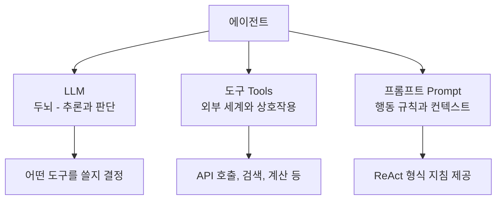
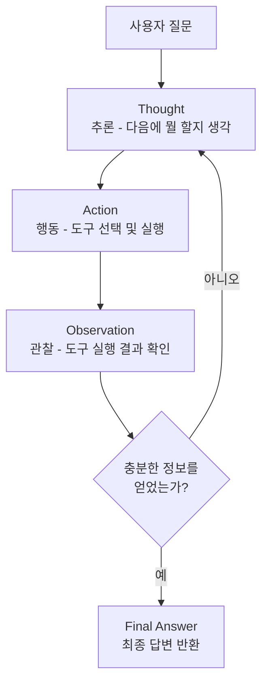
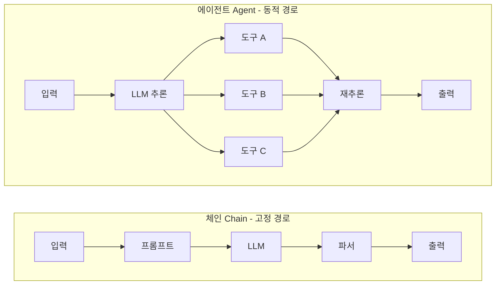
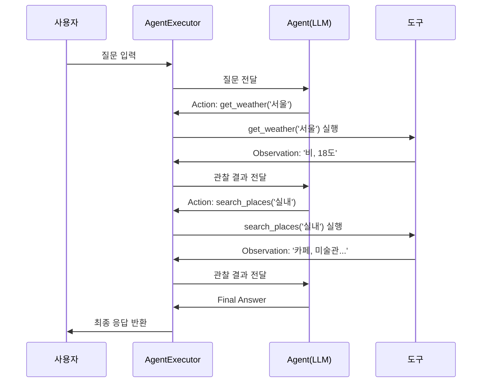
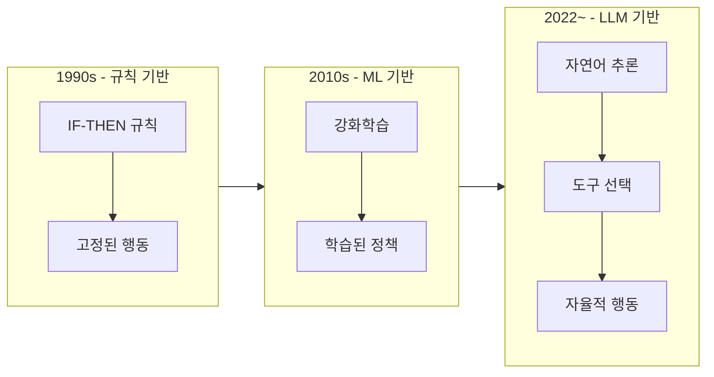

# 에이전트 개념과 ReAct 패턴

> LLM이 스스로 생각하고, 도구를 선택하고, 행동하는 '자율적 AI 시스템'의 핵심 원리를 이해합니다.

## 개요

이 섹션에서는 LangChain 에이전트의 기본 개념과, 에이전트를 작동시키는 핵심 메커니즘인 ReAct(Reasoning + Acting) 패턴을 배웁니다. 체인과 에이전트의 근본적 차이를 이해하고, 에이전트가 적합한 상황을 판단하는 감각을 기릅니다.

**선수 지식**: 앞서 Ch5에서 배운 LCEL 체인 구성, Ch11에서 배운 도구(Tools) 정의와 함수 호출의 개념이 필요합니다.

**학습 목표**:
- 에이전트의 정의와 구성 요소(LLM, 도구, 프롬프트)를 설명할 수 있다
- ReAct 패턴의 Thought → Action → Observation 루프를 이해한다
- 체인(Chain)과 에이전트(Agent)의 차이를 명확히 구분할 수 있다
- 에이전트가 적합한 사용 시나리오를 판단할 수 있다

## 왜 알아야 할까?

여러분이 지금까지 만들어온 체인(Chain)은 정해진 레일 위를 달리는 기차와 같았습니다. 입력이 들어오면 프롬프트 → 모델 → 파서 순서로 항상 같은 경로를 따라갔죠. 대부분의 경우 이것만으로도 충분합니다.

하지만 현실의 문제는 그렇게 단순하지 않거든요. "서울의 오늘 날씨를 확인하고, 비가 오면 실내 데이트 코스를 추천해줘"라는 요청을 생각해보세요. 날씨 API를 먼저 호출해야 하고, 그 결과에 따라 다음 행동이 달라집니다. 비가 오면 실내 장소를 검색하고, 맑으면 야외 코스를 검색해야 하죠. **실행 경로가 고정되어 있지 않은 것**입니다.

에이전트는 바로 이런 "동적 의사결정"이 필요한 상황을 위해 탄생했습니다. 최신 AI 애플리케이션—자율적 고객 지원, 코드 생성 도우미, 데이터 분석 봇—의 핵심에는 모두 에이전트가 있습니다. LangChain 생태계에서 에이전트를 이해하는 것은 단순한 체인 조합을 넘어 **진정한 AI 애플리케이션 개발자**로 성장하는 관문이라 할 수 있습니다.

## 핵심 개념

### 개념 1: 에이전트란 무엇인가?

> 💡 **비유**: 에이전트를 **숙련된 비서**에 비유해봅시다. 여러분이 "다음 주 출장 준비해줘"라고 말하면, 이 비서는 (1) 일정을 확인하고, (2) 항공편을 검색하고, (3) 호텔을 예약하고, (4) 필요하면 다시 일정을 조정합니다. 어떤 순서로 어떤 도구를 쓸지를 **스스로 판단**하죠. 반면 체인은 "매뉴얼대로만 움직이는 로봇"에 가깝습니다.

에이전트(Agent)는 LLM이 **도구(Tool)를 선택적으로 사용**하여 복잡한 작업을 자율적으로 수행하는 시스템입니다. 핵심 구성 요소는 세 가지입니다:

> 📊 **그림 1**: 에이전트의 세 가지 핵심 구성 요소




| 구성 요소 | 역할 | 비유 |
|-----------|------|------|
| **LLM (두뇌)** | 추론, 판단, 계획 수립 | 비서의 지능과 판단력 |
| **도구 (Tools)** | 외부 세계와 상호작용 | 비서가 쓸 수 있는 전화, 컴퓨터, 캘린더 |
| **프롬프트 (Prompt)** | 행동 규칙과 컨텍스트 | 비서에게 주어진 업무 지침서 |

```python
from langchain_openai import ChatOpenAI
from langchain.agents import tool

# 1. 두뇌: LLM
llm = ChatOpenAI(model="gpt-4o", temperature=0)

# 2. 도구: 에이전트가 사용할 수 있는 함수들
@tool
def get_weather(city: str) -> str:
    """주어진 도시의 현재 날씨를 반환합니다."""
    # 실제로는 날씨 API를 호출하겠지만, 예제용 더미 데이터
    weather_data = {"서울": "비, 18°C", "부산": "맑음, 22°C"}
    return weather_data.get(city, f"{city}의 날씨 정보를 찾을 수 없습니다.")

@tool
def search_places(query: str) -> str:
    """장소를 검색하여 추천 목록을 반환합니다."""
    return f"'{query}' 검색 결과: 카페 A, 미술관 B, 영화관 C"

tools = [get_weather, search_places]
# 3. 프롬프트는 create_react_agent에서 자동 구성됩니다
```

에이전트의 핵심은 **LLM이 어떤 도구를 언제 쓸지를 스스로 결정한다**는 점입니다. 개발자가 실행 순서를 하드코딩하는 것이 아니라, LLM의 추론 능력에 의사결정을 위임합니다.

### 개념 2: ReAct 패턴 — 생각하고 행동하기

> 💡 **비유**: ReAct 패턴은 **탐정의 수사 방식**과 똑같습니다. 탐정은 (1) 단서를 보고 **추론**합니다(Thought), (2) 다음 조사 행동을 **결정**합니다(Action), (3) 결과를 **관찰**합니다(Observation). 이 과정을 반복하다가 범인을 특정하면 **최종 답변**(Final Answer)을 내놓죠.

ReAct는 **Re**asoning(추론) + **Act**ing(행동)의 합성어로, 2022년 프린스턴 대학의 Shunyu Yao 등이 발표한 논문에서 제안된 패턴입니다. 에이전트의 실행 루프를 세 단계로 구성합니다:


> 📊 **그림 2**: ReAct 패턴의 Thought-Action-Observation 루프




```
┌─────────────────────────────────────────┐
│            ReAct 루프                     │
│                                          │
│  ┌──────────┐    ┌──────────┐           │
│  │ Thought  │───▶│  Action  │           │
│  │ (추론)   │    │  (행동)  │           │
│  └──────────┘    └────┬─────┘           │
│       ▲               │                 │
│       │          ┌────▼──────┐          │
│       └──────────│Observation│          │
│                  │  (관찰)   │          │
│                  └───────────┘          │
│                                          │
│  반복하다가 충분한 정보가 모이면          │
│  ──▶ Final Answer (최종 답변)            │
└─────────────────────────────────────────┘
```

구체적인 예시로 살펴볼까요? "서울 날씨를 확인하고 적절한 활동을 추천해줘"라는 질문이 들어오면:

```
Thought: 먼저 서울의 현재 날씨를 확인해야 합니다.
Action: get_weather("서울")
Observation: "비, 18°C"

Thought: 비가 오고 있으니 실내 활동을 추천해야겠습니다.
Action: search_places("서울 실내 데이트 코스")
Observation: "'서울 실내 데이트 코스' 검색 결과: 카페 A, 미술관 B, 영화관 C"

Thought: 날씨 정보와 장소 추천을 종합하여 답변을 구성할 수 있습니다.
Final Answer: 서울은 현재 비가 오고 있어 18°C입니다. 
             실내 활동을 추천드려요: 카페 A, 미술관 B, 영화관 C
```

핵심은 **두 번째 Thought**입니다. "비가 오고 있으니"라는 추론 결과가 다음 행동(실내 활동 검색)을 결정했죠. 이것이 고정된 체인과의 결정적 차이입니다.

### 개념 3: 체인 vs 에이전트 — 언제 무엇을 쓸까?

> 💡 **비유**: 체인은 **자판기**이고, 에이전트는 **바리스타**입니다. 자판기는 버튼을 누르면 항상 같은 음료가 나오지만, 바리스타는 "오늘 기분에 맞는 걸로 해주세요"라고 하면 이것저것 물어보고 판단해서 만들어줍니다.

| 특성 | 체인 (Chain) | 에이전트 (Agent) |
|------|-------------|-----------------|
| 실행 경로 | **고정** — 항상 같은 순서 | **동적** — LLM이 결정 |
| 예측 가능성 | 높음 | 상대적으로 낮음 |
| 비용 | 낮음 (LLM 호출 1회) | 높음 (여러 번 호출 가능) |
| 지연 시간 | 짧음 | 길어질 수 있음 |
| 적합한 작업 | 정형화된 작업 | 비정형, 탐색적 작업 |
| 디버깅 | 쉬움 | 상대적으로 어려움 |

```python
# === 체인 방식: 고정된 실행 경로 ===
from langchain_core.prompts import ChatPromptTemplate
from langchain_core.output_parsers import StrOutputParser

# 항상 같은 순서: 프롬프트 → LLM → 파서
chain = (
    ChatPromptTemplate.from_template("{topic}에 대해 설명해주세요")
    | llm
    | StrOutputParser()
)
# 실행: chain.invoke({"topic": "양자 컴퓨팅"})

# === 에이전트 방식: 동적 실행 경로 ===
# LLM이 필요에 따라 도구를 선택하여 실행
# (다음 '실습' 섹션에서 완전한 코드를 다룹니다)
```

**에이전트가 적합한 시나리오:**
1. **다단계 추론이 필요한 질문**: "올해 가장 인기 있는 주식 3개를 찾아서 각각의 PER를 비교해줘"
2. **조건에 따라 행동이 달라지는 경우**: "날씨를 확인하고 적절한 옷차림을 추천해줘"
3. **여러 도구를 조합해야 하는 경우**: "위키피디아에서 검색하고, 계산하고, 결과를 이메일로 보내줘"
4. **탐색적 작업**: "이 데이터에서 패턴을 찾아보고, 발견하면 시각화해줘"

**체인이 더 나은 시나리오:**

> 📊 **그림 3**: 체인 vs 에이전트 — 실행 경로 비교



1. 입력 → 변환 → 출력의 경로가 항상 동일한 경우
2. 빠른 응답 시간이 중요한 경우
3. 비용을 최소화해야 하는 경우
4. 결과의 예측 가능성이 중요한 경우

### 개념 4: LangChain 에이전트의 구조

LangChain에서 에이전트를 만들려면 크게 두 가지 컴포넌트가 필요합니다:

1. **Agent**: LLM + 프롬프트로 구성된 "두뇌". 다음에 어떤 행동을 할지 결정합니다.
2. **AgentExecutor**: Agent를 감싸서 실제로 도구를 실행하고, 결과를 다시 Agent에 전달하는 "실행 엔진"입니다.

> 📊 **그림 4**: AgentExecutor의 실행 구조




```
┌─────────────────────────────────────────────────┐
│                AgentExecutor                      │
│                                                   │
│   사용자 입력                                      │
│       │                                           │
│       ▼                                           │
│   ┌────────┐   다음 행동 결정   ┌──────────┐     │
│   │ Agent  │──────────────────▶│ 도구 실행 │     │
│   │ (LLM)  │◀──────────────────│          │     │
│   └────────┘   관찰 결과 반환   └──────────┘     │
│       │                                           │
│       ▼ (최종 답변 결정 시)                        │
│   최종 응답                                        │
└─────────────────────────────────────────────────┘
```

```python
from langchain.agents import create_react_agent, AgentExecutor
from langchain import hub

# ReAct 프롬프트 템플릿 가져오기
prompt = hub.pull("hwchase17/react")

# Agent 생성: LLM + 도구 + 프롬프트 조합
agent = create_react_agent(
    llm=llm,        # 두뇌 역할
    tools=tools,    # 사용 가능한 도구들
    prompt=prompt   # ReAct 프롬프트 템플릿
)

# AgentExecutor: Agent를 실제로 실행하는 엔진
agent_executor = AgentExecutor(
    agent=agent,
    tools=tools,
    verbose=True,                  # 추론 과정을 출력
    max_iterations=10,             # 최대 반복 횟수 제한
    return_intermediate_steps=True # 중간 과정도 반환
)
```

`AgentExecutor`의 주요 매개변수를 정리하면:

| 매개변수 | 기본값 | 설명 |
|---------|--------|------|
| `verbose` | `False` | `True`로 설정하면 추론 과정이 콘솔에 출력됨 |
| `max_iterations` | `15` | 무한 루프 방지를 위한 최대 반복 횟수 |
| `max_execution_time` | `None` | 전체 실행 시간 제한 (초) |
| `return_intermediate_steps` | `False` | 중간 단계(Thought/Action/Observation)를 반환할지 여부 |
| `handle_parsing_errors` | `False` | LLM 출력 파싱 실패 시 처리 방법 |

## 실습: 직접 해보기

아래는 ReAct 에이전트를 처음부터 끝까지 구축하는 완전한 예제입니다. 복사하여 바로 실행할 수 있습니다.

```python
"""
에이전트 기초 실습: ReAct 패턴으로 날씨 기반 활동 추천 에이전트 만들기
"""
import os
from dotenv import load_dotenv

# 환경 변수 로드
load_dotenv()

from langchain_openai import ChatOpenAI
from langchain.agents import tool, create_react_agent, AgentExecutor
from langchain import hub

# ── 1단계: LLM 설정 ──
llm = ChatOpenAI(
    model="gpt-4o",
    temperature=0  # 에이전트는 일관된 추론을 위해 temperature=0 권장
)

# ── 2단계: 도구 정의 ──
@tool
def get_weather(city: str) -> str:
    """주어진 도시의 현재 날씨 정보를 반환합니다.
    
    Args:
        city: 날씨를 조회할 도시 이름 (예: '서울', '부산')
    """
    # 실제 프로덕션에서는 OpenWeatherMap 등의 API를 호출합니다
    weather_db = {
        "서울": "흐리고 비, 기온 18°C, 습도 85%",
        "부산": "맑음, 기온 22°C, 습도 60%",
        "제주": "구름 많음, 기온 20°C, 습도 70%",
    }
    return weather_db.get(city, f"'{city}'의 날씨 정보를 찾을 수 없습니다.")

@tool
def recommend_activity(weather_condition: str) -> str:
    """날씨 상황에 맞는 활동을 추천합니다.
    
    Args:
        weather_condition: 날씨 상태 (예: '비', '맑음', '흐림')
    """
    recommendations = {
        "비": "실내 추천: 미술관 관람, 카페 투어, 영화 감상, 볼링",
        "맑음": "야외 추천: 한강 공원 피크닉, 자전거 라이딩, 등산",
        "흐림": "가벼운 야외: 산책, 시장 구경 / 실내: 독서 카페, 전시회",
    }
    # 날씨 키워드 매칭
    for keyword, rec in recommendations.items():
        if keyword in weather_condition:
            return rec
    return "다양한 활동을 즐길 수 있는 날씨입니다: 산책, 카페, 쇼핑"

@tool  
def calculate_tip(total_amount: float, tip_percent: float = 15.0) -> str:
    """식사 금액에 대한 팁을 계산합니다.
    
    Args:
        total_amount: 총 식사 금액 (원)
        tip_percent: 팁 비율 (%, 기본값 15%)
    """
    tip = total_amount * (tip_percent / 100)
    return f"금액: {total_amount:,.0f}원, 팁({tip_percent}%): {tip:,.0f}원, 합계: {total_amount + tip:,.0f}원"

# 도구 목록 구성
tools = [get_weather, recommend_activity, calculate_tip]

# ── 3단계: ReAct 프롬프트 가져오기 ──
# LangChain Hub에서 검증된 ReAct 프롬프트 템플릿 사용
prompt = hub.pull("hwchase17/react")

# ── 4단계: 에이전트 생성 ──
agent = create_react_agent(
    llm=llm,
    tools=tools,
    prompt=prompt
)

# ── 5단계: AgentExecutor로 감싸기 ──
agent_executor = AgentExecutor(
    agent=agent,
    tools=tools,
    verbose=True,                   # 추론 과정 출력
    max_iterations=10,              # 최대 10번까지 반복
    return_intermediate_steps=True, # 중간 과정 반환
    handle_parsing_errors=True      # 파싱 에러 자동 처리
)

# ── 6단계: 에이전트 실행 ──
print("=" * 60)
print("질문 1: 단일 도구 사용")
print("=" * 60)
result1 = agent_executor.invoke({
    "input": "서울의 현재 날씨가 어때?"
})
print(f"\n최종 답변: {result1['output']}")

print("\n" + "=" * 60)
print("질문 2: 다중 도구 사용 (연쇄 추론)")
print("=" * 60)
result2 = agent_executor.invoke({
    "input": "부산 날씨를 확인하고, 날씨에 맞는 활동을 추천해줘"
})
print(f"\n최종 답변: {result2['output']}")

# ── 7단계: 중간 과정(intermediate steps) 분석 ──
print("\n" + "=" * 60)
print("에이전트의 추론 과정 분석")
print("=" * 60)
for i, (action, observation) in enumerate(result2["intermediate_steps"]):
    print(f"\n--- 단계 {i + 1} ---")
    print(f"  도구: {action.tool}")           # 어떤 도구를 선택했는지
    print(f"  입력: {action.tool_input}")      # 도구에 어떤 입력을 넣었는지
    print(f"  관찰: {observation}")            # 도구 실행 결과

# 실행 결과 예시:
# === 질문 1 ===
# Thought: 서울의 날씨를 확인해야 합니다.
# Action: get_weather
# Action Input: 서울
# Observation: 흐리고 비, 기온 18°C, 습도 85%
# Thought: 날씨 정보를 얻었으므로 최종 답변을 제공합니다.
# Final Answer: 서울은 현재 흐리고 비가 오고 있습니다. 기온은 18°C이며 습도는 85%입니다.
#
# === 질문 2 ===
# 단계 1: 도구=get_weather, 입력=부산  → 맑음, 22°C
# 단계 2: 도구=recommend_activity, 입력=맑음 → 야외 추천: 한강 공원...
```

## 더 깊이 알아보기

### ReAct의 탄생 — 추론과 행동의 시너지

2022년 10월, 프린스턴 대학의 Shunyu Yao와 Google Brain(현 Google DeepMind)의 연구진은 획기적인 논문 하나를 발표합니다. **"ReAct: Synergizing Reasoning and Acting in Language Models"**가 바로 그것이죠.

이 논문이 나오기 전까지, AI 연구에는 두 개의 독립적인 흐름이 있었습니다. 하나는 **Chain-of-Thought(CoT)**로 대표되는 "추론" 연구였고, 다른 하나는 외부 도구를 사용하는 "행동" 연구였습니다. Yao 연구팀의 통찰은 단순했지만 강력했습니다: **"왜 이 둘을 합치지 않는가?"**

연구팀은 HotPotQA(질의응답), Fever(사실 검증), ALFWorld(텍스트 게임), WebShop(웹 쇼핑) 네 가지 벤치마크에서 실험했는데요, 놀라운 결과가 나왔습니다. 추론만 하는 모델은 환각(hallucination)에 빠지기 쉬웠고, 행동만 하는 모델은 방향을 잃기 쉬웠습니다. 하지만 **둘을 교차**시키자, 추론이 행동의 방향을 잡아주고, 행동의 결과가 추론을 교정해주는 선순환이 일어났습니다. ALFWorld 벤치마크에서는 기존 모방 학습보다 무려 34%나 높은 성공률을 기록했죠.


이 논문은 ICLR 2023에서 발표되었고, 이후 LangChain을 비롯한 거의 모든 에이전트 프레임워크의 기본 아키텍처로 채택되었습니다. 지금 우리가 `create_react_agent`를 호출할 때마다, 바로 이 연구의 성과 위에서 작업하고 있는 셈입니다.

### 에이전트라는 이름의 유래

"에이전트(Agent)"라는 용어 자체는 AI 분야에서 오랜 역사를 가지고 있습니다. 1990년대 MIT의 Marvin Minsky가 제안한 **"Society of Mind"** 이론에서 이미 자율적으로 행동하는 소프트웨어 단위를 "에이전트"라고 불렀거든요. LLM 시대의 에이전트는 이 전통적 개념에 **자연어 이해와 생성 능력**을 결합한 것이라 볼 수 있습니다. 과거의 에이전트가 규칙 기반이었다면, 현대의 에이전트는 언어 모델의 추론 능력으로 움직인다는 점이 혁신적입니다.

> 📊 **그림 5**: 에이전트 개념의 진화 — 규칙 기반에서 LLM 기반으로




## 흔한 오해와 팁

> ⚠️ **흔한 오해**: "에이전트가 체인보다 항상 좋다"고 생각하기 쉽지만, 사실은 그렇지 않습니다. 에이전트는 LLM을 여러 번 호출하므로 **비용이 2~10배** 더 들 수 있고, 응답 시간도 길어집니다. 실행 경로가 고정된 작업에는 체인이 더 효율적이고 예측 가능합니다. 에이전트는 "동적 의사결정이 필요한 경우"에만 사용하세요.

> 💡 **알고 계셨나요?**: LangChain의 `create_react_agent`가 사용하는 ReAct 프롬프트에는 `Observation:` 이라는 스톱 시퀀스(stop sequence)가 포함되어 있습니다. 이것은 LLM이 도구를 실행하지도 않고 결과를 "상상"해서 적어버리는 환각을 방지하기 위한 장치입니다. `Observation:`이 나오면 LLM 생성을 강제 중단하고, 실제 도구 실행 결과로 대체하는 거죠.

> 🔥 **실무 팁**: 에이전트를 프로덕션에 배포할 때는 반드시 `max_iterations`를 설정하세요. 설정하지 않으면 에이전트가 답을 찾지 못할 때 무한히 반복할 수 있습니다. 또한 `handle_parsing_errors=True`로 설정하면 LLM 출력이 예상 형식에 맞지 않을 때 자동으로 재시도합니다. 개발 단계에서는 `verbose=True`로 추론 과정을 확인하고, 프로덕션에서는 `return_intermediate_steps=True`로 로깅하는 것을 권장합니다.

## 핵심 정리

| 개념 | 설명 |
|------|------|
| 에이전트 (Agent) | LLM이 도구를 선택적으로 사용하여 자율적으로 작업을 수행하는 시스템 |
| ReAct 패턴 | Thought(추론) → Action(행동) → Observation(관찰) 루프를 반복하는 에이전트 실행 패턴 |
| 체인 vs 에이전트 | 체인은 고정 경로, 에이전트는 동적 경로. 상황에 맞게 선택 |
| 에이전트 구성 요소 | LLM(두뇌) + Tools(도구) + Prompt(지침) |
| `create_react_agent` | LangChain에서 ReAct 에이전트를 생성하는 함수 |
| `AgentExecutor` | 에이전트를 실제로 실행하고 도구 호출을 관리하는 실행 엔진 |
| `intermediate_steps` | 에이전트의 추론 과정(도구 선택, 입력, 결과)을 기록한 중간 단계 |
| 스톱 시퀀스 | `Observation:`에서 LLM 생성을 중단시켜 환각을 방지하는 메커니즘 |

## 다음 섹션 미리보기

이번 섹션에서 에이전트의 개념과 ReAct 패턴의 원리를 이해했으니, 다음 섹션 **"커스텀 도구 만들기"**에서는 에이전트에게 줄 **나만의 도구를 설계하고 구현**하는 방법을 본격적으로 다룹니다. `@tool` 데코레이터의 고급 사용법, Pydantic을 활용한 입력 스키마 정의, 비동기 도구 구현까지 실전에서 바로 활용할 수 있는 테크닉을 배워볼 예정입니다.

## 참고 자료

- [ReAct: Synergizing Reasoning and Acting in Language Models (원본 논문)](https://arxiv.org/abs/2210.03629) - ReAct 패턴의 이론적 기반. 에이전트의 추론-행동 교차 메커니즘의 원리와 벤치마크 결과를 확인할 수 있습니다
- [LangChain Agents 공식 문서](https://python.langchain.com/docs/modules/agents/) - LangChain 에이전트의 공식 가이드. 최신 API와 사용법을 확인하세요
- [create_react_agent API 레퍼런스](https://python.langchain.com/api_reference/langchain/agents/langchain.agents.react.agent.create_react_agent.html) - `create_react_agent` 함수의 매개변수와 사용 예제를 상세히 다룹니다
- [AgentExecutor API 레퍼런스](https://python.langchain.com/api_reference/langchain/agents/langchain.agents.agent.AgentExecutor.html) - AgentExecutor의 모든 설정 옵션과 동작 방식을 확인할 수 있습니다
- [ReAct Prompting Guide](https://www.promptingguide.ai/techniques/react) - ReAct 패턴을 프롬프트 엔지니어링 관점에서 설명하는 실용적 가이드
- [Google Research Blog: ReAct](https://research.google/blog/react-synergizing-reasoning-and-acting-in-language-models/) - Google Research의 ReAct 논문 해설. 시각적 다이어그램과 함께 핵심 아이디어를 이해하기 좋습니다

---
### 🔗 Related Sessions
- [lcel](../01-langchain-소개와-개발-환경-설정/01-llm-애플리케이션의-진화와-langchain.md) (prerequisite)
- [prompt_template](../03-프롬프트-엔지니어링과-템플릿/01-chatprompttemplate-기초.md) (prerequisite)
- [chain](../01-langchain-소개와-개발-환경-설정/01-llm-애플리케이션의-진화와-langchain.md) (prerequisite)
- [tool](../11-도구tools와-함수-호출/01-도구-정의와-바인딩.md) (prerequisite)
