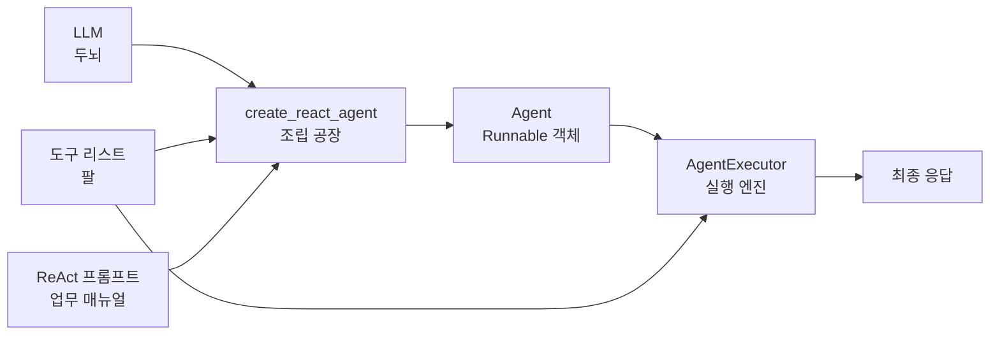
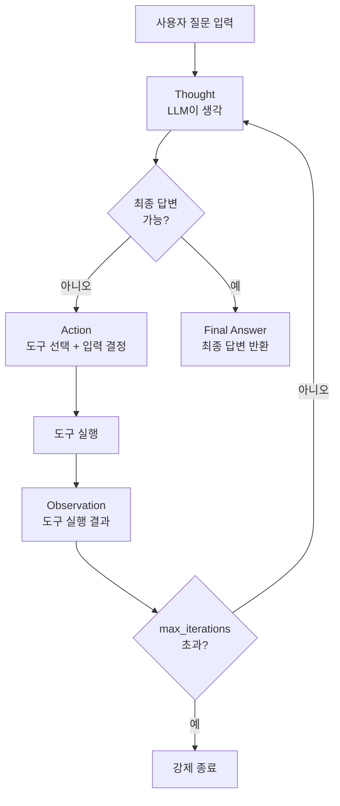
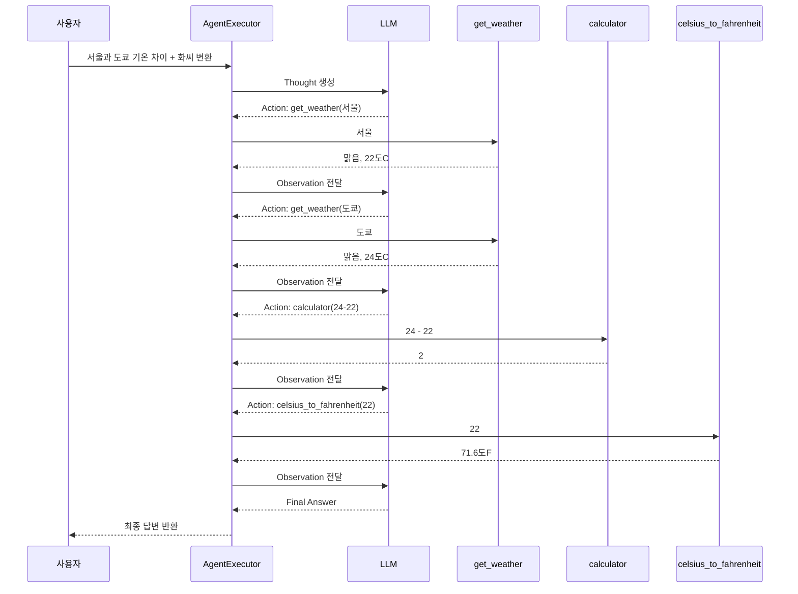
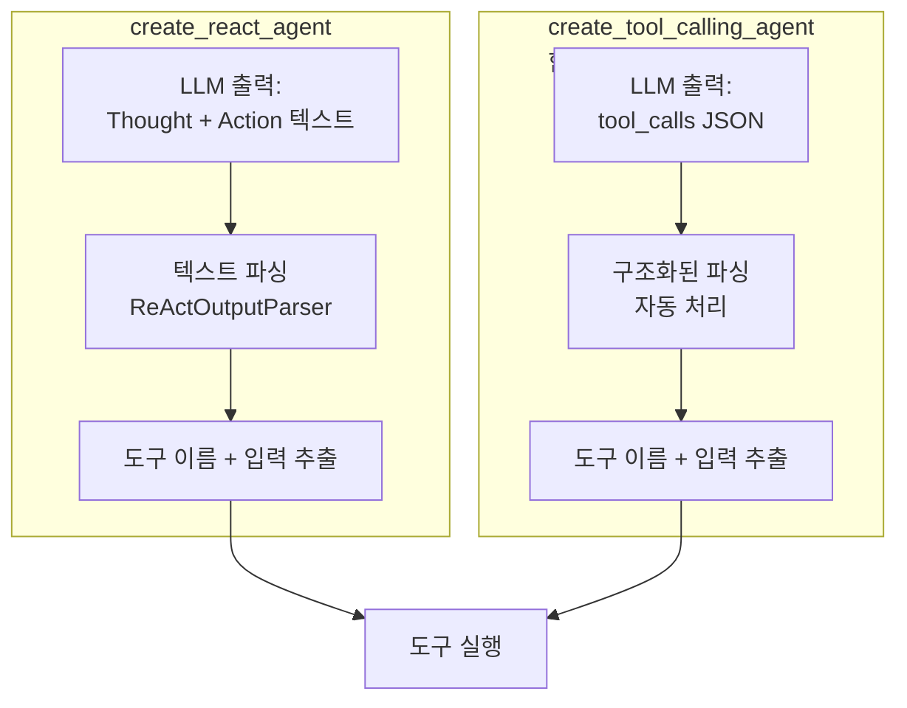

# create_react_agent로 에이전트 구축

> LangChain의 `create_react_agent`와 `AgentExecutor`를 조합하여 도구를 사용하는 에이전트를 직접 만들어봅니다.

## 개요

이 섹션에서는 [세션 12.1: 에이전트 개념과 ReAct 패턴](ch12/session_12_1.md)에서 배운 ReAct 패턴 이론을 실제 코드로 구현합니다. `create_react_agent` 함수의 구조를 이해하고, ReAct 프롬프트 템플릿을 구성하며, `AgentExecutor`로 에이전트를 실행하는 전체 조립 과정을 익힙니다.

**선수 지식**: 에이전트 개념과 ReAct 패턴(Thought→Action→Observation 루프), `@tool` 데코레이터 기본 사용법, LCEL 파이프라인 구성
**학습 목표**:
- `create_react_agent`의 함수 시그니처와 필수 파라미터를 이해한다
- ReAct 프롬프트 템플릿의 구조를 파악하고 커스터마이징할 수 있다
- LLM + 도구 + 프롬프트 + `AgentExecutor`의 조립 흐름을 완성할 수 있다
- 에이전트의 추론 과정을 관찰하고 동작 원리를 확인할 수 있다

## 왜 알아야 할까?

> 📊 **그림 1**: create_react_agent 에이전트 조립 전체 구조




앞서 에이전트의 개념을 배웠지만, 실제로 동작하는 에이전트를 만드는 건 또 다른 문제죠. 마치 요리 레시피를 읽는 것과 직접 불 앞에 서는 것의 차이와 비슷합니다. `create_react_agent`는 LangChain에서 ReAct 에이전트를 만드는 가장 기본적인 방법인데요, 이 함수 하나를 제대로 이해하면 LLM에게 "생각하고 행동하는" 능력을 부여하는 전체 구조가 명확해집니다.

실무에서는 고객 질문에 데이터베이스를 조회하여 답변하거나, 여러 API를 조합해 복합적인 업무를 처리하는 에이전트를 구축하게 됩니다. 이때 프롬프트를 어떻게 구성하느냐, 도구를 어떻게 정의하느냐에 따라 에이전트의 정확도가 크게 달라지거든요. 이 섹션에서는 에이전트를 "조립"하는 핵심 기술을 익히고, 다음 섹션에서 실행을 세밀하게 제어하는 방법으로 이어갑니다.

## 핵심 개념

### 개념 1: create_react_agent — 에이전트 조립 공장

> 💡 **비유**: `create_react_agent`는 **로봇 조립 공장**과 같습니다. "두뇌"(LLM), "팔"(도구들), "업무 매뉴얼"(프롬프트)을 투입하면, 이 세 가지를 조합한 하나의 완성된 에이전트가 나옵니다. 공장 자체가 로봇을 움직이는 건 아니고, 조립만 담당하죠.

`create_react_agent`는 세 가지 필수 재료를 받아서 `Runnable` 객체를 반환합니다:

```python
from langchain.agents import create_react_agent

agent = create_react_agent(
    llm=llm,           # 두뇌: 추론을 담당할 LLM
    tools=tools,        # 팔: 사용할 도구 리스트
    prompt=prompt,      # 매뉴얼: ReAct 형식의 프롬프트 템플릿
)
```

여기서 반환된 `agent`는 아직 실행할 수 없습니다. 이건 "설계도가 완성된 로봇"일 뿐이에요. 실제로 가동하려면 `AgentExecutor`라는 "전원 스위치"가 필요합니다.

**함수 시그니처를 좀 더 자세히 볼까요?**

```python
def create_react_agent(
    llm: BaseLanguageModel,          # 필수: LLM 인스턴스
    tools: Sequence[BaseTool],       # 필수: 도구 리스트
    prompt: BasePromptTemplate,      # 필수: 프롬프트 템플릿
    output_parser: AgentOutputParser = None,  # 선택: 출력 파서
    tools_renderer: Callable = render_text_description,  # 선택: 도구 설명 렌더러
    stop_sequence: Union[bool, List[str]] = True,  # 선택: 중단 시퀀스
) -> Runnable:
```

| 파라미터 | 역할 | 기본값 |
|----------|------|--------|
| `llm` | 추론을 수행할 언어 모델 | (필수) |
| `tools` | 에이전트가 사용할 도구 목록 | (필수) |
| `prompt` | ReAct 형식의 프롬프트 템플릿 | (필수) |
| `output_parser` | LLM 출력을 AgentAction/AgentFinish로 파싱 | `ReActSingleInputOutputParser` |
| `tools_renderer` | 도구 목록을 문자열로 변환하는 함수 | `render_text_description` |
| `stop_sequence` | LLM 생성을 멈출 토큰 | `True` (= `["\nObservation"]`) |

### 개념 2: ReAct 프롬프트 템플릿 — 에이전트의 업무 매뉴얼

> 💡 **비유**: 프롬프트 템플릿은 신입 사원에게 주는 **업무 매뉴얼**입니다. "문제가 생기면 이런 순서로 생각하고, 이런 도구를 쓰고, 결과를 확인한 뒤 최종 답변을 작성하세요"라고 적혀 있죠. 매뉴얼이 명확할수록 신입 사원(LLM)의 업무 처리가 정확해집니다.

ReAct 프롬프트에는 반드시 세 가지 입력 변수가 포함되어야 합니다:

- **`{tools}`**: 사용 가능한 도구의 이름과 설명이 자동 삽입됨
- **`{tool_names}`**: 도구 이름 목록이 쉼표로 구분되어 삽입됨
- **`{agent_scratchpad}`**: 이전 Thought/Action/Observation 기록이 누적됨

LangChain Hub에서 검증된 프롬프트를 가져오거나, 직접 작성할 수 있습니다:

```python
# 방법 1: LangChain Hub에서 가져오기
from langchain import hub

prompt = hub.pull("hwchase17/react")

# 방법 2: 직접 작성하기
from langchain_core.prompts import PromptTemplate

template = """Answer the following questions as best you can. You have access to the following tools:

{tools}

Use the following format:

Question: the input question you must answer
Thought: you should always think about what to do
Action: the action to take, should be one of [{tool_names}]
Action Input: the input to the action
Observation: the result of the action
... (this Thought/Action/Action Input/Observation can repeat N times)
Thought: I now know the final answer
Final Answer: the final answer to the original input question

Begin!

Question: {input}
Thought:{agent_scratchpad}"""

prompt = PromptTemplate.from_template(template)
```

`{agent_scratchpad}`가 왜 중요할까요? 이 변수가 바로 ReAct 루프의 "기억"입니다. 에이전트가 도구를 호출할 때마다 그 결과가 여기에 쌓이고, LLM은 이전 시도를 참고해서 다음 행동을 결정하거든요.

**프롬프트 커스터마이징 팁**: 한국어로 프롬프트를 작성하면 한국어 응답 품질이 높아지지만, ReAct 형식의 키워드(`Thought`, `Action`, `Action Input`, `Observation`, `Final Answer`)는 영문 그대로 유지하는 것이 안정적입니다. LLM이 이 키워드들로 출력 형식을 구분하기 때문이에요. 아래 실습에서 한국어 프롬프트 예시를 확인할 수 있습니다.

### 개념 3: AgentExecutor — 에이전트를 실행하는 엔진

> 💡 **비유**: `AgentExecutor`는 **교통 관제탑**과 같습니다. 에이전트(비행기)가 이륙하면, 관제탑은 비행을 감시하고 안전하게 착륙시키는 역할을 합니다. 에이전트가 혼자서는 제어할 수 없는 것들을 `AgentExecutor`가 책임지는 거죠.

`create_react_agent`로 만든 에이전트는 "한 번의 추론"만 수행합니다. Thought→Action을 한 단계 출력할 뿐, 도구를 실제로 호출하고 결과를 다시 LLM에 넘기는 **루프**는 수행하지 않아요. 이 루프를 돌려주는 것이 바로 `AgentExecutor`입니다.

```python
from langchain.agents import AgentExecutor

# 기본적인 AgentExecutor 생성
agent_executor = AgentExecutor(
    agent=agent,       # create_react_agent로 만든 에이전트
    tools=tools,       # 도구 목록 (agent 생성 시와 동일해야 함)
    verbose=True,      # 추론 과정을 콘솔에 출력 (개발 시 필수!)
    max_iterations=5,  # 최대 반복 횟수 (무한 루프 방지)
)

# 에이전트 실행
result = agent_executor.invoke({"input": "서울 날씨 알려줘"})
print(result["output"])
```

`AgentExecutor`가 하는 일을 한 마디로 정리하면: **"에이전트에게 반복적으로 생각-행동-관찰 루프를 돌리되, 안전하게 멈출 수 있도록 관리한다"**입니다.

> 📊 **그림 2**: AgentExecutor의 ReAct 루프 실행 흐름




`verbose=True`를 설정하면 에이전트의 Thought, Action, Observation이 콘솔에 그대로 출력되어 내부 동작을 실시간으로 확인할 수 있습니다. 개발과 디버깅 단계에서는 항상 켜두세요.

`max_iterations`는 도구 호출 최대 횟수로, 에이전트가 답을 찾지 못하고 끝없이 반복하는 것을 방지합니다. 기본적으로 5~15 사이가 적당합니다.

`AgentExecutor`에는 이 외에도 에러 처리(`handle_parsing_errors`), 실행 시간 제한(`max_execution_time`), 조기 종료 방식(`early_stopping_method`), 중간 단계 반환(`return_intermediate_steps`) 등 다양한 제어 파라미터가 있습니다. 이들의 상세 동작과 프로덕션 환경 설정은 [다음 세션: AgentExecutor 설정과 제어](ch12/session_12_3.md)에서 깊이 있게 다루겠습니다.

### 개념 4: 전체 조립 — LLM + 도구 + 프롬프트 + 실행기

세 가지 개념을 하나로 연결하면 이렇습니다:

```python
import os
from dotenv import load_dotenv
from langchain_openai import ChatOpenAI
from langchain_core.tools import tool
from langchain_core.prompts import PromptTemplate
from langchain.agents import create_react_agent, AgentExecutor

# 환경 설정
load_dotenv()

# 1단계: LLM 준비 (두뇌)
llm = ChatOpenAI(model="gpt-4o", temperature=0)

# 2단계: 도구 정의 (팔)
@tool
def search_weather(city: str) -> str:
    """주어진 도시의 현재 날씨를 검색합니다."""
    # 실제로는 API를 호출하지만, 여기서는 시뮬레이션
    weather_data = {
        "서울": "맑음, 22°C",
        "부산": "흐림, 19°C",
        "제주": "비, 18°C",
    }
    return weather_data.get(city, f"{city}의 날씨 정보를 찾을 수 없습니다.")

@tool
def calculate(expression: str) -> str:
    """수학 표현식을 계산합니다. 예: '2 + 3 * 4'"""
    try:
        result = eval(expression)  # 학습용 예제 — 실무에서는 안전한 파서 사용
        return str(result)
    except Exception as e:
        return f"계산 오류: {e}"

tools = [search_weather, calculate]

# 3단계: 프롬프트 구성 (업무 매뉴얼)
template = """Answer the following questions as best you can. You have access to the following tools:

{tools}

Use the following format:

Question: the input question you must answer
Thought: you should always think about what to do
Action: the action to take, should be one of [{tool_names}]
Action Input: the input to the action
Observation: the result of the action
... (this Thought/Action/Action Input/Observation can repeat N times)
Thought: I now know the final answer
Final Answer: the final answer to the original input question

Begin!

Question: {input}
Thought:{agent_scratchpad}"""

prompt = PromptTemplate.from_template(template)

# 4단계: 에이전트 조립 (로봇 조립)
agent = create_react_agent(llm=llm, tools=tools, prompt=prompt)

# 5단계: 실행기 가동 (전원 ON)
agent_executor = AgentExecutor(
    agent=agent,
    tools=tools,
    verbose=True,
    max_iterations=5,
)

# 6단계: 에이전트 실행
result = agent_executor.invoke({"input": "서울 날씨가 어때?"})
print(result["output"])
```

## 실습: 직접 해보기

이번 실습에서는 여러 도구를 갖춘 "만능 비서 에이전트"를 만들어 봅시다. 날씨 조회, 계산, 단위 변환까지 할 수 있는 에이전트입니다. 에이전트가 질문에 따라 어떤 도구를 자율적으로 선택하는지 관찰하는 것이 핵심입니다.

> 📊 **그림 3**: 복합 질문 처리 시 에이전트의 도구 호출 순서 (테스트 2 예시)




```python
import os
from dotenv import load_dotenv
from langchain_openai import ChatOpenAI
from langchain_core.tools import tool
from langchain_core.prompts import PromptTemplate
from langchain.agents import create_react_agent, AgentExecutor

# .env 파일에서 OPENAI_API_KEY 로드
load_dotenv()

# === LLM 설정 ===
llm = ChatOpenAI(
    model="gpt-4o",
    temperature=0,  # 에이전트는 일관된 추론을 위해 temperature=0 권장
)

# === 도구 정의 ===
@tool
def get_weather(city: str) -> str:
    """주어진 도시의 현재 날씨와 기온을 반환합니다."""
    weather_db = {
        "서울": {"condition": "맑음", "temp_c": 22, "humidity": 45},
        "부산": {"condition": "흐림", "temp_c": 19, "humidity": 60},
        "제주": {"condition": "비", "temp_c": 18, "humidity": 80},
        "뉴욕": {"condition": "구름 조금", "temp_c": 15, "humidity": 55},
        "도쿄": {"condition": "맑음", "temp_c": 24, "humidity": 50},
    }
    info = weather_db.get(city)
    if info:
        return (
            f"{city}: {info['condition']}, "
            f"기온 {info['temp_c']}°C, "
            f"습도 {info['humidity']}%"
        )
    return f"{city}의 날씨 정보를 찾을 수 없습니다."

@tool
def calculator(expression: str) -> str:
    """수학 표현식을 계산합니다. 예: '15 * 3 + 7', '(100 - 32) * 5 / 9'"""
    try:
        # 허용된 문자만 포함되었는지 확인 (보안)
        allowed = set("0123456789+-*/.() ")
        if not all(c in allowed for c in expression):
            return "허용되지 않은 문자가 포함되어 있습니다."
        result = eval(expression)
        return f"{expression} = {result}"
    except Exception as e:
        return f"계산 오류: {e}"

@tool
def celsius_to_fahrenheit(celsius: str) -> str:
    """섭씨 온도를 화씨로 변환합니다. 숫자만 입력하세요."""
    try:
        c = float(celsius)
        f = c * 9 / 5 + 32
        return f"{c}°C = {f}°F"
    except ValueError:
        return "올바른 숫자를 입력해주세요."

# 도구 리스트 구성
tools = [get_weather, calculator, celsius_to_fahrenheit]

# === 한국어 커스텀 프롬프트 ===
template = """당신은 도움이 되는 AI 비서입니다. 다음 도구를 사용할 수 있습니다:

{tools}

다음 형식을 사용하세요:

Question: 답변해야 할 질문
Thought: 무엇을 해야 할지 항상 생각하세요
Action: 수행할 행동, [{tool_names}] 중 하나여야 합니다
Action Input: 행동에 대한 입력
Observation: 행동의 결과
... (Thought/Action/Action Input/Observation은 N번 반복 가능)
Thought: 이제 최종 답변을 알겠습니다
Final Answer: 원래 질문에 대한 최종 답변

시작!

Question: {input}
Thought:{agent_scratchpad}"""

prompt = PromptTemplate.from_template(template)

# === 에이전트 조립 ===
agent = create_react_agent(llm=llm, tools=tools, prompt=prompt)

# === AgentExecutor 설정 ===
agent_executor = AgentExecutor(
    agent=agent,
    tools=tools,
    verbose=True,                   # 추론 과정 출력
    max_iterations=8,               # 최대 도구 호출 횟수
    return_intermediate_steps=True, # 중간 추론 단계도 반환
)
# AgentExecutor의 세밀한 제어(에러 처리, 조기 종료 등)는
# 다음 세션에서 자세히 다룹니다.

# === 테스트 1: 단순 질문 ===
print("=" * 60)
print("테스트 1: 단순 날씨 질문")
print("=" * 60)
result1 = agent_executor.invoke({"input": "서울 날씨 알려줘"})
print(f"\n최종 답변: {result1['output']}")
print(f"사용된 단계 수: {len(result1['intermediate_steps'])}")

# === 테스트 2: 복합 질문 (여러 도구 사용) ===
print("\n" + "=" * 60)
print("테스트 2: 복합 질문")
print("=" * 60)
result2 = agent_executor.invoke({
    "input": "서울과 도쿄의 기온 차이를 계산하고, 서울 기온을 화씨로 변환해줘"
})
print(f"\n최종 답변: {result2['output']}")

# === 중간 추론 단계 분석 ===
# intermediate_steps를 통해 에이전트의 사고 과정을 추적할 수 있습니다
print("\n" + "=" * 60)
print("에이전트의 사고 과정 추적")
print("=" * 60)
for i, (action, observation) in enumerate(result2["intermediate_steps"], 1):
    print(f"\n--- 단계 {i} ---")
    print(f"선택한 도구: {action.tool}")       # 어떤 도구를 선택했는지
    print(f"도구에 전달한 입력: {action.tool_input}")  # 도구에 넣은 값
    print(f"도구 실행 결과: {observation}")     # 도구가 반환한 결과
```

**예상 출력 (테스트 1)**:
```
> Entering new AgentExecutor chain...
Thought: 서울의 날씨를 알아보겠습니다.
Action: get_weather
Action Input: 서울
Observation: 서울: 맑음, 기온 22°C, 습도 45%
Thought: 이제 최종 답변을 알겠습니다
Final Answer: 서울의 현재 날씨는 맑음이며, 기온은 22°C, 습도는 45%입니다.

최종 답변: 서울의 현재 날씨는 맑음이며, 기온은 22°C, 습도는 45%입니다.
사용된 단계 수: 1
```

**예상 출력 (테스트 2)** — 에이전트가 자율적으로 여러 도구를 순서대로 호출합니다:
```
> Entering new AgentExecutor chain...
Thought: 먼저 서울과 도쿄의 날씨를 확인하겠습니다.
Action: get_weather
Action Input: 서울
Observation: 서울: 맑음, 기온 22°C, 습도 45%
Thought: 이제 도쿄 날씨를 확인하겠습니다.
Action: get_weather
Action Input: 도쿄
Observation: 도쿄: 맑음, 기온 24°C, 습도 50%
Thought: 기온 차이를 계산하겠습니다.
Action: calculator
Action Input: 24 - 22
Observation: 24 - 22 = 2
Thought: 서울 기온을 화씨로 변환하겠습니다.
Action: celsius_to_fahrenheit
Action Input: 22
Observation: 22.0°C = 71.6°F
Thought: 이제 최종 답변을 알겠습니다
Final Answer: 서울(22°C)과 도쿄(24°C)의 기온 차이는 2°C이며, 서울 기온을 화씨로 변환하면 71.6°F입니다.
```

## 더 깊이 알아보기

### ReAct 프롬프트의 탄생과 LangChain Hub

`create_react_agent`에서 사용하는 프롬프트 형식은 2022년 Shunyu Yao 등이 발표한 논문 *"ReAct: Synergizing Reasoning and Acting in Language Models"*에서 비롯되었습니다. 이 논문의 핵심 통찰은 놀라울 정도로 단순했는데요 — LLM에게 "생각을 먼저 말해봐(Thought)"라고 시킨 뒤 "그러면 뭘 해야 할까(Action)?"라고 물으면, LLM이 훨씬 정확하게 도구를 선택한다는 것이었습니다.


LangChain의 창시자 Harrison Chase는 이 논문에서 영감을 받아 `hwchase17/react`라는 표준 프롬프트 템플릿을 만들었고, 이것이 LangChain Hub(현재 LangSmith Hub)에 최초로 올라간 프롬프트 중 하나입니다. `hub.pull("hwchase17/react")`로 가져올 수 있는 이 템플릿은 수천 개의 프로젝트에서 사용되며, ReAct 에이전트의 사실상 표준이 되었습니다.

### create_react_agent vs create_tool_calling_agent

LangChain에는 에이전트를 만드는 또 다른 방법인 `create_tool_calling_agent`가 있습니다. 이 둘의 차이를 이해하는 것이 중요합니다:

| 비교 항목 | `create_react_agent` | `create_tool_calling_agent` |
|-----------|---------------------|---------------------------|
| 동작 방식 | 텍스트 기반 추론 (Thought를 문자열로 출력) | 함수 호출 API 활용 (구조화된 JSON 출력) |
| 투명성 | 사고 과정이 명시적으로 보임 | 도구 호출 결정이 블랙박스 |
| 토큰 소비 | 많음 (Thought 텍스트 포함) | 적음 (함수 스키마만 사용) |
| 파싱 안정성 | LLM이 형식을 벗어날 위험 있음 | 구조화된 출력으로 안정적 |
| 적합한 상황 | 복잡한 추론, 디버깅, 학습용 | 프로덕션, 성능 중심 |

> 📊 **그림 4**: create_react_agent vs create_tool_calling_agent 동작 방식 비교




`create_react_agent`는 에이전트의 사고 과정을 명시적으로 보여주기 때문에 학습과 디버깅에 이상적이고, 프로덕션에서는 `create_tool_calling_agent`나 LangGraph의 `create_react_agent`(별개 함수)를 권장합니다.

### stop_sequence의 역할

`create_react_agent`에서 `stop_sequence=True`(기본값)로 설정하면, LLM이 `"\nObservation"`이라는 텍스트를 생성하려 할 때 자동으로 멈춥니다. 왜냐하면 Observation은 LLM이 만드는 게 아니라, 실제 도구 실행 결과가 들어가야 하기 때문이에요. 이 작은 설정이 ReAct 루프의 "LLM은 생각과 행동만, 관찰은 도구가" 라는 역할 분담을 가능하게 합니다.

## 흔한 오해와 팁

> ⚠️ **흔한 오해**: "`create_react_agent`만 호출하면 에이전트가 실행된다." — 아닙니다! `create_react_agent`는 에이전트 **로직**을 조립할 뿐이고, 실제 실행은 반드시 `AgentExecutor`를 통해야 합니다. `agent.invoke()`를 직접 호출하면 한 번의 추론만 수행하고 루프가 돌지 않습니다.

> 💡 **알고 계셨나요?**: LangChain의 `create_react_agent`는 사실 "레거시" 구현입니다. LangGraph 라이브러리에도 동일한 이름의 `create_react_agent` 함수가 있는데, 이쪽은 상태 그래프 기반으로 훨씬 강력합니다. 임포트 경로가 다르니 혼동하지 마세요: `langchain.agents`(레거시) vs `langgraph.prebuilt`(최신).

> 🔥 **실무 팁**: 프롬프트 템플릿에서 `{agent_scratchpad}`는 반드시 **마지막**에 위치해야 합니다. LLM이 이전 추론 기록 바로 이어서 다음 Thought를 생성해야 하기 때문이에요. `{agent_scratchpad}` 뒤에 다른 텍스트를 넣으면 에이전트의 추론 흐름이 깨질 수 있습니다.

> 🔥 **실무 팁**: 도구의 docstring(설명)이 에이전트의 도구 선택 정확도를 좌우합니다. `{tools}` 변수에 이 설명이 그대로 삽입되기 때문이에요. "데이터를 처리합니다"처럼 모호한 설명보다 "주어진 도시 이름으로 현재 날씨와 기온을 반환합니다"처럼 구체적으로 작성하세요. 도구 설계에 대해서는 [세션 12.4: 에이전트 도구 설계](ch12/session_12_4.md)에서 더 깊이 다룹니다.

## 핵심 정리

| 개념 | 설명 |
|------|------|
| `create_react_agent` | LLM, 도구, 프롬프트를 결합하여 ReAct 에이전트 Runnable을 생성하는 함수 |
| ReAct 프롬프트 필수 변수 | `{tools}`, `{tool_names}`, `{agent_scratchpad}` — 세 가지 모두 있어야 함 |
| `agent_scratchpad` | ReAct 루프의 "기억" — 이전 모든 Thought/Action/Observation이 누적되는 공간 |
| `AgentExecutor` | 에이전트를 반복 실행하며 도구 호출과 종료 조건을 관리하는 실행기 |
| `verbose=True` | Thought→Action→Observation 과정을 콘솔에 출력하여 동작 확인 |
| `stop_sequence` | LLM이 `\nObservation`에서 멈추게 하여 도구가 결과를 채우는 구조를 만듦 |
| `tools_renderer` | 도구 목록을 프롬프트 내 텍스트로 변환하는 함수 (기본: `render_text_description`) |
| Hub 프롬프트 | `hub.pull("hwchase17/react")`로 검증된 표준 ReAct 프롬프트 사용 가능 |

## 다음 섹션 미리보기

에이전트를 조립하고 실행하는 기본기를 익혔으니, 이제 에이전트의 동작을 **세밀하게 제어**할 차례입니다. [다음 세션: AgentExecutor 설정과 제어](ch12/session_12_3.md)에서는 `max_iterations`, `max_execution_time`, `handle_parsing_errors`, `early_stopping_method`, `return_intermediate_steps` 등 `AgentExecutor`의 핵심 파라미터를 하나씩 깊이 파고듭니다. 에이전트를 프로덕션에서 안전하고 예측 가능하게 운영하는 데 꼭 필요한 내용이니 기대해 주세요.

## 참고 자료

- [LangChain 공식 API 문서 — create_react_agent](https://python.langchain.com/api_reference/langchain/agents/langchain.agents.react.agent.create_react_agent.html) - 함수 시그니처, 파라미터 설명, 공식 예제 코드
- [LangChain 공식 API 문서 — AgentExecutor](https://python.langchain.com/api_reference/langchain/agents/langchain.agents.agent.AgentExecutor.html) - AgentExecutor의 모든 파라미터와 사용법
- [hwchase17/react 프롬프트 — LangSmith Hub](https://smith.langchain.com/hub/hwchase17/react) - ReAct 에이전트의 표준 프롬프트 템플릿
- [ReAct: Synergizing Reasoning and Acting in Language Models (논문)](https://arxiv.org/abs/2210.03629) - ReAct 패턴의 원본 논문, 에이전트 개념의 이론적 기반
- [Understanding LangChain Agents: create_react_agent vs create_tool_calling_agent](https://medium.com/@anil.goyal0057/understanding-langchain-agents-create-react-agent-vs-create-tool-calling-agent-e977a9dfe31e) - 두 에이전트 생성 방식의 차이점을 명확하게 비교한 글

---
### 🔗 Related Sessions
- [tool](../11-도구tools와-함수-호출/01-도구-정의와-바인딩.md) (prerequisite)
- [agent](../12-에이전트agent-기초/01-에이전트-개념과-react-패턴.md) (prerequisite)
- [react_pattern](../12-에이전트agent-기초/01-에이전트-개념과-react-패턴.md) (prerequisite)
- [agent_executor](../12-에이전트agent-기초/01-에이전트-개념과-react-패턴.md) (prerequisite)
- [intermediate_steps](../12-에이전트agent-기초/01-에이전트-개념과-react-패턴.md) (prerequisite)
