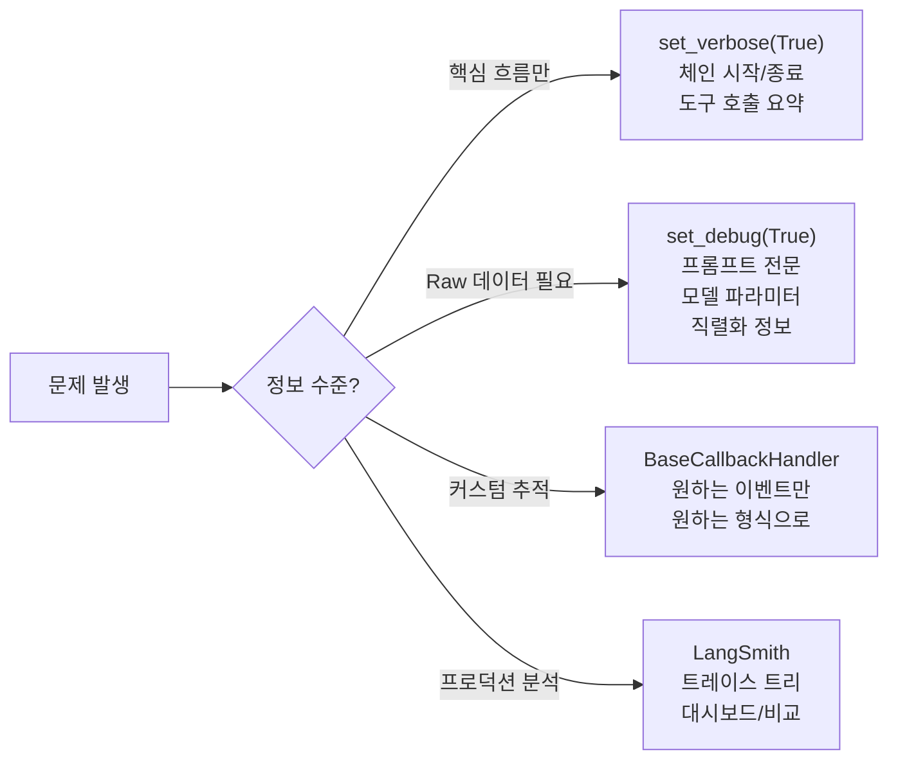
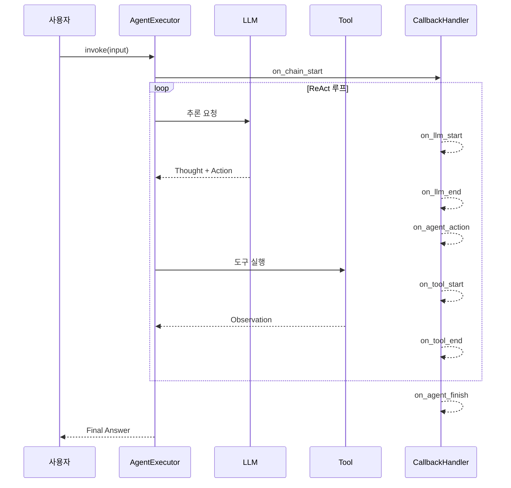
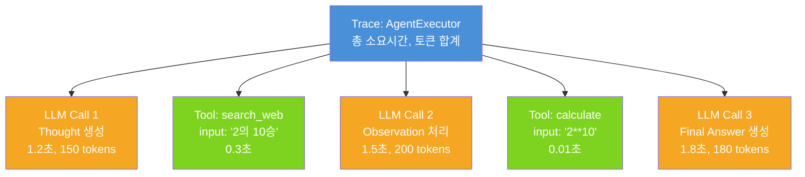
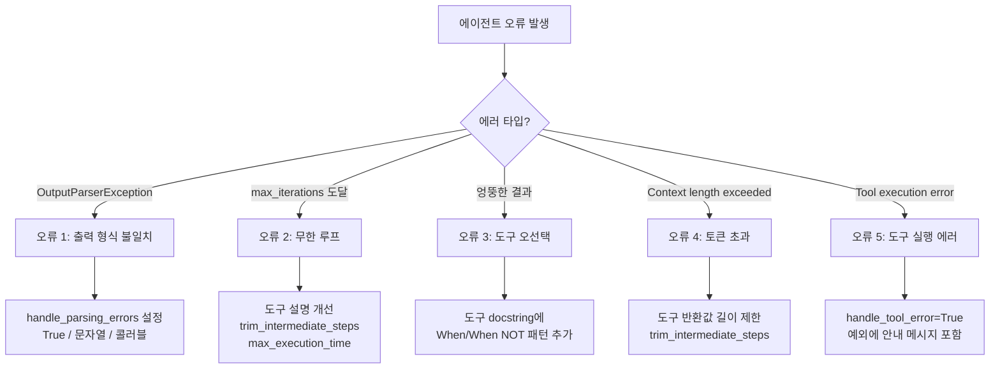

# 에이전트 디버깅과 모니터링

> 에이전트의 추론 과정을 실시간으로 추적하고, 문제를 진단하며, 프로덕션에서 안정적으로 운영하는 방법을 배웁니다.

## 개요

이 섹션에서는 LangChain 에이전트를 개발하고 운영하면서 마주치는 다양한 문제를 체계적으로 진단하고 해결하는 방법을 다룹니다. verbose 모드와 debug 모드의 차이부터 커스텀 콜백 핸들러 구현, LangSmith 트레이싱 연동, 그리고 실무에서 자주 발생하는 에러 패턴과 해결법까지 종합적으로 학습합니다.

**선수 지식**: [12.1 에이전트 개념과 ReAct 패턴](ch12/session1.md)에서 배운 ReAct 루프 동작 원리, [12.2 create_react_agent로 에이전트 구축](ch12/session2.md)의 에이전트 생성법, [12.3 AgentExecutor 설정과 제어](ch12/session3.md)의 `max_iterations`와 `handle_parsing_errors` 파라미터, [12.4 에이전트 도구 설계](ch12/session4.md)의 도구 설명 최적화 기법

**학습 목표**:
- `set_verbose`와 `set_debug`의 차이를 이해하고 상황에 맞게 활용할 수 있다
- `BaseCallbackHandler`를 상속하여 커스텀 모니터링 핸들러를 구현할 수 있다
- LangSmith 트레이싱을 설정하고 에이전트 실행 과정을 시각적으로 분석할 수 있다
- 에이전트의 일반적인 오류 패턴을 식별하고 체계적으로 해결할 수 있다

## 왜 알아야 할까?

에이전트는 LLM이 **스스로** 도구를 선택하고 실행하는 시스템입니다. 체인(Chain)과 달리 실행 경로가 고정되어 있지 않죠. 그래서 "왜 이 도구를 선택했지?", "왜 무한 루프에 빠졌지?", "왜 엉뚱한 답을 내놓지?" 같은 질문에 답하기가 훨씬 어렵습니다.

실제 프로덕션 환경에서 에이전트를 운영해보면, 개발 단계에서는 잘 동작하던 에이전트가 예상치 못한 입력에서 갑자기 무한 루프에 빠지거나, 도구 선택을 잘못해서 비용이 폭발적으로 증가하는 일이 발생합니다. 이런 상황에서 체계적인 디버깅과 모니터링 도구 없이는 원인 파악조차 어렵거든요.

앞서 [12.3 AgentExecutor 설정과 제어](ch12/session3.md)에서 `max_iterations`나 `handle_parsing_errors` 같은 안전장치를 배웠는데요, 이번 섹션에서는 그 안전장치가 **왜** 작동했는지, 에이전트가 **어떤 과정**을 거쳐 그 상태에 도달했는지를 추적하는 기술을 배웁니다.

## 핵심 개념

### 개념 1: verbose와 debug — 에이전트의 블랙박스 열기

> 💡 **비유**: 자동차를 수리한다고 생각해보세요. `verbose` 모드는 계기판의 경고등과 같습니다 — "엔진 이상", "오일 부족" 같은 핵심 정보만 보여주죠. 반면 `debug` 모드는 OBD-II 진단 장비를 연결한 것과 같아서, 엔진 회전수, 연료 분사량, 배기가스 성분까지 모든 센서 데이터를 보여줍니다.

LangChain은 에이전트 내부를 들여다보는 두 가지 글로벌 스위치를 제공합니다.

> 📊 **그림 1**: 디버깅 도구의 정보 수준 비교 — 상황에 맞는 도구 선택




**`set_verbose(True)`** — 핵심 이벤트(체인 시작/종료, 도구 호출, LLM 입출력)를 사람이 읽기 좋은 형태로 출력합니다. 내부적으로는 `StdOutCallbackHandler`를 자동 등록하는 것과 같습니다.

**`set_debug(True)`** — 모든 LangChain 컴포넌트의 원시(raw) 입출력을 빠짐없이 출력합니다. 프롬프트 전문, 모델 파라미터, 직렬화된 도구 정보까지 전부 보여주죠.

```python
from langchain.globals import set_verbose, set_debug

# 방법 1: 핵심 흐름만 확인 (일상적 개발)
set_verbose(True)

# 방법 2: 모든 raw 데이터 확인 (깊은 디버깅)
set_debug(True)

# 디버깅이 끝나면 반드시 꺼줄 것!
set_debug(False)
set_verbose(False)
```

두 모드의 출력 차이를 비교해봅시다:

```python
from langchain.globals import set_verbose, set_debug
from langchain_openai import ChatOpenAI
from langchain.agents import create_react_agent, AgentExecutor
from langchain_core.prompts import PromptTemplate
from langchain_core.tools import tool

@tool
def get_weather(city: str) -> str:
    """도시의 현재 날씨를 조회합니다."""
    # 시뮬레이션용 데이터
    weather_data = {"서울": "맑음, 15°C", "부산": "흐림, 18°C"}
    return weather_data.get(city, f"{city}의 날씨 정보를 찾을 수 없습니다.")

llm = ChatOpenAI(model="gpt-4o", temperature=0)
tools = [get_weather]

prompt = PromptTemplate.from_template(
    """Answer the following questions as best you can. You have access to the following tools:

{tools}

Use the following format:

Question: the input question you must answer
Thought: you should always think about what to do
Action: the action to take, should be one of [{tool_names}]
Action Input: the input to the action
Observation: the result of the action
... (this Thought/Action/Action Input/Observation can repeat N times)
Thought: I now know the final answer
Final Answer: the final answer to the original input question

Begin!

Question: {input}
Thought:{agent_scratchpad}"""
)

agent = create_react_agent(llm, tools, prompt)
executor = AgentExecutor(agent=agent, tools=tools)

# --- verbose 모드 출력 ---
set_verbose(True)
set_debug(False)
print("=== VERBOSE 모드 ===")
executor.invoke({"input": "서울 날씨 알려줘"})
# 출력 예시:
# > Entering new AgentExecutor chain...
# > 서울의 날씨를 조회하겠습니다.
# > Action: get_weather
# > Action Input: 서울
# > Observation: 맑음, 15°C
# > Final Answer: 서울의 현재 날씨는 맑음이며, 기온은 15°C입니다.
# > Finished chain.

set_verbose(False)

# --- debug 모드 출력 ---
set_debug(True)
print("\n=== DEBUG 모드 ===")
executor.invoke({"input": "서울 날씨 알려줘"})
# 출력 예시:
# [chain/start] [1:chain:AgentExecutor] Entering Chain run with input:
#   {"input": "서울 날씨 알려줘"}
# [llm/start] [1:chain:AgentExecutor > 2:llm:ChatOpenAI] ...
#   messages: [SystemMessage(...), HumanMessage(...)]
# [llm/end] [1:chain:AgentExecutor > 2:llm:ChatOpenAI] ...
#   generations: [[ChatGeneration(text="...", message=AIMessage(...))]]
# [tool/start] [1:chain:AgentExecutor > 3:tool:get_weather] ...
#   input: "서울"
# [tool/end] [1:chain:AgentExecutor > 3:tool:get_weather] ...
#   output: "맑음, 15°C"
# ... (더 상세한 raw 데이터 출력)

set_debug(False)
```

> 🔥 **실무 팁**: `verbose`는 개발 중 항상 켜두고, `debug`는 문제가 발생했을 때만 켜세요. `debug` 출력은 매우 방대해서 일상적으로 사용하면 오히려 핵심을 놓칠 수 있습니다. 또한 프로덕션 환경에서는 반드시 두 모드 모두 꺼두세요 — 성능 오버헤드와 민감한 데이터 노출 위험이 있습니다.

### 개념 2: 커스텀 콜백 핸들러 — 나만의 모니터링 계기판 만들기

> 💡 **비유**: verbose와 debug가 자동차의 기본 계기판이라면, 커스텀 콜백 핸들러는 레이싱 팀이 설치하는 **텔레메트리 시스템**입니다. 랩타임, 타이어 온도, 브레이크 압력 — 원하는 데이터만 골라서 원하는 형식으로 원하는 곳에 보낼 수 있죠.

LangChain의 콜백 시스템은 에이전트 실행 과정의 특정 이벤트에 반응하는 핸들러를 등록할 수 있게 해줍니다. `BaseCallbackHandler`를 상속하면 에이전트의 Thought → Action → Observation 루프를 정밀하게 추적할 수 있습니다.

주요 콜백 이벤트:

> 📊 **그림 2**: 에이전트 실행 시 콜백 이벤트 발생 순서




| 이벤트 | 발생 시점 | 용도 |
|--------|-----------|------|
| `on_llm_start` | LLM 호출 시작 | 프롬프트 로깅, 토큰 사용량 추적 |
| `on_llm_end` | LLM 응답 수신 | 응답 분석, 지연시간 측정 |
| `on_agent_action` | 에이전트가 도구 선택 | 도구 선택 패턴 분석 |
| `on_tool_start` | 도구 실행 시작 | 도구 입력값 검증 |
| `on_tool_end` | 도구 실행 완료 | 도구 출력값 검증 |
| `on_agent_finish` | 에이전트 최종 응답 | 최종 답변 로깅 |
| `on_chain_error` | 에러 발생 | 에러 추적, 알림 전송 |

```python
import time
from typing import Any, Dict, List, Optional
from uuid import UUID

from langchain_core.callbacks import BaseCallbackHandler
from langchain_core.agents import AgentAction, AgentFinish


class AgentMonitorHandler(BaseCallbackHandler):
    """에이전트 실행 과정을 추적하는 커스텀 콜백 핸들러"""

    def __init__(self):
        self.step_count = 0          # 추론 단계 수
        self.tool_calls: list = []   # 도구 호출 기록
        self.start_time: float = 0   # 실행 시작 시간
        self.llm_call_count = 0      # LLM 호출 횟수
        self.errors: list = []       # 에러 기록

    def on_chain_start(self, serialized: Dict[str, Any],
                       inputs: Dict[str, Any], **kwargs) -> None:
        """체인 시작 — 타이머 시작"""
        if self.start_time == 0:
            self.start_time = time.time()
            print(f"🚀 에이전트 실행 시작")
            print(f"   입력: {inputs.get('input', '')[:100]}")

    def on_llm_start(self, serialized: Dict[str, Any],
                     prompts: List[str], **kwargs) -> None:
        """LLM 호출 시작 — 호출 횟수 추적"""
        self.llm_call_count += 1
        print(f"🧠 LLM 호출 #{self.llm_call_count}")

    def on_agent_action(self, action: AgentAction,
                        *, run_id: UUID, **kwargs) -> None:
        """에이전트가 도구를 선택한 순간"""
        self.step_count += 1
        self.tool_calls.append({
            "step": self.step_count,
            "tool": action.tool,
            "input": action.tool_input,
            "thought": action.log.split("Action:")[0].strip()
        })
        print(f"🔧 Step {self.step_count}: {action.tool}")
        print(f"   입력: {action.tool_input}")

    def on_tool_end(self, output: str, **kwargs) -> None:
        """도구 실행 완료"""
        # 출력이 너무 길면 잘라서 표시
        display_output = output[:200] + "..." if len(output) > 200 else output
        print(f"   결과: {display_output}")

    def on_agent_finish(self, finish: AgentFinish,
                        *, run_id: UUID, **kwargs) -> None:
        """에이전트 최종 응답"""
        elapsed = time.time() - self.start_time
        print(f"\n✅ 에이전트 실행 완료")
        print(f"   총 단계: {self.step_count}")
        print(f"   LLM 호출: {self.llm_call_count}회")
        print(f"   도구 호출: {len(self.tool_calls)}회")
        print(f"   소요 시간: {elapsed:.2f}초")

    def on_chain_error(self, error: BaseException, **kwargs) -> None:
        """에러 발생 시 기록"""
        self.errors.append(str(error))
        print(f"❌ 에러 발생: {error}")

    def get_report(self) -> Dict[str, Any]:
        """실행 보고서 반환"""
        return {
            "total_steps": self.step_count,
            "llm_calls": self.llm_call_count,
            "tool_calls": self.tool_calls,
            "errors": self.errors,
            "elapsed_seconds": time.time() - self.start_time
        }
```

이 핸들러를 에이전트에 연결하는 방법:

```python
# 핸들러 인스턴스 생성
monitor = AgentMonitorHandler()

# 방법 1: AgentExecutor 생성 시 등록 (모든 실행에 적용)
executor = AgentExecutor(
    agent=agent,
    tools=tools,
    callbacks=[monitor],
    verbose=False  # 커스텀 핸들러 사용 시 verbose는 끄기
)
result = executor.invoke({"input": "서울과 부산의 날씨를 비교해줘"})

# 방법 2: invoke 호출 시 등록 (이번 실행에만 적용)
monitor_once = AgentMonitorHandler()
result = executor.invoke(
    {"input": "서울과 부산의 날씨를 비교해줘"},
    config={"callbacks": [monitor_once]}
)

# 실행 보고서 확인
report = monitor.get_report()
print(f"\n📊 실행 보고서: {report}")
```

### 개념 3: LangSmith 트레이싱 — 프로덕션 관찰 가능성

> 💡 **비유**: 커스텀 콜백 핸들러가 레이싱 팀의 텔레메트리라면, LangSmith는 **F1의 Mission Control**입니다. 모든 차량의 모든 데이터가 실시간으로 대시보드에 표시되고, 과거 레이스 데이터와 비교하며, 이상 징후를 자동으로 감지하죠.

[LangSmith](https://www.langchain.com/langsmith/observability)는 LangChain 팀이 만든 전용 관찰 가능성(Observability) 플랫폼입니다. 에이전트 실행의 모든 과정을 트리 구조의 트레이스로 기록하고, 웹 UI에서 시각적으로 분석할 수 있습니다.

**설정 방법:**

```python
import os

# LangSmith 트레이싱 활성화 (코드 변경 없이 환경변수만으로!)
os.environ["LANGCHAIN_TRACING_V2"] = "true"
os.environ["LANGCHAIN_API_KEY"] = "ls__..."  # LangSmith API 키
os.environ["LANGCHAIN_PROJECT"] = "agent-debugging-tutorial"

# .env 파일로 관리하는 것을 권장합니다
# --- .env ---
# LANGCHAIN_TRACING_V2=true
# LANGCHAIN_API_KEY=ls__your_api_key_here
# LANGCHAIN_PROJECT=agent-debugging-tutorial
```

놀라운 점은, 위 환경변수만 설정하면 **코드를 한 줄도 바꾸지 않아도** 모든 LangChain 실행이 자동으로 트레이싱된다는 겁니다.

```python
from dotenv import load_dotenv
load_dotenv()  # .env 파일에서 환경변수 로드

from langchain_openai import ChatOpenAI
from langchain.agents import create_react_agent, AgentExecutor
from langchain_core.prompts import PromptTemplate
from langchain_core.tools import tool

@tool
def search_web(query: str) -> str:
    """웹에서 정보를 검색합니다."""
    return f"'{query}'에 대한 검색 결과: LangChain은 LLM 앱 개발 프레임워크입니다."

@tool
def calculate(expression: str) -> str:
    """수학 계산을 수행합니다."""
    try:
        result = eval(expression)  # 교육 목적 — 프로덕션에서는 안전한 파서 사용
        return str(result)
    except Exception as e:
        return f"계산 오류: {e}"

llm = ChatOpenAI(model="gpt-4o", temperature=0)
tools = [search_web, calculate]

# 프롬프트 생성 (12.2에서 배운 패턴)
prompt = PromptTemplate.from_template(
    """Answer the following questions as best you can. You have access to the following tools:

{tools}

Use the following format:

Question: the input question you must answer
Thought: you should always think about what to do
Action: the action to take, should be one of [{tool_names}]
Action Input: the input to the action
Observation: the result of the action
... (this Thought/Action/Action Input/Observation can repeat N times)
Thought: I now know the final answer
Final Answer: the final answer to the original input question

Begin!

Question: {input}
Thought:{agent_scratchpad}"""
)

agent = create_react_agent(llm, tools, prompt)
executor = AgentExecutor(agent=agent, tools=tools, verbose=True)

# 이 실행은 자동으로 LangSmith에 트레이싱됩니다
result = executor.invoke({"input": "2의 10승은 얼마이고, 그 결과로 뭘 할 수 있어?"})
print(result["output"])
# LangSmith 대시보드 (https://smith.langchain.com)에서
# 트레이스 트리를 확인할 수 있습니다
```

**LangSmith 트레이스에서 확인할 수 있는 것들:**

> 📊 **그림 3**: LangSmith 트레이스의 트리 구조 — 각 스팬이 부모-자식 관계로 기록됨




- **실행 트리**: 에이전트의 각 단계가 부모-자식 관계의 트리로 표시
- **입출력 전문**: 각 컴포넌트의 정확한 입력과 출력
- **지연시간(Latency)**: 각 단계별 소요 시간 (P50, P99)
- **토큰 사용량**: LLM 호출별 입력/출력 토큰 수와 비용
- **에러 추적**: 어디서, 왜 실패했는지 정확한 위치
- **실행 비교**: 성공한 실행과 실패한 실행의 차이점 비교


### 개념 4: 추론 루프 분석 — intermediate_steps 해부하기

> 💡 **비유**: 형사가 사건을 수사할 때 용의자의 동선을 재구성하는 것처럼, `intermediate_steps`는 에이전트의 "사고 동선"을 보여줍니다. 어디서 잘못된 판단을 했는지, 어떤 단서(도구 결과)를 보고 방향을 틀었는지 추적할 수 있죠.

[12.3 AgentExecutor 설정과 제어](ch12/session3.md)에서 `return_intermediate_steps=True`를 배웠는데, 이번에는 이 데이터를 **체계적으로 분석**하는 방법을 살펴봅니다.

```python
from langchain_core.agents import AgentAction

# intermediate_steps 반환 활성화
executor = AgentExecutor(
    agent=agent,
    tools=tools,
    return_intermediate_steps=True,
    verbose=False
)

result = executor.invoke({"input": "파이의 값에 100을 곱하면?"})

# intermediate_steps 분석
steps = result["intermediate_steps"]
print(f"총 {len(steps)}단계 추론")
print("=" * 50)

for i, (action, observation) in enumerate(steps, 1):
    print(f"\n--- Step {i} ---")
    print(f"  Thought : {action.log.split('Action:')[0].strip()}")
    print(f"  Action  : {action.tool}")
    print(f"  Input   : {action.tool_input}")
    print(f"  Output  : {observation}")

print(f"\n--- 최종 답변 ---")
print(f"  {result['output']}")
```

이 분석을 자동화하는 유틸리티 함수를 만들어봅시다:

```python
def analyze_agent_run(result: dict) -> dict:
    """에이전트 실행 결과를 분석하여 진단 보고서를 생성합니다.

    Args:
        result: AgentExecutor.invoke()의 반환값
            (return_intermediate_steps=True 필수)

    Returns:
        진단 보고서 딕셔너리
    """
    steps = result.get("intermediate_steps", [])
    tool_usage = {}       # 도구별 사용 횟수
    repeated_calls = []   # 동일 도구+입력 반복 호출

    seen_calls = set()
    for action, observation in steps:
        # 도구 사용 빈도 집계
        tool_usage[action.tool] = tool_usage.get(action.tool, 0) + 1

        # 반복 호출 탐지
        call_key = (action.tool, str(action.tool_input))
        if call_key in seen_calls:
            repeated_calls.append(call_key)
        seen_calls.add(call_key)

    report = {
        "total_steps": len(steps),
        "tool_usage": tool_usage,
        "repeated_calls": repeated_calls,
        "has_loop": len(repeated_calls) > 0,
        "final_answer": result.get("output", ""),
    }

    # 진단 메시지 출력
    if report["has_loop"]:
        print("⚠️ 반복 호출 감지! 에이전트가 루프에 빠졌을 수 있습니다.")
        for tool_name, tool_input in repeated_calls:
            print(f"   → {tool_name}({tool_input})")

    if report["total_steps"] > 5:
        print(f"⚠️ 추론 단계가 {report['total_steps']}회로 많습니다. "
              "프롬프트나 도구 설명 개선을 검토하세요.")

    return report

# 사용 예시
# report = analyze_agent_run(result)
```

### 개념 5: 일반적인 에이전트 오류와 해결법

에이전트를 개발하다 보면 반복적으로 마주치는 오류 패턴들이 있습니다. 여기서는 가장 흔한 5가지 패턴과 해결법을 정리합니다.

> 📊 **그림 4**: 에이전트 오류 진단 플로우차트




**오류 1: OutputParserException — "Could not parse LLM output"**

LLM이 `Action: / Action Input:` 또는 `Final Answer:` 형식을 지키지 않았을 때 발생합니다.

```python
from langchain.agents import AgentExecutor

# 해결법 1: handle_parsing_errors를 True로 설정
# → 에러 메시지를 LLM에게 돌려보내 재시도하게 함
executor = AgentExecutor(
    agent=agent,
    tools=tools,
    handle_parsing_errors=True,  # 자동 재시도
    max_iterations=10
)

# 해결법 2: 커스텀 에러 메시지로 LLM을 안내
executor = AgentExecutor(
    agent=agent,
    tools=tools,
    handle_parsing_errors=(
        "출력 형식이 올바르지 않습니다. 반드시 다음 형식을 사용하세요:\n"
        "Action: 도구이름\n"
        "Action Input: 입력값\n"
        "또는\n"
        "Final Answer: 최종 답변"
    ),
    max_iterations=10
)

# 해결법 3: 콜러블로 에러 상황에 맞는 처리
def custom_error_handler(error: Exception) -> str:
    """파싱 에러를 분석하여 적절한 안내를 반환합니다."""
    error_msg = str(error)
    if "Could not parse" in error_msg:
        return (
            "출력 형식을 지켜주세요. "
            "Action/Action Input 또는 Final Answer를 사용하세요."
        )
    return f"오류가 발생했습니다: {error_msg}. 다시 시도해주세요."

executor = AgentExecutor(
    agent=agent,
    tools=tools,
    handle_parsing_errors=custom_error_handler,
    max_iterations=10
)
```

**오류 2: 무한 루프 — 같은 도구를 반복 호출**

에이전트가 같은 도구를 같은 입력으로 계속 호출하는 상황입니다.

```python
# 근본 원인: 도구가 에이전트 기대와 다른 결과를 반환
# 해결법 1: max_iterations로 강제 종료
executor = AgentExecutor(
    agent=agent,
    tools=tools,
    max_iterations=5,               # 최대 5번으로 제한
    max_execution_time=30,           # 30초 타임아웃
    early_stopping_method="generate" # 지금까지의 정보로 답변 생성 시도
)

# 해결법 2: 도구 설명 개선 (12.4에서 배운 기법)
# "이 도구는 X를 반환합니다. Y 정보가 필요하면 다른 도구를 사용하세요."

# 해결법 3: trim_intermediate_steps로 컨텍스트 관리
def trim_steps(steps: list) -> list:
    """마지막 3단계만 유지하여 컨텍스트 오버플로우 방지"""
    return steps[-3:]

executor = AgentExecutor(
    agent=agent,
    tools=tools,
    trim_intermediate_steps=trim_steps,
    max_iterations=10
)
```

**오류 3: 도구 선택 오류 — 엉뚱한 도구를 선택**

```python
# 진단: 콜백으로 도구 선택 패턴 추적
class ToolSelectionTracker(BaseCallbackHandler):
    """도구 선택 패턴을 추적하여 오선택을 진단합니다."""

    def __init__(self):
        self.selections: list = []

    def on_agent_action(self, action: AgentAction,
                        *, run_id: UUID, **kwargs) -> None:
        self.selections.append({
            "tool": action.tool,
            "input": action.tool_input,
            "reasoning": action.log  # LLM의 사고 과정(Thought)
        })

    def diagnose(self) -> None:
        """도구 선택 패턴 분석 결과를 출력합니다."""
        print("📋 도구 선택 히스토리:")
        for i, sel in enumerate(self.selections, 1):
            print(f"  {i}. {sel['tool']}({sel['input']})")
            # Thought 부분에서 선택 이유 추출
            thought = sel['reasoning'].split("Action:")[0].strip()
            if thought:
                print(f"     이유: {thought[:100]}")

# 해결법: 도구 설명에 When/When NOT 패턴 적용 (12.4 참조)
# @tool 데코레이터의 docstring을 개선
```

**오류 4: 토큰 한도 초과 — 대화가 너무 길어질 때**

```python
# 원인: intermediate_steps가 누적되면서 프롬프트가 점점 길어짐

# 해결법 1: trim_intermediate_steps (위 예제 참조)

# 해결법 2: max_iterations를 낮게 설정하여 빠르게 종료
executor = AgentExecutor(
    agent=agent,
    tools=tools,
    max_iterations=5,
    handle_parsing_errors=True
)

# 해결법 3: 도구 반환값 길이 제한
@tool
def search_documents(query: str) -> str:
    """문서에서 관련 정보를 검색합니다. 최대 500자까지 반환합니다."""
    raw_result = "..." # 실제 검색 결과
    # 도구 반환값을 500자로 제한
    if len(raw_result) > 500:
        return raw_result[:500] + "\n[결과가 잘렸습니다. 더 구체적인 쿼리를 사용하세요.]"
    return raw_result
```

**오류 5: 도구 실행 에러 — 외부 API 장애 등**

```python
# handle_tool_error로 에이전트에게 에러 상황을 알려줌
@tool(handle_tool_error=True)
def call_external_api(endpoint: str) -> str:
    """외부 API를 호출합니다. 실패 시 에이전트에게 에러를 반환합니다."""
    import requests
    try:
        response = requests.get(endpoint, timeout=5)
        response.raise_for_status()
        return response.text[:500]
    except requests.RequestException as e:
        raise Exception(f"API 호출 실패: {e}. 다른 방법을 시도하세요.")
```

## 실습: 직접 해보기

종합 실습으로, 커스텀 콜백 핸들러를 활용한 **에이전트 모니터링 대시보드**를 구축해봅시다.

```python
"""
에이전트 모니터링 대시보드 실습
- 커스텀 콜백 핸들러로 에이전트의 모든 행동을 추적
- 실행 보고서 자동 생성
- 이상 징후(반복 호출, 과다 단계) 자동 감지
"""
import time
from typing import Any, Dict, List, Optional
from uuid import UUID

from dotenv import load_dotenv
load_dotenv()

from langchain_openai import ChatOpenAI
from langchain.agents import create_react_agent, AgentExecutor
from langchain_core.prompts import PromptTemplate
from langchain_core.tools import tool
from langchain_core.callbacks import BaseCallbackHandler
from langchain_core.agents import AgentAction, AgentFinish


# --- 1단계: 도구 정의 ---
@tool
def get_population(country: str) -> str:
    """국가의 인구 정보를 조회합니다. 국가명은 한국어로 입력하세요."""
    data = {
        "한국": "약 5,200만 명",
        "일본": "약 1억 2,400만 명",
        "미국": "약 3억 3,000만 명",
    }
    return data.get(country, f"{country}의 인구 데이터를 찾을 수 없습니다.")

@tool
def get_gdp(country: str) -> str:
    """국가의 GDP 정보를 조회합니다. 국가명은 한국어로 입력하세요."""
    data = {
        "한국": "약 1.7조 달러 (2024년 기준)",
        "일본": "약 4.2조 달러 (2024년 기준)",
        "미국": "약 28.8조 달러 (2024년 기준)",
    }
    return data.get(country, f"{country}의 GDP 데이터를 찾을 수 없습니다.")

@tool
def calculate_ratio(a: str, b: str) -> str:
    """두 숫자의 비율을 계산합니다. a와 b를 숫자 문자열로 입력하세요."""
    try:
        num_a = float(a.replace(",", "").replace("만", "0000")
                      .replace("억", "00000000").replace("조", "000000000000"))
        num_b = float(b.replace(",", "").replace("만", "0000")
                      .replace("억", "00000000").replace("조", "000000000000"))
        if num_b == 0:
            return "0으로 나눌 수 없습니다."
        ratio = num_a / num_b
        return f"{ratio:.2f}배"
    except ValueError:
        return "숫자 형식이 올바르지 않습니다. 순수 숫자를 입력해주세요."


# --- 2단계: 종합 모니터링 핸들러 ---
class DashboardHandler(BaseCallbackHandler):
    """에이전트 실행을 종합적으로 모니터링하는 대시보드 핸들러"""

    def __init__(self):
        self.start_time: float = 0
        self.step_count: int = 0
        self.llm_calls: int = 0
        self.llm_times: List[float] = []  # LLM 호출별 소요 시간
        self.tool_log: List[Dict] = []    # 도구 호출 기록
        self.errors: List[str] = []       # 에러 기록
        self._llm_start_time: float = 0   # LLM 호출 시작 시간 (내부용)
        self._tool_start_time: float = 0  # 도구 호출 시작 시간 (내부용)

    def on_chain_start(self, serialized: Dict[str, Any],
                       inputs: Dict[str, Any], **kwargs) -> None:
        if self.start_time == 0:
            self.start_time = time.time()
            print("┌─────────────────────────────────────────────┐")
            print("│        🔍 에이전트 모니터링 대시보드        │")
            print("├─────────────────────────────────────────────┤")
            query = inputs.get("input", "")[:40]
            print(f"│ 질문: {query:<37s} │")
            print("├─────────────────────────────────────────────┤")

    def on_llm_start(self, serialized: Dict[str, Any],
                     prompts: List[str], **kwargs) -> None:
        self.llm_calls += 1
        self._llm_start_time = time.time()

    def on_llm_end(self, response: Any, **kwargs) -> None:
        elapsed = time.time() - self._llm_start_time
        self.llm_times.append(elapsed)

    def on_agent_action(self, action: AgentAction,
                        *, run_id: UUID, **kwargs) -> None:
        self.step_count += 1
        self._tool_start_time = time.time()
        thought = action.log.split("Action:")[0].replace("Thought:", "").strip()
        print(f"│ Step {self.step_count}: 🧠 {thought[:35]:<35s} │")
        print(f"│         🔧 {action.tool}({str(action.tool_input)[:25]:<25s}) │")

    def on_tool_end(self, output: str, **kwargs) -> None:
        tool_time = time.time() - self._tool_start_time
        short_output = output[:30] + "..." if len(output) > 30 else output
        print(f"│         📤 {short_output:<33s} │")

        # 도구 실행 기록 저장
        self.tool_log.append({
            "step": self.step_count,
            "output": output,
            "time": tool_time
        })

    def on_agent_finish(self, finish: AgentFinish,
                        *, run_id: UUID, **kwargs) -> None:
        total_time = time.time() - self.start_time
        avg_llm = (sum(self.llm_times) / len(self.llm_times)
                   if self.llm_times else 0)

        print("├─────────────────────────────────────────────┤")
        print(f"│ ✅ 완료! 총 {self.step_count}단계, "
              f"{total_time:.1f}초 소요{' ' * (22 - len(str(self.step_count)) - len(f'{total_time:.1f}'))}│")
        print(f"│ 📊 LLM {self.llm_calls}회 호출 "
              f"(평균 {avg_llm:.2f}초/회){' ' * max(0, 16 - len(f'{avg_llm:.2f}'))}│")

        # 이상 징후 감지
        warnings = self._detect_anomalies()
        if warnings:
            print("├─────────────────────────────────────────────┤")
            for w in warnings:
                print(f"│ ⚠️  {w:<40s} │")
        print("└─────────────────────────────────────────────┘")

    def on_chain_error(self, error: BaseException, **kwargs) -> None:
        self.errors.append(str(error))
        print(f"│ ❌ 에러: {str(error)[:35]:<35s} │")

    def _detect_anomalies(self) -> List[str]:
        """실행 이상 징후를 자동으로 감지합니다."""
        warnings = []

        # 1. 과도한 단계 수
        if self.step_count > 5:
            warnings.append(f"단계 수 {self.step_count}회 — 도구 설명 개선 필요")

        # 2. 느린 LLM 응답
        slow_calls = [t for t in self.llm_times if t > 5.0]
        if slow_calls:
            warnings.append(f"LLM 응답 {len(slow_calls)}회가 5초 초과")

        # 3. 에러 발생
        if self.errors:
            warnings.append(f"에러 {len(self.errors)}건 발생")

        return warnings


# --- 3단계: 에이전트 구성 및 실행 ---
llm = ChatOpenAI(model="gpt-4o", temperature=0)
tools = [get_population, get_gdp, calculate_ratio]

prompt = PromptTemplate.from_template(
    """Answer the following questions as best you can. You have access to the following tools:

{tools}

Use the following format:

Question: the input question you must answer
Thought: you should always think about what to do
Action: the action to take, should be one of [{tool_names}]
Action Input: the input to the action
Observation: the result of the action
... (this Thought/Action/Action Input/Observation can repeat N times)
Thought: I now know the final answer
Final Answer: the final answer to the original input question

Begin!

Question: {input}
Thought:{agent_scratchpad}"""
)

agent = create_react_agent(llm, tools, prompt)

# 대시보드 핸들러 연결
dashboard = DashboardHandler()
executor = AgentExecutor(
    agent=agent,
    tools=tools,
    callbacks=[dashboard],
    return_intermediate_steps=True,
    handle_parsing_errors=True,
    max_iterations=10,
    max_execution_time=60,
    verbose=False
)

# 실행!
result = executor.invoke({
    "input": "한국과 일본의 인구와 GDP를 비교해줘"
})
print(f"\n💬 최종 답변:\n{result['output']}")

# intermediate_steps 분석
steps = result["intermediate_steps"]
print(f"\n📈 추론 경로 분석:")
for i, (action, observation) in enumerate(steps, 1):
    print(f"  {i}. {action.tool}({action.tool_input}) → {observation[:50]}...")
```

실행하면 다음과 유사한 대시보드 출력을 볼 수 있습니다:

```
┌─────────────────────────────────────────────┐
│        🔍 에이전트 모니터링 대시보드        │
├─────────────────────────────────────────────┤
│ 질문: 한국과 일본의 인구와 GDP를 비교해줘   │
├─────────────────────────────────────────────┤
│ Step 1: 🧠 한국의 인구를 먼저 조회하겠습니다 │
│         🔧 get_population(한국)              │
│         📤 약 5,200만 명                     │
│ Step 2: 🧠 일본의 인구를 조회하겠습니다      │
│         🔧 get_population(일본)              │
│         📤 약 1억 2,400만 명                 │
│ Step 3: 🧠 한국의 GDP를 조회하겠습니다       │
│         🔧 get_gdp(한국)                     │
│         📤 약 1.7조 달러 (2024년 기준)       │
│ Step 4: 🧠 일본의 GDP를 조회하겠습니다       │
│         🔧 get_gdp(일본)                     │
│         📤 약 4.2조 달러 (2024년 기준)       │
├─────────────────────────────────────────────┤
│ ✅ 완료! 총 4단계, 8.3초 소요               │
│ 📊 LLM 5회 호출 (평균 1.52초/회)            │
└─────────────────────────────────────────────┘
```

## 더 깊이 알아보기

### 관찰 가능성의 기원 — Google Dapper에서 LangSmith까지

LangSmith의 트레이싱 방식이 갑자기 등장한 것은 아닙니다. 그 뿌리는 2010년 Google이 발표한 **Dapper 논문**까지 거슬러 올라가거든요.

Google은 자사의 거대한 분산 시스템(검색, Gmail, YouTube 등)에서 하나의 요청이 수십 개의 마이크로서비스를 거치는데, 어디서 병목이 생기는지 찾는 게 너무 어려웠습니다. 그래서 만든 것이 Dapper — 모든 요청에 고유한 **트레이스 ID**를 부여하고, 각 서비스를 통과할 때마다 **스팬(Span)**을 기록하는 분산 추적 시스템이었죠.

이 아이디어는 Twitter의 **Zipkin**(2012), Uber의 **Jaeger**(2015)로 이어졌고, 2021년에는 **OpenTelemetry**라는 표준으로 통합되었습니다.

LangSmith는 이 분산 추적의 개념을 **LLM 애플리케이션**에 적용한 것입니다. 에이전트의 한 번 실행이 마이크로서비스의 한 번 요청과 같고, LLM 호출·도구 실행·프롬프트 포매팅 등 각 단계가 개별 스팬이 되는 거죠. 결국 30년간 축적된 분산 시스템의 관찰 가능성 노하우가 AI 에이전트 모니터링에 그대로 적용된 셈입니다.

> 💡 **알고 계셨나요?**: Dapper 논문의 저자 중 한 명인 Benjamin Sigelman은 나중에 LightStep(현재 ServiceNow의 일부)을 창업하고, OpenTelemetry 프로젝트를 공동 창립했습니다. "분산 추적"이라는 아이디어 하나가 전체 소프트웨어 관찰 가능성 생태계를 만든 셈이죠.

### ReAct 에이전트 디버깅의 특수성

일반적인 소프트웨어 디버깅과 에이전트 디버깅은 본질적으로 다릅니다. 일반 프로그램은 **결정론적(deterministic)**이어서 같은 입력이면 같은 출력이 나오지만, LLM 기반 에이전트는 **확률적(stochastic)**이라 같은 입력에도 다른 추론 경로를 탈 수 있습니다. 그래서 에이전트 디버깅에서는:

1. **재현성 확보**가 중요합니다 — `temperature=0`으로 설정하고, 시드를 고정하면 재현성이 높아집니다.
2. **통계적 접근**이 필요합니다 — 한 번의 실행이 아니라 여러 번 실행하여 패턴을 파악해야 합니다.
3. **추론 과정 자체**가 디버깅 대상입니다 — 최종 결과뿐 아니라 Thought의 논리적 흐름을 분석해야 합니다.

## 흔한 오해와 팁

> ⚠️ **흔한 오해**: "`verbose=True`면 충분하다" — verbose 모드는 보기 좋게 포매팅된 요약 정보만 보여줍니다. 실제 프롬프트 전문이나 모델 파라미터를 확인하려면 `set_debug(True)`를 사용해야 하고, 체계적인 분석이 필요하면 커스텀 콜백 핸들러나 LangSmith를 사용해야 합니다.

> 💡 **알고 계셨나요?**: LangSmith는 LangChain 전용이 아닙니다. OpenAI SDK, Anthropic SDK, LlamaIndex 등 다른 프레임워크로 만든 LLM 애플리케이션도 트레이싱할 수 있습니다. `@traceable` 데코레이터를 사용하면 순수 Python 함수도 트레이스에 포함시킬 수 있죠.

> 🔥 **실무 팁**: 프로덕션 에이전트를 운영할 때는 다음 세 가지 지표를 반드시 모니터링하세요:
> 1. **평균 단계 수** — 갑자기 증가하면 프롬프트나 도구 문제 신호
> 2. **P99 응답 시간** — 극단적으로 느린 실행을 감지
> 3. **도구별 에러율** — 특정 도구의 실패가 전체 에이전트 성능을 저하시킬 수 있음

> 🔥 **실무 팁**: 에이전트 디버깅의 80%는 **프롬프트 문제**입니다. 도구 설명이 모호하거나, 지시사항이 불명확하면 LLM이 잘못된 추론을 합니다. 코드를 고치기 전에 항상 프롬프트부터 검토하세요.

## 핵심 정리

| 개념 | 설명 |
|------|------|
| `set_verbose(True)` | 핵심 이벤트를 읽기 쉬운 형태로 출력. 일상적 개발에 적합 |
| `set_debug(True)` | 모든 컴포넌트의 raw 입출력을 출력. 깊은 디버깅에 사용 |
| `BaseCallbackHandler` | 에이전트 실행 이벤트에 반응하는 커스텀 핸들러를 구현하는 기반 클래스 |
| `on_agent_action` | 에이전트가 도구를 선택할 때 호출되는 콜백 메서드 |
| `on_tool_start/end` | 도구 실행 시작/종료 시 호출되는 콜백 메서드 |
| LangSmith 트레이싱 | `LANGCHAIN_TRACING_V2=true` 환경변수만으로 활성화되는 관찰 가능성 플랫폼 |
| `intermediate_steps` | 에이전트의 (Action, Observation) 튜플 리스트로 추론 과정 분석에 핵심 |
| `OutputParserException` | LLM 출력이 예상 형식과 맞지 않을 때 발생. `handle_parsing_errors`로 처리 |
| `handle_parsing_errors` | `True`, 문자열, 콜러블 세 가지 방식으로 파싱 에러를 처리 |
| 반복 호출 감지 | `intermediate_steps`에서 동일 도구+입력 패턴을 추적하여 루프 진단 |

## 다음 섹션 미리보기

축하합니다! 이것으로 **Chapter 12: 에이전트(Agent) 기초**를 모두 마쳤습니다. ReAct 패턴의 개념부터 에이전트 구축, AgentExecutor 제어, 도구 설계, 그리고 디버깅과 모니터링까지 — 에이전트의 전체 생명주기를 다뤘죠.

다음 [Chapter 13: LangGraph 기초](ch13/session1.md)에서는 에이전트를 한 단계 더 발전시킵니다. AgentExecutor의 선형적인 ReAct 루프를 넘어서, **상태 기반 그래프(StateGraph)**로 에이전트의 워크플로우를 유연하게 설계하는 방법을 배웁니다. 조건 분기, 병렬 실행, 체크포인트 기반 중단/재개 — AgentExecutor로는 구현하기 어려웠던 복잡한 패턴들이 LangGraph에서는 자연스럽게 표현됩니다. 특히 이번 섹션에서 배운 콜백 기반 모니터링 경험이 LangGraph의 관찰 가능성 이해에 큰 도움이 될 것입니다.

## 참고 자료

- [LangChain 공식 디버깅 가이드 — How to debug your LLM apps](https://python.langchain.com/docs/guides/debugging) - `set_verbose`, `set_debug`, 콜백 시스템의 공식 사용법을 가장 정확하게 설명합니다
- [BaseCallbackHandler API 레퍼런스](https://python.langchain.com/api_reference/core/callbacks/langchain_core.callbacks.base.BaseCallbackHandler.html) - 커스텀 콜백 핸들러 구현 시 사용 가능한 모든 이벤트 메서드와 시그니처를 확인할 수 있습니다
- [LangSmith 트레이싱 공식 문서 — Trace LangChain applications](https://docs.langchain.com/langsmith/trace-with-langchain) - LangSmith 트레이싱 설정과 활용법에 대한 공식 가이드입니다
- [LangSmith 관찰 가능성 플랫폼](https://www.langchain.com/langsmith/observability) - LangSmith의 대시보드, 커스텀 메트릭, 알림 설정 등 프로덕션 모니터링 기능을 소개합니다
- [Handle parsing errors — LangChain 공식 문서](https://python.langchain.com/v0.1/docs/modules/agents/how_to/handle_parsing_errors/) - `handle_parsing_errors` 파라미터의 세 가지 사용 방식(True/문자열/콜러블)을 예제로 설명합니다
- [Dapper, a Large-Scale Distributed Systems Tracing Infrastructure (Google, 2010)](https://research.google/pubs/dapper-a-large-scale-distributed-systems-tracing-infrastructure/) - 분산 추적의 기원이 된 논문으로, LangSmith 트레이싱의 아키텍처적 뿌리를 이해할 수 있습니다

---
### 🔗 Related Sessions
- [agent](../12-에이전트agent-기초/01-에이전트-개념과-react-패턴.md) (prerequisite)
- [react_pattern](../12-에이전트agent-기초/01-에이전트-개념과-react-패턴.md) (prerequisite)
- [agent_executor](../12-에이전트agent-기초/01-에이전트-개념과-react-패턴.md) (prerequisite)
- [intermediate_steps](../12-에이전트agent-기초/01-에이전트-개념과-react-패턴.md) (prerequisite)
- [create_react_agent_usage](../12-에이전트agent-기초/02-create-react-agent로-에이전트-구축.md) (prerequisite)
- [agent_executor_parameters](../12-에이전트agent-기초/02-create-react-agent로-에이전트-구축.md) (prerequisite)
- [max_iterations_config](../12-에이전트agent-기초/03-agentexecutor-설정과-제어.md) (prerequisite)
- [handle_parsing_errors_patterns](../12-에이전트agent-기초/03-agentexecutor-설정과-제어.md) (prerequisite)
- [return_intermediate_steps_usage](../12-에이전트agent-기초/03-agentexecutor-설정과-제어.md) (prerequisite)
- [tool_description_best_practice](../12-에이전트agent-기초/04-에이전트-도구-설계.md) (prerequisite)
