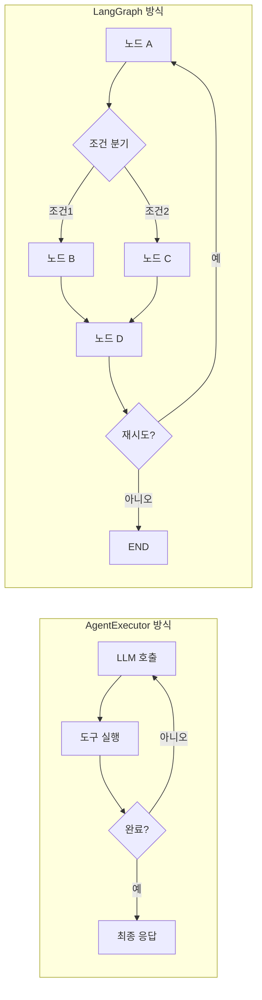
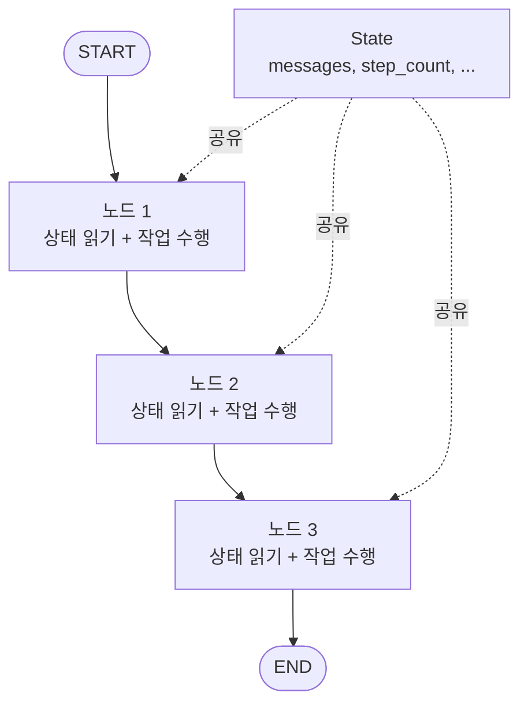
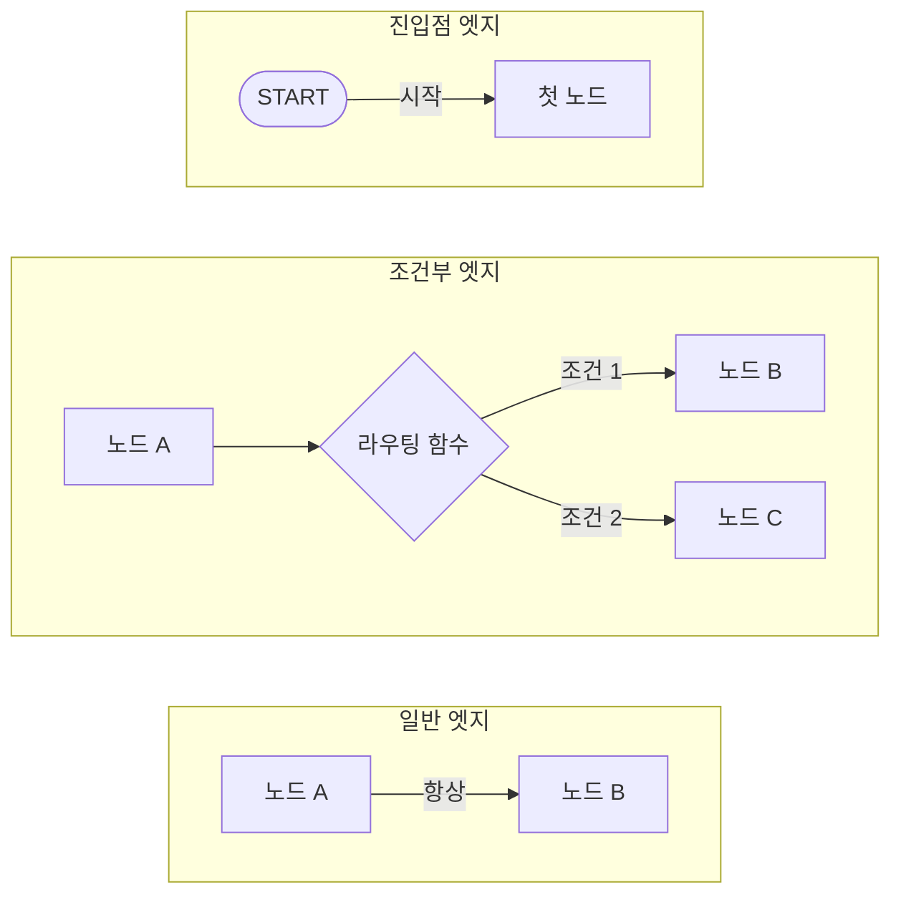
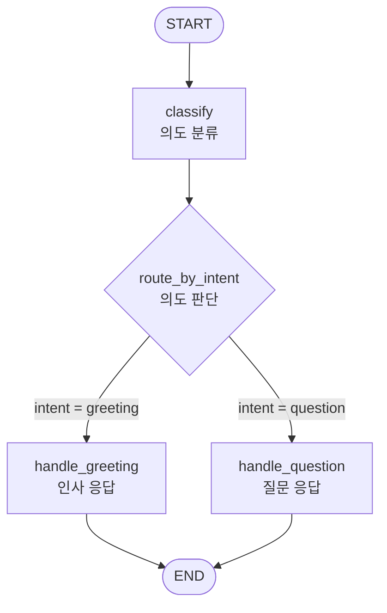
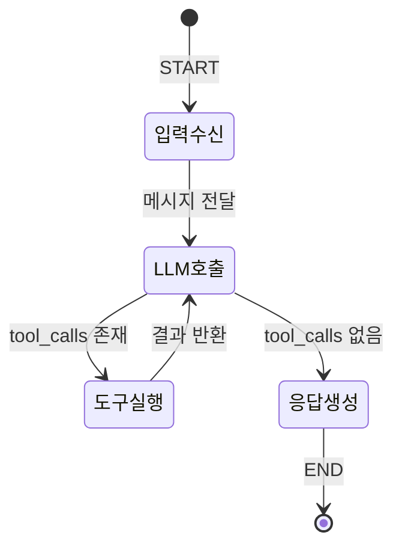

# LangGraph 소개와 핵심 개념

> LangGraph의 탄생 배경과 StateGraph, 노드, 엣지의 핵심 개념을 이해하고, 기존 AgentExecutor와의 차이를 파악합니다.

## 개요

이 섹션에서는 LangGraph가 왜 필요한지, 그리고 LangGraph의 핵심 구성 요소인 StateGraph, 노드(Node), 엣지(Edge)가 무엇인지 배웁니다. 기존의 AgentExecutor 방식과 비교하면서, LangGraph가 어떤 문제를 해결하는지 직관적으로 이해해 보겠습니다.

**선수 지식**: [Ch12: 에이전트(Agent) 기초]에서 배운 에이전트의 개념과 도구 호출 패턴, [Ch5: LCEL 마스터]에서 배운 체인 구성 방식
**학습 목표**:
- LangGraph가 탄생하게 된 배경과 필요성을 설명할 수 있다
- StateGraph, 노드, 엣지의 개념을 이해하고 구분할 수 있다
- StateGraph와 MessageGraph(레거시)의 차이를 파악한다
- AgentExecutor 대비 LangGraph의 장점을 설명할 수 있다

## 왜 알아야 할까?

앞서 Ch12에서 AgentExecutor를 사용해 에이전트를 만들어 봤죠? 간단한 도구 호출에는 충분했지만, 현실 세계의 요구사항은 훨씬 복잡합니다. "검색 결과가 부족하면 다시 검색하되, 3번 이상 반복하면 사용자에게 물어봐라" 같은 조건부 분기는 어떻게 구현할까요?

AgentExecutor는 내부적으로 **단순한 루프** 구조입니다. LLM이 도구를 호출하면 실행하고, 다시 LLM에게 결과를 전달하는 것을 반복하죠. 이 구조에서는 "특정 단계에서 사람의 승인을 받아라", "중간에 상태를 저장했다가 나중에 재개해라" 같은 고급 패턴을 구현하기 매우 어렵습니다.

LangGraph는 바로 이 한계를 넘어서기 위해 만들어졌습니다. **그래프(Graph)** 라는 자료구조를 사용해서, 에이전트의 실행 흐름을 노드와 엣지로 명시적으로 정의할 수 있거든요. 이를 통해 복잡한 분기, 반복, 상태 관리, 사람 개입(Human-in-the-Loop)까지 자연스럽게 구현할 수 있습니다.

> 📊 **그림 1**: AgentExecutor의 단순 루프 vs LangGraph의 그래프 구조




현재 LangChain 공식 문서에서도 AgentExecutor는 레거시로 분류되어 있고, **LangGraph가 에이전트 구축의 표준**으로 자리잡았습니다. 프로덕션 수준의 AI 에이전트를 만들려면 LangGraph는 필수입니다.

## 핵심 개념

### 개념 1: 그래프(Graph) — 지하철 노선도로 이해하기

> 💡 **비유**: LangGraph를 **지하철 노선도**에 비유해 볼까요? 각 역(Station)이 **노드**, 역과 역을 잇는 선로가 **엣지**입니다. 승객(데이터)은 출발역(START)에서 타서 여러 역을 거쳐 종착역(END)에 도착합니다. 환승역에서는 조건에 따라 다른 노선으로 갈아탈 수도 있죠 — 이것이 바로 **조건부 엣지**입니다.

LangGraph에서 **그래프(Graph)** 는 에이전트의 전체 실행 흐름을 정의하는 구조입니다. 그래프 이론에서 가져온 개념인데요, 핵심 구성 요소는 세 가지입니다:

| 구성 요소 | 지하철 비유 | LangGraph에서의 역할 |
|-----------|-----------|---------------------|
| **노드(Node)** | 역 | 특정 작업을 수행하는 함수 |
| **엣지(Edge)** | 선로 | 노드 간 실행 순서를 정의 |
| **상태(State)** | 승객이 들고 다니는 가방 | 노드 간 공유되는 데이터 |

```python
# LangGraph의 기본 임포트
from langgraph.graph import StateGraph, START, END
```

`START`는 그래프의 시작점, `END`는 종료점을 나타내는 특별한 노드입니다. 모든 그래프는 `START`에서 시작하여 `END`에서 끝납니다.

> 📊 **그림 2**: LangGraph 그래프의 기본 구조 — 노드, 엣지, 상태의 관계




### 개념 2: 상태(State) — 릴레이 경주의 바통

> 💡 **비유**: **릴레이 경주**를 떠올려 보세요. 각 주자(노드)는 바통(State)을 받아서 자기 구간을 달리고, 다음 주자에게 바통을 넘깁니다. 바통에는 "현재 몇 바퀴째인지", "총 기록은 얼마인지" 같은 정보가 적혀 있죠. LangGraph의 State도 마찬가지입니다 — 각 노드가 읽고 수정할 수 있는 **공유 데이터 구조**입니다.

LangGraph에서 State는 `TypedDict`나 Pydantic `BaseModel`로 정의합니다. 상태(State)는 그래프의 모든 노드가 공유하는 데이터 스냅샷이에요.

```python
from typing import TypedDict, Annotated
from langgraph.graph import StateGraph, START, END
from langgraph.graph.message import add_messages
from langchain_core.messages import AnyMessage

# 상태 정의: 그래프 전체에서 공유할 데이터 구조
class AgentState(TypedDict):
    messages: Annotated[list[AnyMessage], add_messages]  # 메시지 누적
    step_count: int  # 현재 단계 수
```

여기서 `Annotated[list[AnyMessage], add_messages]`가 중요합니다. `add_messages`는 **리듀서(Reducer)** 함수인데요, 새로운 메시지가 들어오면 기존 리스트에 **추가(append)** 하라는 뜻입니다. 리듀서 없이 단순히 `list[AnyMessage]`로만 선언하면, 새 값이 기존 값을 **덮어쓰게** 됩니다.

LangGraph는 자주 쓰이는 상태 패턴을 위해 `MessagesState`라는 미리 정의된 상태도 제공합니다:

```python
from langgraph.graph import MessagesState

# MessagesState는 아래와 동일합니다:
# class MessagesState(TypedDict):
#     messages: Annotated[list[AnyMessage], add_messages]
```

### 개념 3: 노드(Node) — 각자의 역할을 수행하는 팀원

> 💡 **비유**: 프로젝트 팀을 생각해 보세요. 기획자가 요구사항을 분석하고, 개발자가 코드를 작성하고, QA가 테스트합니다. 각 팀원이 **노드**이고, 이들은 모두 같은 프로젝트 문서(State)를 보며 자기 역할을 수행한 뒤 문서를 업데이트합니다.

노드는 **파이썬 함수**입니다. 현재 상태(State)를 입력으로 받고, 업데이트할 상태를 딕셔너리로 반환합니다.

```python
from langchain_openai import ChatOpenAI
from langchain_core.messages import HumanMessage

# LLM을 호출하는 노드
def call_model(state: AgentState) -> dict:
    """LLM에게 현재 메시지를 전달하고 응답을 받는 노드"""
    model = ChatOpenAI(model="gpt-4o", temperature=0)
    response = model.invoke(state["messages"])
    # 리듀서(add_messages)가 있으므로 기존 메시지에 추가됨
    return {"messages": [response], "step_count": state["step_count"] + 1}

# 결과를 정리하는 노드
def summarize(state: AgentState) -> dict:
    """최종 결과를 요약하는 노드"""
    summary = f"총 {state['step_count']}단계를 거쳤습니다."
    return {"messages": [HumanMessage(content=summary)]}
```

노드를 그래프에 등록할 때는 `add_node()` 메서드를 사용합니다:

```python
graph = StateGraph(AgentState)
graph.add_node("call_model", call_model)   # "call_model"이라는 이름으로 노드 등록
graph.add_node("summarize", summarize)     # "summarize"라는 이름으로 노드 등록
```

### 개념 4: 엣지(Edge) — 실행 흐름의 화살표

엣지는 노드와 노드를 연결하는 **방향성 있는 화살표**입니다. LangGraph에는 세 가지 종류의 엣지가 있습니다:

> 📊 **그림 3**: 세 가지 엣지 타입 — 일반, 조건부, 진입점




**1) 일반 엣지(Normal Edge)**: A 노드 실행 후 항상 B 노드로 이동

```python
# START → call_model → summarize → END
graph.add_edge(START, "call_model")
graph.add_edge("call_model", "summarize")
graph.add_edge("summarize", END)
```

**2) 조건부 엣지(Conditional Edge)**: 조건에 따라 다른 노드로 분기

```python
def should_continue(state: AgentState) -> str:
    """마지막 메시지에 도구 호출이 있으면 계속, 없으면 종료"""
    last_message = state["messages"][-1]
    if hasattr(last_message, "tool_calls") and last_message.tool_calls:
        return "tools"      # "tools" 노드로 이동
    return "end"            # END로 이동

graph.add_conditional_edges(
    "call_model",           # 출발 노드
    should_continue,        # 라우팅 함수
    {
        "tools": "tools",   # 반환값 → 다음 노드 매핑
        "end": END,
    }
)
```

**3) 진입점 엣지(Entry Edge)**: `START`에서 첫 번째 노드로의 연결

```python
graph.add_edge(START, "call_model")  # 그래프 실행 시 call_model부터 시작
```

### 개념 5: StateGraph vs MessageGraph

LangGraph 초기에는 `MessageGraph`라는 클래스가 있었습니다. 전체 상태가 메시지 리스트 하나인 단순한 구조였죠. 하지만 현재 **`MessageGraph`는 더 이상 사용되지 않으며(deprecated)**, `StateGraph`로 통합되었습니다.

| 비교 항목 | MessageGraph (레거시) | StateGraph (현재 표준) |
|-----------|---------------------|---------------------|
| 상태 구조 | 메시지 리스트만 가능 | 자유롭게 정의 가능 |
| 확장성 | 제한적 | 무제한 |
| 사용자 정의 필드 | 불가 | 가능 |
| 현재 상태 | Deprecated | **권장** |

기존 `MessageGraph`를 쓰던 코드는 `StateGraph(MessagesState)`로 간단히 마이그레이션할 수 있습니다:

```python
# ❌ 레거시 방식 (deprecated)
# from langgraph.graph import MessageGraph
# graph = MessageGraph()

# ✅ 현재 권장 방식
from langgraph.graph import StateGraph, MessagesState

graph = StateGraph(MessagesState)
```

### 개념 6: AgentExecutor vs LangGraph

앞서 Ch12에서 사용한 `AgentExecutor`와 LangGraph는 어떤 차이가 있을까요?

> 💡 **비유**: AgentExecutor는 **자동 세탁기**와 같습니다. 세탁물을 넣고 버튼만 누르면 알아서 세탁→헹굼→탈수를 반복하죠. 간편하지만, "헹굼 2번째에서 잠깐 멈춰서 섬유유연제를 넣게 해줘"라는 요청에는 대응하기 어렵습니다. 반면 LangGraph는 **수동 세탁기**이면서 동시에 **프로그래밍 가능한 세탁기**입니다. 각 단계를 자유롭게 제어하고, 원하는 곳에 새로운 단계를 추가할 수 있죠.

| 비교 항목 | AgentExecutor | LangGraph |
|-----------|---------------|-----------|
| 실행 구조 | 단순 루프 | 방향성 그래프 |
| 분기 제어 | 제한적 | 조건부 엣지로 자유롭게 |
| 상태 관리 | 내부 관리 (비투명) | 명시적 State 객체 |
| 중간 개입 | 어려움 | Human-in-the-Loop 지원 |
| 실행 중단/재개 | 불가 | Checkpoint로 지원 |
| 스트리밍 | 기본 지원 | 노드 단위 세밀한 스트리밍 |
| 멀티 에이전트 | 불가 | 서브그래프로 구현 가능 |
| 현재 상태 | **레거시 (deprecated)** | **공식 표준** |

```python
# ❌ 레거시 AgentExecutor 방식
# from langchain.agents import initialize_agent, AgentExecutor
# agent_executor = initialize_agent(tools, llm, agent="zero-shot-react-description")
# agent_executor.invoke({"input": "서울 날씨 알려줘"})

# ✅ LangGraph 방식
from langgraph.prebuilt import create_react_agent
from langchain_openai import ChatOpenAI

model = ChatOpenAI(model="gpt-4o")
graph = create_react_agent(model, tools=[])
result = graph.invoke({"messages": [("user", "서울 날씨 알려줘")]})
```

> ⚠️ **흔한 오해**: "LangGraph가 AgentExecutor보다 항상 복잡하다"고 생각하기 쉽지만, `create_react_agent` 같은 프리빌트 함수를 사용하면 AgentExecutor만큼 간단하게 시작할 수 있습니다. 복잡성은 **필요할 때만** 추가하면 됩니다.

## 실습: 직접 해보기

자, 이제 간단한 LangGraph 그래프를 직접 만들어 봅시다. "인사를 받으면 응답하고, 응답 횟수를 세는" 간단한 워크플로우입니다.

```python
# 필요한 패키지 설치
# pip install langgraph langchain-openai python-dotenv

import os
from typing import TypedDict, Annotated
from dotenv import load_dotenv
from langgraph.graph import StateGraph, START, END
from langgraph.graph.message import add_messages
from langchain_core.messages import AnyMessage, HumanMessage, AIMessage

# .env 파일에서 API 키 로드
load_dotenv()

# 1단계: 상태(State) 정의
class GreetingState(TypedDict):
    """인사 봇의 상태 정의"""
    messages: Annotated[list[AnyMessage], add_messages]  # 대화 메시지
    greeting_count: int                                   # 인사 횟수

# 2단계: 노드(Node) 함수 정의
def greet(state: GreetingState) -> dict:
    """사용자의 메시지에 인사로 응답하는 노드"""
    user_message = state["messages"][-1].content
    count = state.get("greeting_count", 0) + 1

    response = f"안녕하세요! '{user_message}'라고 하셨군요. "
    response += f"저는 {count}번째 인사를 받았습니다! 😊"

    return {
        "messages": [AIMessage(content=response)],
        "greeting_count": count,
    }

def check_mood(state: GreetingState) -> dict:
    """인사 횟수에 따라 기분을 표현하는 노드"""
    count = state["greeting_count"]
    if count >= 3:
        mood = "정말 인기가 많네요! 기분이 최고입니다! 🎉"
    elif count >= 2:
        mood = "오, 두 번째 인사네요! 반갑습니다! 😄"
    else:
        mood = "첫 인사 감사합니다! 🙌"

    return {"messages": [AIMessage(content=mood)]}

# 3단계: 그래프 구성
graph_builder = StateGraph(GreetingState)

# 노드 추가
graph_builder.add_node("greet", greet)
graph_builder.add_node("check_mood", check_mood)

# 엣지 추가: START → greet → check_mood → END
graph_builder.add_edge(START, "greet")
graph_builder.add_edge("greet", "check_mood")
graph_builder.add_edge("check_mood", END)

# 4단계: 그래프 컴파일
graph = graph_builder.compile()

# 5단계: 실행
initial_state = {
    "messages": [HumanMessage(content="안녕하세요!")],
    "greeting_count": 0,
}

result = graph.invoke(initial_state)

# 결과 출력
for msg in result["messages"]:
    role = "🧑 사용자" if isinstance(msg, HumanMessage) else "🤖 봇"
    print(f"{role}: {msg.content}")

print(f"\n총 인사 횟수: {result['greeting_count']}")
```

**실행 결과:**
```
🧑 사용자: 안녕하세요!
🤖 봇: 안녕하세요! '안녕하세요!'라고 하셨군요. 저는 1번째 인사를 받았습니다! 😊
🤖 봇: 첫 인사 감사합니다! 🙌
총 인사 횟수: 1
```

이제 **조건부 엣지**를 추가해서 조금 더 발전시켜 볼까요?

```python
from typing import TypedDict, Annotated
from langgraph.graph import StateGraph, START, END
from langgraph.graph.message import add_messages
from langchain_core.messages import AnyMessage, HumanMessage, AIMessage

# 상태 정의
class ChatState(TypedDict):
    messages: Annotated[list[AnyMessage], add_messages]
    intent: str  # "question" 또는 "greeting"

# 노드 정의
def classify_intent(state: ChatState) -> dict:
    """사용자 메시지의 의도를 분류하는 노드"""
    user_msg = state["messages"][-1].content.lower()
    # 간단한 키워드 기반 분류 (실제로는 LLM 사용)
    if "?" in user_msg or "뭐" in user_msg or "어떻게" in user_msg or "왜" in user_msg:
        return {"intent": "question"}
    return {"intent": "greeting"}

def handle_greeting(state: ChatState) -> dict:
    """인사에 응답하는 노드"""
    return {"messages": [AIMessage(content="반갑습니다! 무엇을 도와드릴까요?")]}

def handle_question(state: ChatState) -> dict:
    """질문에 응답하는 노드"""
    return {"messages": [AIMessage(content="좋은 질문이네요! 더 자세히 알아보겠습니다.")]}

# 라우팅 함수
def route_by_intent(state: ChatState) -> str:
    """의도에 따라 다음 노드를 결정하는 라우팅 함수"""
    if state["intent"] == "question":
        return "handle_question"
    return "handle_greeting"

# 그래프 구성
builder = StateGraph(ChatState)

builder.add_node("classify", classify_intent)
builder.add_node("handle_greeting", handle_greeting)
builder.add_node("handle_question", handle_question)

# 엣지 구성
builder.add_edge(START, "classify")

# 조건부 엣지: classify 이후 의도에 따라 분기
builder.add_conditional_edges(
    "classify",              # 출발 노드
    route_by_intent,         # 라우팅 함수
    {                        # 반환값 → 다음 노드 매핑
        "handle_greeting": "handle_greeting",
        "handle_question": "handle_question",
    }
)

builder.add_edge("handle_greeting", END)
builder.add_edge("handle_question", END)

# 컴파일 및 실행
graph = builder.compile()

# 테스트 1: 인사
result1 = graph.invoke({
    "messages": [HumanMessage(content="안녕하세요")],
    "intent": "",
})
print("인사 →", result1["messages"][-1].content)

# 테스트 2: 질문
result2 = graph.invoke({
    "messages": [HumanMessage(content="LangGraph가 뭐예요?")],
    "intent": "",
})
print("질문 →", result2["messages"][-1].content)
```

**실행 결과:**
```
인사 → 반갑습니다! 무엇을 도와드릴까요?
질문 → 좋은 질문이네요! 더 자세히 알아보겠습니다.
```

`add_conditional_edges`를 통해 `classify` 노드 이후의 실행 흐름이 **동적으로** 결정되는 것을 확인할 수 있습니다. 이것이 AgentExecutor의 단순 루프로는 표현하기 어려운 패턴이죠.

> 📊 **그림 4**: 실습 예제의 조건부 분기 그래프 흐름




## 더 깊이 알아보기

### LangGraph의 탄생 스토리

LangGraph는 LangChain의 창시자 **해리슨 체이스(Harrison Chase)** 가 이끄는 팀에서 만들었습니다. 2022년 10월에 LangChain을 오픈소스로 공개한 체이스는, Robust Intelligence라는 ML 스타트업에서 일하던 중 LLM 애플리케이션 개발의 불편함을 직접 체감하며 LangChain을 시작했죠.

그런데 LangChain이 성장하면서 한 가지 큰 한계가 드러났습니다. 에이전트를 만들 때 `AgentExecutor`의 **"생각→행동→관찰" 루프** 구조가 너무 단순했던 거예요. 실제 프로덕션 환경에서는 "조건에 따라 다른 도구를 쓰고", "중간에 사람이 개입하고", "실행 상태를 저장했다가 나중에 재개하는" 복잡한 워크플로우가 필요했습니다.

2023년 여름부터 개발을 시작한 LangGraph는 **2024년 초에 공식 출시**되었습니다. 이름에 "Graph"가 들어간 이유는 컴퓨터 과학의 **그래프 이론**에서 영감을 받았기 때문입니다. 노드와 엣지로 구성된 방향성 그래프(Directed Graph)라는 수학적 구조를 사용해서, 에이전트의 실행 흐름을 명확하고 유연하게 표현할 수 있게 한 거죠.

LangGraph 팀이 특히 중요하게 여긴 두 가지 설계 원칙이 있습니다:
1. **제어 가능성(Controllability)**: 숨겨진 프롬프트나 자동 처리 없이, 개발자가 시스템을 완전히 제어
2. **런타임 기능**: 스트리밍, 상태 관리, Human-in-the-Loop, 내구성 있는 실행(durable execution)

2025년 5월에는 **LangGraph Platform**이 정식 출시(GA)되면서, 장기 실행되는 상태 기반 AI 에이전트를 위한 관리형 인프라까지 제공하게 되었습니다.

### 왜 "그래프"인가?

사실 그래프는 컴퓨터 과학에서 가장 오래되고 강력한 추상화 중 하나입니다. 1736년 오일러가 쾨니히스베르크 다리 문제를 풀면서 시작된 그래프 이론은, 이후 네트워크, 경로 탐색, 상태 머신 등 수많은 분야에 적용되어 왔죠.

LangGraph는 특히 **유한 상태 머신(Finite State Machine)** 의 개념을 AI 에이전트에 적용했습니다. 에이전트가 취할 수 있는 상태를 노드로, 상태 전이를 엣지로 모델링함으로써, 복잡한 에이전트 동작을 수학적으로 정의하고 검증할 수 있게 된 것입니다.


> 📊 **그림 5**: LangGraph의 상태 머신 관점 — 에이전트 상태 전이




## 흔한 오해와 팁

> ⚠️ **흔한 오해**: "LangGraph는 LangChain 없이는 사용할 수 없다"고 생각하는 분들이 많습니다. 실제로 LangGraph는 **독립적인 라이브러리**입니다. `langchain-core`에 대한 의존성이 있지만, 반드시 LangChain의 체인이나 에이전트를 사용할 필요는 없습니다. 순수 파이썬 함수만으로도 그래프를 구성할 수 있어요.

> 💡 **알고 계셨나요?**: LangGraph의 `StateGraph`에서 상태를 업데이트할 때, 리듀서(Reducer)가 없는 필드는 **마지막 값이 이전 값을 완전히 덮어씁니다**. 반면 `add_messages` 리듀서가 있는 `messages` 필드는 새 메시지가 기존 리스트에 **추가**됩니다. 이 차이를 모르면 데이터가 사라지는 버그를 만들 수 있으니 주의하세요!

> 🔥 **실무 팁**: 그래프를 설계할 때는 먼저 **종이에 노드와 엣지를 그려보세요**. 어떤 노드가 필요하고, 어떤 조건에서 어디로 분기하는지 시각적으로 정리하면 코드 작성이 훨씬 수월해집니다. LangGraph는 `graph.get_graph().draw_mermaid()`로 그래프를 시각화하는 기능도 내장하고 있습니다.

## 핵심 정리

| 개념 | 설명 |
|------|------|
| **LangGraph** | LLM 에이전트를 방향성 그래프로 구축하는 프레임워크 |
| **StateGraph** | 사용자 정의 상태를 기반으로 그래프를 구성하는 핵심 클래스 |
| **노드(Node)** | 상태를 입력받아 작업을 수행하고 업데이트된 상태를 반환하는 함수 |
| **엣지(Edge)** | 노드 간 실행 순서를 정의하는 연결 (일반/조건부) |
| **조건부 엣지** | 상태에 따라 다음 노드를 동적으로 결정하는 분기 |
| **상태(State)** | TypedDict 또는 Pydantic으로 정의된, 노드 간 공유 데이터 |
| **리듀서(Reducer)** | 상태 업데이트 방식을 제어하는 함수 (예: `add_messages`) |
| **MessagesState** | 메시지 리스트를 기본 상태로 갖는 미리 정의된 State |
| **MessageGraph** | 레거시 클래스, `StateGraph(MessagesState)`로 대체됨 |
| **START / END** | 그래프의 시작점과 종료점을 나타내는 특수 노드 |
| **compile()** | 그래프 정의를 완료하고 실행 가능한 객체로 변환하는 메서드 |

## 다음 섹션 미리보기

이번 섹션에서는 LangGraph의 핵심 구성 요소를 개념적으로 이해했습니다. 다음 섹션 **"상태 그래프 정의와 실행"** 에서는 본격적으로 `StateGraph`를 사용하여 LLM과 도구를 연동한 실제 에이전트를 구축합니다. 상태 스키마 설계부터 그래프 컴파일, 실행, 그리고 결과 스트리밍까지 — 실전에 가까운 패턴을 다뤄볼 거예요.

## 참고 자료

- [LangGraph 공식 문서 — Graph API Overview](https://docs.langchain.com/oss/python/langgraph/graph-api) - StateGraph, 노드, 엣지 등 핵심 개념의 공식 설명
- [LangGraph GitHub 리포지토리](https://github.com/langchain-ai/langgraph) - 소스 코드와 최신 릴리즈 정보
- [LangGraph Quickstart 튜토리얼](https://docs.langchain.com/oss/python/langgraph/quickstart) - 공식 빠른 시작 가이드
- [AgentExecutor에서 LangGraph로 마이그레이션 가이드](https://python.langchain.com/docs/how_to/migrate_agent/) - 레거시 에이전트의 마이그레이션 방법
- [Real Python — LangGraph: Build Stateful AI Agents in Python](https://realpython.com/langgraph-python/) - 상태 기반 에이전트 구축의 실전 튜토리얼
- [LangGraph: Build Resilient Language Agents as Graphs (블로그 발표)](https://blog.langchain.com/langgraph/) - LangGraph 출시 블로그 포스트

---
### 🔗 Related Sessions
- [lcel](../01-langchain-소개와-개발-환경-설정/01-llm-애플리케이션의-진화와-langchain.md) (prerequisite)
- [runnable](../01-langchain-소개와-개발-환경-설정/01-llm-애플리케이션의-진화와-langchain.md) (prerequisite)
- [chain](../01-langchain-소개와-개발-환경-설정/01-llm-애플리케이션의-진화와-langchain.md) (prerequisite)
- [tool](../11-도구tools와-함수-호출/01-도구-정의와-바인딩.md) (prerequisite)
- [agent](../12-에이전트agent-기초/01-에이전트-개념과-react-패턴.md) (prerequisite)
