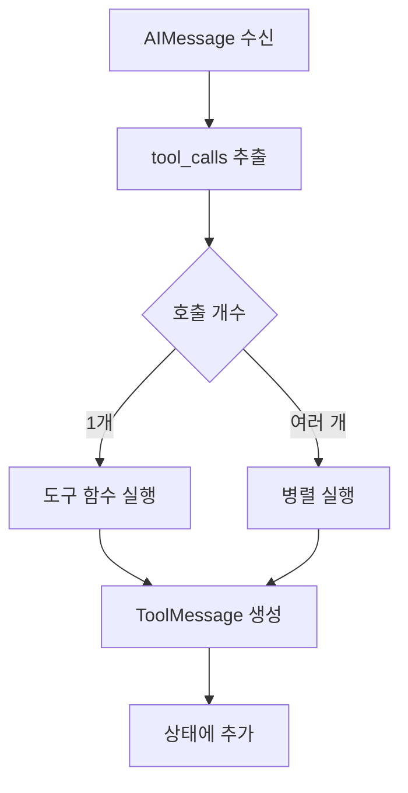
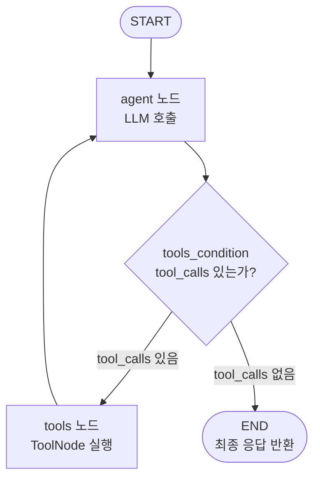
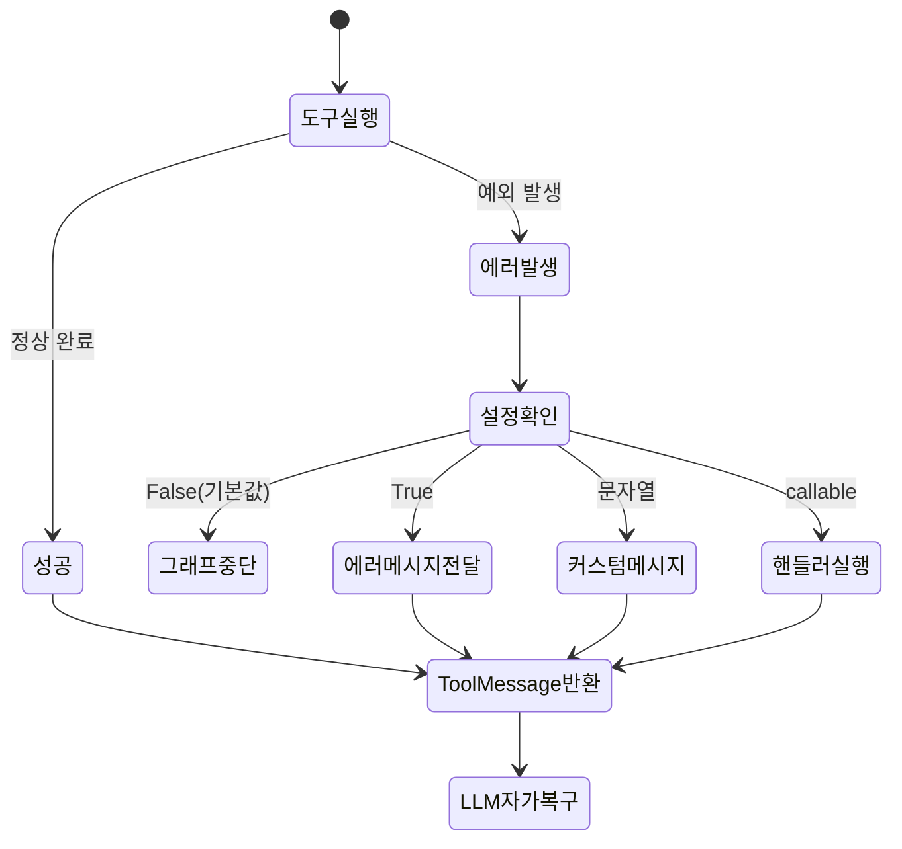
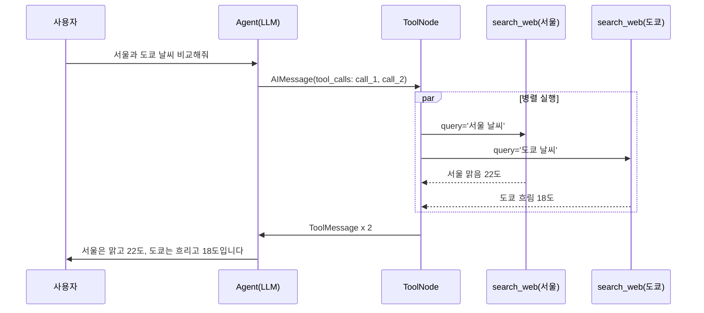
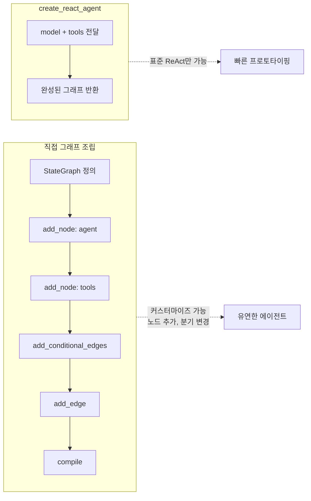

# 도구 호출 에이전트

> LangGraph의 ToolNode와 tools_condition을 활용하여 LLM이 도구를 자율적으로 호출하는 ReAct 에이전트를 구축합니다.

## 개요

이 섹션에서는 LangGraph의 프리빌트(prebuilt) 컴포넌트인 `ToolNode`와 `tools_condition`을 사용하여, LLM이 도구를 호출하고 그 결과를 관찰하며 다시 추론하는 **도구 호출 루프**를 구현합니다. [세션 13.3: 조건부 엣지와 라우팅](ch13/session_13_3.md)에서 배운 `add_conditional_edges`와 `should_continue` 패턴이 실제 도구 호출 에이전트에서 어떻게 쓰이는지 확인하게 됩니다.

**선수 지식**: 
- [세션 13.1](ch13/session_13_1.md)의 StateGraph, 노드, 엣지 개념
- [세션 13.2](ch13/session_13_2.md)의 그래프 구성과 invoke/stream 실행
- [세션 13.3](ch13/session_13_3.md)의 `add_conditional_edges`와 라우팅 함수
- [챕터 11](ch11/)의 도구(Tools)와 함수 호출 기본 개념

**학습 목표**:
- `ToolNode`의 역할과 동작 원리를 이해한다
- `tools_condition`으로 도구 호출 여부에 따른 라우팅을 구현한다
- LLM → 도구 호출 → 관찰 → 재추론의 ReAct 루프를 완성한다
- `handle_tool_errors`를 활용한 에러 처리 전략을 적용한다

## 왜 알아야 할까?

[세션 13.3](ch13/session_13_3.md)에서 `should_continue` 함수를 직접 작성하여 에이전트 루프를 만들었던 것, 기억나시죠? 매번 "마지막 메시지에 tool_calls가 있으면 도구 노드로, 없으면 END로"라는 동일한 패턴을 반복 작성하는 건 비효율적입니다.

LangGraph 팀도 이 점을 잘 알고 있었습니다. 그래서 **가장 흔한 패턴을 프리빌트 컴포넌트로 추출**했는데요, 그것이 바로 `ToolNode`와 `tools_condition`입니다. 이 두 컴포넌트를 사용하면:

- **도구 실행 로직**을 직접 구현할 필요 없이 `ToolNode`가 자동으로 처리합니다
- **라우팅 함수**를 매번 작성할 필요 없이 `tools_condition`이 대신합니다
- **병렬 도구 실행**, **에러 처리**, **의존성 주입**까지 기본 제공됩니다

실무에서 LangGraph 기반 에이전트를 구축할 때, 이 프리빌트 컴포넌트를 사용하지 않으면 바퀴를 재발명하는 것이나 다름없습니다. 프로덕션 레벨의 도구 호출 에이전트를 빠르고 안정적으로 만들기 위한 핵심 빌딩 블록이거든요.

## 핵심 개념

### 개념 1: ToolNode — 도구 실행의 자동화

> 💡 **비유**: 식당의 주방을 떠올려 보세요. 셰프(LLM)가 "토마토 소스 준비해줘", "파스타 삶아줘"라고 주문서를 던지면, 주방 보조(ToolNode)가 알아서 여러 조리를 **동시에** 진행하고 완성된 결과를 셰프에게 돌려줍니다. 셰프는 조리 과정의 세부사항을 몰라도 되고, 실패하면 보조가 "소스가 탔어요"라고 알려주기까지 합니다.

`ToolNode`는 `langgraph.prebuilt`에서 제공하는 **프리빌트 노드**로, LLM이 응답에 포함시킨 도구 호출(tool calls)을 자동으로 실행합니다. 핵심 동작은 다음과 같습니다:

1. 마지막 `AIMessage`에서 `tool_calls`를 추출합니다
2. 해당하는 도구 함수를 찾아 실행합니다
3. 결과를 `ToolMessage`로 감싸서 상태에 추가합니다
4. 도구 호출이 여러 개면 **병렬로** 실행합니다

> 📊 **그림 1**: ToolNode의 내부 처리 흐름




```python
from langgraph.prebuilt import ToolNode
from langchain_core.tools import tool

# 도구 정의
@tool
def search_web(query: str) -> str:
    """웹에서 정보를 검색합니다."""
    return f"'{query}'에 대한 검색 결과: LangGraph는 LangChain의 에이전트 프레임워크입니다."

@tool
def calculate(expression: str) -> str:
    """수학 계산을 수행합니다."""
    return str(eval(expression))  # 실습용 간단 구현

# 도구 리스트
tools = [search_web, calculate]

# ToolNode 생성 — 이것만으로 도구 실행 노드 완성!
tool_node = ToolNode(tools)
```

앞서 [세션 13.3](ch13/session_13_3.md)에서 도구를 실행하려면 노드 함수 안에서 직접 도구를 찾고 호출하는 코드를 작성해야 했습니다. `ToolNode`는 이 과정 전체를 캡슐화합니다.

### 개념 2: tools_condition — 분기의 표준화

> 💡 **비유**: 교차로의 신호등을 생각해 보세요. 운전자(LLM)가 "좌회전 깜빡이"(tool_calls)를 켜면 좌회전 차선(도구 노드)으로 보내고, 깜빡이를 켜지 않으면 직진(END)으로 보냅니다. `tools_condition`은 이 신호등 역할을 하는 **표준화된 라우팅 함수**입니다.

[세션 13.3](ch13/session_13_3.md)에서 작성했던 `should_continue` 함수를 떠올려 보세요:

```python
# 세션 13.3에서 직접 작성했던 라우팅 함수
def should_continue(state) -> Literal["tools", "__end__"]:
    last_message = state["messages"][-1]
    if last_message.tool_calls:
        return "tools"
    return "__end__"
```

`tools_condition`은 정확히 이 로직을 구현한 프리빌트 함수입니다:

```python
from langgraph.prebuilt import tools_condition

# 이 한 줄이 위의 should_continue 함수를 완벽히 대체합니다!
graph.add_conditional_edges("agent", tools_condition)
```

`tools_condition`의 반환값은 `Literal["tools", "__end__"]`입니다. 마지막 `AIMessage`에 `tool_calls`가 있으면 `"tools"`를, 없으면 `"__end__"`를 반환합니다. 별도의 `path_map`을 지정할 필요도 없죠.

### 개념 3: 도구 호출 루프 — ReAct 패턴의 완성

> 💡 **비유**: 탐정이 사건을 수사하는 과정과 같습니다. **추론**(범인은 왼손잡이일 거야) → **행동**(지문 데이터베이스 조회) → **관찰**(3명의 용의자 발견) → **재추론**(이 중 알리바이가 없는 사람은...) → **행동**(CCTV 확인)... 이 루프를 결론에 도달할 때까지 반복하는 거죠.

`ToolNode`와 `tools_condition`을 조합하면 ReAct(Reasoning + Acting) 패턴의 도구 호출 루프가 완성됩니다. 전체 구조는 다음과 같습니다:

> 📊 **그림 2**: ReAct 도구 호출 루프의 전체 흐름




```
[START] → [agent 노드: LLM 호출]
              ↓
        tools_condition 판단
         ↙          ↘
   tool_calls 있음    tool_calls 없음
        ↓                  ↓
  [tools 노드:          [END]
   ToolNode 실행]
        ↓
  [agent 노드로 복귀]
        ↓
   (루프 반복...)
```

이를 코드로 구현하면:

```python
from typing import Annotated, TypedDict
from langchain_openai import ChatOpenAI
from langchain_core.messages import BaseMessage
from langgraph.graph import StateGraph, START, END
from langgraph.graph.message import add_messages
from langgraph.prebuilt import ToolNode, tools_condition

# 1. 상태 정의
class AgentState(TypedDict):
    messages: Annotated[list[BaseMessage], add_messages]

# 2. LLM에 도구 바인딩
model = ChatOpenAI(model="gpt-4o", temperature=0)
model_with_tools = model.bind_tools(tools)

# 3. 에이전트 노드 — LLM 호출
def agent(state: AgentState) -> dict:
    """LLM을 호출하여 추론하거나 도구 호출을 결정합니다."""
    response = model_with_tools.invoke(state["messages"])
    return {"messages": [response]}

# 4. 그래프 조립
graph = StateGraph(AgentState)
graph.add_node("agent", agent)           # LLM 추론 노드
graph.add_node("tools", ToolNode(tools)) # 도구 실행 노드

graph.add_edge(START, "agent")           # 시작 → 에이전트
graph.add_conditional_edges(             # 에이전트 → 조건 분기
    "agent",
    tools_condition,                     # tool_calls 유무 판단
)
graph.add_edge("tools", "agent")         # 도구 결과 → 에이전트로 복귀

app = graph.compile()
```

핵심은 `graph.add_edge("tools", "agent")` 부분입니다. 도구 실행 후 다시 에이전트 노드로 돌아가기 때문에 **루프**가 형성됩니다. LLM이 더 이상 도구를 호출하지 않으면 `tools_condition`이 `"__end__"`를 반환하면서 루프가 종료됩니다.

### 개념 4: handle_tool_errors — 우아한 에러 처리

> 💡 **비유**: 온라인 쇼핑몰에서 결제 실패가 발생하면 어떻게 하나요? 에러 페이지를 보여주고 그냥 멈추는 사이트도 있지만, 좋은 사이트는 "카드 번호를 다시 확인해 주세요"라고 안내하죠. `handle_tool_errors`는 도구 실행 실패 시 에이전트가 **자가 복구**할 수 있도록 에러 정보를 LLM에게 전달하는 메커니즘입니다.

도구 실행 중 예외가 발생하면, 기본적으로 그래프 전체가 중단됩니다. 하지만 `handle_tool_errors`를 설정하면, 에러 메시지를 `ToolMessage`에 담아 LLM에게 돌려보내 **자가 수정**의 기회를 줍니다.

```python
# 방법 1: 기본 에러 처리 (True) — 에러 메시지를 그대로 전달
tool_node = ToolNode(tools, handle_tool_errors=True)

# 방법 2: 커스텀 에러 메시지 — 고정된 안내 메시지
tool_node = ToolNode(
    tools, 
    handle_tool_errors="도구 실행 중 오류가 발생했습니다. 입력값을 확인하고 다시 시도해 주세요."
)

# 방법 3: 커스텀 에러 핸들러 함수 — 에러 타입별 세밀한 처리
def my_error_handler(error: Exception) -> str:
    if isinstance(error, ValueError):
        return f"잘못된 입력값입니다: {error}. 올바른 형식으로 다시 시도해 주세요."
    elif isinstance(error, TimeoutError):
        return "도구 응답 시간이 초과되었습니다. 잠시 후 다시 시도해 주세요."
    return f"예상치 못한 오류: {error}"

tool_node = ToolNode(tools, handle_tool_errors=my_error_handler)

# 방법 4: 특정 예외만 캐치 — 나머지는 그래프 중단
tool_node = ToolNode(tools, handle_tool_errors=(ValueError, TypeError))
```

에러 처리 흐름을 정리하면:

| `handle_tool_errors` | 도구 에러 발생 시 동작 |
|---|---|
| `False` (기본값) | 예외 발생, 그래프 중단 |
| `True` | 에러 메시지를 ToolMessage로 LLM에 전달 |
| `"문자열"` | 지정된 문자열을 ToolMessage로 전달 |
| `callable` | 함수 실행 결과를 ToolMessage로 전달 |
| `(ExceptionType, ...)` | 지정된 예외만 캐치, 나머지는 중단 |

> 📊 **그림 3**: handle_tool_errors 설정에 따른 에러 처리 분기




> ⚠️ **흔한 오해**: `handle_tool_errors=True`로 설정하면 모든 에러가 무시된다고 생각하기 쉽습니다. 실제로는 에러가 **무시되는 것이 아니라 LLM에게 전달**되는 것입니다. LLM은 이 에러 메시지를 보고 입력을 수정하거나 다른 전략을 시도할 수 있습니다. 즉, 자가 복구(self-correction)를 위한 메커니즘이지 에러 무시가 아닙니다.

### 개념 5: 병렬 도구 실행

LLM이 하나의 응답에서 **여러 도구를 동시에 호출**하는 경우가 있습니다. 예를 들어 "서울 날씨와 도쿄 날씨를 동시에 알려줘"라고 하면, LLM은 `get_weather("서울")`과 `get_weather("도쿄")` 두 개의 tool_calls를 생성합니다.

`ToolNode`는 이런 병렬 호출을 자동으로 처리합니다:

```python
# LLM이 여러 도구를 동시에 호출하면
# AIMessage.tool_calls = [
#     {"name": "search_web", "args": {"query": "서울 날씨"}, "id": "call_1"},
#     {"name": "search_web", "args": {"query": "도쿄 날씨"}, "id": "call_2"},
# ]
#
# ToolNode가 두 호출을 병렬로 실행하고
# 각각에 대응하는 ToolMessage를 반환합니다
# → ToolMessage(content="서울 맑음", tool_call_id="call_1")
# → ToolMessage(content="도쿄 흐림", tool_call_id="call_2")
```

각 `ToolMessage`의 `tool_call_id`가 원래 호출의 `id`와 매칭되므로, LLM은 어떤 결과가 어떤 요청에 대한 것인지 정확히 알 수 있습니다.

> 📊 **그림 4**: 병렬 도구 호출의 메시지 흐름




## 실습: 직접 해보기

실제로 동작하는 도구 호출 에이전트를 처음부터 끝까지 만들어 봅시다. 날씨 조회, 수학 계산, 한영 번역 세 가지 도구를 갖춘 다목적 어시스턴트입니다.

```python
"""
LangGraph 도구 호출 에이전트 실습
- ToolNode와 tools_condition을 활용한 ReAct 에이전트
- 에러 처리와 병렬 도구 실행 포함
"""

import os
from typing import Annotated, TypedDict
from dotenv import load_dotenv

from langchain_openai import ChatOpenAI
from langchain_core.messages import BaseMessage, HumanMessage
from langchain_core.tools import tool
from langgraph.graph import StateGraph, START, END
from langgraph.graph.message import add_messages
from langgraph.prebuilt import ToolNode, tools_condition

load_dotenv()

# ── 1. 도구 정의 ──────────────────────────────────────────

@tool
def get_weather(city: str) -> str:
    """도시의 현재 날씨 정보를 조회합니다."""
    # 실습용 목업 데이터
    weather_data = {
        "서울": "맑음, 22°C, 습도 45%",
        "도쿄": "흐림, 18°C, 습도 72%",
        "뉴욕": "비, 15°C, 습도 88%",
        "런던": "안개, 12°C, 습도 90%",
    }
    if city in weather_data:
        return f"{city}의 현재 날씨: {weather_data[city]}"
    raise ValueError(f"'{city}'는 지원하지 않는 도시입니다. 지원 도시: {list(weather_data.keys())}")


@tool
def calculator(expression: str) -> str:
    """수학 표현식을 계산합니다. 예: '2 + 3 * 4'"""
    # 안전한 계산을 위해 허용된 문자만 통과
    allowed_chars = set("0123456789+-*/.() ")
    if not all(c in allowed_chars for c in expression):
        raise ValueError(f"허용되지 않는 문자가 포함되어 있습니다: {expression}")
    try:
        result = eval(expression)  # 실습용 간단 구현
        return f"계산 결과: {expression} = {result}"
    except Exception as e:
        raise ValueError(f"계산 오류: {e}")


@tool
def translate_ko_en(text: str) -> str:
    """한국어 텍스트를 영어로 번역합니다."""
    # 실습용 목업 번역
    translations = {
        "안녕하세요": "Hello",
        "감사합니다": "Thank you",
        "좋은 아침입니다": "Good morning",
    }
    if text in translations:
        return f"번역 결과: '{text}' → '{translations[text]}'"
    return f"번역 결과: '{text}' → '[Translation of: {text}]'"


# ── 2. 도구 리스트와 LLM 설정 ──────────────────────────────

tools = [get_weather, calculator, translate_ko_en]

model = ChatOpenAI(model="gpt-4o", temperature=0)
model_with_tools = model.bind_tools(tools)  # LLM에 도구 목록 바인딩


# ── 3. 상태 스키마 정의 ────────────────────────────────────

class AgentState(TypedDict):
    messages: Annotated[list[BaseMessage], add_messages]


# ── 4. 에이전트 노드 ──────────────────────────────────────

def agent_node(state: AgentState) -> dict:
    """LLM을 호출하여 추론하거나 도구 사용을 결정합니다."""
    response = model_with_tools.invoke(state["messages"])
    return {"messages": [response]}


# ── 5. 에러 핸들러 정의 ────────────────────────────────────

def handle_tool_error(error: Exception) -> str:
    """도구 에러를 LLM이 이해할 수 있는 메시지로 변환합니다."""
    if isinstance(error, ValueError):
        return f"입력값 오류: {error}. 올바른 값으로 다시 시도해 주세요."
    return f"도구 실행 중 오류가 발생했습니다: {error}. 다른 방법을 시도해 주세요."


# ── 6. 그래프 조립 ─────────────────────────────────────────

graph = StateGraph(AgentState)

# 노드 등록
graph.add_node("agent", agent_node)
graph.add_node("tools", ToolNode(tools, handle_tool_errors=handle_tool_error))

# 엣지 연결
graph.add_edge(START, "agent")                # 시작 → 에이전트
graph.add_conditional_edges("agent", tools_condition)  # 에이전트 → 조건 분기
graph.add_edge("tools", "agent")              # 도구 결과 → 에이전트 복귀

# 컴파일
app = graph.compile()


# ── 7. 실행 및 테스트 ──────────────────────────────────────

def run_agent(query: str) -> None:
    """에이전트를 실행하고 전체 과정을 출력합니다."""
    print(f"\n{'='*60}")
    print(f"질문: {query}")
    print(f"{'='*60}")

    result = app.invoke({
        "messages": [HumanMessage(content=query)]
    })

    # 전체 메시지 흐름 출력
    for msg in result["messages"]:
        role = msg.__class__.__name__
        if role == "HumanMessage":
            print(f"\n👤 사용자: {msg.content}")
        elif role == "AIMessage":
            if msg.tool_calls:
                print(f"\n🤖 AI (도구 호출):")
                for tc in msg.tool_calls:
                    print(f"   → {tc['name']}({tc['args']})")
            else:
                print(f"\n🤖 AI (최종 응답): {msg.content}")
        elif role == "ToolMessage":
            print(f"\n🔧 도구 결과: {msg.content}")


# 테스트 1: 단일 도구 호출
run_agent("서울 날씨가 어때?")

# 테스트 2: 다중 도구 호출 (병렬 실행)
run_agent("서울과 도쿄 날씨를 비교해줘")

# 테스트 3: 여러 종류의 도구 조합
run_agent("15 * 24 + 37을 계산하고, '감사합니다'를 영어로 번역해줘")

# 테스트 4: 에러 처리 — 지원하지 않는 도시
run_agent("파리 날씨 알려줘")
```

**실행 결과** (테스트 4 — 에러 처리):

```
============================================================
질문: 파리 날씨 알려줘
============================================================

👤 사용자: 파리 날씨 알려줘

🤖 AI (도구 호출):
   → get_weather({'city': '파리'})

🔧 도구 결과: 입력값 오류: '파리'는 지원하지 않는 도시입니다. 
   지원 도시: ['서울', '도쿄', '뉴욕', '런던']. 올바른 값으로 다시 시도해 주세요.

🤖 AI (최종 응답): 죄송합니다. 현재 파리의 날씨 정보는 제공하지 않고 있습니다. 
   지원하는 도시는 서울, 도쿄, 뉴욕, 런던입니다. 이 중에서 확인하고 싶은 도시가 있으신가요?
```

에러가 발생해도 그래프가 멈추지 않고, LLM이 에러 메시지를 읽고 사용자에게 적절히 안내하는 모습을 확인할 수 있습니다. 이것이 `handle_tool_errors`의 핵심 가치입니다.

### 스트리밍으로 실행하기

실시간으로 에이전트의 사고 과정을 관찰하려면 `stream`을 사용합니다:

```python
# 스트리밍 실행 — 각 노드의 실행 결과를 실시간으로 관찰
for event in app.stream(
    {"messages": [HumanMessage(content="서울 날씨와 15+27 계산 결과를 알려줘")]},
    stream_mode="updates",  # 노드별 상태 업데이트를 스트리밍
):
    for node_name, state_update in event.items():
        print(f"\n--- {node_name} 노드 실행 ---")
        last_msg = state_update["messages"][-1]
        print(f"  타입: {last_msg.__class__.__name__}")
        if hasattr(last_msg, "tool_calls") and last_msg.tool_calls:
            for tc in last_msg.tool_calls:
                print(f"  도구 호출: {tc['name']}({tc['args']})")
        else:
            print(f"  내용: {last_msg.content[:100]}...")
```

## 더 깊이 알아보기

### ToolNode의 탄생 배경

LangGraph의 `ToolNode`는 사실 **수많은 개발자의 고통에서 태어난** 컴포넌트입니다. LangGraph 초기(2024년 초)에는 도구를 실행하는 노드를 모두 직접 작성해야 했습니다. 그 코드는 대략 이런 모습이었죠:

```python
# 초기에 개발자들이 매번 작성해야 했던 도구 실행 코드
def tool_executor(state):
    last_message = state["messages"][-1]
    results = []
    for tool_call in last_message.tool_calls:
        # 도구 이름으로 함수 찾기
        tool_fn = next(t for t in tools if t.name == tool_call["name"])
        # 실행하고 결과를 ToolMessage로 감싸기
        result = tool_fn.invoke(tool_call["args"])
        results.append(ToolMessage(content=str(result), tool_call_id=tool_call["id"]))
    return {"messages": results}
```

LangGraph GitHub 이슈와 포럼에서 "이 보일러플레이트를 줄여달라"는 요청이 쏟아지면서, Harrison Chase와 LangChain 팀은 `langgraph.prebuilt` 패키지를 만들어 `ToolNode`, `tools_condition`, 그리고 `create_react_agent`라는 프리빌트 컴포넌트를 제공하기 시작했습니다.

### ReAct 패턴의 역사

도구 호출 에이전트의 근간인 **ReAct(Reasoning + Acting)** 패턴은 2022년 프린스턴 대학의 Shunyu Yao 등이 발표한 논문 "ReAct: Synergizing Reasoning and Acting in Language Models"에서 처음 제안되었습니다. 이 논문의 핵심 통찰은 단순합니다 — LLM이 **생각(Thought)만 하는 것보다, 생각한 후 행동(Action)하고 그 결과를 관찰(Observation)하는 루프**를 반복하면 훨씬 더 정확하고 신뢰할 수 있다는 것이었죠.

LangChain 초기의 `AgentExecutor`가 이 ReAct 패턴을 구현했지만, 복잡한 워크플로우에서는 한계가 있었습니다. LangGraph는 이 패턴을 **그래프 구조**로 일반화하여, 단순한 ReAct 루프를 넘어선 멀티 에이전트, 병렬 분기, 인간 개입 등의 고급 패턴까지 지원하게 되었습니다.


### create_react_agent — 더 간편한 방법

사실 `ToolNode`와 `tools_condition`으로 직접 그래프를 조립하는 것도 충분히 간편하지만, LangGraph는 한 발 더 나아가 `create_react_agent`라는 **원라인 팩토리 함수**도 제공합니다:

```python
from langgraph.prebuilt import create_react_agent

# 위에서 작성한 전체 그래프 구성이 이 한 줄로 대체됩니다!
app = create_react_agent(model, tools)

result = app.invoke({
    "messages": [HumanMessage(content="서울 날씨 알려줘")]
})
```

그렇다면 왜 `ToolNode`를 직접 사용하는 법을 배워야 할까요? `create_react_agent`는 **표준적인 ReAct 루프만** 만들 수 있습니다. 커스텀 노드 추가, 특별한 분기 로직, 상태에 추가 필드 넣기 등 **그래프를 커스터마이즈**해야 할 때는 `ToolNode`와 `tools_condition`을 직접 사용해야 합니다. 빌딩 블록을 이해해야 레고를 자유자재로 조립할 수 있는 것과 같은 이치입니다.

> 📊 **그림 5**: create_react_agent vs 직접 그래프 조립 비교




## 흔한 오해와 팁

> ⚠️ **흔한 오해**: `tools_condition`의 라우팅 대상 노드 이름이 반드시 `"tools"`여야 한다고 생각하는 분이 많습니다. 실제로 `tools_condition`은 `"tools"`라는 문자열을 반환합니다. 따라서 도구 실행 노드를 `graph.add_node("tools", ...)`로 등록해야 합니다. 만약 다른 이름(예: `"tool_executor"`)을 사용하고 싶다면, `tools_condition` 대신 직접 라우팅 함수를 작성하거나 별도의 매핑이 필요합니다.

> 💡 **알고 계셨나요?**: `ToolNode`는 LLM이 하나의 응답에서 여러 도구를 호출할 때 이를 **병렬로** 실행합니다. 예를 들어 "서울 날씨와 도쿄 날씨를 알려줘"라는 질문에 LLM이 두 번의 `get_weather` 호출을 동시에 요청하면, ToolNode가 두 호출을 동시에 처리하여 응답 시간을 크게 단축합니다. 이는 직접 구현했다면 `asyncio.gather` 같은 비동기 코드를 작성해야 하는 부분인데, ToolNode가 알아서 해주는 거죠.

> 🔥 **실무 팁**: 프로덕션에서는 **항상** `handle_tool_errors`를 설정하세요. 외부 API를 호출하는 도구는 언제든 실패할 수 있고, 에러 처리 없이는 에이전트 전체가 멈춥니다. 커스텀 핸들러 함수를 사용하면 에러 타입별로 LLM에게 맞춤형 힌트를 줄 수 있어 자가 복구 성공률이 크게 올라갑니다. 또한 무한 루프를 방지하기 위해 `recursion_limit` 파라미터(compile 시 설정)를 적절히 설정하는 것도 잊지 마세요.

> 🔥 **실무 팁**: `model.bind_tools(tools)`를 빼먹으면 LLM은 도구의 존재를 모릅니다. 가장 흔한 실수 중 하나가 도구를 `ToolNode`에만 전달하고 LLM에는 바인딩하지 않는 것입니다. LLM이 도구를 "알아야"(bind_tools) 호출을 결정할 수 있고, ToolNode가 그 호출을 "실행"합니다. 이 두 가지는 반드시 짝으로 설정해야 합니다.

## 핵심 정리

| 개념 | 설명 |
|------|------|
| `ToolNode` | 프리빌트 노드. AIMessage의 tool_calls를 자동으로 실행하고 ToolMessage를 반환 |
| `tools_condition` | 프리빌트 라우팅 함수. tool_calls 유무에 따라 `"tools"` 또는 `"__end__"` 반환 |
| 도구 호출 루프 | agent → tools_condition → tools → agent 의 반복. LLM이 도구 불필요 판단 시 종료 |
| `handle_tool_errors` | 도구 에러를 ToolMessage로 변환하여 LLM에 전달. `True`, 문자열, 함수, 예외 튜플 지원 |
| 병렬 도구 실행 | LLM이 여러 도구를 동시에 호출하면 ToolNode가 자동으로 병렬 실행 |
| `bind_tools()` | LLM에 사용 가능한 도구 목록을 알려주는 메서드. ToolNode와 반드시 짝으로 사용 |
| `create_react_agent` | ToolNode + tools_condition 그래프를 한 줄로 생성하는 편의 함수 |

## 다음 섹션 미리보기

이번 세션에서 단일 에이전트가 도구를 호출하는 기본 ReAct 루프를 완성했습니다. 하지만 실제 프로덕션 환경에서는 에이전트의 실행을 **중간에 멈추고 사람의 확인을 받아야** 하는 경우가 많습니다 — 예를 들어 결제, 데이터 삭제, 이메일 발송 같은 민감한 작업이죠. 다음 세션에서는 LangGraph의 **체크포인트(Checkpoint)와 Human-in-the-Loop** 패턴을 학습하여, 에이전트가 특정 단계에서 사람의 승인을 기다렸다가 재개하는 워크플로우를 구현합니다.

## 참고 자료

- [LangGraph Quickstart — 공식 문서](https://docs.langchain.com/oss/python/langgraph/quickstart) - ToolNode와 tools_condition을 사용한 기본 에이전트 구축 가이드
- [LangGraph ToolNode 소스코드 (GitHub)](https://github.com/langchain-ai/langgraph/blob/main/libs/prebuilt/langgraph/prebuilt/tool_node.py) - ToolNode와 tools_condition의 실제 구현을 확인할 수 있는 소스 코드
- [LangGraph ReAct Agent 템플릿 (GitHub)](https://github.com/langchain-ai/react-agent) - LangGraph 공식 ReAct 에이전트 프로젝트 템플릿
- [Handling Tool Calling Errors in LangGraph — Medium](https://medium.com/@gopiariv/handling-tool-calling-errors-in-langgraph-a-guide-with-examples-f391b7acb15e) - handle_tool_errors 옵션별 상세 예제와 실무 적용 가이드
- [Building ReAct Agents with LangGraph — Dylan Castillo](https://dylancastillo.co/posts/react-agent-langgraph.html) - ReAct 에이전트를 처음부터 직접 구현하며 이해하는 튜토리얼

---
### 🔗 Related Sessions
- [invoke](../01-langchain-소개와-개발-환경-설정/04-첫-번째-langchain-애플리케이션.md) (prerequisite)
- [stream](../01-langchain-소개와-개발-환경-설정/04-첫-번째-langchain-애플리케이션.md) (prerequisite)
- [tool](../11-도구tools와-함수-호출/01-도구-정의와-바인딩.md) (prerequisite)
- [stategraph](../01-langchain-소개와-개발-환경-설정/05-langchain-생태계-탐색.md) (prerequisite)
- [node](../01-langchain-소개와-개발-환경-설정/05-langchain-생태계-탐색.md) (prerequisite)
- [edge](../01-langchain-소개와-개발-환경-설정/05-langchain-생태계-탐색.md) (prerequisite)
- [compile](../13-langgraph-기초/02-첫-번째-langgraph-에이전트.md) (prerequisite)
- [add_conditional_edges](../13-langgraph-기초/03-조건부-엣지와-라우팅.md) (prerequisite)
- [should_continue](../13-langgraph-기초/03-조건부-엣지와-라우팅.md) (prerequisite)
- [conditional_edge](../13-langgraph-기초/01-langgraph-소개와-핵심-개념.md) (prerequisite)
- [messages_state](../13-langgraph-기초/01-langgraph-소개와-핵심-개념.md) (prerequisite)
