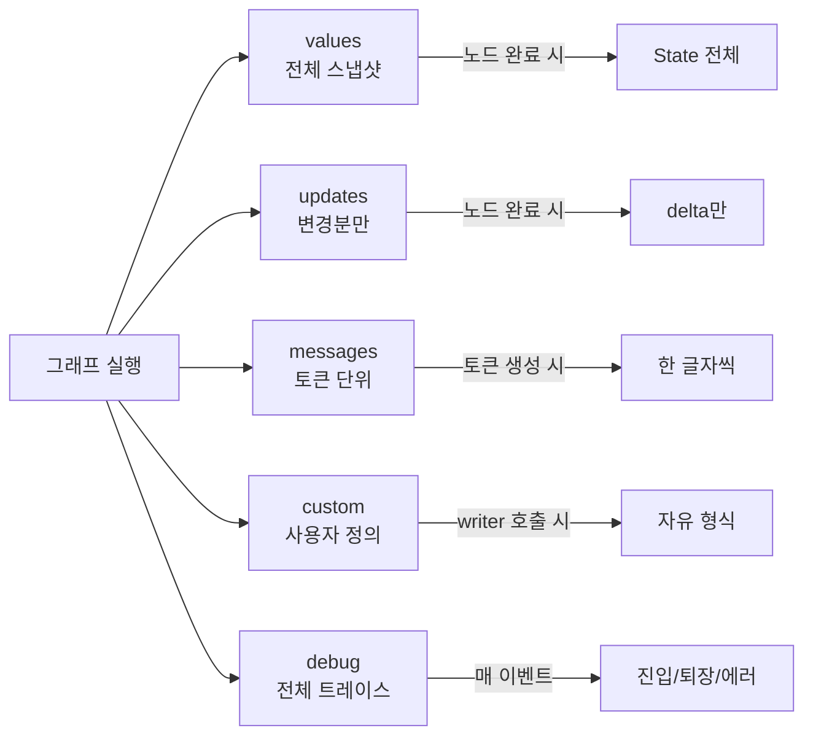
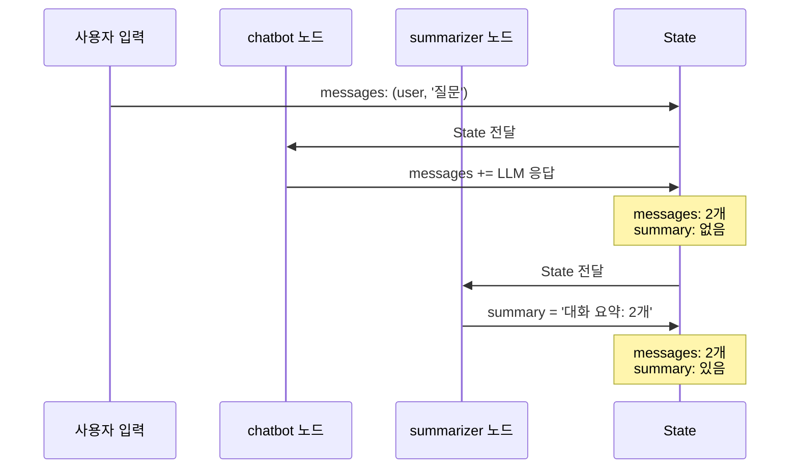
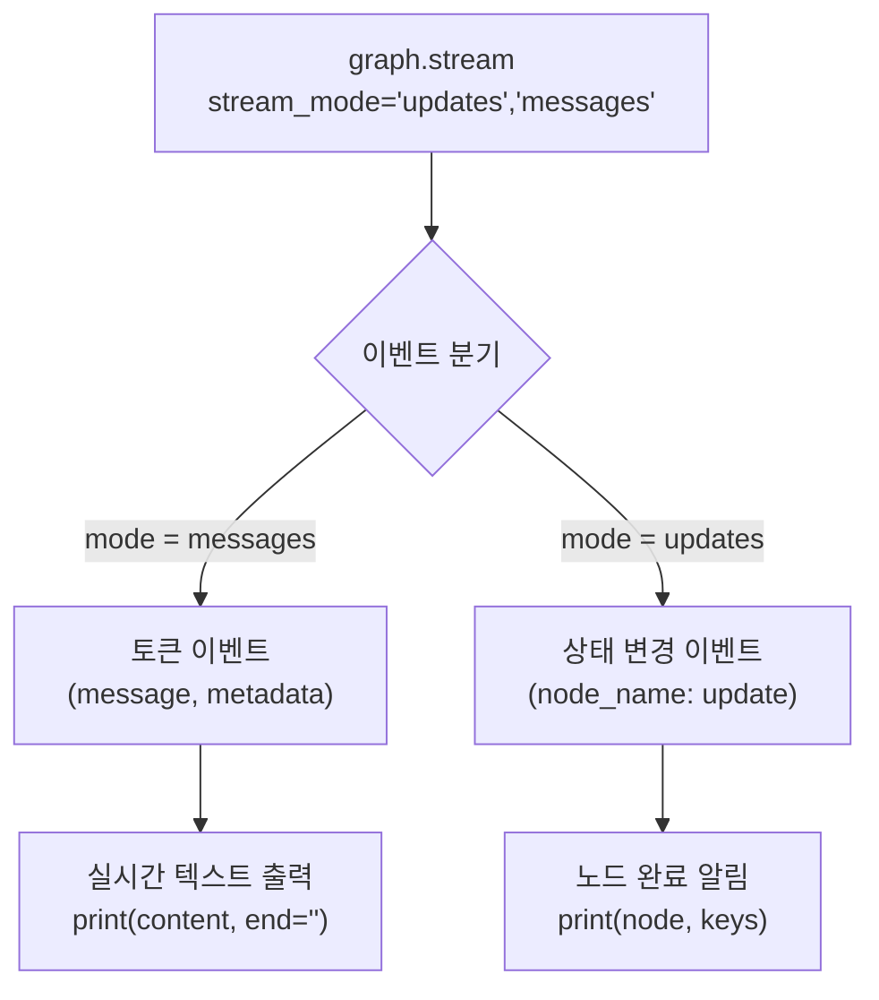
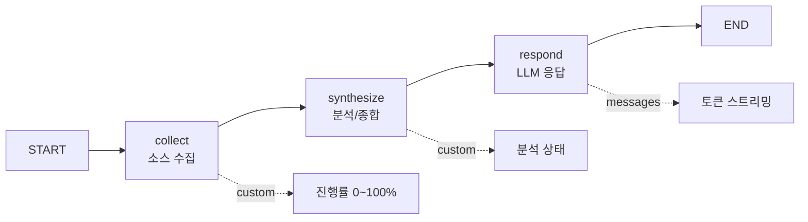
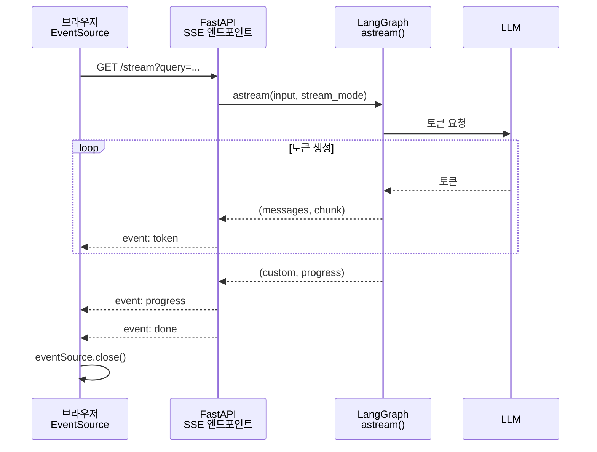

# 스트리밍과 실시간 업데이트

> LangGraph 그래프 실행의 실시간 출력을 제어하는 5가지 스트리밍 모드와 프론트엔드 연동 패턴을 마스터합니다.

## 개요

이 섹션에서는 LangGraph의 스트리밍 시스템을 심층적으로 학습합니다. 그래프가 실행되는 동안 사용자에게 **실시간으로 피드백을 제공**하는 것은 프로덕션 AI 애플리케이션의 핵심 요소인데요, 단순히 "로딩 중..."을 보여주는 것과 LLM이 한 글자씩 답변을 써 내려가는 것을 보여주는 것 — 이 차이가 사용자 경험을 완전히 바꿔놓습니다.

**선수 지식**: [14.1 Human-in-the-Loop 패턴](14-1.md)에서 배운 `interrupt()`와 체크포인터 개념, [14.3 서브그래프와 모듈화](14-3.md)에서 다룬 서브그래프 스트리밍의 네임스페이스 격리, [14.4 병렬 실행과 맵-리듀스](14-4.md)에서 학습한 `Send` API와 팬아웃/팬인 패턴

**학습 목표**:
- `stream_mode`의 5가지 옵션(`values`, `updates`, `messages`, `custom`, `debug`)을 이해하고 상황에 맞게 선택할 수 있다
- 노드별 스트리밍과 토큰 단위 스트리밍을 구현할 수 있다
- `get_stream_writer()`를 활용하여 커스텀 진행 상황을 스트리밍할 수 있다
- CLI 환경에서 멀티 모드 스트리밍을 조합하여 실시간 피드백을 구현할 수 있다
- (심화) FastAPI + SSE를 활용하여 웹 프론트엔드에 실시간 스트리밍을 연동할 수 있다

## 왜 알아야 할까?

ChatGPT를 사용해보셨다면, 답변이 한 글자씩 타이핑되듯 나타나는 경험을 아실 거예요. 이게 바로 **토큰 스트리밍**입니다. 만약 ChatGPT가 전체 답변이 완성될 때까지 빈 화면만 보여줬다면 어땠을까요? GPT-4급 모델은 긴 답변에 30초 이상 걸리기도 하는데, 그 시간 동안 아무런 피드백 없이 기다리는 건 대부분의 사용자가 견딜 수 없습니다.

LangGraph 그래프는 여러 노드를 거치며 실행되기 때문에 상황이 더 복잡해집니다. 단순히 LLM 토큰만 스트리밍하는 게 아니라, **어떤 노드가 실행 중인지**, **상태가 어떻게 변하고 있는지**, **도구 호출은 잘 되고 있는지**를 실시간으로 보여줘야 하거든요. 앞서 [14.4 병렬 실행과 맵-리듀스](14-4.md)에서 배운 `Send` API로 병렬 노드가 동시에 돌아가는 상황이라면? 각 노드의 진행 상황을 개별적으로 추적해서 보여줘야 합니다.

이것이 LangGraph가 **5가지 스트리밍 모드**를 제공하는 이유입니다 — 상황에 따라 필요한 수준의 정보를 실시간으로 전달할 수 있도록요.

## 핵심 개념

### 개념 1: stream_mode의 5가지 옵션 — 라디오 채널 비유

> 💡 **비유**: 스트리밍 모드를 **라디오 주파수**에 비유해볼까요? 같은 방송국에서 여러 채널을 운영하듯이, LangGraph 그래프는 실행 중에 여러 "채널"의 정보를 동시에 내보냅니다. `stream_mode`는 **어떤 채널을 수신할지** 선택하는 다이얼이에요. 뉴스 채널(updates)만 들을 수도 있고, 실시간 중계 채널(messages)을 들을 수도 있고, 여러 채널을 동시에 수신할 수도 있습니다.

LangGraph의 `stream()`과 `astream()` 메서드는 `stream_mode` 파라미터를 통해 **어떤 종류의 데이터를 스트리밍할지** 제어합니다. 총 5가지 모드가 있는데, 각각의 역할이 명확히 다릅니다.

> 📊 **그림 1**: stream_mode 5가지 옵션 — 라디오 채널 비유




```python
from typing import TypedDict, Annotated
from langchain_openai import ChatOpenAI
from langgraph.graph import StateGraph, START, END
from langgraph.checkpoint.memory import MemorySaver
import operator

# 상태 정의
class State(TypedDict):
    messages: Annotated[list, operator.add]
    summary: str

# 간단한 그래프 구성
llm = ChatOpenAI(model="gpt-4o", temperature=0)

def chatbot(state: State) -> dict:
    response = llm.invoke(state["messages"])
    return {"messages": [response]}

def summarizer(state: State) -> dict:
    # 마지막 메시지를 요약
    return {"summary": f"대화 요약: {len(state['messages'])}개 메시지"}

builder = StateGraph(State)
builder.add_node("chatbot", chatbot)
builder.add_node("summarizer", summarizer)
builder.add_edge(START, "chatbot")
builder.add_edge("chatbot", "summarizer")
builder.add_edge("summarizer", END)

graph = builder.compile(checkpointer=MemorySaver())
```

이제 이 그래프를 5가지 모드로 스트리밍해보겠습니다.

> 📊 **그림 2**: 실습 그래프의 실행 흐름과 상태 변화




**1) `values` 모드 — 전체 스냅샷**

각 노드 실행이 끝날 때마다 **전체 상태(State)의 스냅샷**을 반환합니다. 사진첩을 넘기듯이 "이 시점의 전체 모습"을 보여주는 방식이에요.

```python
config = {"configurable": {"thread_id": "1"}}
input_data = {"messages": [("user", "LangGraph 스트리밍이 뭔가요?")]}

# values 모드: 각 노드 완료 시 전체 상태 반환
for chunk in graph.stream(input_data, config, stream_mode="values"):
    print(f"전체 상태 키: {list(chunk.keys())}")
    print(f"메시지 수: {len(chunk.get('messages', []))}")
    print(f"요약: {chunk.get('summary', '아직 없음')}")
    print("---")

# 출력 예시:
# 전체 상태 키: ['messages', 'summary']
# 메시지 수: 1
# 요약: 아직 없음
# ---
# 전체 상태 키: ['messages', 'summary']
# 메시지 수: 2
# 요약: 아직 없음
# ---
# 전체 상태 키: ['messages', 'summary']
# 메시지 수: 2
# 요약: 대화 요약: 2개 메시지
# ---
```

**2) `updates` 모드 — 변경분만 (기본값)**

각 노드가 **자신이 변경한 부분만** 반환합니다. 뉴스 속보처럼 "새로 바뀐 것"만 알려주는 방식이죠.

```python
# updates 모드: 각 노드가 반환한 변경분만
for chunk in graph.stream(input_data, config, stream_mode="updates"):
    # chunk는 {노드이름: 반환값} 형태
    for node_name, update in chunk.items():
        print(f"[{node_name}] 변경: {list(update.keys())}")
    print("---")

# 출력 예시:
# [chatbot] 변경: ['messages']
# ---
# [summarizer] 변경: ['summary']
# ---
```

**3) `messages` 모드 — LLM 토큰 스트리밍**

LLM이 생성하는 **토큰을 하나씩** 실시간으로 반환합니다. ChatGPT처럼 글자가 하나씩 나타나는 효과를 만들 때 사용하는 핵심 모드입니다.

```python
# messages 모드: LLM 토큰 단위 스트리밍
for message, metadata in graph.stream(
    input_data, config, stream_mode="messages"
):
    # metadata에서 어떤 노드의 출력인지 확인 가능
    node = metadata.get("langgraph_node", "unknown")
    if hasattr(message, "content") and message.content:
        print(f"[{node}] {message.content}", end="", flush=True)

# 출력 예시 (토큰이 하나씩):
# [chatbot] Lang[chatbot] Graph[chatbot] 의[chatbot]  스트리밍[chatbot] 은...
```

**4) `custom` 모드 — 사용자 정의 데이터**

노드나 도구에서 **직접 정의한 데이터**를 스트리밍합니다. 진행률 표시, 중간 결과 알림 등 자유로운 형식의 데이터를 보낼 수 있어요.

```python
from langgraph.config import get_stream_writer

def research_node(state: State) -> dict:
    writer = get_stream_writer()  # 스트림 라이터 획득

    # 커스텀 진행 상황 전송
    writer({"type": "progress", "step": "검색 시작", "percent": 0})
    # ... 검색 로직 ...
    writer({"type": "progress", "step": "문서 3건 발견", "percent": 50})
    # ... 분석 로직 ...
    writer({"type": "progress", "step": "분석 완료", "percent": 100})

    return {"messages": [("assistant", "검색 결과입니다.")]}

# custom 모드로 수신
for chunk in graph.stream(input_data, config, stream_mode="custom"):
    print(f"커스텀 이벤트: {chunk}")

# 출력 예시:
# 커스텀 이벤트: {'type': 'progress', 'step': '검색 시작', 'percent': 0}
# 커스텀 이벤트: {'type': 'progress', 'step': '문서 3건 발견', 'percent': 50}
# 커스텀 이벤트: {'type': 'progress', 'step': '분석 완료', 'percent': 100}
```

**5) `debug` 모드 — 상세 디버그 트레이스**

노드 진입/퇴장, 실행 전후 상태, 도구 입출력, 에러 정보 등 **내부 실행의 모든 세부 정보**를 스트리밍합니다. 개발 중 디버깅에 매우 유용합니다.

```python
# debug 모드: 상세 실행 추적
for event in graph.stream(input_data, config, stream_mode="debug"):
    print(f"이벤트 타입: {event['type']}")
    if event["type"] == "task":
        print(f"  노드: {event['payload']['name']}")

# 출력 예시:
# 이벤트 타입: checkpoint
# 이벤트 타입: task
#   노드: chatbot
# 이벤트 타입: task_result
# 이벤트 타입: checkpoint
# ...
```

### 개념 2: 멀티 모드 스트리밍 — 여러 채널 동시 수신

> 💡 **비유**: TV를 보면서 자막과 실시간 채팅을 동시에 보는 것과 같습니다. 영상(messages), 자막(updates), 실시간 채팅(custom)을 한 화면에서 동시에 볼 수 있듯이, LangGraph도 여러 스트리밍 모드를 동시에 활용할 수 있습니다.

`stream_mode`에 **리스트**를 전달하면 여러 모드의 이벤트를 인터리빙(interleaving)하여 받을 수 있습니다. 이때 각 이벤트는 `(모드이름, 데이터)` 튜플로 반환됩니다.

```python
# 멀티 모드: updates + messages를 동시에 수신
for mode, chunk in graph.stream(
    input_data, config,
    stream_mode=["updates", "messages"]  # 리스트로 전달
):
    if mode == "updates":
        for node_name, update in chunk.items():
            print(f"[상태 변경] {node_name}: {list(update.keys())}")
    elif mode == "messages":
        message, metadata = chunk
        if hasattr(message, "content") and message.content:
            print(f"[토큰] {message.content}", end="", flush=True)

# 출력 예시:
# [토큰] Lang[토큰] Graph[토큰] 의[토큰]  스트리밍...
# [상태 변경] chatbot: ['messages']
# [상태 변경] summarizer: ['summary']
```

이 패턴은 **토큰 스트리밍과 상태 업데이트를 동시에 처리**할 때 매우 유용합니다.

> 📊 **그림 3**: 멀티 모드 스트리밍 — 두 채널 동시 수신




### 개념 3: 비동기 스트리밍과 astream

> 💡 **비유**: 동기 스트리밍이 한 줄로 서서 기다리는 은행 창구라면, 비동기 스트리밍은 번호표를 뽑고 자유롭게 다른 일을 할 수 있는 시스템이에요. 특히 웹 서버처럼 여러 요청을 동시에 처리해야 하는 환경에서는 비동기가 필수입니다.

프로덕션 환경에서는 대부분 `astream()`을 사용합니다. 비동기 프레임워크와 자연스럽게 통합되거든요. CLI 스크립트에서도 `asyncio.run()`으로 간단하게 실행할 수 있습니다.

```python
import asyncio

async def stream_graph():
    config = {"configurable": {"thread_id": "async-1"}}
    input_data = {"messages": [("user", "비동기 스트리밍 예제를 보여주세요")]}

    # astream: 비동기 스트리밍
    async for chunk in graph.astream(
        input_data, config, stream_mode="messages"
    ):
        message, metadata = chunk
        if hasattr(message, "content") and message.content:
            print(message.content, end="", flush=True)

    print()  # 줄바꿈

# 실행
asyncio.run(stream_graph())
```

### 개념 4: 노드별 스트리밍 필터링 — messages 모드의 메타데이터 활용

그래프에 LLM을 호출하는 노드가 여러 개 있을 때, **특정 노드의 토큰만** 선별적으로 스트리밍하고 싶을 수 있습니다. `messages` 모드에서 제공하는 `metadata`의 `langgraph_node` 필드를 사용하면 됩니다.

```python
from typing import TypedDict, Annotated
from langchain_openai import ChatOpenAI
from langgraph.graph import StateGraph, START, END
from langgraph.checkpoint.memory import MemorySaver
import operator

class AgentState(TypedDict):
    messages: Annotated[list, operator.add]
    draft: str

llm = ChatOpenAI(model="gpt-4o", temperature=0)

def planner(state: AgentState) -> dict:
    """계획 수립 노드 — 내부용이므로 토큰 스트리밍 불필요"""
    response = llm.invoke([
        ("system", "간결하게 계획을 세워주세요."),
        *state["messages"]
    ])
    return {"draft": response.content}

def writer(state: AgentState) -> dict:
    """작성 노드 — 사용자에게 실시간으로 보여줄 응답"""
    response = llm.invoke([
        ("system", f"다음 계획을 바탕으로 답변하세요: {state['draft']}"),
        *state["messages"]
    ])
    return {"messages": [response]}

builder = StateGraph(AgentState)
builder.add_node("planner", planner)
builder.add_node("writer", writer)
builder.add_edge(START, "planner")
builder.add_edge("planner", "writer")
builder.add_edge("writer", END)

graph = builder.compile(checkpointer=MemorySaver())

# writer 노드의 토큰만 스트리밍
config = {"configurable": {"thread_id": "filter-1"}}
input_data = {"messages": [("user", "Python의 장점을 설명해주세요")]}

for message, metadata in graph.stream(
    input_data, config, stream_mode="messages"
):
    # planner 노드는 무시, writer 노드 토큰만 출력
    if metadata["langgraph_node"] == "writer":
        if hasattr(message, "content") and message.content:
            print(message.content, end="", flush=True)

print()

# 결과: writer 노드의 응답만 실시간으로 표시됩니다.
# planner 노드가 LLM을 호출하더라도 해당 토큰은 필터링됩니다.
```

### 개념 5: get_stream_writer()를 활용한 커스텀 스트리밍

> 💡 **비유**: 일반 스트리밍 모드가 **자동 CCTV**라면, `get_stream_writer()`는 **직접 촬영하는 카메라**예요. CCTV는 정해진 각도로 자동 녹화하지만, 직접 카메라를 들면 원하는 것을 원하는 타이밍에 찍을 수 있죠. 도구 실행 진행률, 중간 분석 결과, 사용자 정의 알림 등 **무엇이든 자유롭게** 스트리밍할 수 있습니다.

`get_stream_writer()`는 LangGraph 0.2.x에서 도입된 함수로, 노드나 도구 내부에서 **임의의 데이터를 스트림으로 내보낼 수 있는 writer 객체**를 반환합니다.

```python
from typing import TypedDict, Annotated
from langgraph.graph import StateGraph, START, END
from langgraph.config import get_stream_writer
from langgraph.checkpoint.memory import MemorySaver
import operator
import time

class ResearchState(TypedDict):
    query: str
    results: Annotated[list, operator.add]

def search_documents(state: ResearchState) -> dict:
    """문서 검색 노드 — 진행 상황을 커스텀 스트리밍"""
    writer = get_stream_writer()

    documents = ["논문A", "논문B", "논문C", "블로그D", "문서E"]
    found = []

    for i, doc in enumerate(documents):
        # 검색 진행 상황을 실시간으로 전송
        writer({
            "type": "search_progress",
            "current": i + 1,
            "total": len(documents),
            "document": doc,
            "percent": int((i + 1) / len(documents) * 100)
        })
        time.sleep(0.5)  # 검색 시뮬레이션
        found.append(doc)

    writer({"type": "search_complete", "count": len(found)})
    return {"results": found}

def analyze(state: ResearchState) -> dict:
    """분석 노드"""
    writer = get_stream_writer()
    writer({"type": "analysis_start", "document_count": len(state["results"])})

    # 분석 로직...
    time.sleep(1)

    writer({"type": "analysis_complete", "summary": "5건 분석 완료"})
    return {"results": [f"분석 결과: {len(state['results'])}건 처리"]}

builder = StateGraph(ResearchState)
builder.add_node("search", search_documents)
builder.add_node("analyze", analyze)
builder.add_edge(START, "search")
builder.add_edge("search", "analyze")
builder.add_edge("analyze", END)

graph = builder.compile(checkpointer=MemorySaver())

# custom 모드로 수신
config = {"configurable": {"thread_id": "research-1"}}
for chunk in graph.stream(
    {"query": "LangGraph 스트리밍", "results": []},
    config,
    stream_mode="custom"
):
    if chunk["type"] == "search_progress":
        bar = "█" * (chunk["percent"] // 10) + "░" * (10 - chunk["percent"] // 10)
        print(f"\r검색 중 [{bar}] {chunk['percent']}% - {chunk['document']}", end="")
    elif chunk["type"] == "search_complete":
        print(f"\n검색 완료: {chunk['count']}건")
    elif chunk["type"] == "analysis_start":
        print(f"분석 시작: {chunk['document_count']}건")
    elif chunk["type"] == "analysis_complete":
        print(f"분석 완료: {chunk['summary']}")

# 출력 예시:
# 검색 중 [██░░░░░░░░] 20% - 논문B
# 검색 중 [████░░░░░░] 40% - 논문C
# ...
# 검색 완료: 5건
# 분석 시작: 5건
# 분석 완료: 5건 분석 완료
```

> ⚠️ **흔한 오해**: `get_stream_writer()`는 Python 3.11 이상에서만 비동기 노드에서 정상 작동합니다. Python 3.10 이하에서 비동기 코드를 작성할 경우 `ContextVar` 전파 문제로 인해 writer가 `None`을 반환할 수 있어요. 이 경우 노드의 파라미터로 `writer: StreamWriter`를 명시적으로 받아야 합니다.

## 실습: 직접 해보기

이제 지금까지 배운 스트리밍 모드들을 **조합**하여 실제로 유용한 CLI 애플리케이션을 만들어보겠습니다. 웹 프레임워크 없이 **터미널에서 바로 실행**할 수 있는 예제이므로, Python만 있으면 됩니다.

다음은 여러 단계를 거치는 리서치 에이전트의 **멀티 모드 스트리밍**을 CLI에서 구현하는 완전한 예제입니다. 커스텀 진행률과 LLM 토큰을 동시에 스트리밍합니다.

> 📊 **그림 5**: 리서치 에이전트 파이프라인과 스트리밍 이벤트




```python
"""
LangGraph 멀티 모드 스트리밍 CLI 데모
실행 방법: python streaming_demo.py
필요 패키지: pip install langchain-openai langgraph
"""
import time
import sys
from typing import TypedDict, Annotated
import operator

from langchain_openai import ChatOpenAI
from langgraph.graph import StateGraph, START, END
from langgraph.checkpoint.memory import MemorySaver
from langgraph.config import get_stream_writer


# ── 1. 상태 및 노드 정의 ──

class ResearchState(TypedDict):
    messages: Annotated[list, operator.add]  # 대화 메시지
    sources: Annotated[list, operator.add]   # 수집된 소스
    context: str                              # 검색 결과 요약

llm = ChatOpenAI(model="gpt-4o", temperature=0.7, streaming=True)

def collect_sources(state: ResearchState) -> dict:
    """소스 수집 노드 — 커스텀 진행 상황 스트리밍"""
    writer = get_stream_writer()

    # 검색할 소스 목록 (실제로는 API 호출 등)
    source_list = ["공식 문서", "GitHub 이슈", "기술 블로그", "논문 DB"]
    collected = []

    for i, source in enumerate(source_list):
        # 진행 상황을 실시간으로 전송
        writer({
            "type": "progress",
            "stage": "수집",
            "current": i + 1,
            "total": len(source_list),
            "detail": f"{source} 검색 중..."
        })
        time.sleep(0.5)  # 검색 시뮬레이션
        collected.append(f"[{source}] 관련 내용 발견")

    writer({"type": "stage_complete", "stage": "수집", "count": len(collected)})
    return {"sources": collected}

def synthesize(state: ResearchState) -> dict:
    """분석/종합 노드 — 수집 결과를 요약"""
    writer = get_stream_writer()
    writer({"type": "progress", "stage": "분석", "detail": "소스 종합 중..."})

    context = "\n".join(state["sources"])
    time.sleep(0.3)

    writer({"type": "stage_complete", "stage": "분석"})
    return {"context": context}

def respond(state: ResearchState) -> dict:
    """응답 생성 노드 — LLM 토큰 스트리밍"""
    response = llm.invoke([
        ("system", f"다음 참고 자료를 바탕으로 친절하게 답변하세요:\n{state['context']}"),
        *state["messages"]
    ])
    return {"messages": [response]}


# ── 2. 그래프 조립 ──

builder = StateGraph(ResearchState)
builder.add_node("collect", collect_sources)
builder.add_node("synthesize", synthesize)
builder.add_node("respond", respond)
builder.add_edge(START, "collect")
builder.add_edge("collect", "synthesize")
builder.add_edge("synthesize", "respond")
builder.add_edge("respond", END)

graph = builder.compile(checkpointer=MemorySaver())


# ── 3. CLI 스트리밍 실행 ──

def run_streaming_cli():
    """멀티 모드 스트리밍으로 CLI에서 실시간 피드백 제공"""
    query = input("\n질문을 입력하세요: ")

    config = {"configurable": {"thread_id": f"cli-{int(time.time())}"}}
    input_data = {
        "messages": [("user", query)],
        "sources": [],
        "context": ""
    }

    print("\n" + "=" * 50)

    # messages + custom 멀티 모드 스트리밍
    for mode, chunk in graph.stream(
        input_data, config,
        stream_mode=["messages", "custom"]  # 두 모드 동시 수신
    ):
        if mode == "custom":
            # 커스텀 이벤트: 진행 상황 표시
            if chunk["type"] == "progress":
                stage = chunk["stage"]
                detail = chunk["detail"]
                if "current" in chunk:
                    # 프로그레스 바 표시
                    pct = int(chunk["current"] / chunk["total"] * 100)
                    bar = "█" * (pct // 10) + "░" * (10 - pct // 10)
                    print(f"\r  [{stage}] [{bar}] {pct}% {detail}", end="")
                else:
                    print(f"\r  [{stage}] {detail}", end="")
            elif chunk["type"] == "stage_complete":
                print(f"\r  [{chunk['stage']}] 완료! ✓" + " " * 30)

        elif mode == "messages":
            # 토큰 이벤트: LLM 응답 실시간 출력
            message, metadata = chunk
            if (metadata["langgraph_node"] == "respond"
                    and hasattr(message, "content")
                    and message.content):
                print(message.content, end="", flush=True)

    print("\n" + "=" * 50 + "\n")


if __name__ == "__main__":
    run_streaming_cli()

# 실행 결과 예시:
# 질문을 입력하세요: LangGraph의 장점은?
#
# ==================================================
#   [수집] [██████████] 100% 논문 DB 검색 중...
#   [수집] 완료! ✓
#   [분석] 완료! ✓
#   LangGraph는 상태 기반 그래프를 통해 복잡한 AI 워크플로우를
#   직관적으로 설계할 수 있게 해주는 프레임워크입니다. 주요 장점으로는
#   첫째, 체크포인팅을 통한 상태 영속성...
# ==================================================
```

핵심 포인트를 정리하면:

1. **`stream_mode=["messages", "custom"]`** — 두 모드를 동시에 수신하여 진행 상황과 토큰을 구분 처리합니다
2. **`get_stream_writer()`** — 노드 내부에서 임의의 진행 상황 데이터를 스트림에 기록합니다
3. **`metadata["langgraph_node"]`** — 어떤 노드에서 온 토큰인지 필터링하여 내부 노드의 출력은 숨깁니다
4. **`\r`과 `end=""`** — 터미널에서 프로그레스 바를 같은 줄에 업데이트하는 기법입니다

> 💡 **알고 계셨나요?**: 이 CLI 패턴은 단순한 학습용이 아닙니다. 실제로 CLI 도구, Jupyter 노트북, Slack 봇 등 웹 브라우저가 아닌 환경에서 LangGraph 스트리밍을 사용할 때 가장 기본이 되는 패턴이에요. 웹 연동은 이 기본 패턴 위에 전송 계층(SSE, WebSocket 등)만 추가하는 것입니다.

## 보너스: 웹 애플리케이션 통합 (FastAPI + SSE)

> 이 섹션은 **웹 개발에 관심 있는 분들을 위한 선택적 심화**입니다. 앞서 CLI에서 구현한 스트리밍을 **웹 브라우저에서 실시간으로 받아보는 방법**을 다룹니다. FastAPI와 SSE에 익숙하지 않더라도 따라할 수 있도록 핵심 개념부터 설명합니다.

### FastAPI와 SSE 간략 소개

웹으로 스트리밍을 전달하려면 두 가지 기술이 필요합니다:

**FastAPI**는 Python의 비동기 웹 프레임워크입니다. Flask를 써보셨다면 비슷한 개념인데, `async/await`를 기본 지원하여 LangGraph의 `astream()`과 자연스럽게 결합됩니다. 핵심 패턴은 간단해요:

```python
from fastapi import FastAPI

app = FastAPI()  # 웹 서버 생성

@app.get("/hello")  # URL 경로 등록 (데코레이터 패턴)
async def hello():
    return {"message": "안녕하세요!"}

# 실행: uvicorn 파일명:app --reload
```

**SSE(Server-Sent Events)**는 서버에서 클라이언트(브라우저)로 **단방향 실시간 데이터를 스트리밍**하는 웹 표준입니다. WebSocket과 달리 단방향이라 훨씬 간단하고, LLM 토큰 스트리밍처럼 "서버가 보내고 클라이언트가 받기만 하는" 시나리오에 딱 맞습니다. 브라우저에서는 내장 `EventSource` API로 수신합니다:

```javascript
// 브라우저 측 SSE 수신 (JavaScript)
const es = new EventSource("/stream?query=안녕");  // SSE 연결
es.addEventListener("token", (e) => {              // 이벤트 타입별 리스너
    console.log(JSON.parse(e.data));               // 서버가 보낸 데이터
});
es.addEventListener("done", () => es.close());     // 완료 시 연결 종료
```

> 💡 **비유**: SSE를 라디오 방송에 비유할 수 있어요. 방송국(서버)이 전파를 쏘면, 라디오(브라우저)는 주파수를 맞추고 듣기만 합니다. 양방향 통화(WebSocket)가 필요 없는, 서버→클라이언트 단방향 전달에 최적화된 기술이죠.


### FastAPI + SSE 전체 구현

이제 앞서 CLI에서 만든 리서치 에이전트 그래프를 **웹 브라우저에서 실시간으로 확인**할 수 있게 확장해봅시다. 그래프 코드는 동일하고, **전송 계층만 추가**하는 것입니다.

```python
"""
LangGraph + FastAPI SSE 스트리밍 서버
실행 방법: uvicorn main:app --reload
필요 패키지: pip install fastapi uvicorn langchain-openai langgraph sse-starlette
"""
import asyncio
import json
from typing import TypedDict, Annotated
import operator

from fastapi import FastAPI
from fastapi.middleware.cors import CORSMiddleware
from fastapi.responses import HTMLResponse
from sse_starlette.sse import EventSourceResponse

from langchain_openai import ChatOpenAI
from langgraph.graph import StateGraph, START, END
from langgraph.checkpoint.memory import MemorySaver
from langgraph.config import get_stream_writer

# ── 1. 상태 및 그래프 정의 (CLI 실습과 동일한 구조) ──

class ChatState(TypedDict):
    messages: Annotated[list, operator.add]
    tool_output: str

llm = ChatOpenAI(model="gpt-4o", temperature=0.7, streaming=True)

def research_node(state: ChatState) -> dict:
    """검색 노드 — 커스텀 진행 상황 스트리밍"""
    writer = get_stream_writer()

    sources = ["Wikipedia", "arXiv", "공식 문서"]
    for i, source in enumerate(sources):
        writer({
            "event": "tool_progress",
            "source": source,
            "step": i + 1,
            "total": len(sources)
        })
        import time
        time.sleep(0.3)  # 검색 시뮬레이션

    return {"tool_output": f"{len(sources)}개 소스에서 검색 완료"}

def respond_node(state: ChatState) -> dict:
    """응답 노드 — LLM 토큰 스트리밍"""
    context = state.get("tool_output", "")
    response = llm.invoke([
        ("system", f"참고 자료: {context}\n친절하게 답변해주세요."),
        *state["messages"]
    ])
    return {"messages": [response]}

# 그래프 조립
builder = StateGraph(ChatState)
builder.add_node("research", research_node)
builder.add_node("respond", respond_node)
builder.add_edge(START, "research")
builder.add_edge("research", "respond")
builder.add_edge("respond", END)

graph = builder.compile(checkpointer=MemorySaver())

# ── 2. FastAPI 서버 ──
# FastAPI는 Python의 비동기 웹 프레임워크입니다.
# @app.get("/경로") 데코레이터로 URL에 함수를 연결합니다.

app = FastAPI(title="LangGraph Streaming Demo")

# CORS 설정: 브라우저에서 다른 포트의 API를 호출할 수 있게 허용
app.add_middleware(
    CORSMiddleware,
    allow_origins=["*"],
    allow_methods=["*"],
    allow_headers=["*"],
)

async def event_generator(query: str, thread_id: str):
    """SSE 이벤트 생성기 — 멀티 모드 스트리밍을 SSE 이벤트로 변환
    
    CLI에서 print()로 출력하던 것을 yield로 변환하는 것이 핵심입니다.
    CLI: print(f"토큰: {content}")
    SSE: yield {"event": "token", "data": json.dumps({"content": content})}
    """
    config = {"configurable": {"thread_id": thread_id}}
    input_data = {"messages": [("user", query)], "tool_output": ""}

    # messages + custom을 동시에 스트리밍 (CLI 실습과 동일한 멀티 모드)
    async for mode, chunk in graph.astream(
        input_data, config,
        stream_mode=["messages", "custom"]
    ):
        if mode == "messages":
            message, metadata = chunk
            if hasattr(message, "content") and message.content:
                # 토큰 이벤트 → 브라우저에서 실시간 텍스트 표시
                yield {
                    "event": "token",
                    "data": json.dumps({
                        "content": message.content,
                        "node": metadata.get("langgraph_node", ""),
                    }, ensure_ascii=False)
                }

        elif mode == "custom":
            # 커스텀 이벤트 → 브라우저에서 진행 상황 표시
            yield {
                "event": "progress",
                "data": json.dumps(chunk, ensure_ascii=False)
            }

    # 스트리밍 종료 신호
    yield {"event": "done", "data": json.dumps({"status": "complete"})}


@app.get("/stream")
async def stream_endpoint(query: str, thread_id: str = "default"):
    """SSE 스트리밍 엔드포인트
    
    EventSourceResponse는 sse-starlette 패키지가 제공하는 응답 타입으로,
    Python 제너레이터를 SSE 프로토콜로 자동 변환합니다.
    """
    return EventSourceResponse(event_generator(query, thread_id))


# ── 3. 프론트엔드 (간단한 HTML) ──
# 브라우저의 내장 EventSource API로 SSE를 수신합니다.
# 별도 라이브러리 설치 없이 모든 최신 브라우저에서 동작합니다.

@app.get("/", response_class=HTMLResponse)
async def index():
    return """
    <!DOCTYPE html>
    <html lang="ko">
    <head>
        <meta charset="UTF-8">
        <title>LangGraph 스트리밍 데모</title>
        <style>
            body { font-family: -apple-system, sans-serif; max-width: 700px; margin: 40px auto; padding: 0 20px; }
            #response { white-space: pre-wrap; background: #f5f5f5; padding: 16px; border-radius: 8px; min-height: 100px; margin-top: 12px; }
            #progress { color: #666; font-size: 14px; margin-top: 8px; }
            input { width: 70%; padding: 8px 12px; font-size: 16px; }
            button { padding: 8px 20px; font-size: 16px; cursor: pointer; }
        </style>
    </head>
    <body>
        <h1>LangGraph 스트리밍 데모</h1>
        <div>
            <input id="query" placeholder="질문을 입력하세요..." value="LangGraph란 무엇인가요?" />
            <button onclick="startStream()">전송</button>
        </div>
        <div id="progress"></div>
        <div id="response"></div>

        <script>
        function startStream() {
            const query = document.getElementById('query').value;
            const responseDiv = document.getElementById('response');
            const progressDiv = document.getElementById('progress');
            responseDiv.textContent = '';
            progressDiv.textContent = '연결 중...';

            const threadId = 'thread-' + Date.now();
            const url = `/stream?query=${encodeURIComponent(query)}&thread_id=${threadId}`;

            // EventSource: 브라우저 내장 SSE 클라이언트
            // 이벤트 타입별 리스너를 등록하여 구분 처리합니다
            const eventSource = new EventSource(url);

            eventSource.addEventListener('token', (e) => {
                const data = JSON.parse(e.data);
                responseDiv.textContent += data.content;
            });

            eventSource.addEventListener('progress', (e) => {
                const data = JSON.parse(e.data);
                progressDiv.textContent =
                    `검색 중: ${data.source} (${data.step}/${data.total})`;
            });

            eventSource.addEventListener('done', (e) => {
                progressDiv.textContent = '완료!';
                eventSource.close();
            });

            eventSource.onerror = () => {
                progressDiv.textContent = '연결이 끊어졌습니다.';
                eventSource.close();
            };
        }
        </script>
    </body>
    </html>
    """
```

이 코드를 `main.py`로 저장하고 `uvicorn main:app --reload`로 실행하면, `http://localhost:8000`에서 직접 스트리밍을 확인할 수 있습니다. 질문을 입력하면 검색 진행 상황이 먼저 표시되고, 이어서 LLM 응답이 한 글자씩 나타나는 것을 볼 수 있어요.

CLI 실습과 비교하면, **그래프 코드는 그대로**이고 변경된 것은 출력 방식뿐입니다:

> 📊 **그림 4**: FastAPI + SSE 스트리밍 아키텍처




| 구분 | CLI | FastAPI + SSE |
|------|-----|---------------|
| 스트리밍 수신 | `for mode, chunk in graph.stream(...)` | `async for mode, chunk in graph.astream(...)` |
| 출력 방식 | `print()` | `yield {"event": ..., "data": ...}` |
| 클라이언트 | 터미널 | 브라우저 `EventSource` |
| 추가 패키지 | 없음 | `fastapi`, `uvicorn`, `sse-starlette` |

## 더 깊이 알아보기

### SSE(Server-Sent Events)의 탄생과 AI 시대의 부활

이 실습에서 사용한 SSE(Server-Sent Events)는 사실 **2004년경 Opera 브라우저**에서 처음 등장한 기술입니다. Opera의 개발자들이 "서버에서 클라이언트로 단방향 실시간 데이터를 보내는 간단한 방법이 필요하다"고 제안한 것이 시초였죠. 2006년에 WHATWG에 의해 HTML5 명세에 포함되었고, 2015년 W3C에서 공식 권고안(Recommendation)이 되었습니다.

그런데 재미있는 건, SSE는 오랫동안 **WebSocket의 그늘에 가려** 주목받지 못했다는 거예요. 양방향 통신이 가능한 WebSocket이 "더 강력하다"는 인식 때문이었죠. 하지만 2022년 ChatGPT의 등장 이후 상황이 완전히 뒤집혔습니다. LLM의 토큰 스트리밍은 **서버 → 클라이언트 단방향**이 대부분이고, SSE가 제공하는 **자동 재연결**, **이벤트 타입 구분**, **텍스트 기반 프로토콜**이라는 특성이 이 용도에 완벽하게 맞았거든요. OpenAI의 API도, LangChain의 스트리밍도, LangGraph의 프론트엔드 연동도 — 모두 SSE를 기반으로 합니다.


20년 전에 만들어진 기술이 AI 시대에 부활한 셈이죠. 기술의 가치는 등장 시점이 아니라 **적합한 문제를 만났을 때** 드러나는 법입니다.

### stream_mode 내부 동작 원리

LangGraph의 스트리밍은 내부적으로 **Pregel 실행 엔진** 위에 구축되어 있습니다(Google의 대규모 그래프 처리 프레임워크 Pregel에서 영감을 받은 이름이에요). 그래프 실행의 각 "슈퍼 스텝(super-step)" — [14.4](14-4.md)에서 배운 그 개념입니다 — 이 완료될 때마다, 선택된 `stream_mode`에 따라 적절한 데이터가 yield됩니다.

`values` 모드는 매 슈퍼 스텝 후의 **전체 체크포인트 상태**를, `updates` 모드는 **노드 반환값**만을, `messages` 모드는 LLM의 `on_chat_model_stream` 콜백을 가로채서 토큰을 추출합니다. `custom` 모드는 `ContextVar` 기반으로 현재 실행 컨텍스트에 `StreamWriter`를 주입하는 방식으로 작동하는데, 이것이 Python 3.11 이상에서만 비동기 태스크 간 전파가 제대로 되는 이유이기도 합니다.

## 흔한 오해와 팁

> ⚠️ **흔한 오해**: "stream_mode를 지정하지 않으면 토큰 스트리밍이 된다"고 생각하기 쉽지만, **기본값은 `updates`입니다.** 토큰 단위 스트리밍을 원한다면 반드시 `stream_mode="messages"`를 명시해야 합니다. 또한 `messages` 모드는 상태에 `messages` 키가 있고 그 안에 LangChain 메시지 객체가 들어 있을 때만 제대로 작동합니다.

> 💡 **알고 계셨나요?**: `stream_mode`에 리스트를 전달하면 반환 형태가 달라집니다. 단일 모드일 때는 `chunk`만 반환되지만, 리스트로 전달하면 `(mode_name, chunk)` 튜플이 반환됩니다. 이 차이를 모르면 "왜 언패킹이 안 되지?" 하고 헤맬 수 있어요. 멀티 모드를 쓸 때는 항상 `for mode, chunk in graph.stream(...)` 패턴을 사용하세요.

> 🔥 **실무 팁**: 프론트엔드 연동 시 SSE와 WebSocket 중 고민된다면, **대부분의 LLM 스트리밍 시나리오에서는 SSE가 더 적합**합니다. 이유는 세 가지예요: (1) LLM 토큰 전달은 서버→클라이언트 단방향이라 WebSocket의 양방향 기능이 불필요하고, (2) SSE는 HTTP/2 위에서 자연스럽게 동작하여 연결 수 제한 문제가 없으며, (3) 자동 재연결이 내장되어 있어 네트워크 불안정에 강합니다. 단, 클라이언트에서 서버로 빈번한 메시지를 보내야 하는 경우(예: 실시간 협업 에디터)에는 WebSocket을 고려하세요.

> 🔥 **실무 팁**: `get_stream_writer()`를 사용할 때, 비동기 노드에서 Python 3.10 이하를 지원해야 한다면 아래 패턴을 사용하세요:
> ```python
> from langgraph.types import StreamWriter
>
> # Python 3.10 호환 방식: 파라미터로 직접 받기
> async def my_node(state: State, writer: StreamWriter) -> dict:
>     writer({"type": "progress", "message": "처리 중..."})
>     return {"result": "완료"}
> ```
> LangGraph가 노드 시그니처에 `writer: StreamWriter` 파라미터를 감지하면, 자동으로 스트림 라이터를 주입해줍니다.

## 핵심 정리

| 개념 | 설명 |
|------|------|
| `stream_mode="values"` | 각 노드 완료 시 전체 상태 스냅샷을 반환. 디버깅이나 상태 추적에 유용 |
| `stream_mode="updates"` | 각 노드의 변경분(delta)만 반환. **기본값**. 가장 가벼움 |
| `stream_mode="messages"` | LLM 토큰을 하나씩 실시간 반환. ChatGPT 같은 UX 구현에 필수 |
| `stream_mode="custom"` | `get_stream_writer()`로 임의 데이터 전송. 진행률, 알림 등에 활용 |
| `stream_mode="debug"` | 노드 진입/퇴장, 상태 전후, 에러 등 전체 트레이스. 개발 전용 |
| 멀티 모드 | 리스트로 여러 모드 동시 수신. `(mode, chunk)` 튜플 반환 |
| `get_stream_writer()` | 노드/도구 내부에서 커스텀 데이터를 스트림에 기록하는 함수 |
| `astream()` | 비동기 스트리밍. 비동기 프레임워크와 통합 시 사용 |
| SSE (Server-Sent Events) | 서버→클라이언트 단방향 실시간 프로토콜. LLM 스트리밍에 최적 |
| `langgraph_node` 메타데이터 | `messages` 모드에서 어떤 노드의 토큰인지 식별하는 필드 |

## 다음 섹션 미리보기

이번 섹션에서 스트리밍을 통해 그래프 실행을 **실시간으로 관찰**하는 방법을 배웠다면, 다음 [14.6 에러 핸들링과 복구](14-6.md)에서는 그래프 실행을 **동적으로 중단하고 에러를 우아하게 처리**하는 방법을 다룹니다. [14.4](14-4.md)에서 배운 `Send` API로 생성된 병렬 노드 중 일부가 실패하면 어떻게 될까요? `interrupt()`와 스트리밍을 결합하여 사용자에게 에러 상황을 실시간으로 알리고, 복구 경로를 제시하는 패턴을 학습합니다.

## 참고 자료

- [LangGraph Streaming 공식 문서](https://docs.langchain.com/oss/python/langgraph/streaming) - stream_mode의 5가지 옵션과 상세 API 레퍼런스를 제공하는 공식 가이드
- [LangGraph Streaming Concepts (GitHub)](https://github.com/langchain-ai/langgraph/blob/main/docs/docs/concepts/streaming.md) - 스트리밍 아키텍처의 내부 동작 원리와 설계 철학을 설명하는 개념 문서
- [StreamWriter API Reference](https://reference.langchain.com/python/langgraph/types/StreamWriter) - `StreamWriter` 타입과 `get_stream_writer()` 함수의 공식 API 레퍼런스
- [FastAPI 공식 문서 — 첫걸음](https://fastapi.tiangolo.com/ko/tutorial/first-steps/) - FastAPI의 기본 개념과 설정 방법을 설명하는 한국어 공식 튜토리얼
- [Using Server-Sent Events - MDN Web Docs](https://developer.mozilla.org/en-US/docs/Web/API/Server-sent_events/Using_server-sent_events) - SSE의 브라우저 API와 EventSource 사용법에 대한 MDN 공식 문서
- [Streaming AI Agent with FastAPI & LangGraph (2025-26 Guide)](https://dev.to/kasi_viswanath/streaming-ai-agent-with-fastapi-langgraph-2025-26-guide-1nkn) - FastAPI와 LangGraph를 결합한 프로덕션 수준의 SSE 스트리밍 구현 튜토리얼

---
### 🔗 Related Sessions
- [stategraph](../01-langchain-소개와-개발-환경-설정/05-langchain-생태계-탐색.md) (prerequisite)
- [checkpointer](../14-langgraph-고급-패턴/02-체크포인팅과-상태-영속성.md) (prerequisite)
- [interrupt](../14-langgraph-고급-패턴/01-human-in-the-loop-패턴.md) (prerequisite)
- [subgraph](../14-langgraph-고급-패턴/03-서브그래프와-모듈화.md) (prerequisite)
- [super_step](../14-langgraph-고급-패턴/02-체크포인팅과-상태-영속성.md) (prerequisite)
- [namespace_isolation](../14-langgraph-고급-패턴/03-서브그래프와-모듈화.md) (prerequisite)
- [send_api](../14-langgraph-고급-패턴/04-병렬-실행과-맵-리듀스.md) (prerequisite)
- [fan_out](../13-langgraph-기초/03-조건부-엣지와-라우팅.md) (prerequisite)
- [fan_in](../14-langgraph-고급-패턴/04-병렬-실행과-맵-리듀스.md) (prerequisite)
