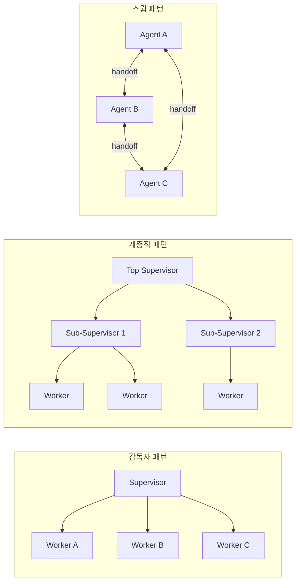
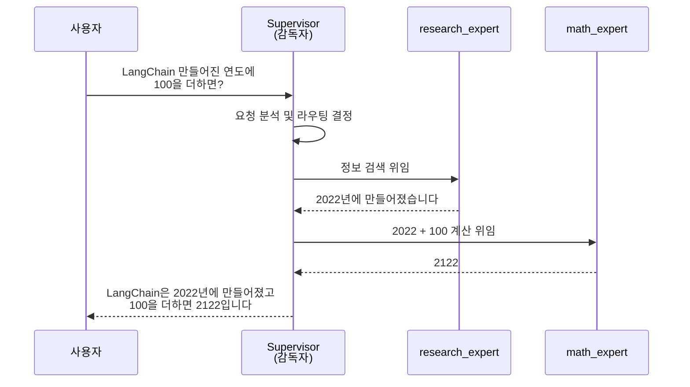
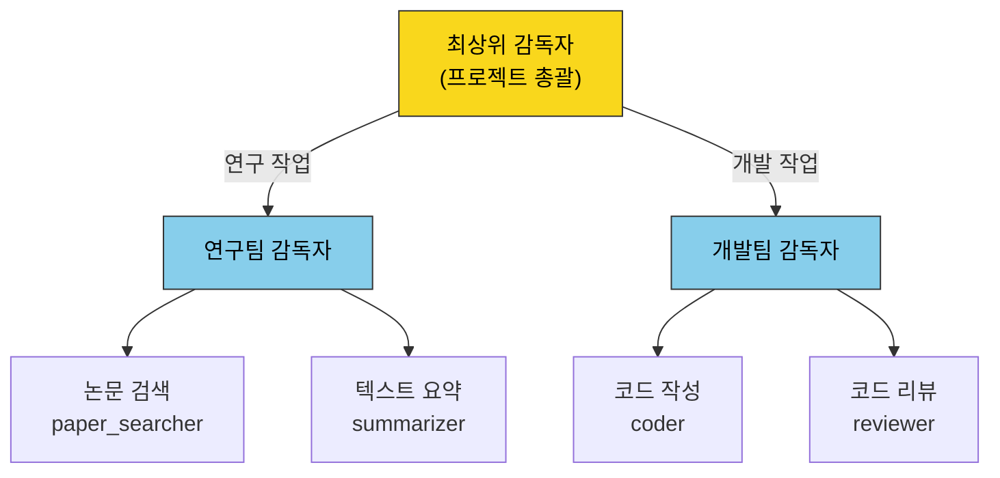
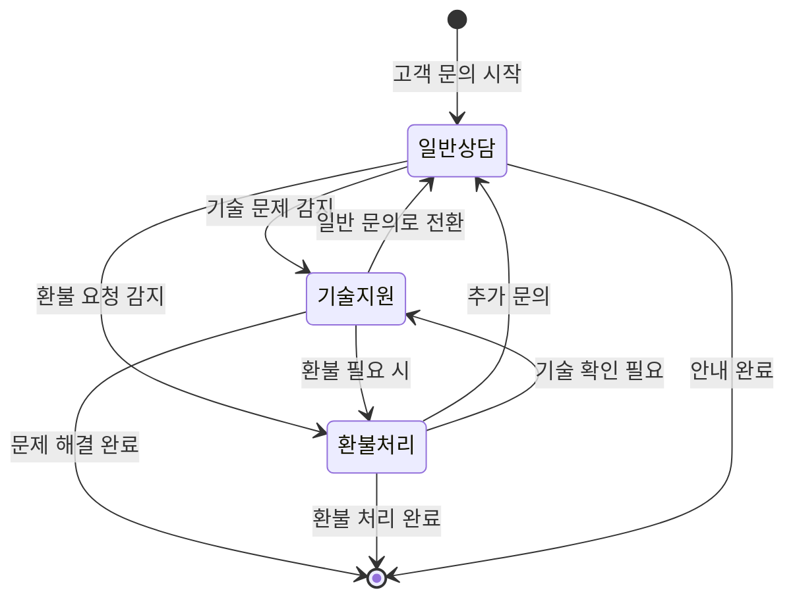
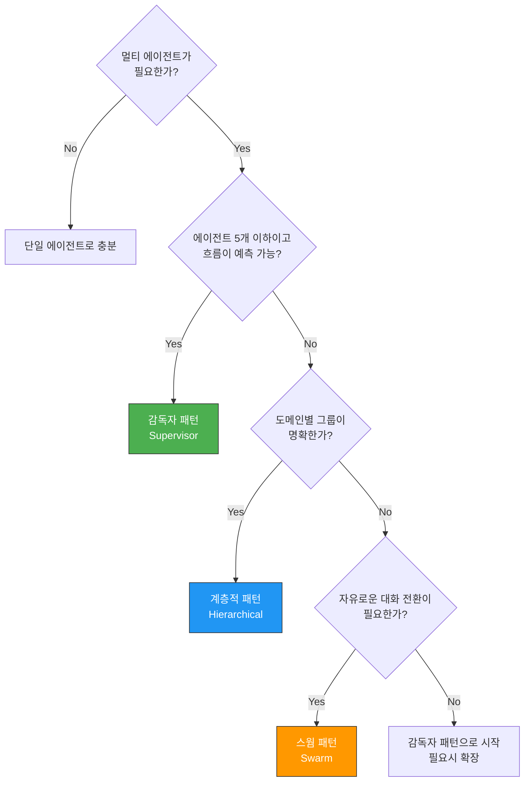

# 멀티 에이전트 아키텍처 패턴

> 여러 에이전트가 협력하는 멀티 에이전트 시스템의 핵심 아키텍처 패턴을 이해하고, 상황에 맞는 패턴을 선택하는 기준을 배웁니다.

## 개요

이 섹션에서는 멀티 에이전트 시스템을 설계할 때 사용하는 세 가지 핵심 아키텍처 패턴 — 감독자(Supervisor), 계층적(Hierarchical), 스웜(Swarm) — 을 깊이 있게 살펴봅니다. 각 패턴이 어떤 상황에 적합한지, 어떤 트레이드오프가 있는지를 이해하면, 실제 프로젝트에서 올바른 설계 결정을 내릴 수 있습니다.

**선수 지식**: [Ch12: 에이전트(Agent) 기초]에서 배운 에이전트의 개념과 도구 호출, [Ch13~14: LangGraph]에서 배운 StateGraph, 노드, 엣지 개념
**학습 목표**:

> 📊 **그림 1**: 세 가지 멀티 에이전트 아키텍처 패턴 비교 개관



- 감독자(Supervisor), 계층적(Hierarchical), 스웜(Swarm) 패턴의 구조와 동작 원리를 설명할 수 있다
- 각 패턴의 장단점과 적합한 사용 시나리오를 구분할 수 있다
- LangGraph의 `langgraph-supervisor`와 `langgraph-swarm` 라이브러리의 기본 사용법을 이해한다

## 왜 알아야 할까?

단일 에이전트는 만능이 아닙니다. 하나의 에이전트에 너무 많은 도구와 역할을 맡기면, 컨텍스트 윈도우가 넘치거나 도구 선택 정확도가 떨어지는 문제가 생기죠. 실제로 LangChain 공식 문서에서도 멀티 에이전트가 필요한 세 가지 핵심 이유를 제시합니다:

1. **컨텍스트 관리**: 전문 지식을 분리하여 모델의 컨텍스트 윈도우를 효율적으로 활용
2. **분산 개발**: 서로 다른 팀이 독립적으로 에이전트를 개발하고 배포
3. **병렬 처리**: 하위 작업을 여러 에이전트에 동시에 분배하여 처리 속도 향상

고객 서비스 시스템을 생각해보세요. 환불 처리, 기술 지원, 배송 추적을 모두 하나의 에이전트가 처리한다면? 도구가 수십 개로 늘어나고, 프롬프트는 길어지며, 정확도는 떨어집니다. 이때 **역할별로 전문 에이전트를 나누고, 이들이 협력하는 구조**를 설계하는 것이 멀티 에이전트 아키텍처입니다.

## 핵심 개념

### 개념 1: 감독자(Supervisor) 패턴 — "팀장이 일을 나눠주는 구조"

> 💡 **비유**: 회사의 팀장을 떠올려보세요. 고객 요청이 들어오면 팀장이 "이건 김 대리가 처리하세요", "저건 박 주임이 맡아주세요"라고 업무를 배분하죠. 결과물도 팀장이 취합해서 최종 보고를 합니다. 감독자 패턴이 바로 이 구조입니다.

감독자(Supervisor) 패턴은 **중앙 조율 에이전트**가 사용자 요청을 받아 적절한 전문 에이전트(Worker)에게 작업을 위임하고, 결과를 수집하여 최종 응답을 만드는 구조입니다. 모든 통신이 감독자를 거쳐야 하므로 **허브-앤-스포크(Hub-and-Spoke)** 토폴로지라고도 합니다.

> 📊 **그림 2**: 감독자 패턴의 요청 처리 흐름



```
        ┌──────────────┐
        │   Supervisor  │
        │  (중앙 조율자) │
        └──────┬───────┘
       ┌───────┼───────┐
       ▼       ▼       ▼
  ┌────────┐ ┌────────┐ ┌────────┐
  │ Agent A│ │ Agent B│ │ Agent C│
  │(연구원) │ │(수학자) │ │(작성자) │
  └────────┘ └────────┘ └────────┘
```

**핵심 특징**:
- 감독자가 **모든 라우팅 결정**을 내림

- 워커 에이전트끼리는 직접 소통하지 않음
- 작업 흐름이 예측 가능하고 디버깅이 쉬움

LangGraph에서는 `langgraph-supervisor` 라이브러리로 이 패턴을 쉽게 구현할 수 있습니다:

```python
from langchain_openai import ChatOpenAI
from langgraph.prebuilt import create_react_agent
from langgraph_supervisor import create_supervisor

# 전문 에이전트 정의
def search_web(query: str) -> str:
    """웹에서 정보를 검색합니다."""
    return f"'{query}'에 대한 검색 결과: LangChain은 2022년 Harrison Chase가 만든 프레임워크입니다."

def calculate(expression: str) -> str:
    """수학 계산을 수행합니다."""
    try:
        return str(eval(expression))  # 실제 프로덕션에서는 안전한 파서 사용
    except Exception as e:
        return f"계산 오류: {e}"

# 워커 에이전트 생성
research_agent = create_react_agent(
    model="openai:gpt-4o",
    tools=[search_web],
    name="research_expert",        # 에이전트 이름 (감독자가 참조)
    prompt="당신은 웹 검색 전문가입니다. 정확한 정보를 찾아 보고하세요.",
)

math_agent = create_react_agent(
    model="openai:gpt-4o",
    tools=[calculate],
    name="math_expert",
    prompt="당신은 수학 전문가입니다. 정확한 계산 결과를 제공하세요.",
)

# 감독자 생성 — 워커 에이전트 목록과 모델 전달
supervisor = create_supervisor(
    agents=[research_agent, math_agent],   # 관리할 워커 목록
    model=ChatOpenAI(model="gpt-4o"),      # 감독자 자체의 LLM
    prompt=(
        "당신은 팀 감독자입니다. "
        "사용자 요청을 분석하여 적절한 전문가에게 작업을 위임하세요. "
        "research_expert는 정보 검색을, math_expert는 계산을 담당합니다."
    ),
)

# 컴파일 후 실행
app = supervisor.compile()
result = app.invoke({
    "messages": [{"role": "user", "content": "LangChain이 만들어진 연도에 100을 더하면?"}]
})

# 감독자가 research_expert → math_expert 순으로 위임하여 결과 취합
print(result["messages"][-1].content)
```

> 🔥 **실무 팁**: `create_supervisor`는 내부적으로 각 워커 에이전트를 **도구(tool)**로 감독자에게 등록합니다. 감독자 LLM이 도구 호출(tool call)을 통해 워커를 선택하는 구조이므로, 워커의 `name`과 `prompt`를 명확히 작성하는 것이 라우팅 정확도를 높이는 핵심입니다.

### 개념 2: 계층적(Hierarchical) 패턴 — "부서가 있는 회사 조직도"

> 💡 **비유**: 대기업의 조직도를 생각해보세요. CEO 아래 마케팅 본부장, 기술 본부장이 있고, 각 본부장 아래 다시 팀장과 팀원이 있죠. 고객 요청이 들어오면 CEO가 적절한 본부에 보내고, 본부장이 다시 팀에 배분합니다. 이것이 계층적 패턴입니다.

계층적 패턴은 **감독자 패턴을 중첩**시킨 구조입니다. 상위 감독자가 하위 감독자에게 작업을 위임하고, 하위 감독자가 다시 자신의 워커 에이전트에게 세부 작업을 분배합니다.

> 📊 **그림 3**: 계층적 패턴의 트리 구조



```
              ┌──────────────────┐
              │  Top Supervisor   │
              │   (최상위 감독자)   │
              └────────┬─────────┘
            ┌──────────┴──────────┐
            ▼                     ▼
    ┌───────────────┐    ┌───────────────┐
    │  Sub-Supervisor│    │  Sub-Supervisor│
    │  (연구팀 팀장)  │    │  (개발팀 팀장)  │
    └───────┬───────┘    └───────┬───────┘
      ┌─────┴─────┐       ┌─────┴─────┐
      ▼           ▼       ▼           ▼
  ┌───────┐ ┌───────┐ ┌───────┐ ┌───────┐
  │웹검색  │ │논문분석│ │코드작성│ │코드리뷰│
  └───────┘ └───────┘ └───────┘ └───────┘
```

**핵심 특징**:
- 복잡한 작업을 **계층적으로 분해** 가능
- 각 레벨의 감독자가 자기 범위 내에서만 결정
- 대규모 시스템에서 **관심사 분리**(Separation of Concerns)에 유리

```python
from langchain_openai import ChatOpenAI
from langgraph.prebuilt import create_react_agent
from langgraph_supervisor import create_supervisor

# === 하위 팀 1: 연구팀 ===
def search_papers(query: str) -> str:
    """학술 논문을 검색합니다."""
    return f"'{query}' 관련 논문 3건 발견"

def summarize_text(text: str) -> str:
    """텍스트를 요약합니다."""
    return f"요약: {text[:50]}..."

paper_searcher = create_react_agent(
    model="openai:gpt-4o",
    tools=[search_papers],
    name="paper_searcher",
    prompt="학술 논문 검색 전문가입니다.",
)

summarizer = create_react_agent(
    model="openai:gpt-4o",
    tools=[summarize_text],
    name="summarizer",
    prompt="텍스트 요약 전문가입니다.",
)

# 연구팀 감독자 (하위 감독자)
research_team = create_supervisor(
    agents=[paper_searcher, summarizer],
    model=ChatOpenAI(model="gpt-4o"),
    prompt="당신은 연구팀 팀장입니다. 논문 검색과 요약 작업을 관리하세요.",
).compile()

# === 하위 팀 2: 개발팀 ===
def write_code(spec: str) -> str:
    """명세에 따라 코드를 작성합니다."""
    return f"# {spec} 구현 코드\ndef solution(): pass"

coder = create_react_agent(
    model="openai:gpt-4o",
    tools=[write_code],
    name="coder",
    prompt="Python 코드 작성 전문가입니다.",
)

dev_team = create_supervisor(
    agents=[coder],
    model=ChatOpenAI(model="gpt-4o"),
    prompt="당신은 개발팀 팀장입니다. 코드 작성 작업을 관리하세요.",
).compile()

# === 최상위 감독자 ===
top_supervisor = create_supervisor(
    agents=[research_team, dev_team],
    model=ChatOpenAI(model="gpt-4o"),
    prompt=(
        "당신은 프로젝트 총괄 감독자입니다. "
        "연구가 필요하면 연구팀에, 개발이 필요하면 개발팀에 위임하세요."
    ),
)

app = top_supervisor.compile()
```

이 구조에서 최상위 감독자는 "연구팀"과 "개발팀"이라는 **두 개의 하위 감독자**를 워커처럼 다룹니다. 각 하위 감독자는 다시 자신의 전문 워커를 관리하죠.

### 개념 3: 스웜(Swarm) 패턴 — "자유롭게 대화를 넘기는 동료들"

> 💡 **비유**: 콜센터의 상담원들을 떠올려보세요. 고객이 전화하면 처음 받은 상담원이 대응하다가, "아, 이건 기술 문제네요. 기술팀 동료에게 연결해드릴게요"라며 **직접** 다른 상담원에게 전화를 넘깁니다. 중간에 관리자를 거치지 않고요. 스웜 패턴이 바로 이런 **P2P(Peer-to-Peer)** 방식입니다.

스웜(Swarm) 패턴은 에이전트들이 **동등한 위치**에서 서로에게 제어권을 직접 넘기는(handoff) 구조입니다. 중앙 감독자가 없고, 각 에이전트가 자신의 판단에 따라 다른 에이전트에게 대화를 전달합니다.

> 📊 **그림 4**: 스웜 패턴의 핸드오프 흐름



```
  ┌─────────┐    handoff    ┌─────────┐
  │ Agent A  │◄────────────►│ Agent B  │
  │(일반상담) │              │(기술지원) │
  └────┬─────┘              └─────┬───┘
       │         handoff          │
       │    ┌─────────┐           │
       └───►│ Agent C  │◄─────────┘
            │(환불처리) │
            └─────────┘
```

**핵심 특징**:
- 에이전트 간 **직접 통신** — 중앙 병목 없음

- `active_agent` 상태로 현재 활성 에이전트 추적
- `create_handoff_tool`로 핸드오프 경로 정의

```python
from langchain_openai import ChatOpenAI
from langgraph.prebuilt import create_react_agent
from langgraph.checkpoint.memory import InMemorySaver
from langgraph_swarm import create_handoff_tool, create_swarm

model = ChatOpenAI(model="gpt-4o")

# 핸드오프 도구 생성 — 어떤 에이전트에게 넘길 수 있는지 정의
handoff_to_tech = create_handoff_tool(
    agent_name="tech_support",
    description="기술적인 문제는 기술 지원 에이전트에게 넘깁니다.",
)
handoff_to_refund = create_handoff_tool(
    agent_name="refund_handler",
    description="환불 요청은 환불 처리 에이전트에게 넘깁니다.",
)
handoff_to_general = create_handoff_tool(
    agent_name="general_support",
    description="일반 문의는 일반 상담 에이전트에게 넘깁니다.",
)

# 각 에이전트 정의 — 핸드오프 도구를 자신의 도구 목록에 포함
general_agent = create_react_agent(
    model,
    tools=[handoff_to_tech, handoff_to_refund],  # 기술/환불로 넘길 수 있음
    name="general_support",
    prompt="당신은 일반 상담 에이전트입니다. 기술 문제는 tech_support에, 환불은 refund_handler에 넘기세요.",
)

tech_agent = create_react_agent(
    model,
    tools=[handoff_to_general, handoff_to_refund],
    name="tech_support",
    prompt="당신은 기술 지원 에이전트입니다. 기술 문제를 해결하세요.",
)

refund_agent = create_react_agent(
    model,
    tools=[handoff_to_general, handoff_to_tech],
    name="refund_handler",
    prompt="당신은 환불 처리 에이전트입니다. 환불 요청을 처리하세요.",
)

# 스웜 생성 — 시작 에이전트 지정
workflow = create_swarm(
    agents=[general_agent, tech_agent, refund_agent],
    default_active_agent="general_support",  # 첫 번째로 대화를 받는 에이전트
)

# 체크포인터로 멀티턴 대화 지원
checkpointer = InMemorySaver()
app = workflow.compile(checkpointer=checkpointer)

# 실행
config = {"configurable": {"thread_id": "customer-001"}}
result = app.invoke(
    {"messages": [{"role": "user", "content": "구매한 노트북이 부팅이 안 돼요"}]},
    config,
)

# general_support → "기술 문제네요" → tech_support로 자동 핸드오프
print(result["messages"][-1].content)
```

> ⚠️ **흔한 오해**: "스웜이면 에이전트가 무작위로 움직이는 거 아닌가요?" — 아닙니다. 스웜 패턴에서 핸드오프 경로는 개발자가 `create_handoff_tool`로 **명시적으로 정의**합니다. 에이전트 A가 B에게 넘길 수 있는지, C에게도 넘길 수 있는지는 모두 코드로 통제됩니다. "자율적"인 것은 *언제* 넘길지를 LLM이 판단한다는 뜻이지, *아무에게나* 넘긴다는 뜻이 아닙니다.

### 개념 4: 패턴 선택 기준 — "언제 어떤 패턴을 쓸까?"

어떤 패턴이 "최고"라는 건 없습니다. 상황에 따라 적합한 패턴이 다릅니다. LangChain의 공식 벤치마크에서도 흥미로운 결과가 나왔는데요, 스웜이 감독자보다 **토큰 사용량은 약 40% 적고**, 응답 속도도 빨랐습니다. 하지만 그렇다고 항상 스웜이 정답은 아닙니다.


| 기준 | 감독자(Supervisor) | 계층적(Hierarchical) | 스웜(Swarm) |
|------|-------------------|---------------------|------------|
| **통신 구조** | 허브-앤-스포크 (중앙 집중) | 트리 (다단계 위임) | 메시(P2P 직접 통신) |
| **제어 흐름** | 감독자가 모든 결정 | 단계별 감독자 결정 | 각 에이전트가 자율 결정 |
| **적합한 규모** | 에이전트 2~5개 | 에이전트 5~20+개 | 에이전트 2~10개 |
| **토큰 효율** | 낮음 (감독자 오버헤드) | 중간 | 높음 (직접 전달) |
| **디버깅 용이성** | 높음 | 중간 | 낮음 |
| **적합한 시나리오** | 구조화된 워크플로우 | 대규모 복잡 시스템 | 대화형 핸드오프 |

**패턴 선택 의사결정 트리**:

> 📊 **그림 5**: 멀티 에이전트 패턴 선택 의사결정 흐름



```
시작: 멀티 에이전트가 필요한가?
│
├─ 에이전트가 5개 이하이고, 작업 흐름이 예측 가능한가?
│  └─ YES → 감독자(Supervisor) 패턴
│
├─ 에이전트가 많고, 도메인별 그룹이 명확한가?
│  └─ YES → 계층적(Hierarchical) 패턴
│
├─ 에이전트 간 자유로운 대화 전환이 필요한가?
│  └─ YES → 스웜(Swarm) 패턴
│
└─ 잘 모르겠다면?
   └─ 감독자 패턴으로 시작 → 필요시 확장
```

> 🔥 **실무 팁**: 처음부터 복잡한 계층적 구조를 설계하지 마세요. **감독자 패턴으로 시작**하여 프로토타입을 만들고, 에이전트 수가 늘어나면 계층적으로 확장하고, 대화형 핸드오프가 필요하면 스웜으로 전환하는 것이 현실적인 접근법입니다.

## 실습: 직접 해보기

세 가지 패턴의 차이를 체감하기 위해, 동일한 "고객 서비스" 시나리오를 감독자 패턴과 스웜 패턴으로 각각 구현해봅시다.

```python
"""
멀티 에이전트 아키텍처 패턴 비교 실습
- 감독자(Supervisor) 패턴 vs 스웜(Swarm) 패턴

필요 패키지:
  pip install langchain-openai langgraph langgraph-supervisor langgraph-swarm
"""
import os
from dotenv import load_dotenv
from langchain_openai import ChatOpenAI
from langgraph.prebuilt import create_react_agent
from langgraph.checkpoint.memory import InMemorySaver

load_dotenv()  # .env 파일에서 OPENAI_API_KEY 로드

MODEL_NAME = "gpt-4o"
model = ChatOpenAI(model=MODEL_NAME, temperature=0)

# ========================================
# 공통 도구 정의
# ========================================
def check_order_status(order_id: str) -> str:
    """주문 상태를 조회합니다."""
    # 실제로는 DB 조회
    orders = {
        "ORD-001": "배송 중 (내일 도착 예정)",
        "ORD-002": "결제 완료 (출고 대기)",
    }
    return orders.get(order_id, f"주문번호 {order_id}를 찾을 수 없습니다.")

def process_refund(order_id: str, reason: str) -> str:
    """환불을 처리합니다."""
    return f"주문 {order_id} 환불 처리 완료 (사유: {reason}). 3~5 영업일 내 환불됩니다."

def troubleshoot_device(device: str, symptom: str) -> str:
    """기기 문제를 진단합니다."""
    return f"{device} - '{symptom}' 증상 진단: 전원 초기화를 시도해주세요. (전원 버튼 10초 길게 누르기)"

# ========================================
# 패턴 1: 감독자(Supervisor) 패턴
# ========================================
def build_supervisor_system():
    """감독자 패턴 멀티 에이전트 시스템을 구성합니다."""
    from langgraph_supervisor import create_supervisor

    # 워커 에이전트 생성
    order_agent = create_react_agent(
        model=model,
        tools=[check_order_status],
        name="order_specialist",
        prompt="주문 조회 전문가입니다. 주문 상태를 정확히 안내하세요.",
    )

    refund_agent = create_react_agent(
        model=model,
        tools=[process_refund],
        name="refund_specialist",
        prompt="환불 처리 전문가입니다. 환불 절차를 안내하고 처리하세요.",
    )

    tech_agent = create_react_agent(
        model=model,
        tools=[troubleshoot_device],
        name="tech_specialist",
        prompt="기술 지원 전문가입니다. 기기 문제를 진단하고 해결 방법을 안내하세요.",
    )

    # 감독자 생성
    supervisor = create_supervisor(
        agents=[order_agent, refund_agent, tech_agent],
        model=model,
        prompt=(
            "당신은 고객 서비스 감독자입니다.\n"
            "- 주문 관련 → order_specialist\n"
            "- 환불 관련 → refund_specialist\n"
            "- 기술 문제 → tech_specialist\n"
            "적절한 전문가에게 작업을 위임하세요."
        ),
    )

    return supervisor.compile()

# ========================================
# 패턴 2: 스웜(Swarm) 패턴
# ========================================
def build_swarm_system():
    """스웜 패턴 멀티 에이전트 시스템을 구성합니다."""
    from langgraph_swarm import create_handoff_tool, create_swarm

    # 핸드오프 도구 정의
    to_order = create_handoff_tool(agent_name="order_agent", description="주문 조회가 필요할 때")
    to_refund = create_handoff_tool(agent_name="refund_agent", description="환불 처리가 필요할 때")
    to_tech = create_handoff_tool(agent_name="tech_agent", description="기술 지원이 필요할 때")
    to_general = create_handoff_tool(agent_name="general_agent", description="일반 문의로 돌아갈 때")

    # 에이전트 정의 — 각자 핸드오프 경로를 도구로 가짐
    general = create_react_agent(
        model, tools=[to_order, to_refund, to_tech],
        name="general_agent",
        prompt="일반 상담 에이전트입니다. 고객 의도를 파악해서 적절한 에이전트에게 넘기세요.",
    )
    order = create_react_agent(
        model, tools=[check_order_status, to_general, to_refund],
        name="order_agent",
        prompt="주문 조회 에이전트입니다. 주문 상태를 안내하세요.",
    )
    refund = create_react_agent(
        model, tools=[process_refund, to_general, to_order],
        name="refund_agent",
        prompt="환불 처리 에이전트입니다. 환불을 처리하세요.",
    )
    tech = create_react_agent(
        model, tools=[troubleshoot_device, to_general],
        name="tech_agent",
        prompt="기술 지원 에이전트입니다. 기기 문제를 진단하세요.",
    )

    # 스웜 생성
    workflow = create_swarm(
        agents=[general, order, refund, tech],
        default_active_agent="general_agent",
    )

    checkpointer = InMemorySaver()
    return workflow.compile(checkpointer=checkpointer)

# ========================================
# 실행 비교
# ========================================
if __name__ == "__main__":
    test_messages = [
        "주문번호 ORD-001 배송 상태 알려주세요.",
        "노트북 화면이 안 켜져요.",
        "ORD-002 환불하고 싶어요. 단순 변심이에요.",
    ]

    # 감독자 패턴 실행
    print("=" * 50)
    print("📋 감독자(Supervisor) 패턴")
    print("=" * 50)
    supervisor_app = build_supervisor_system()
    for msg in test_messages:
        print(f"\n👤 고객: {msg}")
        result = supervisor_app.invoke({"messages": [{"role": "user", "content": msg}]})
        print(f"🤖 응답: {result['messages'][-1].content}")

    # 스웜 패턴 실행
    print("\n" + "=" * 50)
    print("🐝 스웜(Swarm) 패턴")
    print("=" * 50)
    swarm_app = build_swarm_system()
    for i, msg in enumerate(test_messages):
        print(f"\n👤 고객: {msg}")
        config = {"configurable": {"thread_id": f"test-{i}"}}
        result = swarm_app.invoke(
            {"messages": [{"role": "user", "content": msg}]},
            config,
        )
        print(f"🤖 응답: {result['messages'][-1].content}")
```

실행하면 두 패턴이 동일한 질문에 대해 어떻게 다른 경로로 답에 도달하는지 확인할 수 있습니다. 감독자 패턴에서는 매번 감독자가 중간에 개입하고, 스웜 패턴에서는 에이전트가 직접 다른 에이전트에게 제어권을 넘깁니다.

## 더 깊이 알아보기

### 멀티 에이전트의 지적 뿌리: 마빈 민스키의 "마음의 사회"

멀티 에이전트 시스템의 아이디어는 사실 AI의 초창기까지 거슬러 올라갑니다. 1986년, MIT AI 연구소의 마빈 민스키(Marvin Minsky)는 **"마음의 사회(The Society of Mind)"**라는 책을 출간했습니다. 민스키는 1970년대 초부터 시모어 패퍼트(Seymour Papert)와 함께 이 이론을 발전시켰는데요, 핵심 주장은 이것이었습니다:

> "지능은 그 자체로는 지능적이지 않은 단순한 부품들의 상호작용으로 만들어질 수 있다."

민스키는 아이가 블록을 쌓는 과정을 분석하며 이 아이디어를 구체화했습니다. "블록을 본다", "블록을 잡는다", "블록을 놓는다", "블록을 놓아준다" — 각각은 단순한 **에이전트(agent)**이지만, 이들이 협력하면 "탑을 쌓는다"라는 복잡한 행동이 만들어지죠. 오늘날 우리가 LangGraph로 만드는 멀티 에이전트 시스템은, 민스키가 40년 전에 이론적으로 그렸던 바로 그 "마음의 사회"를 코드로 구현하는 것이라 할 수 있습니다.

### OpenAI Swarm에서 LangGraph Swarm으로

스웜 패턴이 LLM 커뮤니티에서 주목받기 시작한 것은 2024년 OpenAI가 실험적으로 공개한 **Swarm** 프레임워크 덕분이었습니다. "경량 멀티 에이전트 오케스트레이션"을 표방한 이 프로젝트는 에이전트 간 핸드오프라는 개념을 대중화시켰죠. LangChain 팀은 이 아이디어를 LangGraph의 상태 그래프 위에 올려 `langgraph-swarm` 라이브러리를 만들었고, 체크포인트, 메모리, Human-in-the-Loop 같은 프로덕션 기능을 추가했습니다.

## 흔한 오해와 팁

> ⚠️ **흔한 오해**: "멀티 에이전트 시스템이 항상 단일 에이전트보다 좋다" — 사실이 아닙니다. 에이전트가 2~3개 도구만 사용하는 간단한 시나리오라면 단일 에이전트가 더 빠르고 정확합니다. 멀티 에이전트의 조율 오버헤드(감독자의 추가 LLM 호출, 컨텍스트 전달 비용)가 이점을 상쇄할 수 있거든요. LangChain 공식 문서에서도 "모든 복잡한 작업에 멀티 에이전트가 필요한 것은 아니다"라고 명시하고 있습니다.

> 💡 **알고 계셨나요?**: LangChain 팀의 벤치마크 연구에 따르면, 스웜 패턴이 감독자 패턴보다 **토큰을 약 40% 적게** 사용합니다. 감독자 패턴에서는 모든 요청이 감독자를 거쳐야 하므로 "번역 레이어"가 추가되는 반면, 스웜에서는 에이전트가 직접 대화를 넘기기 때문이죠.

> 🔥 **실무 팁**: `langgraph-supervisor`와 `langgraph-swarm`은 빠른 프로토타이핑에 훌륭하지만, LangChain 팀은 프로덕션 수준의 시스템에서는 **도구 기반으로 직접 감독자 패턴을 구현**하는 것을 권장합니다. 라이브러리를 쓰지 않고 에이전트를 도구로 등록하면 컨텍스트 엔지니어링에 대한 더 세밀한 제어가 가능하거든요. 라이브러리로 빠르게 검증하고, 프로덕션에서는 직접 구현으로 전환하는 전략을 추천합니다.

## 핵심 정리

| 개념 | 설명 |
|------|------|
| **감독자(Supervisor) 패턴** | 중앙 감독자가 워커 에이전트에게 작업을 위임하고 결과를 취합하는 허브-앤-스포크 구조 |
| **계층적(Hierarchical) 패턴** | 감독자를 중첩시켜 트리 구조로 대규모 시스템을 관리하는 패턴 |
| **스웜(Swarm) 패턴** | 에이전트가 동등한 위치에서 핸드오프 도구로 직접 제어권을 주고받는 P2P 구조 |
| **`create_supervisor`** | `langgraph-supervisor` 라이브러리의 핵심 함수, 감독자 워크플로우 생성 |
| **`create_swarm`** | `langgraph-swarm` 라이브러리의 핵심 함수, 스웜 워크플로우 생성 |
| **`create_handoff_tool`** | 스웜 패턴에서 에이전트 간 핸드오프 경로를 정의하는 함수 |
| **패턴 선택 기준** | 에이전트 수, 통신 구조, 디버깅 필요성, 토큰 효율에 따라 결정 |

## 다음 섹션 미리보기

이번 섹션에서 세 가지 아키텍처 패턴의 개념과 차이를 이해했으니, 다음 섹션 **[15.2: 감독자(Supervisor) 패턴 구현]**에서는 감독자 패턴을 더 깊이 파고들어, 실제 프로덕션 수준의 멀티 에이전트 시스템을 단계별로 구축해봅니다. 감독자의 라우팅 전략, 에러 처리, 그리고 워커 에이전트의 결과를 효과적으로 합성하는 방법을 실습합니다.

## 참고 자료

- [LangChain Multi-agent 공식 문서](https://docs.langchain.com/oss/python/langchain/multi-agent) - 멀티 에이전트 패턴 개요와 권장 사항을 정리한 공식 가이드
- [langgraph-supervisor GitHub 리포지토리](https://github.com/langchain-ai/langgraph-supervisor-py) - 감독자 패턴 라이브러리의 소스 코드와 예제
- [langgraph-swarm GitHub 리포지토리](https://github.com/langchain-ai/langgraph-swarm-py) - 스웜 패턴 라이브러리의 소스 코드와 예제
- [Benchmarking Multi-Agent Architectures — LangChain Blog](https://blog.langchain.com/benchmarking-multi-agent-architectures/) - 감독자 vs 스웜 패턴의 성능 벤치마크 분석
- [LangGraph: Multi-Agent Workflows — LangChain Blog](https://blog.langchain.com/langgraph-multi-agent-workflows/) - LangGraph 기반 멀티 에이전트 워크플로우 설계 가이드
- [Hierarchical Agent Teams — LangGraph Tutorial](https://langchain-ai.github.io/langgraph/tutorials/multi_agent/hierarchical_agent_teams/) - 계층적 에이전트 팀 공식 튜토리얼

---
### 🔗 Related Sessions
- [tool](../11-도구tools와-함수-호출/01-도구-정의와-바인딩.md) (prerequisite)
- [agent](../12-에이전트agent-기초/01-에이전트-개념과-react-패턴.md) (prerequisite)
- [langgraph](../01-langchain-소개와-개발-환경-설정/01-llm-애플리케이션의-진화와-langchain.md) (prerequisite)
- [create_react_agent](../13-langgraph-기초/04-도구-호출-에이전트.md) (prerequisite)
