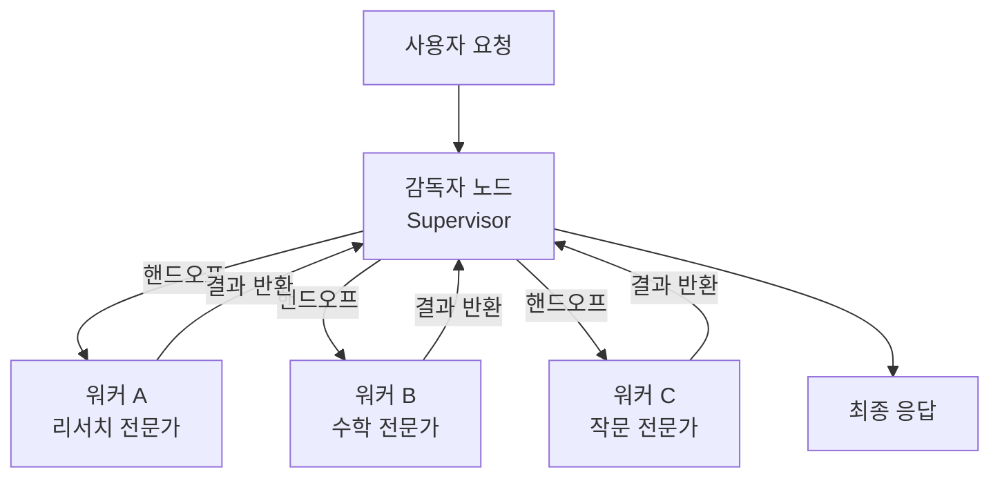
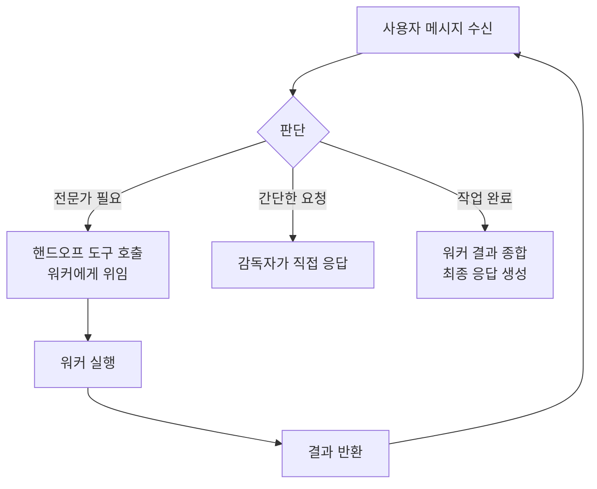
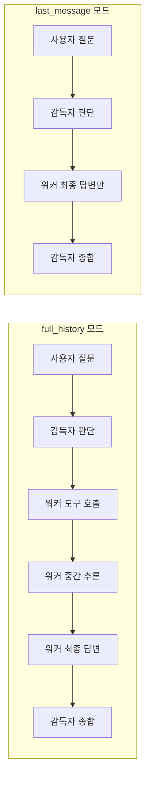
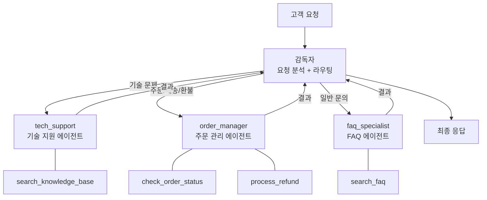

# 감독자 기반 멀티 에이전트

> 감독자(Supervisor) 노드가 워커 에이전트를 지휘하여 복잡한 작업을 분할·위임·수집하는 멀티 에이전트 시스템을 설계하고 구현합니다.

## 개요

이 섹션에서는 멀티 에이전트 시스템의 가장 실용적인 패턴인 **감독자(Supervisor) 기반 아키텍처**를 본격적으로 구현합니다. [세션 15.1: 멀티 에이전트 아키텍처 패턴](ch15/session_15_1.md)에서 감독자 패턴의 개념과 기본 구조를 배웠다면, 이번에는 감독자 노드 설계, 워커 에이전트 정의, 라우팅 로직, 결과 수집까지 실전 수준으로 다뤄보겠습니다.

**선수 지식**: 
- LangGraph의 `StateGraph`, 노드, 엣지 개념 ([챕터 13](ch13/session_13_1.md))
- `create_react_agent`를 활용한 단일 에이전트 구축 ([챕터 12](ch12/session_12_1.md))
- 감독자/스웜/계층적 패턴의 차이점 ([세션 15.1](ch15/session_15_1.md))

**학습 목표**:
- 감독자 노드의 역할과 내부 동작 원리를 이해한다
- `create_supervisor`를 사용하여 워커 에이전트를 조율하는 시스템을 구축한다
- 핸드오프(Handoff) 도구를 커스터마이징하여 라우팅 로직을 제어한다
- 메시지 히스토리 관리 전략(`full_history`, `last_message`)을 적용한다

## 왜 알아야 할까?

실무에서 AI 시스템을 만들다 보면, 하나의 에이전트가 모든 걸 처리하기엔 한계가 명확해지는 순간이 옵니다. 검색도 하고, 계산도 하고, 글도 써야 하는 시스템을 **하나의 거대한 에이전트**로 만들면 어떻게 될까요? 프롬프트가 비대해지고, 도구 선택이 혼란스러워지며, 디버깅은 악몽이 됩니다.

감독자 패턴은 이 문제를 **"전문가 팀 + 관리자"** 구조로 해결합니다. 현실 세계의 프로젝트 매니저처럼, 감독자는 작업을 분석하고, 적절한 전문가에게 위임하고, 결과를 취합하여 최종 답변을 만듭니다. 이 패턴은 다음과 같은 실제 시나리오에서 빛을 발합니다:

> 📊 **그림 1**: 감독자 기반 멀티 에이전트 시스템의 전체 구조




- **고객 지원 시스템**: 기술 문의 → 기술 에이전트, 환불 요청 → 결제 에이전트, 일반 문의 → FAQ 에이전트
- **데이터 분석 파이프라인**: 데이터 수집 → 리서치 에이전트, 통계 처리 → 수학 에이전트, 보고서 작성 → 작문 에이전트
- **콘텐츠 생성 워크플로우**: 조사 → 리서치 에이전트, 초안 → 작문 에이전트, 검수 → 편집 에이전트

## 핵심 개념

### 개념 1: 감독자 노드 — 팀의 두뇌

> 💡 **비유**: 감독자는 **오케스트라의 지휘자**와 같습니다. 지휘자 본인이 모든 악기를 연주하지 않습니다. 대신 악보(사용자 요청)를 분석하고, 바이올린(리서치 에이전트)에게 선율을, 타악기(수학 에이전트)에게 리듬을 맡깁니다. 연주가 끝나면 전체 하모니를 평가하고 최종 곡(응답)을 완성하죠.

감독자 노드는 LLM 기반의 **의사결정 엔진**입니다. 사용자 메시지를 받으면 다음 세 가지를 판단합니다:

> 📊 **그림 2**: 감독자 노드의 의사결정 흐름




1. **어떤 워커에게 위임할 것인가?** — 핸드오프(Handoff) 도구를 호출하여 작업 전달
2. **직접 응답할 것인가?** — 워커가 필요 없는 간단한 요청
3. **작업이 완료되었는가?** — 워커의 결과를 종합하여 최종 응답 생성

`langgraph-supervisor` 라이브러리의 `create_supervisor`를 사용하면, 이 모든 로직이 내부적으로 구성됩니다:

```python
from langchain_openai import ChatOpenAI
from langgraph_supervisor import create_supervisor
from langgraph.prebuilt import create_react_agent

# 감독자의 두뇌 역할을 할 LLM
model = ChatOpenAI(model="gpt-4o", temperature=0)

# 감독자 워크플로우 생성
workflow = create_supervisor(
    agents=[research_agent, math_agent],  # 워커 에이전트 목록
    model=model,                           # 감독자가 사용할 LLM
    prompt="당신은 팀 감독자입니다...",      # 감독자의 시스템 프롬프트
)

# StateGraph를 컴파일하여 실행 가능한 앱으로 변환
app = workflow.compile()
```

내부적으로 `create_supervisor`는 각 워커 에이전트에 대한 **핸드오프 도구(Handoff Tool)**를 자동 생성합니다. 감독자 LLM이 `transfer_to_math_expert`라는 도구를 호출하면, LangGraph의 `Command`를 통해 해당 워커 노드로 제어가 넘어갑니다.


### 개념 2: 워커 에이전트 — 전문가 군단

> 💡 **비유**: 워커 에이전트는 **전문 요리사**와 같습니다. 디저트 셰프는 디저트만, 파스타 셰프는 파스타만 만듭니다. 각자 자기 도구(오븐, 파스타 머신)를 갖고 있고, 수 셰프(감독자)가 주문을 받아 적절한 셰프에게 전달하죠.

워커 에이전트는 `create_react_agent`로 생성하며, 각 에이전트가 **고유한 도구 세트**와 **전문화된 프롬프트**를 갖습니다:

```python
# 도구 정의
def web_search(query: str) -> str:
    """웹에서 정보를 검색합니다."""
    return f"'{query}'에 대한 검색 결과: ..."

def calculate(expression: str) -> str:
    """수학 표현식을 계산합니다."""
    try:
        result = eval(expression)  # 실습용 간소화 코드
        return f"계산 결과: {result}"
    except Exception as e:
        return f"계산 오류: {e}"

# 워커 에이전트 생성
research_agent = create_react_agent(
    model=model,
    tools=[web_search],
    name="research_expert",           # 감독자가 참조할 이름
    prompt="당신은 리서치 전문가입니다. 웹 검색을 통해 정확한 정보를 찾아주세요."
)

math_agent = create_react_agent(
    model=model,
    tools=[calculate],
    name="math_expert",               # 감독자가 참조할 이름
    prompt="당신은 수학 전문가입니다. 정확한 계산을 수행해주세요."
)
```

핵심은 `name` 파라미터입니다. 이 이름이 핸드오프 도구의 이름(`transfer_to_research_expert`, `transfer_to_math_expert`)으로 변환되어, 감독자가 어떤 워커를 호출할지 결정하는 기준이 됩니다.

### 개념 3: 핸드오프와 라우팅 — 바통 전달

> 💡 **비유**: 핸드오프는 **릴레이 경주의 바통 전달**과 같습니다. 첫 번째 주자(감독자)가 바통(작업 컨텍스트)을 두 번째 주자(워커)에게 넘기고, 워커가 자기 구간을 달린 뒤 다시 감독자에게 바통을 돌려줍니다.

`create_supervisor`는 기본적으로 각 워커에 대한 핸드오프 도구를 자동 생성합니다. 하지만 더 세밀한 제어가 필요하다면 **커스텀 핸드오프 도구**를 만들 수 있습니다:

```python
from langgraph_supervisor import create_handoff_tool

# 기본 자동 생성 대신, 커스텀 핸드오프 도구 정의
custom_tools = [
    create_handoff_tool(
        agent_name="research_expert",
        name="assign_to_researcher",               # 도구 이름 커스터마이징
        description="최신 정보 조사가 필요할 때 리서치 전문가에게 위임합니다"
    ),
    create_handoff_tool(
        agent_name="math_expert",
        name="assign_to_mathematician",
        description="수학 계산이나 통계 분석이 필요할 때 수학 전문가에게 위임합니다"
    ),
]

workflow = create_supervisor(
    agents=[research_agent, math_agent],
    model=model,
    tools=custom_tools,  # 커스텀 핸드오프 도구 전달
    prompt="당신은 팀 감독자입니다. 작업 성격에 따라 적절한 전문가에게 위임하세요."
)
```

핸드오프 도구의 `description`이 라우팅 품질을 결정합니다. 감독자 LLM은 이 설명을 보고 어떤 도구를 호출할지 판단하기 때문에, **명확하고 구체적인 설명**이 정확한 라우팅으로 이어집니다.

### 개념 4: 메시지 히스토리 관리 — 무엇을 기억할 것인가

> 💡 **비유**: 회의록 관리를 생각해보세요. **전체 기록(full_history)** 방식은 모든 발언을 빠짐없이 기록하는 것이고, **최종 발언만(last_message)** 방식은 각 팀원의 결론만 기록하는 것입니다. 전자는 맥락이 풍부하지만 길어지고, 후자는 간결하지만 맥락을 잃을 수 있습니다.

`create_supervisor`의 `output_mode` 파라미터로 워커 에이전트의 메시지를 어떻게 관리할지 결정합니다:

```python
# 방식 1: 전체 히스토리 유지 (기본값)
workflow_full = create_supervisor(
    agents=[research_agent, math_agent],
    model=model,
    output_mode="full_history",  # 워커의 모든 중간 메시지 포함
)

# 방식 2: 마지막 메시지만 유지
workflow_last = create_supervisor(
    agents=[research_agent, math_agent],
    model=model,
    output_mode="last_message",  # 워커의 최종 응답만 포함
)
```

| 모드 | 장점 | 단점 | 적합한 상황 |
|------|------|------|------------|
| `full_history` | 풍부한 맥락, 디버깅 용이 | 토큰 소비 증가 | 복잡한 다단계 추론 |
| `last_message` | 토큰 절약, 간결함 | 중간 과정 손실 | 독립적 단일 작업 위임 |

> 📊 **그림 4**: full_history vs last_message 메시지 흐름 비교




### 개념 5: 메모리와 상태 관리 — 대화를 이어가기

감독자 시스템에 **체크포인터(Checkpointer)**를 추가하면 대화 상태를 저장하여 멀티턴 대화가 가능해집니다:

```python
from langgraph.checkpoint.memory import InMemorySaver

# 체크포인터 생성
checkpointer = InMemorySaver()

# 감독자 워크플로우에 메모리 연결
workflow = create_supervisor(
    agents=[research_agent, math_agent],
    model=model,
    prompt="당신은 팀 감독자입니다..."
)

app = workflow.compile(checkpointer=checkpointer)

# thread_id로 대화 세션 관리
config = {"configurable": {"thread_id": "session-001"}}

# 첫 번째 대화
result1 = app.invoke(
    {"messages": [{"role": "user", "content": "2024년 FAANG 기업의 총 직원 수를 알려줘"}]},
    config=config
)

# 같은 thread_id로 후속 질문 — 이전 맥락 유지
result2 = app.invoke(
    {"messages": [{"role": "user", "content": "그 중 가장 직원이 많은 기업은?"}]},
    config=config
)
```

## 실습: 직접 해보기

이제 **고객 지원 멀티 에이전트 시스템**을 처음부터 끝까지 구축해보겠습니다. 기술 지원, 주문 관리, 일반 문의를 전담하는 세 명의 워커를 감독자가 조율합니다.

> 📊 **그림 5**: 고객 지원 멀티 에이전트 시스템 아키텍처




```python
"""
감독자 기반 멀티 에이전트 고객 지원 시스템
- 감독자: 고객 요청을 분석하여 적절한 전문가에게 라우팅
- 기술 지원 에이전트: 제품 문제 해결
- 주문 관리 에이전트: 주문/배송 조회
- FAQ 에이전트: 일반 질문 응답
"""

import os
from dotenv import load_dotenv
from langchain_openai import ChatOpenAI
from langgraph_supervisor import create_supervisor, create_handoff_tool
from langgraph.prebuilt import create_react_agent
from langgraph.checkpoint.memory import InMemorySaver

load_dotenv()

# === LLM 설정 ===
MODEL_NAME = "gpt-4o"
TEMPERATURE = 0

model = ChatOpenAI(model=MODEL_NAME, temperature=TEMPERATURE)


# === 워커 에이전트용 도구 정의 ===

def search_knowledge_base(query: str) -> str:
    """기술 지원 지식 베이스를 검색합니다."""
    # 실제로는 벡터 스토어 검색 등을 수행
    kb = {
        "로그인 오류": "1. 캐시 삭제 2. 비밀번호 재설정 3. 2FA 확인",
        "속도 저하": "1. 브라우저 업데이트 2. 확장 프로그램 비활성화 3. 네트워크 확인",
        "설치 오류": "1. 시스템 요구사항 확인 2. 관리자 권한 실행 3. 재설치",
    }
    for key, value in kb.items():
        if key in query:
            return f"[지식 베이스] {key} 해결 방법: {value}"
    return f"[지식 베이스] '{query}'에 대한 정확한 문서를 찾지 못했습니다. 상위 지원팀에 문의하세요."


def check_order_status(order_id: str) -> str:
    """주문 상태를 조회합니다."""
    # 실제로는 DB 조회
    orders = {
        "ORD-001": {"status": "배송중", "eta": "2026-03-05", "carrier": "CJ대한통운"},
        "ORD-002": {"status": "준비중", "eta": "2026-03-07", "carrier": "미정"},
        "ORD-003": {"status": "배송완료", "eta": "2026-03-01", "carrier": "한진택배"},
    }
    if order_id in orders:
        info = orders[order_id]
        return (
            f"[주문 조회] 주문번호: {order_id}\n"
            f"  상태: {info['status']}\n"
            f"  예상 도착일: {info['eta']}\n"
            f"  택배사: {info['carrier']}"
        )
    return f"[주문 조회] 주문번호 '{order_id}'를 찾을 수 없습니다."


def process_refund(order_id: str, reason: str) -> str:
    """환불을 처리합니다."""
    return f"[환불 처리] 주문 {order_id}에 대한 환불이 접수되었습니다. 사유: {reason}. 3-5영업일 내 처리됩니다."


def search_faq(question: str) -> str:
    """FAQ 데이터베이스를 검색합니다."""
    faqs = {
        "영업시간": "고객센터 운영시간: 평일 09:00-18:00, 주말/공휴일 휴무",
        "반품": "수령 후 7일 이내 반품 가능. 제품 하자 시 무료 반품.",
        "결제수단": "신용카드, 체크카드, 계좌이체, 네이버페이, 카카오페이 지원",
        "회원가입": "이메일 또는 소셜 계정(구글, 카카오)으로 가입 가능",
    }
    for key, value in faqs.items():
        if key in question:
            return f"[FAQ] {value}"
    return f"[FAQ] '{question}'에 대한 답변을 찾지 못했습니다. 고객센터에 직접 문의해주세요."


# === 워커 에이전트 생성 ===

tech_agent = create_react_agent(
    model=model,
    tools=[search_knowledge_base],
    name="tech_support",
    prompt=(
        "당신은 기술 지원 전문가입니다. "
        "제품 사용 중 발생하는 기술적 문제를 진단하고 해결 방법을 안내합니다. "
        "항상 지식 베이스를 먼저 검색하고, 단계별 해결 방법을 친절하게 안내하세요."
    ),
)

order_agent = create_react_agent(
    model=model,
    tools=[check_order_status, process_refund],
    name="order_manager",
    prompt=(
        "당신은 주문 관리 전문가입니다. "
        "주문 상태 조회, 배송 추적, 환불 처리를 담당합니다. "
        "고객에게 정확한 주문 정보를 제공하고, 환불 요청 시 사유를 확인하세요."
    ),
)

faq_agent = create_react_agent(
    model=model,
    tools=[search_faq],
    name="faq_specialist",
    prompt=(
        "당신은 FAQ 전문가입니다. "
        "영업시간, 반품 정책, 결제수단 등 일반적인 질문에 답변합니다. "
        "FAQ에서 찾을 수 없는 질문은 고객센터 연결을 안내하세요."
    ),
)


# === 커스텀 핸드오프 도구 정의 ===

handoff_tools = [
    create_handoff_tool(
        agent_name="tech_support",
        name="route_to_tech_support",
        description="로그인 오류, 속도 저하, 설치 문제 등 기술적 문제 해결이 필요할 때 위임합니다",
    ),
    create_handoff_tool(
        agent_name="order_manager",
        name="route_to_order_manager",
        description="주문 조회, 배송 추적, 환불 처리 등 주문 관련 요청을 처리할 때 위임합니다",
    ),
    create_handoff_tool(
        agent_name="faq_specialist",
        name="route_to_faq",
        description="영업시간, 반품 정책, 결제수단 등 일반적인 문의에 답변할 때 위임합니다",
    ),
]


# === 감독자 구성 ===

SUPERVISOR_PROMPT = """\
당신은 고객 지원팀의 감독자입니다. 
고객의 요청을 분석하여 가장 적합한 전문가에게 작업을 위임하세요.

라우팅 기준:
- 기술적 문제(오류, 버그, 설치 등) → tech_support
- 주문/배송/환불 관련 → order_manager  
- 일반 문의(영업시간, 정책 등) → faq_specialist

여러 전문가의 답변이 필요한 경우, 순차적으로 위임한 뒤 결과를 종합하여 답변하세요.
항상 정중하고 친절한 톤을 유지하세요.
"""

workflow = create_supervisor(
    agents=[tech_agent, order_agent, faq_agent],
    model=model,
    tools=handoff_tools,
    prompt=SUPERVISOR_PROMPT,
    output_mode="full_history",  # 모든 대화 맥락 유지
)

# 메모리 추가
checkpointer = InMemorySaver()
app = workflow.compile(checkpointer=checkpointer)


# === 실행 테스트 ===

def run_query(query: str, thread_id: str = "customer-001") -> None:
    """감독자 시스템에 질의하고 결과를 출력합니다."""
    config = {"configurable": {"thread_id": thread_id}}
    result = app.invoke(
        {"messages": [{"role": "user", "content": query}]},
        config=config,
    )
    # 마지막 AI 메시지 출력
    for msg in reversed(result["messages"]):
        if hasattr(msg, "content") and msg.content and not hasattr(msg, "tool_call_id"):
            print(f"\n[감독자 응답]\n{msg.content}")
            break


if __name__ == "__main__":
    # 테스트 1: 기술 문의 → tech_support로 라우팅
    print("=" * 60)
    print("테스트 1: 기술 문의")
    run_query("로그인할 때 자꾸 오류가 나요. 어떻게 해야 하나요?")

    # 테스트 2: 주문 조회 → order_manager로 라우팅
    print("\n" + "=" * 60)
    print("테스트 2: 주문 조회")
    run_query("ORD-001 주문이 언제 도착하나요?")

    # 테스트 3: 일반 문의 → faq_specialist로 라우팅
    print("\n" + "=" * 60)
    print("테스트 3: 일반 문의")
    run_query("고객센터 운영시간이 어떻게 되나요?")

    # 테스트 4: 복합 요청 — 감독자가 여러 에이전트 조율
    print("\n" + "=" * 60)
    print("테스트 4: 복합 요청")
    run_query(
        "ORD-002 주문 상태를 확인해주시고, 반품 정책도 알려주세요.",
        thread_id="customer-002",
    )
```

실행하면 감독자가 요청 유형을 분석하여 적절한 워커에게 라우팅하고, 결과를 종합하여 응답합니다. 특히 테스트 4의 복합 요청에서는 감독자가 `order_manager`와 `faq_specialist`를 순차적으로 호출하는 과정을 확인할 수 있습니다.

## 더 깊이 알아보기

### 블랙보드 아키텍처 — 감독자 패턴의 소프트웨어 공학적 기원

감독자 패턴의 뿌리를 더 구체적으로 추적하면, 1970년대 카네기 멜론 대학(CMU)의 **HEARSAY-II** 프로젝트에서 탄생한 **블랙보드 아키텍처(Blackboard Architecture)**에 닿게 됩니다.

HEARSAY-II는 음성 인식 시스템이었는데, 당시 연구자들은 한 가지 알고리즘으로는 인간의 음성을 정확히 인식할 수 없다는 한계에 부딪혔습니다. 그래서 기발한 해법을 고안했죠. **음향 분석, 음소 인식, 단어 매칭, 문법 검증** 등 서로 다른 전문성을 가진 모듈("지식 소스, Knowledge Source")들이 하나의 **공유 칠판(Blackboard)**에 중간 결과를 적어가며 협력하는 구조였습니다. 그리고 이 전체 과정을 조율하는 **제어 컴포넌트(Control Component)**가 어떤 지식 소스를 언제 활성화할지 결정했습니다.

이 구조를 보면 감독자 패턴과의 유사성이 놀랍습니다:


| 블랙보드 아키텍처 (1970s) | LangGraph 감독자 패턴 (2020s) |
|---|---|
| 지식 소스(Knowledge Source) | 워커 에이전트 |
| 제어 컴포넌트(Controller) | 감독자 노드 |
| 공유 칠판(Blackboard) | 공유 상태(State) |
| 활성화 조건(Trigger) | 핸드오프 도구(Handoff Tool) |

HEARSAY-II의 핵심 통찰은 **"하나의 만능 모듈보다 여러 전문 모듈의 협력이 더 강력하다"**는 것이었고, 이는 50년이 지난 지금도 멀티 에이전트 시스템의 근본 원리로 남아 있습니다. 1980년대에는 이 아키텍처가 음성 인식을 넘어 의료 진단, 센서 데이터 분석, 전략 시뮬레이션 등 다양한 분야로 확산되었고, **"전문가 시스템(Expert System)"** 붐의 핵심 설계 패턴이 되었습니다.

> 💡 **알고 계셨나요?**: `langgraph-supervisor` 라이브러리(v0.0.31, 2025년 11월 릴리스)의 메인테이너들은 현재 "대부분의 사용 사례에서는 라이브러리 대신 도구를 직접 활용한 감독자 패턴"을 권장합니다. 라이브러리가 빠른 프로토타이핑에 유용하지만, 프로덕션에서는 도구 기반 접근법이 **컨텍스트 엔지니어링**에 대한 더 세밀한 제어를 제공하기 때문입니다.

### 직접 구현 vs 라이브러리 — 언제 무엇을 쓸까?

`create_supervisor`는 내부적으로 `StateGraph`를 구성합니다. 라이브러리 없이 직접 구현하면 어떤 모습일까요?

```python
from typing import TypedDict, Annotated, Literal
from langchain_core.messages import BaseMessage
from langgraph.graph import StateGraph, START, END
from langgraph.graph.message import add_messages

# 상태 정의
class SupervisorState(TypedDict):
    messages: Annotated[list[BaseMessage], add_messages]
    next_agent: str  # 다음에 호출할 에이전트

# 감독자 라우팅 함수
def supervisor_node(state: SupervisorState) -> dict:
    """감독자가 다음 행동을 결정합니다."""
    # 실제로는 LLM을 호출하여 판단
    response = model.invoke(state["messages"])
    # 라우팅 로직 (간소화)
    if "기술" in response.content or "오류" in response.content:
        return {"next_agent": "tech_support", "messages": [response]}
    elif "주문" in response.content or "배송" in response.content:
        return {"next_agent": "order_manager", "messages": [response]}
    else:
        return {"next_agent": "FINISH", "messages": [response]}

# 라우팅 결정 함수
def route_decision(state: SupervisorState) -> Literal["tech_support", "order_manager", "FINISH"]:
    return state["next_agent"]

# 그래프 구성
graph = StateGraph(SupervisorState)
graph.add_node("supervisor", supervisor_node)
graph.add_node("tech_support", tech_support_node)  # 워커 노드
graph.add_node("order_manager", order_manager_node)

graph.add_edge(START, "supervisor")
graph.add_conditional_edges("supervisor", route_decision)
graph.add_edge("tech_support", "supervisor")    # 결과를 감독자에게 반환
graph.add_edge("order_manager", "supervisor")
```

이처럼 직접 구현하면 라우팅 로직, 상태 스키마, 에러 처리를 완전히 제어할 수 있습니다. 프로토타이핑에는 `create_supervisor`를, 프로덕션에서는 직접 구현을 고려하세요.


## 흔한 오해와 팁

> ⚠️ **흔한 오해**: "감독자가 똑똒하면 워커는 단순해도 된다"
> 
> 정반대입니다! 감독자의 역할은 **라우팅과 조율**이지 실제 작업 수행이 아닙니다. 워커 에이전트의 프롬프트와 도구가 충분히 전문화되어야 전체 시스템이 제대로 동작합니다. 감독자가 아무리 뛰어나도, 엉성한 워커에게 일을 맡기면 결과는 엉성합니다.

> 💡 **알고 계셨나요?**: `create_supervisor`의 `parallel_tool_calls` 파라미터를 사용하면 감독자가 **여러 워커를 동시에 호출**할 수 있습니다. OpenAI와 Anthropic 모델에서 지원되며, 독립적인 작업(예: 리서치 + 계산)을 병렬로 처리하여 응답 시간을 크게 줄일 수 있습니다.

> 🔥 **실무 팁**: 핸드오프 도구의 `description`이 라우팅 정확도의 핵심입니다. "리서치를 합니다" 같은 모호한 설명보다 "최신 뉴스, 시장 데이터, 통계 수치 등 실시간 정보 조사가 필요할 때 위임합니다"처럼 **구체적인 사용 시나리오**를 명시하세요. 설명이 모호하면 감독자 LLM이 잘못된 워커를 선택하는 빈도가 크게 올라갑니다.

> 🔥 **실무 팁**: `output_mode="full_history"`를 사용할 때 토큰 제한에 주의하세요. 워커가 많은 중간 단계를 거치면 메시지 히스토리가 빠르게 증가합니다. `pre_model_hook` 파라미터에 메시지 트리밍 로직을 연결하면 컨텍스트 윈도우를 효율적으로 관리할 수 있습니다.

## 핵심 정리

| 개념 | 설명 |
|------|------|
| 감독자(Supervisor) | LLM 기반 의사결정 노드로, 사용자 요청을 분석하여 적절한 워커에게 위임하고 결과를 종합한다 |
| 워커 에이전트(Worker) | `create_react_agent`로 생성된 전문화된 에이전트. 고유한 도구와 프롬프트를 갖는다 |
| 핸드오프 도구(Handoff Tool) | 감독자가 워커를 호출하는 도구. `create_handoff_tool`로 커스터마이징 가능 |
| `output_mode` | 워커 메시지 관리 전략. `full_history`(전체 기록) 또는 `last_message`(최종 응답만) |
| `create_supervisor` | `langgraph-supervisor` 라이브러리의 핵심 함수. 감독자+워커 그래프를 자동 구성 |
| 메모리(Checkpointer) | `InMemorySaver`를 `.compile()`에 전달하여 멀티턴 대화 지원 |
| 라우팅 로직 | 핸드오프 도구의 `description`과 감독자 프롬프트가 결합하여 라우팅 품질 결정 |

## 다음 섹션 미리보기

이번 섹션에서 감독자 한 명이 워커들을 직접 관리하는 **단층 구조**를 배웠습니다. 하지만 워커가 10개, 20개로 늘어나면 어떻게 될까요? 다음 섹션 **"에이전트 간 통신과 상태 공유"**에서는 에이전트들이 공유 상태(Shared State)를 통해 정보를 교환하는 메커니즘과, `add_handoff_back_messages`를 활용하여 워커 간 직접 통신을 구현하는 방법을 다룹니다. 감독자를 거치지 않는 에이전트 간 협업이 가능해지면, 시스템의 유연성이 한 단계 더 올라갑니다.

## 참고 자료

- [langgraph-supervisor GitHub 리포지토리](https://github.com/langchain-ai/langgraph-supervisor-py) - `create_supervisor` API의 전체 소스 코드, 예제, 최신 업데이트 확인
- [LangChain 공식 문서: Supervisor 패턴](https://docs.langchain.com/oss/python/langchain/multi-agent/subagents-personal-assistant) - 감독자 패턴을 활용한 개인 비서 서브에이전트 구축 가이드
- [LangGraph 튜토리얼: Hierarchical Agent Teams](https://langchain-ai.github.io/langgraph/tutorials/multi_agent/hierarchical_agent_teams/) - 계층적 에이전트 팀 구성의 공식 튜토리얼
- [langgraph-supervisor PyPI](https://pypi.org/project/langgraph-supervisor/) - 설치, 버전 정보, 의존성 확인
- [The HEARSAY-II Speech Understanding System (CMU)](https://www.cs.cmu.edu/~sef/Orig-HEARSAY-II/hearsay.html) - 블랙보드 아키텍처의 원형인 HEARSAY-II 프로젝트의 원문 자료

---
### 🔗 Related Sessions
- [create_react_agent](../13-langgraph-기초/04-도구-호출-에이전트.md) (prerequisite)
- [supervisor_pattern](../15-멀티-에이전트-시스템/01-멀티-에이전트-아키텍처-패턴.md) (prerequisite)
- [create_supervisor](../15-멀티-에이전트-시스템/01-멀티-에이전트-아키텍처-패턴.md) (prerequisite)
- [handoff](../15-멀티-에이전트-시스템/01-멀티-에이전트-아키텍처-패턴.md) (prerequisite)
