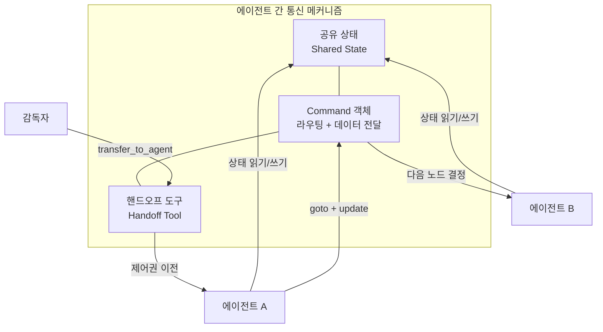
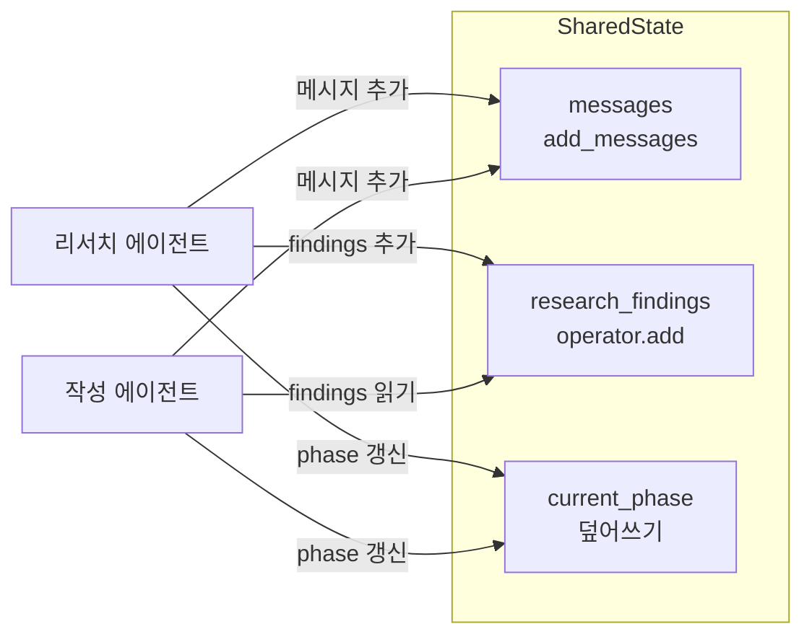
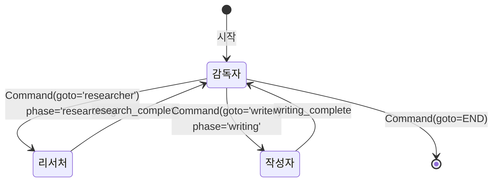
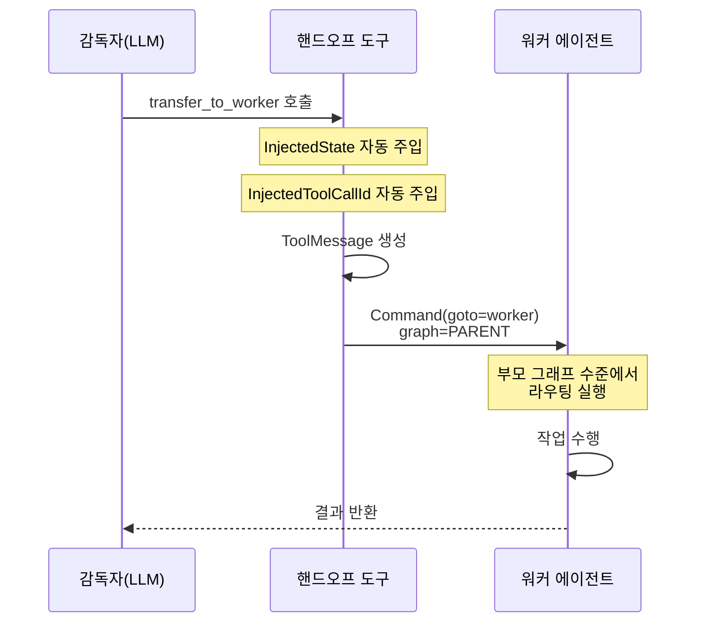
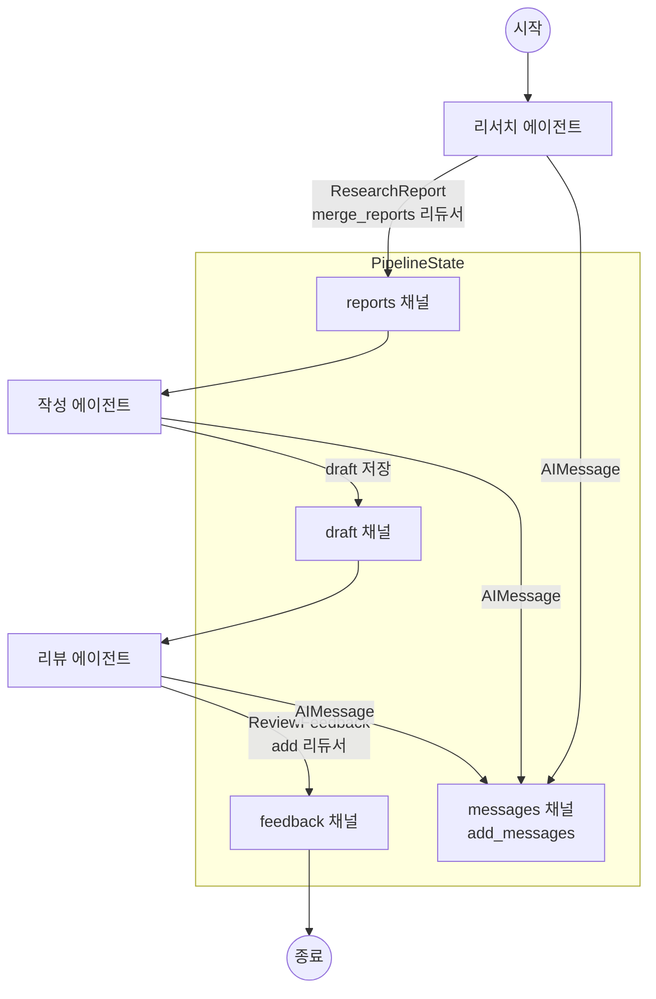

# 에이전트 간 통신

> 멀티 에이전트 시스템에서 에이전트들이 정보를 교환하고 협력하는 통신 메커니즘을 설계합니다.

## 개요

이 섹션에서는 멀티 에이전트 시스템의 핵심 인프라인 **에이전트 간 통신(Inter-agent Communication)** 을 다룹니다. 앞서 [15.1: 멀티 에이전트 아키텍처 패턴](ch15/session_15_1.md)에서 감독자, 계층적, 스웜 패턴의 구조를 배웠고, [15.2: 감독자 기반 멀티 에이전트](ch15/session_15_2.md)에서 `create_supervisor`로 워크플로우를 구성했으며, [15.3: 전문화된 에이전트 설계](ch15/session_15_3.md)에서 역할별 에이전트를 만들었습니다. 이제 이 에이전트들이 **어떻게 정보를 주고받는지**, 그 구체적인 메커니즘을 파헤쳐 보겠습니다.

**선수 지식**: LangGraph의 StateGraph 기본 사용법, 감독자 패턴의 `create_supervisor`, `create_handoff_tool`의 기본 동작 원리
**학습 목표**:
- 공유 상태(Shared State)를 통한 에이전트 간 데이터 교환 메커니즘을 이해한다
- `Annotated` 타입과 리듀서(Reducer) 함수를 활용한 상태 관리 전략을 구현할 수 있다
- `Command` 객체를 사용한 동적 라우팅과 상태 전달을 구현할 수 있다
- 커스텀 통신 프로토콜을 설계하여 에이전트 간 구조화된 메시지를 교환할 수 있다

## 왜 알아야 할까?

> 📊 **그림 1**: 멀티 에이전트 통신의 세 가지 메커니즘 개관




에이전트를 아무리 잘 만들어도, 서로 소통하지 못하면 **혼자 일하는 직원들의 모임**에 불과합니다. 실제 회사에서 팀이 성과를 내려면 회의, 문서 공유, 업무 인수인계가 필요하듯, 멀티 에이전트 시스템에서도 통신은 전체 시스템의 성능을 결정짓는 핵심 요소입니다.

실무에서 흔히 마주치는 문제들을 떠올려 보세요:
- **리서치 에이전트**가 찾은 정보를 **작성 에이전트**가 모른다면?
- **분석 에이전트**의 결과를 **보고서 에이전트**가 받지 못한다면?
- 감독자가 어떤 워커에게 작업을 넘길 때, 이전 맥락을 전부 넘겨야 할까, 요약만 넘겨야 할까?

이 세션을 마치면 이런 문제를 체계적으로 해결할 수 있는 **통신 아키텍처**를 설계할 수 있게 됩니다.


## 핵심 개념

### 개념 1: 공유 상태(Shared State) — 에이전트의 공용 칠판

> 💡 **비유**: 학교 조별 과제를 떠올려 보세요. 조원들이 각자 조사한 내용을 **하나의 공유 문서(Google Docs)** 에 적습니다. 누구나 읽을 수 있고, 자기 파트에 내용을 추가합니다. LangGraph의 공유 상태가 바로 이 공유 문서 역할을 합니다.

LangGraph에서 에이전트 간 통신의 기본 메커니즘은 **공유 상태(Shared State)** 입니다. 각 에이전트(노드)는 독립적으로 실행되지만, 모두 같은 상태 객체를 읽고 씁니다. 에이전트 A가 상태에 결과를 쓰면, 다음에 실행되는 에이전트 B가 그 결과를 읽을 수 있죠.

```python
from typing import TypedDict, Annotated
from operator import add
from langgraph.graph import StateGraph, START, END
from langgraph.graph.message import add_messages
from langchain_core.messages import BaseMessage, HumanMessage, AIMessage


# 멀티 에이전트용 공유 상태 정의
class SharedState(TypedDict):
    # 메시지 히스토리 — add_messages 리듀서로 중복 제거 & 자동 병합
    messages: Annotated[list[BaseMessage], add_messages]
    # 리서치 결과 — 여러 에이전트가 추가할 수 있도록 add 리듀서 사용
    research_findings: Annotated[list[str], add]
    # 현재 작업 단계 — 덮어쓰기 (리듀서 없음)
    current_phase: str
    # 최종 결과물
    final_output: str


# 리서치 에이전트 노드
def research_agent(state: SharedState) -> dict:
    # 상태에서 메시지를 읽어 맥락 파악
    query = state["messages"][-1].content
    # 조사 결과를 상태에 추가 (add 리듀서가 기존 리스트에 병합)
    return {
        "research_findings": [f"'{query}'에 대한 조사 결과: ..."],
        "current_phase": "research_complete",
    }


# 작성 에이전트 노드
def writer_agent(state: SharedState) -> dict:
    # 리서치 에이전트가 남긴 결과를 읽어서 활용
    findings = state["research_findings"]
    draft = f"조사 결과 {len(findings)}건을 기반으로 작성한 초안입니다."
    return {
        "final_output": draft,
        "current_phase": "writing_complete",
    }
```

여기서 핵심은 **리듀서(Reducer) 함수**입니다. 같은 상태 키에 여러 에이전트가 값을 쓸 때, 리듀서가 "어떻게 합칠지"를 결정합니다.

> 📊 **그림 2**: 공유 상태와 리듀서 동작 원리




| 리듀서 | 동작 | 용도 |
|--------|------|------|
| `add_messages` | 메시지 ID 기반 중복 제거 & 병합 | 대화 히스토리 |
| `operator.add` | 리스트/문자열 단순 연결 | 조사 결과, 로그 누적 |
| 리듀서 없음 | 마지막 값으로 덮어쓰기 | 현재 단계, 최종 결과 |
| 커스텀 함수 | 직접 정의한 병합 로직 | 투표, 점수 합산 등 |

> ⚠️ **흔한 오해**: "`operator.add`를 메시지에 쓰면 되지 않나요?" — 안 됩니다! `operator.add`는 단순 리스트 연결이라 **스트리밍 중 메시지 업데이트**나 **도구 응답 매칭** 같은 엣지 케이스를 처리하지 못합니다. 메시지에는 반드시 `add_messages`를 사용하세요.

### 개념 2: Command 객체 — 상태 업데이트 + 라우팅을 한 번에

> 💡 **비유**: 택배 기사가 물건을 배달하면서 동시에 "다음 배달지는 여기입니다"라고 경로를 지정하는 것과 같습니다. `Command`는 **무엇을 전달할지(update)** 와 **누구에게 보낼지(goto)** 를 하나의 객체로 묶어줍니다.

LangGraph의 `Command`는 노드가 반환할 수 있는 특별한 타입으로, 상태 업데이트와 다음 노드 라우팅을 동시에 수행합니다. 멀티 에이전트 시스템에서 에이전트 간 **핸드오프(Handoff)** 의 핵심 메커니즘이죠.

```python
from typing import Literal
from langgraph.types import Command
from langchain_core.messages import ToolMessage


# Command를 반환하는 에이전트 노드
def coordinator_node(state: SharedState) -> Command[Literal["researcher", "writer"]]:
    """감독자가 다음 에이전트를 결정하고 정보를 전달합니다."""
    
    phase = state.get("current_phase", "")
    
    if phase == "" or phase == "start":
        # 리서치 에이전트에게 작업 지시와 함께 제어권 전달
        return Command(
            goto="researcher",              # 다음 실행할 노드
            update={                          # 상태 업데이트
                "current_phase": "researching",
                "messages": [AIMessage(content="리서치를 시작해주세요.")],
            },
        )
    elif phase == "research_complete":
        # 리서치 완료 → 작성 에이전트에게 전달
        return Command(
            goto="writer",
            update={
                "current_phase": "writing",
                "messages": [AIMessage(content="조사 결과를 바탕으로 글을 작성해주세요.")],
            },
        )
    else:
        # 작업 완료 → 종료
        return Command(goto=END)
```

`Command`의 핵심 파라미터는 두 가지입니다:

- **`goto`**: 다음에 실행할 노드 이름 (문자열 또는 리스트)
- **`update`**: 상태에 적용할 업데이트 딕셔너리

이렇게 하면 정적인 엣지 대신 **런타임에 동적으로** 다음 에이전트를 결정하면서, 동시에 필요한 정보를 전달할 수 있습니다.

> 📊 **그림 3**: Command 객체를 통한 동적 라우팅 흐름




### 개념 3: 핸드오프 도구(Handoff Tool) — 감독자의 인수인계 메커니즘

> 💡 **비유**: 병원 응급실에서 환자를 인수인계하는 상황을 생각해 보세요. 응급의가 전문의에게 환자를 넘기면서 "환자 차트(상태 정보)"를 함께 전달합니다. 핸드오프 도구는 이 인수인계 프로토콜입니다.

[15.2: 감독자 기반 멀티 에이전트](ch15/session_15_2.md)에서 `create_handoff_tool`을 사용해 봤는데요, 이번에는 그 **내부 동작 원리**와 **커스터마이징**을 살펴보겠습니다.

```python
from typing import Annotated
from langchain_core.tools import tool, BaseTool, InjectedToolCallId
from langchain_core.messages import ToolMessage
from langgraph.types import Command
from langgraph.prebuilt import InjectedState


def create_handoff_tool(
    *,
    agent_name: str,
    description: str | None = None,
) -> BaseTool:
    """에이전트 간 제어권 이전을 위한 핸드오프 도구를 생성합니다."""
    
    tool_name = f"transfer_to_{agent_name}"
    tool_desc = description or f"{agent_name}에게 작업을 전달합니다."
    
    @tool(tool_name, description=tool_desc)
    def handoff_tool(
        # InjectedState: 현재 그래프 상태가 자동 주입됨
        state: Annotated[dict, InjectedState],
        # InjectedToolCallId: 도구 호출 ID가 자동 주입됨
        tool_call_id: Annotated[str, InjectedToolCallId],
    ) -> Command:
        # 핸드오프 완료를 알리는 도구 메시지 생성
        tool_message = ToolMessage(
            content=f"Successfully transferred to {agent_name}",
            name=tool_name,
            tool_call_id=tool_call_id,
        )
        # Command로 제어권 이전 + 상태 업데이트
        return Command(
            goto=agent_name,                           # 대상 에이전트로 이동
            update={"messages": [tool_message]},       # 메시지 히스토리 업데이트
            graph=Command.PARENT,                      # 부모 그래프 수준에서 라우팅
        )
    
    return handoff_tool
```

핵심 포인트 세 가지:

1. **`InjectedState`**: `state` 파라미터에 현재 그래프 상태가 자동으로 주입됩니다. 에이전트가 도구를 호출할 때 명시적으로 상태를 넘길 필요가 없죠.
2. **`InjectedToolCallId`**: LLM의 도구 호출 ID가 자동 주입되어, `ToolMessage`가 올바른 호출에 매칭됩니다.
3. **`graph=Command.PARENT`**: 워커 에이전트가 서브그래프로 실행될 때, 부모 그래프(감독자) 수준에서 라우팅하라는 의미입니다.

> 📊 **그림 4**: 핸드오프 도구의 내부 동작 시퀀스




### 개념 4: 커스텀 핸드오프 — 맥락 요약 전달

기본 핸드오프 도구는 **전체 메시지 히스토리**를 다음 에이전트에 넘깁니다. 하지만 실무에서는 이게 비효율적일 수 있어요. 수십 번의 대화가 오간 뒤에 핸드오프하면, 다음 에이전트가 불필요한 맥락까지 전부 처리해야 하거든요.

```python
def create_summarizing_handoff_tool(
    *,
    agent_name: str,
    description: str | None = None,
) -> BaseTool:
    """핵심 정보만 요약하여 전달하는 커스텀 핸드오프 도구"""
    
    tool_name = f"transfer_to_{agent_name}"
    tool_desc = description or f"{agent_name}에게 요약된 맥락과 함께 작업을 전달합니다."

    @tool(tool_name, description=tool_desc)
    def handoff_with_summary(
        # 감독자가 직접 작성하는 작업 지시사항
        task_description: Annotated[
            str, "다음 에이전트가 수행할 작업에 대한 구체적인 설명"
        ],
        # 감독자가 정리한 핵심 맥락
        key_context: Annotated[
            str, "이전 작업에서 도출된 핵심 정보 요약"
        ],
        state: Annotated[dict, InjectedState],
        tool_call_id: Annotated[str, InjectedToolCallId],
    ) -> Command:
        # 요약된 맥락을 포함한 메시지 생성
        handoff_message = ToolMessage(
            content=(
                f"[핸드오프: {agent_name}]\n"
                f"작업: {task_description}\n"
                f"맥락: {key_context}"
            ),
            name=tool_name,
            tool_call_id=tool_call_id,
        )
        return Command(
            goto=agent_name,
            update={"messages": [handoff_message]},
            graph=Command.PARENT,
        )
    
    return handoff_with_summary
```

이 방식은 **감독자(LLM)가 직접 핵심 정보를 요약**하여 다음 에이전트에 전달합니다. 토큰 사용량을 줄이면서도 필요한 맥락을 놓치지 않는 균형을 잡을 수 있죠.

### 개념 5: 커스텀 상태 채널을 이용한 구조화된 통신

메시지 히스토리만으로는 부족한 경우가 있습니다. 에이전트 간에 **구조화된 데이터**를 교환해야 할 때는 커스텀 상태 채널을 설계합니다.

> 💡 **비유**: 회사에서 구두 보고(메시지)만으로는 정보가 누락되거나 왜곡되기 쉽죠. 그래서 **정형화된 보고서 양식**을 사용합니다. 커스텀 상태 채널은 이 보고서 양식에 해당합니다.

```python
from typing import TypedDict, Annotated
from operator import add
from pydantic import BaseModel, Field
from langgraph.graph.message import add_messages
from langchain_core.messages import BaseMessage


# 에이전트 간 교환할 구조화된 데이터 모델
class ResearchReport(BaseModel):
    """리서치 에이전트가 생성하는 조사 보고서"""
    topic: str = Field(description="조사 주제")
    findings: list[str] = Field(description="핵심 발견사항 목록")
    confidence: float = Field(description="결과 신뢰도 (0.0~1.0)")
    sources: list[str] = Field(default_factory=list, description="참고 출처")


class ReviewFeedback(BaseModel):
    """리뷰 에이전트가 생성하는 피드백"""
    approved: bool = Field(description="승인 여부")
    comments: list[str] = Field(default_factory=list, description="피드백 코멘트")
    score: int = Field(ge=1, le=10, description="품질 점수 (1~10)")


# 커스텀 리듀서: 보고서를 주제별로 병합
def merge_reports(
    existing: list[ResearchReport], new: list[ResearchReport]
) -> list[ResearchReport]:
    """같은 주제의 보고서는 findings를 합치고, 새 주제는 추가합니다."""
    merged = {r.topic: r for r in existing}
    for report in new:
        if report.topic in merged:
            old = merged[report.topic]
            merged[report.topic] = ResearchReport(
                topic=report.topic,
                findings=old.findings + report.findings,
                confidence=max(old.confidence, report.confidence),
                sources=list(set(old.sources + report.sources)),
            )
        else:
            merged[report.topic] = report
    return list(merged.values())


# 구조화된 통신을 지원하는 상태 정의
class StructuredAgentState(TypedDict):
    messages: Annotated[list[BaseMessage], add_messages]
    # 구조화된 보고서 채널 (커스텀 리듀서)
    reports: Annotated[list[ResearchReport], merge_reports]
    # 리뷰 피드백 채널 (단순 누적)
    feedback: Annotated[list[ReviewFeedback], add]
    # 작업 상태
    current_phase: str
```

이렇게 Pydantic 모델로 구조화하면 세 가지 이점이 있습니다:

1. **타입 안전성**: 에이전트가 잘못된 형식의 데이터를 보낼 수 없습니다
2. **자동 검증**: `confidence`가 0~1 범위인지, `score`가 1~10인지 자동 검증됩니다
3. **커스텀 병합**: `merge_reports`처럼 도메인에 맞는 병합 로직을 정의할 수 있습니다

## 실습: 직접 해보기

> 📊 **그림 5**: 실습 파이프라인 — 구조화된 통신 채널을 통한 3단계 협업




리서치 → 작성 → 리뷰의 3단계 파이프라인을 **구조화된 통신**으로 구현해 보겠습니다. 각 에이전트가 커스텀 상태 채널을 통해 구조화된 데이터를 주고받는 완전한 예제입니다.

```python
"""
멀티 에이전트 구조화 통신 실습
- 리서치 에이전트: 주제를 조사하여 ResearchReport 생성
- 작성 에이전트: 보고서를 기반으로 초안 작성
- 리뷰 에이전트: 초안을 검토하여 ReviewFeedback 생성
"""

import os
from typing import TypedDict, Annotated, Literal
from operator import add

from dotenv import load_dotenv
from pydantic import BaseModel, Field
from langchain_openai import ChatOpenAI
from langchain_core.messages import (
    BaseMessage,
    HumanMessage,
    AIMessage,
    SystemMessage,
)
from langgraph.graph import StateGraph, START, END
from langgraph.graph.message import add_messages
from langgraph.types import Command

load_dotenv()

# --- 1. 데이터 모델 정의 ---

class ResearchReport(BaseModel):
    """리서치 에이전트가 생성하는 조사 보고서"""
    topic: str = Field(description="조사 주제")
    findings: list[str] = Field(description="핵심 발견사항")
    confidence: float = Field(ge=0.0, le=1.0, description="신뢰도")


class ReviewFeedback(BaseModel):
    """리뷰 에이전트가 생성하는 피드백"""
    approved: bool = Field(description="승인 여부")
    comments: list[str] = Field(default_factory=list, description="코멘트")
    score: int = Field(ge=1, le=10, description="품질 점수")


# --- 2. 커스텀 리듀서 ---

def merge_reports(
    existing: list[ResearchReport], new: list[ResearchReport]
) -> list[ResearchReport]:
    """동일 주제의 보고서는 findings를 합치고, 신뢰도는 높은 값을 유지합니다."""
    merged = {r.topic: r for r in existing}
    for report in new:
        if report.topic in merged:
            old = merged[report.topic]
            merged[report.topic] = ResearchReport(
                topic=report.topic,
                findings=old.findings + report.findings,
                confidence=max(old.confidence, report.confidence),
            )
        else:
            merged[report.topic] = report
    return list(merged.values())


# --- 3. 공유 상태 정의 ---

class PipelineState(TypedDict):
    messages: Annotated[list[BaseMessage], add_messages]
    reports: Annotated[list[ResearchReport], merge_reports]
    feedback: Annotated[list[ReviewFeedback], add]
    draft: str
    current_phase: str


# --- 4. 에이전트 노드 구현 ---

MODEL_NAME = "gpt-4o"
llm = ChatOpenAI(model=MODEL_NAME, temperature=0.7)


def research_node(state: PipelineState) -> dict:
    """리서치 에이전트: 주제를 조사하고 구조화된 보고서를 생성합니다."""
    
    # 메시지에서 조사 주제 추출
    user_query = ""
    for msg in reversed(state["messages"]):
        if isinstance(msg, HumanMessage):
            user_query = msg.content
            break
    
    # LLM을 사용한 조사 (실제로는 검색 도구 연동)
    response = llm.invoke([
        SystemMessage(content=(
            "당신은 리서치 전문가입니다. 주어진 주제에 대해 "
            "핵심 발견사항 3가지를 간결하게 정리해주세요."
        )),
        HumanMessage(content=f"조사 주제: {user_query}"),
    ])
    
    # 구조화된 보고서 생성 → reports 채널에 전달
    report = ResearchReport(
        topic=user_query,
        findings=response.content.split("\n")[:3],  # 상위 3개 발견사항
        confidence=0.85,
    )
    
    return {
        "reports": [report],  # merge_reports 리듀서가 처리
        "current_phase": "research_done",
        "messages": [AIMessage(
            content=f"[리서치 완료] {user_query}에 대해 {len(report.findings)}건의 발견사항을 보고합니다.",
            name="researcher",
        )],
    }


def writer_node(state: PipelineState) -> dict:
    """작성 에이전트: 리서치 보고서를 읽고 초안을 작성합니다."""
    
    # reports 채널에서 구조화된 데이터를 직접 읽음
    reports = state.get("reports", [])
    findings_text = ""
    for report in reports:
        findings_text += f"\n주제: {report.topic} (신뢰도: {report.confidence})\n"
        for i, finding in enumerate(report.findings, 1):
            findings_text += f"  {i}. {finding}\n"
    
    response = llm.invoke([
        SystemMessage(content=(
            "당신은 기술 문서 작성 전문가입니다. "
            "리서치 결과를 바탕으로 명확하고 읽기 쉬운 초안을 작성해주세요."
        )),
        HumanMessage(content=f"다음 리서치 결과를 기반으로 초안을 작성해주세요:\n{findings_text}"),
    ])
    
    return {
        "draft": response.content,
        "current_phase": "writing_done",
        "messages": [AIMessage(
            content=f"[작성 완료] 초안이 준비되었습니다. ({len(response.content)}자)",
            name="writer",
        )],
    }


def review_node(state: PipelineState) -> dict:
    """리뷰 에이전트: 초안을 검토하고 구조화된 피드백을 생성합니다."""
    
    draft = state.get("draft", "")
    
    response = llm.invoke([
        SystemMessage(content=(
            "당신은 편집장입니다. 초안을 검토하고 다음 형식으로 피드백을 주세요:\n"
            "- 승인 여부 (예/아니오)\n"
            "- 점수 (1~10)\n"
            "- 개선 사항"
        )),
        HumanMessage(content=f"다음 초안을 검토해주세요:\n\n{draft}"),
    ])
    
    # 구조화된 피드백 생성 → feedback 채널에 전달
    feedback = ReviewFeedback(
        approved=True,
        comments=[response.content],
        score=8,
    )
    
    return {
        "feedback": [feedback],  # add 리듀서가 리스트에 추가
        "current_phase": "review_done",
        "messages": [AIMessage(
            content=f"[리뷰 완료] 점수: {feedback.score}/10, 승인: {feedback.approved}",
            name="reviewer",
        )],
    }


# --- 5. 라우팅 함수 ---

def route_by_phase(state: PipelineState) -> str:
    """현재 단계에 따라 다음 에이전트를 결정합니다."""
    phase = state.get("current_phase", "")
    if phase == "research_done":
        return "writer"
    elif phase == "writing_done":
        return "reviewer"
    else:
        return END


# --- 6. 그래프 구성 ---

graph = StateGraph(PipelineState)

# 노드 등록
graph.add_node("researcher", research_node)
graph.add_node("writer", writer_node)
graph.add_node("reviewer", review_node)

# 엣지 정의
graph.add_edge(START, "researcher")
graph.add_conditional_edges("researcher", route_by_phase)
graph.add_conditional_edges("writer", route_by_phase)
graph.add_edge("reviewer", END)

# 컴파일
app = graph.compile()


# --- 7. 실행 ---

def run_pipeline(topic: str):
    """파이프라인을 실행하고 각 단계의 통신 내용을 출력합니다."""
    
    initial_state = {
        "messages": [HumanMessage(content=topic)],
        "reports": [],
        "feedback": [],
        "draft": "",
        "current_phase": "start",
    }
    
    print(f"{'='*60}")
    print(f"주제: {topic}")
    print(f"{'='*60}\n")
    
    # 스트리밍으로 각 단계 관찰
    for event in app.stream(initial_state, stream_mode="updates"):
        for node_name, update in event.items():
            print(f"--- [{node_name}] ---")
            
            # 메시지 채널 확인
            if "messages" in update:
                for msg in update["messages"]:
                    print(f"  메시지: {msg.content[:100]}")
            
            # 구조화된 데이터 채널 확인
            if "reports" in update:
                for r in update["reports"]:
                    print(f"  보고서: {r.topic} (신뢰도 {r.confidence})")
            
            if "feedback" in update:
                for f in update["feedback"]:
                    print(f"  피드백: 점수={f.score}, 승인={f.approved}")
            
            if "draft" in update:
                print(f"  초안: {update['draft'][:80]}...")
            
            print()
    
    # 최종 상태 확인
    final = app.invoke(initial_state)
    print(f"{'='*60}")
    print(f"최종 단계: {final['current_phase']}")
    print(f"보고서 수: {len(final['reports'])}")
    print(f"피드백 수: {len(final['feedback'])}")
    print(f"{'='*60}")


# 실행
# run_pipeline("LangGraph의 멀티 에이전트 통신 패턴")
```

**실행 결과 (예시)**:
```
============================================================
주제: LangGraph의 멀티 에이전트 통신 패턴
============================================================

--- [researcher] ---
  메시지: [리서치 완료] LangGraph의 멀티 에이전트 통신 패턴에 대해 3건의 발견사항을 보고합니다.
  보고서: LangGraph의 멀티 에이전트 통신 패턴 (신뢰도 0.85)

--- [writer] ---
  메시지: [작성 완료] 초안이 준비되었습니다. (1247자)
  초안: LangGraph의 멀티 에이전트 통신 패턴은 공유 상태를 중심으로...

--- [reviewer] ---
  메시지: [리뷰 완료] 점수: 8/10, 승인: True
  피드백: 점수=8, 승인=True

============================================================
최종 단계: review_done
보고서 수: 1
피드백 수: 1
============================================================
```

## 더 깊이 알아보기

### 액터 모델(Actor Model) — 에이전트 통신의 이론적 뿌리

LangGraph의 에이전트 통신 방식을 제대로 이해하려면, 컴퓨터 과학의 고전인 **액터 모델(Actor Model)** 을 알아둘 필요가 있습니다.

1973년, MIT의 **칼 휴잇(Carl Hewitt)**, 피터 비숍, 리처드 스타이거가 [*"A Universal Modular ACTOR Formalism for Artificial Intelligence"*](https://eighty-twenty.org/files/Hewitt,%20Bishop,%20Steiger%20-%201973%20-%20A%20universal%20modular%20ACTOR%20formalism%20for%20artificial%20intelligence.pdf)라는 논문을 발표했습니다. 이 논문의 핵심 아이디어는 놀랍도록 단순했습니다: **"모든 것은 액터(Actor)이고, 액터는 메시지를 주고받는 것만으로 소통한다."**

액터가 메시지를 받으면 세 가지만 할 수 있습니다:
1. **지역적 결정**(local decisions)을 내린다
2. **새로운 액터를 생성**한다
3. **다른 액터에게 메시지를 보낸다**

여기서 중요한 점은, 액터는 **자기 내부 상태만 직접 수정**할 수 있고, 다른 액터에게는 **오직 메시지를 통해서만** 영향을 줄 수 있다는 것입니다. 이 원칙 덕분에 락(lock) 기반의 동기화가 필요 없어집니다.

LangGraph는 순수한 액터 모델과는 다르게 **공유 상태**를 도입했습니다. 전통적 액터 모델에서는 각 액터가 독립적인 메시지 큐를 가지지만, LangGraph에서는 모든 노드가 하나의 상태 객체를 공유합니다. 이 차이가 의미하는 바는 흥미롭습니다 — LangGraph는 엄밀히 말해 **"공유 칠판(Shared Blackboard)" 아키텍처**에 더 가깝습니다. AI 연구 초기에 사용되던 칠판 시스템(Blackboard System)에서 여러 "지식 소스(Knowledge Source)"가 하나의 칠판에 읽고 쓰며 문제를 풀었던 것과 같은 원리죠.


> 💡 **알고 계셨나요?**: 칼 휴잇의 1973년 논문은 원래 **인공지능을 위한** 계산 모델로 제안되었습니다. 50년이 지난 지금, LLM 기반 멀티 에이전트 시스템에서 그 아이디어가 다시 활용되고 있다니, 역사가 돌고 도는 셈이죠!

### 메시지 히스토리 관리 전략

실무에서 멀티 에이전트 시스템을 운영하다 보면 **메시지 히스토리 폭발** 문제에 직면합니다. 감독자와 여러 워커 사이를 오가면서 메시지가 계속 쌓이면, 컨텍스트 윈도우를 초과하거나 토큰 비용이 급증하죠.

`langgraph-supervisor`의 `output_mode` 파라미터가 이 문제를 해결합니다:

| `output_mode` | 동작 | 용도 |
|---------------|------|------|
| `"full_history"` | 모든 워커 메시지를 감독자에게 전달 | 맥락이 중요한 경우 |
| `"last_message"` | 워커의 마지막 메시지만 감독자에게 전달 | 토큰 절약 |

```python
from langgraph_supervisor import create_supervisor

# 토큰 효율적인 설정
supervisor = create_supervisor(
    agents=[researcher, writer, reviewer],
    model=llm,
    output_mode="last_message",  # 워커 응답의 마지막 메시지만 감독자에게 전달
)
```

## 흔한 오해와 팁

> ⚠️ **흔한 오해**: "에이전트 간 통신은 메시지만 주고받으면 되는 거 아닌가요?" — 메시지 채널(`messages`)은 자연어 기반의 비정형 통신입니다. 구조화된 데이터(조사 결과, 점수, 승인 여부 등)를 메시지로만 전달하면 파싱 오류가 발생하기 쉽습니다. **Pydantic 모델 기반의 커스텀 상태 채널**을 함께 활용하세요.

> 💡 **알고 계셨나요?**: `add_messages` 리듀서는 단순히 메시지를 연결하는 것이 아닙니다. **메시지 ID 기반으로 중복을 제거**하고, 같은 ID의 메시지가 오면 **기존 메시지를 업데이트**합니다. 이 덕분에 스트리밍 중에 부분 응답이 오더라도 깔끔하게 처리됩니다.

> 🔥 **실무 팁**: `operator.add` 리듀서를 리스트 상태에 사용할 때 주의하세요! 도구가 상태를 업데이트할 때 중복 호출되면 **지수적으로 데이터가 뻥튀기**될 수 있습니다. 이를 방지하려면 커스텀 리듀서에 **중복 체크 로직**을 넣거나, 도구 호출이 한 번만 발생하도록 그래프 구조를 설계하세요.

> 🔥 **실무 팁**: 커스텀 핸드오프에서 `task_description`을 감독자에게 직접 작성하게 하면, 감독자가 **핵심 정보만 추려서** 다음 에이전트에 전달합니다. 전체 히스토리를 넘기는 것 대비 토큰 사용량을 50~70% 절감할 수 있습니다.

## 핵심 정리

| 개념 | 설명 |
|------|------|
| 공유 상태(Shared State) | 모든 에이전트 노드가 읽고 쓰는 공용 딕셔너리. LangGraph 통신의 기본 메커니즘 |
| 리듀서(Reducer) | 여러 노드가 같은 키에 값을 쓸 때 병합 방법을 정의하는 함수 (`add_messages`, `operator.add`, 커스텀) |
| `Command` 객체 | `goto`(다음 노드)와 `update`(상태 변경)를 묶어 동적 라우팅과 데이터 전달을 동시 수행 |
| 핸드오프 도구 | 감독자가 워커에게 제어권을 넘기는 도구. `InjectedState`와 `InjectedToolCallId`로 자동 주입 |
| 커스텀 핸드오프 | `task_description` 등 추가 인자로 요약된 맥락만 전달하여 토큰 절약 |
| 커스텀 상태 채널 | Pydantic 모델 + 커스텀 리듀서로 구조화된 데이터를 타입 안전하게 교환 |
| `output_mode` | `"full_history"` vs `"last_message"`로 감독자에 전달되는 메시지량 제어 |

## 다음 섹션 미리보기

이번 세션에서 에이전트 간 통신의 메커니즘을 배웠다면, 다음 세션 **[15.5: 멀티 에이전트 디버깅과 최적화](ch15/session_15_5.md)** 에서는 이 통신이 **제대로 작동하는지 어떻게 확인하고, 문제가 생겼을 때 어떻게 디버깅하는지**를 다룹니다. LangSmith를 활용한 트레이싱, 에이전트 간 병목 탐지, 그리고 성능 최적화 전략까지 — 프로덕션 수준의 멀티 에이전트 시스템을 완성하는 마지막 퍼즐 조각을 맞춰보겠습니다.

## 참고 자료

- [LangGraph 공식 문서 — Multi-agent Systems](https://langchain-ai.github.io/langgraphjs/concepts/multi_agent/) - 멀티 에이전트 아키텍처의 통신 패턴과 핸드오프 개념을 공식 문서에서 확인할 수 있습니다
- [LangChain Blog — Command: A new tool for multi-agent architectures in LangGraph](https://blog.langchain.com/command-a-new-tool-for-multi-agent-architectures-in-langgraph/) - `Command` 객체의 설계 의도와 멀티 에이전트 라우팅 활용법을 소개한 공식 블로그 포스트
- [langgraph-supervisor GitHub 저장소](https://github.com/langchain-ai/langgraph-supervisor-py) - 핸드오프 도구 구현 코드(`create_handoff_tool`, `create_forward_message_tool`)를 직접 확인할 수 있는 소스 코드
- [LangChain 공식 문서 — Handoffs](https://docs.langchain.com/oss/python/langchain/multi-agent/handoffs) - 핸드오프의 상세 메커니즘과 `add_handoff_back_messages`에 대한 공식 레퍼런스
- [How Agent Handoffs Work in Multi-Agent Systems — Towards Data Science](https://towardsdatascience.com/how-agent-handoffs-work-in-multi-agent-systems/) - 핸드오프의 내부 동작 원리를 시각적으로 설명한 심화 글

---
### 🔗 Related Sessions
- [stategraph](../01-langchain-소개와-개발-환경-설정/05-langchain-생태계-탐색.md) (prerequisite)
- [supervisor_pattern](../15-멀티-에이전트-시스템/01-멀티-에이전트-아키텍처-패턴.md) (prerequisite)
- [create_supervisor](../15-멀티-에이전트-시스템/01-멀티-에이전트-아키텍처-패턴.md) (prerequisite)
- [handoff](../15-멀티-에이전트-시스템/01-멀티-에이전트-아키텍처-패턴.md) (prerequisite)
- [worker_agent](../15-멀티-에이전트-시스템/02-감독자-기반-멀티-에이전트.md) (prerequisite)
- [create_handoff_tool](../15-멀티-에이전트-시스템/01-멀티-에이전트-아키텍처-패턴.md) (prerequisite)
