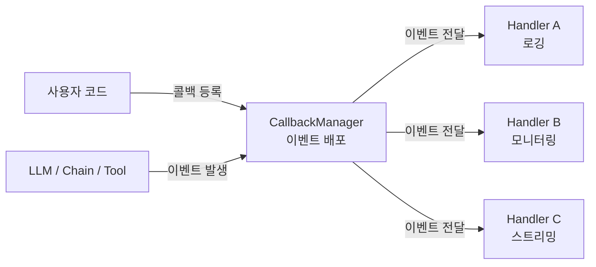
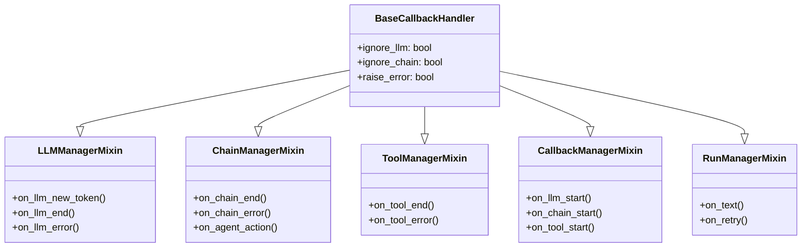
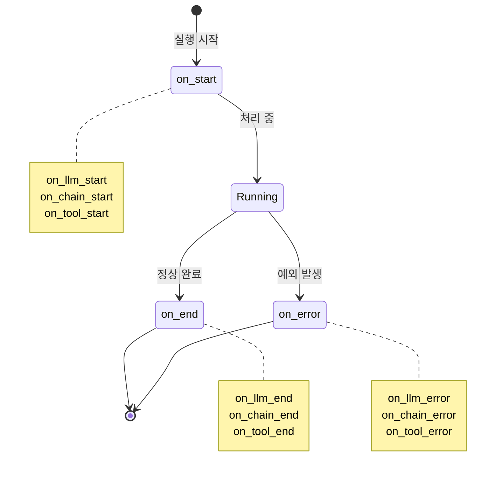
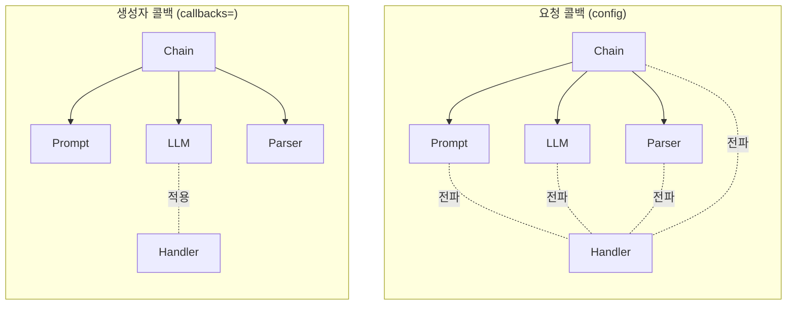
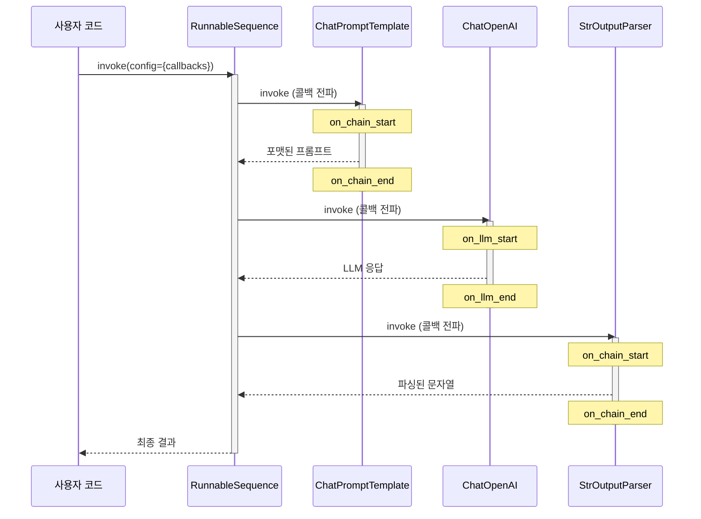

# 콜백 시스템 이해

> LangChain의 콜백(Callback) 시스템을 이해하고, 애플리케이션 실행 과정을 들여다보는 "관찰의 눈"을 만들어 봅니다.

## 개요

이 섹션에서는 LangChain이 내부적으로 어떻게 실행 이벤트를 추적하고 외부에 알려주는지, 그 핵심 메커니즘인 **콜백 시스템**을 배웁니다. 콜백은 LLM 호출, 체인 실행, 도구 사용 등 모든 단계에서 발생하는 이벤트를 감지하고 처리할 수 있게 해주는 일종의 "이벤트 리스너"입니다.

**선수 지식**: 앞서 배운 LCEL 체인 구성(Ch5), 도구와 함수 호출(Ch11), 에이전트 기초(Ch12)에 대한 이해가 있으면 콜백이 어디서 발동되는지 훨씬 직관적으로 이해할 수 있습니다.

**학습 목표**:
- `BaseCallbackHandler`와 `AsyncCallbackHandler`의 구조와 역할을 이해한다
- 콜백 이벤트의 종류(`on_llm_start`, `on_chain_end` 등)와 생명주기를 파악한다
- 생성자 콜백과 요청 콜백의 차이, 그리고 콜백 전파(Propagation) 원리를 이해한다
- 커스텀 콜백 핸들러를 직접 작성할 수 있다

## 왜 알아야 할까?

여러분이 LangChain으로 RAG 시스템이나 에이전트를 만들었다고 상상해 보세요. 잘 동작하는 것 같은데, 가끔 응답이 느리거나, 예상과 다른 결과가 나옵니다. 이때 **"내부에서 정확히 무슨 일이 일어나고 있는지"** 알 수 있다면 얼마나 좋을까요?

콜백 시스템은 바로 이 문제를 해결합니다. 실무에서 콜백은 다음과 같은 상황에서 필수적인데요:

- **디버깅**: LLM에 어떤 프롬프트가 전달됐는지, 어떤 토큰이 생성됐는지 실시간 추적
- **모니터링**: 각 단계의 소요 시간, 토큰 사용량, 에러 발생 빈도 측정
- **스트리밍**: 사용자에게 토큰이 생성되는 대로 실시간 출력
- **로깅**: 프로덕션 환경에서 모든 LLM 호출 기록을 남기기
- **비용 추적**: API 호출마다 사용된 토큰 수를 집계하여 비용 관리

LangSmith 같은 관찰 가능성(Observability) 플랫폼도 내부적으로 이 콜백 시스템 위에 구축되어 있거든요. 콜백을 이해하면 LangChain 애플리케이션의 "블랙박스"를 열어볼 수 있게 됩니다.

## 핵심 개념

### 개념 1: 콜백이란 무엇인가 — 옵서버 패턴

> 💡 **비유**: 병원의 대기번호 시스템을 떠올려 보세요. 환자(핸들러)가 접수 시 번호표를 받아두면, 본인 차례(이벤트)가 됐을 때 전광판이 자동으로 알려줍니다. 환자가 계속 창구를 기웃거릴 필요 없이, **"내 차례가 되면 알려줘"**라고 등록만 해두면 되는 거죠. 콜백도 똑같습니다 — 관심 있는 이벤트에 핸들러를 등록해두면, 해당 이벤트가 발생할 때 자동으로 호출됩니다.

LangChain의 콜백 시스템은 소프트웨어 설계에서 유명한 **옵서버 패턴(Observer Pattern)**을 기반으로 합니다. 핵심 구조는 세 가지로 나뉩니다:

| 구성 요소 | 역할 | LangChain에서의 대응 |
|-----------|------|---------------------|
| **핸들러(Handler)** | 이벤트를 받아 처리하는 로직 | `BaseCallbackHandler` |
| **매니저(Manager)** | 여러 핸들러를 관리하고 이벤트를 배포 | `CallbackManager` |
| **설정(Config)** | 콜백을 실행 체인에 전달하는 수단 | `RunnableConfig` |

> 📊 **그림 1**: 콜백 시스템의 옵서버 패턴 구조




```python
from langchain_core.callbacks import BaseCallbackHandler
from langchain_openai import ChatOpenAI

# 1. 핸들러 정의: "이벤트가 오면 이렇게 처리해줘"
class MyHandler(BaseCallbackHandler):
    def on_llm_start(self, serialized, prompts, **kwargs):
        print(f"🚀 LLM 호출 시작! 프롬프트: {prompts[0][:50]}...")

    def on_llm_end(self, response, **kwargs):
        print(f"✅ LLM 응답 완료!")

# 2. 핸들러를 등록하고 실행
llm = ChatOpenAI(model="gpt-4o", temperature=0)
result = llm.invoke("안녕하세요!", config={"callbacks": [MyHandler()]})
# 출력:
# 🚀 LLM 호출 시작! 프롬프트: 안녕하세요!...
# ✅ LLM 응답 완료!
```

### 개념 2: BaseCallbackHandler의 구조

> 💡 **비유**: `BaseCallbackHandler`는 일종의 **빈 양식지**입니다. "LLM이 시작될 때", "체인이 끝날 때", "에러가 날 때" 등 각 칸이 비어 있고, 여러분은 관심 있는 칸만 채우면 됩니다. 나머지 빈 칸은 그냥 무시됩니다.

`BaseCallbackHandler`는 여러 Mixin 클래스를 상속받아 모든 이벤트 메서드를 하나의 클래스에 모아둡니다:

> 📊 **그림 2**: BaseCallbackHandler의 Mixin 상속 구조




```
BaseCallbackHandler
├── LLMManagerMixin        → on_llm_new_token, on_llm_end, on_llm_error
├── ChainManagerMixin      → on_chain_end, on_chain_error, on_agent_action, on_agent_finish
├── ToolManagerMixin       → on_tool_end, on_tool_error
├── RetrieverManagerMixin  → on_retriever_end, on_retriever_error
├── CallbackManagerMixin   → on_llm_start, on_chat_model_start, on_chain_start,
│                            on_tool_start, on_retriever_start
└── RunManagerMixin        → on_text, on_retry, on_custom_event
```

**주요 이벤트 메서드 정리:**

| 메서드 | 발동 시점 | 주요 파라미터 |
|--------|----------|-------------|
| `on_llm_start` | LLM 호출 시작 | `serialized`, `prompts`, `run_id` |
| `on_chat_model_start` | Chat 모델 호출 시작 | `serialized`, `messages`, `run_id` |
| `on_llm_new_token` | 새 토큰 생성 시 | `token`, `chunk`, `run_id` |
| `on_llm_end` | LLM 응답 완료 | `response`, `run_id` |
| `on_llm_error` | LLM 에러 발생 | `error`, `run_id` |
| `on_chain_start` | 체인 실행 시작 | `serialized`, `inputs`, `run_id` |
| `on_chain_end` | 체인 실행 완료 | `outputs`, `run_id` |
| `on_tool_start` | 도구 호출 시작 | `serialized`, `input_str`, `run_id` |
| `on_tool_end` | 도구 실행 완료 | `output`, `run_id` |
| `on_retriever_start` | 검색 시작 | `serialized`, `query`, `run_id` |
| `on_retriever_end` | 검색 완료 | `documents`, `run_id` |

모든 이벤트 메서드는 `run_id`(현재 실행의 고유 ID)와 `parent_run_id`(부모 실행의 ID)를 받습니다. 이 두 ID가 실행 계층 구조를 추적하는 핵심 열쇠인데요, 예를 들어 에이전트가 도구를 호출하면 도구의 `parent_run_id`가 에이전트의 `run_id`를 가리키게 됩니다.

> 📊 **그림 3**: 콜백 이벤트 생명주기 — start / end / error 패턴




```python
from langchain_core.callbacks import BaseCallbackHandler
from uuid import UUID

class DetailedHandler(BaseCallbackHandler):
    """실행 계층을 추적하는 상세 핸들러"""

    def on_chain_start(self, serialized, inputs, *, run_id: UUID,
                       parent_run_id: UUID | None = None, **kwargs):
        name = serialized.get("name", "Unknown")
        parent = f" (부모: {parent_run_id})" if parent_run_id else " (최상위)"
        print(f"⛓️ 체인 시작: {name} [ID: {run_id}]{parent}")

    def on_llm_start(self, serialized, prompts, *, run_id: UUID,
                     parent_run_id: UUID | None = None, **kwargs):
        model = serialized.get("kwargs", {}).get("model_name", "unknown")
        print(f"🤖 LLM 시작: {model} [ID: {run_id}]")

    def on_llm_new_token(self, token: str, **kwargs):
        # 스트리밍 시 토큰 하나하나를 출력
        print(token, end="", flush=True)

    def on_llm_end(self, response, **kwargs):
        # 토큰 사용량 추적
        if hasattr(response, "llm_output") and response.llm_output:
            usage = response.llm_output.get("token_usage", {})
            print(f"\n📊 토큰 사용: {usage}")
```

### 개념 3: 콜백 핸들러의 제어 속성

`BaseCallbackHandler`에는 특정 이벤트를 무시하거나 에러 처리 방식을 제어하는 속성들이 있습니다:

```python
class SelectiveHandler(BaseCallbackHandler):
    """특정 이벤트만 선택적으로 처리하는 핸들러"""

    # 이 속성들을 True로 설정하면 해당 이벤트를 무시합니다
    ignore_llm = False          # LLM 이벤트 무시 여부
    ignore_chain = True         # 체인 이벤트 무시 (체인이 많으면 노이즈가 심함)
    ignore_agent = False        # 에이전트 이벤트 무시 여부
    ignore_retriever = False    # 검색기 이벤트 무시 여부
    ignore_retry = True         # 재시도 이벤트 무시
    ignore_chat_model = False   # 채팅 모델 이벤트 무시 여부
    ignore_custom_event = False # 커스텀 이벤트 무시 여부

    # 에러 발생 시 예외를 그대로 던질지 여부 (기본: False → 경고만 출력)
    raise_error = False

    # True면 다른 핸들러보다 먼저 동기적으로 실행
    run_inline = False

    def on_llm_start(self, serialized, prompts, **kwargs):
        print("🤖 LLM 이벤트만 추적합니다")
```

> ⚠️ **흔한 오해**: `ignore_llm = True`로 설정하면 LLM 자체가 실행되지 않는다고 생각하는 분들이 있는데요, 그렇지 않습니다! LLM은 정상 실행되고, 해당 핸들러가 LLM 관련 이벤트를 **받지 않을 뿐**입니다. 무시(ignore)는 "실행 차단"이 아니라 "알림 구독 해제"입니다.

### 개념 4: 생성자 콜백 vs 요청 콜백

> 💡 **비유**: 아파트 관리사무소에 비유해 볼게요. **생성자 콜백**은 입주할 때 등록하는 "항상 받을 우편물 목록"이고, **요청 콜백**은 특정 택배를 기다릴 때만 알림을 요청하는 것입니다. 생성자 콜백은 해당 객체의 모든 호출에 적용되고, 요청 콜백은 그 한 번의 호출(과 그 하위 호출)에만 적용됩니다.

LangChain에서 콜백을 등록하는 방법은 두 가지입니다:

**방법 1: 생성자 콜백 (Constructor Callbacks)**

```python
from langchain_core.callbacks import BaseCallbackHandler
from langchain_openai import ChatOpenAI

class LoggingHandler(BaseCallbackHandler):
    def on_llm_start(self, serialized, prompts, **kwargs):
        print(f"[LOG] LLM 호출 시작")
    def on_llm_end(self, response, **kwargs):
        print(f"[LOG] LLM 호출 완료")

# 생성자에 콜백 등록 → 이 LLM의 모든 호출에 적용
llm = ChatOpenAI(model="gpt-4o", callbacks=[LoggingHandler()])

# 모든 invoke에서 LoggingHandler가 동작
llm.invoke("첫 번째 질문")   # [LOG] LLM 호출 시작 / [LOG] LLM 호출 완료
llm.invoke("두 번째 질문")   # [LOG] LLM 호출 시작 / [LOG] LLM 호출 완료
```

**방법 2: 요청 콜백 (Request Callbacks)**

```python
class RequestHandler(BaseCallbackHandler):
    def __init__(self, request_id: str):
        self.request_id = request_id

    def on_llm_start(self, serialized, prompts, **kwargs):
        print(f"[{self.request_id}] LLM 호출 시작")

llm = ChatOpenAI(model="gpt-4o")

# config로 전달 → 이 한 번의 호출에만 적용
llm.invoke("질문", config={"callbacks": [RequestHandler("req-001")]})
# [req-001] LLM 호출 시작

# 다음 호출에는 적용되지 않음
llm.invoke("다른 질문")  # 아무 로그 없음
```

**두 방식의 핵심 차이:**

| 특성 | 생성자 콜백 | 요청 콜백 |
|------|-----------|----------|
| 적용 범위 | 해당 객체의 모든 호출 | 해당 요청 1회 + 하위 호출 |
| 전파 여부 | 해당 객체에만 적용 (자식 전파 ✗) | 모든 하위 객체에 전파 (✓) |
| 용도 | 항상 켜둘 모니터링, 기본 로깅 | 요청별 트레이싱, 웹소켓 스트리밍 |

> 📊 **그림 4**: 생성자 콜백 vs 요청 콜백 — 전파 범위 비교




### 개념 5: 콜백 전파와 스코프

콜백 전파(Propagation)는 상당히 중요한 개념인데요. 요청 콜백으로 전달된 핸들러는 실행 체인의 **모든 하위 컴포넌트**로 자동 전파됩니다.

> 📊 **그림 5**: LCEL 체인에서 요청 콜백의 전파 흐름




```python
from langchain_core.prompts import ChatPromptTemplate
from langchain_core.output_parsers import StrOutputParser
from langchain_openai import ChatOpenAI
from langchain_core.callbacks import BaseCallbackHandler

class PropagationTracer(BaseCallbackHandler):
    """전파 과정을 추적하는 핸들러"""

    def on_chain_start(self, serialized, inputs, **kwargs):
        name = serialized.get("name", "Unknown")
        print(f"  ⛓️ 체인 시작: {name}")

    def on_llm_start(self, serialized, prompts, **kwargs):
        print(f"  🤖 LLM 시작")

    def on_chain_end(self, outputs, **kwargs):
        print(f"  ✅ 체인 종료")

    def on_llm_end(self, response, **kwargs):
        print(f"  ✅ LLM 종료")

# LCEL 체인 구성
prompt = ChatPromptTemplate.from_template("{topic}에 대해 한 문장으로 설명해주세요.")
llm = ChatOpenAI(model="gpt-4o", temperature=0)
chain = prompt | llm | StrOutputParser()

# 요청 콜백은 체인의 모든 단계로 전파됩니다
print("=== 요청 콜백 전파 테스트 ===")
result = chain.invoke(
    {"topic": "콜백 패턴"},
    config={"callbacks": [PropagationTracer()]}
)
# 출력:
#   ⛓️ 체인 시작: RunnableSequence
#   ⛓️ 체인 시작: ChatPromptTemplate
#   ✅ 체인 종료
#   🤖 LLM 시작
#   ✅ LLM 종료
#   ⛓️ 체인 시작: StrOutputParser
#   ✅ 체인 종료
#   ✅ 체인 종료
```

내부적으로 `CallbackManager`는 두 종류의 핸들러 리스트를 관리합니다:

- **`handlers`**: 현재 실행에만 적용되는 핸들러
- **`inheritable_handlers`**: 자식 실행에도 전파되는 핸들러

요청 콜백(`config`으로 전달)은 `inheritable_handlers`에 등록되어 하위 컴포넌트로 자동 전파되는 반면, 생성자 콜백은 해당 객체의 `handlers`에만 등록되어 자식에게 전파되지 않습니다.

> 🔥 **실무 팁**: 웹 서버에서 각 HTTP 요청마다 별도의 트레이싱을 하고 싶다면, 요청 콜백을 사용하세요. 요청별로 고유한 핸들러 인스턴스를 만들어 `config`로 전달하면, 해당 요청의 모든 하위 호출이 자동으로 추적됩니다. 이것이 LangSmith 트레이서가 동작하는 방식이기도 합니다.

### 개념 6: AsyncCallbackHandler

비동기 환경에서 콜백을 사용하려면 `AsyncCallbackHandler`를 상속받습니다. 모든 이벤트 메서드가 `async def`로 정의되어 있어, 비동기 I/O(데이터베이스 기록, HTTP 전송 등)를 콜백 안에서 자연스럽게 수행할 수 있습니다.

```python
import asyncio
from langchain_core.callbacks import AsyncCallbackHandler
from langchain_openai import ChatOpenAI

class AsyncLoggingHandler(AsyncCallbackHandler):
    """비동기 로깅 핸들러 — DB 저장이나 HTTP 전송에 적합"""

    async def on_llm_start(self, serialized, prompts, **kwargs):
        # 비동기 작업 가능 (예: DB에 로그 저장)
        await asyncio.sleep(0)  # 실제로는 await db.insert(...)
        print(f"🚀 [async] LLM 시작")

    async def on_llm_new_token(self, token: str, **kwargs):
        # 스트리밍 토큰을 웹소켓으로 전송하는 시나리오
        print(token, end="", flush=True)

    async def on_llm_end(self, response, **kwargs):
        print(f"\n✅ [async] LLM 완료")

async def main():
    llm = ChatOpenAI(model="gpt-4o", streaming=True)
    result = await llm.ainvoke(
        "Python의 장점을 3가지 알려주세요.",
        config={"callbacks": [AsyncLoggingHandler()]}
    )
    print(f"\n최종 결과: {result.content[:50]}...")

# asyncio.run(main())
```

> ⚠️ **흔한 오해**: Python 3.10 이하에서는 비동기 환경에서 콜백이 자식 Runnable로 **자동 전파되지 않습니다**. Python 3.11 이상에서는 `contextvars`를 활용해 자동 전파가 지원되지만, 3.10 이하에서는 `RunnableConfig`를 명시적으로 자식에게 전달해야 합니다.

## 실습: 직접 해보기

실행 시간과 토큰 사용량을 추적하는 실용적인 콜백 핸들러를 만들어 봅시다.

```python
"""
LangChain 콜백 실습: 실행 시간 및 토큰 추적기
"""
import time
from typing import Any
from uuid import UUID

from langchain_core.callbacks import BaseCallbackHandler
from langchain_core.prompts import ChatPromptTemplate
from langchain_core.output_parsers import StrOutputParser
from langchain_openai import ChatOpenAI


class PerformanceTracker(BaseCallbackHandler):
    """실행 시간과 토큰 사용량을 추적하는 콜백 핸들러"""

    def __init__(self):
        self.timings: dict[UUID, float] = {}  # run_id별 시작 시간
        self.total_tokens: int = 0             # 총 토큰 수
        self.llm_calls: int = 0                # LLM 호출 횟수
        self.chain_depth: int = 0              # 체인 중첩 깊이

    def on_chain_start(self, serialized: dict, inputs: dict, *,
                       run_id: UUID, **kwargs) -> None:
        """체인 시작 시 타이머 기록"""
        self.timings[run_id] = time.time()
        self.chain_depth += 1
        indent = "  " * self.chain_depth
        name = serialized.get("name", "Unknown")
        print(f"{indent}⛓️ [{name}] 시작")

    def on_chain_end(self, outputs: dict, *, run_id: UUID, **kwargs) -> None:
        """체인 종료 시 소요 시간 출력"""
        elapsed = time.time() - self.timings.pop(run_id, time.time())
        indent = "  " * self.chain_depth
        print(f"{indent}✅ 체인 완료 ({elapsed:.3f}초)")
        self.chain_depth -= 1

    def on_chain_error(self, error: BaseException, *, run_id: UUID,
                       **kwargs) -> None:
        """체인 에러 발생 시"""
        indent = "  " * self.chain_depth
        print(f"{indent}❌ 체인 에러: {error}")
        self.chain_depth -= 1

    def on_llm_start(self, serialized: dict, prompts: list[str], *,
                     run_id: UUID, **kwargs) -> None:
        """LLM 호출 시작"""
        self.timings[run_id] = time.time()
        self.llm_calls += 1
        print(f"    🤖 LLM 호출 #{self.llm_calls} 시작")

    def on_llm_end(self, response: Any, *, run_id: UUID, **kwargs) -> None:
        """LLM 응답 완료 — 토큰 사용량 집계"""
        elapsed = time.time() - self.timings.pop(run_id, time.time())

        # LLM 응답에서 토큰 사용량 추출
        if hasattr(response, "llm_output") and response.llm_output:
            usage = response.llm_output.get("token_usage", {})
            tokens = usage.get("total_tokens", 0)
            self.total_tokens += tokens
            print(f"    🤖 LLM 완료 ({elapsed:.3f}초, 토큰: {tokens})")
        else:
            print(f"    🤖 LLM 완료 ({elapsed:.3f}초)")

    def on_llm_error(self, error: BaseException, *, run_id: UUID,
                     **kwargs) -> None:
        """LLM 에러"""
        print(f"    ❌ LLM 에러: {error}")

    def report(self) -> str:
        """최종 성능 리포트 출력"""
        return (
            f"\n{'='*40}\n"
            f"📊 성능 리포트\n"
            f"  LLM 호출 횟수: {self.llm_calls}\n"
            f"  총 토큰 사용: {self.total_tokens}\n"
            f"{'='*40}"
        )


# --- 실행 ---
def main():
    # 1. 핸들러 인스턴스 생성
    tracker = PerformanceTracker()

    # 2. LCEL 체인 구성
    prompt = ChatPromptTemplate.from_template(
        "'{topic}'에 대해 초보자도 이해할 수 있게 3줄로 설명해주세요."
    )
    llm = ChatOpenAI(model="gpt-4o", temperature=0)
    parser = StrOutputParser()

    chain = prompt | llm | parser

    # 3. 요청 콜백으로 실행
    print("🏁 체인 실행 시작\n")
    result = chain.invoke(
        {"topic": "콜백 패턴"},
        config={"callbacks": [tracker]}
    )

    # 4. 결과와 성능 리포트 출력
    print(f"\n📝 결과:\n{result}")
    print(tracker.report())


if __name__ == "__main__":
    main()
```

**예상 출력:**

```
🏁 체인 실행 시작

  ⛓️ [RunnableSequence] 시작
    ⛓️ [ChatPromptTemplate] 시작
    ✅ 체인 완료 (0.001초)
    🤖 LLM 호출 #1 시작
    🤖 LLM 완료 (1.234초, 토큰: 128)
    ⛓️ [StrOutputParser] 시작
    ✅ 체인 완료 (0.000초)
  ✅ 체인 완료 (1.240초)

📝 결과:
콜백 패턴은 어떤 일이 일어났을 때 미리 등록해둔 함수를 자동으로 호출하는 방식입니다...

========================================
📊 성능 리포트
  LLM 호출 횟수: 1
  총 토큰 사용: 128
========================================
```

## 더 깊이 알아보기

### 옵서버 패턴의 탄생 — GoF에서 LangChain까지

LangChain의 콜백 시스템이 기반으로 하는 **옵서버 패턴(Observer Pattern)**은 1994년, 소프트웨어 설계의 고전으로 불리는 책 *"Design Patterns: Elements of Reusable Object-Oriented Software"*에서 처음 체계적으로 정리됐습니다. 이 책의 저자 4명 — Erich Gamma, Richard Helm, Ralph Johnson, John Vlissides — 은 **"Gang of Four(GoF)"**라는 별명으로 유명한데요.

GoF는 옵서버 패턴을 이렇게 정의했습니다:

> "객체 사이에 일대다(one-to-many) 의존 관계를 정의하여, 하나의 객체 상태가 변경되면 그에 의존하는 모든 객체가 자동으로 알림을 받고 갱신되도록 한다."

이 패턴은 GUI 프레임워크의 이벤트 시스템(버튼 클릭 → 핸들러 호출), JavaScript의 `addEventListener`, React의 상태 변경 리렌더링 등 현대 소프트웨어의 곳곳에 살아 있습니다. LangChain은 이 오래된 패턴을 LLM 애플리케이션 컨텍스트에 맞게 재해석하여, 각 컴포넌트(LLM, 체인, 도구, 검색기)의 생명주기 이벤트를 추적할 수 있게 만든 거죠.

### LangChain 콜백 시스템의 진화

LangChain의 콜백 시스템도 시간이 지나면서 상당히 발전했습니다. 초기에는 단순한 `verbose=True` 플래그로 실행 과정을 출력하는 정도였는데요. 이후 `CallbackManager`가 도입되면서 여러 핸들러를 동시에 등록하고, 실행 계층을 추적할 수 있게 됐습니다. 특히 `on_chat_model_start`가 나중에 추가된 건 흥미로운 점인데요 — 초기에는 `on_llm_start` 하나만 있었지만, Chat Model이 별도의 메시지 형식을 사용하면서 전용 이벤트가 필요해진 겁니다. 그래서 지금도 `on_chat_model_start`가 구현되지 않은 핸들러에서는 자동으로 `on_llm_start`로 폴백(fallback)하는 호환 로직이 내장되어 있습니다.

## 흔한 오해와 팁

> ⚠️ **흔한 오해**: "콜백 핸들러의 모든 메서드를 구현해야 한다" — 아닙니다! `BaseCallbackHandler`의 모든 이벤트 메서드는 기본 구현이 비어 있으므로(`pass`), 관심 있는 이벤트만 오버라이드하면 됩니다. 10줄짜리 핸들러로도 충분히 유용합니다.

> 💡 **알고 계셨나요?**: LangChain에는 이미 유용한 내장 핸들러들이 준비되어 있습니다. `StdOutCallbackHandler`는 간단한 텍스트 출력, `ConsoleCallbackHandler`는 보기 좋게 포맷팅된 콘솔 출력, `FileCallbackHandler`는 파일 로깅, `StreamingStdOutCallbackHandler`는 실시간 토큰 출력을 제공합니다. 커스텀 핸들러를 만들기 전에 이것들부터 확인해 보세요!

> 🔥 **실무 팁**: `raise_error = False`(기본값)일 때 콜백 핸들러 내부에서 예외가 발생하면 LangChain은 **경고만 출력하고 계속 실행**합니다. 이는 콜백의 에러가 메인 로직을 멈추지 않게 하기 위한 설계인데요, 개발 단계에서는 `raise_error = True`로 설정하여 버그를 빨리 찾고, 프로덕션에서는 `False`로 두는 것이 좋습니다.

> 🔥 **실무 팁**: 콜백 핸들러에서 무거운 동기 작업(파일 I/O, HTTP 요청 등)을 수행하면 메인 실행 체인이 블로킹될 수 있습니다. 무거운 작업은 `AsyncCallbackHandler`를 사용하거나, 별도의 큐에 넣어 비동기로 처리하세요.

## 핵심 정리

| 개념 | 설명 |
|------|------|
| `BaseCallbackHandler` | 모든 콜백 이벤트 메서드를 제공하는 기본 클래스. 필요한 메서드만 오버라이드 |
| `AsyncCallbackHandler` | `BaseCallbackHandler`의 비동기 버전. `async def`로 이벤트 처리 |
| 이벤트 생명주기 | `on_*_start` → 실행 → `on_*_end` 또는 `on_*_error` 패턴 |
| 생성자 콜백 | 객체 생성 시 등록, 해당 객체에만 적용, 자식 전파 없음 |
| 요청 콜백 | `config={"callbacks": [...]}` 로 전달, 모든 하위 컴포넌트에 전파 |
| `ignore_*` 속성 | 특정 이벤트 유형을 선택적으로 무시 (실행 자체는 차단하지 않음) |
| `run_id` / `parent_run_id` | 실행 계층 구조를 추적하는 고유 식별자 |
| `CallbackManager` | 여러 핸들러를 관리하고, `handlers`와 `inheritable_handlers`를 분리 |
| `raise_error` | `True`면 핸들러 예외가 메인 실행을 중단, `False`면 경고만 출력 |

## 다음 섹션 미리보기

이번 섹션에서 콜백 시스템의 구조와 기본 사용법을 익혔다면, 다음 섹션 **"커스텀 콜백 핸들러 작성"**에서는 이를 한 단계 더 발전시킵니다. 토큰 비용 계산기, 실행 시간 프로파일러, 웹소켓 스트리밍 핸들러 등 실무에서 바로 쓸 수 있는 다양한 커스텀 핸들러를 만들어 보겠습니다.

## 참고 자료

- [LangChain Callbacks 개념 문서](https://python.langchain.com/docs/concepts/callbacks/) - 콜백 시스템의 공식 개념 설명으로, 생성자/요청 콜백 차이와 전파 규칙을 다룹니다
- [BaseCallbackHandler API 레퍼런스](https://reference.langchain.com/python/langchain-core/callbacks/base/BaseCallbackHandler) - 모든 이벤트 메서드와 속성의 상세 API 문서
- [LangChain 콜백 소스코드 (base.py)](https://github.com/langchain-ai/langchain/blob/master/libs/core/langchain_core/callbacks/base.py) - Mixin 구조와 내부 구현을 직접 확인할 수 있는 GitHub 소스
- [LangChain Callbacks & Tracing 아키텍처 (DeepWiki)](https://deepwiki.com/langchain-ai/langchain/4.3-callbacks-and-tracing) - 콜백 매니저의 이벤트 디스패치 메커니즘과 전체 아키텍처를 상세히 설명
- [LangChain 커스텀 콜백 How-to 가이드](https://python.langchain.com/v0.2/docs/how_to/custom_callbacks/) - 커스텀 핸들러 작성 실습 가이드

---
### 🔗 Related Sessions
- [langchain](../01-langchain-소개와-개발-환경-설정/01-llm-애플리케이션의-진화와-langchain.md) (prerequisite)
- [lcel](../01-langchain-소개와-개발-환경-설정/01-llm-애플리케이션의-진화와-langchain.md) (prerequisite)
- [runnable](../01-langchain-소개와-개발-환경-설정/01-llm-애플리케이션의-진화와-langchain.md) (prerequisite)
- [chain](../01-langchain-소개와-개발-환경-설정/01-llm-애플리케이션의-진화와-langchain.md) (prerequisite)
