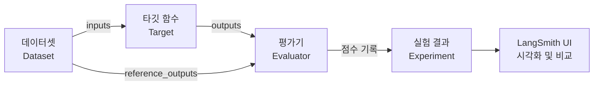
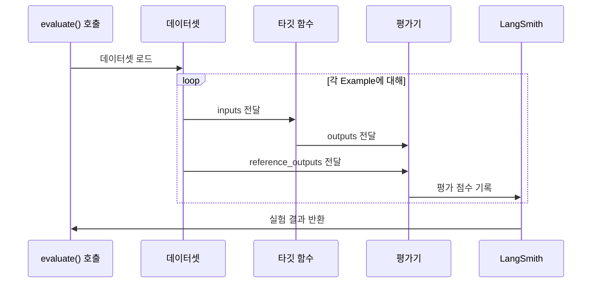
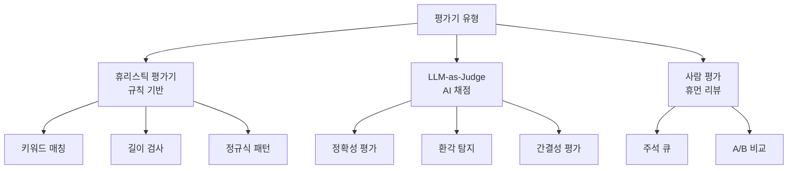

# LLM 애플리케이션 평가

> LangSmith의 평가 프레임워크를 활용하여 LLM 애플리케이션의 품질을 체계적으로 측정하고 개선하는 방법을 학습합니다.

## 개요

이 섹션에서는 앞서 [16.3: LangSmith 트레이싱 심화](ch16/session_16_3.md)에서 배운 트레이싱과 피드백 데이터를 기반으로, LLM 애플리케이션을 **체계적으로 평가**하는 파이프라인을 구축합니다. "감으로 판단하는" 단계를 넘어서, 데이터셋 기반 자동 평가와 실험 비교를 통해 모델 성능을 정량적으로 추적하는 방법을 익힙니다.

**선수 지식**: LangSmith 프로젝트·트레이스·런 계층 구조(16.3), 피드백 수집과 주석 큐(16.3), 커스텀 콜백 핸들러(16.2)
**학습 목표**:
- 평가 데이터셋을 프로그래밍 방식으로 생성하고 관리할 수 있다
- LangSmith `evaluate()` 함수와 OpenEvals 프리빌트 평가기를 활용할 수 있다
- 비즈니스 로직에 맞는 커스텀 평가 메트릭을 작성할 수 있다
- 요약 평가기와 실험 비교를 통한 자동 평가 파이프라인을 구축할 수 있다

## 왜 알아야 할까?

"이 프롬프트를 바꿨더니 응답이 좋아진 것 같은데..." — 이런 **감에 의존한 판단**으로 LLM 애플리케이션을 운영해 본 적이 있으신가요? 프롬프트 하나를 수정했을 때, 기존에 잘 되던 질문이 갑자기 엉뚱한 답변을 내놓는 **회귀(regression)** 문제는 LLM 개발에서 가장 흔한 함정입니다.

소프트웨어 개발에서 단위 테스트가 코드 품질을 보장하듯, LLM 애플리케이션에도 **체계적인 평가 시스템**이 필요합니다. LangSmith의 평가 프레임워크는 바로 이 역할을 합니다:

- **프롬프트 변경 전후** 성능을 정량적으로 비교
- **배포 전 회귀 테스트**로 품질 저하를 사전 방지
- **A/B 테스트**로 어떤 모델·프롬프트 조합이 최적인지 데이터로 판단
- **CI/CD 파이프라인**에 평가를 통합하여 자동화된 품질 게이트 구축

## 핵심 개념

### 개념 1: 평가의 3요소 — 데이터셋, 타깃, 평가기

> 💡 **비유**: 평가 시스템을 **요리 대회**에 비유해 볼까요? **데이터셋**은 "이 재료로 이런 요리를 만드세요"라는 과제 목록입니다. **타깃(Target)**은 실제로 요리하는 셰프(여러분의 LLM 체인)이고, **평가기(Evaluator)**는 맛, 비주얼, 창의성 등을 채점하는 심사위원단이죠. LangSmith의 평가 프레임워크는 이 세 가지를 연결해 **자동화된 요리 대회**를 열어줍니다.

> 📊 **그림 1**: LangSmith 평가의 3요소와 데이터 흐름



LangSmith 평가의 핵심 데이터 모델을 정리하면:

| 구성 요소 | 역할 | 비유 |
|----------|------|------|
| **Dataset** | 입력과 기대 출력의 모음 | 시험 문제지 |
| **Example** | 데이터셋의 개별 테스트 케이스 | 시험 문제 1개 |
| **Target** | 평가 대상 함수/체인 | 시험 응시자 |
| **Evaluator** | 출력을 채점하는 함수 | 채점자 |
| **Experiment** | 한 번의 평가 실행 결과 | 시험 결과표 |

```python
from langsmith import Client

client = Client()

# 1. 데이터셋 생성 (시험 문제지 만들기)
dataset = client.create_dataset(
    dataset_name="QA 평가셋",
    description="RAG 시스템 정확도 평가용 데이터셋"
)

# 2. 예제 추가 (시험 문제 추가)
client.create_examples(
    inputs=[
        {"question": "LangChain의 LCEL이란 무엇인가요?"},
        {"question": "RAG의 핵심 구성 요소는?"},
        {"question": "에이전트와 체인의 차이점은?"},
    ],
    outputs=[  # 기대 출력 (정답)
        {"answer": "LCEL은 LangChain Expression Language로, 파이프 연산자(|)를 사용하여 컴포넌트를 선언적으로 조합하는 체인 구성 언어입니다."},
        {"answer": "RAG의 핵심 구성 요소는 검색기(Retriever), 문서 로더, 임베딩 모델, 벡터 스토어, 그리고 생성 모델(LLM)입니다."},
        {"answer": "체인은 미리 정해진 순서로 컴포넌트를 실행하는 반면, 에이전트는 LLM이 상황에 따라 도구를 선택적으로 사용하여 자율적으로 작업을 수행합니다."},
    ],
    dataset_id=dataset.id,
)
```

### 개념 2: `evaluate()` 함수와 실험 실행

> 💡 **비유**: `evaluate()` 함수는 **시험 감독관** 같은 존재입니다. 문제지(데이터셋)를 응시자(타깃 함수)에게 나눠주고, 답안을 채점자(평가기)에게 전달하고, 최종 성적표(실험 결과)를 정리해주죠. 여러분은 그냥 "시험 시작!"만 외치면 됩니다.

LangSmith SDK v0.2부터 `evaluate()` 함수가 크게 단순화되었습니다. 타깃 함수, 데이터셋, 평가기만 지정하면 전체 평가 파이프라인이 자동으로 실행됩니다.

```python
from langsmith import evaluate

# 타깃 함수 정의 — 평가 대상인 여러분의 LLM 애플리케이션
def my_qa_app(inputs: dict) -> dict:
    """RAG 기반 QA 시스템"""
    question = inputs["question"]
    # 실제로는 여기서 체인/에이전트를 호출
    from langchain_openai import ChatOpenAI
    from langchain_core.prompts import ChatPromptTemplate

    llm = ChatOpenAI(model="gpt-4o", temperature=0)
    prompt = ChatPromptTemplate.from_template(
        "다음 질문에 정확하고 간결하게 답변하세요: {question}"
    )
    chain = prompt | llm
    result = chain.invoke({"question": question})
    return {"answer": result.content}

# 커스텀 평가기 정의 — 정답 포함 여부 확인
def contains_keywords(outputs: dict, reference_outputs: dict) -> dict:
    """기대 출력의 핵심 키워드가 실제 출력에 포함되어 있는지 평가"""
    predicted = outputs["answer"].lower()
    expected = reference_outputs["answer"].lower()
    # 기대 출력에서 핵심 키워드 추출 (4글자 이상 단어)
    keywords = [w for w in expected.split() if len(w) >= 4]
    if not keywords:
        return {"score": 1.0, "key": "keyword_match"}
    matches = sum(1 for kw in keywords if kw in predicted)
    score = matches / len(keywords)
    return {"score": score, "key": "keyword_match"}

# 평가 실행! — 이 한 줄이 전체 파이프라인을 돌립니다
results = evaluate(
    my_qa_app,                          # 타깃 함수
    data="QA 평가셋",                    # 데이터셋 이름
    evaluators=[contains_keywords],      # 평가기 리스트
    experiment_prefix="qa-v1",           # 실험 이름 접두사
    metadata={"model": "gpt-4o", "version": "1.0"},  # 메타데이터
)
```

`evaluate()` 함수가 하는 일을 단계별로 살펴보면:

1. 데이터셋의 모든 예제를 순회합니다
2. 각 예제의 `inputs`를 타깃 함수에 전달합니다
3. 타깃 함수의 출력과 기대 출력을 평가기에 전달합니다
4. 평가 결과를 LangSmith에 **실험(Experiment)**으로 기록합니다

5. LangSmith UI에서 결과를 시각적으로 확인할 수 있습니다

> 📊 **그림 2**: evaluate() 함수의 내부 실행 흐름



### 개념 3: 프리빌트 평가기와 LLM-as-Judge

> 💡 **비유**: 모든 평가 기준을 직접 만들 필요는 없습니다. 마치 대학교 시험에서 교수가 직접 채점하는 것(커스텀 평가기)과 OMR 기계가 자동 채점하는 것(프리빌트 평가기), 그리고 외부 전문가에게 에세이 채점을 맡기는 것(LLM-as-Judge)이 있듯이, LangSmith도 다양한 채점 방식을 제공합니다.


LangChain 팀이 만든 **OpenEvals** 라이브러리는 즉시 사용 가능한 평가기를 제공합니다. 특히 `create_llm_as_judge`는 LLM을 활용해 복잡한 품질 기준(정확성, 간결성, 환각 여부 등)을 자동으로 평가합니다.

```python
# OpenEvals 프리빌트 평가기 사용
from openevals.llm import create_llm_as_judge
from openevals.prompts import CORRECTNESS_PROMPT, HALLUCINATION_PROMPT

# 정확성 평가기 — LLM이 정답과 비교하여 채점
correctness_evaluator = create_llm_as_judge(
    prompt=CORRECTNESS_PROMPT,
    model="openai:gpt-4o",        # 판사 역할 LLM
    feedback_key="correctness",   # 피드백 키 이름
)

# 환각 평가기 — 입력에 없는 정보를 지어냈는지 확인
hallucination_evaluator = create_llm_as_judge(
    prompt=HALLUCINATION_PROMPT,
    model="openai:gpt-4o",
    feedback_key="hallucination",
)

# 프리빌트 + 커스텀 평가기를 함께 사용
results = evaluate(
    my_qa_app,
    data="QA 평가셋",
    evaluators=[
        correctness_evaluator,     # 프리빌트: 정확성
        hallucination_evaluator,   # 프리빌트: 환각
        contains_keywords,         # 커스텀: 키워드 매칭
    ],
    experiment_prefix="qa-v2-multi-eval",
)
```

평가기의 유형을 정리하면:

| 유형 | 방식 | 장점 | 단점 |
|------|------|------|------|
| **휴리스틱** | 규칙 기반 (키워드, 길이, 정규식) | 빠르고 결정적 | 의미적 평가 불가 |
| **LLM-as-Judge** | LLM이 품질을 채점 | 의미적 판단 가능 | 비용 발생, 비결정적 |
| **사람 평가** | 주석 큐를 통한 휴먼 리뷰 | 가장 정확 | 느리고 비용 큼 |

> 📊 **그림 3**: 평가기 유형별 정확도-비용 트레이드오프



### 개념 4: 커스텀 평가 메트릭 작성

커스텀 평가기를 만들 때 알아야 할 핵심 규칙이 있습니다. 평가 함수의 **매개변수 이름**이 중요한데요, LangSmith가 이름을 보고 적절한 데이터를 자동으로 전달합니다.

```python
from langsmith.schemas import Example, Run

# --- 패턴 1: 단순 입출력 비교 ---
def length_check(outputs: dict, reference_outputs: dict) -> bool:
    """답변 길이가 기대 출력의 50~200% 범위인지 확인"""
    actual_len = len(outputs.get("answer", ""))
    expected_len = len(reference_outputs.get("answer", ""))
    if expected_len == 0:
        return True
    ratio = actual_len / expected_len
    return 0.5 <= ratio <= 2.0  # bool 반환 → 카테고리 메트릭

# --- 패턴 2: 점수 반환 ---
def semantic_similarity(outputs: dict, reference_outputs: dict) -> float:
    """코사인 유사도 기반 의미적 유사성 평가"""
    from langchain_openai import OpenAIEmbeddings
    import numpy as np

    embeddings = OpenAIEmbeddings(model="text-embedding-3-small")
    actual_emb = embeddings.embed_query(outputs["answer"])
    expected_emb = embeddings.embed_query(reference_outputs["answer"])
    # 코사인 유사도 계산
    similarity = np.dot(actual_emb, expected_emb) / (
        np.linalg.norm(actual_emb) * np.linalg.norm(expected_emb)
    )
    return float(similarity)  # float 반환 → 연속 메트릭

# --- 패턴 3: 딕셔너리로 상세 결과 반환 ---
def response_quality(outputs: dict, reference_outputs: dict) -> dict:
    """응답 품질을 다차원으로 평가"""
    answer = outputs.get("answer", "")
    return {
        "key": "response_quality",
        "score": min(len(answer) / 100, 1.0),  # 0~1 사이 점수
        "comment": f"응답 길이: {len(answer)}자",  # 평가 코멘트
    }

# --- 패턴 4: inputs 활용 (질문 맥락 고려) ---
def relevance_check(inputs: dict, outputs: dict) -> dict:
    """질문의 핵심 주제가 답변에 반영되었는지 확인"""
    question = inputs.get("question", "").lower()
    answer = outputs.get("answer", "").lower()
    # 질문의 명사를 추출하여 답변에 포함 여부 확인
    question_words = set(question.split()) - {"무엇", "어떤", "왜", "은", "는", "이", "가"}
    if not question_words:
        return {"key": "relevance", "score": 1.0}
    overlap = sum(1 for w in question_words if w in answer)
    return {"key": "relevance", "score": overlap / len(question_words)}
```

> ⚠️ **흔한 오해**: 평가 함수의 매개변수 이름을 아무렇게나 지어도 된다고 생각하기 쉽지만, 사실 LangSmith는 `inputs`, `outputs`, `reference_outputs` 같은 **정해진 이름**을 인식하여 데이터를 자동 매핑합니다. 매개변수 이름이 틀리면 데이터를 전달받지 못해 `None`이 되므로 주의하세요!

### 개념 5: 요약 평가기와 실험 비교

개별 예제를 채점하는 것도 중요하지만, 데이터셋 **전체 수준**의 메트릭이 필요할 때가 있습니다. 예를 들어 "전체 정확도는 85%다"라는 수치는 개별 점수의 평균으로 구할 수도 있지만, 더 정교한 지표(F1 점수, 분류 정밀도 등)는 **요약 평가기(Summary Evaluator)**가 필요합니다.

```python
from langsmith.schemas import Example, Run

def accuracy_summary(runs: list[Run], examples: list[Example]) -> dict:
    """전체 데이터셋에 대한 정확도를 계산하는 요약 평가기"""
    correct = 0
    total = len(examples)
    for run, example in zip(runs, examples):
        predicted = run.outputs.get("answer", "").strip().lower()
        expected = example.outputs.get("answer", "").strip().lower()
        # 핵심 키워드 3개 이상 일치하면 정답으로 간주
        expected_words = set(expected.split())
        overlap = len(set(predicted.split()) & expected_words)
        if overlap >= 3:
            correct += 1
    return {
        "key": "overall_accuracy",
        "score": correct / total if total > 0 else 0,
        "comment": f"{correct}/{total} 정답",
    }

# 요약 평가기는 summary_evaluators 매개변수로 전달
results = evaluate(
    my_qa_app,
    data="QA 평가셋",
    evaluators=[contains_keywords, correctness_evaluator],
    summary_evaluators=[accuracy_summary],  # 데이터셋 전체 평가
    experiment_prefix="qa-v3-summary",
)
```

실험 결과를 비교하면 프롬프트·모델 변경의 영향을 한눈에 볼 수 있습니다:

```python
# 실험 비교: 모델 A vs 모델 B
# 같은 데이터셋에 다른 타깃 함수로 실험을 돌린 후 LangSmith UI에서 비교

def my_qa_app_v2(inputs: dict) -> dict:
    """개선된 QA 시스템 — 프롬프트 수정 버전"""
    from langchain_openai import ChatOpenAI
    from langchain_core.prompts import ChatPromptTemplate

    llm = ChatOpenAI(model="gpt-4o", temperature=0)
    prompt = ChatPromptTemplate.from_template(
        "당신은 LangChain 전문가입니다. "
        "다음 질문에 핵심 개념과 예시를 포함하여 정확하게 답변하세요.\n\n"
        "질문: {question}"
    )
    chain = prompt | llm
    result = chain.invoke({"question": inputs["question"]})
    return {"answer": result.content}

# 동일 데이터셋에 개선된 버전으로 새 실험 실행
results_v2 = evaluate(
    my_qa_app_v2,
    data="QA 평가셋",
    evaluators=[contains_keywords, correctness_evaluator],
    summary_evaluators=[accuracy_summary],
    experiment_prefix="qa-v4-improved",  # 다른 접두사로 구분
)
# → LangSmith UI의 Experiments 탭에서 qa-v3와 qa-v4를 나란히 비교!
```

## 실습: 직접 해보기

아래는 RAG 시스템의 평가 파이프라인을 처음부터 끝까지 구축하는 완전한 예제입니다. 복사-붙여넣기로 바로 실행할 수 있습니다.

```python
"""
LLM 애플리케이션 평가 파이프라인 — 완전한 실습 예제
필요 패키지: pip install langsmith langchain-openai openevals
환경 변수: LANGCHAIN_API_KEY, OPENAI_API_KEY, LANGCHAIN_TRACING_V2=true
"""
import os
from dotenv import load_dotenv

load_dotenv()

# 환경 변수 설정
os.environ["LANGCHAIN_TRACING_V2"] = "true"
os.environ["LANGCHAIN_PROJECT"] = "eval-pipeline-demo"

from langsmith import Client, evaluate
from langchain_openai import ChatOpenAI
from langchain_core.prompts import ChatPromptTemplate
from langchain_core.output_parsers import StrOutputParser

client = Client()

# =============================================
# 1단계: 평가 데이터셋 구축
# =============================================
DATASET_NAME = "langchain-qa-eval-v1"

# 기존 데이터셋이 있으면 삭제 후 재생성 (실습용)
try:
    existing = client.read_dataset(dataset_name=DATASET_NAME)
    client.delete_dataset(dataset_id=existing.id)
except Exception:
    pass

dataset = client.create_dataset(
    dataset_name=DATASET_NAME,
    description="LangChain 지식 QA 평가 데이터셋",
)

# 다양한 난이도와 유형의 테스트 케이스
test_cases = [
    {
        "inputs": {"question": "LangChain에서 LCEL이란 무엇인가요?"},
        "outputs": {
            "answer": "LCEL(LangChain Expression Language)은 파이프 연산자(|)를 사용하여 "
                      "프롬프트, 모델, 파서 등의 컴포넌트를 선언적으로 조합하는 체인 구성 언어입니다.",
            "category": "개념",
        },
    },
    {
        "inputs": {"question": "벡터 스토어와 임베딩의 관계를 설명해주세요."},
        "outputs": {
            "answer": "임베딩은 텍스트를 수치 벡터로 변환하는 과정이며, "
                      "벡터 스토어는 이렇게 변환된 벡터를 저장하고 유사도 검색을 수행하는 데이터베이스입니다.",
            "category": "관계",
        },
    },
    {
        "inputs": {"question": "ReAct 에이전트 패턴은 어떻게 동작하나요?"},
        "outputs": {
            "answer": "ReAct 패턴은 Reasoning(추론)과 Acting(행동)을 교차 수행합니다. "
                      "LLM이 먼저 상황을 분석하고(Thought), 적절한 도구를 선택하여 실행하고(Action), "
                      "결과를 관찰한 뒤(Observation), 다시 추론하는 루프를 반복합니다.",
            "category": "패턴",
        },
    },
    {
        "inputs": {"question": "LangSmith에서 트레이스와 런의 차이는?"},
        "outputs": {
            "answer": "트레이스는 하나의 요청에 대한 전체 실행 흐름이며, "
                      "런은 트레이스 내의 개별 컴포넌트 실행 단위입니다. "
                      "하나의 트레이스에 여러 런이 트리 구조로 포함됩니다.",
            "category": "개념",
        },
    },
    {
        "inputs": {"question": "프롬프트 템플릿에서 Few-shot 기법을 어떻게 적용하나요?"},
        "outputs": {
            "answer": "FewShotPromptTemplate이나 FewShotChatMessagePromptTemplate을 사용하여 "
                      "입력-출력 예시 쌍을 프롬프트에 포함시킵니다. "
                      "ExampleSelector로 동적으로 관련 예시를 선택할 수도 있습니다.",
            "category": "기법",
        },
    },
]

# 데이터셋에 예제 일괄 추가
client.create_examples(
    inputs=[tc["inputs"] for tc in test_cases],
    outputs=[tc["outputs"] for tc in test_cases],
    dataset_id=dataset.id,
)
print(f"데이터셋 '{DATASET_NAME}' 생성 완료: {len(test_cases)}개 예제")

# =============================================
# 2단계: 타깃 함수 정의
# =============================================
def langchain_qa(inputs: dict) -> dict:
    """평가 대상 — LangChain 지식 QA 체인"""
    llm = ChatOpenAI(model="gpt-4o", temperature=0)
    prompt = ChatPromptTemplate.from_messages([
        ("system",
         "당신은 LangChain 프레임워크 전문가입니다. "
         "질문에 정확하고 간결하게 한국어로 답변하세요. "
         "핵심 용어는 영문을 병기하세요."),
        ("human", "{question}"),
    ])
    chain = prompt | llm | StrOutputParser()
    answer = chain.invoke({"question": inputs["question"]})
    return {"answer": answer}

# =============================================
# 3단계: 커스텀 평가기 작성
# =============================================

def keyword_overlap(outputs: dict, reference_outputs: dict) -> dict:
    """기대 출력과 실제 출력의 키워드 겹침 비율"""
    predicted_words = set(outputs.get("answer", "").lower().split())
    expected_words = set(reference_outputs.get("answer", "").lower().split())
    # 4글자 이상 단어만 비교 (조사, 접속사 제외)
    significant_expected = {w for w in expected_words if len(w) >= 4}
    if not significant_expected:
        return {"key": "keyword_overlap", "score": 1.0}
    overlap = len(predicted_words & significant_expected)
    return {
        "key": "keyword_overlap",
        "score": overlap / len(significant_expected),
        "comment": f"핵심 키워드 {overlap}/{len(significant_expected)} 일치",
    }

def answer_length_ratio(outputs: dict, reference_outputs: dict) -> dict:
    """답변 길이가 적절한 범위(0.5배~3배)인지 평가"""
    actual = len(outputs.get("answer", ""))
    expected = len(reference_outputs.get("answer", ""))
    if expected == 0:
        return {"key": "length_ratio", "score": 1.0}
    ratio = actual / expected
    # 0.5~3배 범위면 1점, 범위 밖이면 감점
    if 0.5 <= ratio <= 3.0:
        score = 1.0
    else:
        score = max(0, 1 - abs(ratio - 1.75) / 3)
    return {
        "key": "length_ratio",
        "score": score,
        "comment": f"길이 비율: {ratio:.2f}x (실제 {actual}자 / 기대 {expected}자)",
    }

def contains_korean(outputs: dict) -> dict:
    """답변이 한국어를 포함하는지 확인"""
    answer = outputs.get("answer", "")
    # 유니코드 한글 범위 확인
    korean_chars = sum(1 for c in answer if "\uac00" <= c <= "\ud7a3")
    total_chars = len(answer.replace(" ", ""))
    ratio = korean_chars / total_chars if total_chars > 0 else 0
    return {
        "key": "korean_ratio",
        "score": ratio,
        "comment": f"한국어 비율: {ratio:.1%}",
    }

# =============================================
# 4단계: 요약 평가기 (데이터셋 전체 통계)
# =============================================
from langsmith.schemas import Example, Run

def dataset_summary(runs: list[Run], examples: list[Example]) -> dict:
    """데이터셋 전체에 대한 요약 통계"""
    total = len(runs)
    non_empty = sum(
        1 for r in runs
        if r.outputs and len(r.outputs.get("answer", "")) > 10
    )
    avg_length = sum(
        len(r.outputs.get("answer", ""))
        for r in runs if r.outputs
    ) / total if total > 0 else 0

    return {
        "key": "completion_rate",
        "score": non_empty / total if total > 0 else 0,
        "comment": f"유효 응답: {non_empty}/{total}, 평균 길이: {avg_length:.0f}자",
    }

# =============================================
# 5단계: 평가 실행
# =============================================

# LLM-as-Judge 평가기 (OpenEvals)
from openevals.llm import create_llm_as_judge
from openevals.prompts import CORRECTNESS_PROMPT

correctness_judge = create_llm_as_judge(
    prompt=CORRECTNESS_PROMPT,
    model="openai:gpt-4o",
    feedback_key="correctness",
)

# 전체 평가 실행
results = evaluate(
    langchain_qa,                        # 타깃 함수
    data=DATASET_NAME,                   # 데이터셋
    evaluators=[                         # 개별 평가기들
        keyword_overlap,                 # 키워드 겹침
        answer_length_ratio,             # 길이 적절성
        contains_korean,                 # 한국어 비율
        correctness_judge,               # LLM 정확성 판단
    ],
    summary_evaluators=[dataset_summary],  # 요약 평가기
    experiment_prefix="langchain-qa-full", # 실험 식별자
    metadata={
        "model": "gpt-4o",
        "prompt_version": "v1",
        "evaluator_count": 4,
    },
)

# 결과 출력
print("\n=== 평가 결과 ===")
print(f"실험 URL: {results.experiment_url}")
# 실행 결과: LangSmith 대시보드에서 실험 결과를 시각적으로 확인할 수 있습니다
```

## 더 깊이 알아보기

### LLM 평가의 역사: "시험을 치르는 AI"의 진화

LLM 평가의 역사는 자연어 처리(NLP) 평가 메트릭의 진화와 궤를 같이합니다.

초기 NLP 시스템의 평가는 **BLEU**(2002)와 **ROUGE**(2004) 같은 n-gram 매칭 기반 메트릭이 지배했습니다. IBM 연구소의 Kishore Papineni가 제안한 BLEU는 기계 번역 품질을 자동으로 평가하기 위해 만들어졌는데, 놀랍게도 이 메트릭의 핵심 아이디어는 "사람이 번역한 것과 단어가 얼마나 겹치는가"라는 단순한 직관이었습니다.

하지만 GPT-3(2020) 이후 LLM이 등장하면서 기존 메트릭의 한계가 드러났습니다. "LangChain은 LLM 앱 개발 프레임워크다"와 "LangChain은 대규모 언어 모델 애플리케이션 구축 도구다"는 같은 의미이지만, 단어 겹침은 매우 낮죠. 이 문제를 해결하기 위해 **BERTScore**(2019)가 문맥적 임베딩 기반 유사도를 도입했고, 최근에는 **LLM-as-Judge** 패턴이 부상했습니다.

2023년 UC Berkeley 연구팀이 발표한 "Judging LLM-as-a-Judge" 논문은 GPT-4를 평가자로 사용하면 인간 평가자와 80% 이상의 일치도를 보인다는 결과를 제시해 큰 반향을 일으켰습니다. LangSmith의 OpenEvals가 바로 이 LLM-as-Judge 패턴을 프로덕션에 사용하기 쉽게 패키징한 것입니다.

> 💡 **알고 계셨나요?**: BLEU 점수의 이름은 "Bilingual Evaluation Understudy(이중 언어 평가 대역)"의 약자입니다. 사람 평가자의 "대역"을 자동 메트릭이 맡는다는 의미인데, 20년이 지난 지금은 LLM이 그 "대역" 역할을 더 잘 해내고 있다는 것이 아이러니하죠.

### 평가 주도 개발(Eval-Driven Development)

LangChain의 창시자 Harrison Chase는 "Eval-Driven Development"라는 개념을 강조합니다. TDD(Test-Driven Development)에서 테스트를 먼저 작성하듯, LLM 앱 개발에서도 **평가 기준을 먼저 정의**하고 그에 맞춰 프롬프트와 체인을 개선해 나가는 방식입니다. LangSmith의 평가 프레임워크는 바로 이 워크플로우를 위해 설계되었습니다.

## 흔한 오해와 팁

> ⚠️ **흔한 오해**: "LLM-as-Judge는 LLM이 자기 자신을 평가하니까 신뢰할 수 없다"라고 생각하기 쉽습니다. 하지만 실제로는 **평가용 LLM**과 **평가 대상 LLM**이 동일할 필요가 없습니다. 보통 더 강력한 모델(예: GPT-4o)을 판사로 쓰고, 비용 효율적인 모델(예: GPT-4o-mini)의 출력을 평가합니다. 또한 LLM-as-Judge를 **유일한** 평가 방법으로 쓰는 것이 아니라, 휴리스틱 평가기와 사람 평가를 함께 조합하는 것이 모범 사례입니다.

> 💡 **알고 계셨나요?**: LangSmith SDK v0.2부터 `evaluate()` 함수에 로컬 전용 모드가 추가되어, 결과를 LangSmith 서버에 업로드하지 않고 로컬에서만 평가를 실행할 수 있습니다. 외부 네트워크 없이 개발 중 빠르게 테스트할 때 유용합니다.

> 🔥 **실무 팁**: 평가 데이터셋은 **10~20개의 고품질 예제로 시작**하세요. 처음부터 수백 개를 만들려 하면 시간만 소모됩니다. 먼저 핵심 시나리오(정상 케이스 5개 + 엣지 케이스 5개)로 시작하고, 프로덕션에서 실패하는 케이스를 점진적으로 추가하는 **플라이휠 전략**이 효과적입니다. LangSmith UI에서 프로덕션 트레이스를 직접 데이터셋에 추가하는 기능을 활용하면 이 과정이 훨씬 수월해집니다.

> 🔥 **실무 팁**: 커스텀 평가기의 반환 타입에 따라 LangSmith의 시각화가 달라집니다. `bool`을 반환하면 pass/fail로 표시되고, `float`은 연속적인 점수 차트로, `str`은 카테고리 분포로 시각화됩니다. 메트릭의 성격에 맞는 반환 타입을 선택하세요.

## 핵심 정리

| 개념 | 설명 |
|------|------|
| **Dataset** | 입력(inputs)과 기대 출력(outputs)으로 구성된 테스트 케이스 모음 |
| **Example** | 데이터셋의 개별 항목, `inputs`와 `outputs` 딕셔너리로 구성 |
| **Evaluator** | 타깃 출력을 채점하는 함수, `outputs`·`reference_outputs` 등을 매개변수로 받음 |
| **`evaluate()`** | 타깃 함수를 데이터셋 전체에 실행하고 평가기로 채점하는 핵심 함수 |
| **LLM-as-Judge** | LLM을 활용해 정확성·환각·간결성 등을 채점하는 평가 패턴 |
| **OpenEvals** | LangChain 팀의 프리빌트 평가기 라이브러리 (`create_llm_as_judge`) |
| **Summary Evaluator** | 개별 예제가 아닌 데이터셋 전체에 대한 집계 메트릭을 산출하는 평가기 |
| **Experiment** | 한 번의 `evaluate()` 실행 결과, LangSmith에서 비교·분석 가능 |

## 다음 섹션 미리보기

이번 섹션에서 평가 파이프라인을 구축하는 방법을 익혔다면, 다음 섹션 [16.5: 프로덕션 모니터링과 관찰 가능성 통합](ch16/session_16_5.md)에서는 이 평가 시스템을 **실시간 프로덕션 환경**에 통합하는 방법을 다룹니다. 콜백(16.1~16.2), 트레이싱(16.3), 평가(이번 섹션)를 하나로 엮어 **실시간 모니터링 대시보드**를 구성하고, CI/CD 파이프라인에 자동 평가 게이트를 설치하는 실전 패턴을 학습합니다.

## 참고 자료

- [LangSmith Evaluation Concepts — 공식 문서](https://docs.langchain.com/langsmith/evaluation-concepts) - 데이터셋·평가기·실험의 핵심 개념과 아키텍처를 설명하는 필수 레퍼런스
- [LangSmith Evaluation Quickstart — 공식 가이드](https://docs.langchain.com/langsmith/evaluation-quickstart) - 처음 평가 파이프라인을 구축할 때 따라 하기 좋은 빠른 시작 가이드
- [How to Define a Custom Evaluator — 공식 How-to](https://docs.smith.langchain.com/evaluation/how_to_guides/evaluation/custom_evaluator) - 커스텀 평가기 작성의 모든 패턴과 매개변수 규칙을 상세히 다룹니다
- [OpenEvals — GitHub](https://github.com/langchain-ai/openevals) - LangChain 팀의 오픈소스 프리빌트 평가기 라이브러리, LLM-as-Judge 구현 포함
- [Easier Evaluations with LangSmith SDK v0.2 — 공식 블로그](https://blog.langchain.com/easier-evaluations-with-langsmith-sdk-v0-2/) - SDK v0.2의 간소화된 `evaluate()` API와 로컬 모드 소개
- [How to Create and Manage Datasets Programmatically — 공식 가이드](https://docs.langchain.com/langsmith/manage-datasets-programmatically) - Python SDK로 데이터셋을 생성·관리하는 방법

---
### 🔗 Related Sessions
- [callback_handler](../16-콜백과-관찰-가능성/01-콜백-시스템-이해.md) (prerequisite)
- [langsmith_project](../16-콜백과-관찰-가능성/03-langsmith-트레이싱-심화.md) (prerequisite)
- [trace_hierarchy](../16-콜백과-관찰-가능성/03-langsmith-트레이싱-심화.md) (prerequisite)
- [langsmith_feedback](../16-콜백과-관찰-가능성/03-langsmith-트레이싱-심화.md) (prerequisite)
- [run_filtering](../16-콜백과-관찰-가능성/03-langsmith-트레이싱-심화.md) (prerequisite)
