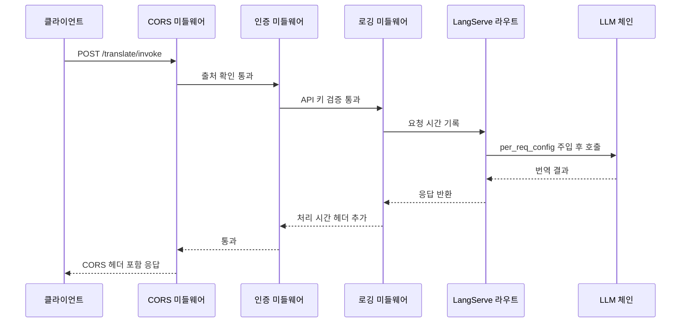
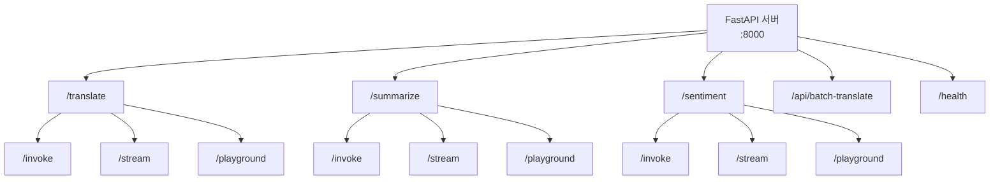
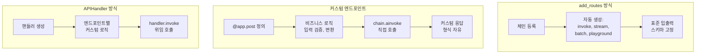

# FastAPI 통합과 서버 구성

> LangServe 서버를 프로덕션 수준으로 구성하는 방법을 배웁니다 — 미들웨어, 다중 체인 배포, 커스텀 엔드포인트, OpenAPI 문서화까지

## 개요

이 섹션에서는 앞서 [Session 17.1: LangServe 기초](ch17/session_17_1.md)에서 배운 `add_routes`와 기본 서버 구성을 확장하여, 실제 프로덕션 환경에서 필요한 FastAPI 통합 기술을 다룹니다. 단순히 체인 하나를 배포하는 것을 넘어, 여러 체인을 하나의 서버에서 관리하고, 미들웨어로 보안과 로깅을 처리하며, 커스텀 엔드포인트로 비즈니스 로직을 추가하는 방법을 실습합니다.

**선수 지식**: LangServe의 `add_routes`, `RemoteRunnable`, Playground UI (Session 17.1), LCEL 체인 구성 (Chapter 5), FastAPI 기본 개념
**학습 목표**:
- FastAPI 미들웨어(CORS, 인증, 로깅)를 LangServe 서버에 적용할 수 있다
- 하나의 서버에 여러 체인을 경로별로 배포할 수 있다
- `APIHandler`를 활용해 커스텀 엔드포인트를 추가할 수 있다
- OpenAPI 문서를 커스터마이징하여 API를 체계적으로 관리할 수 있다

## 왜 알아야 할까?

> 📊 **그림 4**: 프로덕션 LangServe 서버의 전체 아키텍처




Session 17.1에서 우리는 체인 하나를 API로 배포하는 방법을 배웠습니다. 그런데 실제 서비스를 운영한다면 어떨까요? 번역 체인, 요약 체인, QA 체인을 각각 별도 서버로 띄울 건가요? 그리고 누구나 아무 제한 없이 우리 API를 호출해도 괜찮을까요?

실제 프로덕션 환경에서는 이런 요구사항이 생깁니다:

- **여러 기능을 하나의 서버에서** 제공해야 합니다
- **인증과 권한 관리**로 무단 접근을 막아야 합니다
- **CORS 설정**으로 허용된 프론트엔드만 접근하게 해야 합니다
- **커스텀 로직** — 사용량 추적, 요청 로깅, 헬스체크 등이 필요합니다
- **API 문서**가 깔끔해야 팀원이나 외부 개발자가 쉽게 통합할 수 있습니다

FastAPI는 이 모든 것을 우아하게 해결하는 프레임워크이고, LangServe는 FastAPI 위에 구축되어 있으므로 FastAPI의 모든 기능을 그대로 활용할 수 있습니다. 이번 세션에서 이 기술들을 익히면, 진짜 "배포 가능한" LLM API 서버를 만들 수 있게 됩니다.

## 핵심 개념

### 개념 1: FastAPI 미들웨어 — 요청의 보안 검문소

> 💡 **비유**: 미들웨어는 건물의 **보안 게이트**와 같습니다. 방문자(요청)가 사무실(엔드포인트)에 도착하기 전에 신분증을 확인하고, 출입 기록을 남기며, 퇴근할 때(응답)도 기록을 남깁니다. 게이트가 여러 개 있을 수 있고, 각각 다른 역할을 하죠.

FastAPI의 미들웨어는 모든 요청과 응답이 반드시 거쳐가는 처리 계층입니다. LangServe 서버에서 가장 자주 쓰이는 미들웨어 세 가지를 살펴보겠습니다.

> 📊 **그림 1**: 미들웨어 처리 순서 — 요청은 등록 역순으로, 응답은 등록 순서로 통과


#### CORS 미들웨어

웹 프론트엔드에서 LangServe API를 호출하려면 CORS(Cross-Origin Resource Sharing) 설정이 필수입니다. 브라우저는 보안상 다른 출처(origin)의 API 호출을 기본적으로 차단하거든요.

```python
from fastapi import FastAPI
from fastapi.middleware.cors import CORSMiddleware

app = FastAPI(title="LangChain API Server")

# CORS 미들웨어 — 반드시 다른 미들웨어보다 먼저 추가
app.add_middleware(
    CORSMiddleware,
    allow_origins=["https://myapp.com", "https://admin.myapp.com"],  # 허용할 출처
    allow_credentials=True,  # 쿠키 허용 여부
    allow_methods=["*"],     # 모든 HTTP 메서드 허용
    allow_headers=["*"],     # 모든 헤더 허용
)
```

> ⚠️ **흔한 오해**: `allow_origins=["*"]`로 설정하면 편하지만, `allow_credentials=True`와 함께 사용할 수 없습니다. 브라우저 보안 정책상 와일드카드 출처와 자격 증명을 동시에 허용하는 것은 금지되어 있거든요. 프로덕션에서는 반드시 구체적인 출처를 명시하세요.

#### 커스텀 로깅 미들웨어

모든 API 호출의 처리 시간과 상태를 기록하는 미들웨어를 만들어봅시다.

```python
import time
import logging
from starlette.middleware.base import BaseHTTPMiddleware
from starlette.requests import Request

logger = logging.getLogger("langserve")

class RequestLoggingMiddleware(BaseHTTPMiddleware):
    """모든 요청의 처리 시간과 상태 코드를 로깅하는 미들웨어"""
    
    async def dispatch(self, request: Request, call_next):
        start_time = time.time()
        
        # 요청 정보 기록
        logger.info(f"요청 시작: {request.method} {request.url.path}")
        
        # 다음 미들웨어 또는 엔드포인트로 전달
        response = await call_next(request)
        
        # 처리 시간 계산
        duration = time.time() - start_time
        logger.info(
            f"요청 완료: {request.method} {request.url.path} "
            f"상태={response.status_code} 소요={duration:.3f}s"
        )
        
        # 응답 헤더에 처리 시간 추가
        response.headers["X-Process-Time"] = f"{duration:.3f}"
        return response

# 미들웨어 등록 (CORS 다음에 추가)
app.add_middleware(RequestLoggingMiddleware)
```

#### API 키 인증 미들웨어

간단한 API 키 기반 인증을 구현해봅시다.

```python
from fastapi import HTTPException
from starlette.middleware.base import BaseHTTPMiddleware

VALID_API_KEYS = {"sk-prod-abc123", "sk-dev-xyz789"}

class APIKeyAuthMiddleware(BaseHTTPMiddleware):
    """API 키 기반 인증 미들웨어"""
    
    async def dispatch(self, request: Request, call_next):
        # 헬스체크와 문서 경로는 인증 없이 허용
        if request.url.path in ("/health", "/docs", "/openapi.json"):
            return await call_next(request)
        
        # Playground 경로도 개발 환경에서는 허용
        if "/playground" in request.url.path:
            return await call_next(request)
        
        # API 키 확인
        api_key = request.headers.get("X-API-Key")
        if api_key not in VALID_API_KEYS:
            raise HTTPException(status_code=401, detail="유효하지 않은 API 키입니다")
        
        return await call_next(request)
```

미들웨어의 등록 순서가 중요합니다. CORS → 인증 → 로깅 순서로 등록하면, CORS 프리플라이트 요청이 인증 없이도 처리되므로 브라우저 호환성 문제를 피할 수 있습니다.

### 개념 2: 다중 체인 배포 — 하나의 서버, 여러 기능

> 💡 **비유**: 다중 체인 배포는 **푸드코트**와 같습니다. 건물(서버)은 하나지만, 한식·중식·일식(각 체인)이 각자의 구역(경로)에서 영업합니다. 고객(클라이언트)은 원하는 매장의 경로만 알면 됩니다.

`add_routes`를 여러 번 호출하면 하나의 서버에서 여러 체인을 각각 다른 경로로 배포할 수 있습니다.

> 📊 **그림 2**: 다중 체인 배포 구조 — 하나의 FastAPI 서버에서 여러 체인을 경로별로 제공




```python
from langchain_openai import ChatOpenAI
from langchain_core.prompts import ChatPromptTemplate
from langchain_core.output_parsers import StrOutputParser
from langserve import add_routes

# --- 체인 1: 번역 체인 ---
translate_prompt = ChatPromptTemplate.from_messages([
    ("system", "You are a professional translator. Translate to {target_language}."),
    ("human", "{text}")
])
translate_chain = translate_prompt | ChatOpenAI(model="gpt-4o") | StrOutputParser()

# --- 체인 2: 요약 체인 ---
summarize_prompt = ChatPromptTemplate.from_messages([
    ("system", "주어진 텍스트를 {length}문장으로 요약하세요."),
    ("human", "{text}")
])
summarize_chain = summarize_prompt | ChatOpenAI(model="gpt-4o") | StrOutputParser()

# --- 체인 3: 감성 분석 체인 ---
sentiment_prompt = ChatPromptTemplate.from_messages([
    ("system", "텍스트의 감성을 분석하세요. 긍정/부정/중립으로 판단하고 이유를 설명하세요."),
    ("human", "{text}")
])
sentiment_chain = sentiment_prompt | ChatOpenAI(model="gpt-4o") | StrOutputParser()

# 각 체인을 다른 경로로 배포
add_routes(app, translate_chain, path="/translate")   # /translate/invoke, /translate/stream ...
add_routes(app, summarize_chain, path="/summarize")    # /summarize/invoke, /summarize/stream ...
add_routes(app, sentiment_chain, path="/sentiment")    # /sentiment/invoke, /sentiment/stream ...
```

각 경로마다 LangServe가 자동으로 `/invoke`, `/batch`, `/stream`, `/playground` 엔드포인트를 생성합니다. 즉, 위 코드만으로 총 12개 이상의 엔드포인트가 만들어지는 거죠!

#### per_req_config_modifier로 사용자별 설정 적용

`per_req_config_modifier`를 사용하면 요청마다 다른 설정을 체인에 전달할 수 있습니다. 이를 통해 사용자별 인증, 개인화된 설정, 요청 추적 등이 가능해집니다.

```python
from typing import Any
from fastapi import Request

async def per_request_config(
    config: dict[str, Any], request: Request
) -> dict[str, Any]:
    """요청 헤더에서 사용자 정보를 추출하여 config에 주입"""
    user_id = request.headers.get("X-User-ID", "anonymous")
    
    config["configurable"] = config.get("configurable", {})
    config["configurable"]["user_id"] = user_id
    
    # 메타데이터에 추적 정보 추가
    config["metadata"] = config.get("metadata", {})
    config["metadata"]["request_id"] = request.headers.get("X-Request-ID", "")
    
    return config

# per_req_config_modifier와 함께 라우트 등록
add_routes(
    app,
    translate_chain,
    path="/translate",
    per_req_config_modifier=per_request_config,
)
```

### 개념 3: 커스텀 엔드포인트 — add_routes를 넘어서

> 💡 **비유**: `add_routes`가 **프랜차이즈 매장**(정해진 메뉴와 인테리어)이라면, 커스텀 엔드포인트는 **자영업 매장**(원하는 대로 메뉴와 동선을 구성)입니다. 더 많은 자유도가 필요할 때 사용하죠.

LangServe의 `add_routes`는 편리하지만, 표준 엔드포인트(`/invoke`, `/stream`, `/batch`)만 제공합니다. 비즈니스 로직이 필요하거나 응답 형식을 커스터마이징하려면 FastAPI의 일반 엔드포인트를 함께 사용해야 합니다.

> 📊 **그림 3**: add_routes vs 커스텀 엔드포인트 비교




```python
from fastapi import FastAPI, HTTPException
from pydantic import BaseModel

# --- 커스텀 모델 정의 ---
class TranslateRequest(BaseModel):
    text: str
    source_lang: str = "ko"
    target_lang: str = "en"

class TranslateResponse(BaseModel):
    original: str
    translated: str
    source_lang: str
    target_lang: str

# --- 커스텀 엔드포인트 ---
@app.post("/api/translate", response_model=TranslateResponse, tags=["Custom"])
async def custom_translate(req: TranslateRequest):
    """비즈니스 로직이 포함된 커스텀 번역 엔드포인트"""
    
    # 입력 검증
    if len(req.text) > 5000:
        raise HTTPException(status_code=400, detail="텍스트는 5000자 이하여야 합니다")
    
    # 체인 호출
    result = await translate_chain.ainvoke({
        "text": req.text,
        "target_language": req.target_lang,
    })
    
    return TranslateResponse(
        original=req.text,
        translated=result,
        source_lang=req.source_lang,
        target_lang=req.target_lang,
    )

# --- 헬스체크 엔드포인트 ---
@app.get("/health", tags=["System"])
async def health_check():
    """서버 상태 확인"""
    return {"status": "healthy", "version": "1.0.0"}
```

#### APIHandler로 세밀한 제어

`add_routes`보다 더 세밀한 제어가 필요하다면, `APIHandler`를 직접 사용할 수 있습니다. 이 방법은 FastAPI에 익숙한 개발자에게 적합합니다.

```python
from langserve import APIHandler

# APIHandler 생성
translate_handler = APIHandler(translate_chain, path="/translate-v2")

@app.post("/translate-v2/invoke")
async def translate_invoke(request: Request):
    """APIHandler를 사용한 커스텀 invoke 엔드포인트"""
    # 인증 등 커스텀 로직 수행 가능
    api_key = request.headers.get("X-API-Key")
    if not api_key:
        raise HTTPException(status_code=401, detail="API 키가 필요합니다")
    
    # APIHandler에 요청 위임
    return await translate_handler.invoke(request)
```

### 개념 4: OpenAPI 문서화 — API의 설명서 만들기

> 💡 **비유**: OpenAPI 문서는 **식당 메뉴판**입니다. 어떤 음식(엔드포인트)이 있고, 주문할 때 뭘 말해야 하고(입력 스키마), 무엇이 나오는지(출력 스키마) 한눈에 볼 수 있죠. 메뉴판이 깔끔할수록 주문이 쉬워집니다.

FastAPI는 자동으로 OpenAPI(Swagger) 문서를 생성합니다. LangServe의 엔드포인트도 여기에 포함됩니다. 태그와 메타데이터를 설정하면 문서를 훨씬 체계적으로 관리할 수 있습니다.

```python
# 태그 메타데이터 정의
tags_metadata = [
    {
        "name": "Translation",
        "description": "텍스트 번역 관련 API",
    },
    {
        "name": "Summarization",
        "description": "텍스트 요약 관련 API",
    },
    {
        "name": "Custom",
        "description": "커스텀 비즈니스 로직 API",
    },
    {
        "name": "System",
        "description": "서버 상태 및 관리 API",
    },
]

# FastAPI 앱 생성 시 메타데이터 설정
app = FastAPI(
    title="LangChain AI API Server",
    version="1.0.0",
    description="LangChain 기반 AI 서비스를 제공하는 REST API 서버입니다.",
    openapi_tags=tags_metadata,
)
```

`add_routes`로 등록한 엔드포인트에도 태그를 붙일 수 있습니다. 하지만 현재 LangServe는 `add_routes` 자체에 태그 파라미터를 지원하지 않으므로, 커스텀 엔드포인트에 태그를 붙이는 방식으로 문서를 구조화하는 것이 일반적입니다.

서버를 실행하면 다음 URL에서 문서를 확인할 수 있습니다:
- **Swagger UI**: `http://localhost:8000/docs`
- **ReDoc**: `http://localhost:8000/redoc`
- **OpenAPI JSON**: `http://localhost:8000/openapi.json`


## 실습: 직접 해보기

다음은 모든 개념을 통합한 프로덕션급 LangServe 서버의 전체 코드입니다. 복사해서 바로 실행할 수 있습니다.

먼저 필요한 패키지를 설치합니다:

```bash
pip install langserve[all] langchain-openai python-dotenv
```

`.env` 파일을 생성합니다:

```
OPENAI_API_KEY=your-api-key-here
```

서버 코드 `server.py`를 작성합니다:

```python
"""
LangServe 프로덕션 서버 — 다중 체인, 미들웨어, 커스텀 엔드포인트 통합 예제
실행: python server.py
테스트: http://localhost:8000/docs
"""
import time
import logging
from typing import Any

from dotenv import load_dotenv
from fastapi import FastAPI, HTTPException, Request
from fastapi.middleware.cors import CORSMiddleware
from pydantic import BaseModel, Field
from starlette.middleware.base import BaseHTTPMiddleware
from langchain_openai import ChatOpenAI
from langchain_core.prompts import ChatPromptTemplate
from langchain_core.output_parsers import StrOutputParser
from langserve import add_routes

# 환경 변수 로드
load_dotenv()

# ─── 로깅 설정 ─────────────────────────────────────────────
logging.basicConfig(level=logging.INFO)
logger = logging.getLogger("langserve-prod")

# ─── OpenAPI 태그 메타데이터 ───────────────────────────────
tags_metadata = [
    {"name": "Translation", "description": "다국어 번역 API"},
    {"name": "Summarization", "description": "텍스트 요약 API"},
    {"name": "Analysis", "description": "텍스트 분석 API"},
    {"name": "Custom", "description": "커스텀 비즈니스 로직"},
    {"name": "System", "description": "서버 상태 및 관리"},
]

# ─── FastAPI 앱 생성 ──────────────────────────────────────
app = FastAPI(
    title="LangChain AI API Server",
    version="1.0.0",
    description=(
        "LangChain 기반 AI 서비스 REST API 서버입니다.\n\n"
        "- 번역, 요약, 감성 분석 체인 제공\n"
        "- API 키 인증 필요 (X-API-Key 헤더)\n"
        "- 각 체인별 Playground UI 제공"
    ),
    openapi_tags=tags_metadata,
)

# ─── 미들웨어 설정 (순서 중요!) ────────────────────────────

# 1) CORS — 가장 먼저 등록
app.add_middleware(
    CORSMiddleware,
    allow_origins=["http://localhost:3000", "https://myapp.com"],  # 프로덕션에서는 구체적 출처
    allow_credentials=True,
    allow_methods=["*"],
    allow_headers=["*"],
)


# 2) 요청 로깅 미들웨어
class RequestLoggingMiddleware(BaseHTTPMiddleware):
    async def dispatch(self, request: Request, call_next):
        start = time.time()
        logger.info(f"→ {request.method} {request.url.path}")
        response = await call_next(request)
        duration = time.time() - start
        logger.info(f"← {request.method} {request.url.path} [{response.status_code}] {duration:.3f}s")
        response.headers["X-Process-Time"] = f"{duration:.3f}"
        return response


app.add_middleware(RequestLoggingMiddleware)


# 3) API 키 인증 미들웨어
VALID_API_KEYS = {"sk-demo-key-12345"}  # 실제로는 DB나 환경변수에서 관리
OPEN_PATHS = {"/health", "/docs", "/redoc", "/openapi.json"}


class APIKeyMiddleware(BaseHTTPMiddleware):
    async def dispatch(self, request: Request, call_next):
        path = request.url.path
        # 공개 경로와 Playground는 인증 없이 허용
        if path in OPEN_PATHS or "/playground" in path:
            return await call_next(request)
        
        api_key = request.headers.get("X-API-Key")
        if api_key not in VALID_API_KEYS:
            raise HTTPException(status_code=401, detail="유효하지 않은 API 키입니다")
        
        return await call_next(request)


app.add_middleware(APIKeyMiddleware)

# ─── LLM 및 체인 정의 ─────────────────────────────────────
MODEL_NAME = "gpt-4o"
TEMPERATURE = 0.7

llm = ChatOpenAI(model=MODEL_NAME, temperature=TEMPERATURE)

# 체인 1: 번역
translate_prompt = ChatPromptTemplate.from_messages([
    ("system", "You are a professional translator. Translate the following text to {target_language}. Only output the translation."),
    ("human", "{text}"),
])
translate_chain = translate_prompt | llm | StrOutputParser()

# 체인 2: 요약
summarize_prompt = ChatPromptTemplate.from_messages([
    ("system", "주어진 텍스트를 {num_sentences}문장으로 핵심만 요약하세요."),
    ("human", "{text}"),
])
summarize_chain = summarize_prompt | llm | StrOutputParser()

# 체인 3: 감성 분석
sentiment_prompt = ChatPromptTemplate.from_messages([
    ("system", "텍스트의 감성을 분석하세요. JSON 형식으로 응답하세요: {{\"sentiment\": \"긍정/부정/중립\", \"confidence\": 0.0~1.0, \"reason\": \"이유\"}}"),
    ("human", "{text}"),
])
sentiment_chain = sentiment_prompt | llm | StrOutputParser()


# ─── per_req_config_modifier ──────────────────────────────
async def inject_user_context(
    config: dict[str, Any], request: Request
) -> dict[str, Any]:
    """요청 헤더에서 사용자 정보를 추출하여 config에 주입"""
    user_id = request.headers.get("X-User-ID", "anonymous")
    config["configurable"] = config.get("configurable", {})
    config["configurable"]["user_id"] = user_id
    config["metadata"] = config.get("metadata", {})
    config["metadata"]["user_id"] = user_id
    return config


# ─── LangServe 라우트 등록 ─────────────────────────────────
add_routes(
    app, translate_chain, path="/translate",
    per_req_config_modifier=inject_user_context,
)
add_routes(
    app, summarize_chain, path="/summarize",
    per_req_config_modifier=inject_user_context,
)
add_routes(
    app, sentiment_chain, path="/sentiment",
    per_req_config_modifier=inject_user_context,
)


# ─── 커스텀 엔드포인트 ────────────────────────────────────
class BatchTranslateRequest(BaseModel):
    texts: list[str] = Field(..., description="번역할 텍스트 목록", max_length=10)
    target_language: str = Field(default="en", description="대상 언어")


class BatchTranslateResponse(BaseModel):
    results: list[dict[str, str]]
    count: int


@app.post(
    "/api/batch-translate",
    response_model=BatchTranslateResponse,
    tags=["Custom"],
    summary="일괄 번역",
    description="여러 텍스트를 한 번에 번역합니다. 최대 10개까지 가능합니다.",
)
async def batch_translate(req: BatchTranslateRequest):
    """비즈니스 로직이 포함된 배치 번역 엔드포인트"""
    if not req.texts:
        raise HTTPException(status_code=400, detail="텍스트 목록이 비어있습니다")
    
    # batch 호출로 효율적으로 처리
    inputs = [{"text": t, "target_language": req.target_language} for t in req.texts]
    results = await translate_chain.abatch(inputs)
    
    return BatchTranslateResponse(
        results=[
            {"original": text, "translated": result}
            for text, result in zip(req.texts, results)
        ],
        count=len(results),
    )


@app.get("/health", tags=["System"], summary="서버 상태 확인")
async def health_check():
    return {
        "status": "healthy",
        "version": "1.0.0",
        "chains": ["translate", "summarize", "sentiment"],
    }


@app.get("/chains", tags=["System"], summary="사용 가능한 체인 목록")
async def list_chains():
    return {
        "chains": [
            {
                "name": "translate",
                "path": "/translate",
                "playground": "/translate/playground",
                "description": "다국어 번역",
            },
            {
                "name": "summarize",
                "path": "/summarize",
                "playground": "/summarize/playground",
                "description": "텍스트 요약",
            },
            {
                "name": "sentiment",
                "path": "/sentiment",
                "playground": "/sentiment/playground",
                "description": "감성 분석",
            },
        ]
    }

# ─── 서버 실행 ─────────────────────────────────────────────
if __name__ == "__main__":
    import uvicorn
    uvicorn.run(app, host="0.0.0.0", port=8000)
```

서버를 실행하고 테스트해봅시다:

```bash
python server.py
```

클라이언트 코드 `client.py`로 테스트합니다:

```python
"""LangServe 서버 테스트 클라이언트"""
import httpx

BASE_URL = "http://localhost:8000"
HEADERS = {"X-API-Key": "sk-demo-key-12345"}

# 1) 헬스체크 (인증 불필요)
resp = httpx.get(f"{BASE_URL}/health")
print("헬스체크:", resp.json())
# 출력: {'status': 'healthy', 'version': '1.0.0', 'chains': [...]}

# 2) 번역 체인 호출 (LangServe 표준 엔드포인트)
resp = httpx.post(
    f"{BASE_URL}/translate/invoke",
    json={"input": {"text": "안녕하세요, 반갑습니다!", "target_language": "English"}},
    headers=HEADERS,
)
print("번역 결과:", resp.json()["output"])
# 출력: Hello, nice to meet you!

# 3) 요약 체인 호출
resp = httpx.post(
    f"{BASE_URL}/summarize/invoke",
    json={"input": {"text": "LangServe는 LangChain 체인을 REST API로 배포하는 라이브러리입니다. FastAPI 기반으로 구축되어 있으며, 자동으로 invoke, stream, batch 엔드포인트를 생성합니다.", "num_sentences": "1"}},
    headers=HEADERS,
)
print("요약 결과:", resp.json()["output"])

# 4) 커스텀 배치 번역 엔드포인트
resp = httpx.post(
    f"{BASE_URL}/api/batch-translate",
    json={"texts": ["좋은 아침입니다", "오늘 날씨가 좋네요"], "target_language": "Japanese"},
    headers=HEADERS,
)
print("배치 번역:", resp.json())
# 출력: {'results': [{'original': '...', 'translated': '...'}, ...], 'count': 2}

# 5) 사용 가능한 체인 목록 확인
resp = httpx.get(f"{BASE_URL}/chains", headers=HEADERS)
print("체인 목록:", resp.json())
```

## 더 깊이 알아보기

### FastAPI의 탄생 — 크리스마스 이브의 선물

LangServe가 기반으로 하는 FastAPI에는 흥미로운 탄생 스토리가 있습니다. 콜롬비아 출신의 개발자 **세바스티안 라미레스(Sebastián Ramírez)**는 클라우드 소프트웨어를 개발하면서 기존 Python 웹 프레임워크들에 불만을 느꼈습니다. 특히 코드 에디터의 자동 완성과 인라인 에러 감지가 제대로 동작하지 않는 점이 가장 큰 고충이었죠.

그는 낮에는 본업을 하고, 밤과 주말에 새로운 프레임워크를 만들었습니다. 너무 열중한 나머지 눈이 떨리고 손가락 하나가 완전히 감각을 잃을 정도였다고 합니다. 그리고 **2018년 크리스마스 이브**, 그는 GitHub에 FastAPI의 첫 릴리즈를 공개했습니다.

오늘날 FastAPI는 Uber, Netflix, Microsoft 등 글로벌 기업에서 사용되고 있으며, Python 웹 프레임워크 중 가장 빠르게 성장한 프로젝트 중 하나가 되었습니다. Pydantic 기반 타입 검증, 자동 OpenAPI 문서 생성, 비동기 지원 — 이 모든 기능이 "개발자 경험"에 대한 라미레스의 집착에서 비롯된 것입니다.

LangServe가 FastAPI를 선택한 것도 같은 이유입니다. 타입 추론으로 입출력 스키마를 자동 생성하고, 비동기로 스트리밍을 처리하며, Playground UI까지 자동으로 제공하는 것은 FastAPI의 설계 철학이 있었기에 가능했습니다.

> 💡 **알고 계셨나요?**: LangServe 프로젝트는 현재 버그 수정 위주의 유지보수 모드에 들어갔습니다. LangChain 팀은 새로운 기능 개발보다는 **LangGraph Platform**으로 방향을 전환하고 있는데요, 이는 단순한 체인 배포를 넘어 상태 기반 에이전트 워크플로우의 배포가 더 중요해졌기 때문입니다. 하지만 LangServe의 핵심 개념(Runnable을 API로 배포, 스키마 자동 생성)은 LangGraph Platform에도 그대로 이어지므로, 지금 배우는 내용은 미래에도 유효합니다.

## 흔한 오해와 팁

> ⚠️ **흔한 오해**: "CORS 미들웨어를 추가했는데도 브라우저에서 CORS 오류가 납니다!" — 인증 미들웨어가 CORS 미들웨어보다 **먼저** 실행되어 에러를 던지면, CORS 헤더가 응답에 포함되지 않아 브라우저는 실제 인증 오류 대신 CORS 오류를 표시합니다. 미들웨어 등록 순서를 확인하세요. CORS 미들웨어는 항상 가장 먼저 등록해야 합니다.

> 💡 **알고 계셨나요?**: `add_routes`의 `per_req_config_modifier`로 구현한 인증은 현재 OpenAPI 문서에 자동 반영되지 않습니다. 즉, Swagger UI에서 "Authorize" 버튼이 나타나지 않죠. 인증이 필요한 API라면, 커스텀 엔드포인트로 감싸서 FastAPI의 `Security` 의존성을 사용하는 것이 문서화 측면에서 더 좋습니다.

> 🔥 **실무 팁**: 프로덕션에서는 API 키를 코드에 하드코딩하지 마세요. 환경 변수나 AWS Secrets Manager, HashiCorp Vault 같은 시크릿 관리 서비스를 사용하세요. 또한, 미들웨어에서 발생하는 에러는 FastAPI의 에러 핸들러를 거치지 않으므로, 미들웨어 내부에서 적절한 에러 응답을 직접 구성해야 합니다.

> 🔥 **실무 팁**: 여러 체인을 배포할 때 모든 체인이 같은 LLM 인스턴스를 공유하면 rate limit에 걸리기 쉽습니다. 체인별로 rate limit이 다른 모델 인스턴스를 사용하거나, `max_concurrency` 파라미터로 동시 요청 수를 제한하세요.

## 핵심 정리

| 개념 | 설명 |
|------|------|
| **CORS 미들웨어** | 브라우저 교차 출처 요청을 허용하는 설정. 프로덕션에서는 구체적 출처 명시 필수 |
| **커스텀 미들웨어** | `BaseHTTPMiddleware`를 상속하여 로깅, 인증 등 횡단 관심사를 처리 |
| **다중 체인 배포** | `add_routes`를 여러 번 호출하여 하나의 서버에 여러 체인을 경로별로 배포 |
| **per_req_config_modifier** | 요청별로 config를 수정하여 사용자별 설정, 인증 정보를 체인에 전달 |
| **커스텀 엔드포인트** | FastAPI의 `@app.post()` 데코레이터로 비즈니스 로직이 포함된 엔드포인트 추가 |
| **APIHandler** | `add_routes`보다 세밀한 제어가 필요할 때 사용하는 저수준 API |
| **OpenAPI 문서화** | `openapi_tags`로 태그 메타데이터를 정의하고, `/docs`에서 Swagger UI 확인 |
| **미들웨어 순서** | CORS → 인증 → 로깅 순서로 등록. 순서가 잘못되면 CORS 오류 발생 가능 |

## 다음 섹션 미리보기

서버를 잘 구성했으니, 이제 **클라이언트 측**을 본격적으로 다룰 차례입니다. 다음 세션에서는 `RemoteRunnable` 클라이언트 SDK를 활용한 고급 호출 패턴 — 스트리밍 응답 처리, 에러 핸들링, 재시도 로직, 그리고 비동기 배치 호출까지 다룹니다. 서버를 만드는 것만큼이나 클라이언트를 잘 만드는 것도 중요하거든요.

## 참고 자료

- [LangServe 공식 문서](https://python.langchain.com/docs/langserve) - LangServe의 모든 기능과 API 레퍼런스를 제공하는 공식 문서
- [LangServe GitHub 리포지토리](https://github.com/langchain-ai/langserve) - 소스 코드, 예제, 이슈 트래커 등 개발에 필요한 모든 것이 있는 공식 저장소
- [FastAPI CORS 공식 문서](https://fastapi.tiangolo.com/tutorial/cors/) - CORS 미들웨어 설정의 모든 옵션과 주의사항을 설명하는 공식 튜토리얼
- [FastAPI Metadata and Docs URLs](https://fastapi.tiangolo.com/tutorial/metadata/) - OpenAPI 태그, 메타데이터, 문서 URL 커스터마이징 공식 가이드
- [LangServe per_req_config_modifier 예제](https://github.com/langchain-ai/langserve/blob/main/examples/auth/per_req_config_modifier/server.py) - 요청별 설정 수정 패턴의 공식 예제 코드

---
### 🔗 Related Sessions
- [lcel](../01-langchain-소개와-개발-환경-설정/01-llm-애플리케이션의-진화와-langchain.md) (prerequisite)
- [runnable](../01-langchain-소개와-개발-환경-설정/01-llm-애플리케이션의-진화와-langchain.md) (prerequisite)
- [chain](../01-langchain-소개와-개발-환경-설정/01-llm-애플리케이션의-진화와-langchain.md) (prerequisite)
- [langserve](../01-langchain-소개와-개발-환경-설정/01-llm-애플리케이션의-진화와-langchain.md) (prerequisite)
- [add_routes](../01-langchain-소개와-개발-환경-설정/05-langchain-생태계-탐색.md) (prerequisite)
- [playground](../17-langserve와-api-배포/01-langserve-기초.md) (prerequisite)
- [remote_runnable](../17-langserve와-api-배포/01-langserve-기초.md) (prerequisite)
