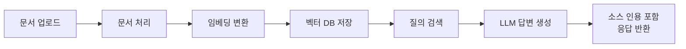
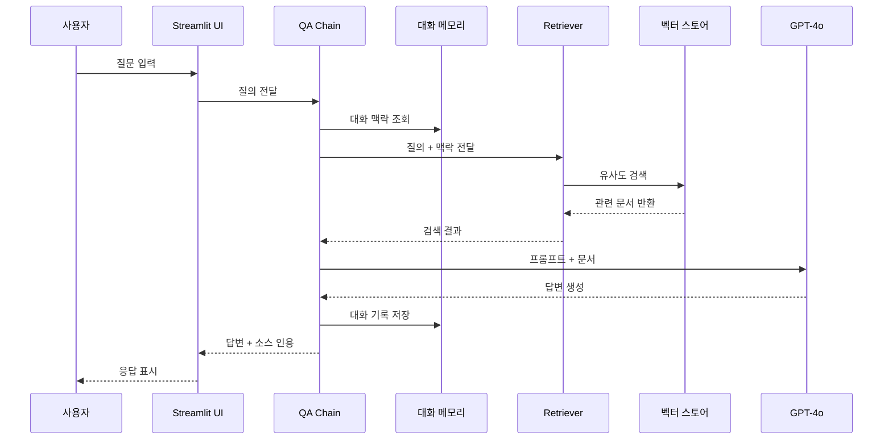
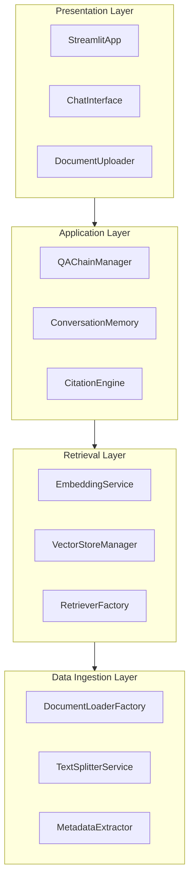
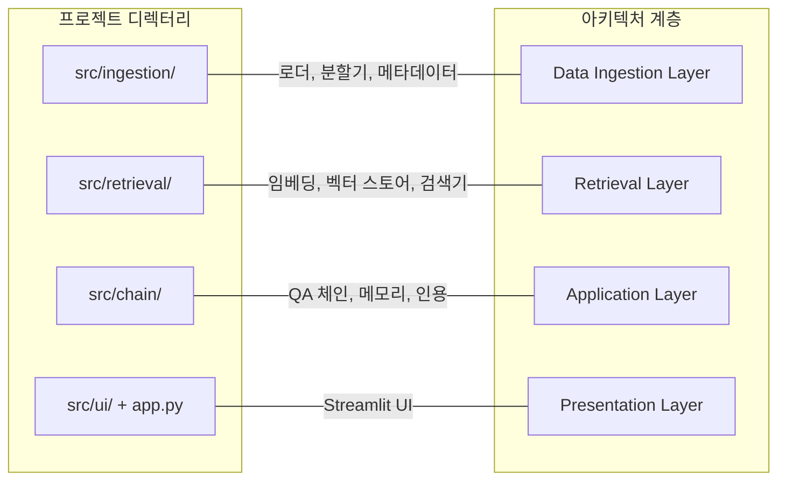
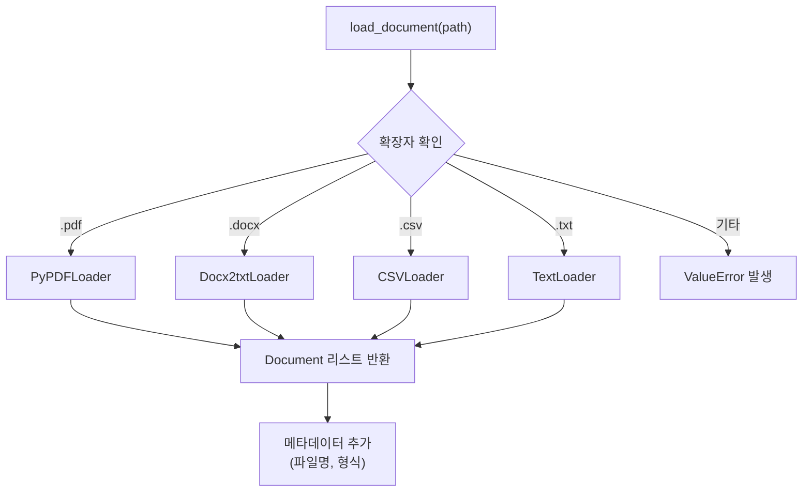

# 프로젝트 설계와 아키텍처

> 지능형 문서 QA 시스템의 전체 설계도를 그리고, 견고한 프로젝트 뼈대를 세워봅니다.

## 개요

이 섹션에서는 기업용 문서 QA 시스템을 본격적으로 구축하기에 앞서, 요구사항을 분석하고 시스템 아키텍처를 설계하며 기술 스택을 선정합니다. 그리고 실제 프로젝트 디렉터리 구조를 코드로 생성하는 것까지 진행하겠습니다.

**선수 지식**: 앞서 배운 RAG 파이프라인(Ch9), LCEL 체인 구성(Ch5), 문서 로더와 텍스트 분할(Ch6), 벡터 스토어(Ch7), 메모리와 대화 관리(Ch10)의 핵심 개념
**학습 목표**:
- 문서 QA 시스템의 기능적·비기능적 요구사항을 체계적으로 정의할 수 있다
- 모듈화된 시스템 아키텍처를 설계하고 각 컴포넌트의 역할을 설명할 수 있다
- 프로젝트에 적합한 기술 스택을 선정하고 근거를 제시할 수 있다
- 확장 가능한 프로젝트 디렉터리 구조를 생성할 수 있다

## 왜 알아야 할까?

> 📊 **그림 1**: 문서 QA 시스템의 전체 처리 흐름




"코딩부터 시작하면 안 되나요?"라고 물으실 수 있습니다. 물론 간단한 스크립트라면 바로 코드를 쓸 수 있겠죠. 하지만 실전 프로젝트는 다릅니다. 집을 지을 때 설계도 없이 벽돌부터 쌓으면 어떻게 될까요? 화장실이 거실 한가운데 놓이거나, 2층을 올리려는데 기초가 약해서 무너질 수 있겠죠.

소프트웨어도 마찬가지입니다. 특히 LLM 기반 애플리케이션은 **문서 처리 → 임베딩 → 검색 → 생성 → UI**까지 여러 계층이 유기적으로 연결되기 때문에, 아키텍처 설계 없이 시작하면 나중에 컴포넌트를 교체하거나 기능을 추가할 때 전체를 뜯어고쳐야 하는 상황에 빠집니다.

실제로 기업에서 RAG 시스템 프로젝트가 실패하는 원인 중 상당수가 "성능 문제"가 아니라 **"잘못된 설계로 인한 유지보수 불가능"**입니다. 이번 섹션에서 탄탄한 설계를 해두면, 나머지 5개 세션에서 구현할 때 길을 잃지 않을 수 있습니다.


## 핵심 개념

### 개념 1: 요구사항 분석 — 무엇을 만들 것인가?

> 💡 **비유**: 식당을 열기 전에 "어떤 음식을 팔 건지", "하루에 손님이 몇 명 올지", "좌석은 몇 개 필요한지"를 먼저 정하는 것과 같습니다. 메뉴도 정하지 않고 인테리어부터 하면 낭패를 보겠죠.

소프트웨어 요구사항은 크게 **기능적 요구사항**(Functional Requirements)과 **비기능적 요구사항**(Non-Functional Requirements)으로 나눕니다.

**기능적 요구사항 — "시스템이 무엇을 해야 하는가?"**

| 번호 | 요구사항 | 설명 |
|------|----------|------|
| FR-1 | 다중 문서 형식 지원 | PDF, DOCX, CSV, TXT 파일을 업로드하고 처리 |
| FR-2 | 자연어 질의 | 사용자가 자연어로 질문하면 문서 기반 답변 생성 |
| FR-3 | 소스 인용 | 답변에 출처 문서와 페이지 번호를 표시 |
| FR-4 | 멀티턴 대화 | 이전 대화 맥락을 유지하며 후속 질문 처리 |
| FR-5 | 신뢰도 표시 | 답변의 신뢰도를 시각적으로 표시 |
| FR-6 | 웹 UI | Streamlit 기반 인터랙티브 인터페이스 |

**비기능적 요구사항 — "시스템이 어떻게 동작해야 하는가?"**

| 번호 | 요구사항 | 기준 |
|------|----------|------|
| NFR-1 | 응답 시간 | 질의 후 5초 이내 답변 시작 (스트리밍) |
| NFR-2 | 문서 크기 | 단일 문서 최대 100MB, 총 1GB까지 |
| NFR-3 | 확장성 | 새로운 문서 형식 추가가 용이한 구조 |
| NFR-4 | 보안 | API 키 안전 관리, 업로드 파일 검증 |

```python
# 요구사항을 코드로 정의하면 팀 전체가 동일한 기준을 공유할 수 있습니다
from dataclasses import dataclass, field

@dataclass
class ProjectRequirements:
    """문서 QA 시스템 요구사항 정의"""

    # 기능적 요구사항
    supported_formats: list[str] = field(
        default_factory=lambda: ["pdf", "docx", "csv", "txt"]
    )
    max_conversation_turns: int = 20         # 멀티턴 대화 최대 턴 수
    enable_source_citation: bool = True      # 소스 인용 활성화
    enable_confidence_score: bool = True     # 신뢰도 점수 표시

    # 비기능적 요구사항
    max_file_size_mb: int = 100              # 단일 파일 최대 크기
    max_total_size_mb: int = 1024            # 전체 저장소 최대 크기
    target_response_time_sec: float = 5.0    # 목표 응답 시간
    chunk_size: int = 1000                   # 청크 크기
    chunk_overlap: int = 200                 # 청크 오버랩

# 프로젝트 요구사항 인스턴스 생성
requirements = ProjectRequirements()
print(f"지원 형식: {requirements.supported_formats}")
print(f"최대 파일 크기: {requirements.max_file_size_mb}MB")
print(f"목표 응답 시간: {requirements.target_response_time_sec}초")
# 출력:
# 지원 형식: ['pdf', 'docx', 'csv', 'txt']
# 최대 파일 크기: 100MB
# 목표 응답 시간: 5.0초
```

### 개념 2: 시스템 아키텍처 설계 — 어떻게 만들 것인가?

> 💡 **비유**: 아키텍처 설계는 도시 계획과 비슷합니다. 주거 구역, 상업 구역, 도로망을 미리 정해놓으면 나중에 건물을 하나하나 지을 때 전체가 조화롭게 작동하죠. 소프트웨어도 각 모듈의 역할과 통신 방식을 미리 정해야 합니다.

> 📊 **그림 3**: 사용자 질의 처리 시퀀스




우리 시스템은 크게 **4개의 계층**(Layer)으로 나뉩니다:

```
┌─────────────────────────────────────────────────┐
│              Presentation Layer                  │
│         (Streamlit Web UI)                       │
├─────────────────────────────────────────────────┤
│             Application Layer                    │
│    ┌──────────┐  ┌──────────┐  ┌──────────┐    │
│    │ QA Chain  │  │ Convers. │  │ Citation │    │
│    │ Manager   │  │ Memory   │  │ Engine   │    │
│    └──────────┘  └──────────┘  └──────────┘    │
├─────────────────────────────────────────────────┤
│              Retrieval Layer                     │
│    ┌──────────┐  ┌──────────┐  ┌──────────┐    │
│    │ Embedding │  │ Vector   │  │Retriever │    │
│    │ Service   │  │ Store    │  │          │    │
│    └──────────┘  └──────────┘  └──────────┘    │
├─────────────────────────────────────────────────┤
│             Data Ingestion Layer                 │
│    ┌──────────┐  ┌──────────┐  ┌──────────┐    │
│    │ Document  │  │  Text    │  │ Metadata │    │
│    │ Loaders   │  │ Splitter │  │ Extractor│    │
│    └──────────┘  └──────────┘  └──────────┘    │
└─────────────────────────────────────────────────┘
```

각 계층의 역할을 살펴보겠습니다:

> 📊 **그림 2**: 4계층 시스템 아키텍처와 컴포넌트 구성




**1) Data Ingestion Layer (데이터 수집 계층)**
PDF, DOCX, CSV, TXT 등 다양한 문서를 읽어들이고, 적절한 크기의 청크로 분할하며, 메타데이터(파일명, 페이지 번호 등)를 추출합니다.

**2) Retrieval Layer (검색 계층)**
텍스트 청크를 벡터로 임베딩하고, 벡터 스토어에 저장한 후, 사용자 질의가 들어오면 관련 문서를 검색합니다.

**3) Application Layer (애플리케이션 계층)**
검색된 문서와 사용자 질의를 LLM에 전달하여 답변을 생성하고, 대화 기록을 관리하며, 소스 인용과 신뢰도를 계산합니다.

**4) Presentation Layer (표현 계층)**
Streamlit 기반 웹 UI로, 파일 업로드, 채팅 인터페이스, 소스 표시 등을 담당합니다.

```python
from enum import Enum

class SystemLayer(Enum):
    """시스템 아키텍처의 4개 계층 정의"""
    DATA_INGESTION = "data_ingestion"    # 문서 처리
    RETRIEVAL = "retrieval"               # 검색
    APPLICATION = "application"           # 비즈니스 로직
    PRESENTATION = "presentation"         # UI

# 각 계층의 컴포넌트를 명시적으로 정의
ARCHITECTURE: dict[SystemLayer, list[str]] = {
    SystemLayer.DATA_INGESTION: [
        "DocumentLoaderFactory",   # 문서 형식별 로더 팩토리
        "TextSplitterService",     # 텍스트 분할 서비스
        "MetadataExtractor",       # 메타데이터 추출기
    ],
    SystemLayer.RETRIEVAL: [
        "EmbeddingService",        # 임베딩 생성 서비스
        "VectorStoreManager",      # 벡터 스토어 관리자
        "RetrieverFactory",        # 검색기 팩토리
    ],
    SystemLayer.APPLICATION: [
        "QAChainManager",          # QA 체인 관리자
        "ConversationMemory",      # 대화 메모리 관리
        "CitationEngine",          # 소스 인용 엔진
        "ConfidenceScorer",        # 신뢰도 평가기
    ],
    SystemLayer.PRESENTATION: [
        "StreamlitApp",            # 메인 UI 앱
        "ChatInterface",           # 채팅 인터페이스
        "DocumentUploader",        # 문서 업로드 컴포넌트
    ],
}

# 아키텍처 출력
for layer, components in ARCHITECTURE.items():
    print(f"\n📦 {layer.value}")
    for comp in components:
        print(f"   └── {comp}")
# 출력:
# 📦 data_ingestion
#    └── DocumentLoaderFactory
#    └── TextSplitterService
#    └── MetadataExtractor
# ... (이하 동일 패턴)
```

> ⚠️ **흔한 오해**: "계층을 나누면 코드가 복잡해지는 것 아닌가요?" — 처음엔 파일이 많아 보이지만, 기능 추가나 버그 수정 시 영향 범위가 해당 계층으로 한정되어 오히려 유지보수가 훨씬 쉬워집니다. 예를 들어, 벡터 스토어를 FAISS에서 Chroma로 바꿔도 Retrieval Layer만 수정하면 됩니다.

### 개념 3: 기술 스택 선정 — 어떤 도구를 쓸 것인가?

> 💡 **비유**: 요리를 할 때 재료와 도구를 미리 준비해두는 "미장플라스(Mise en place)"와 같습니다. 좋은 칼, 적절한 냄비, 신선한 재료를 미리 골라놓으면 요리 과정이 훨씬 수월해지죠.

기술 스택 선정에는 명확한 **기준**이 있어야 합니다:

| 기준 | 설명 |
|------|------|
| 성숙도 | 프로덕션에서 검증된 라이브러리인가? |
| 호환성 | LangChain 생태계와 잘 통합되는가? |
| 커뮤니티 | 문제 발생 시 도움을 받을 수 있는가? |
| 라이선스 | 상용 프로젝트에 사용 가능한가? |

**우리 프로젝트의 기술 스택:**

```python
from dataclasses import dataclass

@dataclass
class TechStack:
    """프로젝트 기술 스택 정의"""

    # 핵심 프레임워크
    langchain_core: str = "langchain-core>=0.3"       # LangChain 핵심
    langchain_openai: str = "langchain-openai>=0.3"    # OpenAI 통합
    langchain_community: str = "langchain-community>=0.3"  # 커뮤니티 통합

    # LLM & 임베딩
    llm_model: str = "gpt-4o"                          # 답변 생성 모델
    embedding_model: str = "text-embedding-3-small"    # 임베딩 모델

    # 벡터 스토어
    vector_store: str = "FAISS"         # 로컬 벡터 DB (설치 간편, 빠른 프로토타이핑)

    # 문서 처리
    pdf_loader: str = "PyPDFLoader"     # PDF 처리
    docx_loader: str = "Docx2txtLoader" # DOCX 처리
    csv_loader: str = "CSVLoader"       # CSV 처리

    # UI 프레임워크
    ui_framework: str = "Streamlit"     # 빠른 프로토타이핑에 최적

    # 유틸리티
    env_manager: str = "python-dotenv"  # 환경 변수 관리
    data_model: str = "Pydantic v2"     # 데이터 검증

tech = TechStack()
print(f"LLM: {tech.llm_model}")
print(f"Vector Store: {tech.vector_store}")
print(f"UI: {tech.ui_framework}")
# 출력:
# LLM: gpt-4o
# Vector Store: FAISS
# UI: Streamlit
```

**왜 이 기술들을 선택했을까요?**

- **FAISS**: 로컬에서 실행되므로 별도 서버가 필요 없고, 수백만 벡터까지 빠르게 검색합니다. 프로토타이핑에는 최적이며, 프로덕션에서는 Pinecone이나 Weaviate 같은 매니지드 서비스로 교체할 수 있습니다.
- **gpt-4o**: 2024년 출시 이후 가격 대비 성능이 가장 뛰어난 모델로, 문서 QA에 필요한 긴 컨텍스트(128K 토큰)를 지원합니다.
- **Streamlit**: Python 개발자가 별도의 프론트엔드 지식 없이 인터랙티브 웹 앱을 빠르게 만들 수 있습니다.

### 개념 4: 프로젝트 구조 설계 — 코드를 어디에 둘 것인가?

> 💡 **비유**: 잘 정리된 서재를 떠올려보세요. 소설, 기술서, 잡지가 각각 다른 칸에 꽂혀 있으면 원하는 책을 금방 찾을 수 있습니다. 프로젝트 디렉터리도 마찬가지로, 관련 코드끼리 모아두면 협업과 유지보수가 수월해집니다.

```
doc-qa-system/
├── .env                        # API 키 (절대 커밋하지 않음)
├── .env.example                # .env 파일 템플릿
├── .gitignore
├── requirements.txt
├── README.md
│
├── app.py                      # Streamlit 진입점
│
├── src/
│   ├── __init__.py
│   │
│   ├── config.py               # 전역 설정 및 상수
│   │
│   ├── ingestion/              # Data Ingestion Layer
│   │   ├── __init__.py
│   │   ├── loader_factory.py   # 문서 로더 팩토리
│   │   ├── splitter.py         # 텍스트 분할기
│   │   └── metadata.py         # 메타데이터 추출
│   │
│   ├── retrieval/              # Retrieval Layer
│   │   ├── __init__.py
│   │   ├── embedding.py        # 임베딩 서비스
│   │   ├── vector_store.py     # 벡터 스토어 관리
│   │   └── retriever.py        # 검색기 구성
│   │
│   ├── chain/                  # Application Layer
│   │   ├── __init__.py
│   │   ├── qa_chain.py         # QA 체인
│   │   ├── memory.py           # 대화 메모리
│   │   ├── citation.py         # 소스 인용
│   │   └── confidence.py       # 신뢰도 평가
│   │
│   └── ui/                     # Presentation Layer
│       ├── __init__.py
│       ├── components.py       # 재사용 UI 컴포넌트
│       └── styles.py           # 커스텀 스타일
│
├── data/
│   ├── raw/                    # 원본 문서 저장소
│   └── vectorstore/            # FAISS 인덱스 저장소
│
└── tests/
    ├── __init__.py
    ├── test_ingestion.py
    ├── test_retrieval.py
    └── test_chain.py
```

디렉터리 구조가 앞서 설계한 4개 계층과 정확히 대응되는 것이 보이시나요? `src/ingestion/`은 Data Ingestion Layer, `src/retrieval/`은 Retrieval Layer, `src/chain/`은 Application Layer, `src/ui/`는 Presentation Layer에 해당합니다.

> 📊 **그림 5**: 프로젝트 디렉터리와 아키텍처 계층 매핑




## 실습: 직접 해보기

이제 프로젝트의 뼈대를 실제 코드로 만들어봅시다. 아래 코드를 실행하면 전체 프로젝트 구조가 자동으로 생성됩니다.

```python
"""
프로젝트 구조 자동 생성 스크립트
실행: python setup_project.py
"""
import os
from pathlib import Path


def create_project_structure(base_dir: str = "doc-qa-system") -> None:
    """프로젝트 디렉터리 구조를 자동 생성합니다."""

    base = Path(base_dir)

    # 디렉터리 구조 정의
    directories = [
        "src/ingestion",
        "src/retrieval",
        "src/chain",
        "src/ui",
        "data/raw",
        "data/vectorstore",
        "tests",
    ]

    # 디렉터리 생성
    for dir_path in directories:
        (base / dir_path).mkdir(parents=True, exist_ok=True)
        print(f"  📁 {dir_path}/ 생성 완료")

    # __init__.py 파일 생성 (Python 패키지로 인식)
    init_dirs = ["src", "src/ingestion", "src/retrieval", "src/chain", "src/ui", "tests"]
    for dir_path in init_dirs:
        init_file = base / dir_path / "__init__.py"
        init_file.touch()

    # .env.example 생성
    env_example = base / ".env.example"
    env_example.write_text(
        "# OpenAI API 키\n"
        "OPENAI_API_KEY=your-api-key-here\n\n"
        "# 모델 설정 (선택)\n"
        "LLM_MODEL=gpt-4o\n"
        "EMBEDDING_MODEL=text-embedding-3-small\n"
    )
    print("  📄 .env.example 생성 완료")

    # .gitignore 생성
    gitignore = base / ".gitignore"
    gitignore.write_text(
        ".env\n"
        "__pycache__/\n"
        "*.pyc\n"
        "data/vectorstore/\n"
        "data/raw/\n"
        ".streamlit/secrets.toml\n"
        "*.egg-info/\n"
        "dist/\n"
        "build/\n"
    )
    print("  📄 .gitignore 생성 완료")

    # requirements.txt 생성
    requirements = base / "requirements.txt"
    requirements.write_text(
        "# LangChain 핵심 패키지\n"
        "langchain-core>=0.3\n"
        "langchain-openai>=0.3\n"
        "langchain-community>=0.3\n"
        "langchain>=0.3\n\n"
        "# 벡터 스토어\n"
        "faiss-cpu>=1.7\n\n"
        "# 문서 로더 의존성\n"
        "pypdf>=4.0\n"
        "docx2txt>=0.8\n\n"
        "# UI 프레임워크\n"
        "streamlit>=1.30\n\n"
        "# 유틸리티\n"
        "python-dotenv>=1.0\n"
        "pydantic>=2.0\n"
    )
    print("  📄 requirements.txt 생성 완료")

    # config.py 생성 — 프로젝트 전역 설정
    config_content = '''\
"""프로젝트 전역 설정"""
import os
from pathlib import Path
from dotenv import load_dotenv

# 환경 변수 로드
load_dotenv()

# ─── 경로 설정 ───
PROJECT_ROOT = Path(__file__).parent.parent
DATA_DIR = PROJECT_ROOT / "data"
RAW_DIR = DATA_DIR / "raw"
VECTORSTORE_DIR = DATA_DIR / "vectorstore"

# ─── 모델 설정 ───
LLM_MODEL = os.getenv("LLM_MODEL", "gpt-4o")
EMBEDDING_MODEL = os.getenv("EMBEDDING_MODEL", "text-embedding-3-small")
TEMPERATURE = 0.0  # QA 시스템은 사실 기반이므로 낮은 temperature

# ─── 문서 처리 설정 ───
CHUNK_SIZE = 1000       # 청크 크기 (토큰 기준)
CHUNK_OVERLAP = 200     # 청크 간 오버랩
SUPPORTED_FORMATS = [".pdf", ".docx", ".csv", ".txt"]

# ─── 검색 설정 ───
RETRIEVER_K = 4                    # 검색 문서 수
RETRIEVER_SEARCH_TYPE = "mmr"      # MMR로 다양성 확보

# ─── 대화 설정 ───
MAX_CONVERSATION_TURNS = 20
MEMORY_KEY = "chat_history"
'''
    config_file = base / "src" / "config.py"
    config_file.write_text(config_content)
    print("  📄 src/config.py 생성 완료")

    # app.py 엔트리포인트 생성
    app_content = '''\
"""
지능형 문서 QA 시스템 — Streamlit 진입점
실행: streamlit run app.py
"""
import streamlit as st

# ─── 페이지 기본 설정 ───
st.set_page_config(
    page_title="📚 문서 QA 시스템",
    page_icon="📚",
    layout="wide",
    initial_sidebar_state="expanded",
)

st.title("📚 지능형 문서 QA 시스템")
st.caption("다양한 형식의 문서를 업로드하고, 자연어로 질문하세요.")

# TODO: 다음 세션에서 구현할 내용
st.info("🚧 프로젝트 구조가 생성되었습니다. 다음 세션에서 본격적으로 구현합니다.")
'''
    app_file = base / "app.py"
    app_file.write_text(app_content)
    print("  📄 app.py 생성 완료")

    print(f"\n✅ 프로젝트 '{base_dir}' 구조 생성 완료!")
    print(f"   다음 단계: cd {base_dir} && pip install -r requirements.txt")


if __name__ == "__main__":
    create_project_structure()
```

실행 결과:

```
  📁 src/ingestion/ 생성 완료
  📁 src/retrieval/ 생성 완료
  📁 src/chain/ 생성 완료
  📁 src/ui/ 생성 완료
  📁 data/raw/ 생성 완료
  📁 data/vectorstore/ 생성 완료
  📁 tests/ 생성 완료
  📄 .env.example 생성 완료
  📄 .gitignore 생성 완료
  📄 requirements.txt 생성 완료
  📄 src/config.py 생성 완료
  📄 app.py 생성 완료

✅ 프로젝트 'doc-qa-system' 구조 생성 완료!
   다음 단계: cd doc-qa-system && pip install -r requirements.txt
```

이제 각 계층의 핵심 인터페이스도 미리 정의해두겠습니다. 아래 코드는 `src/ingestion/loader_factory.py`에 들어갈 문서 로더 팩토리의 골격입니다:

```python
"""
src/ingestion/loader_factory.py
문서 형식별 로더를 생성하는 팩토리 클래스
"""
from pathlib import Path
from langchain_core.documents import Document
from langchain_community.document_loaders import (
    PyPDFLoader,
    Docx2txtLoader,
    CSVLoader,
    TextLoader,
)

# 확장자 → 로더 클래스 매핑
LOADER_MAPPING: dict[str, type] = {
    ".pdf": PyPDFLoader,
    ".docx": Docx2txtLoader,
    ".csv": CSVLoader,
    ".txt": TextLoader,
}


def load_document(file_path: str | Path) -> list[Document]:
    """파일 경로를 받아 적절한 로더로 문서를 로드합니다.

    Args:
        file_path: 로드할 문서 경로

    Returns:
        Document 객체 리스트

    Raises:
        ValueError: 지원하지 않는 파일 형식일 때
    """
    path = Path(file_path)
    ext = path.suffix.lower()  # 확장자 추출

    if ext not in LOADER_MAPPING:
        raise ValueError(
            f"지원하지 않는 형식: {ext}. "
            f"지원 형식: {list(LOADER_MAPPING.keys())}"
        )

    # 팩토리 패턴: 확장자에 따라 적절한 로더 인스턴스 생성
    loader_class = LOADER_MAPPING[ext]
    loader = loader_class(str(path))

    documents = loader.load()

    # 메타데이터에 원본 파일 정보 추가
    for doc in documents:
        doc.metadata["source_file"] = path.name
        doc.metadata["file_type"] = ext

    return documents


# 사용 예시
if __name__ == "__main__":
    # 테스트용 텍스트 파일 생성
    test_file = Path("test_sample.txt")
    test_file.write_text("LangChain은 LLM 기반 애플리케이션 개발 프레임워크입니다.")

    docs = load_document(test_file)
    print(f"로드된 문서 수: {len(docs)}")
    print(f"내용: {docs[0].page_content[:50]}")
    print(f"메타데이터: {docs[0].metadata}")

    test_file.unlink()  # 테스트 파일 정리
    # 출력:
    # 로드된 문서 수: 1
    # 내용: LangChain은 LLM 기반 애플리케이션 개발 프레임워크입니다.
    # 메타데이터: {'source': 'test_sample.txt', 'source_file': 'test_sample.txt', 'file_type': '.txt'}
```

> 🔥 **실무 팁**: 팩토리 패턴을 사용하면 새로운 문서 형식을 추가할 때 `LOADER_MAPPING`에 한 줄만 추가하면 됩니다. 예를 들어, HTML 지원을 추가하려면 `".html": BSHTMLLoader`를 넣으면 끝이죠. 호출하는 쪽 코드는 전혀 바꿀 필요가 없습니다.

> 📊 **그림 4**: 팩토리 패턴 — 확장자별 로더 선택 흐름




## 더 깊이 알아보기

### 소프트웨어 아키텍처의 역사 — 왜 "계층"인가?

계층형 아키텍처(Layered Architecture)는 소프트웨어 설계에서 가장 오래되고 검증된 패턴 중 하나입니다. 그 기원은 1968년 네덜란드의 컴퓨터 과학자 **에츠허르 다이크스트라(Edsger Dijkstra)**가 THE 운영체제를 설계하면서 제안한 "계층적 구조(Hierarchical Structure)"까지 거슬러 올라갑니다. 다이크스트라는 복잡한 시스템을 각 계층이 바로 아래 계층의 서비스만 사용하도록 분리하면, 각 층을 독립적으로 테스트하고 교체할 수 있다는 것을 보여줬습니다.

이 원칙은 오늘날에도 유효합니다. 우리의 문서 QA 시스템에서 벡터 스토어를 FAISS에서 Pinecone으로 바꾸더라도, Retrieval Layer만 수정하면 나머지 계층은 영향을 받지 않죠. 다이크스트라가 50년 전에 세운 원칙이 LLM 시대에도 빛을 발하는 셈입니다.

### LangChain의 탄생과 "조합"의 철학

LangChain은 2022년 10월, **해리슨 체이스(Harrison Chase)**가 "LLM 애플리케이션을 레고 블록처럼 조합할 수 있으면 좋겠다"는 아이디어에서 시작했습니다. 당시 OpenAI API를 직접 호출하는 코드는 프롬프트 구성, API 호출, 결과 파싱이 하나의 함수에 뒤엉켜 있었거든요. 체이스는 각 단계를 독립적인 컴포넌트로 분리하고, 파이프 연산자(`|`)로 연결하는 LCEL을 만들어 이 문제를 해결했습니다.

이 "조합의 철학"이 바로 우리가 아키텍처를 계층으로 나누는 이유이기도 합니다. 각 계층의 컴포넌트가 독립적이면, 필요에 따라 교체하거나 업그레이드할 수 있으니까요.

## 흔한 오해와 팁

> ⚠️ **흔한 오해**: "설계는 한 번 하면 끝이다" — 실전에서는 첫 설계가 완벽할 수 없습니다. 우리도 이번 세션에서 기본 설계를 하지만, 구현하면서 개선해 나갈 겁니다. 핵심은 **변경이 쉬운 구조**를 만드는 것이지, 변경 없는 완벽한 설계를 만드는 것이 아닙니다.

> 💡 **알고 계셨나요?**: LangChain의 패키지 구조가 2024년에 대대적으로 재편되었습니다. 과거에는 `langchain` 하나에 모든 것이 들어 있었지만, 지금은 `langchain-core`(핵심 추상화), `langchain-openai`(OpenAI 통합), `langchain-community`(커뮤니티 통합)로 분리되었습니다. 이것도 "관심사의 분리"를 실천한 사례이며, 우리 프로젝트의 `requirements.txt`에도 이 구조가 반영되어 있습니다.

> 🔥 **실무 팁**: `.env` 파일에 API 키를 저장할 때, 반드시 `.gitignore`에 `.env`를 추가하세요. 대신 `.env.example`을 커밋하여 팀원들이 어떤 환경 변수가 필요한지 알 수 있게 합니다. GitHub에 API 키가 노출되면 수초 내에 악성 봇이 탐지하여 악용할 수 있습니다.

## 핵심 정리

| 개념 | 설명 |
|------|------|
| 기능적 요구사항 | 시스템이 **무엇을** 해야 하는지 정의 (다중 문서 지원, 소스 인용, 멀티턴 대화 등) |
| 비기능적 요구사항 | 시스템이 **어떻게** 동작해야 하는지 정의 (응답 시간, 보안, 확장성 등) |
| 4-계층 아키텍처 | Data Ingestion → Retrieval → Application → Presentation 순서로 구성 |
| 팩토리 패턴 | 파일 확장자에 따라 적절한 로더를 자동 선택하는 설계 패턴 |
| 기술 스택 | LangChain + FAISS + GPT-4o + Streamlit 조합 |
| 관심사의 분리 | 각 계층이 독립적으로 동작하여 교체·확장이 용이한 구조 |

## 다음 섹션 미리보기

프로젝트의 설계도가 완성되었으니, 다음 세션에서는 **Data Ingestion Layer를 본격 구현**합니다. PDF, DOCX, CSV 등 다양한 기업 문서를 실제로 로드하고, 의미 단위로 분할하며, 벡터 스토어에 저장하는 전체 인덱싱 파이프라인을 만들어 볼 겁니다. 앞서 Ch6에서 배운 문서 로더와 텍스트 분할 기법이 실전에서 어떻게 활용되는지 직접 확인하게 됩니다.

## 참고 자료

- [Build a RAG agent with LangChain — 공식 문서](https://docs.langchain.com/oss/python/langchain/rag) - LangChain의 RAG 구축 공식 가이드로, 아키텍처의 전체 흐름을 이해하는 데 필수적입니다
- [Build an LLM app using LangChain — Streamlit 공식 튜토리얼](https://docs.streamlit.io/develop/tutorials/chat-and-llm-apps/llm-quickstart) - Streamlit과 LangChain을 연동하는 공식 튜토리얼로, UI 계층 구현의 기초가 됩니다
- [LangChain Document Loader Integrations — 공식 문서](https://docs.langchain.com/oss/python/integrations/document_loaders) - PDF, DOCX, CSV 등 다양한 문서 로더의 목록과 사용법을 확인할 수 있습니다
- [LangChain GitHub Repository](https://github.com/langchain-ai/langchain) - LangChain의 소스 코드와 최신 릴리즈 정보를 확인할 수 있는 공식 저장소입니다
- [Building a RAG System with LangChain and FastAPI — DataCamp](https://www.datacamp.com/tutorial/building-a-rag-system-with-langchain-and-fastapi) - 프로덕션 수준의 RAG 시스템 구축 과정을 단계별로 설명하는 실전 튜토리얼입니다

---
### 🔗 Related Sessions
- [lcel](../01-langchain-소개와-개발-환경-설정/01-llm-애플리케이션의-진화와-langchain.md) (prerequisite)
- [embedding](../07-임베딩과-벡터-스토어/01-텍스트-임베딩-이해.md) (prerequisite)
- [chain](../01-langchain-소개와-개발-환경-설정/01-llm-애플리케이션의-진화와-langchain.md) (prerequisite)
- [document_loader](../06-문서-로더와-텍스트-분할/01-문서-로더-기초.md) (prerequisite)
- [vector_store](../07-임베딩과-벡터-스토어/03-벡터-스토어-구축---faiss와-chroma.md) (prerequisite)
