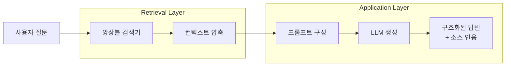
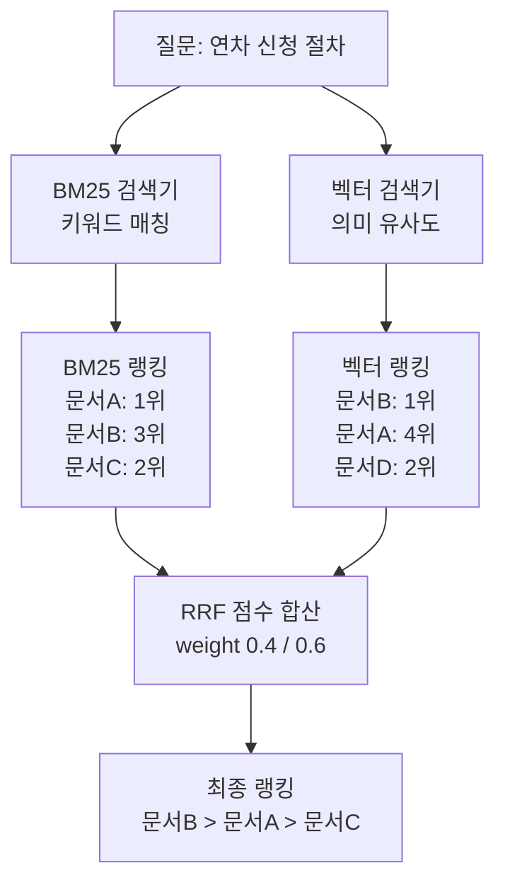
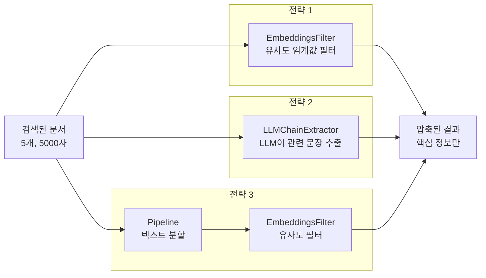
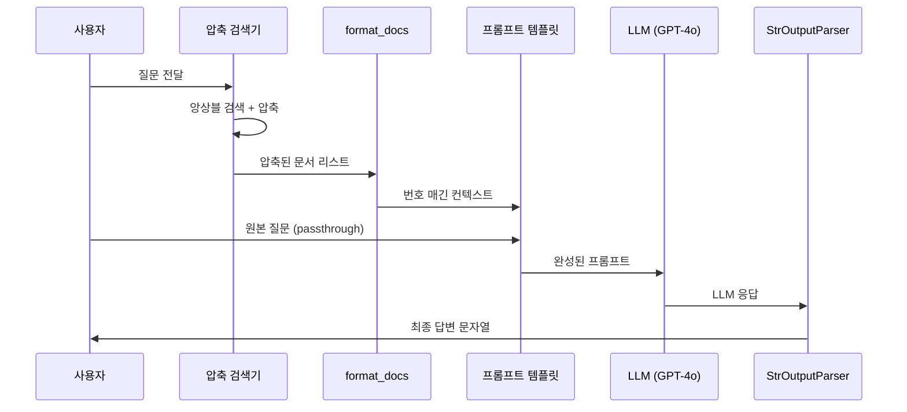
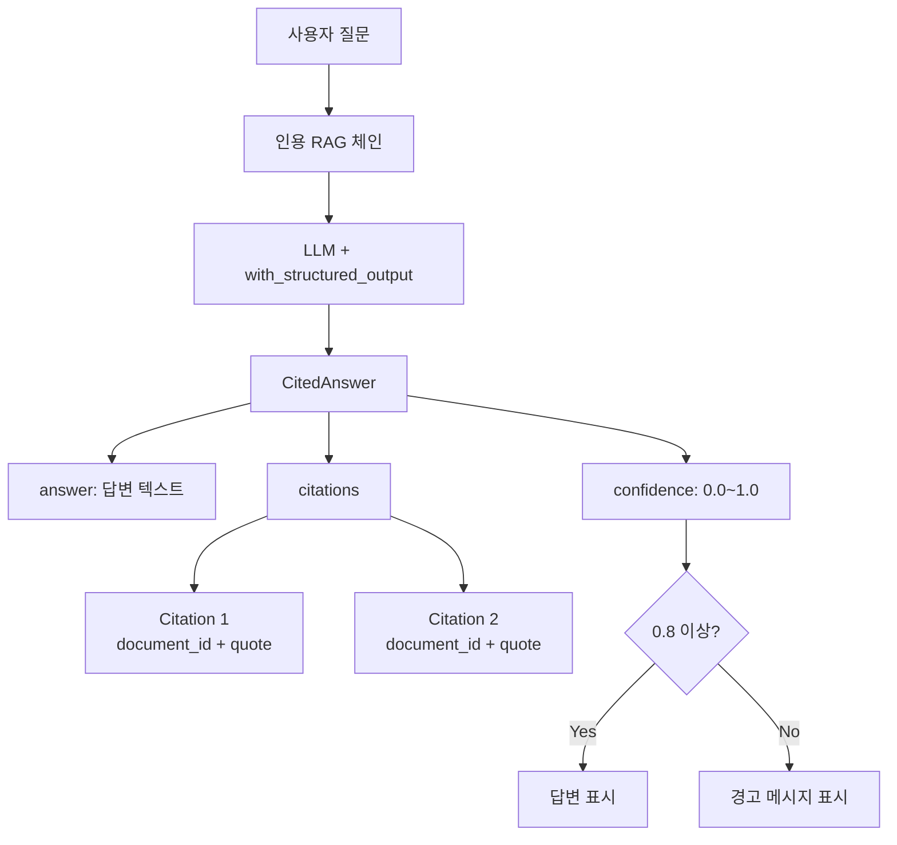

# 검색과 생성 파이프라인

> 앙상블 검색기로 문서를 찾고, 컨텍스트를 압축하며, 소스를 인용하는 RAG 체인을 구축합니다.

## 개요

이 섹션에서는 [18.2: 문서 수집과 인덱싱 파이프라인](ch18/session2.md)에서 구축한 FAISS 벡터 인덱스를 활용하여 **Retrieval Layer**와 **Application Layer**를 구현합니다. 단일 검색 전략의 한계를 앙상블 검색기로 극복하고, 불필요한 정보를 걸러내는 컨텍스트 압축을 적용한 뒤, 최종적으로 소스 인용이 포함된 RAG 체인을 완성합니다.

> 📊 **그림 1**: 검색-생성 파이프라인 전체 구조




**선수 지식**: FAISS 벡터 인덱스 구축(`IngestionPipeline`), 문서 로딩과 텍스트 분할, 임베딩 개념, LCEL 파이프 연산자(`|`)
**학습 목표**:
- BM25와 벡터 검색을 결합한 앙상블 검색기를 구성할 수 있다
- ContextualCompressionRetriever로 검색 결과의 품질을 높일 수 있다
- LCEL 기반 RAG 체인을 구현하고 소스 인용 시스템을 구축할 수 있다

## 왜 알아야 할까?

여러분이 회사에서 문서 QA 시스템을 시연한다고 상상해보세요. 사용자가 "연차 신청 절차가 어떻게 되나요?"라고 물었을 때, 시스템이 관련 없는 문서를 가져오거나, 정확한 답변을 했는데 "이 정보가 어디서 나온 건가요?"라는 질문에 답하지 못한다면 어떨까요? 신뢰를 잃는 건 순식간입니다.

기업용 문서 QA 시스템에서 **검색 품질**은 전체 시스템의 천장을 결정합니다. 아무리 좋은 LLM을 써도, 잘못된 문서를 가져오면 잘못된 답변이 나오거든요. 이 섹션에서 구축하는 앙상블 검색기, 컨텍스트 압축, 소스 인용 시스템은 프로덕션 RAG 시스템의 **3대 핵심 축**입니다.

## 핵심 개념

### 개념 1: 앙상블 검색기 — 두 가지 눈으로 문서 찾기

> 💡 **비유**: 도서관에서 책을 찾는 두 가지 방법을 생각해보세요. 하나는 **카탈로그 색인**(키워드로 정확히 매칭)이고, 다른 하나는 **사서에게 "이런 느낌의 책 찾아주세요"**(의미 기반 검색)라고 부탁하는 겁니다. 각각 장단점이 있죠 — 색인은 정확한 용어를 알 때 좋고, 사서는 맥락을 이해하니까요. **앙상블 검색기**는 이 두 방법을 동시에 쓰는 겁니다.

벡터 검색(Semantic Search)은 의미적 유사성을 잘 잡지만, 정확한 키워드 매칭에는 약합니다. 반대로 BM25 같은 키워드 기반 검색은 특정 용어가 포함된 문서를 잘 찾지만, 동의어나 맥락을 이해하지 못합니다. `EnsembleRetriever`는 여러 검색기의 결과를 **Reciprocal Rank Fusion(RRF)** 알고리즘으로 병합하여 두 세계의 장점을 취합니다.

RRF의 핵심 수식은 놀라울 정도로 간단합니다:

$$\text{RRF}(d) = \sum_{r \in R} \frac{1}{k + r(d)}$$

- $d$: 문서
- $R$: 각 검색기의 랭킹 리스트
- $r(d)$: 문서 $d$의 해당 검색기에서의 순위
- $k$: 상수 (기본값 60)

이게 의미하는 바는, **여러 검색기에서 골고루 높은 순위를 받은 문서가 최종적으로 높은 점수를 받는다**는 것입니다. 한 검색기에서만 1위인 것보다, 두 검색기 모두에서 3위인 문서가 더 높은 점수를 받을 수 있죠.

> 📊 **그림 2**: 앙상블 검색기의 RRF 병합 과정




```python
from langchain_community.retrievers import BM25Retriever
from langchain.retrievers import EnsembleRetriever
from langchain_community.vectorstores import FAISS
from langchain_openai import OpenAIEmbeddings

# 18.2에서 구축한 FAISS 인덱스 로드
embeddings = OpenAIEmbeddings()
vectorstore = FAISS.load_local(
    "faiss_index",
    embeddings,
    allow_dangerous_deserialization=True  # 신뢰할 수 있는 인덱스만!
)

# 벡터 검색기 — 의미 기반 검색
vector_retriever = vectorstore.as_retriever(
    search_type="mmr",          # 다양성 확보
    search_kwargs={"k": 5, "fetch_k": 20}
)

# BM25 검색기 — 키워드 기반 검색
# vectorstore에서 문서를 추출하여 BM25 인덱스 구축
all_docs = list(vectorstore.docstore._dict.values())
bm25_retriever = BM25Retriever.from_documents(all_docs)
bm25_retriever.k = 5  # 반환할 문서 수

# 앙상블 검색기 — 두 검색기의 결과를 RRF로 병합
ensemble_retriever = EnsembleRetriever(
    retrievers=[bm25_retriever, vector_retriever],
    weights=[0.4, 0.6]  # 의미 검색에 약간 더 가중치
)

# 테스트
results = ensemble_retriever.invoke("연차 신청 절차")
for doc in results:
    print(f"[{doc.metadata.get('source', '?')}] {doc.page_content[:80]}...")
```

> ⚠️ **흔한 오해**: `weights`가 각 검색기의 결과 개수 비율이라고 생각하는 분들이 많은데요, 실제로는 RRF 점수에 곱해지는 **가중치**입니다. `[0.4, 0.6]`이면 벡터 검색 결과의 RRF 점수에 0.6을 곱하고, BM25 결과에 0.4를 곱한 뒤 합산합니다.

### 개념 2: 컨텍스트 압축 — 핵심만 추려내기

> 💡 **비유**: 시험 전에 교과서를 읽는데, 300페이지짜리 책 전체를 읽을 순 없잖아요? 그래서 **형광펜**으로 핵심 문장만 표시하는 거죠. 컨텍스트 압축은 검색된 문서에서 **질문과 관련된 핵심 부분만 형광펜으로 칠하는** 과정입니다.


검색기가 가져온 문서가 항상 질문에 딱 맞는 건 아닙니다. 1000자짜리 청크 중에서 실제로 필요한 건 2~3문장일 수 있거든요. `ContextualCompressionRetriever`는 기본 검색기(base_retriever) 위에 **압축기(compressor)**를 얹어서, 검색된 문서를 질문 맥락에 맞게 압축하거나 필터링합니다.

> 📊 **그림 3**: 컨텍스트 압축 전략 비교




LangChain은 세 가지 압축 전략을 제공합니다:

| 전략 | 동작 방식 | 속도 | 품질 |
|------|----------|------|------|
| `LLMChainExtractor` | LLM이 관련 문장만 추출 | 느림 | 높음 |
| `EmbeddingsFilter` | 임베딩 유사도로 필터링 | 빠름 | 중간 |
| `DocumentCompressorPipeline` | 여러 전략 순차 적용 | 가변 | 높음 |

```python
from langchain.retrievers import ContextualCompressionRetriever
from langchain.retrievers.document_compressors import (
    DocumentCompressorPipeline,
    EmbeddingsFilter,
    LLMChainExtractor,
)
from langchain_text_splitters import CharacterTextSplitter
from langchain_openai import ChatOpenAI, OpenAIEmbeddings

llm = ChatOpenAI(model="gpt-4o", temperature=0)
embeddings = OpenAIEmbeddings()

# 전략 1: 임베딩 유사도 필터 (빠르고 경제적)
embeddings_filter = EmbeddingsFilter(
    embeddings=embeddings,
    similarity_threshold=0.76  # 이 임계값 이상만 통과
)

# 전략 2: LLM 기반 추출 (정확하지만 비용 발생)
llm_extractor = LLMChainExtractor.from_llm(llm)

# 전략 3: 파이프라인 (텍스트 분할 → 임베딩 필터 순차 적용)
splitter = CharacterTextSplitter(
    chunk_size=300,
    chunk_overlap=0,
    separator=". "  # 문장 단위로 분할
)
pipeline_compressor = DocumentCompressorPipeline(
    transformers=[splitter, embeddings_filter]
)

# 앙상블 검색기 + 컨텍스트 압축 = 최적의 검색 파이프라인
compression_retriever = ContextualCompressionRetriever(
    base_compressor=pipeline_compressor,
    base_retriever=ensemble_retriever  # 앞서 만든 앙상블 검색기
)

# 테스트: 압축 전후 비교
query = "연차 신청 시 필요한 서류"

# 압축 전 (원본)
raw_docs = ensemble_retriever.invoke(query)
print(f"압축 전: {sum(len(d.page_content) for d in raw_docs)}자, {len(raw_docs)}개 문서")

# 압축 후
compressed_docs = compression_retriever.invoke(query)
print(f"압축 후: {sum(len(d.page_content) for d in compressed_docs)}자, {len(compressed_docs)}개 문서")
```

### 개념 3: RAG 체인 구현 — 검색과 생성의 결합

> 💡 **비유**: 변호사가 법정에서 주장할 때, (1) 관련 판례를 찾고, (2) 핵심을 정리하고, (3) 논리적 주장을 펼치고, (4) 출처를 밝히잖아요? RAG 체인은 이 과정을 LLM이 자동으로 수행하는 것입니다.


LCEL을 활용하면 검색 → 컨텍스트 포맷팅 → LLM 생성 → 출력 파싱을 하나의 파이프라인으로 깔끔하게 연결할 수 있습니다.

> 📊 **그림 4**: LCEL 기반 RAG 체인 구조




```python
from langchain_core.prompts import ChatPromptTemplate
from langchain_core.output_parsers import StrOutputParser
from langchain_core.runnables import RunnablePassthrough, RunnableLambda
from langchain_openai import ChatOpenAI

llm = ChatOpenAI(model="gpt-4o", temperature=0)

# 컨텍스트 포맷팅 함수
def format_docs(docs: list) -> str:
    """검색된 문서를 번호가 매겨진 컨텍스트로 포맷팅"""
    formatted = []
    for i, doc in enumerate(docs, 1):
        source = doc.metadata.get("source", "알 수 없음")
        page = doc.metadata.get("page", "")
        # 소스 정보를 포함하여 포맷팅
        header = f"[문서 {i}] 출처: {source}"
        if page:
            header += f", {page}페이지"
        formatted.append(f"{header}\n{doc.page_content}")
    return "\n\n---\n\n".join(formatted)

# RAG 프롬프트 템플릿
rag_prompt = ChatPromptTemplate.from_messages([
    ("system", """당신은 기업 문서 기반 QA 어시스턴트입니다.
주어진 컨텍스트만을 사용하여 질문에 답변하세요.

규칙:
1. 컨텍스트에 없는 내용은 "해당 정보를 찾을 수 없습니다"라고 답하세요.
2. 답변에 사용한 문서 번호를 [문서 N] 형식으로 인용하세요.
3. 핵심을 먼저, 세부사항을 나중에 답변하세요.

컨텍스트:
{context}"""),
    ("human", "{question}")
])

# LCEL 기반 RAG 체인
rag_chain = (
    {
        "context": compression_retriever | format_docs,
        "question": RunnablePassthrough()
    }
    | rag_prompt
    | llm
    | StrOutputParser()
)

# 실행
answer = rag_chain.invoke("연차 신청 절차가 어떻게 되나요?")
print(answer)
```

### 개념 4: 소스 인용 시스템 — 신뢰를 만드는 투명성

> 💡 **비유**: 위키피디아의 "[출처 필요]" 태그를 생각해보세요. 근거 없는 주장은 신뢰받지 못합니다. 소스 인용 시스템은 AI의 모든 답변에 **"이건 여기서 가져왔어요"**라는 증거를 붙이는 겁니다.

프로덕션 환경에서는 단순히 답변만 생성하는 게 아니라, **어떤 문서의 어떤 부분에서 정보를 가져왔는지** 추적할 수 있어야 합니다. Pydantic 모델과 구조화된 출력을 활용하여 이를 체계적으로 구현할 수 있습니다.

> 📊 **그림 5**: 소스 인용 시스템의 구조화된 출력 흐름




```python
from pydantic import BaseModel, Field
from langchain_core.prompts import ChatPromptTemplate
from langchain_openai import ChatOpenAI

# 소스 인용을 포함한 구조화된 출력 모델
class Citation(BaseModel):
    """개별 인용 정보"""
    document_id: int = Field(description="참조한 문서 번호 (1부터 시작)")
    quote: str = Field(description="문서에서 인용한 원문 (50자 이내)")

class CitedAnswer(BaseModel):
    """소스 인용이 포함된 답변"""
    answer: str = Field(description="질문에 대한 답변")
    citations: list[Citation] = Field(description="답변에 사용된 인용 목록")
    confidence: float = Field(
        description="답변 신뢰도 (0.0~1.0)",
        ge=0.0, le=1.0
    )

# 구조화된 출력을 지원하는 LLM
llm = ChatOpenAI(model="gpt-4o", temperature=0)
structured_llm = llm.with_structured_output(CitedAnswer)

# 인용 포함 RAG 프롬프트
citation_prompt = ChatPromptTemplate.from_messages([
    ("system", """기업 문서 QA 어시스턴트입니다.
주어진 컨텍스트만 사용하여 답변하고, 반드시 인용을 포함하세요.

컨텍스트에 답이 없으면 confidence를 0.2 이하로 설정하세요.
충분한 근거가 있으면 confidence를 0.8 이상으로 설정하세요.

컨텍스트:
{context}"""),
    ("human", "{question}")
])

# 소스 인용 RAG 체인
cited_rag_chain = (
    {
        "context": compression_retriever | format_docs,
        "question": RunnablePassthrough()
    }
    | citation_prompt
    | structured_llm
)

# 실행 및 결과 처리
result: CitedAnswer = cited_rag_chain.invoke("연차 신청 시 필요한 서류는?")

print(f"📝 답변: {result.answer}\n")
print(f"📊 신뢰도: {result.confidence:.0%}\n")
print("📌 인용:")
for c in result.citations:
    print(f"  [문서 {c.document_id}] \"{c.quote}\"")
```

## 실습: 직접 해보기

앞서 배운 모든 개념을 통합하여, 기업용 문서 QA 시스템의 **검색-생성 파이프라인 전체**를 하나의 클래스로 구현해봅시다. [18.1](ch18/session1.md)에서 설계한 계층 아키텍처의 Retrieval Layer와 Application Layer에 해당합니다.

```python
"""
검색과 생성 파이프라인 — 통합 실습
18.2의 IngestionPipeline으로 구축한 인덱스 위에 동작합니다.
"""
import os
from dataclasses import dataclass, field
from dotenv import load_dotenv
from pydantic import BaseModel, Field

from langchain_openai import ChatOpenAI, OpenAIEmbeddings
from langchain_community.vectorstores import FAISS
from langchain_community.retrievers import BM25Retriever
from langchain.retrievers import (
    EnsembleRetriever,
    ContextualCompressionRetriever,
)
from langchain.retrievers.document_compressors import (
    DocumentCompressorPipeline,
    EmbeddingsFilter,
)
from langchain_text_splitters import CharacterTextSplitter
from langchain_core.prompts import ChatPromptTemplate
from langchain_core.runnables import RunnablePassthrough
from langchain_core.documents import Document

load_dotenv()

# ── 구조화된 출력 모델 ──────────────────────────────────────

class Citation(BaseModel):
    """개별 인용"""
    document_id: int = Field(description="참조 문서 번호")
    quote: str = Field(description="인용 원문 (50자 이내)")

class CitedAnswer(BaseModel):
    """인용 포함 답변"""
    answer: str = Field(description="질문에 대한 답변")
    citations: list[Citation] = Field(default_factory=list)
    confidence: float = Field(ge=0.0, le=1.0, description="신뢰도")

# ── 검색-생성 파이프라인 ─────────────────────────────────────

@dataclass
class RetrievalConfig:
    """검색 파이프라인 설정"""
    bm25_weight: float = 0.4          # BM25 가중치
    vector_weight: float = 0.6        # 벡터 검색 가중치
    top_k: int = 5                    # 검색 문서 수
    fetch_k: int = 20                 # MMR 후보 수
    similarity_threshold: float = 0.76 # 임베딩 필터 임계값
    model_name: str = "gpt-4o"
    temperature: float = 0.0


class QAPipeline:
    """기업 문서 QA 파이프라인

    앙상블 검색 → 컨텍스트 압축 → 인용 포함 RAG 생성
    """

    def __init__(
        self,
        index_path: str,
        config: RetrievalConfig | None = None,
    ):
        self.config = config or RetrievalConfig()
        self.embeddings = OpenAIEmbeddings()
        self.llm = ChatOpenAI(
            model=self.config.model_name,
            temperature=self.config.temperature,
        )

        # 1단계: 벡터 스토어 로드
        self.vectorstore = FAISS.load_local(
            index_path,
            self.embeddings,
            allow_dangerous_deserialization=True,
        )

        # 2단계: 검색기 구성
        self._retriever = self._build_retriever()

        # 3단계: RAG 체인 구성
        self._chain = self._build_chain()

    def _build_retriever(self) -> ContextualCompressionRetriever:
        """앙상블 + 압축 검색기 구성"""
        cfg = self.config

        # 벡터 검색기 (MMR로 다양성 확보)
        vector_ret = self.vectorstore.as_retriever(
            search_type="mmr",
            search_kwargs={"k": cfg.top_k, "fetch_k": cfg.fetch_k},
        )

        # BM25 검색기 (키워드 매칭)
        all_docs = list(self.vectorstore.docstore._dict.values())
        bm25_ret = BM25Retriever.from_documents(all_docs)
        bm25_ret.k = cfg.top_k

        # 앙상블 (RRF 병합)
        ensemble_ret = EnsembleRetriever(
            retrievers=[bm25_ret, vector_ret],
            weights=[cfg.bm25_weight, cfg.vector_weight],
        )

        # 컨텍스트 압축 파이프라인
        splitter = CharacterTextSplitter(
            chunk_size=300, chunk_overlap=0, separator=". "
        )
        emb_filter = EmbeddingsFilter(
            embeddings=self.embeddings,
            similarity_threshold=cfg.similarity_threshold,
        )
        compressor = DocumentCompressorPipeline(
            transformers=[splitter, emb_filter]
        )

        return ContextualCompressionRetriever(
            base_compressor=compressor,
            base_retriever=ensemble_ret,
        )

    @staticmethod
    def _format_docs(docs: list[Document]) -> str:
        """검색 문서를 번호 매긴 컨텍스트로 변환"""
        parts = []
        for i, doc in enumerate(docs, 1):
            src = doc.metadata.get("source", "알 수 없음")
            page = doc.metadata.get("page", "")
            header = f"[문서 {i}] 출처: {src}"
            if page:
                header += f", {page}페이지"
            parts.append(f"{header}\n{doc.page_content}")
        return "\n\n---\n\n".join(parts)

    def _build_chain(self):
        """인용 포함 RAG 체인 구성"""
        prompt = ChatPromptTemplate.from_messages([
            ("system", """기업 문서 QA 어시스턴트입니다.
주어진 컨텍스트만 사용하여 정확하게 답변하세요.

규칙:
1. 컨텍스트에 없는 내용은 답변하지 마세요.
2. 반드시 참조한 문서 번호를 citations에 포함하세요.
3. 충분한 근거가 있으면 confidence 0.8+, 불확실하면 0.5 이하로 설정하세요.

컨텍스트:
{context}"""),
            ("human", "{question}"),
        ])

        structured_llm = self.llm.with_structured_output(CitedAnswer)

        return (
            {
                "context": self._retriever | self._format_docs,
                "question": RunnablePassthrough(),
            }
            | prompt
            | structured_llm
        )

    def ask(self, question: str) -> CitedAnswer:
        """질문에 대한 인용 포함 답변 반환"""
        return self._chain.invoke(question)

    def ask_with_sources(self, question: str) -> dict:
        """답변 + 원본 소스 문서 함께 반환"""
        # 검색된 원본 문서 보존
        source_docs = self._retriever.invoke(question)
        answer = self._chain.invoke(question)

        return {
            "answer": answer,
            "source_documents": source_docs,
        }


# ── 실행 예시 ────────────────────────────────────────────────

def main():
    # 18.2에서 구축한 인덱스 경로
    INDEX_PATH = "faiss_index"

    # 파이프라인 초기화
    config = RetrievalConfig(
        bm25_weight=0.4,
        vector_weight=0.6,
        similarity_threshold=0.76,
    )
    pipeline = QAPipeline(index_path=INDEX_PATH, config=config)

    # 질문하기
    questions = [
        "연차 신청 절차가 어떻게 되나요?",
        "재택근무 시 보안 규정은?",
        "신입사원 온보딩 체크리스트를 알려주세요.",
    ]

    for q in questions:
        print(f"\n{'='*60}")
        print(f"❓ {q}")
        print(f"{'='*60}")

        result = pipeline.ask(q)
        print(f"\n📝 답변:\n{result.answer}")
        print(f"\n📊 신뢰도: {result.confidence:.0%}")
        if result.citations:
            print("\n📌 인용:")
            for c in result.citations:
                print(f"  [문서 {c.document_id}] \"{c.quote}\"")


if __name__ == "__main__":
    main()
```

## 더 깊이 알아보기

### RRF의 탄생 — 단순함이 이긴 이야기

앙상블 검색기의 핵심인 **Reciprocal Rank Fusion(RRF)** 알고리즘은 2009년 워털루 대학교의 Gordon Cormack, Charles Clarke, Stefan Buettcher가 ACM SIGIR 학회에서 발표했습니다. 당시 여러 검색 결과를 합치는 방법으로는 머신러닝 기반의 복잡한 랭킹 학습(Learning to Rank)이나, 투표 이론에서 빌려온 Condorcet Fusion 같은 방법들이 있었는데요.

놀랍게도 RRF는 **수식 한 줄**(`1/(k+rank)`)로 이 복잡한 방법들을 모두 이겼습니다. 논문 제목부터 "Reciprocal Rank Fusion **outperforms** Condorcet and Individual Rank Learning Methods"라고 당당하게 선언했죠. 하이퍼파라미터도 `k=60` 하나뿐이고, 학습 데이터도 필요 없습니다. 이후 Elasticsearch, Azure AI Search 등 주요 검색 엔진들이 RRF를 하이브리드 검색의 표준 알고리즘으로 채택했습니다.


### 컨텍스트 압축 — "Less is More"

LangChain의 컨텍스트 압축은 정보 검색(IR) 분야의 오랜 원칙인 **"쿼리에 관련 있는 정보만 전달하라"**에서 출발합니다. 전통적인 검색 시스템은 문서 단위로 결과를 반환했지만, RAG에서는 LLM의 컨텍스트 윈도우가 제한되어 있으니 **문서 내에서도 관련 부분만 추출**하는 것이 중요합니다. LangChain 팀은 2023년 블로그 포스트 "[Improving Document Retrieval with Contextual Compression](https://blog.langchain.com/improving-document-retrieval-with-contextual-compression/)"에서 이 개념을 처음 소개했는데, 핵심 메시지는 "검색된 문서를 그대로 쓰지 말고, 질문에 맞게 압축하라"였습니다.

## 흔한 오해와 팁

> ⚠️ **흔한 오해**: "벡터 검색만 쓰면 충분하다"고 생각하는 분들이 많은데요, 실제로는 고유명사, 코드명, 문서 번호 같은 **정확한 키워드 매칭**이 필요한 질문에서 벡터 검색은 자주 실패합니다. "HR-2024-031 문서 내용 알려줘"라는 질문에 벡터 검색은 의미적으로 비슷한 엉뚱한 문서를 가져올 수 있지만, BM25는 정확히 그 문서를 찾아냅니다. 앙상블 검색기를 쓰는 이유가 바로 이것입니다.

> 💡 **알고 계셨나요?**: `EmbeddingsFilter`의 `similarity_threshold`는 매우 민감합니다. 0.76과 0.80의 차이만으로도 반환되는 문서 수가 절반으로 줄어들 수 있어요. 프로덕션에서는 0.72~0.80 범위에서 실제 질문 100개 정도로 벤치마크한 뒤 최적값을 찾는 걸 권장합니다.

> 🔥 **실무 팁**: 소스 인용의 `confidence` 값은 사용자에게 보여주되, **임계값 기반 경고**를 함께 구현하세요. confidence가 0.5 이하이면 "이 답변은 충분한 근거를 찾지 못했습니다. 담당 부서에 직접 문의하시는 것을 권장합니다"라는 메시지를 표시하면, 환각(hallucination)으로 인한 피해를 줄일 수 있습니다.

> 🔥 **실무 팁**: BM25Retriever를 생성할 때 대규모 문서셋에서는 메모리 사용량에 주의하세요. `vectorstore.docstore._dict.values()`로 전체 문서를 메모리에 올리므로, 수십만 건 이상이면 별도의 BM25 서버(예: Elasticsearch)를 사용하는 것이 좋습니다.

## 핵심 정리

| 개념 | 설명 |
|------|------|
| **EnsembleRetriever** | 여러 검색기의 결과를 RRF 알고리즘으로 병합하는 메타 검색기 |
| **BM25Retriever** | 키워드 빈도 기반의 전통적 정보 검색 알고리즘 |
| **RRF (Reciprocal Rank Fusion)** | `1/(k+rank)` 공식으로 다중 랭킹을 병합하는 알고리즘 (k=60) |
| **ContextualCompressionRetriever** | 기본 검색기 위에 압축기를 얹어 관련 정보만 추출 |
| **EmbeddingsFilter** | 임베딩 유사도 임계값으로 문서를 필터링하는 빠른 압축기 |
| **DocumentCompressorPipeline** | 여러 압축 전략을 순차적으로 연결하는 파이프라인 |
| **CitedAnswer** | Pydantic 모델을 활용한 구조화된 인용 포함 답변 |
| **with_structured_output** | LLM이 Pydantic 모델에 맞는 구조화된 응답을 생성하도록 설정 |

## 다음 섹션 미리보기

이번 섹션에서 검색-생성 파이프라인의 핵심을 구축했다면, 다음 [18.4: 대화형 QA와 멀티턴 메모리](ch18/session4.md)에서는 이 파이프라인에 **대화 기억력**을 부여합니다. 사용자가 "그럼 재택근무는?"이라고 물었을 때, 이전 대화 맥락에서 "그럼"이 무엇을 가리키는지 이해하는 멀티턴 대화형 RAG를 구현합니다. `ConversationBufferMemory`와 `create_history_aware_retriever`를 활용하여, 단발성 QA를 넘어선 자연스러운 대화형 시스템을 만들어 볼 겁니다.

## 참고 자료

- [EnsembleRetriever — LangChain 공식 API 문서](https://python.langchain.com/api_reference/langchain/retrievers/langchain.retrievers.ensemble.EnsembleRetriever.html) - 앙상블 검색기의 파라미터와 사용법 공식 레퍼런스
- [How to do retrieval with contextual compression — LangChain 공식 가이드](https://python.langchain.com/v0.2/docs/how_to/contextual_compression/) - 컨텍스트 압축 검색기의 단계별 구현 튜토리얼
- [How to get a RAG application to add citations — LangChain 공식 가이드](https://python.langchain.com/docs/how_to/qa_citations/) - 소스 인용 포함 RAG 구현 공식 문서
- [BM25Retriever — LangChain Community 문서](https://python.langchain.com/api_reference/community/retrievers/langchain_community.retrievers.bm25.BM25Retriever.html) - BM25 검색기 API 레퍼런스
- [Reciprocal Rank Fusion outperforms Condorcet and Individual Rank Learning Methods (Cormack et al., 2009)](https://dl.acm.org/doi/10.1145/1571941.1572114) - RRF 알고리즘 원논문
- [Improving Document Retrieval with Contextual Compression — LangChain Blog](https://blog.langchain.com/improving-document-retrieval-with-contextual-compression/) - 컨텍스트 압축 개념 소개 블로그 포스트

---
### 🔗 Related Sessions
- [lcel](../01-langchain-소개와-개발-환경-설정/01-llm-애플리케이션의-진화와-langchain.md) (prerequisite)
- [chatprompttemplate](../01-langchain-소개와-개발-환경-설정/04-첫-번째-langchain-애플리케이션.md) (prerequisite)
- [faiss](../07-임베딩과-벡터-스토어/03-벡터-스토어-구축---faiss와-chroma.md) (prerequisite)
- [ingestionpipeline](../18-실전-프로젝트-1-지능형-문서-qa-시스템/02-문서-수집과-인덱싱-파이프라인.md) (prerequisite)
