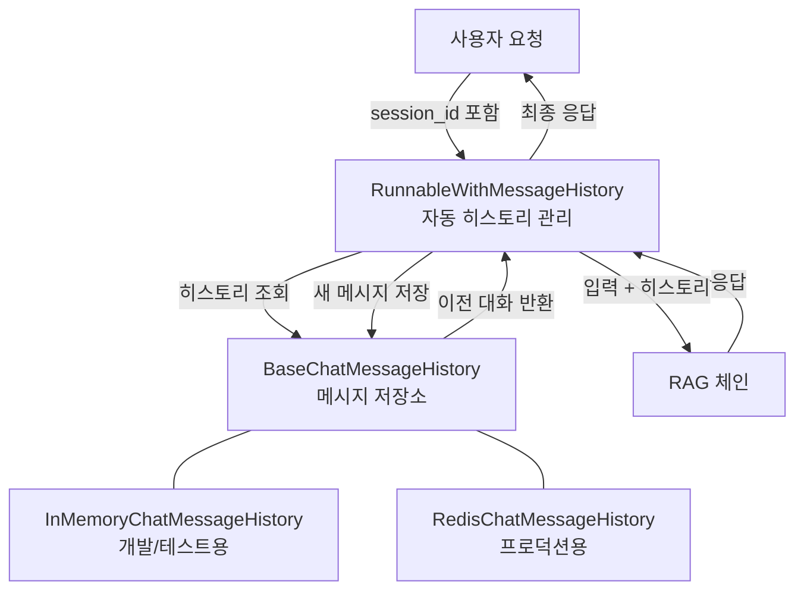
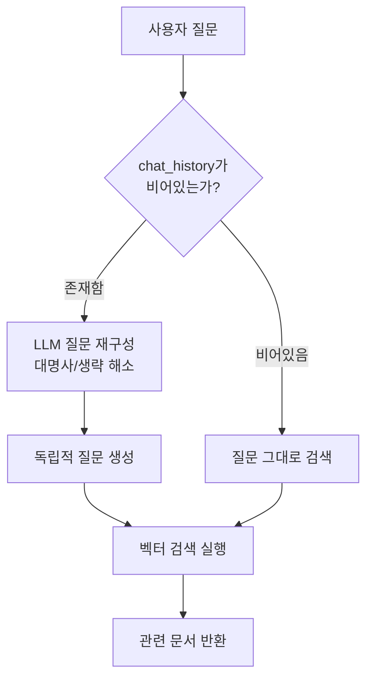
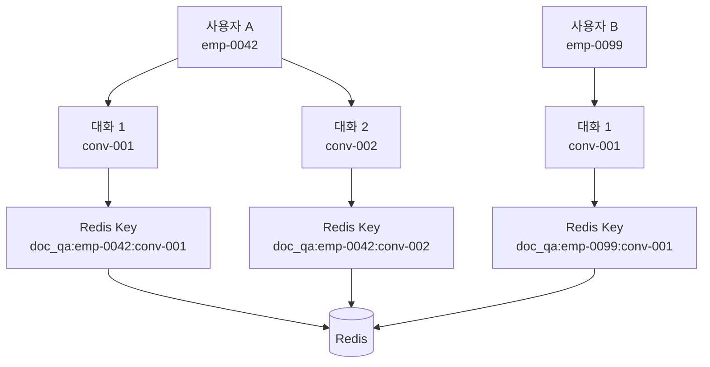
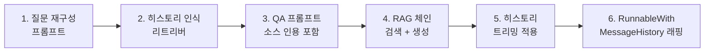
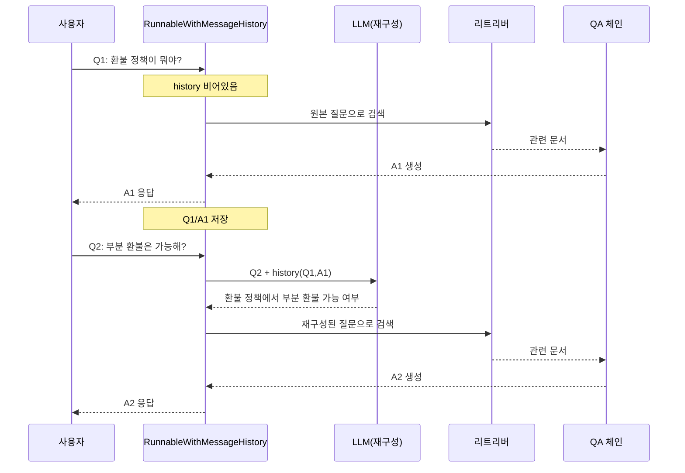

# 대화 관리와 메모리

> 단순 질의응답을 넘어, 사용자와 자연스럽게 대화를 이어가는 멀티턴 QA 시스템을 구축합니다.

## 개요

이 섹션에서는 앞서 구축한 문서 QA 파이프라인(`QAPipeline`)에 **대화 메모리**를 통합하여, 사용자가 "그거 좀 더 자세히 알려줘"처럼 맥락을 이어가는 후속 질문을 자연스럽게 처리할 수 있는 시스템을 만듭니다. 인메모리 저장소부터 Redis 기반 영속 저장까지, 프로덕션 수준의 대화 관리 전략을 단계별로 구현합니다.

**선수 지식**: [18.3 검색과 생성 파이프라인](ch18/session_18_3.md)에서 구현한 `QAPipeline`, `EnsembleRetriever`, 소스 인용 RAG 체인
**학습 목표**:
- `RunnableWithMessageHistory`를 활용해 멀티턴 대화 RAG 체인을 구성할 수 있다
- `create_history_aware_retriever`로 후속 질문을 독립 질문으로 재구성할 수 있다
- Redis를 이용한 영속적 대화 히스토리 저장과 세션 관리를 구현할 수 있다
- 히스토리 윈도우 제한, TTL 설정 등 프로덕션 메모리 관리 전략을 적용할 수 있다

## 왜 알아야 할까?

여러분이 회사에서 사내 문서 QA 시스템을 배포했다고 상상해보세요. 사용자가 "우리 회사 환불 정책이 뭐야?"라고 묻고, 시스템이 잘 답변합니다. 그런데 바로 이어서 **"그럼 부분 환불은 가능해?"**라고 물으면 어떻게 될까요?

대화 메모리가 없는 시스템은 "부분 환불"이 무엇의 부분 환불인지 알 수 없습니다. 앞서 "환불 정책"에 대해 대화했다는 맥락이 사라졌기 때문이죠. 실제 기업 환경에서 QA 시스템을 사용하는 직원들의 70% 이상이 **후속 질문**을 던집니다. 한 번의 질문으로 원하는 답을 얻는 경우가 오히려 드물거든요.

[18.3 검색과 생성 파이프라인](ch18/session_18_3.md)에서 우리가 만든 `QAPipeline`은 매 질문을 독립적으로 처리합니다. 이번 세션에서 대화 메모리를 추가하면, 사용자는 마치 **전문가와 대화하듯** 자연스럽게 문서를 탐색할 수 있게 됩니다.

## 핵심 개념

### 개념 1: 대화 메모리의 구조 — 카페 단골손님 비유

> 💡 **비유**: 동네 카페를 떠올려보세요. 처음 온 손님에게 바리스타는 "무엇을 드릴까요?"부터 시작합니다. 하지만 매일 오는 단골에게는 "오늘도 아메리카노요?"라고 묻죠. 바리스타의 머릿속에 **"이 손님은 보통 아메리카노를 시킨다"**는 기억이 있기 때문입니다. 대화 메모리도 마찬가지입니다 — 이전 대화 내용을 기억해서 후속 질문의 맥락을 이해합니다.

LangChain에서 대화 메모리는 크게 세 가지 구성요소로 나뉩니다:

| 구성요소 | 역할 | 비유 |
|---------|------|------|
| `BaseChatMessageHistory` | 메시지 저장소 인터페이스 | 대화 노트 |
| `RunnableWithMessageHistory` | 체인에 히스토리를 자동 주입 | 바리스타의 기억력 |
| `session_id` | 대화 세션 식별자 | 단골 카드 번호 |

가장 간단한 인메모리 구현부터 시작해보겠습니다:

> 📊 **그림 1**: 대화 메모리의 핵심 구성요소와 관계




```python
from langchain_core.chat_history import InMemoryChatMessageHistory

# 세션별 히스토리를 저장할 딕셔너리
store: dict[str, InMemoryChatMessageHistory] = {}

def get_session_history(session_id: str) -> InMemoryChatMessageHistory:
    """세션 ID로 대화 히스토리를 가져오거나 새로 생성합니다."""
    if session_id not in store:
        store[session_id] = InMemoryChatMessageHistory()
    return store[session_id]

# 사용 예시
history = get_session_history("user-123")
history.add_user_message("환불 정책이 뭐야?")       # 사용자 메시지 추가
history.add_ai_message("환불 정책은 구매 후 30일...")  # AI 응답 추가

print(len(history.messages))  # 출력: 2
```

> ⚠️ **흔한 오해**: LangChain v0.3부터 `ConversationBufferMemory`, `ConversationChain` 등 기존 메모리 클래스는 **모두 deprecated**되었습니다. `RunnableWithMessageHistory`가 공식 권장 방식입니다. v1.0에서는 이 레거시 클래스들이 `langchain-classic` 패키지로 분리되었으니, 새 프로젝트에서는 절대 사용하지 마세요.

### 개념 2: 후속 질문 재구성 — 통역사 비유

> 💡 **비유**: 국제 회의에서 통역사가 일하는 모습을 상상해보세요. 발표자가 "그 수치를 다시 보여주세요"라고 하면, 통역사는 단순히 "Show the number again"이라고 번역하지 않습니다. 앞뒤 맥락을 파악해서 **"2023년 4분기 매출 그래프를 다시 표시해주세요"**로 완전한 문장을 만들죠. `create_history_aware_retriever`가 바로 이 통역사 역할을 합니다.

후속 질문의 핵심 문제는 **대명사와 생략**입니다. "그거 좀 더 자세히", "부분 환불은?" 같은 질문은 대화 맥락 없이는 검색이 불가능합니다. `create_history_aware_retriever`는 LLM을 이용해 이런 후속 질문을 **독립적인 질문으로 재구성**한 뒤 검색합니다.

```python
from langchain_core.prompts import ChatPromptTemplate, MessagesPlaceholder
from langchain.chains import create_history_aware_retriever

# 질문 재구성 프롬프트
contextualize_q_prompt = ChatPromptTemplate.from_messages([
    ("system",
     "대화 기록과 최신 사용자 질문이 주어집니다. "
     "질문이 대화 기록의 맥락을 참조할 수 있습니다. "
     "대화 기록 없이도 이해할 수 있는 독립적인 질문으로 재구성하세요. "
     "질문에 답하지 말고, 필요하면 재구성하고 아니면 그대로 반환하세요."),
    MessagesPlaceholder("chat_history"),  # 대화 히스토리 주입 위치
    ("human", "{input}"),
])

# 히스토리 인식 리트리버 생성
history_aware_retriever = create_history_aware_retriever(
    llm,        # ChatOpenAI 등 LLM
    retriever,  # 18.3에서 만든 앙상블 리트리버
    contextualize_q_prompt
)
```

이 리트리버의 동작 흐름을 살펴보면:

> 📊 **그림 2**: history_aware_retriever의 질문 재구성 흐름




```
사용자: "환불 정책 알려줘"
→ chat_history가 비어있음 → 그대로 "환불 정책 알려줘"로 검색

사용자: "부분 환불은 가능해?"
→ chat_history에 이전 대화 존재
→ LLM이 재구성: "환불 정책에서 부분 환불이 가능한가?"
→ 재구성된 질문으로 검색
```

### 개념 3: RunnableWithMessageHistory — 자동 기억 장치

> 💡 **비유**: 스마트폰의 자동 완성 기능을 떠올려보세요. 여러분이 "ㅋ"만 입력해도 이전 대화 패턴을 기억해서 "ㅋㅋㅋ 알겠어"를 제안하죠. `RunnableWithMessageHistory`도 비슷합니다 — 체인을 감싸서 매 호출마다 이전 대화를 자동으로 불러오고, 새 대화를 자동으로 저장합니다. 개발자가 일일이 히스토리를 관리할 필요가 없어지는 거죠.

`RunnableWithMessageHistory`는 기존 체인을 감싸는 래퍼(Wrapper)입니다. 핵심 매개변수를 이해해야 올바르게 사용할 수 있습니다:

```python
from langchain_core.runnables.history import RunnableWithMessageHistory

conversational_chain = RunnableWithMessageHistory(
    runnable=rag_chain,              # 감쌀 체인 (create_retrieval_chain 결과)
    get_session_history=get_session_history,  # 세션 히스토리 팩토리 함수
    input_messages_key="input",      # 입력 딕셔너리에서 사용자 메시지 키
    history_messages_key="chat_history",  # 프롬프트의 MessagesPlaceholder 이름
    output_messages_key="answer",    # 출력 딕셔너리에서 AI 응답 키
)

# 호출 시 session_id를 config로 전달
result = conversational_chain.invoke(
    {"input": "환불 정책이 뭐야?"},
    config={"configurable": {"session_id": "user-abc"}},
)
print(result["answer"])
```

`config`의 `session_id`가 카페의 단골 카드 번호 역할을 합니다. 같은 `session_id`로 호출하면 이전 대화가 자동으로 주입되고, 다른 `session_id`로 호출하면 완전히 새로운 대화가 시작됩니다.

### 개념 4: Redis로 대화 영속화 — 기억의 금고

> 💡 **비유**: 인메모리 저장소는 화이트보드에 메모하는 것과 같습니다 — 서버를 재시작하면 모든 대화가 사라지죠. Redis는 **금고**입니다. 대화 내용을 안전하게 보관하고, 서버가 재시작되어도 사용자가 이전 대화를 이어갈 수 있게 해줍니다.

프로덕션 환경에서는 인메모리 저장소를 사용할 수 없습니다. 서버 재시작, 스케일 아웃, 장애 복구 등을 고려하면 외부 저장소가 필수입니다. Redis는 빠른 읽기/쓰기 성능과 TTL(Time-To-Live) 지원으로 대화 히스토리 저장에 가장 많이 쓰이는 선택지입니다.

LangChain은 두 가지 Redis 통합을 제공합니다:

| 패키지 | 설치 | 특징 |
|--------|------|------|
| `langchain-community` | `pip install langchain-community redis` | 레거시, 안정적 |
| `langchain-redis` | `pip install langchain-redis` | 공식 파트너, 검색 지원 |

2025년 기준 **`langchain-redis`** 파트너 패키지가 권장됩니다:

```python
from langchain_redis import RedisChatMessageHistory

def get_redis_history(session_id: str) -> RedisChatMessageHistory:
    """Redis 기반 세션 히스토리 팩토리."""
    return RedisChatMessageHistory(
        session_id=session_id,
        redis_url="redis://localhost:6379",
        key_prefix="doc_qa:",    # Redis 키 접두사
        ttl=86400,               # 24시간 후 자동 만료
    )
```

TTL 설정이 특히 중요합니다. 기업 환경에서는 보안과 스토리지 비용을 고려해 대화 히스토리에 만료 기한을 설정해야 합니다. `ttl=86400`은 24시간(초 단위)을 의미하며, 이 시간이 지나면 대화 기록이 자동으로 삭제됩니다.

### 개념 5: 세션 관리 전략 — 멀티 키 세션

실제 서비스에서는 단순 `session_id` 하나로는 부족한 경우가 많습니다. **사용자 ID**와 **대화 ID**를 분리해야 한 사용자가 여러 대화를 동시에 진행할 수 있거든요.

> 📊 **그림 5**: 멀티 키 세션 관리 구조




```python
from langchain_core.runnables import ConfigurableFieldSpec

def get_session_history(
    user_id: str,
    conversation_id: str
) -> RedisChatMessageHistory:
    """user_id + conversation_id 조합으로 세션을 구분합니다."""
    session_key = f"{user_id}:{conversation_id}"
    return RedisChatMessageHistory(
        session_id=session_key,
        redis_url="redis://localhost:6379",
        key_prefix="doc_qa:",
        ttl=86400,
    )

# 멀티 키 세션 설정
conversational_chain = RunnableWithMessageHistory(
    rag_chain,
    get_session_history,
    input_messages_key="input",
    history_messages_key="chat_history",
    output_messages_key="answer",
    history_factory_config=[
        ConfigurableFieldSpec(
            id="user_id",
            annotation=str,
            name="User ID",
            description="사용자 고유 식별자",
            default="",
        ),
        ConfigurableFieldSpec(
            id="conversation_id",
            annotation=str,
            name="Conversation ID",
            description="대화 세션 고유 식별자",
            default="",
        ),
    ],
)

# 호출 시 user_id와 conversation_id를 모두 전달
result = conversational_chain.invoke(
    {"input": "환불 정책 알려줘"},
    config={
        "configurable": {
            "user_id": "emp-0042",
            "conversation_id": "conv-20260303-1",
        }
    },
)
```

### 개념 6: 히스토리 윈도우 제한 — 기억의 용량 관리

대화가 길어지면 히스토리도 커지고, 이는 두 가지 문제를 일으킵니다:
1. **토큰 비용 증가** — 매 요청마다 전체 히스토리가 프롬프트에 포함
2. **컨텍스트 윈도우 초과** — LLM의 최대 토큰 한계에 도달

`trim_messages`를 활용하면 최근 N개 메시지만 유지할 수 있습니다:

```python
from langchain_core.messages import trim_messages

# 최근 10개 메시지만 유지하는 트리머
trimmer = trim_messages(
    max_tokens=4000,              # 최대 토큰 수
    strategy="last",              # 최근 메시지 유지
    token_counter=llm,            # LLM으로 토큰 수 계산
    include_system=True,          # 시스템 메시지는 항상 포함
    allow_partial=False,          # 메시지를 자르지 않음
)

# 체인에 트리머 통합
from langchain_core.runnables import RunnablePassthrough
from operator import itemgetter

chain_with_trimming = (
    RunnablePassthrough.assign(
        chat_history=lambda x: trimmer.invoke(x["chat_history"])
    )
    | rag_chain
)
```

## 실습: 직접 해보기

> 📊 **그림 3**: ConversationalQA 체인 구성 파이프라인 (6단계)




이제 [18.3 검색과 생성 파이프라인](ch18/session_18_3.md)에서 만든 `QAPipeline`에 대화 메모리를 통합한 `ConversationalQA` 클래스를 구축합니다. Redis 없이도 테스트할 수 있도록 인메모리 모드도 지원합니다.

```python
"""
Session 18.4 — 대화형 문서 QA 시스템
Redis 또는 인메모리 기반 대화 히스토리를 지원하는 멀티턴 RAG 파이프라인
"""
from __future__ import annotations

from dataclasses import dataclass, field
from typing import Optional

from langchain_core.chat_history import (
    BaseChatMessageHistory,
    InMemoryChatMessageHistory,
)
from langchain_core.messages import trim_messages
from langchain_core.prompts import ChatPromptTemplate, MessagesPlaceholder
from langchain_core.runnables import ConfigurableFieldSpec, RunnablePassthrough
from langchain_core.runnables.history import RunnableWithMessageHistory
from langchain_openai import ChatOpenAI, OpenAIEmbeddings
from langchain.chains import (
    create_history_aware_retriever,
    create_retrieval_chain,
)
from langchain.chains.combine_documents import create_stuff_documents_chain
from langchain_community.vectorstores import FAISS


# ──────────────────────────────────────────────
# 1. 설정 데이터 클래스
# ──────────────────────────────────────────────
@dataclass
class ConversationConfig:
    """대화 관리 설정."""
    model_name: str = "gpt-4o"
    temperature: float = 0.3
    max_history_tokens: int = 4000    # 히스토리 최대 토큰
    redis_url: Optional[str] = None   # None이면 인메모리 사용
    redis_ttl: int = 86400            # Redis TTL (초), 기본 24시간
    key_prefix: str = "doc_qa:"       # Redis 키 접두사


# ──────────────────────────────────────────────
# 2. 세션 히스토리 관리자
# ──────────────────────────────────────────────
class SessionManager:
    """인메모리 / Redis 대화 히스토리를 통합 관리합니다."""

    def __init__(self, config: ConversationConfig) -> None:
        self.config = config
        self._in_memory_store: dict[str, InMemoryChatMessageHistory] = {}

    def get_history(
        self, user_id: str, conversation_id: str
    ) -> BaseChatMessageHistory:
        """user_id + conversation_id 조합으로 히스토리를 반환합니다."""
        session_key = f"{user_id}:{conversation_id}"

        if self.config.redis_url:
            # Redis 모드
            from langchain_redis import RedisChatMessageHistory

            return RedisChatMessageHistory(
                session_id=session_key,
                redis_url=self.config.redis_url,
                key_prefix=self.config.key_prefix,
                ttl=self.config.redis_ttl,
            )

        # 인메모리 모드 (개발/테스트용)
        if session_key not in self._in_memory_store:
            self._in_memory_store[session_key] = InMemoryChatMessageHistory()
        return self._in_memory_store[session_key]

    def list_conversations(self, user_id: str) -> list[str]:
        """특정 사용자의 대화 목록을 반환합니다 (인메모리 전용)."""
        prefix = f"{user_id}:"
        return [
            key.split(":", 1)[1]
            for key in self._in_memory_store
            if key.startswith(prefix)
        ]

    def delete_conversation(
        self, user_id: str, conversation_id: str
    ) -> None:
        """특정 대화를 삭제합니다."""
        session_key = f"{user_id}:{conversation_id}"
        if self.config.redis_url:
            history = self.get_history(user_id, conversation_id)
            history.clear()
        else:
            self._in_memory_store.pop(session_key, None)


# ──────────────────────────────────────────────
# 3. 대화형 QA 파이프라인
# ──────────────────────────────────────────────
class ConversationalQA:
    """멀티턴 대화형 문서 QA 시스템.

    18.3의 QAPipeline을 확장하여 대화 메모리를 통합합니다.
    """

    def __init__(
        self,
        vector_store: FAISS,
        config: ConversationConfig | None = None,
    ) -> None:
        self.config = config or ConversationConfig()
        self.session_manager = SessionManager(self.config)

        # LLM 초기화
        self.llm = ChatOpenAI(
            model=self.config.model_name,
            temperature=self.config.temperature,
        )

        # 히스토리 트리머
        self.trimmer = trim_messages(
            max_tokens=self.config.max_history_tokens,
            strategy="last",
            token_counter=self.llm,
            include_system=True,
            allow_partial=False,
        )

        # 체인 구성
        self._chain = self._build_chain(vector_store)

    def _build_chain(self, vector_store: FAISS):
        """히스토리 인식 RAG 체인을 구성합니다."""
        retriever = vector_store.as_retriever(
            search_type="mmr",
            search_kwargs={"k": 5, "fetch_k": 20},
        )

        # ① 질문 재구성 프롬프트
        contextualize_q_prompt = ChatPromptTemplate.from_messages([
            ("system",
             "대화 기록과 최신 사용자 질문이 주어집니다. "
             "질문이 대화 기록의 맥락을 참조할 수 있습니다. "
             "대화 기록 없이도 이해할 수 있는 독립적인 질문으로 "
             "재구성하세요. 질문에 답하지 말고, 필요하면 "
             "재구성하고 아니면 그대로 반환하세요."),
            MessagesPlaceholder("chat_history"),
            ("human", "{input}"),
        ])

        # ② 히스토리 인식 리트리버
        history_aware_retriever = create_history_aware_retriever(
            self.llm, retriever, contextualize_q_prompt
        )

        # ③ QA 프롬프트 (소스 인용 포함)
        qa_prompt = ChatPromptTemplate.from_messages([
            ("system",
             "당신은 기업 문서 전문 QA 어시스턴트입니다. "
             "아래 검색된 문서를 기반으로 정확하게 답변하세요.\n"
             "- 문서에 없는 내용은 '해당 문서에서 관련 내용을 "
             "찾을 수 없습니다'라고 답하세요.\n"
             "- 답변 끝에 참조한 문서의 출처를 표시하세요.\n\n"
             "검색된 문서:\n{context}"),
            MessagesPlaceholder("chat_history"),
            ("human", "{input}"),
        ])

        # ④ 문서 결합 체인 + 전체 RAG 체인
        qa_chain = create_stuff_documents_chain(self.llm, qa_prompt)
        rag_chain = create_retrieval_chain(
            history_aware_retriever, qa_chain
        )

        # ⑤ 히스토리 트리밍 적용
        trimmed_chain = (
            RunnablePassthrough.assign(
                chat_history=lambda x: self.trimmer.invoke(
                    x.get("chat_history", [])
                )
            )
            | rag_chain
        )

        # ⑥ RunnableWithMessageHistory로 래핑
        return RunnableWithMessageHistory(
            trimmed_chain,
            self.session_manager.get_history,
            input_messages_key="input",
            history_messages_key="chat_history",
            output_messages_key="answer",
            history_factory_config=[
                ConfigurableFieldSpec(
                    id="user_id",
                    annotation=str,
                    name="User ID",
                    description="사용자 고유 식별자",
                    default="anonymous",
                ),
                ConfigurableFieldSpec(
                    id="conversation_id",
                    annotation=str,
                    name="Conversation ID",
                    description="대화 세션 고유 식별자",
                    default="default",
                ),
            ],
        )

    def ask(
        self,
        question: str,
        user_id: str = "anonymous",
        conversation_id: str = "default",
    ) -> dict:
        """질문을 처리하고 답변을 반환합니다.

        Args:
            question: 사용자 질문
            user_id: 사용자 식별자
            conversation_id: 대화 세션 식별자

        Returns:
            {"answer": str, "sources": list[Document]}
        """
        result = self._chain.invoke(
            {"input": question},
            config={
                "configurable": {
                    "user_id": user_id,
                    "conversation_id": conversation_id,
                }
            },
        )
        return {
            "answer": result["answer"],
            "sources": result.get("context", []),
        }

    def get_chat_history(
        self, user_id: str, conversation_id: str
    ) -> list:
        """특정 세션의 대화 히스토리를 반환합니다."""
        history = self.session_manager.get_history(
            user_id, conversation_id
        )
        return history.messages

    def clear_history(
        self, user_id: str, conversation_id: str
    ) -> None:
        """특정 세션의 대화 히스토리를 삭제합니다."""
        self.session_manager.delete_conversation(
            user_id, conversation_id
        )


# ──────────────────────────────────────────────
# 4. 실행 예시
# ──────────────────────────────────────────────
if __name__ == "__main__":
    from dotenv import load_dotenv
    load_dotenv()

    # 18.2에서 구축한 FAISS 인덱스 로드
    embeddings = OpenAIEmbeddings(model="text-embedding-3-small")
    vector_store = FAISS.load_local(
        "faiss_index",
        embeddings,
        allow_dangerous_deserialization=True,
    )

    # 대화형 QA 생성 (인메모리 모드)
    qa = ConversationalQA(
        vector_store=vector_store,
        config=ConversationConfig(
            model_name="gpt-4o",
            temperature=0.3,
            max_history_tokens=4000,
        ),
    )

    user = "emp-0042"
    conv = "conv-001"

    # 첫 번째 질문
    r1 = qa.ask("환불 정책이 뭐야?", user_id=user, conversation_id=conv)
    print(f"Q1: 환불 정책이 뭐야?")
    print(f"A1: {r1['answer']}\n")

    # 후속 질문 — "부분 환불"의 맥락이 자동으로 연결됨
    r2 = qa.ask("부분 환불은 가능해?", user_id=user, conversation_id=conv)
    print(f"Q2: 부분 환불은 가능해?")
    print(f"A2: {r2['answer']}\n")

    # 또 다른 후속 질문 — 대명사 해소
    r3 = qa.ask("그 기한은 얼마야?", user_id=user, conversation_id=conv)
    print(f"Q3: 그 기한은 얼마야?")
    print(f"A3: {r3['answer']}\n")

    # 대화 히스토리 확인
    messages = qa.get_chat_history(user, conv)
    print(f"총 {len(messages)}개의 메시지가 저장됨")
    for msg in messages:
        role = "사용자" if msg.type == "human" else "AI"
        print(f"  [{role}] {msg.content[:50]}...")

    # Redis 모드로 전환하려면:
    # qa_redis = ConversationalQA(
    #     vector_store=vector_store,
    #     config=ConversationConfig(
    #         redis_url="redis://localhost:6379",
    #         redis_ttl=86400,  # 24시간
    #     ),
    # )
```

위 코드의 실행 흐름을 정리하면:

> 📊 **그림 4**: 멀티턴 대화의 질문 재구성 시퀀스




```
Q1: "환불 정책이 뭐야?"
  → chat_history 비어있음 → 질문 그대로 검색 → 답변 + 히스토리 저장

Q2: "부분 환불은 가능해?"
  → chat_history에 Q1/A1 존재
  → LLM 재구성: "환불 정책에서 부분 환불이 가능한지?"
  → 재구성된 질문으로 검색 → 답변 + 히스토리 저장

Q3: "그 기한은 얼마야?"
  → chat_history에 Q1/A1/Q2/A2 존재
  → LLM 재구성: "부분 환불의 기한은 얼마인지?"
  → 재구성된 질문으로 검색 → 답변 + 히스토리 저장
```

## 더 깊이 알아보기

### 대화 메모리의 진화 — ConversationBufferMemory에서 RunnableWithMessageHistory까지

LangChain의 메모리 시스템은 2022년 초기 버전부터 지금까지 극적인 변화를 겪었습니다. 초기 LangChain(v0.0.x)에서는 `ConversationBufferMemory`라는 클래스가 메모리의 전부였는데요, 이 클래스는 체인과 메모리가 강하게 결합(tight coupling)되어 있어서 여러 문제가 있었습니다.

Harrison Chase(LangChain 창시자)는 2023년 중반, LCEL(LangChain Expression Language)을 도입하면서 "체인은 순수 함수처럼 동작해야 한다"는 철학을 세웠습니다. 메모리가 체인 내부에 숨어있으면 체인의 입출력을 예측하기 어렵고, 테스트도 힘들었거든요.

이 철학에서 탄생한 것이 `RunnableWithMessageHistory`입니다. 핵심 아이디어는 **관심사의 분리**입니다:
- **체인**은 입력을 받아 출력을 만드는 순수 함수
- **히스토리 관리**는 체인 바깥의 래퍼가 담당

이 설계 덕분에 같은 체인을 인메모리, Redis, PostgreSQL, MongoDB 등 어떤 저장소와도 조합할 수 있게 되었습니다. 2024년 v0.3 릴리스에서 기존 `ConversationBufferMemory` 계열 클래스들이 공식 deprecated되었고, 2025년 v1.0에서는 `langchain-classic`이라는 별도 패키지로 분리되었습니다.

### Redis가 대화 저장소로 선택된 이유

Redis(Remote Dictionary Server)는 2009년 Salvatore Sanfilippo가 이탈리아에서 만든 인메모리 데이터베이스입니다. 원래는 실시간 웹 분석 도구를 위해 만들어졌는데, 그 빠른 속도(평균 응답 시간 < 1ms)가 대화 히스토리 저장에 완벽했습니다. 대화 데이터는 빠르게 읽고 써야 하지만, 영구 보관할 필요는 없거든요 — Redis의 TTL 기능이 바로 이 요구사항에 딱 맞습니다.

LangChain이 Redis를 공식 파트너 패키지(`langchain-redis`)로 승격시킨 것도 이런 이유입니다. Redis Labs(현 Redis Inc.)와의 공식 협력으로 RedisVL 기반의 벡터 검색과 JSON 저장을 결합한 고급 기능도 제공하게 되었습니다.

## 흔한 오해와 팁

> ⚠️ **흔한 오해**: "대화 히스토리가 길수록 AI가 더 잘 대답한다." — 사실은 정반대일 수 있습니다. 히스토리가 너무 길면 LLM이 관련 없는 과거 대화에 혼란을 겪고, 토큰 비용도 급증합니다. 실무에서는 최근 5~10턴 정도의 윈도우를 유지하는 것이 최적인 경우가 많습니다. `trim_messages`로 반드시 히스토리 크기를 제한하세요.

> 💡 **알고 계셨나요?**: `create_history_aware_retriever`는 `chat_history`가 비어있으면 질문 재구성 LLM 호출을 **완전히 건너뜁니다**. 첫 번째 질문에서는 추가 LLM 호출 없이 바로 검색이 진행되므로, 불필요한 비용이 발생하지 않습니다. 소스 코드를 보면 `if not chat_history: return retriever.invoke(input)` 같은 단축 경로가 있습니다.

> 🔥 **실무 팁**: Redis TTL을 설정할 때 단일 값을 쓰지 말고 **용도별로 차등 적용**하세요. 예를 들어:
> - 일반 직원 대화: `ttl=86400` (24시간)
> - VIP/관리자 대화: `ttl=604800` (7일)
> - 감사 추적 필요: `ttl=None` (만료 없음, 별도 정리 배치)
>
> `get_session_history` 함수에서 `user_id`의 역할(role)을 확인해 TTL을 동적으로 결정하면 됩니다.

> 🔥 **실무 팁**: `RunnableWithMessageHistory`에서 `input_messages_key`, `history_messages_key`, `output_messages_key` 세 가지 키를 **정확히 맞추는 것**이 가장 흔한 실수 원인입니다. 이 키들이 프롬프트의 `MessagesPlaceholder` 이름, `create_retrieval_chain`의 입출력 키와 일치하지 않으면 히스토리가 제대로 주입되지 않습니다. 디버깅할 때는 `chain.invoke()` 대신 `chain.get_graph().print_ascii()`로 체인 구조를 먼저 확인하세요.

## 핵심 정리

| 개념 | 설명 |
|------|------|
| `BaseChatMessageHistory` | 대화 히스토리 저장소의 추상 인터페이스. `messages`, `add_message()`, `clear()` 제공 |
| `InMemoryChatMessageHistory` | 파이썬 리스트 기반 인메모리 구현. 개발/테스트용 |
| `RedisChatMessageHistory` | Redis 기반 영속 저장. TTL과 키 접두사 지원 |
| `RunnableWithMessageHistory` | 기존 체인을 래핑하여 히스토리 자동 관리. `session_id`로 세션 분리 |
| `create_history_aware_retriever` | 후속 질문을 독립 질문으로 재구성 후 검색. 히스토리 없으면 재구성 생략 |
| `trim_messages` | 히스토리 크기를 토큰 수 기준으로 제한. 비용과 성능 최적화 |
| `ConfigurableFieldSpec` | `user_id` + `conversation_id` 등 멀티 키 세션 관리에 사용 |
| `SessionManager` | 인메모리/Redis 전환을 추상화한 커스텀 세션 관리 클래스 |

## 다음 섹션 미리보기

대화형 QA 시스템의 백엔드가 완성되었습니다. 다음 [18.5 Streamlit UI 구축](ch18/session_18_5.md)에서는 이 `ConversationalQA`를 Streamlit 웹 인터페이스와 연결합니다. 사용자가 채팅 형태로 문서에 질문하고, 소스 인용을 확인하며, 새 대화를 시작하거나 이전 대화를 이어가는 완전한 UI를 구축합니다.

## 참고 자료

- [LangChain 공식 문서 — RunnableWithMessageHistory API Reference](https://python.langchain.com/api_reference/core/runnables/langchain_core.runnables.history.RunnableWithMessageHistory.html) — `RunnableWithMessageHistory`의 전체 매개변수와 사용법을 확인할 수 있는 공식 레퍼런스
- [LangChain 메모리 마이그레이션 가이드](https://python.langchain.com/docs/versions/migrating_memory/) — `ConversationBufferMemory` 등 레거시 메모리에서 `RunnableWithMessageHistory`로 이전하는 공식 가이드
- [langchain-redis GitHub 리포지토리](https://github.com/langchain-ai/langchain-redis) — Redis 파트너 패키지의 소스 코드와 예제. `RedisChatMessageHistory` 구현 세부사항 확인 가능
- [Redis 공식 블로그 — LangChain Redis Partner Package 발표](https://redis.io/blog/langchain-redis-partner-package/) — Redis와 LangChain의 공식 파트너십 배경과 `langchain-redis` 패키지의 설계 철학
- [LangChain create_history_aware_retriever 소스 코드 (GitHub)](https://github.com/langchain-ai/langchain/blob/master/libs/langchain/langchain/chains/history_aware_retriever.py) — 후속 질문 재구성 로직의 내부 동작을 소스 수준에서 이해할 수 있는 자료

---
### 🔗 Related Sessions
- [chatprompttemplate](../01-langchain-소개와-개발-환경-설정/04-첫-번째-langchain-애플리케이션.md) (prerequisite)
- [messagesplaceholder](../03-프롬프트-엔지니어링과-템플릿/02-고급-프롬프트-패턴.md) (prerequisite)
- [ensembleretriever](../07-임베딩과-벡터-스토어/05-벡터-검색-최적화.md) (prerequisite)
- [qapipeline](../18-실전-프로젝트-1-지능형-문서-qa-시스템/03-검색과-생성-파이프라인.md) (prerequisite)
