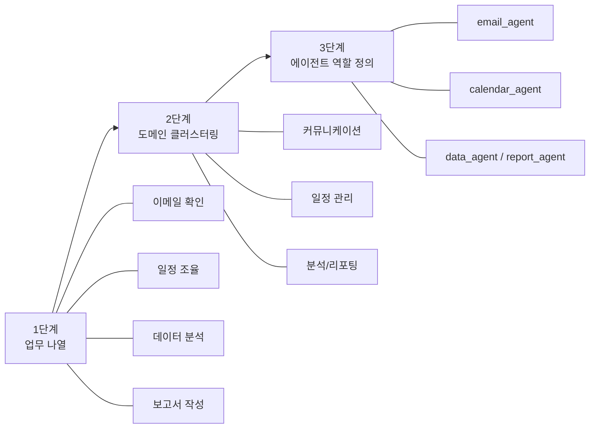
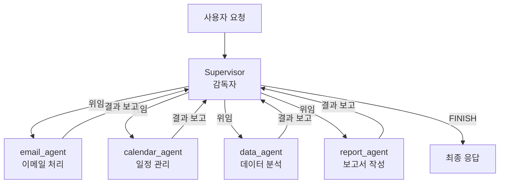
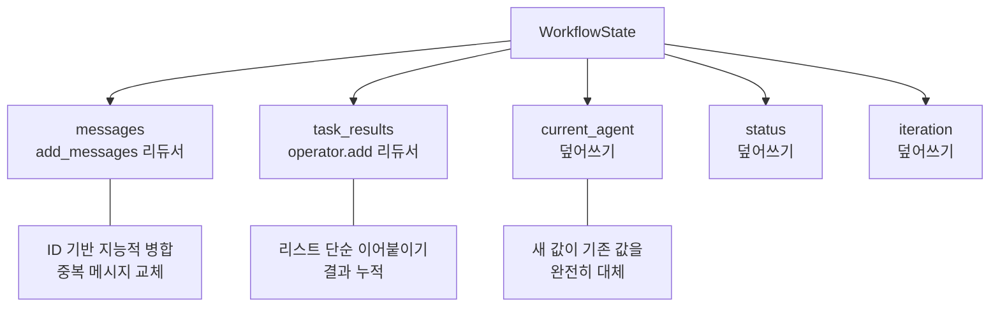
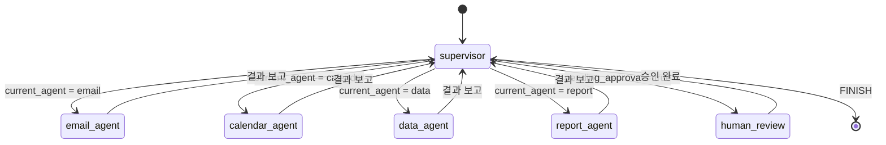

# 에이전트 아키텍처 설계

> 업무 자동화를 위한 멀티 에이전트 시스템의 청사진을 그리는 방법을 배웁니다.

## 개요

이 섹션에서는 LangGraph를 활용한 업무 자동화 에이전트 시스템의 아키텍처를 설계하는 방법을 다룹니다. 단일 에이전트가 아닌 여러 전문 에이전트가 협력하는 시스템을 어떻게 구상하고 설계하는지, 그 첫걸음을 함께 내딛어 보겠습니다.

**선수 지식**: [Ch13: LangGraph 기초](ch13)에서 배운 StateGraph, 노드, 엣지 개념과 [Ch15: 멀티 에이전트 시스템](ch15)에서 다룬 에이전트 간 협업 패턴
**학습 목표**:
- 업무 프로세스를 분석하여 에이전트 역할을 정의할 수 있다
- 감독자(Supervisor) 패턴의 원리를 이해하고 설계할 수 있다
- TypedDict와 리듀서를 활용한 상태 스키마를 정의할 수 있다
- 노드와 엣지로 구성된 그래프 구조를 설계할 수 있다

## 왜 알아야 할까?

회사에서 매일 반복하는 업무를 떠올려 보세요. 이메일을 확인하고, 일정을 조율하고, 데이터를 분석하고, 보고서를 작성하는 일련의 과정—이 모든 것을 AI 에이전트가 대신해 준다면 어떨까요?

하지만 이런 복잡한 업무를 하나의 에이전트에게 모두 맡기면 어떻게 될까요? 수십 개의 도구 중에서 적절한 것을 골라야 하고, 맥락을 오가며 판단해야 하니 성능이 급격히 떨어집니다. 실제로 LangChain 팀의 벤치마크에 따르면, **도구를 역할별로 분리한 멀티 에이전트 시스템이 단일 에이전트보다 훨씬 나은 결과**를 보여줍니다.

그래서 우리에게 필요한 것은 **설계**입니다. 좋은 아키텍처 없이 코드부터 작성하면 결국 스파게티 코드가 되고, 디버깅은 악몽이 됩니다. 이 섹션에서는 코드를 한 줄 작성하기 전에, **어떤 에이전트가 필요하고, 어떻게 협력해야 하는지** 체계적으로 설계하는 방법을 배웁니다.

## 핵심 개념

### 개념 1: 업무 분석과 에이전트 역할 정의

> 💡 **비유**: 새로운 회사를 세운다고 상상해 보세요. 처음에 사장 혼자 영업, 회계, 개발, 마케팅을 모두 하면 금방 한계에 부딪히죠. 그래서 **부서를 나누고 전문가를 채용**합니다. 멀티 에이전트 시스템도 마찬가지입니다. 업무를 분석해서 전문 "부서"를 만들고, 각 부서에 적합한 "에이전트"를 배치하는 거죠.

에이전트 아키텍처 설계의 첫 단계는 **자동화할 업무를 분석**하는 것입니다. 이때 핵심은 업무를 독립적인 도메인으로 나누는 것이에요.

업무 분석에는 3단계 프로세스를 따릅니다:

**1단계: 업무 나열** — 자동화할 모든 업무를 나열합니다.
**2단계: 도메인 클러스터링** — 관련된 업무를 그룹으로 묶습니다.
**3단계: 에이전트 역할 정의** — 각 그룹에 에이전트를 할당하고 책임을 명확히 합니다.

> 📊 **그림 1**: 업무 분석 3단계 프로세스 — 업무 나열에서 에이전트 역할 정의까지



```python
from dataclasses import dataclass, field

@dataclass
class AgentRole:
    """에이전트 역할을 정의하는 데이터 클래스"""
    name: str                    # 에이전트 이름
    responsibility: str          # 핵심 책임
    tools: list[str]             # 사용할 도구 목록
    input_type: str              # 입력 데이터 유형
    output_type: str             # 출력 데이터 유형

# 업무 자동화 시스템의 에이전트 역할 정의 예시
email_agent = AgentRole(
    name="email_agent",
    responsibility="이메일 읽기, 분류, 초안 작성, 발송",
    tools=["read_emails", "send_email", "search_emails"],
    input_type="이메일 관련 요청",
    output_type="이메일 처리 결과"
)

calendar_agent = AgentRole(
    name="calendar_agent",
    responsibility="일정 조회, 생성, 수정, 충돌 확인",
    tools=["get_events", "create_event", "check_availability"],
    input_type="일정 관련 요청",
    output_type="일정 처리 결과"
)

data_agent = AgentRole(
    name="data_agent",
    responsibility="데이터 조회, 분석, 시각화",
    tools=["query_database", "analyze_data", "create_chart"],
    input_type="데이터 분석 요청",
    output_type="분석 결과 및 차트"
)

report_agent = AgentRole(
    name="report_agent",
    responsibility="보고서 작성, 요약, 포맷팅",
    tools=["generate_report", "format_document", "summarize"],
    input_type="보고서 작성 요청",
    output_type="완성된 보고서"
)

# 정의된 에이전트 역할 출력
agents = [email_agent, calendar_agent, data_agent, report_agent]
for agent in agents:
    print(f"[{agent.name}] {agent.responsibility}")
    print(f"  도구: {', '.join(agent.tools)}")
    print()
```

에이전트를 나눌 때 가장 중요한 원칙은 **단일 책임 원칙(Single Responsibility Principle)**입니다. 각 에이전트는 하나의 도메인에 집중해야 합니다. 왜 그럴까요? LLM은 도구가 적을수록 더 정확하게 선택하거든요. 도구가 3~5개인 에이전트가 15개인 에이전트보다 훨씬 안정적으로 동작합니다.

### 개념 2: 감독자(Supervisor) 패턴 설계

> 💡 **비유**: 오케스트라를 떠올려 보세요. 바이올린, 첼로, 플루트, 드럼 연주자가 각자 훌륭한 실력을 갖추고 있지만, **지휘자** 없이는 아름다운 교향곡이 나올 수 없습니다. 지휘자는 어떤 악기가 언제 연주할지 결정하고, 전체 흐름을 조율합니다. 감독자 패턴의 **Supervisor**가 바로 이 지휘자 역할을 합니다.

감독자 패턴(Supervisor Pattern)은 멀티 에이전트 아키텍처에서 가장 널리 쓰이는 패턴 중 하나입니다. 중앙의 감독자 에이전트가 모든 통신 흐름과 작업 위임을 제어하죠.

핵심 아이디어는 놀랍게도 간단합니다: **감독자는 다른 에이전트를 "도구"로 사용하는 에이전트**입니다! 감독자가 사용자의 요청을 받으면, 어떤 전문 에이전트에게 위임할지 판단하고, 결과를 종합하여 최종 응답을 만듭니다.

```python
from typing import Literal

# 감독자의 라우팅 로직을 개념적으로 표현
def supervisor_routing(
    user_request: str,
    available_agents: list[str]
) -> str:
    """
    감독자가 사용자 요청을 분석하여
    적절한 에이전트를 선택하는 개념적 함수

    Args:
        user_request: 사용자의 요청 텍스트
        available_agents: 사용 가능한 에이전트 이름 목록

    Returns:
        선택된 에이전트 이름 또는 "FINISH"
    """
    # 실제로는 LLM이 이 판단을 수행합니다
    routing_prompt = f"""
    사용자 요청: {user_request}
    사용 가능한 에이전트: {available_agents}

    위 요청을 처리하기에 가장 적합한 에이전트를 선택하세요.
    모든 작업이 완료되었으면 "FINISH"를 반환하세요.
    """
    return routing_prompt

# 감독자 패턴의 흐름 시뮬레이션
agents = ["email_agent", "calendar_agent", "data_agent", "report_agent"]

# 시나리오: "이번 주 회의 일정을 확인하고 참석자에게 이메일을 보내줘"
print("=== 감독자 패턴 작업 흐름 ===")
print("1. 사용자 요청 수신")
print("2. 감독자가 요청 분석 → calendar_agent 선택")
print("3. calendar_agent: 이번 주 회의 일정 조회")
print("4. 감독자가 결과 확인 → email_agent 선택")
print("5. email_agent: 참석자에게 이메일 발송")
print("6. 감독자가 모든 작업 완료 확인 → FINISH")
```

감독자 패턴에는 세 가지 주요 변형이 있습니다:

| 패턴 | 설명 | 적합한 상황 |
|------|------|-------------|
| **단순 라우터** | 요청을 한 번에 하나의 에이전트로 전달 | 독립적인 작업 |
| **순차 오케스트레이터** | 여러 에이전트를 순서대로 실행 | 의존성 있는 작업 체인 |
| **동적 오케스트레이터** | LLM이 다음 단계를 실시간으로 판단 | 복잡한 다단계 업무 |

이 챕터에서는 **동적 오케스트레이터** 방식을 채택합니다. 업무 자동화는 상황에 따라 필요한 에이전트가 달라지기 때문이죠.


> 📊 **그림 2**: 감독자(Supervisor) 패턴의 허브-앤-스포크 구조



### 개념 3: 상태 스키마 정의

> 💡 **비유**: 여러 부서가 협업하는 회사에서 **공유 칠판(Shared Whiteboard)**을 생각해 보세요. 영업팀이 고객 요구사항을 적으면, 개발팀이 읽고 기술 명세를 추가하고, QA팀이 테스트 결과를 덧붙입니다. 모든 팀이 같은 칠판을 보면서 필요한 정보를 읽고 쓰죠. LangGraph의 **State**가 바로 이 공유 칠판입니다.

LangGraph에서 상태(State)는 그래프의 모든 노드가 공유하는 데이터 구조입니다. TypedDict 또는 Pydantic 모델로 정의하며, 각 필드에 **리듀서(Reducer)**를 지정하여 상태 업데이트 방식을 결정합니다.

```python
import operator
from typing import Annotated, Any
from typing_extensions import TypedDict
from langchain_core.messages import AnyMessage
from langgraph.graph.message import add_messages

class AutomationState(TypedDict):
    """업무 자동화 시스템의 상태 스키마"""

    # 대화 메시지 기록 — add_messages 리듀서로 지능적 병합
    messages: Annotated[list[AnyMessage], add_messages]

    # 현재 작업을 처리 중인 에이전트 이름
    current_agent: str

    # 각 에이전트의 처리 결과를 누적 — operator.add로 리스트 이어붙이기
    agent_results: Annotated[list[dict], operator.add]

    # 전체 작업 진행 상태
    task_status: str  # "in_progress" | "needs_review" | "completed"

    # Human-in-the-loop 승인 대기 여부
    pending_approval: bool

    # 에러 발생 시 재시도 카운트
    retry_count: int
```

여기서 `Annotated` 타입 힌트에 주목하세요. 두 번째 인자가 바로 **리듀서 함수**입니다:

- **`add_messages`**: LangGraph가 제공하는 메시지 전용 리듀서입니다. 단순히 리스트를 이어붙이는 게 아니라, 같은 ID를 가진 메시지가 있으면 **교체**합니다. 도구 호출과 응답을 정확히 추적하는 데 핵심적이에요.
- **`operator.add`**: 파이썬 표준 라이브러리의 덧셈 연산자입니다. 리스트에 적용하면 새 항목을 기존 리스트에 이어붙입니다.
- **리듀서 없는 필드** (`current_agent`, `task_status` 등): 새 값이 들어오면 기존 값을 **덮어씁니다**.

> ⚠️ **흔한 오해**: `operator.add`와 `add_messages`를 혼동하는 분이 많습니다. `operator.add`는 단순 리스트 연결이고, `add_messages`는 메시지 ID 기반으로 중복을 처리하는 **지능적 병합**입니다. 메시지를 다룰 때는 반드시 `add_messages`를 쓰세요!

> 📊 **그림 4**: 상태 스키마 필드별 업데이트 방식 — 리듀서 vs 덮어쓰기



### 개념 4: 그래프 구조 설계

> 💡 **비유**: 지하철 노선도를 생각해 보세요. 각 역(Station)은 **노드**, 역을 잇는 선로는 **엣지**입니다. 환승역에서는 어떤 노선으로 갈지 선택하죠. LangGraph의 그래프도 같은 구조입니다. 감독자 노드가 바로 환승역이에요—여기서 어떤 에이전트 노드로 이동할지 결정합니다.

그래프 구조를 설계할 때는 **노드(Node)**, **엣지(Edge)**, **조건부 엣지(Conditional Edge)**를 정의해야 합니다.

```python
from langgraph.graph import StateGraph, START, END

def design_automation_graph():
    """업무 자동화 그래프 구조 설계 (개념적 코드)"""

    # 1. 상태 스키마로 그래프 생성
    graph = StateGraph(AutomationState)

    # 2. 노드 추가 — 각 노드는 하나의 처리 단계
    graph.add_node("supervisor", supervisor_node)      # 감독자 노드
    graph.add_node("email_agent", email_node)           # 이메일 에이전트
    graph.add_node("calendar_agent", calendar_node)     # 캘린더 에이전트
    graph.add_node("data_agent", data_node)             # 데이터 분석 에이전트
    graph.add_node("report_agent", report_node)         # 보고서 에이전트
    graph.add_node("human_review", human_review_node)   # 사람 승인 단계

    # 3. 시작점 → 감독자
    graph.add_edge(START, "supervisor")

    # 4. 감독자에서 조건부 라우팅 — 핵심!
    graph.add_conditional_edges(
        "supervisor",  # 출발 노드
        route_to_agent,  # 라우팅 함수
        {
            # 라우팅 함수 반환값 → 목적지 노드 매핑
            "email_agent": "email_agent",
            "calendar_agent": "calendar_agent",
            "data_agent": "data_agent",
            "report_agent": "report_agent",
            "human_review": "human_review",
            "FINISH": END,
        }
    )

    # 5. 각 에이전트 → 감독자로 복귀 (결과 보고)
    graph.add_edge("email_agent", "supervisor")
    graph.add_edge("calendar_agent", "supervisor")
    graph.add_edge("data_agent", "supervisor")
    graph.add_edge("report_agent", "supervisor")
    graph.add_edge("human_review", "supervisor")

    return graph

# 그래프 구조를 텍스트로 시각화
print("=== 업무 자동화 그래프 구조 ===")
print()
print("  [START]")
print("     │")
print("     ▼")
print("  [supervisor] ◄──────────────────────┐")
print("     │                                 │")
print("     ├─→ [email_agent] ────────────────┤")
print("     ├─→ [calendar_agent] ─────────────┤")
print("     ├─→ [data_agent] ─────────────────┤")
print("     ├─→ [report_agent] ───────────────┤")
print("     ├─→ [human_review] ───────────────┘")
print("     │")
print("     └─→ [END]  (FINISH)")
```

이 구조에서 감독자 노드는 **허브(Hub)** 역할을 합니다. 모든 에이전트가 작업을 마치면 감독자로 돌아오고, 감독자가 다음 단계를 결정하는 **허브-앤-스포크(Hub-and-Spoke)** 패턴이죠.

> 📊 **그림 5**: 업무 자동화 그래프의 조건부 라우팅 구조



`route_to_agent` 함수가 핵심인데요, 이 함수는 현재 상태를 보고 다음에 실행할 노드를 결정합니다:

```python
def route_to_agent(state: AutomationState) -> str:
    """
    감독자의 라우팅 로직

    현재 상태를 분석하여 다음에 실행할 에이전트를 결정합니다.
    실제 구현에서는 LLM이 이 판단을 수행합니다.
    """
    # 승인이 필요한 작업이면 사람 검토로 라우팅
    if state.get("pending_approval"):
        return "human_review"

    # 마지막 메시지에서 감독자의 결정을 추출
    last_message = state["messages"][-1]

    # LLM이 tool_calls를 통해 에이전트를 선택한 경우
    if hasattr(last_message, "tool_calls") and last_message.tool_calls:
        # 도구 호출로 에이전트를 선택하는 패턴
        selected = last_message.tool_calls[0]["name"]
        return selected

    # 모든 작업이 완료된 경우
    return "FINISH"
```

## 실습: 직접 해보기

이제 실제로 업무 자동화 에이전트 아키텍처를 설계하고, 기본 그래프 골격을 만들어 보겠습니다. 아래 코드는 복사-붙여넣기로 바로 실행할 수 있습니다.

```python
"""
업무 자동화 에이전트 아키텍처 설계 실습

필요 패키지:
pip install langgraph langchain-core langchain-openai
"""

import operator
from typing import Annotated, Any
from typing_extensions import TypedDict
from langchain_core.messages import (
    AnyMessage,
    HumanMessage,
    AIMessage,
    SystemMessage,
)
from langgraph.graph import StateGraph, START, END
from langgraph.graph.message import add_messages

# ============================================================
# 1단계: 상태 스키마 정의
# ============================================================

class TaskResult(TypedDict):
    """에이전트 작업 결과"""
    agent: str          # 처리한 에이전트 이름
    action: str         # 수행한 작업
    result: str         # 결과 요약
    success: bool       # 성공 여부

class WorkflowState(TypedDict):
    """업무 자동화 워크플로우의 전체 상태"""

    # 대화 기록 — 메시지 ID 기반 지능적 병합
    messages: Annotated[list[AnyMessage], add_messages]

    # 현재 어떤 에이전트가 작업 중인지
    current_agent: str

    # 누적된 작업 결과 목록
    task_results: Annotated[list[dict[str, Any]], operator.add]

    # 전체 진행 상태
    status: str  # "routing" | "processing" | "reviewing" | "done"

    # 작업 반복 횟수 (무한 루프 방지)
    iteration: int

# ============================================================
# 2단계: 노드 함수 정의 (시뮬레이션)
# ============================================================

def supervisor_node(state: WorkflowState) -> dict:
    """
    감독자 노드: 현재 상태를 분석하고 다음 에이전트를 결정합니다.

    실제 구현에서는 LLM이 판단하지만,
    여기서는 시뮬레이션을 위해 규칙 기반으로 동작합니다.
    """
    messages = state["messages"]
    iteration = state.get("iteration", 0)
    task_results = state.get("task_results", [])

    # 최대 반복 횟수 제한 (안전장치)
    if iteration >= 5:
        return {
            "messages": [AIMessage(content="최대 반복 횟수에 도달했습니다. 작업을 종료합니다.")],
            "status": "done",
            "current_agent": "FINISH",
            "iteration": iteration,
        }

    # 첫 번째 반복: 사용자 요청 분석
    if iteration == 0:
        user_msg = messages[-1].content if messages else ""
        print(f"\n[감독자] 사용자 요청 분석: '{user_msg}'")

        # 간단한 키워드 기반 라우팅 (데모용)
        if "이메일" in user_msg or "메일" in user_msg:
            next_agent = "email_agent"
        elif "일정" in user_msg or "회의" in user_msg or "캘린더" in user_msg:
            next_agent = "calendar_agent"
        elif "데이터" in user_msg or "분석" in user_msg:
            next_agent = "data_agent"
        elif "보고서" in user_msg or "정리" in user_msg:
            next_agent = "report_agent"
        else:
            next_agent = "email_agent"  # 기본값

        print(f"[감독자] → {next_agent}에게 작업 위임")
        return {
            "current_agent": next_agent,
            "status": "routing",
            "iteration": iteration + 1,
        }

    # 후속 반복: 이전 결과 확인 후 다음 단계 결정
    if task_results:
        last_result = task_results[-1]
        print(f"\n[감독자] {last_result['agent']}의 결과 확인: {last_result['result']}")

        # 이메일 에이전트 후 → 보고서 에이전트로 요약
        if last_result["agent"] == "email_agent" and iteration < 3:
            print("[감독자] → report_agent에게 요약 요청")
            return {
                "current_agent": "report_agent",
                "status": "routing",
                "iteration": iteration + 1,
            }

    # 모든 작업 완료
    print("[감독자] 모든 작업 완료!")
    summary = "\n".join(
        f"  - [{r['agent']}] {r['action']}: {r['result']}"
        for r in task_results
    )
    return {
        "messages": [AIMessage(content=f"모든 작업이 완료되었습니다.\n\n작업 결과:\n{summary}")],
        "current_agent": "FINISH",
        "status": "done",
        "iteration": iteration + 1,
    }

def email_node(state: WorkflowState) -> dict:
    """이메일 에이전트 노드 (시뮬레이션)"""
    print("[이메일 에이전트] 이메일 처리 중...")
    return {
        "task_results": [{
            "agent": "email_agent",
            "action": "이메일 확인 및 분류",
            "result": "읽지 않은 이메일 3건 확인, 중요 1건 플래그",
            "success": True,
        }],
        "current_agent": "supervisor",
        "status": "processing",
    }

def calendar_node(state: WorkflowState) -> dict:
    """캘린더 에이전트 노드 (시뮬레이션)"""
    print("[캘린더 에이전트] 일정 처리 중...")
    return {
        "task_results": [{
            "agent": "calendar_agent",
            "action": "이번 주 일정 조회",
            "result": "회의 2건 (월 10:00, 수 14:00) 확인",
            "success": True,
        }],
        "current_agent": "supervisor",
        "status": "processing",
    }

def data_node(state: WorkflowState) -> dict:
    """데이터 분석 에이전트 노드 (시뮬레이션)"""
    print("[데이터 에이전트] 데이터 분석 중...")
    return {
        "task_results": [{
            "agent": "data_agent",
            "action": "주간 매출 데이터 분석",
            "result": "전주 대비 12% 상승, 상위 3개 제품 식별",
            "success": True,
        }],
        "current_agent": "supervisor",
        "status": "processing",
    }

def report_node(state: WorkflowState) -> dict:
    """보고서 에이전트 노드 (시뮬레이션)"""
    print("[보고서 에이전트] 보고서 작성 중...")
    # 이전 결과를 종합하여 보고서 생성
    results = state.get("task_results", [])
    summary = ", ".join(r["result"] for r in results) if results else "처리된 작업 없음"
    return {
        "task_results": [{
            "agent": "report_agent",
            "action": "작업 결과 요약 보고서 작성",
            "result": f"종합 요약: {summary}",
            "success": True,
        }],
        "current_agent": "supervisor",
        "status": "processing",
    }

# ============================================================
# 3단계: 라우팅 함수 정의
# ============================================================

def route_from_supervisor(state: WorkflowState) -> str:
    """감독자의 결정에 따라 다음 노드를 선택합니다."""
    current = state.get("current_agent", "FINISH")

    # 유효한 에이전트 이름이면 해당 노드로 라우팅
    valid_agents = {"email_agent", "calendar_agent", "data_agent", "report_agent"}
    if current in valid_agents:
        return current

    # 그 외에는 종료
    return "FINISH"

# ============================================================
# 4단계: 그래프 조립 및 컴파일
# ============================================================

def build_automation_graph() -> StateGraph:
    """업무 자동화 그래프를 조립합니다."""

    # 상태 스키마로 그래프 초기화
    graph = StateGraph(WorkflowState)

    # 노드 추가
    graph.add_node("supervisor", supervisor_node)
    graph.add_node("email_agent", email_node)
    graph.add_node("calendar_agent", calendar_node)
    graph.add_node("data_agent", data_node)
    graph.add_node("report_agent", report_node)

    # 시작점 → 감독자
    graph.add_edge(START, "supervisor")

    # 감독자 → 조건부 라우팅
    graph.add_conditional_edges(
        "supervisor",
        route_from_supervisor,
        {
            "email_agent": "email_agent",
            "calendar_agent": "calendar_agent",
            "data_agent": "data_agent",
            "report_agent": "report_agent",
            "FINISH": END,
        }
    )

    # 각 에이전트 → 감독자로 복귀
    graph.add_edge("email_agent", "supervisor")
    graph.add_edge("calendar_agent", "supervisor")
    graph.add_edge("data_agent", "supervisor")
    graph.add_edge("report_agent", "supervisor")

    return graph

# ============================================================
# 5단계: 실행
# ============================================================

# 그래프 빌드 및 컴파일
workflow = build_automation_graph()
app = workflow.compile()

# 그래프 구조 확인
print("=== 그래프 노드 ===")
for node_name in ["supervisor", "email_agent", "calendar_agent", "data_agent", "report_agent"]:
    print(f"  - {node_name}")

print("\n=== 실행 시작 ===")

# 시나리오 1: 이메일 관련 요청
initial_state = {
    "messages": [HumanMessage(content="오늘 받은 이메일을 확인하고 정리해줘")],
    "current_agent": "",
    "task_results": [],
    "status": "routing",
    "iteration": 0,
}

# 그래프 실행
result = app.invoke(initial_state)

print("\n=== 최종 결과 ===")
print(f"상태: {result['status']}")
print(f"처리된 작업 수: {len(result['task_results'])}")
for tr in result["task_results"]:
    print(f"  [{tr['agent']}] {tr['action']} → {tr['result']}")

# 최종 AI 메시지 출력
for msg in result["messages"]:
    if isinstance(msg, AIMessage):
        print(f"\n[AI 응답] {msg.content}")
```

실행하면 다음과 같은 출력을 확인할 수 있습니다:

```
=== 그래프 노드 ===
  - supervisor
  - email_agent
  - calendar_agent
  - data_agent
  - report_agent

=== 실행 시작 ===

[감독자] 사용자 요청 분석: '오늘 받은 이메일을 확인하고 정리해줘'
[감독자] → email_agent에게 작업 위임
[이메일 에이전트] 이메일 처리 중...

[감독자] email_agent의 결과 확인: 읽지 않은 이메일 3건 확인, 중요 1건 플래그
[감독자] → report_agent에게 요약 요청
[보고서 에이전트] 보고서 작성 중...

[감독자] report_agent의 결과 확인: 종합 요약: 읽지 않은 이메일 3건 확인, 중요 1건 플래그
[감독자] 모든 작업 완료!

=== 최종 결과 ===
상태: done
처리된 작업 수: 2
  [email_agent] 이메일 확인 및 분류 → 읽지 않은 이메일 3건 확인, 중요 1건 플래그
  [report_agent] 작업 결과 요약 보고서 작성 → 종합 요약: 읽지 않은 이메일 3건 확인, 중요 1건 플래그

[AI 응답] 모든 작업이 완료되었습니다.

작업 결과:
  - [email_agent] 이메일 확인 및 분류: 읽지 않은 이메일 3건 확인, 중요 1건 플래그
  - [report_agent] 작업 결과 요약 보고서 작성: 종합 요약: 읽지 않은 이메일 3건 확인, 중요 1건 플래그
```

감독자가 요청을 분석하고, 이메일 에이전트에게 위임하고, 결과를 받아 보고서 에이전트에게 요약을 맡기고, 최종 결과를 종합하는 전체 흐름을 확인할 수 있습니다. 실제 프로덕션에서는 각 노드 안에서 LLM과 도구를 사용하게 되는데, 이 부분은 다음 섹션에서 구현합니다.

## 더 깊이 알아보기

### 멀티 에이전트 시스템의 역사

멀티 에이전트 시스템(MAS)의 뿌리는 1970~80년대 **분산 인공지능(Distributed Artificial Intelligence, DAI)**에 있습니다. 한 대의 컴퓨터로 풀기 어려운 문제를 여러 에이전트에게 나누어 해결하자는 아이디어였죠.

1995년, Russell과 Norvig가 『Artificial Intelligence: A Modern Approach』에서 에이전트를 "자율적으로 운영되며, 환경을 인식하고, 변화에 적응하며, 목표를 추구하는 존재"로 정의하면서 학계의 관심이 폭발했습니다. 같은 해 Woolridge와 Jennings는 에이전트의 네 가지 핵심 속성을 정의했는데요—**자율성(Autonomy)**, **사회적 능력(Social Ability)**, **반응성(Reactivity)**, **능동성(Proactiveness)**이 그것입니다.

흥미로운 점은 이 개념이 **LLM 시대에 부활**했다는 겁니다. 2023년 LangChain이 에이전트 프레임워크를 발표하고, 이어서 LangGraph가 등장하면서 "여러 LLM 에이전트가 협업하여 복잡한 작업을 수행하는" 시스템이 현실이 되었습니다. 30년 전 학자들이 꿈꾸던 비전이, GPT-4 같은 강력한 LLM 덕분에 실현된 셈이죠.

### 감독자 패턴의 기원

감독자 패턴은 사실 소프트웨어 공학의 고전적 패턴인 **마스터-워커(Master-Worker)** 패턴에서 유래했습니다. 분산 컴퓨팅에서 마스터 프로세스가 워커 프로세스에게 작업을 분배하고 결과를 수집하는 방식이죠. Erlang/OTP의 Supervisor Tree도 같은 철학을 따릅니다—감독자가 하위 프로세스를 관리하고, 실패하면 재시작합니다. LangGraph의 감독자 패턴은 이 전통적 패턴에 **LLM의 판단력**을 결합한 것입니다.

## 흔한 오해와 팁

> ⚠️ **흔한 오해**: "에이전트가 많을수록 좋다"고 생각하는 분이 있습니다. 하지만 에이전트가 늘어날수록 감독자의 라우팅 복잡도가 증가하고, 상태 관리가 어려워집니다. **3~5개의 핵심 에이전트**로 시작하고, 필요에 따라 점진적으로 확장하는 것이 좋습니다.

> 💡 **알고 계셨나요?**: LangChain 팀은 2025년부터 `langgraph-supervisor` 라이브러리 대신 **도구 호출(Tool Calling) 방식으로 에이전트를 감독자에 연결하는 패턴**을 권장하고 있습니다. 이 방식이 컨텍스트 엔지니어링에 대한 더 세밀한 제어를 가능하게 하기 때문입니다.

> 🔥 **실무 팁**: 그래프를 설계할 때 반드시 **무한 루프 방지 장치**를 넣으세요. `iteration` 카운터를 상태에 포함시키고, 최대 반복 횟수를 제한하는 것이 가장 간단하면서도 효과적인 방법입니다. 프로덕션 환경에서 에이전트가 무한 루프에 빠지면 API 비용이 눈덩이처럼 불어납니다.

## 핵심 정리

| 개념 | 설명 |
|------|------|
| 업무 분석 | 자동화 대상 업무를 도메인별로 분류하고 에이전트 역할을 정의하는 과정 |
| 감독자 패턴 | 중앙 감독자 에이전트가 전문 에이전트를 "도구"로 사용하여 작업을 위임·조율하는 아키텍처 |
| 상태 스키마 | TypedDict + 리듀서로 정의하는 그래프의 공유 데이터 구조 |
| `add_messages` | 메시지 ID 기반 지능적 병합을 수행하는 LangGraph 전용 리듀서 |
| `operator.add` | 리스트를 단순 이어붙이는 파이썬 표준 리듀서 |
| 조건부 엣지 | 상태에 따라 다음 노드를 동적으로 결정하는 라우팅 메커니즘 |
| 허브-앤-스포크 | 감독자를 중심으로 에이전트가 방사형으로 연결되는 그래프 구조 |
| 반복 제한 | 무한 루프 방지를 위한 `iteration` 카운터 기반 안전장치 |

## 다음 섹션 미리보기

아키텍처 설계의 청사진이 완성되었으니, 다음 섹션 **"외부 서비스 연동 도구 구현"**에서는 이메일(Gmail API), 캘린더(Google Calendar), 데이터베이스 등 실제 외부 서비스와 연동하는 도구를 구현합니다. 시뮬레이션이 아닌, 진짜 동작하는 에이전트를 만드는 첫 단계가 될 거예요.

## 참고 자료

- [LangGraph 공식 문서 — 그래프 API 개요](https://docs.langchain.com/oss/python/langgraph/graph-api) - StateGraph, 노드, 엣지, 리듀서의 공식 설명과 API 레퍼런스
- [LangGraph Multi-Agent Workflows 블로그](https://blog.langchain.com/langgraph-multi-agent-workflows/) - LangChain 팀이 직접 작성한 멀티 에이전트 워크플로우 설계 가이드
- [langgraph-supervisor GitHub 리포지토리](https://github.com/langchain-ai/langgraph-supervisor-py) - 감독자 패턴의 공식 레퍼런스 구현과 예제 코드
- [LangGraph Workflows and Agents 가이드](https://docs.langchain.com/oss/python/langgraph/workflows-agents) - 워크플로우와 에이전트의 차이점, 패턴 선택 기준 설명
- [LangGraph State API 사용 가이드](https://docs.langchain.com/oss/python/langgraph/use-graph-api) - TypedDict 상태 정의, 리듀서 활용법 공식 문서