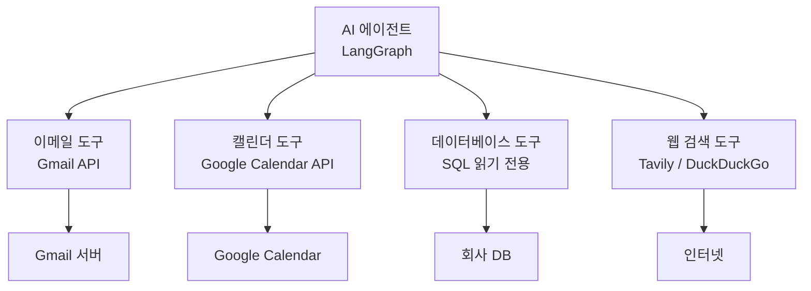
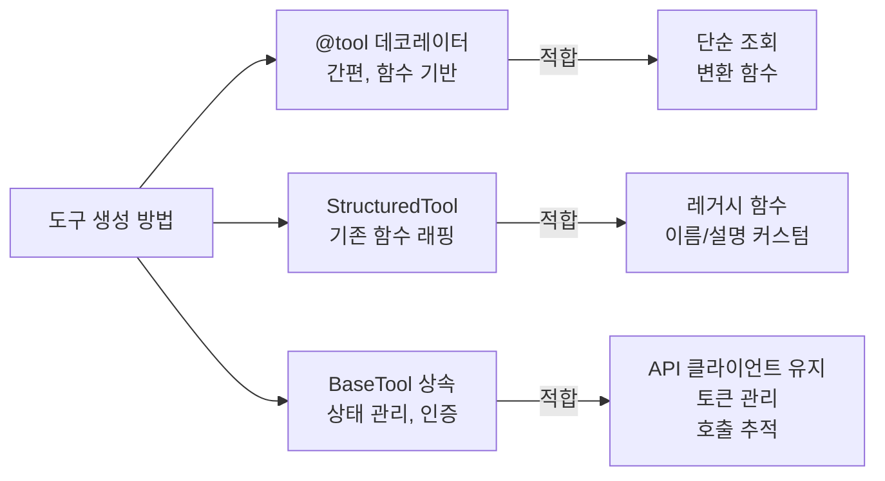
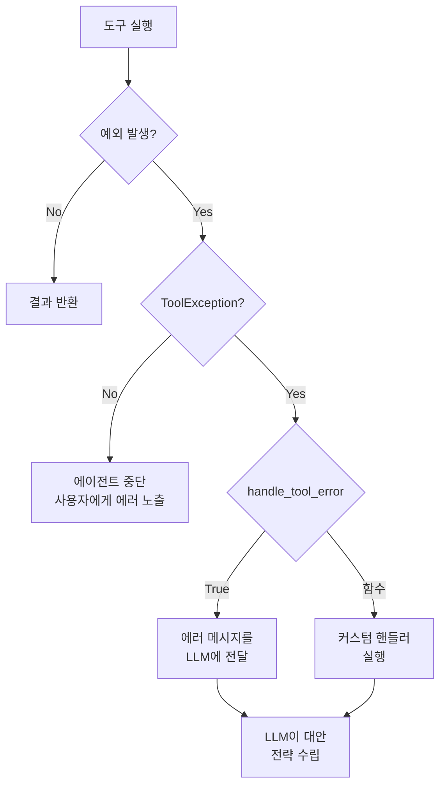
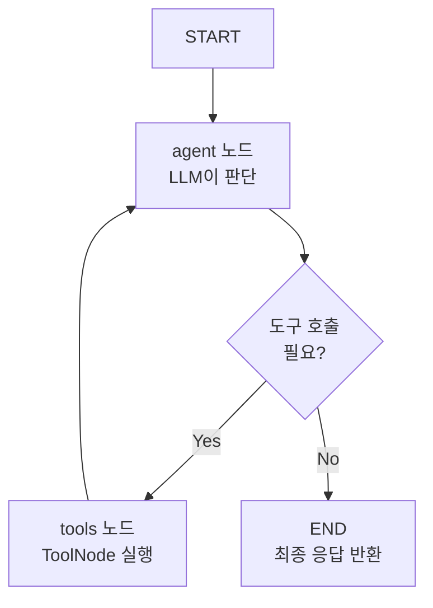
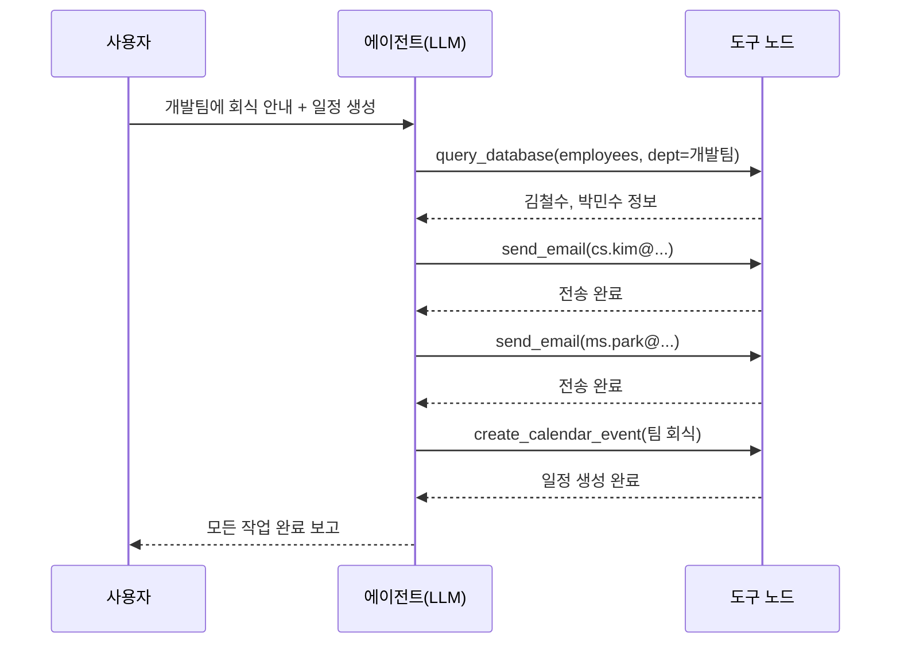

# 외부 서비스 도구 구현

> LangChain 도구 시스템을 활용하여 이메일, 캘린더, 데이터베이스, 웹 검색 등 실제 업무 서비스와 연동하는 도구를 설계하고 구현합니다.

## 개요

이 섹션에서는 [세션 19.1: 에이전트 아키텍처 설계](ch19/session_01.md)에서 설계한 멀티 에이전트 시스템의 "손과 발"에 해당하는 외부 서비스 도구를 실제로 구현합니다. 아무리 뛰어난 두뇌(LLM)와 체계적인 조직(감독자 패턴)이 있어도, 외부 세계와 소통할 수 없으면 에이전트는 "말만 하는 존재"에 그칠 수밖에 없거든요. 이번 세션에서 그 벽을 허물어 봅시다.

**선수 지식**: 세션 19.1의 감독자 패턴과 상태 스키마, 세션 11장의 도구(Tools) 기본 개념, 세션 5장의 LCEL 파이프라인 구성
**학습 목표**:
- LangChain의 `@tool` 데코레이터와 `BaseTool`을 사용하여 커스텀 도구를 설계할 수 있다
- Gmail API, Google Calendar API를 연동한 이메일·캘린더 도구를 구현할 수 있다
- SQLDatabase를 활용한 데이터베이스 조회 도구를 구현할 수 있다
- `ToolException`을 활용한 안전한 에러 처리 패턴을 적용할 수 있다

## 왜 알아야 할까?

> 📊 **그림 1**: 업무 자동화 에이전트의 외부 서비스 도구 구조




회사에서 "이 보고서를 팀원들에게 이메일로 보내고, 다음 주 회의를 잡아줘"라는 요청을 받았다고 생각해 보세요. 사람이라면 Gmail을 열고, 캘린더를 확인하고, 데이터베이스에서 팀원 정보를 조회한 뒤 각각의 작업을 처리할 겁니다. AI 에이전트도 마찬가지예요. **외부 서비스와 실제로 상호작용할 수 있는 도구가 없으면, 에이전트는 "이렇게 하면 됩니다"라고 설명만 할 뿐 실제로 업무를 수행할 수 없습니다.**

2025년 Gartner 조사에 따르면, 기업 업무의 약 40%가 이메일, 캘린더, 데이터 조회 같은 반복적인 서비스 간 연동 작업이라고 합니다. 이런 작업을 에이전트가 도구를 통해 자동화하면 업무 생산성을 획기적으로 높일 수 있죠.

## 핵심 개념

### 개념 1: LangChain 도구 시스템 — 에이전트의 스위스 아미 나이프

> 📊 **그림 2**: LangChain 도구 생성 방법 비교 — 간편함 vs 유연성




> 💡 **비유**: 도구(Tool)는 에이전트에게 주어지는 **직업 도구 상자**와 같습니다. 목수에게 망치, 톱, 드라이버가 필요하듯이, 업무 자동화 에이전트에게는 이메일 전송기, 캘린더 관리기, DB 조회기가 필요합니다. 각 도구는 "이름표(name)"와 "사용 설명서(description)"가 붙어 있어서, 에이전트가 상황에 맞는 도구를 골라 사용합니다.

LangChain에서 도구를 만드는 방법은 크게 세 가지입니다:

**방법 1: `@tool` 데코레이터** — 가장 간편한 방식

```python
from langchain_core.tools import tool

@tool
def search_employees(department: str) -> str:
    """부서별 직원 목록을 검색합니다."""  # docstring이 도구 설명이 됩니다
    return f"{department} 부서의 직원: 김철수, 이영희, 박민수"
```

**방법 2: `StructuredTool`** — 기존 함수를 감쌀 때

```python
from langchain_core.tools import StructuredTool

def multiply(a: int, b: int) -> int:
    """두 수를 곱합니다."""
    return a * b

tool = StructuredTool.from_function(
    func=multiply,
    name="calculator_multiply",
    description="두 정수를 곱합니다.",
)
```

**방법 3: `BaseTool` 상속** — 상태 관리가 필요할 때

```python
from langchain_core.tools import BaseTool
from pydantic import BaseModel, Field

class EmailInput(BaseModel):
    to: str = Field(description="수신자 이메일 주소")
    subject: str = Field(description="이메일 제목")
    body: str = Field(description="이메일 본문")

class EmailSendTool(BaseTool):
    name: str = "send_email"
    description: str = "이메일을 전송합니다."
    args_schema: type[BaseModel] = EmailInput

    def _run(self, to: str, subject: str, body: str) -> str:
        # 실제 이메일 전송 로직
        return f"'{subject}' 이메일을 {to}에게 전송했습니다."
```

> ⚠️ **흔한 오해**: "`@tool` 데코레이터만 쓰면 되지, `BaseTool`은 왜 필요하죠?"라고 생각할 수 있습니다. 하지만 **API 클라이언트 인스턴스를 유지**하거나, **인증 토큰을 관리**하거나, **호출 횟수를 추적**해야 하는 실무 시나리오에서는 `BaseTool`의 클래스 기반 상태 관리가 필수적입니다.

### 개념 2: 이메일 도구 — Gmail API 연동

> 💡 **비유**: Gmail API를 연동하는 것은 **비서에게 회사 메일 계정의 접근 권한을 위임하는 것**과 같습니다. OAuth 2.0 인증은 "이 비서(에이전트)가 내 메일함에 접근해도 된다"는 허가증이고, 스코프(scope)는 "읽기만 가능", "보내기 가능" 같은 권한 범위를 결정합니다.

LangChain은 `langchain-google-community` 패키지를 통해 Gmail 도구를 제공합니다:

```bash
pip install langchain-google-community[gmail]
```

이 패키지의 `GmailToolkit`에는 5개의 도구가 포함되어 있습니다:

| 도구 | 기능 |
|------|------|
| `GmailSearch` | 조건에 맞는 이메일 검색 |
| `GmailGetMessage` | 특정 이메일 상세 조회 |
| `GmailGetThread` | 이메일 스레드(대화) 조회 |
| `GmailCreateDraft` | 이메일 임시 저장 |
| `GmailSendMessage` | 이메일 전송 |

하지만 실무에서는 **보안과 제어 가능성**을 위해 커스텀 도구로 감싸는 경우가 많습니다. 아래는 Gmail API를 직접 사용하는 커스텀 이메일 도구입니다:

```python
import os
import base64
from email.mime.text import MIMEText
from typing import Optional

from google.oauth2.credentials import Credentials
from google.auth.transport.requests import Request
from google_auth_oauthlib.flow import InstalledAppFlow
from googleapiclient.discovery import build
from langchain_core.tools import tool, ToolException
from pydantic import BaseModel, Field

# Gmail API 인증 헬퍼
SCOPES = ["https://www.googleapis.com/auth/gmail.send",
           "https://www.googleapis.com/auth/gmail.readonly"]

def get_gmail_service():
    """Gmail API 서비스 객체를 생성합니다."""
    creds = None
    if os.path.exists("token.json"):
        creds = Credentials.from_authorized_user_file("token.json", SCOPES)
    if not creds or not creds.valid:
        if creds and creds.expired and creds.refresh_token:
            creds.refresh(Request())
        else:
            flow = InstalledAppFlow.from_client_secrets_file(
                "credentials.json", SCOPES
            )
            creds = flow.run_local_server(port=0)
        with open("token.json", "w") as token:
            token.write(creds.to_json())
    return build("gmail", "v1", credentials=creds)


@tool
def send_email(to: str, subject: str, body: str) -> str:
    """이메일을 전송합니다. 수신자 주소, 제목, 본문을 입력받습니다."""
    try:
        service = get_gmail_service()
        # MIME 메시지 생성
        message = MIMEText(body)
        message["to"] = to
        message["subject"] = subject
        # Base64 인코딩 (Gmail API 요구사항)
        raw = base64.urlsafe_b64encode(message.as_bytes()).decode()
        result = service.users().messages().send(
            userId="me", body={"raw": raw}
        ).execute()
        return f"이메일 전송 완료 (Message ID: {result['id']})"
    except Exception as e:
        raise ToolException(f"이메일 전송 실패: {str(e)}")


@tool
def search_emails(query: str, max_results: int = 5) -> str:
    """Gmail에서 이메일을 검색합니다. Gmail 검색 구문을 사용합니다."""
    try:
        service = get_gmail_service()
        # Gmail 검색 API 호출
        results = service.users().messages().list(
            userId="me", q=query, maxResults=max_results
        ).execute()
        messages = results.get("messages", [])
        if not messages:
            return "검색 결과가 없습니다."
        # 각 메시지의 제목과 발신자 조회
        output = []
        for msg in messages:
            detail = service.users().messages().get(
                userId="me", id=msg["id"], format="metadata",
                metadataHeaders=["Subject", "From"]
            ).execute()
            headers = {h["name"]: h["value"]
                       for h in detail["payload"]["headers"]}
            output.append(
                f"- [{headers.get('Subject', '(제목 없음')}] "
                f"from {headers.get('From', '(발신자 없음)')}"
            )
        return "\n".join(output)
    except Exception as e:
        raise ToolException(f"이메일 검색 실패: {str(e)}")
```

### 개념 3: 캘린더 도구 — Google Calendar API 연동

> 💡 **비유**: 캘린더 도구는 에이전트에게 **개인 비서의 수첩**을 쥐여주는 것과 같습니다. 일정을 조회하고, 새 약속을 잡고, 기존 일정을 수정하는 — 사람 비서가 하는 일정 관리의 핵심 기능을 API로 수행합니다.

```bash
pip install langchain-google-community[calendar]
```

Google Calendar API를 활용한 커스텀 캘린더 도구입니다:

```python
from datetime import datetime, timedelta
from googleapiclient.discovery import build
from langchain_core.tools import tool, ToolException

CALENDAR_SCOPES = ["https://www.googleapis.com/auth/calendar"]

def get_calendar_service():
    """Google Calendar API 서비스 객체를 생성합니다."""
    # Gmail과 동일한 인증 패턴 (스코프만 다름)
    creds = None
    if os.path.exists("calendar_token.json"):
        creds = Credentials.from_authorized_user_file(
            "calendar_token.json", CALENDAR_SCOPES
        )
    if not creds or not creds.valid:
        if creds and creds.expired and creds.refresh_token:
            creds.refresh(Request())
        else:
            flow = InstalledAppFlow.from_client_secrets_file(
                "credentials.json", CALENDAR_SCOPES
            )
            creds = flow.run_local_server(port=0)
        with open("calendar_token.json", "w") as token:
            token.write(creds.to_json())
    return build("calendar", "v3", credentials=creds)


@tool
def list_upcoming_events(days: int = 7, max_results: int = 10) -> str:
    """향후 N일 이내의 일정을 조회합니다."""
    try:
        service = get_calendar_service()
        now = datetime.utcnow()
        time_min = now.isoformat() + "Z"  # UTC 기준
        time_max = (now + timedelta(days=days)).isoformat() + "Z"

        events_result = service.events().list(
            calendarId="primary",
            timeMin=time_min,
            timeMax=time_max,
            maxResults=max_results,
            singleEvents=True,       # 반복 일정을 개별 이벤트로 펼침
            orderBy="startTime",
        ).execute()
        events = events_result.get("items", [])

        if not events:
            return f"향후 {days}일 내 일정이 없습니다."

        output = []
        for event in events:
            start = event["start"].get("dateTime", event["start"].get("date"))
            summary = event.get("summary", "(제목 없음)")
            output.append(f"- {start}: {summary}")
        return "\n".join(output)
    except Exception as e:
        raise ToolException(f"일정 조회 실패: {str(e)}")


@tool
def create_calendar_event(
    title: str,
    start_time: str,
    end_time: str,
    description: str = "",
    attendees: str = "",
) -> str:
    """Google Calendar에 새 일정을 생성합니다.
    start_time, end_time은 ISO 8601 형식 (예: 2026-03-10T14:00:00+09:00)"""
    try:
        service = get_calendar_service()
        event = {
            "summary": title,
            "description": description,
            "start": {"dateTime": start_time, "timeZone": "Asia/Seoul"},
            "end": {"dateTime": end_time, "timeZone": "Asia/Seoul"},
        }
        # 참석자가 있으면 추가
        if attendees:
            event["attendees"] = [
                {"email": addr.strip()}
                for addr in attendees.split(",")
            ]
        result = service.events().insert(
            calendarId="primary", body=event
        ).execute()
        return (
            f"일정 생성 완료: '{title}'\n"
            f"링크: {result.get('htmlLink', 'N/A')}"
        )
    except Exception as e:
        raise ToolException(f"일정 생성 실패: {str(e)}")
```

### 개념 4: 데이터베이스 도구 — SQL 조회

> 💡 **비유**: 데이터베이스 도구는 에이전트에게 **회사 파일 캐비닛의 열쇠**를 주는 것과 같습니다. 고객 정보, 매출 데이터, 재고 현황 등 구조화된 데이터에 접근할 수 있게 되죠. 다만, 열쇠를 줄 때 "읽기 전용"이라는 조건을 걸어야 안전합니다.

LangChain은 `SQLDatabaseToolkit`을 통해 SQL 도구를 제공하지만, 실무에서는 **보안을 위해 읽기 전용 커스텀 도구**를 만드는 것이 좋습니다:

```python
from langchain_community.utilities.sql_database import SQLDatabase
from langchain_core.tools import tool, ToolException
from sqlalchemy import create_engine, text

# 데이터베이스 연결 설정
DATABASE_URL = "sqlite:///company.db"
db = SQLDatabase.from_uri(DATABASE_URL)


@tool
def query_database(sql_query: str) -> str:
    """회사 데이터베이스에 읽기 전용 SQL 쿼리를 실행합니다.
    SELECT 문만 허용됩니다."""
    # 보안: SELECT 문만 허용
    normalized = sql_query.strip().upper()
    if not normalized.startswith("SELECT"):
        raise ToolException(
            "보안 정책: SELECT 문만 허용됩니다. "
            "INSERT, UPDATE, DELETE는 사용할 수 없습니다."
        )

    # 위험한 키워드 차단
    dangerous_keywords = ["DROP", "DELETE", "UPDATE", "INSERT",
                          "ALTER", "TRUNCATE", "EXEC"]
    for keyword in dangerous_keywords:
        if keyword in normalized:
            raise ToolException(
                f"보안 정책: '{keyword}' 키워드는 사용할 수 없습니다."
            )

    try:
        result = db.run(sql_query)
        return result if result else "결과가 없습니다."
    except Exception as e:
        raise ToolException(f"쿼리 실행 실패: {str(e)}")


@tool
def list_database_tables() -> str:
    """데이터베이스의 테이블 목록과 스키마 정보를 조회합니다."""
    try:
        table_names = db.get_usable_table_names()
        if not table_names:
            return "사용 가능한 테이블이 없습니다."

        output = ["## 데이터베이스 테이블 목록\n"]
        for table in table_names:
            schema = db.get_table_info(table_names=[table])
            output.append(f"### {table}\n{schema}\n")
        return "\n".join(output)
    except Exception as e:
        raise ToolException(f"테이블 정보 조회 실패: {str(e)}")
```

### 개념 5: 웹 검색 도구 — 실시간 정보 수집

> 💡 **비유**: 웹 검색 도구는 에이전트에게 **인터넷 브라우저**를 쥐여주는 것입니다. LLM의 학습 데이터에 없는 최신 정보 — 오늘의 환율, 최신 뉴스, 경쟁사 동향 — 를 실시간으로 가져올 수 있게 해줍니다.

Tavily는 AI 에이전트를 위해 설계된 검색 API로, LangChain과의 통합이 가장 매끄럽습니다:

```python
from langchain_tavily import TavilySearch
from langchain_core.tools import tool, ToolException

# Tavily 검색 도구 (API 키 필요: TAVILY_API_KEY 환경변수)
tavily_search = TavilySearch(
    max_results=5,
    topic="general",
    search_depth="advanced",
)

# DuckDuckGo는 API 키 없이 사용 가능 (개발/테스트용으로 적합)
from langchain_community.tools import DuckDuckGoSearchRun

duckduckgo_search = DuckDuckGoSearchRun()


@tool
def web_search(query: str, source: str = "tavily") -> str:
    """웹에서 최신 정보를 검색합니다.
    source: 'tavily' (고품질, API 키 필요) 또는 'duckduckgo' (무료)"""
    try:
        if source == "tavily":
            results = tavily_search.invoke({"query": query})
            if isinstance(results, list):
                return "\n\n".join(
                    f"**{r.get('title', 'N/A')}**\n{r.get('content', '')}\n"
                    f"출처: {r.get('url', 'N/A')}"
                    for r in results
                )
            return str(results)
        else:
            return duckduckgo_search.invoke(query)
    except Exception as e:
        raise ToolException(f"웹 검색 실패: {str(e)}")
```

### 개념 6: 에러 처리 — `ToolException`으로 에이전트에게 실패를 알리기

> 📊 **그림 3**: ToolException 에러 처리 흐름 — 일반 예외 vs ToolException




> 💡 **비유**: `ToolException`은 도구가 에이전트에게 보내는 **"작업 실패 보고서"**입니다. 일반 예외(Exception)가 도구를 잡고 있는 손을 통째로 놓아버리는 것이라면, `ToolException`은 "이 도구가 작동하지 않았으니 다른 방법을 시도해 보세요"라는 정중한 안내문이죠.

```python
from langchain_core.tools import tool, ToolException

# 패턴 1: handle_tool_error=True → 에러 메시지를 LLM에 전달
@tool(handle_tool_error=True)
def safe_api_call(endpoint: str) -> str:
    """외부 API를 호출합니다."""
    raise ToolException("API 서버에 연결할 수 없습니다. 잠시 후 다시 시도해 주세요.")

# 패턴 2: 커스텀 에러 핸들러 함수
def handle_error(error: ToolException) -> str:
    return f"도구 실행 중 오류가 발생했습니다: {error}. 다른 접근 방법을 시도해 보세요."

@tool(handle_tool_error=handle_error)
def risky_operation(data: str) -> str:
    """위험할 수 있는 작업을 수행합니다."""
    raise ToolException("권한이 부족합니다.")

# 패턴 3: try/except로 외부 에러를 ToolException으로 변환
@tool(handle_tool_error=True)
def fetch_data(url: str) -> str:
    """URL에서 데이터를 가져옵니다."""
    try:
        import requests
        response = requests.get(url, timeout=10)
        response.raise_for_status()
        return response.text[:1000]  # 응답을 적절히 자르기
    except requests.Timeout:
        raise ToolException(f"{url} 요청 시간 초과. 다른 URL을 시도해 주세요.")
    except requests.HTTPError as e:
        raise ToolException(f"HTTP 에러 {e.response.status_code}: {url}")
```

## 실습: 직접 해보기

> 📊 **그림 4**: LangGraph 에이전트 워크플로우 — 도구 호출 루프




앞서 배운 도구들을 하나의 시스템으로 통합해 봅시다. 세션 19.1에서 설계한 감독자 패턴에 실제 도구를 장착한 **업무 자동화 에이전트**를 만들어 보겠습니다. 여기서는 외부 API 없이도 실행할 수 있도록 **시뮬레이션 모드**를 포함합니다.

```python
"""
업무 자동화 에이전트 — 외부 서비스 도구 통합 실습
실행 요구사항: pip install langchain-core langchain-openai langgraph pydantic
"""

import json
import operator
from datetime import datetime, timedelta
from typing import Annotated, TypedDict

from langchain_core.messages import HumanMessage, AIMessage, ToolMessage
from langchain_core.tools import tool, ToolException, BaseTool
from langchain_openai import ChatOpenAI
from langgraph.graph import StateGraph, MessagesState, START, END
from langgraph.prebuilt import ToolNode, tools_condition
from pydantic import BaseModel, Field


# ============================================================
# 1. 시뮬레이션 도구 정의 (API 키 없이 테스트 가능)
# ============================================================

# -- 이메일 도구 --
@tool
def send_email(to: str, subject: str, body: str) -> str:
    """이메일을 전송합니다."""
    # 실제 구현에서는 Gmail API 호출
    print(f"  [시뮬레이션] 이메일 전송: {to}")
    return (
        f"이메일 전송 완료\n"
        f"  수신: {to}\n"
        f"  제목: {subject}\n"
        f"  본문 미리보기: {body[:50]}..."
    )


@tool
def search_emails(query: str, max_results: int = 3) -> str:
    """Gmail에서 이메일을 검색합니다."""
    # 시뮬레이션 데이터
    mock_emails = [
        {"from": "boss@company.com", "subject": "Q1 매출 보고서 요청",
         "date": "2026-03-01"},
        {"from": "team@company.com", "subject": "주간 회의 안건",
         "date": "2026-03-02"},
        {"from": "client@partner.com", "subject": "계약 갱신 문의",
         "date": "2026-03-03"},
    ]
    results = [
        f"- [{e['date']}] {e['subject']} (from: {e['from']})"
        for e in mock_emails[:max_results]
    ]
    return f"검색 결과 ({len(results)}건):\n" + "\n".join(results)


# -- 캘린더 도구 --
@tool
def list_upcoming_events(days: int = 7) -> str:
    """향후 N일 이내의 일정을 조회합니다."""
    now = datetime.now()
    mock_events = [
        {"title": "팀 스탠드업", "time": now + timedelta(hours=2)},
        {"title": "고객 미팅", "time": now + timedelta(days=1, hours=5)},
        {"title": "스프린트 리뷰", "time": now + timedelta(days=3)},
    ]
    results = [
        f"- {e['time'].strftime('%Y-%m-%d %H:%M')}: {e['title']}"
        for e in mock_events
    ]
    return f"향후 {days}일 일정:\n" + "\n".join(results)


@tool
def create_calendar_event(
    title: str,
    start_time: str,
    end_time: str,
    attendees: str = "",
) -> str:
    """Google Calendar에 새 일정을 생성합니다."""
    attendee_list = attendees.split(",") if attendees else []
    return (
        f"일정 생성 완료\n"
        f"  제목: {title}\n"
        f"  시작: {start_time}\n"
        f"  종료: {end_time}\n"
        f"  참석자: {', '.join(attendee_list) if attendee_list else '없음'}"
    )


# -- 데이터베이스 도구 --
# 시뮬레이션용 인메모리 데이터
MOCK_DB = {
    "employees": [
        {"id": 1, "name": "김철수", "dept": "개발팀",
         "email": "cs.kim@company.com"},
        {"id": 2, "name": "이영희", "dept": "마케팅팀",
         "email": "yh.lee@company.com"},
        {"id": 3, "name": "박민수", "dept": "개발팀",
         "email": "ms.park@company.com"},
    ],
    "projects": [
        {"id": 1, "name": "AI 챗봇", "status": "진행 중", "lead_id": 1},
        {"id": 2, "name": "데이터 파이프라인", "status": "완료", "lead_id": 3},
    ],
}


@tool
def query_database(table: str, condition: str = "") -> str:
    """회사 데이터베이스를 조회합니다. 테이블명과 선택적 조건을 입력합니다.
    사용 가능한 테이블: employees, projects"""
    if table not in MOCK_DB:
        raise ToolException(
            f"테이블 '{table}'이 존재하지 않습니다. "
            f"사용 가능: {', '.join(MOCK_DB.keys())}"
        )
    data = MOCK_DB[table]

    # 간단한 조건 필터링 (예: "dept=개발팀")
    if condition:
        try:
            key, value = condition.split("=", 1)
            key = key.strip()
            value = value.strip()
            data = [row for row in data if str(row.get(key, "")) == value]
        except ValueError:
            raise ToolException(
                "조건 형식이 올바르지 않습니다. 'key=value' 형식을 사용하세요."
            )
    return json.dumps(data, ensure_ascii=False, indent=2)


# -- 웹 검색 도구 --
@tool
def web_search(query: str) -> str:
    """웹에서 최신 정보를 검색합니다."""
    # 시뮬레이션 결과
    return (
        f"'{query}' 검색 결과:\n"
        f"1. [관련 기사] {query}에 대한 최신 동향 — tech-news.com\n"
        f"2. [공식 문서] {query} 가이드라인 — docs.example.com\n"
        f"3. [블로그] {query} 실전 활용법 — blog.dev.com"
    )


# ============================================================
# 2. 도구를 에이전트 워커에 연결
# ============================================================

# 도구를 역할별로 그룹핑
email_tools = [send_email, search_emails]
calendar_tools = [list_upcoming_events, create_calendar_event]
data_tools = [query_database]
search_tools = [web_search]

# 모든 도구를 합침
all_tools = email_tools + calendar_tools + data_tools + search_tools

# LLM에 도구를 바인딩
llm = ChatOpenAI(model="gpt-4o", temperature=0)
llm_with_tools = llm.bind_tools(all_tools)


# ============================================================
# 3. LangGraph 워크플로우 구성
# ============================================================

def agent_node(state: MessagesState) -> dict:
    """에이전트 노드: LLM이 도구 호출 여부를 결정합니다."""
    # 시스템 프롬프트로 에이전트 역할 안내
    system_msg = HumanMessage(content=(
        "당신은 업무 자동화 에이전트입니다. "
        "사용자의 요청을 분석하고, 적절한 도구를 사용하여 업무를 수행하세요.\n"
        "사용 가능한 도구: 이메일 전송/검색, 캘린더 조회/생성, "
        "DB 조회, 웹 검색\n"
        "도구 사용 후 결과를 사용자에게 보고하세요."
    ))
    messages = [system_msg] + state["messages"]
    response = llm_with_tools.invoke(messages)
    return {"messages": [response]}


# 그래프 빌드
graph_builder = StateGraph(MessagesState)
graph_builder.add_node("agent", agent_node)
graph_builder.add_node("tools", ToolNode(all_tools, handle_tool_errors=True))

# 엣지 연결
graph_builder.add_edge(START, "agent")
graph_builder.add_conditional_edges("agent", tools_condition)
graph_builder.add_edge("tools", "agent")

# 컴파일
graph = graph_builder.compile()


# ============================================================
# 4. 실행 테스트
# ============================================================

if __name__ == "__main__":
    # 테스트 1: 이메일 검색 + DB 조회 조합
    print("=" * 60)
    print("테스트: 복합 업무 요청")
    print("=" * 60)

    result = graph.invoke({
        "messages": [
            HumanMessage(content=(
                "개발팀 직원 목록을 DB에서 조회하고, "
                "각 직원에게 '금요일 팀 회식 안내' 이메일을 보내주세요. "
                "그리고 금요일 저녁 7시에 '팀 회식' 일정도 만들어 주세요."
            ))
        ]
    })

    # 최종 응답 출력
    for msg in result["messages"]:
        if isinstance(msg, AIMessage) and msg.content and not msg.tool_calls:
            print(f"\n에이전트 최종 응답:\n{msg.content}")
```

이 코드를 실행하면 에이전트가 다음 순서로 도구를 호출하는 것을 볼 수 있습니다:

> 📊 **그림 5**: 복합 업무 요청의 도구 호출 순서




1. `query_database(table="employees", condition="dept=개발팀")` → 개발팀 직원 조회
2. `send_email(...)` → 각 직원에게 이메일 전송 (여러 번 호출)
3. `create_calendar_event(...)` → 회식 일정 생성

> 🔥 **실무 팁**: 시뮬레이션 모드로 먼저 워크플로우를 검증한 뒤, 실제 API로 교체하는 것이 안전한 개발 전략입니다. 환경 변수로 `SIMULATION_MODE=true`를 설정하여 모드를 전환하는 패턴을 권장합니다.

## 더 깊이 알아보기

### 도구(Tool)의 탄생 — ReAct 논문에서 LangChain까지

"에이전트가 도구를 사용한다"는 개념은 2022년 Princeton과 Google Brain의 Shunyu Yao가 발표한 **ReAct(Reasoning + Acting)** 논문에서 본격적으로 주목받았습니다. 이 논문의 핵심 아이디어는 놀랍도록 단순합니다: "LLM이 **생각(Thought)**하고, **행동(Action)**하고, **관찰(Observation)**하는 루프를 반복하면, 도구를 자연스럽게 사용할 수 있다"는 것이죠.


LangChain의 창시자 Harrison Chase는 ReAct 논문에 크게 영감을 받아, 2022년 10월 LangChain을 처음 만들 때부터 **도구(Tool) 시스템**을 핵심 추상화로 설계했습니다. 초기에는 검색과 계산기 정도였던 도구가, 커뮤니티의 기여로 Gmail, Slack, Jira, AWS 등 수백 개의 연동 도구로 확장되었습니다. 2025년 LangChain 1.0 출시와 함께 도구 시스템도 Pydantic v2 기반으로 재설계되어, 타입 안전성과 성능이 크게 개선되었죠.

### OAuth 2.0 — 왜 이렇게 복잡할까?

Gmail이나 Calendar API를 쓸 때 마주치는 OAuth 2.0 인증이 복잡하게 느껴지는 데는 이유가 있습니다. OAuth는 2006년 Twitter의 Blaine Cook과 Google의 Chris Messina가 "사용자 비밀번호를 제3자 앱에 직접 주지 않고도 권한을 위임할 방법"을 고민하면서 탄생했습니다. 즉, **"에이전트에게 내 메일 비밀번호를 알려주는 대신, 제한된 권한만 위임한다"**는 보안 원칙이 이 복잡함의 근원인 거죠. 번거롭지만, 바로 그 복잡함이 사용자의 데이터를 지켜주는 방패인 셈입니다.

## 흔한 오해와 팁

> ⚠️ **흔한 오해**: "LangChain의 `GmailToolkit`을 쓰면 모든 게 자동으로 된다"고 생각하기 쉽습니다. 하지만 프로덕션 환경에서는 **API 호출 제한(rate limit)**, **토큰 갱신**, **에러 복구** 등을 직접 처리해야 합니다. 내장 도구킷은 프로토타이핑에 좋지만, 실무에서는 커스텀 래퍼를 만드는 것이 일반적입니다.

> 💡 **알고 계셨나요?**: Google API의 OAuth 2.0 토큰에는 **만료 시간**이 있습니다(기본 1시간). 장시간 실행되는 에이전트는 토큰이 만료될 수 있으므로, 위 코드처럼 `creds.expired`를 체크하고 자동으로 갱신하는 로직이 필수적입니다.

> 🔥 **실무 팁**: 데이터베이스 도구를 에이전트에 제공할 때는 반드시 **읽기 전용 접근**으로 제한하세요. LLM이 생성하는 SQL은 예측할 수 없으므로, `SELECT`만 허용하고 `DROP`, `DELETE`, `UPDATE` 등은 차단해야 합니다. 더 안전한 방법은 **별도의 읽기 전용 DB 레플리카**에 연결하는 것입니다.

> 🔥 **실무 팁**: 도구의 `description`은 에이전트의 도구 선택 정확도를 좌우합니다. "데이터를 가져옵니다" 같은 모호한 설명 대신, **"회사 데이터베이스에서 직원 정보, 프로젝트 정보를 SQL로 조회합니다. SELECT 문만 사용 가능"**처럼 구체적으로 적어야 합니다.

## 핵심 정리

| 개념 | 설명 |
|------|------|
| `@tool` 데코레이터 | 함수를 LangChain 도구로 변환하는 가장 간단한 방법. docstring이 설명이 된다 |
| `BaseTool` 상속 | 상태 관리, 인증 토큰 유지 등 복잡한 도구에 적합한 클래스 기반 접근 |
| `ToolException` | 도구 실행 실패를 에이전트에게 안전하게 전달하는 예외 클래스 |
| `handle_tool_error` | 에러 발생 시 LLM에게 에러 메시지를 전달할지 설정 (True/문자열/함수) |
| Gmail 도구 | `langchain-google-community[gmail]` 패키지 또는 직접 Gmail API 연동 |
| Calendar 도구 | Google Calendar API의 `events().list()`, `events().insert()` 활용 |
| DB 도구 | `SQLDatabase.from_uri()`로 연결, 반드시 SELECT만 허용하는 보안 적용 |
| 웹 검색 도구 | Tavily(고품질, API 키 필요) 또는 DuckDuckGo(무료, 개발용) |
| `ToolNode` | LangGraph에서 도구 실행을 담당하는 노드. `handle_tool_errors=True` 권장 |

## 다음 섹션 미리보기

도구를 만들었으니, 이제 이 도구들을 **안전하게** 사용하는 방법을 배울 차례입니다. 다음 세션에서는 **Human-in-the-Loop(사람 개입) 패턴**을 구현합니다. 이메일을 보내거나 일정을 만들기 전에 "정말 보낼까요?"라고 사용자의 승인을 받는 메커니즘을 LangGraph의 `interrupt`와 체크포인트 시스템을 활용하여 구현해 보겠습니다.

## 참고 자료

- [LangChain Tools 공식 문서](https://docs.langchain.com/oss/python/langchain/tools) - LangChain 도구 시스템의 개념과 사용법을 체계적으로 설명하는 공식 가이드
- [Gmail API Python Quickstart](https://developers.google.com/workspace/gmail/api/quickstart/python) - Google 공식 Gmail API Python 연동 튜토리얼, OAuth 2.0 설정부터 첫 API 호출까지
- [Google Calendar API Python Quickstart](https://developers.google.com/workspace/calendar/api/quickstart/python) - Google Calendar API 연동을 위한 공식 Python 시작 가이드
- [LangGraph ToolNode 패턴](https://deepwiki.com/langchain-ai/langgraph/8.2-toolnode-and-tool-execution) - LangGraph에서 ToolNode를 활용한 도구 실행과 에러 처리 패턴 상세 해설
- [LangChain How-to: Handle Tool Errors](https://python.langchain.com/docs/how_to/tools_error/) - ToolException과 handle_tool_error를 활용한 에러 처리 공식 가이드

---
### 🔗 Related Sessions
- [lcel](../01-langchain-소개와-개발-환경-설정/01-llm-애플리케이션의-진화와-langchain.md) (prerequisite)
- [supervisor_pattern](../15-멀티-에이전트-시스템/01-멀티-에이전트-아키텍처-패턴.md) (prerequisite)
- [workflow_state](../19-실전-프로젝트-2-ai-에이전트-기반-업무-자동화/01-에이전트-아키텍처-설계.md) (prerequisite)
- [route_from_supervisor](../19-실전-프로젝트-2-ai-에이전트-기반-업무-자동화/01-에이전트-아키텍처-설계.md) (prerequisite)
