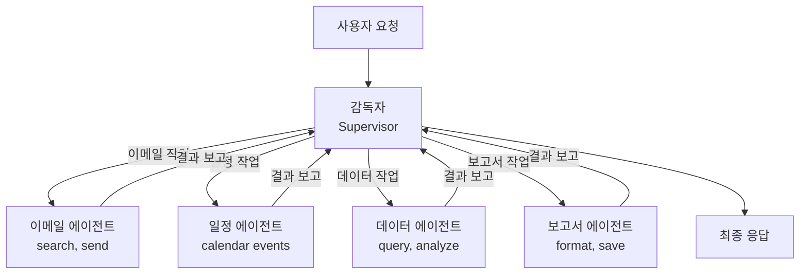
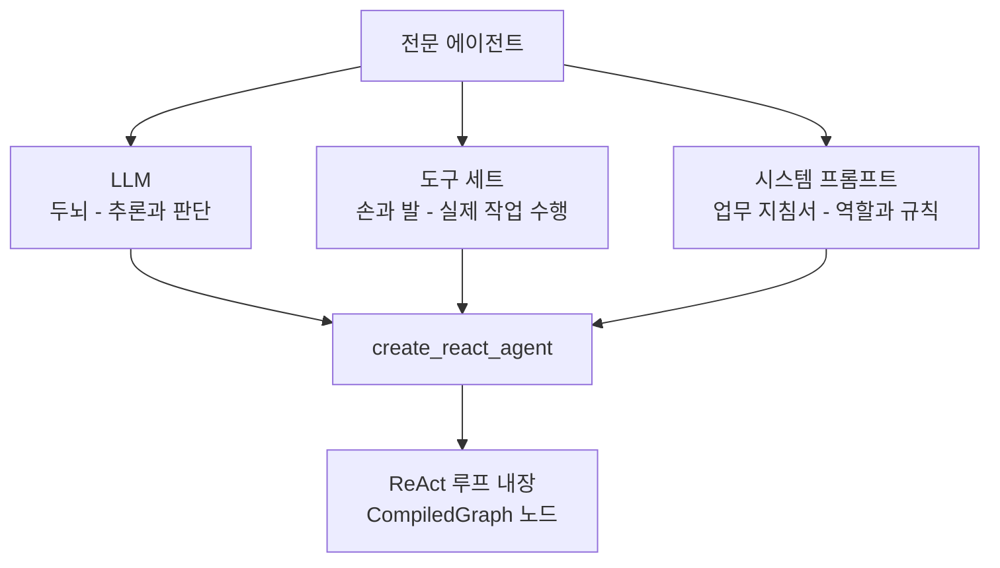
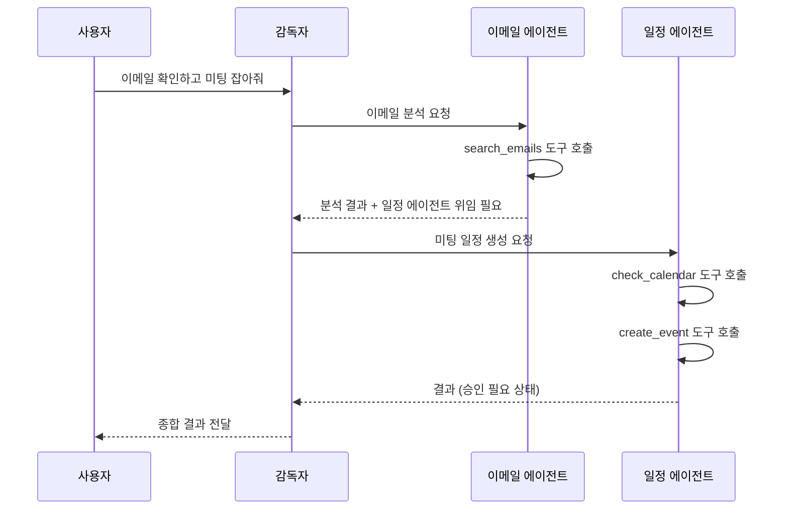
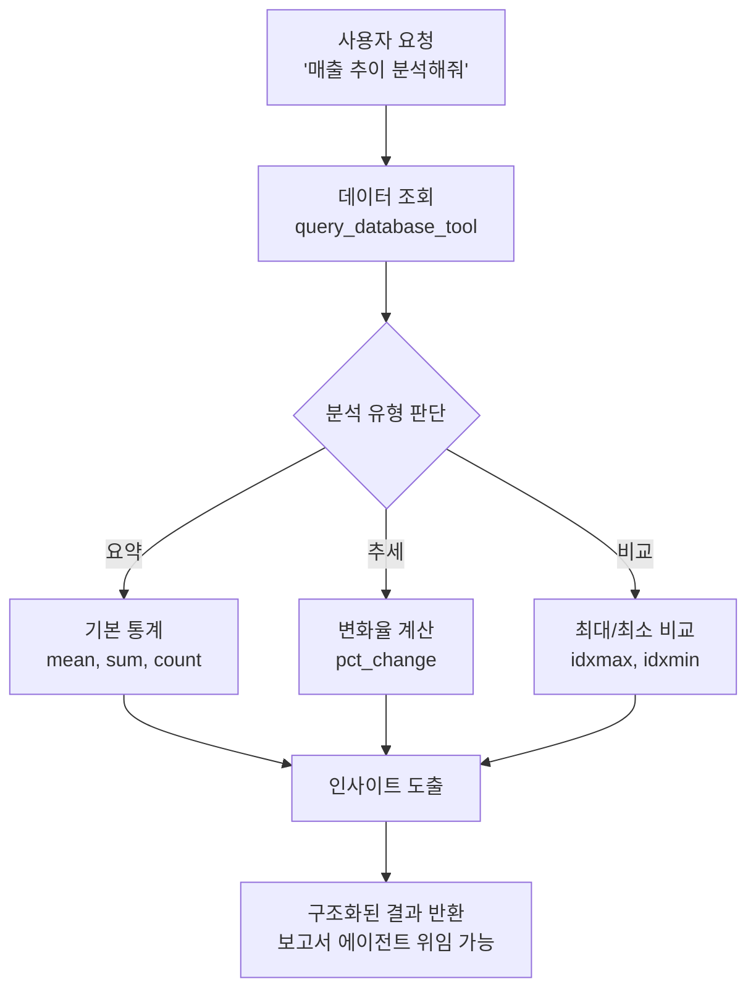
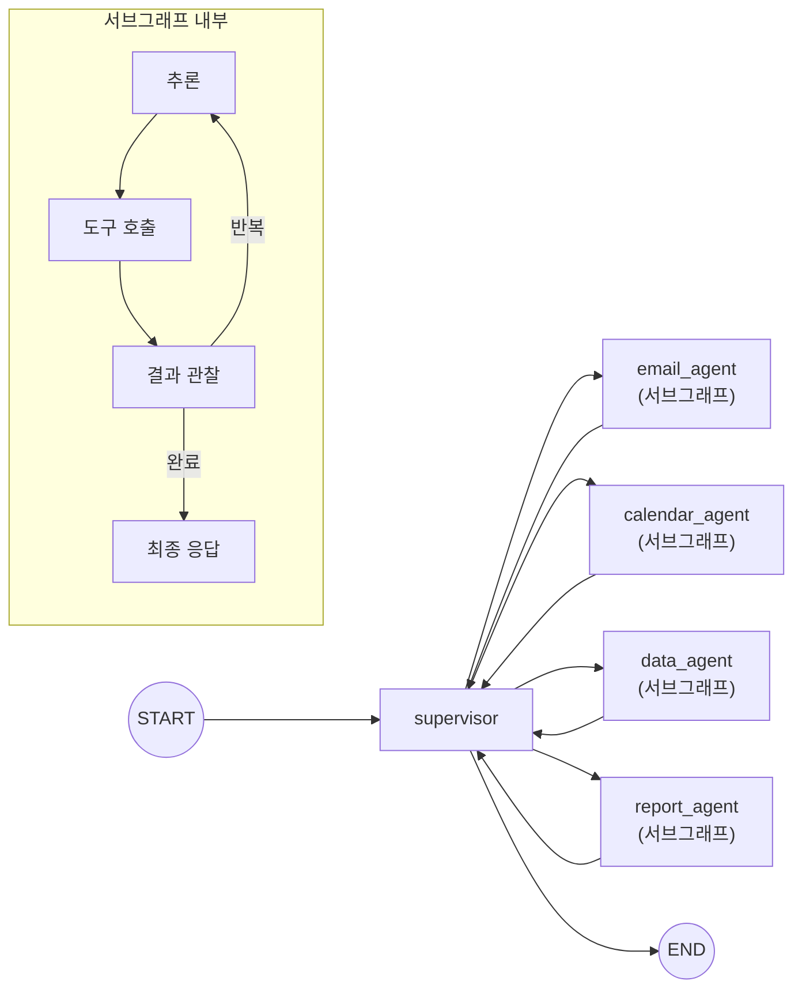

# 전문 에이전트 구현

> 이메일 분석, 일정 관리, 데이터 분석, 보고서 생성 — 각 업무 영역에 특화된 에이전트를 LangGraph 노드로 구현합니다.

## 개요

이 섹션에서는 [19.1 에이전트 아키텍처 설계](ch19/session1.md)에서 그린 청사진과 [19.2 외부 서비스 도구 구현](ch19/session2.md)에서 만든 도구들을 결합하여, 실제로 동작하는 **전문 에이전트(Specialized Agent)** 4종을 구현합니다. 각 에이전트는 LangGraph의 노드로 동작하며, 자신만의 도구 세트와 시스템 프롬프트를 가집니다.

**선수 지식**:
- 감독자(Supervisor) 패턴과 허브-앤-스포크 그래프 구조 (19.1)
- `@tool` 데코레이터, `BaseTool`, `ToolNode`를 활용한 커스텀 도구 구현 (19.2)
- `create_react_agent`, `StateGraph`, `bind_tools` 기본 사용법 (Ch13-14)

**학습 목표**:
- `create_react_agent`를 활용하여 도구와 프롬프트가 결합된 전문 에이전트를 구현할 수 있다
- 각 에이전트의 역할에 맞는 시스템 프롬프트와 도구 세트를 설계할 수 있다
- 에이전트 노드를 `StateGraph`에 통합하고 감독자와 연결할 수 있다
- 에이전트 간 결과를 상태(State)를 통해 공유하는 패턴을 구현할 수 있다

## 왜 알아야 할까?

> 📊 **그림 2**: 감독자-전문 에이전트 허브-앤-스포크 아키텍처




앞서 19.1에서 "이메일 에이전트", "일정 에이전트" 같은 역할을 정의하고, 19.2에서 각각이 사용할 도구를 만들었죠? 하지만 도구만으로는 에이전트가 아닙니다. **도구를 언제, 어떤 순서로, 어떤 판단 하에 사용할지 결정하는 "두뇌"**가 필요합니다.

회사에서 신입 사원을 뽑았다고 생각해보세요. 이메일 클라이언트, 캘린더 앱, 엑셀 같은 도구(19.2)는 이미 깔려 있습니다. 하지만 신입 사원에게는 **업무 지침서**(시스템 프롬프트)와 **담당 업무 범위**(도구 세트)를 명확히 알려줘야 합니다. "이메일 담당자는 이메일만 처리하고, 일정 관련 요청은 일정 담당자에게 넘겨라"처럼요.

이번 세션에서 만드는 전문 에이전트가 바로 그 **업무 지침이 내장된 전문 인력**입니다. 각자 자기 영역에서 ReAct 루프를 돌며 자율적으로 판단하고, 도구를 호출하고, 결과를 감독자에게 보고합니다.

## 핵심 개념

### 개념 1: 전문 에이전트의 구조 — "1인 1역" 원칙

> 💡 **비유**: 병원의 진료 시스템을 떠올려보세요. 접수처(감독자)에서 환자를 적절한 과에 배정하면, 내과 의사는 내과 장비만, 외과 의사는 외과 장비만 사용합니다. 각 의사는 자기 전공 분야에서 자율적으로 진단하고 처방하되, 다른 과의 소견이 필요하면 접수처를 통해 협진을 요청하죠.

전문 에이전트는 세 가지 요소로 구성됩니다:

> 📊 **그림 1**: 전문 에이전트의 3요소 구조




1. **LLM (두뇌)**: 추론과 판단을 담당하는 언어 모델
2. **도구 세트 (손과 발)**: 에이전트가 실제로 수행할 수 있는 작업들
3. **시스템 프롬프트 (업무 지침서)**: 역할, 행동 규칙, 출력 형식을 정의

LangGraph의 `create_react_agent`는 이 세 요소를 하나로 묶어 **ReAct 루프가 내장된 그래프 노드**를 만들어줍니다.

```python
from langgraph.prebuilt import create_react_agent
from langchain_openai import ChatOpenAI

# 전문 에이전트 생성의 기본 패턴
agent = create_react_agent(
    model=ChatOpenAI(model="gpt-4o", temperature=0),  # 두뇌
    tools=[tool_a, tool_b],                            # 손과 발
    name="specialist_agent",                           # 고유 이름
    prompt="당신은 X 분야 전문가입니다. ...",              # 업무 지침서
)
```

`create_react_agent`가 반환하는 것은 `CompiledGraph` 객체인데요, 이것은 그 자체로 `Runnable`이면서 동시에 상위 `StateGraph`의 노드로 삽입할 수 있습니다. 앞서 [Ch5 LCEL 마스터](ch05/session1.md)에서 배운 `Runnable` 인터페이스 덕분에 `invoke`, `stream`, `batch` 모두 지원됩니다.

### 개념 2: 이메일 분석 에이전트

> 💡 **비유**: 비서가 매일 아침 우편함을 열어 편지를 분류하는 것과 같습니다. 중요한 편지는 빨간 스티커, 광고는 파란 스티커를 붙이고, 답장이 필요한 것은 별도로 모아두죠.

이메일 분석 에이전트는 이메일을 검색하고, 내용을 분석하여 요약·분류·우선순위를 판단합니다. 19.2에서 만든 `search_emails_tool`과 `send_email_tool`을 사용합니다.

```python
from langchain_openai import ChatOpenAI
from langgraph.prebuilt import create_react_agent

# 이메일 분석 에이전트의 시스템 프롬프트
EMAIL_AGENT_PROMPT = """당신은 이메일 분석 전문 에이전트입니다.

## 역할
- 이메일을 검색하고 내용을 분석합니다
- 이메일을 카테고리별로 분류합니다 (업무, 미팅, 긴급, 정보, 스팸)
- 각 이메일의 우선순위를 판단합니다 (높음, 중간, 낮음)
- 필요시 답장 초안을 작성합니다

## 출력 형식
분석 결과는 반드시 아래 형식으로 작성하세요:

### 이메일 분석 결과
- **발신자**: ...
- **제목**: ...
- **카테고리**: [업무/미팅/긴급/정보/스팸]
- **우선순위**: [높음/중간/낮음]
- **요약**: 2-3줄 요약
- **필요 조치**: 답장 필요 여부와 추천 액션

## 규칙
- 반드시 도구를 사용하여 실제 이메일 데이터를 확인하세요
- 추측하지 말고, 도구 결과에 기반하여 분석하세요
- 일정 관련 요청은 '일정 에이전트에게 위임 필요'라고 명시하세요
"""

def create_email_agent(tools: list) -> "CompiledGraph":
    """이메일 분석 전문 에이전트를 생성합니다.

    Args:
        tools: 이메일 관련 도구 리스트 (search_emails_tool, send_email_tool 등)

    Returns:
        CompiledGraph: LangGraph 노드로 사용 가능한 에이전트
    """
    return create_react_agent(
        model=ChatOpenAI(model="gpt-4o", temperature=0),
        tools=tools,
        name="email_agent",
        prompt=EMAIL_AGENT_PROMPT,
    )
```

핵심은 **시스템 프롬프트에서 역할의 경계를 명확히** 하는 것입니다. "일정 관련 요청은 일정 에이전트에게 위임 필요"처럼, 자기 영역 밖의 요청을 인식하고 감독자에게 되돌려보내는 규칙을 포함해야 합니다.

> 📊 **그림 3**: 에이전트 간 역할 경계와 위임 흐름




### 개념 3: 일정 관리 에이전트

> 💡 **비유**: 개인 비서가 캘린더를 관리하는 것과 같습니다. "다음 주 수요일 오후 2시에 미팅 잡아줘"라고 하면, 기존 일정을 확인하고, 충돌이 없으면 등록하고, 참석자에게 알림을 보내죠.

일정 관리 에이전트는 19.2의 `calendar_event_tool`을 사용하여 일정 조회, 생성, 충돌 감지를 수행합니다.

```python
CALENDAR_AGENT_PROMPT = """당신은 일정 관리 전문 에이전트입니다.

## 역할
- 기존 일정을 조회하고 관리합니다
- 새로운 일정을 생성합니다
- 일정 충돌을 감지하고 대안을 제시합니다
- 일정 변경 시 관련자에게 알림을 준비합니다

## 출력 형식
### 일정 처리 결과
- **작업 유형**: [조회/생성/수정/삭제]
- **일시**: YYYY-MM-DD HH:MM
- **제목**: ...
- **참석자**: ...
- **충돌 여부**: [없음/있음 - 상세 내용]
- **상태**: [완료/보류/승인 필요]

## 규칙
- 일정 생성/수정/삭제는 반드시 '승인 필요' 상태로 표시하세요
- 기존 일정과 충돌 시 대안 시간을 최소 2개 제시하세요
- 과거 날짜의 일정 생성 요청은 거부하세요
- 이메일 발송이 필요한 경우 '이메일 에이전트에게 위임 필요'라고 명시하세요
"""

def create_calendar_agent(tools: list) -> "CompiledGraph":
    """일정 관리 전문 에이전트를 생성합니다.

    Args:
        tools: 일정 관련 도구 리스트 (calendar_event_tool 등)

    Returns:
        CompiledGraph: LangGraph 노드로 사용 가능한 에이전트
    """
    return create_react_agent(
        model=ChatOpenAI(model="gpt-4o", temperature=0),
        tools=tools,
        name="calendar_agent",
        prompt=CALENDAR_AGENT_PROMPT,
    )
```

일정 관리 에이전트에서 특히 중요한 점은 **부작용(Side Effect)이 있는 작업에 대한 안전장치**입니다. 일정 생성이나 삭제는 되돌리기 어려우므로, 프롬프트에서 "승인 필요"라고 표시하도록 지시합니다. 이 부분은 다음 세션의 Human-in-the-Loop 패턴과 연결됩니다.

### 개념 4: 데이터 분석 에이전트

> 📊 **그림 5**: 데이터 분석 에이전트의 처리 흐름




> 💡 **비유**: 데이터 분석가에게 "지난달 매출 추이 좀 봐줘"라고 요청하면, 분석가는 데이터베이스에서 데이터를 꺼내고, 엑셀에서 피벗 테이블을 만들고, 그래프를 그려서 인사이트를 뽑아내죠.

데이터 분석 에이전트는 `query_database_tool`로 데이터를 조회하고, Python 코드를 실행하여 분석합니다. LangChain의 `PythonREPL` 도구를 결합하면 판다스(Pandas) 기반 분석까지 가능합니다.

```python
from langchain_core.tools import tool

@tool
def analyze_data(query: str, analysis_type: str = "summary") -> str:
    """데이터를 조회하고 분석합니다.

    Args:
        query: SQL 쿼리 또는 분석 대상 설명
        analysis_type: 분석 유형 (summary, trend, comparison)

    Returns:
        분석 결과 문자열
    """
    import pandas as pd

    # 시뮬레이션: 실제로는 DB에서 데이터 조회
    sample_data = {
        "month": ["1월", "2월", "3월", "4월", "5월"],
        "revenue": [1200, 1350, 1100, 1500, 1680],
        "customers": [45, 52, 48, 61, 70],
    }
    df = pd.DataFrame(sample_data)

    if analysis_type == "summary":
        # 기본 통계 요약
        stats = df.describe().to_string()
        return f"데이터 요약:\n{stats}\n\n총 매출: {df['revenue'].sum()}만원"
    elif analysis_type == "trend":
        # 추세 분석
        revenue_change = df["revenue"].pct_change().dropna()
        avg_growth = revenue_change.mean() * 100
        return f"매출 추세: 평균 월별 성장률 {avg_growth:.1f}%"
    elif analysis_type == "comparison":
        # 비교 분석
        best = df.loc[df["revenue"].idxmax()]
        worst = df.loc[df["revenue"].idxmin()]
        return f"최고 매출: {best['month']} ({best['revenue']}만원)\n최저 매출: {worst['month']} ({worst['revenue']}만원)"
    return "지원하지 않는 분석 유형입니다."


DATA_AGENT_PROMPT = """당신은 데이터 분석 전문 에이전트입니다.

## 역할
- 데이터베이스에서 데이터를 조회합니다
- 통계 분석, 추세 분석, 비교 분석을 수행합니다
- 분석 결과를 이해하기 쉽게 정리합니다
- 보고서 작성에 필요한 인사이트를 도출합니다

## 출력 형식
### 데이터 분석 결과
- **분석 대상**: ...
- **분석 유형**: [요약/추세/비교/예측]
- **핵심 발견**: 
  1. ...
  2. ...
- **데이터 근거**: 사용한 쿼리와 수치
- **인사이트**: 비즈니스 관점의 해석

## 규칙
- 반드시 도구를 사용하여 실제 데이터를 조회한 후 분석하세요
- 데이터 없이 추측하지 마세요
- 수치는 정확하게 표기하세요
- 보고서 생성이 필요한 경우 '보고서 에이전트에게 위임 필요'라고 명시하세요
"""

def create_data_agent(tools: list) -> "CompiledGraph":
    """데이터 분석 전문 에이전트를 생성합니다.

    Args:
        tools: 데이터 관련 도구 리스트 (query_database_tool, analyze_data 등)

    Returns:
        CompiledGraph: LangGraph 노드로 사용 가능한 에이전트
    """
    return create_react_agent(
        model=ChatOpenAI(model="gpt-4o", temperature=0),
        tools=tools,
        name="data_agent",
        prompt=DATA_AGENT_PROMPT,
    )
```

### 개념 5: 보고서 생성 에이전트

> 💡 **비유**: 기자가 취재 자료를 모아 기사를 쓰는 것과 같습니다. 다른 에이전트들이 모아온 "취재 자료"(이메일 분석 결과, 일정 현황, 데이터 인사이트)를 종합하여 읽기 쉬운 보고서로 엮어냅니다.

보고서 생성 에이전트는 다른 에이전트들의 결과를 종합하는 역할을 합니다. 다른 에이전트와 달리 **외부 도구보다 LLM의 텍스트 생성 능력**이 핵심인 에이전트입니다.

```python
@tool
def format_report(
    title: str,
    sections: str,
    format_type: str = "markdown"
) -> str:
    """분석 결과를 보고서 형식으로 포맷팅합니다.

    Args:
        title: 보고서 제목
        sections: 보고서에 포함할 내용 (JSON 문자열)
        format_type: 출력 형식 (markdown, html, text)

    Returns:
        포맷팅된 보고서 문자열
    """
    import json
    from datetime import datetime

    report_date = datetime.now().strftime("%Y-%m-%d %H:%M")

    if format_type == "markdown":
        report = f"# {title}\n\n"
        report += f"**생성일시**: {report_date}\n\n---\n\n"

        try:
            section_list = json.loads(sections)
            for section in section_list:
                heading = section.get("heading", "섹션")
                content = section.get("content", "")
                report += f"## {heading}\n\n{content}\n\n"
        except json.JSONDecodeError:
            # JSON 파싱 실패 시 원본 텍스트 사용
            report += sections

        report += "\n---\n*이 보고서는 AI 에이전트에 의해 자동 생성되었습니다.*"
        return report
    return f"[{format_type}] {title}: {sections}"


@tool
def save_report(content: str, filename: str) -> str:
    """보고서를 파일로 저장합니다.

    Args:
        content: 저장할 보고서 내용
        filename: 저장할 파일명

    Returns:
        저장 결과 메시지
    """
    # 시뮬레이션 모드: 실제 파일 저장 대신 확인 메시지 반환
    return f"보고서가 '{filename}'으로 저장되었습니다. (시뮬레이션)"


REPORT_AGENT_PROMPT = """당신은 보고서 생성 전문 에이전트입니다.

## 역할
- 다른 에이전트들의 분석 결과를 종합합니다
- 구조화된 비즈니스 보고서를 작성합니다
- 핵심 인사이트와 액션 아이템을 도출합니다
- 보고서를 지정된 형식으로 포맷팅합니다

## 출력 형식
### 보고서
- **제목**: ...
- **요약**: 3줄 이내 핵심 요약 (Executive Summary)
- **본문**: 구조화된 분석 내용
- **액션 아이템**: 번호 매긴 후속 조치 리스트
- **첨부**: 관련 데이터 테이블

## 규칙
- 다른 에이전트의 분석 결과를 그대로 복사하지 말고, 종합하여 재구성하세요
- 경영진이 읽기 쉬운 톤으로 작성하세요
- 모든 수치는 데이터 에이전트의 결과에서 인용하세요
- 결론에는 반드시 구체적인 액션 아이템을 포함하세요
"""

def create_report_agent(tools: list) -> "CompiledGraph":
    """보고서 생성 전문 에이전트를 생성합니다.

    Args:
        tools: 보고서 관련 도구 리스트 (format_report, save_report 등)

    Returns:
        CompiledGraph: LangGraph 노드로 사용 가능한 에이전트
    """
    return create_react_agent(
        model=ChatOpenAI(model="gpt-4o", temperature=0.3),  # 약간의 창의성
        tools=tools,
        name="report_agent",
        prompt=REPORT_AGENT_PROMPT,
    )
```

보고서 에이전트의 `temperature`가 다른 에이전트(0)보다 약간 높은 0.3인 것을 눈치채셨나요? 이메일 분석이나 데이터 조회는 정확성이 최우선이지만, 보고서 작성은 약간의 **창의적 표현**이 필요하기 때문입니다.

### 개념 6: 에이전트를 StateGraph에 통합하기

> 💡 **비유**: 각 전문 의사(에이전트)를 병원 건물(StateGraph) 안에 배치하는 것입니다. 접수처(감독자)에서 복도(엣지)를 통해 각 진료실(노드)로 환자를 안내하고, 진료가 끝나면 다시 접수처로 돌아옵니다.

19.1에서 설계한 `StateGraph`에 전문 에이전트들을 노드로 추가하는 방법을 살펴보겠습니다. `create_react_agent`가 반환하는 객체는 **서브그래프(Subgraph)**로 상위 그래프에 삽입됩니다.

```python
from typing import Annotated, TypedDict
from langchain_core.messages import AnyMessage
from langgraph.graph import StateGraph, START, END
from langgraph.graph.message import add_messages
import operator


# 공유 상태 정의 (19.1에서 설계한 것의 확장)
class WorkflowState(TypedDict):
    messages: Annotated[list[AnyMessage], add_messages]  # 대화 히스토리
    task_results: Annotated[list[dict], operator.add]     # 각 에이전트 결과
    current_agent: str                                     # 현재 활성 에이전트
    pending_tasks: list[str]                               # 대기 중인 작업


# 전문 에이전트 생성
email_agent = create_email_agent([search_emails_tool, send_email_tool])
calendar_agent = create_calendar_agent([calendar_event_tool])
data_agent = create_data_agent([query_database_tool, analyze_data])
report_agent = create_report_agent([format_report, save_report])

# StateGraph 구성
workflow = StateGraph(WorkflowState)

# 에이전트들을 노드로 추가
workflow.add_node("email_agent", email_agent)
workflow.add_node("calendar_agent", calendar_agent)
workflow.add_node("data_agent", data_agent)
workflow.add_node("report_agent", report_agent)
```

여기서 중요한 점은 `add_node`에 전달하는 두 번째 인자가 **함수가 아니라 `CompiledGraph` 객체**라는 것입니다. LangGraph는 이를 자동으로 서브그래프로 처리합니다. 서브그래프 내부의 ReAct 루프가 완료되면, 결과가 상위 그래프의 상태로 병합됩니다.

> 📊 **그림 4**: StateGraph에 서브그래프로 통합된 전문 에이전트 구조




### 개념 7: 에이전트 팩토리 패턴

여러 전문 에이전트를 만들다 보면 반복되는 코드가 보이죠? 이를 **팩토리 패턴**으로 깔끔하게 정리할 수 있습니다.

```python
from dataclasses import dataclass
from langchain_core.tools import BaseTool


@dataclass
class AgentConfig:
    """에이전트 설정을 담는 데이터 클래스"""
    name: str                    # 에이전트 고유 이름
    prompt: str                  # 시스템 프롬프트
    tools: list[BaseTool]        # 사용할 도구 목록
    model_name: str = "gpt-4o"   # LLM 모델
    temperature: float = 0       # 창의성 수준


def create_specialist_agent(config: AgentConfig) -> "CompiledGraph":
    """설정 기반으로 전문 에이전트를 생성하는 팩토리 함수

    Args:
        config: 에이전트 설정 (이름, 프롬프트, 도구 등)

    Returns:
        CompiledGraph: 설정대로 구성된 전문 에이전트
    """
    model = ChatOpenAI(
        model=config.model_name,
        temperature=config.temperature,
    )

    return create_react_agent(
        model=model,
        tools=config.tools,
        name=config.name,
        prompt=config.prompt,
    )


# 사용 예시: 설정 객체로 에이전트 일괄 생성
agent_configs = [
    AgentConfig(
        name="email_agent",
        prompt=EMAIL_AGENT_PROMPT,
        tools=[search_emails_tool, send_email_tool],
    ),
    AgentConfig(
        name="calendar_agent",
        prompt=CALENDAR_AGENT_PROMPT,
        tools=[calendar_event_tool],
    ),
    AgentConfig(
        name="data_agent",
        prompt=DATA_AGENT_PROMPT,
        tools=[query_database_tool, analyze_data],
    ),
    AgentConfig(
        name="report_agent",
        prompt=REPORT_AGENT_PROMPT,
        tools=[format_report, save_report],
        temperature=0.3,
    ),
]

# 한 번에 모든 에이전트 생성
agents = {
    config.name: create_specialist_agent(config)
    for config in agent_configs
}
```

이 패턴의 장점은 **에이전트 추가가 설정 객체 하나를 리스트에 넣는 것만으로 끝난다**는 것입니다. 새로운 "번역 에이전트"가 필요하면? `AgentConfig`를 하나 더 만들면 됩니다.

## 실습: 직접 해보기

이제 4개의 전문 에이전트를 감독자와 함께 하나의 워크플로우로 통합하여 실행해봅시다. 전체 코드를 단계별로 구성합니다.

```python
"""
전문 에이전트 통합 워크플로우 — 실행 가능한 완전한 예제

필요 패키지:
  pip install langchain-openai langgraph langchain-core pandas

환경 변수:
  OPENAI_API_KEY=your-key-here (.env 파일에 설정)
"""

import operator
import json
from typing import Annotated, TypedDict, Literal
from datetime import datetime
from dataclasses import dataclass

from dotenv import load_dotenv
from langchain_core.messages import AnyMessage, HumanMessage, SystemMessage
from langchain_core.tools import tool, BaseTool
from langchain_openai import ChatOpenAI
from langgraph.graph import StateGraph, START, END
from langgraph.graph.message import add_messages
from langgraph.prebuilt import create_react_agent

load_dotenv()

# ============================================================
# 1단계: 도구 정의 (19.2에서 만든 도구의 시뮬레이션 버전)
# ============================================================

@tool
def search_emails(query: str, max_results: int = 5) -> str:
    """이메일을 검색합니다.

    Args:
        query: 검색 키워드
        max_results: 최대 결과 수
    """
    # 시뮬레이션 데이터
    emails = [
        {
            "from": "김팀장 <kim@company.com>",
            "subject": "Q1 매출 보고서 검토 요청",
            "date": "2026-03-03",
            "preview": "첨부된 Q1 매출 보고서를 검토해주세요. 금요일까지 피드백 부탁드립니다.",
        },
        {
            "from": "이대리 <lee@company.com>",
            "subject": "내일 오후 미팅 시간 변경",
            "date": "2026-03-02",
            "preview": "내일 예정된 미팅을 오후 3시에서 4시로 변경 가능할까요?",
        },
        {
            "from": "마케팅팀 <marketing@company.com>",
            "subject": "3월 마케팅 캠페인 결과",
            "date": "2026-03-01",
            "preview": "3월 첫째 주 캠페인 결과를 공유합니다. 전환율 15% 향상.",
        },
    ]
    return json.dumps(emails[:max_results], ensure_ascii=False, indent=2)


@tool
def check_calendar(date: str) -> str:
    """특정 날짜의 일정을 조회합니다.

    Args:
        date: 조회할 날짜 (YYYY-MM-DD)
    """
    # 시뮬레이션 데이터
    schedules = {
        "2026-03-04": [
            {"time": "10:00-11:00", "title": "주간 팀 미팅", "location": "회의실 A"},
            {"time": "14:00-15:00", "title": "프로젝트 리뷰", "location": "Zoom"},
        ],
        "2026-03-05": [
            {"time": "09:00-10:00", "title": "1:1 미팅 (김팀장)", "location": "카페"},
        ],
    }
    result = schedules.get(date, [])
    if not result:
        return f"{date}에 등록된 일정이 없습니다."
    return json.dumps(result, ensure_ascii=False, indent=2)


@tool
def create_calendar_event(title: str, date: str, time: str, attendees: str = "") -> str:
    """새로운 일정을 생성합니다. (시뮬레이션)

    Args:
        title: 일정 제목
        date: 날짜 (YYYY-MM-DD)
        time: 시간 (HH:MM)
        attendees: 참석자 (쉼표 구분)
    """
    return (
        f"[승인 필요] 일정 생성 요청:\n"
        f"  제목: {title}\n"
        f"  일시: {date} {time}\n"
        f"  참석자: {attendees or '없음'}\n"
        f"  상태: 승인 대기 중"
    )


@tool
def query_sales_data(period: str = "monthly", metric: str = "revenue") -> str:
    """매출 데이터를 조회합니다.

    Args:
        period: 조회 기간 (monthly, weekly, quarterly)
        metric: 지표 (revenue, customers, conversion)
    """
    import pandas as pd

    data = {
        "month": ["1월", "2월", "3월", "4월", "5월"],
        "revenue": [1200, 1350, 1100, 1500, 1680],
        "customers": [45, 52, 48, 61, 70],
        "conversion": [3.2, 3.8, 3.1, 4.2, 4.5],
    }
    df = pd.DataFrame(data)

    if metric == "revenue":
        total = df["revenue"].sum()
        avg = df["revenue"].mean()
        growth = ((df["revenue"].iloc[-1] - df["revenue"].iloc[0]) / df["revenue"].iloc[0]) * 100
        return (
            f"매출 데이터 ({period}):\n"
            f"{df[['month', 'revenue']].to_string(index=False)}\n\n"
            f"총 매출: {total}만원 | 평균: {avg:.0f}만원 | 성장률: {growth:.1f}%"
        )
    elif metric == "customers":
        return f"고객 데이터:\n{df[['month', 'customers']].to_string(index=False)}"
    return f"전체 데이터:\n{df.to_string(index=False)}"


@tool
def format_report(title: str, content: str) -> str:
    """분석 결과를 마크다운 보고서로 포맷팅합니다.

    Args:
        title: 보고서 제목
        content: 보고서 본문 내용
    """
    report_date = datetime.now().strftime("%Y-%m-%d %H:%M")
    return (
        f"# {title}\n\n"
        f"**생성일시**: {report_date}\n"
        f"**생성자**: AI 업무 자동화 시스템\n\n"
        f"---\n\n"
        f"{content}\n\n"
        f"---\n"
        f"*이 보고서는 AI 에이전트에 의해 자동 생성되었습니다.*"
    )


# ============================================================
# 2단계: 전문 에이전트 시스템 프롬프트 정의
# ============================================================

EMAIL_PROMPT = """당신은 이메일 분석 전문 에이전트입니다.
이메일을 검색하고 분석하여 카테고리, 우선순위, 요약, 필요 조치를 정리합니다.
분석 결과는 구조화된 형식으로 작성하세요.
일정 관련 내용은 '일정 에이전트 위임 필요'로 표시하세요."""

CALENDAR_PROMPT = """당신은 일정 관리 전문 에이전트입니다.
일정 조회, 생성, 충돌 감지를 수행합니다.
일정 생성/수정은 반드시 '승인 필요' 상태로 표시하세요.
충돌 시 대안 시간을 제시하세요."""

DATA_PROMPT = """당신은 데이터 분석 전문 에이전트입니다.
데이터를 조회하고 분석하여 핵심 인사이트를 도출합니다.
모든 분석은 실제 데이터에 기반해야 합니다.
수치는 정확하게 표기하세요."""

REPORT_PROMPT = """당신은 보고서 생성 전문 에이전트입니다.
다른 에이전트들의 결과를 종합하여 보고서를 작성합니다.
경영진이 읽기 쉬운 톤으로 작성하고 액션 아이템을 포함하세요.
format_report 도구를 사용하여 보고서를 포맷팅하세요."""


# ============================================================
# 3단계: 팩토리 패턴으로 에이전트 일괄 생성
# ============================================================

@dataclass
class AgentConfig:
    name: str
    prompt: str
    tools: list
    temperature: float = 0


AGENT_CONFIGS = [
    AgentConfig("email_agent", EMAIL_PROMPT, [search_emails]),
    AgentConfig("calendar_agent", CALENDAR_PROMPT, [check_calendar, create_calendar_event]),
    AgentConfig("data_agent", DATA_PROMPT, [query_sales_data]),
    AgentConfig("report_agent", REPORT_PROMPT, [format_report], temperature=0.3),
]

MODEL_NAME = "gpt-4o"


def build_agents(configs: list[AgentConfig]) -> dict[str, "CompiledGraph"]:
    """설정 리스트로부터 전문 에이전트들을 일괄 생성합니다."""
    agents = {}
    for config in configs:
        model = ChatOpenAI(model=MODEL_NAME, temperature=config.temperature)
        agents[config.name] = create_react_agent(
            model=model,
            tools=config.tools,
            name=config.name,
            prompt=config.prompt,
        )
    return agents


agents = build_agents(AGENT_CONFIGS)


# ============================================================
# 4단계: 감독자 + 전문 에이전트 워크플로우 구성
# ============================================================

class WorkflowState(TypedDict):
    messages: Annotated[list[AnyMessage], add_messages]


# 감독자 에이전트 구성
SUPERVISOR_PROMPT = """당신은 업무 자동화 감독자입니다.
사용자의 요청을 분석하여 적절한 전문 에이전트에게 작업을 위임합니다.

사용 가능한 에이전트:
- email_agent: 이메일 검색, 분석, 분류
- calendar_agent: 일정 조회, 생성, 관리
- data_agent: 데이터 조회, 분석, 인사이트 도출
- report_agent: 보고서 작성, 포맷팅

여러 에이전트가 필요한 경우, 순서대로 위임하세요.
최종 결과를 사용자에게 종합하여 전달하세요."""

supervisor_model = ChatOpenAI(model=MODEL_NAME, temperature=0)

# 감독자가 전문 에이전트를 호출하는 워크플로우
supervisor = create_react_agent(
    model=supervisor_model,
    tools=[],           # 감독자는 직접 도구를 쓰지 않음
    name="supervisor",
    prompt=SUPERVISOR_PROMPT,
)

# 최종 워크플로우 구성: 감독자 → 전문 에이전트들
workflow = StateGraph(WorkflowState)
workflow.add_node("supervisor", supervisor)

for agent_name, agent in agents.items():
    workflow.add_node(agent_name, agent)

# 감독자에서 시작
workflow.add_edge(START, "supervisor")
workflow.add_edge("supervisor", END)

# 그래프 컴파일
app = workflow.compile()


# ============================================================
# 5단계: 실행 테스트
# ============================================================

def run_workflow(user_request: str) -> None:
    """워크플로우를 실행하고 결과를 출력합니다."""
    print(f"\n{'='*60}")
    print(f"사용자 요청: {user_request}")
    print(f"{'='*60}\n")

    result = app.invoke({
        "messages": [HumanMessage(content=user_request)]
    })

    # 최종 응답 출력
    final_message = result["messages"][-1]
    print(f"최종 응답:\n{final_message.content}")


# 테스트 1: 단일 에이전트 작업
run_workflow("오늘 받은 이메일을 분석해주세요.")

# 테스트 2: 복합 작업 (여러 에이전트 협업)
run_workflow("이번 달 매출 데이터를 분석하고, 결과를 보고서로 작성해주세요.")

# 테스트 3: 일정 관련 작업
run_workflow("내일 일정을 확인하고, 오후 4시에 마케팅 미팅을 추가해주세요.")
```

> 🔥 **실무 팁**: 위 예제에서 감독자는 `tools=[]`로 직접 도구를 사용하지 않습니다. 실무에서는 `langgraph-supervisor` 패키지의 `create_supervisor`를 사용하면 에이전트 간 라우팅을 더 체계적으로 구성할 수 있습니다. 다만 여기서는 기본 원리를 이해하기 위해 `create_react_agent`만으로 구성했습니다.

## 더 깊이 알아보기

### 전문화(Specialization)의 역사 — 아담 스미스에서 AI 에이전트까지

전문 에이전트의 "1인 1역" 원칙은 사실 경제학의 고전적 개념인 **분업(Division of Labor)**에서 비롯됩니다. 1776년 아담 스미스는 『국부론』에서 핀 공장의 예를 들었죠. 한 사람이 핀을 처음부터 끝까지 만들면 하루 20개를 만들지만, 18개 공정을 10명이 나누면 하루 48,000개를 만든다는 것입니다.

AI 에이전트 시스템에서도 같은 원리가 적용됩니다. 하나의 거대한 에이전트에게 "이메일도 처리하고, 일정도 관리하고, 데이터도 분석하고, 보고서도 써"라고 하면 프롬프트가 길어지고, 도구가 많아지면서 **도구 선택의 정확도가 떨어집니다**. 2023년 LangChain 팀의 실험에 따르면, 에이전트가 사용하는 도구가 10개를 넘으면 올바른 도구 선택률이 급격히 하락합니다.

### "Mixture of Experts"에서 영감을 받다

전문 에이전트 패턴은 딥러닝의 **Mixture of Experts (MoE)** 아키텍처와도 닮아 있습니다. MoE에서는 게이팅 네트워크(감독자)가 입력을 분석하여 적절한 전문가 네트워크(전문 에이전트)로 라우팅합니다. Google의 Switch Transformer(2022)가 이 개념을 대규모로 성공시켰고, 이후 멀티 에이전트 시스템 설계에도 큰 영향을 미쳤습니다.

흥미롭게도, LangGraph의 `create_react_agent` 함수명에 들어간 "ReAct"는 2022년 Princeton과 Google의 연구자 Shunyu Yao 등이 발표한 논문 "ReAct: Synergizing Reasoning and Acting in Language Models"에서 유래합니다. 추론(Reasoning)과 행동(Acting)을 번갈아 수행하는 이 패턴이 지금 LangGraph 에이전트의 핵심 루프가 된 것이죠.

## 흔한 오해와 팁

> ⚠️ **흔한 오해**: "전문 에이전트마다 다른 LLM 모델을 써야 한다"고 생각하기 쉽습니다. 하지만 대부분의 경우 같은 모델을 사용하되 **시스템 프롬프트와 도구 세트로 차별화**하는 것이 더 효과적입니다. 모델을 다르게 쓰는 것은 비용 최적화가 필요할 때(예: 간단한 분류 작업에는 작은 모델, 복잡한 분석에는 큰 모델)로 한정하세요.

> 💡 **알고 계셨나요?**: `create_react_agent`의 `name` 파라미터는 단순한 레이블이 아닙니다. LangGraph에서 이 이름은 서브그래프의 **네임스페이스(namespace)**로 사용되어, 트레이싱(LangSmith)에서 어떤 에이전트가 어떤 작업을 했는지 추적할 수 있게 해줍니다. 디버깅할 때 이 이름이 빛을 발하죠.

> 🔥 **실무 팁**: 에이전트 프롬프트에 **부정 지시(negative instruction)**를 반드시 포함하세요. "일정 관련 요청은 처리하지 마세요"처럼 에이전트가 **하지 말아야 할 것**을 명시하면, 에이전트 간 역할 침범을 효과적으로 방지할 수 있습니다. 이것은 "역할의 경계"를 프롬프트로 강제하는 핵심 기법입니다.

> 🔥 **실무 팁**: 에이전트별 도구 수는 **5개 이하**로 유지하세요. 도구가 많아질수록 LLM이 올바른 도구를 선택할 확률이 떨어집니다. 도구가 5개를 넘으면 에이전트를 더 세분화하는 것을 고려하세요.

## 핵심 정리

| 개념 | 설명 |
|------|------|
| 전문 에이전트 3요소 | LLM(두뇌) + 도구 세트(손과 발) + 시스템 프롬프트(업무 지침서) |
| `create_react_agent` | LangGraph의 프리빌트 함수로, 3요소를 결합하여 ReAct 루프가 내장된 에이전트 노드 생성 |
| 이메일 에이전트 | 이메일 검색·분류·우선순위 판단·답장 초안 작성 담당 |
| 일정 에이전트 | 일정 조회·생성·충돌 감지, 부작용 있는 작업은 "승인 필요"로 표시 |
| 데이터 에이전트 | DB 조회·통계 분석·추세 분석·인사이트 도출 담당 |
| 보고서 에이전트 | 다른 에이전트 결과를 종합하여 구조화된 보고서 작성, `temperature` 약간 높게 설정 |
| 에이전트 팩토리 패턴 | `AgentConfig` 데이터 클래스로 에이전트 설정을 관리하고 일괄 생성 |
| 부정 지시 | 에이전트 프롬프트에 "하지 말아야 할 것"을 명시하여 역할 침범 방지 |
| 서브그래프 통합 | `workflow.add_node(name, agent)`로 `create_react_agent` 결과를 상위 그래프에 삽입 |

## 다음 섹션 미리보기

전문 에이전트들이 자율적으로 작동하는 건 좋지만, 이메일 전송이나 일정 생성처럼 **되돌리기 어려운 작업**을 에이전트가 마음대로 실행하면 위험하겠죠? 다음 섹션 **[19.4 Human-in-the-Loop 안전 메커니즘](ch19/session4.md)**에서는 LangGraph의 `interrupt` 기능을 활용하여, 위험한 도구 호출 전에 사용자 승인을 요구하는 안전장치를 구현합니다. 이번 세션에서 일정 에이전트 프롬프트에 넣었던 "승인 필요" 표시가 실제 코드 레벨에서 어떻게 동작하는지 확인할 수 있습니다.

## 참고 자료

- [LangGraph 공식 문서 — Prebuilt ReAct Agent](https://langchain-ai.github.io/langgraph/how-tos/react-agent-from-scratch-functional/) - `create_react_agent` API와 커스터마이징 방법을 상세히 설명하는 공식 가이드
- [LangGraph Multi-Agent Supervisor (GitHub)](https://github.com/langchain-ai/langgraph-supervisor-py) - 감독자 패턴을 프리빌트로 제공하는 공식 라이브러리, 전문 에이전트 통합 예제 포함
- [LangGraph Multi-Agent Network Tutorial](https://langchain-ai.github.io/langgraph/tutorials/multi_agent/multi-agent-collaboration/) - 전문 에이전트 간 협업 패턴을 다루는 공식 튜토리얼
- [LangChain Agents Documentation](https://docs.langchain.com/oss/python/langchain/agents) - LangChain/LangGraph 에이전트의 전체적인 개념과 API 레퍼런스
- [Shunyu Yao et al., "ReAct: Synergizing Reasoning and Acting in Language Models" (2022)](https://arxiv.org/abs/2210.03629) - ReAct 패턴의 원본 논문, 전문 에이전트 내부 루프의 이론적 배경

---
### 🔗 Related Sessions
- [supervisor_pattern](../15-멀티-에이전트-시스템/01-멀티-에이전트-아키텍처-패턴.md) (prerequisite)
- [workflow_state](../19-실전-프로젝트-2-ai-에이전트-기반-업무-자동화/01-에이전트-아키텍처-설계.md) (prerequisite)
- [search_emails_tool](../19-실전-프로젝트-2-ai-에이전트-기반-업무-자동화/02-외부-서비스-도구-구현.md) (prerequisite)
- [send_email_tool](../19-실전-프로젝트-2-ai-에이전트-기반-업무-자동화/02-외부-서비스-도구-구현.md) (prerequisite)
- [calendar_event_tool](../19-실전-프로젝트-2-ai-에이전트-기반-업무-자동화/02-외부-서비스-도구-구현.md) (prerequisite)
- [query_database_tool](../19-실전-프로젝트-2-ai-에이전트-기반-업무-자동화/02-외부-서비스-도구-구현.md) (prerequisite)
- [tool_exception_pattern](../19-실전-프로젝트-2-ai-에이전트-기반-업무-자동화/02-외부-서비스-도구-구현.md) (prerequisite)
- [simulation_mode](../19-실전-프로젝트-2-ai-에이전트-기반-업무-자동화/02-외부-서비스-도구-구현.md) (prerequisite)
