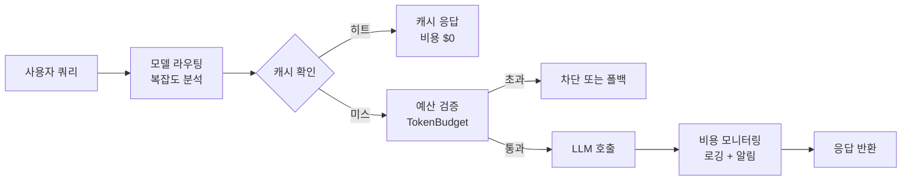
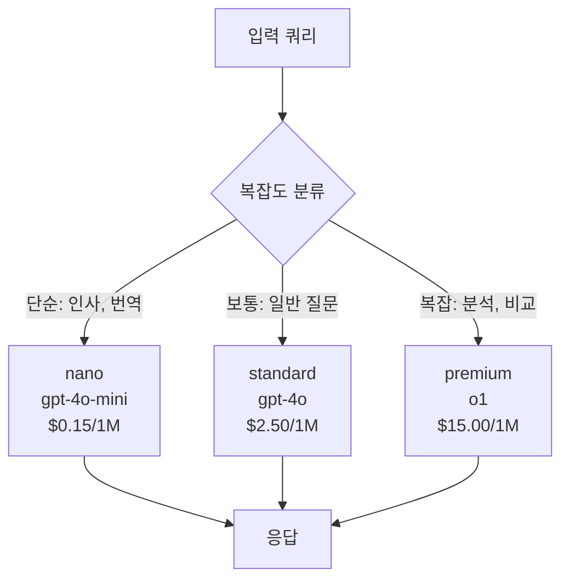
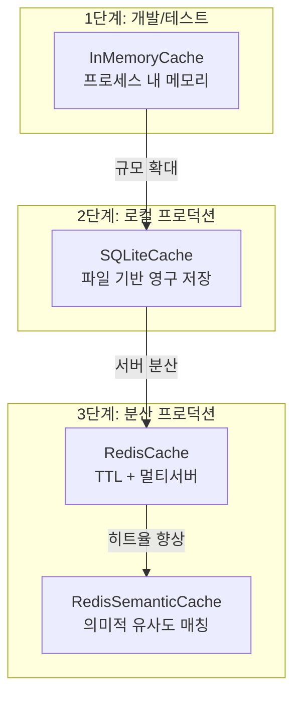
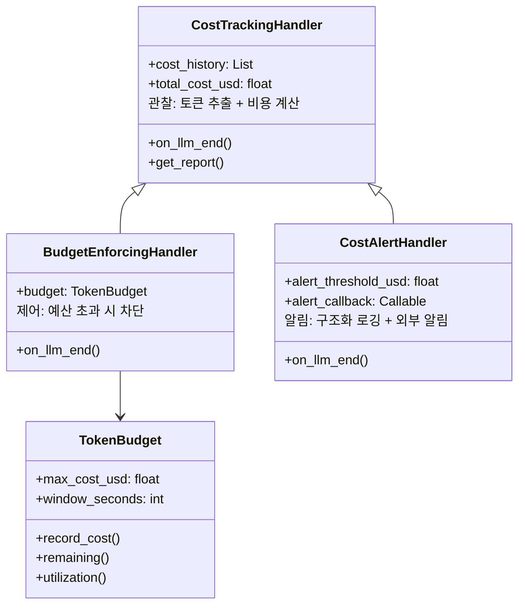

# 비용 최적화

> LLM 애플리케이션의 비용을 체계적으로 관리하는 모델 라우팅, 캐싱, 토큰 예산, 모니터링 전략을 배웁니다.

## 개요

이 섹션에서는 프로덕션 환경에서 LLM API 비용을 40~70%까지 절감할 수 있는 네 가지 핵심 전략을 다룹니다. 모델 라우팅으로 작업 복잡도에 맞는 모델을 자동 선택하고, 캐싱으로 중복 호출을 제거하며, 토큰 예산으로 비용 상한을 설정하고, 모니터링으로 비용 이상을 즉시 감지하는 체계를 구축합니다.

> 📊 **그림 1**: 비용 최적화 4대 전략의 처리 흐름




**선수 지식**: [Session 20.1: 프로덕션 보안](./20-1.md)에서 배운 보안 계층 구조, [Session 16.2: 커스텀 콜백 핸들러](../ch16/16-2.md)에서 다룬 `CostTrackingHandler`와 Callback 패턴, [Chapter 5: LCEL](../ch05/)에서 배운 `RunnableBranch`와 파이프 연산자

**학습 목표**:
- 작업 복잡도에 따라 모델을 자동 라우팅하는 시스템을 구현할 수 있다
- InMemoryCache → SQLiteCache → RedisSemanticCache의 캐싱 계층을 설계할 수 있다
- 토큰 예산 관리자를 만들어 비용 상한을 강제할 수 있다
- LangSmith와 커스텀 콜백을 활용한 비용 모니터링 대시보드를 구성할 수 있다

## 왜 알아야 할까?

"LLM 애플리케이션을 만들었는데, 이번 달 API 비용이 200만 원이 나왔어요."

이런 이야기가 과장이 아닙니다. 하루 10만 건의 요청을 처리하는 RAG 시스템은 최적화 없이 월 2,000만 원 이상의 비용이 발생할 수 있거든요. 하지만 흥미로운 사실이 있습니다 — 프로덕션 에이전트 워크플로우를 분석해보면, **전체 요청의 40~70%는 최고급 모델이 필요하지 않습니다.** "오늘 날씨 어때?"라는 질문에 GPT-4o를 쓸 이유가 없죠.

스마트 라우팅, 캐싱, 토큰 예산 관리를 조합하면 **비용을 40~76%까지 절감**하면서도 사용자 만족도 95% 이상을 유지할 수 있습니다. 앞서 [Session 20.1](./20-1.md)에서 보안 계층을 쌓았으니, 이번에는 그 위에 **비용 방어막**을 구축해 봅시다.

## 핵심 개념

### 개념 1: 모델 라우팅 — 적재적소에 맞는 모델 선택

> 💡 **비유**: 택배 배송을 생각해 보세요. 편지 한 장 보내는데 퀵서비스를 부르지 않잖아요? 일반 우편이면 충분합니다. 반면 계약서 원본은 당일 퀵서비스로 보내야 하죠. 모델 라우팅도 마찬가지입니다 — 간단한 질문에는 저렴한 모델, 복잡한 추론에는 고급 모델을 자동으로 배정하는 겁니다.

모델 라우팅은 입력 쿼리의 복잡도를 분석하여 적절한 모델 티어로 자동 분배하는 전략입니다. LangChain의 `RunnableBranch`를 활용하면 이를 깔끔하게 구현할 수 있습니다.

")


> 📊 **그림 2**: 모델 라우팅 — 복잡도별 모델 티어 분배




```python
from langchain_openai import ChatOpenAI
from langchain_core.runnables import RunnableBranch, RunnableLambda
from langchain_core.prompts import ChatPromptTemplate
from langchain_core.output_parsers import StrOutputParser

# 모델 티어 정의 — 비용 차이가 최대 100배
MODEL_TIERS = {
    "nano": ChatOpenAI(model="gpt-4o-mini", temperature=0),      # $0.15/1M 입력 토큰
    "standard": ChatOpenAI(model="gpt-4o", temperature=0),        # $2.50/1M 입력 토큰
    "premium": ChatOpenAI(model="o1", temperature=1),             # $15.00/1M 입력 토큰
}

def classify_complexity(query: str) -> str:
    """쿼리 복잡도를 분류하여 적절한 모델 티어를 반환합니다.

    Args:
        query: 사용자 입력 쿼리

    Returns:
        모델 티어 이름 ("nano", "standard", "premium")
    """
    # 간단한 규칙 기반 분류 (프로덕션에서는 임베딩 기반 라우터 권장)
    complex_keywords = ["분석", "비교", "추론", "왜", "설명해", "장단점", "전략"]
    simple_keywords = ["번역", "요약", "날씨", "인사", "안녕"]

    query_lower = query.lower()
    if any(kw in query_lower for kw in simple_keywords):
        return "nano"
    elif any(kw in query_lower for kw in complex_keywords):
        return "premium"
    return "standard"


# RunnableBranch로 라우팅 체인 구성
prompt = ChatPromptTemplate.from_template("{query}")

routing_chain = (
    RunnableLambda(lambda x: {
        "query": x["query"],
        "tier": classify_complexity(x["query"])
    })
    | RunnableBranch(
        # 조건: tier가 "nano"면 저렴한 모델 사용
        (lambda x: x["tier"] == "nano",
         prompt | MODEL_TIERS["nano"] | StrOutputParser()),
        # 조건: tier가 "premium"이면 고급 모델 사용
        (lambda x: x["tier"] == "premium",
         prompt | MODEL_TIERS["premium"] | StrOutputParser()),
        # 기본값: standard 모델
        prompt | MODEL_TIERS["standard"] | StrOutputParser(),
    )
)

# 사용 예시
result = routing_chain.invoke({"query": "안녕하세요"})  # → nano 모델 사용
# result = routing_chain.invoke({"query": "이 두 알고리즘의 장단점을 비교 분석해주세요"})  # → premium 모델 사용
```

프로덕션 환경에서는 규칙 기반보다 **임베딩 기반 라우터**(Semantic Router)가 더 효과적입니다. aurelio-labs의 `semantic-router` 라이브러리는 의미 벡터 공간에서 빠르게 라우팅 결정을 내립니다.

```python
from semantic_router import Route, RouteLayer
from semantic_router.encoders import OpenAIEncoder

# 라우트 정의 — 각 라우트에 예시 발화를 등록
simple_route = Route(
    name="simple",
    utterances=[
        "안녕하세요", "감사합니다", "오늘 날씨 어때?",
        "이것 좀 번역해줘", "한 줄로 요약해줘",
    ],
)

complex_route = Route(
    name="complex",
    utterances=[
        "이 논문의 방법론을 비판적으로 분석해줘",
        "세 가지 아키텍처의 장단점을 비교해줘",
        "이 코드의 시간 복잡도를 증명해줘",
    ],
)

# 라우터 레이어 구성 — 임베딩 기반으로 의미적 유사도 판단
encoder = OpenAIEncoder()
route_layer = RouteLayer(encoder=encoder, routes=[simple_route, complex_route])

# 쿼리 라우팅
decision = route_layer("이 두 접근법의 트레이드오프를 분석해줘")
# decision.name → "complex" → premium 모델로 라우팅
```

### 개념 2: 캐싱 계층 설계 — 같은 질문에 두 번 돈 쓰지 않기

> 💡 **비유**: 도서관에서 책을 찾는 상황을 떠올려 보세요. 자주 보는 책은 책상 위에 두고(InMemoryCache), 가끔 보는 책은 개인 사물함에 넣어두고(SQLiteCache), 팀원들과 공유하는 참고서는 공용 서가에 꽂아둡니다(RedisCache). 그리고 "비슷한 주제의 책"도 함께 찾아주는 똑똑한 사서가 있다면? 그게 바로 RedisSemanticCache입니다.

LangChain은 다양한 캐싱 백엔드를 제공합니다. 핵심은 **단계적으로 적용**하는 것이죠.

> 📊 **그림 3**: 캐싱 계층 설계 — 환경별 단계적 적용




```python
from langchain_core.globals import set_llm_cache
from langchain_core.caches import InMemoryCache
from langchain_community.cache import SQLiteCache
from langchain_openai import ChatOpenAI

# ── 1단계: 개발/테스트 환경 — InMemoryCache ──
# 프로세스 내 메모리에 캐시, 재시작하면 사라짐
set_llm_cache(InMemoryCache())

llm = ChatOpenAI(model="gpt-4o-mini")

# 첫 번째 호출: API 호출 발생 (캐시 미스)
response1 = llm.invoke("LangChain이 뭐야?")

# 두 번째 호출: 캐시 히트! API 호출 없이 즉시 반환
response2 = llm.invoke("LangChain이 뭐야?")
# response1 == response2, 하지만 두 번째는 비용 $0


# ── 2단계: 로컬 프로덕션 — SQLiteCache ──
# 파일 기반 캐시, 프로세스 재시작 후에도 유지
set_llm_cache(SQLiteCache(database_path=".langchain_cache.db"))


# ── 3단계: 분산 프로덕션 — RedisCache ──
from langchain_redis import RedisCache

set_llm_cache(RedisCache(
    redis_url="redis://localhost:6379",
    ttl=3600,  # 1시간 후 자동 만료
))
```

하지만 Exact Cache(정확히 같은 프롬프트만 캐시 히트)에는 한계가 있습니다. 사용자가 "LangChain이 뭐야?"와 "langchain이 뭔가요?"를 다르게 물어보면 캐시를 활용할 수 없거든요. 이 문제를 해결하는 것이 **Semantic Cache**입니다.

```python
from langchain_redis import RedisSemanticCache
from langchain_openai import OpenAIEmbeddings

# 의미적 유사도 기반 캐시 — "비슷한" 질문도 캐시 히트
set_llm_cache(RedisSemanticCache(
    redis_url="redis://localhost:6379",
    embedding=OpenAIEmbeddings(),
    score_threshold=0.92,  # 유사도 92% 이상이면 캐시 히트
    ttl=7200,  # 2시간 TTL
))

# "LangChain이 뭐야?" 로 캐시된 결과가
# "랭체인이 뭔가요?" 로도 반환됩니다 — 의미적으로 유사하니까!
```

> ⚠️ **흔한 오해**: "Semantic Cache를 쓰면 항상 좋은 거 아닌가요?" — 아닙니다. Semantic Cache 자체도 임베딩 API를 호출하므로 비용이 발생합니다. 캐시 히트율이 낮은 서비스(매번 고유한 질문이 들어오는 경우)에서는 오히려 비용이 늘어날 수 있습니다. **반복 질문 비율이 20% 이상**일 때 Semantic Cache가 효과적입니다.

### 개념 3: 토큰 예산 관리 — 비용에 천장을 달자

> 💡 **비유**: 해외여행 시 하루 예산을 정해놓는 것과 같습니다. "오늘은 10만 원까지만 쓰자"라고 정해놓으면, 점심에 과하게 쓸 경우 저녁은 아껴야 한다는 걸 알 수 있죠. 토큰 예산도 마찬가지 — 사용자별, 기능별, 시간대별로 예산을 배정하고, 초과 시 자동으로 대응합니다.

[Session 16.2: 커스텀 콜백 핸들러](../ch16/16-2.md)에서 `CostTrackingHandler`를 만들어 호출별 비용을 계산하고 누적 추적하는 패턴을 배웠습니다. 여기서는 그 기반 위에 **프로덕션 수준의 예산 강제(Budget Enforcement)** 로직을 추가합니다. 핵심 차이는 두 가지입니다:

1. **시간 윈도우 기반 리셋**: `CostTrackingHandler`의 `budget_limit_usd`는 프로세스 수명 동안의 단순 누적 한도였습니다. `TokenBudget`은 1시간/1일 단위로 예산이 자동 갱신됩니다.
2. **예외를 통한 강제 차단**: `CostTrackingHandler`는 예산 초과 시 경고 메시지를 출력했지만, `BudgetExceededError`는 호출 자체를 차단합니다.

```python
import time
import threading
from dataclasses import dataclass, field


class BudgetExceededError(Exception):
    """토큰 예산 초과 시 발생하는 예외 — Ch16.2의 단순 경고 출력과 달리 호출을 차단합니다"""
    pass


@dataclass
class TokenBudget:
    """시간 윈도우 기반 토큰 예산 관리자.

    Ch16.2의 CostTrackingHandler.budget_limit_usd는 프로세스 수명 동안의
    누적 한도였지만, TokenBudget은 시간 윈도우마다 자동으로 리셋됩니다.

    비용 계산 자체는 CostTrackingHandler(Ch16.2)가 담당하므로,
    TokenBudget은 이미 계산된 비용(cost_usd)을 받아 예산만 관리합니다.
    """
    max_cost_usd: float                    # 최대 허용 비용 (달러)
    window_seconds: int = 3600             # 예산 윈도우 (기본 1시간)
    _spent_usd: float = field(default=0.0, init=False)
    _window_start: float = field(default_factory=time.time, init=False)
    _lock: threading.Lock = field(default_factory=threading.Lock, init=False)

    def record_cost(self, cost_usd: float) -> None:
        """이미 계산된 비용을 예산에 기록하고, 초과 시 예외를 발생시킵니다.

        CostTrackingHandler(Ch16.2)가 토큰 추출 → 모델별 단가 적용으로
        계산한 call_cost_usd를 그대로 전달받습니다. 비용 계산 로직을
        중복 구현하지 않고, 예산 관리(상한 검증 + 시간 윈도우 리셋)에만 집중합니다.

        Args:
            cost_usd: CostTrackingHandler가 계산한 이번 요청의 비용 (달러)

        Raises:
            BudgetExceededError: 예산을 초과한 경우
        """
        with self._lock:
            self._maybe_reset_window()

            # Ch16.2와의 핵심 차이: 경고가 아닌 예외로 강제 차단
            if self._spent_usd + cost_usd > self.max_cost_usd:
                raise BudgetExceededError(
                    f"예산 초과! 현재 ${self._spent_usd:.4f}/{self.max_cost_usd}, "
                    f"요청 비용 ${cost_usd:.4f}"
                )

            self._spent_usd += cost_usd

    def remaining(self) -> float:
        """남은 예산을 반환합니다."""
        with self._lock:
            self._maybe_reset_window()
            return self.max_cost_usd - self._spent_usd

    def utilization(self) -> float:
        """예산 사용률을 0.0~1.0으로 반환합니다."""
        with self._lock:
            self._maybe_reset_window()
            return self._spent_usd / self.max_cost_usd if self.max_cost_usd > 0 else 0.0

    def _maybe_reset_window(self) -> None:
        """시간 윈도우가 지나면 예산을 리셋합니다."""
        now = time.time()
        if now - self._window_start >= self.window_seconds:
            self._spent_usd = 0.0
            self._window_start = now
```

이 예산 관리자를 LangChain 콜백과 연결하려면, [Session 16.2](../ch16/16-2.md)에서 만든 `CostTrackingHandler`를 **확장**합니다. 기본 토큰 추출과 비용 계산 로직은 이미 `CostTrackingHandler`에 구현되어 있으므로, 여기서는 **예산 강제 로직만 추가**하면 됩니다.

```python
from langchain_core.outputs import LLMResult

# ✅ Ch16.2의 CostTrackingHandler를 상속하여 예산 강제 기능 추가
# (실제 프로젝트에서는 from your_project.callbacks import CostTrackingHandler)
#
# CostTrackingHandler API 요약:
#   - on_llm_end(): 토큰 추출 → 단가 적용 → cost_history에 기록
#   - cost_history: List[Dict] — 호출별 {model, input_tokens, output_tokens, call_cost_usd, ...}
#   - total_cost_usd: float — 누적 비용
#   - get_report(): str — 비용 리포트 출력

class BudgetEnforcingHandler(CostTrackingHandler):
    """Ch16.2의 CostTrackingHandler를 상속하여 시간 윈도우 예산 강제를 추가한 핸들러.

    부모 클래스가 토큰 추출 → 단가 적용 → cost_history 기록을 처리하고,
    이 핸들러는 그 위에 시간 윈도우 기반 예산 강제만 추가합니다.
    """

    def __init__(self, budget: TokenBudget):
        super().__init__()  # CostTrackingHandler의 cost_history, pricing 등 초기화
        self.budget = budget

    def on_llm_end(self, response: LLMResult, **kwargs) -> None:
        """LLM 호출 완료 시 비용을 기록하고 예산을 검증합니다.

        부모 클래스(CostTrackingHandler)가 토큰 추출·비용 계산·cost_history 기록을
        처리하므로, 여기서는 이미 계산된 비용을 TokenBudget에 전달하여
        시간 윈도우 기반 예산 초과 검증만 수행합니다.
        """
        # 부모의 on_llm_end → 토큰 추출 + 비용 계산 + cost_history 기록
        super().on_llm_end(response, **kwargs)

        if not self.cost_history:
            return

        # 부모가 이미 계산한 call_cost_usd를 그대로 TokenBudget에 전달
        # (비용 계산 로직을 중복하지 않음)
        last = self.cost_history[-1]
        self.budget.record_cost(last["call_cost_usd"])


# 사용 예시
budget = TokenBudget(max_cost_usd=1.0, window_seconds=3600)  # 시간당 $1 제한
budget_handler = BudgetEnforcingHandler(budget)

llm = ChatOpenAI(
    model="gpt-4o-mini",
    callbacks=[budget_handler],
)

# 예산 내에서 호출
result = llm.invoke("Python의 장점을 세 가지 알려줘")
print(f"남은 예산: ${budget.remaining():.4f}")
print(f"예산 사용률: {budget.utilization():.1%}")
```

> 💡 **Ch16.2와의 관계 정리**: `CostTrackingHandler`(Ch16.2)는 **관찰(Observability)** 기반 클래스로, 토큰 추출·비용 계산·`cost_history` 기록을 담당합니다. `BudgetEnforcingHandler`(이 섹션)는 이를 **상속**하여 **제어(Control)** 기능을 추가한 것으로, 예산 초과 시 호출을 차단합니다. `TokenBudget`은 비용 계산을 직접 하지 않고, 부모가 계산한 `call_cost_usd`를 받아 시간 윈도우 예산만 관리합니다. 상속 덕분에 `BudgetEnforcingHandler` 하나만 등록해도 "비용 기록 + 예산 차단"이 동시에 동작합니다.

> 📊 **그림 4**: 콜백 핸들러 상속 구조 — 관찰에서 제어로




### 개념 4: 비용 모니터링과 알림 — 눈에 보여야 관리할 수 있다

> 💡 **비유**: 가정의 전기 요금 모니터링과 같습니다. 실시간 전력 사용량을 보여주는 스마트 미터기를 달면, 에어컨이 얼마나 전기를 잡아먹는지 한눈에 보이죠. LLM 비용도 마찬가지 — 어떤 체인이, 어떤 사용자가, 어떤 시간대에 비용을 많이 쓰는지 가시화해야 최적화 포인트를 찾을 수 있습니다.

LangChain의 `get_openai_callback` 컨텍스트 매니저는 가장 빠르게 비용을 확인하는 방법입니다.

```python
from langchain_community.callbacks.manager import get_openai_callback
from langchain_openai import ChatOpenAI
from langchain_core.prompts import ChatPromptTemplate
from langchain_core.output_parsers import StrOutputParser

llm = ChatOpenAI(model="gpt-4o-mini")
prompt = ChatPromptTemplate.from_template("{question}")
chain = prompt | llm | StrOutputParser()

# 컨텍스트 매니저로 비용 추적
with get_openai_callback() as cb:
    # 체인 내부의 모든 LLM 호출이 자동 추적됨
    result1 = chain.invoke({"question": "RAG가 뭔가요?"})
    result2 = chain.invoke({"question": "LCEL의 장점은?"})

    print(f"총 토큰: {cb.total_tokens}")           # 총 사용 토큰
    print(f"  - 입력: {cb.prompt_tokens}")          # 프롬프트 토큰
    print(f"  - 출력: {cb.completion_tokens}")      # 완성 토큰
    print(f"총 비용: ${cb.total_cost:.6f}")         # 추정 비용
    print(f"API 호출 횟수: {cb.successful_requests}")  # 성공한 요청 수
```

프로덕션 환경에서는 [Session 16.2](../ch16/16-2.md)의 `CostTrackingHandler`가 제공하는 호출별 비용 기록(`cost_history`)과 리포트(`get_report()`) 위에, **구조화된 로깅과 외부 알림 연동**을 추가해야 합니다. 기본 비용 추적 로직을 다시 구현하는 대신, Ch16.2의 핸들러를 **상속하여 확장**합니다.

```python
import json
import logging
from datetime import datetime, timezone
from typing import Optional, Callable
from langchain_core.outputs import LLMResult

logger = logging.getLogger("cost_monitor")


# ✅ CostTrackingHandler를 상속 — 토큰 추출·비용 계산은 부모가 처리
# (실제 프로젝트에서는 from your_project.callbacks import CostTrackingHandler)

class CostAlertHandler(CostTrackingHandler):
    """CostTrackingHandler를 상속하여 구조화된 로깅과 알림을 추가한 핸들러.

    부모 클래스가 비용 '계산과 기록'(cost_history, total_cost_usd)을 담당하고,
    이 핸들러는 그 데이터를 기반으로 '로깅과 알림'에 집중합니다.
    """

    def __init__(
        self,
        alert_threshold_usd: float = 0.10,
        alert_callback: Optional[Callable[[str], None]] = None,
    ):
        super().__init__()  # CostTrackingHandler 초기화
        self.alert_threshold_usd = alert_threshold_usd
        self.alert_callback = alert_callback  # Slack/PagerDuty 웹훅 등

    def on_llm_end(self, response: LLMResult, **kwargs) -> None:
        """LLM 호출 완료 시 구조화된 로그를 출력하고 고비용 호출을 감지합니다."""
        # 부모의 on_llm_end → 토큰 추출 + 비용 계산 + cost_history 기록
        super().on_llm_end(response, **kwargs)

        if not self.cost_history:
            return

        # cost_history의 마지막 기록을 사용하여 로그 + 알림 생성
        last = self.cost_history[-1]

        # 구조화된 로그 출력 — 비용 분석 대시보드의 데이터 소스
        log_entry = {
            "timestamp": datetime.now(timezone.utc).isoformat(),
            "model": last["model"],
            "input_tokens": last["input_tokens"],
            "output_tokens": last["output_tokens"],
            "cost_usd": last["call_cost_usd"],
            "call_number": len(self.cost_history),
            "tags": kwargs.get("tags", []),
        }
        logger.info(json.dumps(log_entry))

        # 임계값 초과 시 알림
        if last["call_cost_usd"] > self.alert_threshold_usd and self.alert_callback:
            self.alert_callback(
                f"🚨 고비용 호출 감지: ${last['call_cost_usd']:.4f} "
                f"(모델: {last['model']}, "
                f"토큰: {last['input_tokens'] + last['output_tokens']})"
            )

    def on_llm_error(self, error: Exception, **kwargs) -> None:
        """에러 발생 시에도 실패한 호출을 기록합니다."""
        logger.warning(json.dumps({
            "timestamp": datetime.now(timezone.utc).isoformat(),
            "event": "llm_error",
            "error": str(error),
            "call_number": len(self.cost_history),
        }))


# 프로덕션 조합 예시 — 상속 관계를 활용:
# BudgetEnforcingHandler(CostTrackingHandler) — 비용 기록 + 예산 차단
# CostAlertHandler(CostTrackingHandler) — 비용 기록 + 로깅·알림
#
# llm = ChatOpenAI(
#     model="gpt-4o",
#     callbacks=[budget_handler, alert_handler],
# )
```

LangSmith를 사용하면 더욱 정교한 비용 추적이 가능합니다. LangSmith는 2025년 후반부터 **통합 비용 추적(Unified Cost Tracking)**을 제공하여, LLM 호출뿐 아니라 도구 사용, 검색 단계까지 비용을 일원화합니다.

```python
import os

# LangSmith 설정 — 환경 변수만 설정하면 자동으로 트레이싱 시작
os.environ["LANGSMITH_TRACING"] = "true"
os.environ["LANGSMITH_API_KEY"] = "your-api-key"
os.environ["LANGSMITH_PROJECT"] = "cost-optimization-demo"

# 태그와 메타데이터로 세분화된 비용 추적
llm = ChatOpenAI(model="gpt-4o-mini")

# 사용자별, 기능별 태그를 붙여서 비용 귀속 추적
result = llm.invoke(
    "Python 리스트 컴프리헨션 설명해줘",
    config={
        "tags": ["user:u-1234", "feature:chatbot", "tier:free"],
        "metadata": {"session_id": "sess-abc", "tenant": "company-a"},
    },
)
# LangSmith 대시보드에서 태그별 비용 집계 확인 가능
```

## 실습: 직접 해보기

지금까지 배운 네 가지 전략을 하나로 합쳐 **비용 최적화 통합 파이프라인**을 만들어 봅시다. 이 파이프라인은 모델 라우팅 → 캐시 확인 → 예산 검증 → 비용 로깅을 순서대로 수행합니다.

[Session 16.2](../ch16/16-2.md)에서 배운 `CostTrackingHandler`의 비용 기록 능력과, 이 섹션에서 새로 만든 `TokenBudget`의 예산 강제 능력을 조합하는 것이 핵심입니다.

```python
"""
비용 최적화 통합 파이프라인
- 모델 라우팅: 쿼리 복잡도에 따라 모델 자동 선택
- 캐싱: InMemoryCache로 중복 호출 제거
- 예산 관리: 시간당 비용 상한 설정 (TokenBudget + BudgetExceededError)
- 모니터링: 구조화된 로그와 알림

Ch16.2의 CostTrackingHandler를 상속하여
예산 강제 + 라우팅을 추가한 프로덕션 파이프라인입니다.
"""
import time
import json
import logging
import threading
from dataclasses import dataclass, field
from typing import Optional, Callable
from dotenv import load_dotenv

from langchain_openai import ChatOpenAI
from langchain_core.globals import set_llm_cache
from langchain_core.caches import InMemoryCache
from langchain_core.prompts import ChatPromptTemplate
from langchain_core.output_parsers import StrOutputParser
from langchain_core.runnables import RunnableBranch, RunnableLambda
from langchain_core.outputs import LLMResult

load_dotenv()

# ── 설정 ──
logging.basicConfig(level=logging.INFO, format="%(message)s")
logger = logging.getLogger("cost_pipeline")


# ── 1. 시간 윈도우 기반 토큰 예산 관리자 ──
# (Ch16.2의 budget_limit_usd는 프로세스 수명 동안의 단순 누적이었지만,
#  TokenBudget은 시간 윈도우마다 자동 리셋됩니다)
class BudgetExceededError(Exception):
    pass


@dataclass
class TokenBudget:
    """비용 계산은 CostTrackingHandler(Ch16.2)가 담당하므로,
    TokenBudget은 계산된 비용을 받아 시간 윈도우 예산만 관리합니다."""
    max_cost_usd: float
    window_seconds: int = 3600
    _spent_usd: float = field(default=0.0, init=False)
    _window_start: float = field(default_factory=time.time, init=False)
    _lock: threading.Lock = field(default_factory=threading.Lock, init=False)

    def record_cost(self, cost_usd: float) -> None:
        """CostTrackingHandler가 계산한 비용을 예산에 기록합니다."""
        with self._lock:
            now = time.time()
            if now - self._window_start >= self.window_seconds:
                self._spent_usd = 0.0
                self._window_start = now

            if self._spent_usd + cost_usd > self.max_cost_usd:
                raise BudgetExceededError(
                    f"예산 초과! 사용: ${self._spent_usd:.4f}/{self.max_cost_usd}"
                )

            self._spent_usd += cost_usd

    def summary(self) -> dict:
        return {
            "spent_usd": round(self._spent_usd, 6),
            "max_usd": self.max_cost_usd,
            "utilization": f"{self._spent_usd / self.max_cost_usd:.1%}" if self.max_cost_usd > 0 else "0%",
        }


# ── 2. CostTrackingHandler를 상속하여 예산 강제 + 비용 로깅을 추가 ──
# (실제 프로젝트에서는 from your_project.callbacks import CostTrackingHandler)
# 토큰 추출·비용 계산·cost_history 기록은 부모 클래스가 처리합니다
class BudgetAwareCostTracker(CostTrackingHandler):
    def __init__(self, budget: TokenBudget, alert_fn: Optional[Callable] = None):
        super().__init__()  # CostTrackingHandler의 cost_history, pricing 등 초기화
        self.budget = budget
        self.alert_fn = alert_fn

    def on_llm_end(self, response: LLMResult, **kwargs) -> None:
        # 부모의 on_llm_end → 토큰 추출 + 비용 계산 + cost_history 기록
        super().on_llm_end(response, **kwargs)

        if not self.cost_history:
            return

        last = self.cost_history[-1]

        # 부모가 이미 계산한 call_cost_usd를 그대로 TokenBudget에 전달
        self.budget.record_cost(last["call_cost_usd"])

        logger.info(
            f"  📊 {last['model']} | "
            f"{last['input_tokens']}+{last['output_tokens']} tokens | "
            f"${last['call_cost_usd']:.6f}"
        )

        # 단일 호출 $0.05 초과 시 알림
        if last["call_cost_usd"] > 0.05 and self.alert_fn:
            self.alert_fn(f"고비용 호출: ${last['call_cost_usd']:.4f} ({last['model']})")


# ── 3. 모델 라우팅 ──
def classify_query(query: str) -> str:
    """쿼리를 분석하여 적절한 모델 티어를 결정합니다."""
    complex_signals = ["분석", "비교", "추론", "왜", "설명해", "장단점", "전략", "설계"]
    if any(signal in query for signal in complex_signals):
        return "gpt-4o"
    return "gpt-4o-mini"


# ── 4. 파이프라인 조립 ──
def build_optimized_pipeline(budget: TokenBudget) -> tuple:
    """비용 최적화 파이프라인을 구축합니다.

    Returns:
        (chain, cost_tracker) 튜플
    """
    # 캐시 설정
    set_llm_cache(InMemoryCache())

    # 예산 강제 + 비용 추적기
    tracker = BudgetAwareCostTracker(
        budget=budget,
        alert_fn=lambda msg: logger.warning(f"🚨 ALERT: {msg}"),
    )

    # 모델 인스턴스 (공유 콜백)
    models = {
        "gpt-4o-mini": ChatOpenAI(model="gpt-4o-mini", callbacks=[tracker]),
        "gpt-4o": ChatOpenAI(model="gpt-4o", callbacks=[tracker]),
    }

    prompt = ChatPromptTemplate.from_template("{query}")

    # 라우팅 체인
    chain = (
        RunnableLambda(lambda x: {"query": x["query"], "model": classify_query(x["query"])})
        | RunnableBranch(
            (
                lambda x: x["model"] == "gpt-4o",
                prompt | models["gpt-4o"] | StrOutputParser(),
            ),
            prompt | models["gpt-4o-mini"] | StrOutputParser(),
        )
    )

    return chain, tracker


# ── 5. 실행 ──
def main():
    # 시간당 $0.50 예산 설정
    budget = TokenBudget(max_cost_usd=0.50, window_seconds=3600)
    chain, tracker = build_optimized_pipeline(budget)

    # 테스트 쿼리 — 복잡도가 다른 질문들
    queries = [
        "안녕하세요",                              # → gpt-4o-mini
        "Python이 뭐야?",                          # → gpt-4o-mini
        "안녕하세요",                              # → 캐시 히트! (비용 $0)
        "마이크로서비스와 모놀리식 아키텍처의 장단점을 비교 분석해줘",  # → gpt-4o
    ]

    for query in queries:
        model = classify_query(query)
        print(f"\n🔍 쿼리: \"{query}\"")
        print(f"  🏷️  라우팅: {model}")

        try:
            result = chain.invoke({"query": query})
            print(f"  ✅ 응답: {result[:80]}...")
        except BudgetExceededError as e:
            print(f"  🚫 {e}")
            # 예산 초과 시 대체 전략: 더 저렴한 모델로 폴백
            print("  ↩️  저렴한 모델로 폴백 시도...")

    # 최종 리포트 — CostTrackingHandler의 cost_history와 get_report() 활용
    print("\n" + "=" * 50)
    print("📈 비용 리포트")
    print(f"  총 API 호출: {len(tracker.cost_history)}건")
    print(f"  총 비용: ${tracker.total_cost_usd:.6f}")
    print(f"  예산 현황: {json.dumps(budget.summary(), ensure_ascii=False)}")

    # 모델별 비용 분석 (cost_history의 구조: {model, input_tokens, output_tokens, call_cost_usd, ...})
    from collections import Counter
    model_costs: dict[str, float] = {}
    model_counts: Counter = Counter()
    for call in tracker.cost_history:
        m = call["model"]
        model_costs[m] = model_costs.get(m, 0) + call["call_cost_usd"]
        model_counts[m] += 1

    print("\n  모델별 분석:")
    for model, cost in model_costs.items():
        print(f"    {model}: {model_counts[model]}회, ${cost:.6f}")


if __name__ == "__main__":
    main()
```

실행하면 다음과 같은 출력을 볼 수 있습니다:

```
🔍 쿼리: "안녕하세요"
  🏷️  라우팅: gpt-4o-mini
  📊 gpt-4o-mini | 12+35 tokens | $0.000023
  ✅ 응답: 안녕하세요! 무엇을 도와드릴까요?...

🔍 쿼리: "Python이 뭐야?"
  🏷️  라우팅: gpt-4o-mini
  📊 gpt-4o-mini | 14+120 tokens | $0.000074
  ✅ 응답: Python은 1991년에 만들어진 범용 프로그래밍 언어...

🔍 쿼리: "안녕하세요"
  🏷️  라우팅: gpt-4o-mini
  ✅ 응답: 안녕하세요! 무엇을 도와드릴까요?...       ← 캐시 히트! 비용 없음

🔍 쿼리: "마이크로서비스와 모놀리식 아키텍처의 장단점을 비교 분석해줘"
  🏷️  라우팅: gpt-4o
  📊 gpt-4o | 22+450 tokens | $0.004555
  ✅ 응답: 마이크로서비스와 모놀리식 아키텍처는 각각 장단점이...

==================================================
📈 비용 리포트
  총 API 호출: 3건                               ← 4개 쿼리 중 1개는 캐시
  총 비용: $0.004652
  예산 현황: {"spent_usd": 0.004652, "max_usd": 0.5, "utilization": "0.9%"}
```

## 더 깊이 알아보기

### 비용 최적화의 역사 — 클라우드 컴퓨팅에서 LLM까지

비용 최적화라는 개념은 LLM 시대에 갑자기 등장한 것이 아닙니다. 2006년 AWS가 EC2를 출시했을 때도 같은 문제가 있었죠 — "어떤 인스턴스를 써야 가성비가 좋을까?" AWS는 이 문제를 해결하기 위해 스팟 인스턴스(Spot Instance)라는 개념을 도입했는데, 이것이 바로 오늘날의 **모델 라우팅**과 같은 발상입니다. 비싼 온디맨드 인스턴스 대신, 덜 중요한 워크로드는 저렴한 스팟 인스턴스에 돌리는 거죠.

LLM 비용 최적화도 같은 궤적을 밟고 있습니다. 2023년 GPT-4 출시 초기에는 토큰당 $0.03이라는 가격이 화제였는데, 불과 2년 만에 같은 수준의 성능이 100분의 1 가격으로 가능해졌습니다. OpenAI의 Sam Altman은 2024년 "AI의 비용은 매년 10배씩 저렴해질 것"이라고 예측했는데, 실제로 GPT-4o-mini의 등장으로 그 예측이 현실이 되었습니다.

### 캐싱의 진화 — Exact에서 Semantic으로

캐싱도 흥미로운 진화를 거쳤습니다. 웹 시대의 CDN 캐시는 URL이 정확히 같아야 캐시 히트였습니다. 하지만 자연어는 같은 의미를 무한히 다양한 방식으로 표현할 수 있죠. Redis의 엔지니어들이 2023년에 발표한 Semantic Cache는 "임베딩 벡터의 코사인 유사도가 임계값 이상이면 캐시 히트"라는 아이디어로, 자연어의 유연함과 캐싱의 효율성을 결합한 혁신적인 접근이었습니다.

## 흔한 오해와 팁

> ⚠️ **흔한 오해**: "제일 저렴한 모델만 쓰면 비용이 최적화된다." — 그렇지 않습니다. 저렴한 모델이 복잡한 작업을 처리하지 못해 **재시도(retry)**가 발생하면 오히려 비용이 증가합니다. 핵심은 "적재적소"이지 "무조건 저렴한 것"이 아닙니다. 실제로 모델 라우팅을 적용한 시스템에서, 복잡한 쿼리에 소형 모델을 사용했다가 3~5번 재시도가 발생하여 대형 모델 1회 호출보다 비싸졌던 사례가 있습니다.

> 💡 **알고 계셨나요?**: OpenAI는 2025년부터 **프롬프트 캐싱 할인**을 제공합니다. 동일한 시스템 프롬프트를 재사용하면 캐시된 입력 토큰이 최대 90% 할인됩니다. 예를 들어 GPT-4o의 경우, 캐시된 입력은 $1.25/M 대신 $0.625/M입니다. 긴 시스템 프롬프트를 사용하는 RAG 시스템에서는 이것만으로도 20~30% 비용 절감이 가능합니다.

> 🔥 **실무 팁**: 비용 최적화의 첫 번째 단계는 **측정**입니다. [Session 16.2](../ch16/16-2.md)의 `CostTrackingHandler`를 먼저 붙여서 최소 2주간 비용 데이터를 수집한 후에 최적화를 시작하세요. 어떤 체인이 비용을 많이 쓰는지, 캐시 히트율은 얼마인지, 어떤 시간대에 요청이 몰리는지 파악해야 올바른 최적화 전략을 세울 수 있습니다. LangSmith의 태그 기능(`tags=["feature:search", "user:premium"]`)을 사용하면 기능별·사용자 티어별 비용 분석이 바로 가능합니다.

> 🔥 **실무 팁**: **Batch API**를 활용하세요. 실시간 응답이 필요 없는 작업(일괄 문서 요약, 대량 분류 등)은 OpenAI의 Batch API를 사용하면 **50% 할인**을 받을 수 있습니다. 24시간 내 비동기 처리라는 제약이 있지만, 배치 처리가 가능한 워크로드에서는 가장 효과적인 비용 절감 방법입니다.

## 핵심 정리

| 개념 | 설명 |
|------|------|
| 모델 라우팅 | 쿼리 복잡도에 따라 적절한 모델 티어를 자동 선택하여 비용을 최대 100배 절감 |
| RunnableBranch | LangChain의 조건부 라우팅 컴포넌트, 복잡도 분류 결과에 따라 다른 체인 실행 |
| Semantic Router | 임베딩 기반 의미적 유사도로 라우팅 결정을 내리는 경량 라이브러리 |
| InMemoryCache | 프로세스 내 메모리 캐시, 개발/테스트용, 재시작 시 소멸 |
| SQLiteCache | 파일 기반 영구 캐시, 단일 서버 프로덕션용 |
| RedisCache | 분산 캐시, TTL 지원, 멀티 서버 프로덕션용 |
| RedisSemanticCache | 임베딩 유사도 기반 캐시, "비슷한" 쿼리도 캐시 히트 가능 |
| TokenBudget | 시간 윈도우별 비용 상한을 관리하며, CostTrackingHandler가 계산한 비용을 받아 예산 초과를 방지 |
| BudgetExceededError | 예산 초과 시 호출을 강제 차단하는 예외 (Ch16.2의 경고 출력과 차별화) |
| BudgetEnforcingHandler | CostTrackingHandler(Ch16.2)를 상속하여 시간 윈도우 예산 강제를 추가한 콜백 핸들러 |
| CostAlertHandler | CostTrackingHandler(Ch16.2)를 상속하여 구조화된 로깅과 외부 알림을 추가한 핸들러 |
| get_openai_callback | OpenAI 토큰 사용량과 비용을 간편하게 추적하는 컨텍스트 매니저 |
| LangSmith 비용 추적 | 태그/메타데이터 기반의 세분화된 비용 귀속 추적 플랫폼 |
| Batch API | 비실시간 워크로드를 50% 할인된 가격으로 처리하는 비동기 API |

## 다음 섹션 미리보기

비용을 최적화했으니, 이제 **성능과 확장성**을 챙길 차례입니다. 다음 섹션 [Session 20.3: 성능 최적화와 확장](./20-3.md)에서는 비동기 처리, 스트리밍, 수평 확장 전략 등 LangChain 애플리케이션이 수천 명의 동시 사용자를 감당하는 방법을 다룹니다. 비용과 성능은 종종 트레이드오프 관계이기 때문에, 이번 섹션에서 배운 비용 감각이 큰 도움이 될 거예요.

## 참고 자료

- [LangChain LLM Caching 공식 문서](https://python.langchain.com/docs/integrations/llm_caching/) - InMemoryCache, SQLiteCache, RedisCache 등 다양한 캐싱 백엔드의 설정 방법과 예제
- [LangSmith Cost Tracking 공식 문서](https://docs.langchain.com/langsmith/cost-tracking) - LangSmith의 통합 비용 추적 기능 설명과 태그 기반 비용 귀속 추적 가이드
- [Optimizing LLM Costs with Intelligent Routing (Gabriel Mendes)](https://medium.com/@gabrielm3/optimizing-llm-costs-with-intelligent-routing-from-basic-to-advanced-techniques-using-langchain-8ff14efe0d6a) - LangChain과 LangGraph를 활용한 지능형 모델 라우팅 기법 심화 튜토리얼
- [Redis Semantic Cache for LangChain](https://redis.io/blog/langchain-redis-partner-package/) - Redis와 LangChain의 공식 파트너 패키지 소개 및 Semantic Cache 구현 가이드
- [OpenAI API Pricing](https://openai.com/api/pricing/) - 최신 OpenAI 모델별 토큰 가격표와 Batch API 할인 정보
- [Semantic Router (aurelio-labs)](https://github.com/aurelio-labs/semantic-router) - 임베딩 기반 초고속 의미적 라우팅 라이브러리 GitHub 리포지토리

```context_meta
{
  "title": "비용 최적화",
  "key_concepts": ["model_routing", "caching_layers", "token_budget", "cost_monitoring", "semantic_cache", "batch_api"],
  "defines": ["model_routing", "token_budget", "cost_alert_handler", "semantic_cache", "budget_exceeded_error", "budget_enforcing_handler", "batch_api_discount"],
  "requires": ["callback_handler(16.2)", "cost_tracking_handler(16.2)", "runnable_branch(5)", "production_security(20.1)"],
  "code_patterns": ["RunnableBranch", "set_llm_cache", "InMemoryCache", "TokenBudget", "BudgetExceededError", "BudgetEnforcingHandler"],
  "code_imports": ["langchain_openai.ChatOpenAI", "langchain_core.runnables.RunnableBranch", "langchain_core.runnables.RunnableLambda", "langchain_core.globals.set_llm_cache", "langchain_core.caches.InMemoryCache", "langchain_community.cache.SQLiteCache", "langchain_redis.RedisCache", "langchain_redis.RedisSemanticCache", "langchain_community.callbacks.manager.get_openai_callback"],
  "difficulty_level": 7,
  "connects_to_next": "비용 최적화 위에 성능과 확장성 전략을 구축 — 비동기 처리, 스트리밍, 수평 확장 등 프로덕션 트래픽 대응",
  "summary": "LLM 애플리케이션의 프로덕션 비용을 체계적으로 관리하는 4가지 전략을 다룹니다: RunnableBranch와 Semantic Router를 활용한 모델 라우팅, InMemoryCache부터 RedisSemanticCache까지의 캐싱 계층 설계, Ch16.2의 CostTrackingHandler를 상속한 BudgetEnforcingHandler/CostAlertHandler로 시간 윈도우 기반 예산 강제(BudgetExceededError)와 구조화된 알림, 그리고 LangSmith 통합 비용 추적. 토큰 추출·비용 계산 로직은 CostTrackingHandler(Ch16.2)를 상속하여 재사용하고, TokenBudget은 비용 계산을 직접 하지 않고 부모가 계산한 call_cost_usd를 받아 시간 윈도우 예산만 관리합니다."
}
```

---
### 🔗 Related Sessions
- [lcel](../01-langchain-소개와-개발-환경-설정/01-llm-애플리케이션의-진화와-langchain.md) (prerequisite)
- [runnable](../01-langchain-소개와-개발-환경-설정/01-llm-애플리케이션의-진화와-langchain.md) (prerequisite)
- [chain](../01-langchain-소개와-개발-환경-설정/01-llm-애플리케이션의-진화와-langchain.md) (prerequisite)
- [audit_logger](../19-실전-프로젝트-2-ai-에이전트-기반-업무-자동화/05-안전장치와-사용자-승인.md) (prerequisite)
- [guardrails](../20-프로덕션-베스트-프랙티스와-미래-전망/01-프로덕션-보안.md) (prerequisite)
