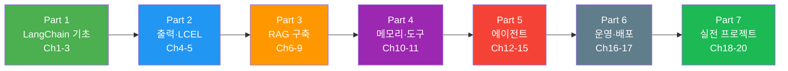

# 2026: LangChain 완전 정복

> LLM 애플리케이션 프레임워크의 모든 것 — **20챕터 106섹션** 튜토리얼

## 학습 로드맵

> **Part 3(RAG 구축)까지가 핵심 기초.** Part 4-5는 에이전트 심화, Part 6-7은 프로덕션과 실전 프로젝트입니다.

---

## Part 1: LangChain 기초 (Ch1-3, 입문)

**Ch1. LangChain 소개와 개발 환경 설정**
- [01. LLM 애플리케이션의 진화와 LangChain](01-langchain-소개와-개발-환경-설정/01-llm-애플리케이션의-진화와-langchain.md) · [02. LangChain 아키텍처 개요](01-langchain-소개와-개발-환경-설정/02-langchain-아키텍처-개요.md) · [03. 개발 환경 설정](01-langchain-소개와-개발-환경-설정/03-개발-환경-설정.md) · [04. 첫 번째 LangChain 애플리케이션](01-langchain-소개와-개발-환경-설정/04-첫-번째-langchain-애플리케이션.md) · [05. LangChain 생태계 탐색](01-langchain-소개와-개발-환경-설정/05-langchain-생태계-탐색.md)

**Ch2. LLM과 Chat Model 다루기**
- [01. ChatOpenAI 심화](02-llm과-chat-model-다루기/01-chatopenai-심화.md) · [02. 다중 프로바이더 연동](02-llm과-chat-model-다루기/02-다중-프로바이더-연동.md) · [03. 모델 호출 패턴](02-llm과-chat-model-다루기/03-모델-호출-패턴.md) · [04. 모델 폴백과 안정성](02-llm과-chat-model-다루기/04-모델-폴백과-안정성.md) · [05. 모델 캐싱과 성능 최적화](02-llm과-chat-model-다루기/05-모델-캐싱과-성능-최적화.md)

**Ch3. 프롬프트 엔지니어링과 템플릿**
- [01. ChatPromptTemplate 기초](03-프롬프트-엔지니어링과-템플릿/01-chatprompttemplate-기초.md) · [02. 고급 프롬프트 패턴](03-프롬프트-엔지니어링과-템플릿/02-고급-프롬프트-패턴.md) · [03. Few-shot 프롬프팅](03-프롬프트-엔지니어링과-템플릿/03-few-shot-프롬프팅.md) · [04. 프롬프트 관리와 LangChain Hub](03-프롬프트-엔지니어링과-템플릿/04-프롬프트-관리와-langchain-hub.md) · [05. 프롬프트 엔지니어링 실전 기법](03-프롬프트-엔지니어링과-템플릿/05-프롬프트-엔지니어링-실전-기법.md)

## Part 2: 구조화된 출력과 LCEL (Ch4-5, 초급)

**Ch4. 출력 파서와 구조화된 출력**
- [01. 출력 파서 기초](04-출력-파서와-구조화된-출력/01-출력-파서-기초.md) · [02. Pydantic 기반 구조화 출력](04-출력-파서와-구조화된-출력/02-pydantic-기반-구조화-출력.md) · [03. with_structured_output 활용](04-출력-파서와-구조화된-출력/03-with-structured-output-활용.md) · [04. 스트리밍과 부분 파싱](04-출력-파서와-구조화된-출력/04-스트리밍과-부분-파싱.md) · [05. 파싱 에러 복구와 자동 수정](04-출력-파서와-구조화된-출력/05-파싱-에러-복구와-자동-수정.md)

**Ch5. LCEL(LangChain Expression Language) 마스터**
- [01. LCEL 기초와 파이프 연산자](05-lcellangchain-expression-language-마스터/01-lcel-기초와-파이프-연산자.md) · [02. 핵심 Runnable 컴포넌트](05-lcellangchain-expression-language-마스터/02-핵심-runnable-컴포넌트.md) · [03. 조건 분기와 라우팅](05-lcellangchain-expression-language-마스터/03-조건-분기와-라우팅.md) · [04. 병렬 실행과 성능 최적화](05-lcellangchain-expression-language-마스터/04-병렬-실행과-성능-최적화.md) · [05. 체인 구성과 바인딩](05-lcellangchain-expression-language-마스터/05-체인-구성과-바인딩.md) · [06. 커스텀 Runnable 작성](05-lcellangchain-expression-language-마스터/06-커스텀-runnable-작성.md)

## Part 3: RAG 구축 (Ch6-9, 중급)

**Ch6. 문서 로더와 텍스트 분할**
- [01. 문서 로더 기초](06-문서-로더와-텍스트-분할/01-문서-로더-기초.md) · [02. 다양한 소스 로더](06-문서-로더와-텍스트-분할/02-다양한-소스-로더.md) · [03. 텍스트 분할 전략](06-문서-로더와-텍스트-분할/03-텍스트-분할-전략.md) · [04. 고급 텍스트 분할](06-문서-로더와-텍스트-분할/04-고급-텍스트-분할.md) · [05. 문서 처리 파이프라인 구축](06-문서-로더와-텍스트-분할/05-문서-처리-파이프라인-구축.md)

**Ch7. 임베딩과 벡터 스토어**
- [01. 텍스트 임베딩 이해](07-임베딩과-벡터-스토어/01-텍스트-임베딩-이해.md) · [02. 다양한 임베딩 모델](07-임베딩과-벡터-스토어/02-다양한-임베딩-모델.md) · [03. 벡터 스토어 구축 - FAISS와 Chroma](07-임베딩과-벡터-스토어/03-벡터-스토어-구축---faiss와-chroma.md) · [04. 프로덕션 벡터 스토어](07-임베딩과-벡터-스토어/04-프로덕션-벡터-스토어.md) · [05. 벡터 검색 최적화](07-임베딩과-벡터-스토어/05-벡터-검색-최적화.md)

**Ch8. 검색기(Retriever) 심화**
- [01. 검색기 기초](08-검색기retriever-심화/01-검색기-기초.md) · [02. 키워드와 앙상블 검색](08-검색기retriever-심화/02-키워드와-앙상블-검색.md) · [03. 멀티쿼리와 RAG Fusion](08-검색기retriever-심화/03-멀티쿼리와-rag-fusion.md) · [04. 컨텍스트 압축](08-검색기retriever-심화/04-컨텍스트-압축.md) · [05. 셀프 쿼리 검색기](08-검색기retriever-심화/05-셀프-쿼리-검색기.md)

**Ch9. RAG(Retrieval-Augmented Generation) 구축**
- [01. 기본 RAG 체인 구축](09-ragretrieval-augmented-generation-구축/01-기본-rag-체인-구축.md) · [02. RAG 프롬프트 최적화](09-ragretrieval-augmented-generation-구축/02-rag-프롬프트-최적화.md) · [03. 대화형 RAG](09-ragretrieval-augmented-generation-구축/03-대화형-rag.md) · [04. 고급 RAG 패턴](09-ragretrieval-augmented-generation-구축/04-고급-rag-패턴.md) · [05. RAG 평가와 개선](09-ragretrieval-augmented-generation-구축/05-rag-평가와-개선.md) · [06. 프로덕션 RAG 아키텍처](09-ragretrieval-augmented-generation-구축/06-프로덕션-rag-아키텍처.md)

## Part 4: 메모리와 도구 (Ch10-11, 중급)

**Ch10. 메모리와 대화 관리**
- [01. 메시지 히스토리 기초](10-메모리와-대화-관리/01-메시지-히스토리-기초.md) · [02. RunnableWithMessageHistory](10-메모리와-대화-관리/02-runnablewithmessagehistory.md) · [03. 영구 메시지 저장소](10-메모리와-대화-관리/03-영구-메시지-저장소.md) · [04. 메모리 최적화 전략](10-메모리와-대화-관리/04-메모리-최적화-전략.md) · [05. 멀티턴 대화 시스템 구축](10-메모리와-대화-관리/05-멀티턴-대화-시스템-구축.md)

**Ch11. 도구(Tools)와 함수 호출**
- [01. 도구 정의와 바인딩](11-도구tools와-함수-호출/01-도구-정의와-바인딩.md) · [02. 내장 도구 활용](11-도구tools와-함수-호출/02-내장-도구-활용.md) · [03. 도구 호출 처리](11-도구tools와-함수-호출/03-도구-호출-처리.md) · [04. 고급 도구 패턴](11-도구tools와-함수-호출/04-고급-도구-패턴.md) · [05. 안전한 도구 실행](11-도구tools와-함수-호출/05-안전한-도구-실행.md)

## Part 5: 에이전트 (Ch12-15, 중상급)

**Ch12. 에이전트(Agent) 기초**
- [01. 에이전트 개념과 ReAct 패턴](12-에이전트agent-기초/01-에이전트-개념과-react-패턴.md) · [02. create_react_agent로 에이전트 구축](12-에이전트agent-기초/02-create-react-agent로-에이전트-구축.md) · [03. AgentExecutor 설정과 제어](12-에이전트agent-기초/03-agentexecutor-설정과-제어.md) · [04. 에이전트 도구 설계](12-에이전트agent-기초/04-에이전트-도구-설계.md) · [05. 에이전트 디버깅과 모니터링](12-에이전트agent-기초/05-에이전트-디버깅과-모니터링.md)

**Ch13. LangGraph 기초**
- [01. LangGraph 소개와 핵심 개념](13-langgraph-기초/01-langgraph-소개와-핵심-개념.md) · [02. 첫 번째 LangGraph 에이전트](13-langgraph-기초/02-첫-번째-langgraph-에이전트.md) · [03. 조건부 엣지와 라우팅](13-langgraph-기초/03-조건부-엣지와-라우팅.md) · [04. 도구 호출 에이전트](13-langgraph-기초/04-도구-호출-에이전트.md) · [05. 상태 관리 심화](13-langgraph-기초/05-상태-관리-심화.md) · [06. 그래프 시각화와 디버깅](13-langgraph-기초/06-그래프-시각화와-디버깅.md)

**Ch14. LangGraph 고급 패턴**
- [01. Human-in-the-Loop 패턴](14-langgraph-고급-패턴/01-human-in-the-loop-패턴.md) · [02. 체크포인팅과 상태 영속성](14-langgraph-고급-패턴/02-체크포인팅과-상태-영속성.md) · [03. 서브그래프와 모듈화](14-langgraph-고급-패턴/03-서브그래프와-모듈화.md) · [04. 병렬 실행과 맵-리듀스](14-langgraph-고급-패턴/04-병렬-실행과-맵-리듀스.md) · [05. 스트리밍과 실시간 업데이트](14-langgraph-고급-패턴/05-스트리밍과-실시간-업데이트.md) · [06. 에러 핸들링과 복구](14-langgraph-고급-패턴/06-에러-핸들링과-복구.md)

**Ch15. 멀티 에이전트 시스템**
- [01. 멀티 에이전트 아키텍처 패턴](15-멀티-에이전트-시스템/01-멀티-에이전트-아키텍처-패턴.md) · [02. 감독자 기반 멀티 에이전트](15-멀티-에이전트-시스템/02-감독자-기반-멀티-에이전트.md) · [03. 전문화된 에이전트 설계](15-멀티-에이전트-시스템/03-전문화된-에이전트-설계.md) · [04. 에이전트 간 통신](15-멀티-에이전트-시스템/04-에이전트-간-통신.md) · [05. 멀티 에이전트 최적화](15-멀티-에이전트-시스템/05-멀티-에이전트-최적화.md)

## Part 6: 운영과 배포 (Ch16-17, 상급)

**Ch16. 콜백과 관찰 가능성**
- [01. 콜백 시스템 이해](16-콜백과-관찰-가능성/01-콜백-시스템-이해.md) · [02. 커스텀 콜백 핸들러](16-콜백과-관찰-가능성/02-커스텀-콜백-핸들러.md) · [03. LangSmith 트레이싱 심화](16-콜백과-관찰-가능성/03-langsmith-트레이싱-심화.md) · [04. LLM 애플리케이션 평가](16-콜백과-관찰-가능성/04-llm-애플리케이션-평가.md) · [05. 프로덕션 모니터링](16-콜백과-관찰-가능성/05-프로덕션-모니터링.md)

**Ch17. LangServe와 API 배포**
- [01. LangServe 기초](17-langserve와-api-배포/01-langserve-기초.md) · [02. FastAPI 통합과 서버 구성](17-langserve와-api-배포/02-fastapi-통합과-서버-구성.md) · [03. 인증과 보안](17-langserve와-api-배포/03-인증과-보안.md) · [04. RemoteRunnable 클라이언트](17-langserve와-api-배포/04-remoterunnable-클라이언트.md) · [05. 배포와 운영](17-langserve와-api-배포/05-배포와-운영.md)

## Part 7: 실전 프로젝트 (Ch18-20, 실무)

**Ch18. 실전 프로젝트 1: 지능형 문서 QA 시스템**
- [01. 프로젝트 설계와 아키텍처](18-실전-프로젝트-1-지능형-문서-qa-시스템/01-프로젝트-설계와-아키텍처.md) · [02. 문서 수집과 인덱싱 파이프라인](18-실전-프로젝트-1-지능형-문서-qa-시스템/02-문서-수집과-인덱싱-파이프라인.md) · [03. 검색과 생성 파이프라인](18-실전-프로젝트-1-지능형-문서-qa-시스템/03-검색과-생성-파이프라인.md) · [04. 대화 관리와 메모리](18-실전-프로젝트-1-지능형-문서-qa-시스템/04-대화-관리와-메모리.md) · [05. Streamlit UI 구축](18-실전-프로젝트-1-지능형-문서-qa-시스템/05-streamlit-ui-구축.md) · [06. 테스트와 배포](18-실전-프로젝트-1-지능형-문서-qa-시스템/06-테스트와-배포.md)

**Ch19. 실전 프로젝트 2: AI 에이전트 기반 업무 자동화**
- [01. 에이전트 아키텍처 설계](19-실전-프로젝트-2-ai-에이전트-기반-업무-자동화/01-에이전트-아키텍처-설계.md) · [02. 외부 서비스 도구 구현](19-실전-프로젝트-2-ai-에이전트-기반-업무-자동화/02-외부-서비스-도구-구현.md) · [03. 전문 에이전트 구현](19-실전-프로젝트-2-ai-에이전트-기반-업무-자동화/03-전문-에이전트-구현.md) · [04. 워크플로우 오케스트레이션](19-실전-프로젝트-2-ai-에이전트-기반-업무-자동화/04-워크플로우-오케스트레이션.md) · [05. 안전장치와 사용자 승인](19-실전-프로젝트-2-ai-에이전트-기반-업무-자동화/05-안전장치와-사용자-승인.md) · [06. 통합 테스트와 배포](19-실전-프로젝트-2-ai-에이전트-기반-업무-자동화/06-통합-테스트와-배포.md)

**Ch20. 프로덕션 베스트 프랙티스와 미래 전망**
- [01. 프로덕션 보안](20-프로덕션-베스트-프랙티스와-미래-전망/01-프로덕션-보안.md) · [02. 비용 최적화](20-프로덕션-베스트-프랙티스와-미래-전망/02-비용-최적화.md) · [03. 확장성과 성능](20-프로덕션-베스트-프랙티스와-미래-전망/03-확장성과-성능.md) · [04. CI/CD와 LLMOps](20-프로덕션-베스트-프랙티스와-미래-전망/04-cicd와-llmops.md) · [05. 미래 전망과 지속적 학습](20-프로덕션-베스트-프랙티스와-미래-전망/05-미래-전망과-지속적-학습.md)

---

**Resources**: [핵심 논문 목록](resources/essential-papers.md) · [데이터셋 가이드](resources/datasets.md) · [도구 모음](resources/tools.md)

**기술 스택**: Python · LangChain v1 · LCEL · LangGraph · LangSmith · LangServe · OpenAI API · ChromaDB · FAISS · Pinecone · FastAPI · Streamlit

## 라이선스

MIT License
